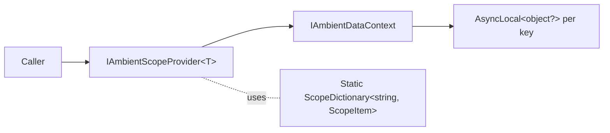
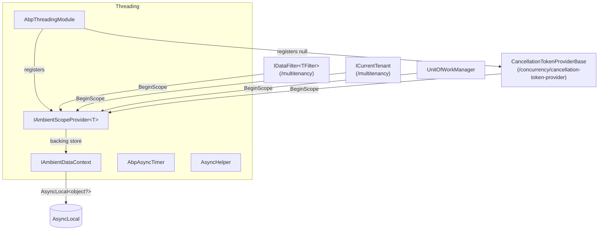

ABP's threading layer is intentionally small. It exists for two reasons: bridging legacy synchronous call sites into the async world without deadlocking, and giving every other ABP subsystem (`IUnitOfWork`, `ICurrentTenant`, `ICurrentPrincipalAccessor`, `IDataFilter`…) a uniform way to attach typed values to the current async flow. This page walks through every public type in `Volo.Abp.Threading` plus the `AsyncHelper` that lives in `Volo.Abp.Core`, citing the real source so you can verify each behaviour against the framework.

If you are looking at this layer because of cancellation propagation, skip ahead to [cancellation token provider](/concurrency/cancellation-token-provider) — the same `IAmbientScopeProvider<T>` machinery documented here is what powers `CancellationTokenProviderBase.Use`. The clock and timezone services that depend on these primitives are covered in [timing and clock](/concurrency/timing-and-clock).

## File inventory

The two assemblies involved sit in `framework/src/Volo.Abp.Threading` and `framework/src/Volo.Abp.Core/Volo/Abp/Threading`.

| File | Role |
| --- | --- |
| `Volo.Abp.Threading/AbpThreadingModule.cs` | Registers `NullCancellationTokenProvider.Instance` and the open generic `AmbientDataContextAmbientScopeProvider<>` as singletons. |
| `Volo.Abp.Threading/IAmbientScopeProvider.cs` | Two-method contract: `GetValue(contextKey)` and `BeginScope(contextKey, value)`. |
| `Volo.Abp.Threading/IAmbientDataContext.cs` | Storage abstraction underneath the scope provider — `SetData/GetData` by string key. |
| `Volo.Abp.Threading/AsyncLocalAmbientDataContext.cs` | Default backing store; one `AsyncLocal<object?>` per key. |
| `Volo.Abp.Threading/AmbientDataContextAmbientScopeProvider.cs` | Stack-of-scopes implementation built on top of any `IAmbientDataContext`. |
| `Volo.Abp.Threading/AbpAsyncTimer.cs` | Non-reentrant async timer used by background workers. |
| `Volo.Abp.Threading/AbpTimer.cs` | Synchronous companion (rarely needed in new code). |
| `Volo.Abp.Threading/IRunnable.cs` | Marker for "anything that can be started/stopped". |
| `Volo.Abp.Threading/AsyncLocalSimpleScopeExtensions.cs` | Helper for `AsyncLocal<T>` push/pop scopes. |
| `Volo.Abp.Core/Volo/Abp/Threading/AsyncHelper.cs` | `RunSync` and the `IsAsync`/`UnwrapTask` reflection helpers. |
| `Volo.Abp.Core/Volo/Abp/Threading/OneTimeRunner.cs` | Idempotent "do once" guard. |
| `Volo.Abp.Core/Volo/Abp/Threading/AsyncOneTimeRunner.cs` | Async variant of the same. |
| `Volo.Abp.Core/Volo/Abp/Threading/SemaphoreSlimExtensions.cs` | `LockAsync` returning an `IDisposable` release token. |
| `Volo.Abp.Core/Volo/Abp/Threading/LockExtensions.cs` | Same idea for `object` monitors. |

## AbpThreadingModule

The module itself is a single registration. Everything else in the layer is either configured by it or used directly through `new` (the timer) and static instances (`NullCancellationTokenProvider`, `SimpleGuidGenerator`).

```csharp framework/src/Volo.Abp.Threading/Volo/Abp/Threading/AbpThreadingModule.cs
public class AbpThreadingModule : AbpModule
{
    public override void ConfigureServices(ServiceConfigurationContext context)
    {
        context.Services.AddSingleton<ICancellationTokenProvider>(NullCancellationTokenProvider.Instance);
        context.Services.AddSingleton(typeof(IAmbientScopeProvider<>), typeof(AmbientDataContextAmbientScopeProvider<>));
    }
}
```

Two things to notice:

<Note>
The default `ICancellationTokenProvider` is the null provider, not the ASP.NET Core one. Web hosts replace it through `[Dependency(ReplaceServices = true)]` on `HttpContextCancellationTokenProvider`. See [cancellation token provider](/concurrency/cancellation-token-provider) for the replacement story.
</Note>

`AmbientDataContextAmbientScopeProvider<>` is registered as an *open generic singleton*. Any consumer that asks for `IAmbientScopeProvider<MyContextValue>` gets the same singleton instance per closed type — and that singleton internally talks to whatever `IAmbientDataContext` is registered (by default `AsyncLocalAmbientDataContext`).



## AsyncHelper.RunSync

`AsyncHelper` predates the `Volo.Abp.Threading` package — it lives in `Volo.Abp.Core` because every other layer needs it. Its job is letting you call asynchronous APIs from places that cannot be made `async` (constructors, framework callbacks, `Main` in older .NET hosts, the synchronous side of an MVC filter when you cannot refactor it).

```csharp framework/src/Volo.Abp.Core/Volo/Abp/Threading/AsyncHelper.cs
public static class AsyncHelper
{
    public static TResult RunSync<TResult>(Func<Task<TResult>> func)
    {
        return AsyncContext.Run(func);
    }

    public static void RunSync(Func<Task> action)
    {
        AsyncContext.Run(action);
    }

    public static bool IsAsync([NotNull] this MethodInfo method)
    {
        Check.NotNull(method, nameof(method));
        return method.ReturnType.IsTaskOrTaskOfT();
    }

    public static Type UnwrapTask([NotNull] Type type)
    {
        Check.NotNull(type, nameof(type));
        if (type == typeof(Task)) return typeof(void);
        if (type.IsTaskOfT()) return type.GenericTypeArguments[0];
        return type;
    }
}
```

`RunSync` delegates to `Nito.AsyncEx.AsyncContext.Run`. The `AsyncContext` installs a single-threaded `SynchronizationContext` for the duration of the call, pumps continuations on the calling thread, and returns when the root task completes. That is critical: a naïve `task.GetAwaiter().GetResult()` deadlocks under any `SynchronizationContext` that posts continuations back to the original thread (the classic ASP.NET classic / WinForms hang). `AsyncContext.Run` does not.

<Warning>
`AsyncHelper.RunSync` is a compatibility tool, not a performance tool. Each call spins up its own `SynchronizationContext` and blocks one thread for the full duration of the task. Prefer making the call site `async` whenever you can.
</Warning>

`IsAsync` and `UnwrapTask` are used by the dynamic-proxy interceptor chain to decide whether `AbpInterceptor.InterceptAsync` should be invoked synchronously or the result should be awaited. The convention check is intentionally minimal: a method is "async" if its return type is `Task` or `Task<>`. `ValueTask` is **not** treated as async by this helper — methods that return `ValueTask` cannot be intercepted by ABP's async interception path.

## IAmbientScopeProvider&lt;T&gt;

`IAmbientScopeProvider<T>` is the canonical primitive used across ABP for "push a value onto an ambient stack, dispose to pop it back". It is two methods:

```csharp framework/src/Volo.Abp.Threading/Volo/Abp/Threading/IAmbientScopeProvider.cs
public interface IAmbientScopeProvider<T>
{
    T? GetValue(string contextKey);

    IDisposable BeginScope(string contextKey, T value);
}
```

A "context key" is a string that namespaces unrelated stacks. The framework uses constants such as `CancellationTokenProviderBase.CancellationTokenOverrideContextKey` (`"Volo.Abp.Threading.CancellationToken.Override"`); your own code should do the same so two unrelated subsystems do not collide.

### AmbientDataContextAmbientScopeProvider — the default

The default implementation lives next door and is the one wired in `AbpThreadingModule`:

```csharp framework/src/Volo.Abp.Threading/Volo/Abp/Threading/AmbientDataContextAmbientScopeProvider.cs
public class AmbientDataContextAmbientScopeProvider<T> : IAmbientScopeProvider<T>
{
    private static readonly ConcurrentDictionary<string, ScopeItem> ScopeDictionary
        = new ConcurrentDictionary<string, ScopeItem>();

    private readonly IAmbientDataContext _dataContext;

    public T? GetValue(string contextKey)
    {
        var item = GetCurrentItem(contextKey);
        if (item == null) return default;
        return item.Value;
    }

    public IDisposable BeginScope(string contextKey, T value)
    {
        var item = new ScopeItem(value, GetCurrentItem(contextKey));

        if (!ScopeDictionary.TryAdd(item.Id, item))
        {
            throw new AbpException("Can not add item! ScopeDictionary.TryAdd returns false!");
        }

        _dataContext.SetData(contextKey, item.Id);

        return new DisposeAction<...>(static state =>
        {
            var (scopeDictionary, item, dataContext, contextKey) = state;
            scopeDictionary.TryRemove(item.Id, out item);
            if (item == null) return;

            if (item.Outer == null) { dataContext.SetData(contextKey, null); return; }
            dataContext.SetData(contextKey, item.Outer.Id);
        }, (ScopeDictionary, item, _dataContext, contextKey));
    }

    private ScopeItem? GetCurrentItem(string contextKey)
    {
        return _dataContext.GetData(contextKey) is string objKey
            ? ScopeDictionary.GetOrDefault(objKey)
            : null;
    }
}
```

The cleverness is in the design: instead of putting the *value* itself into the `AsyncLocal` (which would force `T` to be a reference type and would not let nested scopes "pop" reliably across async boundaries), it stores only a **Guid string id** in the ambient context, and the actual `ScopeItem` (value + reference to its outer scope) lives in a process-wide `ConcurrentDictionary`. Disposing the scope removes the item from the dictionary and sets the ambient context back to its `Outer.Id` — which is how nested `BeginScope` calls correctly form a stack.

Each closed generic type gets its own `ScopeDictionary` because the field is `static` on the generic class.

### IAmbientDataContext and AsyncLocalAmbientDataContext

```csharp framework/src/Volo.Abp.Threading/Volo/Abp/Threading/IAmbientDataContext.cs
public interface IAmbientDataContext
{
    void SetData(string key, object? value);
    object? GetData(string key);
}
```

```csharp framework/src/Volo.Abp.Threading/Volo/Abp/Threading/AsyncLocalAmbientDataContext.cs
public class AsyncLocalAmbientDataContext : IAmbientDataContext, ISingletonDependency
{
    private static readonly ConcurrentDictionary<string, AsyncLocal<object?>> AsyncLocalDictionary
        = new ConcurrentDictionary<string, AsyncLocal<object?>>();

    public void SetData(string key, object? value)
    {
        var asyncLocal = AsyncLocalDictionary.GetOrAdd(key, _ => new AsyncLocal<object?>());
        asyncLocal.Value = value;
    }

    public object? GetData(string key)
    {
        var asyncLocal = AsyncLocalDictionary.GetOrAdd(key, _ => new AsyncLocal<object?>());
        return asyncLocal.Value;
    }
}
```

One `AsyncLocal<object?>` per context key, lazily created. Because `AsyncLocal` flows through `await` continuations, `Task.Run`, `Parallel.ForEachAsync`, and most other async boundaries, your scopes follow the logical call chain — not the OS thread.

<Tip>
You can replace `IAmbientDataContext` to integrate with a different propagation mechanism (e.g. an OpenTelemetry baggage context, or a per-request `IHttpContextAccessor.Items` slot). Re-register it with `[Dependency(ReplaceServices = true)]` and every `IAmbientScopeProvider<T>` will follow.
</Tip>

### Typical scope usage

The scope provider is rarely used directly. Most subsystems wrap it. For example, the cancellation token override:

```csharp
public IDisposable Use(CancellationToken cancellationToken)
{
    return CancellationTokenOverrideScopeProvider.BeginScope(
        CancellationTokenOverrideContextKey,
        new CancellationTokenOverride(cancellationToken));
}
```

…and `Volo.Abp.Data.DataFilter<TFilter>`, `Volo.Abp.MultiTenancy.CurrentTenant`, `Volo.Abp.Uow.UnitOfWorkManager.Begin()` all follow the same `BeginScope` → `IDisposable` → "scope ends" pattern.

## AbpAsyncTimer

Background workers (`AsyncPeriodicBackgroundWorkerBase`, the outbox poller, several queue consumers) all use `AbpAsyncTimer` rather than `System.Threading.Timer` directly. The reason is in its XML comment: it **guarantees non-reentrance**. A long-running tick does not stack up callbacks behind it.

```csharp framework/src/Volo.Abp.Threading/Volo/Abp/Threading/AbpAsyncTimer.cs
/// <summary>
/// A robust timer implementation that ensures no overlapping occurs.
/// It waits exactly specified Period between ticks.
/// </summary>
public class AbpAsyncTimer : ITransientDependency
{
    public Func<AbpAsyncTimer, Task> Elapsed = _ => Task.CompletedTask;

    /// <summary>Task period of timer (as milliseconds).</summary>
    public int Period { get; set; }

    /// <summary>
    /// Indicates whether timer raises Elapsed event on Start method of Timer for once.
    /// Default: False.
    /// </summary>
    public bool RunOnStart { get; set; }

    public ILogger<AbpAsyncTimer> Logger { get; set; }
    public IExceptionNotifier ExceptionNotifier { get; set; }

    private readonly Timer _taskTimer;
    private volatile bool _performingTasks;
    private volatile bool _isRunning;
    // ...
}
```

`Start` and `Stop` are deliberately synchronous. They take an unused `CancellationToken` parameter for API symmetry, and use a `lock (_taskTimer)` to flip the `_isRunning` flag.

```csharp framework/src/Volo.Abp.Threading/Volo/Abp/Threading/AbpAsyncTimer.cs
public void Start(CancellationToken cancellationToken = default)
{
    if (Period <= 0)
    {
        throw new AbpException("Period should be set before starting the timer!");
    }

    lock (_taskTimer)
    {
        _taskTimer.Change(RunOnStart ? 0 : Period, Timeout.Infinite);
        _isRunning = true;
    }
}

public void Stop(CancellationToken cancellationToken = default)
{
    lock (_taskTimer)
    {
        _taskTimer.Change(Timeout.Infinite, Timeout.Infinite);
        while (_performingTasks)
        {
            Monitor.Wait(_taskTimer);
        }
        _isRunning = false;
    }
}
```

The interesting bit is the callback. The timer is always rescheduled with `Timeout.Infinite` as the period, so it never re-fires by itself; instead, each tick *manually* re-arms the timer **after** the previous `Elapsed` task has completed:

```csharp framework/src/Volo.Abp.Threading/Volo/Abp/Threading/AbpAsyncTimer.cs
private async Task Timer_Elapsed()
{
    try
    {
        await Elapsed(this);
    }
    catch (Exception ex)
    {
        Logger.LogException(ex);
        await ExceptionNotifier.NotifyAsync(ex);
    }
    finally
    {
        lock (_taskTimer)
        {
            _performingTasks = false;
            if (_isRunning)
            {
                _taskTimer.Change(Period, Timeout.Infinite);
            }

            Monitor.Pulse(_taskTimer);
        }
    }
}
```

Three properties fall out of this design:

<CardGroup cols={2}>
  <Card title="Non-overlapping ticks">
    A new tick is only scheduled when the previous one's task has completed, so even with a 100&nbsp;ms `Period`, a slow tick that takes 5&nbsp;s will not pile up four more ticks behind it.
  </Card>
  <Card title="Clean Stop">
    `Stop` blocks via `Monitor.Wait` until any in-flight tick finishes. When `Stop` returns, no more `Elapsed` invocations are possible.
  </Card>
  <Card title="Errors are observed">
    Every exception thrown from `Elapsed` is routed both to `ILogger` and to `IExceptionNotifier`, so subscribers (see [exception handling](/utilities/exception-handling)) receive timer failures without you having to wrap your callback.
  </Card>
  <Card title="No constructor injection of Elapsed">
    `Elapsed` is a public mutable field. Background workers assign it during `StartAsync` rather than via DI; this lets the same `AbpAsyncTimer` instance be reused with different callbacks.
  </Card>
</CardGroup>

### Sample: a custom periodic worker

```csharp Example
public class CleanupWorker : BackgroundService
{
    private readonly AbpAsyncTimer _timer;
    private readonly IServiceProvider _services;

    public CleanupWorker(AbpAsyncTimer timer, IServiceProvider services)
    {
        _timer = timer;
        _services = services;
    }

    protected override Task ExecuteAsync(CancellationToken stoppingToken)
    {
        _timer.Period = 60_000;
        _timer.Elapsed = async _ =>
        {
            using var scope = _services.CreateScope();
            var cleaner = scope.ServiceProvider.GetRequiredService<IExpiredTokenCleaner>();
            await cleaner.RunAsync();
        };
        _timer.Start(stoppingToken);

        stoppingToken.Register(() => _timer.Stop());
        return Task.CompletedTask;
    }
}
```

Because `AbpAsyncTimer` is `ITransientDependency`, each consumer gets its own instance. If you accidentally share an instance and assign `Elapsed` twice, the second assignment replaces the first — `Elapsed` is a field, not an event.

## OneTimeRunner and AsyncOneTimeRunner

Two small helpers worth mentioning. They sit in `Volo.Abp.Core/Volo/Abp/Threading` and exist to make "initialize exactly once, lazily" both thread-safe and async-safe.

| Helper | When to reach for it |
| --- | --- |
| `OneTimeRunner` | Synchronous initializers in module configuration, e.g. registering an `ApplicationPart` only the first time a module is depended on. |
| `AsyncOneTimeRunner` | Async initializers — typically loading a remote configuration document on first request. |

Both internally use a `SemaphoreSlim` plus a `volatile bool` flag, so the second-and-subsequent callers go through a check that costs only a memory read once the action has run.

## Threading and the wider ABP stack



Almost every "ambient" capability ABP exposes — the cancellation token override, data filters, the current tenant, the current principal, the unit of work — funnels through `IAmbientScopeProvider<T>`. Understanding `BeginScope/IDisposable` here is what makes the rest of the framework's behaviour predictable across `Task.Run`, `Parallel.ForEachAsync`, and fire-and-forget continuations.

## See also

<CardGroup cols={2}>
  <Card title="Cancellation token provider" href="/concurrency/cancellation-token-provider">
    How `Use(token)` builds on the scope provider documented here.
  </Card>
  <Card title="Timing and clock" href="/concurrency/timing-and-clock">
    `IClock`, `AbpClockOptions`, and the timezone provider.
  </Card>
  <Card title="Exception handling" href="/utilities/exception-handling">
    The `IExceptionNotifier` the timer reports unhandled errors to.
  </Card>
  <Card title="Module lifecycle" href="/modularity">
    Where modules like `AbpThreadingModule` plug into application startup.
  </Card>
</CardGroup>
