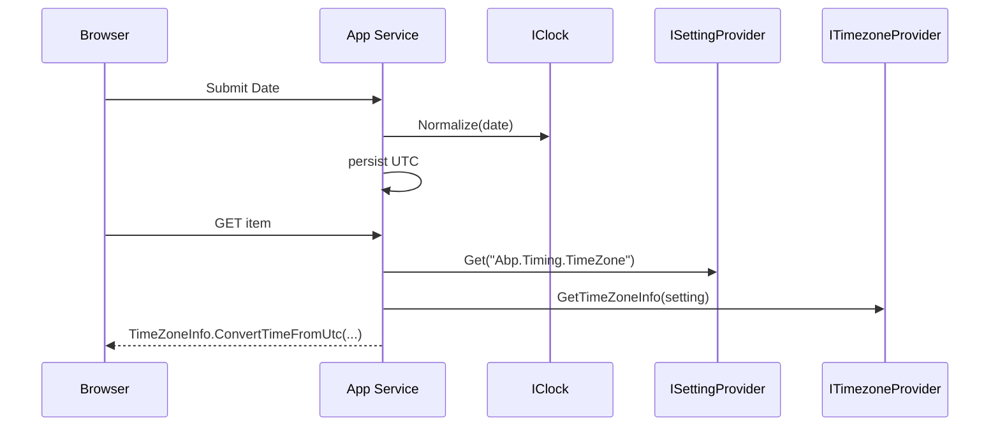

`DateTime.Now` is the single most common source of "works on my machine" bugs in enterprise applications. ABP wraps the clock behind `IClock` so the kind of `DateTime` your code produces (`Utc`, `Local`, or `Unspecified`) is a deliberate, configurable choice — and so all infrastructure that persists or transports `DateTime` values can route them through the same `Normalize` call. This page covers `Volo.Abp.Timing` in full: the clock interface, the default implementation, the configuration options, the timezone provider, the timing setting, and the `DisableDateTimeNormalizationAttribute` opt-out.

## File inventory

Everything below lives in `framework/src/Volo.Abp.Timing/Volo/Abp/Timing`.

| File | Role |
| --- | --- |
| `IClock.cs` | `Now`, `Kind`, `SupportsMultipleTimezone`, `Normalize(DateTime)`. |
| `Clock.cs` | Default `ITransientDependency` implementation backed by `AbpClockOptions`. |
| `AbpClockOptions.cs` | One property: `DateTimeKind Kind` (default `Unspecified`). |
| `ITimezoneProvider.cs` | Lookup APIs for Windows ↔ IANA timezone identifiers. |
| `TZConvertTimezoneProvider.cs` | Default implementation backed by the `TZConvert` library. |
| `TimeZoneHelper.cs` | Static helpers for formatting offsets. |
| `TimingSettingNames.cs` | The `Abp.Timing.TimeZone` setting key. |
| `TimingSettingProvider.cs` | Registers the timezone setting (default `"UTC"`, visible to clients). |
| `DisableDateTimeNormalizationAttribute.cs` | Opts a class, property, or parameter out of EF / JSON normalization. |
| `AbpTimingModule.cs` | Wires the module: localization resource, embedded files, depends on `AbpSettingsModule`. |

## IClock

The interface is intentionally minimal:

```csharp framework/src/Volo.Abp.Timing/Volo/Abp/Timing/IClock.cs
public interface IClock
{
    /// <summary>Gets Now.</summary>
    DateTime Now { get; }

    /// <summary>Gets kind.</summary>
    DateTimeKind Kind { get; }

    /// <summary>Is that provider supports multiple time zone.</summary>
    bool SupportsMultipleTimezone { get; }

    /// <summary>Normalizes given DateTime.</summary>
    DateTime Normalize(DateTime dateTime);
}
```

| Member | Use |
| --- | --- |
| `Now` | The "current" `DateTime`, kind-aware. Use this instead of `DateTime.Now` or `DateTime.UtcNow` so tests and the configured clock kind agree. |
| `Kind` | The `DateTimeKind` chosen via `AbpClockOptions`. |
| `SupportsMultipleTimezone` | `true` only when `Kind == Utc`. Used by features that need to convert per-user; see [multitenancy](/multitenancy) for the typical per-tenant timezone story. |
| `Normalize(dateTime)` | The single normalization point — call this on every `DateTime` you read from a wire or store, and on every `DateTime` you are about to persist. |

## Clock — the default implementation

```csharp framework/src/Volo.Abp.Timing/Volo/Abp/Timing/Clock.cs
public class Clock : IClock, ITransientDependency
{
    protected AbpClockOptions Options { get; }

    public Clock(IOptions<AbpClockOptions> options)
    {
        Options = options.Value;
    }

    public virtual DateTime Now
        => Options.Kind == DateTimeKind.Utc ? DateTime.UtcNow : DateTime.Now;

    public virtual DateTimeKind Kind => Options.Kind;

    public virtual bool SupportsMultipleTimezone
        => Options.Kind == DateTimeKind.Utc;

    public virtual DateTime Normalize(DateTime dateTime)
    {
        if (Kind == DateTimeKind.Unspecified || Kind == dateTime.Kind)
        {
            return dateTime;
        }

        if (Kind == DateTimeKind.Local && dateTime.Kind == DateTimeKind.Utc)
        {
            return dateTime.ToLocalTime();
        }

        if (Kind == DateTimeKind.Utc && dateTime.Kind == DateTimeKind.Local)
        {
            return dateTime.ToUniversalTime();
        }

        return DateTime.SpecifyKind(dateTime, Kind);
    }
}
```

Three behaviours are encoded here, and they are worth understanding precisely because the same logic runs in the EF Core value converter, in MongoDB serializers, and in the system text JSON converter that ABP registers:

<Steps>
  <Step title="Now is kind-driven">
    `Now` returns `DateTime.UtcNow` only when `Kind == Utc`. For `Local` or `Unspecified` it returns `DateTime.Now` — which means the same source line gives wall-clock time during local development and UTC in a production deployment configured with `Kind = Utc`.
  </Step>
  <Step title="Normalize is a no-op when Kind is Unspecified">
    The first branch short-circuits the entire method when `Kind == Unspecified`. That is the default. So if you do not opt in to either UTC or local kind, ABP **does not touch** the `DateTimeKind` of your values — they round-trip exactly as you wrote them.
  </Step>
  <Step title="Cross-kind conversion is automatic">
    When `Kind` is `Local` or `Utc`, the method actively converts — `ToLocalTime`, `ToUniversalTime`, or `SpecifyKind` if both sides agree on kind but the original is `Unspecified`. That means a `DateTime` you persisted with `DateTimeKind.Utc` and read back as `Unspecified` (which is what raw `DateTime` columns return) becomes correctly tagged again.
  </Step>
</Steps>

## AbpClockOptions

```csharp framework/src/Volo.Abp.Timing/Volo/Abp/Timing/AbpClockOptions.cs
public class AbpClockOptions
{
    /// <summary>
    /// Default: <see cref="DateTimeKind.Unspecified"/>
    /// </summary>
    public DateTimeKind Kind { get; set; }

    public AbpClockOptions()
    {
        Kind = DateTimeKind.Unspecified;
    }
}
```

One setting, one default. To make a project UTC-everywhere, configure it from any module:

```csharp Example
public override void ConfigureServices(ServiceConfigurationContext context)
{
    Configure<AbpClockOptions>(options =>
    {
        options.Kind = DateTimeKind.Utc;
    });
}
```

<Warning>
Changing `AbpClockOptions.Kind` is a system-wide decision and must be made *before* you persist data. If you have existing rows written with `Unspecified` kind and flip to `Utc`, the EF Core normalization layer will treat those rows as if they were already UTC — which is fine if the wall-clock value really was UTC, but corrupts the data otherwise. Decide once, document it, and stick to it.
</Warning>

The matrix below summarises what `IClock.Normalize` does for each combination:

| `Options.Kind` | Input `dateTime.Kind` | Result |
| --- | --- | --- |
| `Unspecified` | any | returned unchanged |
| `Utc` | `Utc` | returned unchanged |
| `Utc` | `Local` | converted via `ToUniversalTime()` |
| `Utc` | `Unspecified` | `SpecifyKind(value, Utc)` — assumes value already represents UTC |
| `Local` | `Local` | returned unchanged |
| `Local` | `Utc` | converted via `ToLocalTime()` |
| `Local` | `Unspecified` | `SpecifyKind(value, Local)` — assumes value already represents local |

## DisableDateTimeNormalizationAttribute

Sometimes a single property must not be normalized — for example, a "scheduled at" column that represents a literal floating wall-clock time that has no associated timezone. ABP exposes an opt-out marker:

```csharp framework/src/Volo.Abp.Timing/Volo/Abp/Timing/DisableDateTimeNormalizationAttribute.cs
[AttributeUsage(AttributeTargets.Class | AttributeTargets.Property | AttributeTargets.Parameter)]
public class DisableDateTimeNormalizationAttribute : Attribute
{
}
```

It is a pure marker — it has no payload. The EF Core, MongoDB, and JSON layers that integrate with `IClock` check `[DisableDateTimeNormalization]` (via reflection on the declaring class, property, or parameter) and skip the call to `IClock.Normalize` when present. Use it sparingly: a property without normalization breaks the "kinds always agree" invariant the rest of the codebase relies on.

## ITimezoneProvider

UTC-as-storage is only useful if you can render values back in the user's local time. That requires mapping between Windows time-zone IDs (`"W. Europe Standard Time"`) and IANA names (`"Europe/Berlin"`). `ITimezoneProvider` is the abstraction:

```csharp framework/src/Volo.Abp.Timing/Volo/Abp/Timing/ITimezoneProvider.cs
public interface ITimezoneProvider
{
    List<NameValue> GetWindowsTimezones();

    List<NameValue> GetIanaTimezones();

    string WindowsToIana(string windowsTimeZoneId);

    string IanaToWindows(string ianaTimeZoneName);

    TimeZoneInfo GetTimeZoneInfo(string windowsOrIanaTimeZoneId);
}
```

| Method | Use case |
| --- | --- |
| `GetWindowsTimezones` / `GetIanaTimezones` | Building drop-down lists in admin UIs. Each entry is a `NameValue` with the same string in both slots (the helper does not pre-render offsets — that is what `TimeZoneHelper` is for). |
| `WindowsToIana` / `IanaToWindows` | Cross-platform persistence: store IANA on the wire, deal in Windows IDs inside `TimeZoneInfo.FindSystemTimeZoneById` on Windows hosts. |
| `GetTimeZoneInfo` | Accepts either flavour and gives back a `TimeZoneInfo`. |

### TZConvertTimezoneProvider — the default

```csharp framework/src/Volo.Abp.Timing/Volo/Abp/Timing/TZConvertTimezoneProvider.cs
public class TZConvertTimezoneProvider : ITimezoneProvider, ITransientDependency
{
    public List<NameValue> GetWindowsTimezones()
        => TZConvert.KnownWindowsTimeZoneIds.OrderBy(x => x)
            .Select(x => new NameValue(x, x)).ToList();

    public List<NameValue> GetIanaTimezones()
        => TZConvert.KnownIanaTimeZoneNames.OrderBy(x => x)
            .Select(x => new NameValue(x, x)).ToList();

    public string WindowsToIana(string windowsTimeZoneId)
        => TZConvert.WindowsToIana(windowsTimeZoneId);

    public string IanaToWindows(string ianaTimeZoneName)
        => TZConvert.IanaToWindows(ianaTimeZoneName);

    public TimeZoneInfo GetTimeZoneInfo(string windowsOrIanaTimeZoneId)
        => TZConvert.GetTimeZoneInfo(windowsOrIanaTimeZoneId);
}
```

It delegates to the [TimeZoneConverter](https://github.com/mattjohnsonpint/TimeZoneConverter) library. That library bundles the CLDR mapping so the same code works on Windows (where `TimeZoneInfo` speaks Windows IDs natively) and Linux / macOS (where it speaks IANA), without you having to branch on the host OS.

### TimeZoneHelper — rendering with offset

When you display timezones to humans, you almost always want `"Europe/Berlin (+01:00)"` rather than `"Europe/Berlin"`. The helper is reused inside `ApplicationConfigurationAppService` for exactly that:

```csharp framework/src/Volo.Abp.Timing/Volo/Abp/Timing/TimeZoneHelper.cs
public static class TimeZoneHelper
{
    public static List<NameValue> GetTimezones(List<NameValue> timezones)
    {
        return timezones
            .OrderBy(x => x.Name)
            .Select(x => new NameValue(
                $"{x.Name} ({GetTimezoneOffset(TZConvert.GetTimeZoneInfo(x.Name))})",
                x.Name))
            .ToList();
    }

    public static string GetTimezoneOffset(TimeZoneInfo timeZoneInfo)
    {
        if (timeZoneInfo.BaseUtcOffset < TimeSpan.Zero)
        {
            return "-" + timeZoneInfo.BaseUtcOffset.ToString(@"hh\:mm");
        }

        return "+" + timeZoneInfo.BaseUtcOffset.ToString(@"hh\:mm");
    }
}
```

<Note>
`GetTimezoneOffset` uses `BaseUtcOffset`, not the *current* offset including DST. The display name reflects the standard-time offset; the actual conversion logic still uses full DST rules. Keep that in mind when building UIs around it.
</Note>

## The Abp.Timing.TimeZone setting

The framework ships a single setting:

```csharp framework/src/Volo.Abp.Timing/Volo/Abp/Timing/TimingSettingNames.cs
public static class TimingSettingNames
{
    public const string TimeZone = "Abp.Timing.TimeZone";
}
```

…and its definition:

```csharp framework/src/Volo.Abp.Timing/Volo/Abp/Timing/TimingSettingProvider.cs
public class TimingSettingProvider : SettingDefinitionProvider
{
    public override void Define(ISettingDefinitionContext context)
    {
        context.Add(
            new SettingDefinition(TimingSettingNames.TimeZone,
                "UTC",
                L("DisplayName:Abp.Timing.Timezone"),
                L("Description:Abp.Timing.Timezone"),
                isVisibleToClients: true)
        );
    }
    // ...
}
```

Important details:

- The setting **default** is `"UTC"` — it expects an IANA name.
- `isVisibleToClients: true` means the value is exposed via `AbpApplicationConfiguration`, so a JS / Blazor client can read the configured timezone for the current user/tenant.
- The setting is the contract per-user / per-tenant timezone modules build on; commercial setting providers override this value at tenant or user scope so each browser session can render with its own timezone even though storage stays UTC.



## Module wiring

```csharp framework/src/Volo.Abp.Timing/Volo/Abp/Timing/AbpTimingModule.cs
[DependsOn(
    typeof(AbpLocalizationModule),
    typeof(AbpSettingsModule)
    )]
public class AbpTimingModule : AbpModule
{
    public override void ConfigureServices(ServiceConfigurationContext context)
    {
        Configure<AbpVirtualFileSystemOptions>(options =>
        {
            options.FileSets.AddEmbedded<AbpTimingModule>();
        });

        Configure<AbpLocalizationOptions>(options =>
        {
            options
                .Resources
                .Add<AbpTimingResource>("en")
                .AddVirtualJson("/Volo/Abp/Timing/Localization");
        });
    }
}
```

There is no explicit DI registration for `Clock` or `TZConvertTimezoneProvider` here because both are tagged `ITransientDependency` and picked up by the conventional registrar. The module's only jobs are dependencies (settings + localization) and registering its embedded localization resource. See [modularity](/modularity) for the full module lifecycle.

## Putting it together — a UTC-everywhere setup

```csharp Example
[DependsOn(typeof(AbpTimingModule))]
public class MyModule : AbpModule
{
    public override void ConfigureServices(ServiceConfigurationContext context)
    {
        Configure<AbpClockOptions>(options =>
        {
            options.Kind = DateTimeKind.Utc;
        });
    }
}

public class OrderAppService : ApplicationService
{
    private readonly IClock _clock;
    private readonly ITimezoneProvider _tz;
    private readonly ISettingProvider _settings;

    public async Task<OrderDto> GetAsync(Guid id)
    {
        var order = await _orderRepo.GetAsync(id);
        var dto = ObjectMapper.Map<Order, OrderDto>(order);

        // Render CreationTime in the current user's timezone for the UI:
        var tzName = await _settings.GetOrNullAsync(TimingSettingNames.TimeZone) ?? "UTC";
        var tz = _tz.GetTimeZoneInfo(tzName);
        dto.CreationTimeLocal = TimeZoneInfo.ConvertTimeFromUtc(
            DateTime.SpecifyKind(_clock.Normalize(order.CreationTime), DateTimeKind.Utc),
            tz);

        return dto;
    }
}
```

A few takeaways:

- `_clock.Now` is the only acceptable way to read "now" inside ABP application code — tests can substitute `IClock` to freeze time.
- Render-time conversion belongs in the application service or the UI layer, not the domain. The domain works in `_clock.Kind`.
- `Normalize` is your single defence against `DateTimeKind.Unspecified` sneaking back in after a database round-trip.

## See also

<CardGroup cols={2}>
  <Card title="Threading" href="/concurrency/threading">
    The ambient scope mechanism timing-related per-request overrides share with `ICancellationTokenProvider`.
  </Card>
  <Card title="Cancellation token provider" href="/concurrency/cancellation-token-provider">
    Other ambient services tied to the same `IHttpContextAccessor`.
  </Card>
  <Card title="Multitenancy" href="/multitenancy">
    How per-tenant settings (including the timezone setting) override globals.
  </Card>
  <Card title="Modularity" href="/modularity">
    Where `AbpTimingModule.ConfigureServices` runs in the lifecycle.
  </Card>
</CardGroup>
