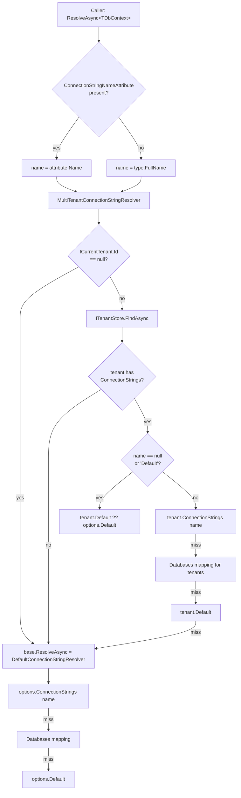

ABP applications routinely span multiple modules — Identity, OpenIddict, Audit Logging, BLOB Storing, BackgroundJobs, your own domain — and each module owns one or more `DbContext` (or Mongo `DbContext`) classes. The framework gives you a single, named-keyed map of connection strings (`ConnectionStrings`), a resolver pipeline (`IConnectionStringResolver`) that decides which physical database a logical module name points at, and per-`DbContext` configuration options (`AbpDbContextOptions`, `AbpMongoDbContextOptions`) for wiring the EF Core / Mongo client. In multi-tenant deployments a drop-in replacement of the resolver routes each request to the tenant's own database without any code change in the modules themselves.

This page walks the actual types under `Volo.Abp.Data`, `Volo.Abp.EntityFrameworkCore`, `Volo.Abp.MongoDB`, and `Volo.Abp.MultiTenancy`, showing the resolution chain end-to-end.

## File inventory

| File | Purpose |
| --- | --- |
| `framework/src/Volo.Abp.Data/Volo/Abp/Data/ConnectionStrings.cs` | `Dictionary<string, string?>` with a `Default` shortcut. |
| `framework/src/Volo.Abp.Data/Volo/Abp/Data/AbpDbConnectionOptions.cs` | Options bag combining `ConnectionStrings` and a `Databases` mapping; resolution helper. |
| `framework/src/Volo.Abp.Data/Volo/Abp/Data/IConnectionStringResolver.cs` | Async resolver contract used by every data provider. |
| `framework/src/Volo.Abp.Data/Volo/Abp/Data/DefaultConnectionStringResolver.cs` | Reads `AbpDbConnectionOptions`, falls back to `Default`. |
| `framework/src/Volo.Abp.Data/Volo/Abp/Data/ConnectionStringNameAttribute.cs` | Maps a `DbContext` type to a logical connection-string name. |
| `framework/src/Volo.Abp.Data/Volo/Abp/Data/ConnectionStringResolverExtensions.cs` | `ResolveAsync<T>()` and `ResolveAsync(Type)` helpers. |
| `framework/src/Volo.Abp.MultiTenancy/Volo/Abp/MultiTenancy/MultiTenantConnectionStringResolver.cs` | Replaces the default resolver to read per-tenant connection strings. |
| `framework/src/Volo.Abp.EntityFrameworkCore/Volo/Abp/EntityFrameworkCore/AbpDbContextOptions.cs` | Default/per-DbContext `(Pre)Configure` callbacks and multi-tenant replacements. |
| `framework/src/Volo.Abp.MongoDB/Volo/Abp/MongoDB/AbpMongoDbContextOptions.cs` | Mongo client configurer and multi-tenant DbContext replacements. |

## The `ConnectionStrings` map

`ConnectionStrings` is just a `Dictionary<string, string?>` with a strongly-typed `Default` accessor. The constant `DefaultConnectionStringName` is the literal `"Default"` — the same key Microsoft.Extensions.Configuration binds when you put a `ConnectionStrings:Default` section in `appsettings.json`.

```csharp title="framework/src/Volo.Abp.Data/Volo/Abp/Data/ConnectionStrings.cs"
[Serializable]
public class ConnectionStrings : Dictionary<string, string?>
{
    public const string DefaultConnectionStringName = "Default";

    public string? Default {
        get => this.GetOrDefault(DefaultConnectionStringName);
        set => this[DefaultConnectionStringName] = value;
    }
}
```

In a typical host module you bind it through `AbpDbConnectionOptions`:

```csharp title="MyProjectHostModule.cs"
Configure<AbpDbConnectionOptions>(options =>
{
    options.ConnectionStrings.Default =
        configuration.GetConnectionString("Default");

    options.ConnectionStrings["AbpAuditLogging"] =
        configuration.GetConnectionString("AbpAuditLogging");
});
```

Any string key is legal; the convention is one key per module (`"AbpIdentity"`, `"AbpOpenIddict"`, `"AbpBlobStoring"`, …) plus `"Default"`.

### `AbpDbConnectionOptions` and fallback rules

`ConnectionStrings` lives inside `AbpDbConnectionOptions` together with an `AbpDatabaseInfoDictionary` that lets you alias a connection-string name onto another *database* name. The resolution helper centralises the three-stage fallback used by every higher-level resolver.

```csharp title="framework/src/Volo.Abp.Data/Volo/Abp/Data/AbpDbConnectionOptions.cs"
public string? GetConnectionStringOrNull(
    string connectionStringName,
    bool fallbackToDatabaseMappings = true,
    bool fallbackToDefault = true)
{
    var connectionString = ConnectionStrings.GetOrDefault(connectionStringName);
    if (!connectionString.IsNullOrEmpty())
    {
        return connectionString;
    }

    if (fallbackToDatabaseMappings)
    {
        var database = Databases.GetMappedDatabaseOrNull(connectionStringName);
        if (database != null)
        {
            connectionString = ConnectionStrings.GetOrDefault(database.DatabaseName);
            if (!connectionString.IsNullOrEmpty())
            {
                return connectionString;
            }
        }
    }

    if (fallbackToDefault)
    {
        connectionString = ConnectionStrings.Default;
        if (!connectionString.IsNullOrWhiteSpace())
        {
            return connectionString;
        }
    }

    return null;
}
```

<Note>
`Databases` is the mechanism that lets you fold many modules into one physical database: register a `DatabaseInfo` named `"Main"`, map `"AbpIdentity"` and `"AbpOpenIddict"` to it, and add a single `ConnectionStrings["Main"]` entry. See [Data overview](/data/overview) for the bigger picture.
</Note>

## `IConnectionStringResolver`

The contract is intentionally tiny:

```csharp title="framework/src/Volo.Abp.Data/Volo/Abp/Data/IConnectionStringResolver.cs"
public interface IConnectionStringResolver
{
    [NotNull]
    [Obsolete("Use ResolveAsync method.")]
    string Resolve(string? connectionStringName = null);

    [NotNull]
    Task<string> ResolveAsync(string? connectionStringName = null);
}
```

`connectionStringName == null` means *"give me the default"*. Higher-level callers usually invoke the strongly-typed extension that derives the name from a `[ConnectionStringName]` attribute on the `DbContext`:

```csharp title="framework/src/Volo.Abp.Data/Volo/Abp/Data/ConnectionStringResolverExtensions.cs"
public static Task<string> ResolveAsync<T>(this IConnectionStringResolver resolver)
{
    return resolver.ResolveAsync(typeof(T));
}

public static Task<string> ResolveAsync(this IConnectionStringResolver resolver, Type type)
{
    return resolver.ResolveAsync(ConnectionStringNameAttribute.GetConnStringName(type));
}
```

And the attribute itself:

```csharp title="framework/src/Volo.Abp.Data/Volo/Abp/Data/ConnectionStringNameAttribute.cs"
[ConnectionStringName("AbpIdentity")]
public class IdentityDbContext : AbpDbContext<IdentityDbContext> { /* … */ }
```

`ConnectionStringNameAttribute.GetConnStringName(type)` returns the attribute's `Name` if present, otherwise `type.FullName` — so even an un-attributed `DbContext` has a stable lookup key.

### `DefaultConnectionStringResolver`

The default implementation is a thin wrapper around `AbpDbConnectionOptions`:

```csharp title="framework/src/Volo.Abp.Data/Volo/Abp/Data/DefaultConnectionStringResolver.cs"
public class DefaultConnectionStringResolver : IConnectionStringResolver, ITransientDependency
{
    protected AbpDbConnectionOptions Options { get; }

    public DefaultConnectionStringResolver(IOptionsMonitor<AbpDbConnectionOptions> options)
    {
        Options = options.CurrentValue;
    }

    public virtual Task<string> ResolveAsync(string? connectionStringName = null)
    {
        return Task.FromResult(ResolveInternal(connectionStringName))!;
    }

    private string? ResolveInternal(string? connectionStringName)
    {
        if (connectionStringName == null)
        {
            return Options.ConnectionStrings.Default;
        }

        var connectionString = Options.GetConnectionStringOrNull(connectionStringName);

        if (!connectionString.IsNullOrEmpty())
        {
            return connectionString;
        }

        return null;
    }
}
```

It uses `IOptionsMonitor` so reload-on-change configuration providers are picked up at the next call.

## Multi-tenant resolution

When `Volo.Abp.MultiTenancy` is in the graph it replaces the registration:

```csharp title="framework/src/Volo.Abp.MultiTenancy/Volo/Abp/MultiTenancy/MultiTenantConnectionStringResolver.cs"
[Dependency(ReplaceServices = true)]
public class MultiTenantConnectionStringResolver : DefaultConnectionStringResolver
{
    private readonly ICurrentTenant _currentTenant;
    private readonly IServiceProvider _serviceProvider;

    public MultiTenantConnectionStringResolver(
        IOptionsMonitor<AbpDbConnectionOptions> options,
        ICurrentTenant currentTenant,
        IServiceProvider serviceProvider)
        : base(options)
    {
        _currentTenant = currentTenant;
        _serviceProvider = serviceProvider;
    }

    public override async Task<string> ResolveAsync(string? connectionStringName = null)
    {
        if (_currentTenant.Id == null)
        {
            //No current tenant, fallback to default logic
            return await base.ResolveAsync(connectionStringName);
        }

        var tenant = await FindTenantConfigurationAsync(_currentTenant.Id.Value);

        if (tenant == null || tenant.ConnectionStrings.IsNullOrEmpty())
        {
            //Tenant has not defined any connection string, fallback to default logic
            return await base.ResolveAsync(connectionStringName);
        }

        var tenantDefaultConnectionString = tenant.ConnectionStrings?.Default;

        //Requesting default connection string...
        if (connectionStringName == null ||
            connectionStringName == ConnectionStrings.DefaultConnectionStringName)
        {
            return !tenantDefaultConnectionString.IsNullOrWhiteSpace()
                ? tenantDefaultConnectionString!
                : Options.ConnectionStrings.Default!;
        }

        //Requesting specific connection string...
        var connString = tenant.ConnectionStrings?.GetOrDefault(connectionStringName);
        if (!connString.IsNullOrWhiteSpace())
        {
            return connString!;
        }

        //Fallback to the mapped database for the specific connection string
        var database = Options.Databases.GetMappedDatabaseOrNull(connectionStringName);
        if (database != null && database.IsUsedByTenants)
        {
            connString = tenant.ConnectionStrings?.GetOrDefault(database.DatabaseName);
            if (!connString.IsNullOrWhiteSpace())
            {
                return connString!;
            }
        }

        //Fallback to tenant's default connection string if available
        if (!tenantDefaultConnectionString.IsNullOrWhiteSpace())
        {
            return tenantDefaultConnectionString!;
        }

        return await base.ResolveAsync(connectionStringName);
    }
}
```

The `FindTenantConfigurationAsync` helper opens a scope and asks `ITenantStore`:

```csharp title="framework/src/Volo.Abp.MultiTenancy/Volo/Abp/MultiTenancy/MultiTenantConnectionStringResolver.cs"
protected virtual async Task<TenantConfiguration?> FindTenantConfigurationAsync(Guid tenantId)
{
    using (var serviceScope = _serviceProvider.CreateScope())
    {
        var tenantStore = serviceScope
            .ServiceProvider
            .GetRequiredService<ITenantStore>();

        return await tenantStore.FindAsync(tenantId);
    }
}
```

### Full lookup chain



<Tip>
The resolver never throws — it returns `null` when nothing matches. The EF Core / Mongo bootstrap code is what produces the friendly "No connection string defined for …" error, so make sure at least `ConnectionStrings.Default` is populated.
</Tip>

See [Multi-tenancy](/multitenancy) for `ICurrentTenant`, `ITenantStore`, and the data-isolation primitives that surround this resolver.

## `AbpDbContextOptions` (EF Core)

`AbpDbContextOptions` is the options bag the EF Core integration uses to translate a resolved connection string into a configured `DbContextOptions<TDbContext>`. It supports four overloads — default vs. per-DbContext × pre vs. main configure.

```csharp title="framework/src/Volo.Abp.EntityFrameworkCore/Volo/Abp/EntityFrameworkCore/AbpDbContextOptions.cs"
public class AbpDbContextOptions
{
    internal List<Action<AbpDbContextConfigurationContext>> DefaultPreConfigureActions { get; }
    internal Action<AbpDbContextConfigurationContext>? DefaultConfigureAction { get; set; }
    internal Dictionary<Type, List<object>> PreConfigureActions { get; }
    internal Dictionary<Type, object> ConfigureActions { get; }
    internal Dictionary<MultiTenantDbContextType, Type> DbContextReplacements { get; }

    public void PreConfigure([NotNull] Action<AbpDbContextConfigurationContext> action) { /* … */ }
    public void Configure([NotNull] Action<AbpDbContextConfigurationContext> action) { /* … */ }

    public void PreConfigure<TDbContext>(
        [NotNull] Action<AbpDbContextConfigurationContext<TDbContext>> action)
        where TDbContext : AbpDbContext<TDbContext> { /* … */ }

    public void Configure<TDbContext>(
        [NotNull] Action<AbpDbContextConfigurationContext<TDbContext>> action)
        where TDbContext : AbpDbContext<TDbContext> { /* … */ }

    public bool IsConfigured<TDbContext>() { /* … */ }
    public bool IsConfigured(Type dbContextType) { /* … */ }
}
```

The semantics encoded by the code are:

| Method | Stored in | When it runs |
| --- | --- | --- |
| `PreConfigure(Action)` | `DefaultPreConfigureActions` (list) | Before any `DbContext` is configured, every time. |
| `Configure(Action)` | `DefaultConfigureAction` (single) | Once per `DbContext` that has no specific override. |
| `PreConfigure<T>(Action)` | `PreConfigureActions[T]` (list) | Before the `T`-specific `Configure`. |
| `Configure<T>(Action)` | `ConfigureActions[T]` (single) | Replaces the default action for `T`. |

A typical EF Core hookup in a host module:

```csharp title="MyProjectEntityFrameworkCoreModule.cs"
Configure<AbpDbContextOptions>(options =>
{
    options.Configure(opts =>
    {
        opts.UseSqlServer(b =>
        {
            b.MigrationsAssembly(typeof(MyProjectMigrationsDbContext).Assembly.FullName);
            b.EnableRetryOnFailure();
        });
    });

    options.Configure<MyReportingDbContext>(opts =>
    {
        opts.UseNpgsql();
    });
});
```

`AbpDbContextConfigurationContext` exposes the connection string resolved through `IConnectionStringResolver` plus the standard `DbContextOptionsBuilder`, so you almost never call `IConnectionStringResolver` yourself — the EF Core integration does it for you, finds the right action via `ConfigureActions.TryGetValue(typeof(TDbContext), …)`, and falls back to `DefaultConfigureAction`.

### Multi-tenant `DbContext` replacements

The internal `DbContextReplacements` dictionary lets a module *replace* the running `DbContext` type depending on the multi-tenancy side. Host and tenant requests can point at different `DbContext` implementations of the same logical interface — see the `IsConfigured` / `GetReplacedTypeOrSelf` plumbing referenced from `MultiTenantDbContextType`.

```csharp title="framework/src/Volo.Abp.EntityFrameworkCore/Volo/Abp/EntityFrameworkCore/AbpDbContextOptions.cs"
internal Type GetReplacedTypeOrSelf(Type dbContextType,
    MultiTenancySides multiTenancySides = MultiTenancySides.Both)
{
    var replacementType = dbContextType;
    while (true)
    {
        var foundType = DbContextReplacements.LastOrDefault(
            x => x.Key.Type == replacementType
              && x.Key.MultiTenancySide.HasFlag(multiTenancySides));
        if (!foundType.Equals(default(KeyValuePair<MultiTenantDbContextType, Type>)))
        {
            if (foundType.Value == dbContextType)
            {
                throw new AbpException(
                    "Circular DbContext replacement found for " +
                    dbContextType.AssemblyQualifiedName);
            }
            replacementType = foundType.Value;
        }
        else
        {
            return replacementType;
        }
    }
}
```

The loop chases transitive replacements (A→B, B→C ⇒ A→C) and guards against cycles.

## `AbpMongoDbContextOptions`

The MongoDB integration mirrors EF Core's options surface — minus the `(Pre)Configure` callbacks, because the Mongo driver is configured globally per `MongoClient` rather than per `DbContext`.

```csharp title="framework/src/Volo.Abp.MongoDB/Volo/Abp/MongoDB/AbpMongoDbContextOptions.cs"
public class AbpMongoDbContextOptions
{
    internal Dictionary<MultiTenantDbContextType, Type> DbContextReplacements { get; }

    public Action<MongoClientSettings>? MongoClientSettingsConfigurer { get; set; }

    public AbpMongoDbContextOptions()
    {
        DbContextReplacements = new Dictionary<MultiTenantDbContextType, Type>();
    }

    internal Type GetReplacedTypeOrSelf(Type dbContextType,
        MultiTenancySides multiTenancySides = MultiTenancySides.Both) { /* same shape as EF Core */ }
}
```

You typically use `MongoClientSettingsConfigurer` to tweak TLS, cluster settings, or compression:

```csharp title="MyProjectMongoDbModule.cs"
Configure<AbpMongoDbContextOptions>(options =>
{
    options.MongoClientSettingsConfigurer = settings =>
    {
        settings.UseTls = true;
        settings.RetryWrites = true;
    };
});
```

`DbContextReplacements` plays the same multi-tenancy role as on EF Core: route host vs. tenant requests to a different concrete Mongo `DbContext`.

## Putting it all together

```mermaid
sequenceDiagram
    participant App as Application code
    participant UoW as UnitOfWork / Repository
    participant Resolver as IConnectionStringResolver
    participant Opts as AbpDbContextOptions
    participant EF as DbContextOptionsBuilder

    App->>UoW: GetRepository&lt;IdentityUser&gt;
    UoW->>Resolver: ResolveAsync&lt;IdentityDbContext&gt;()
    Resolver-->>UoW: "Server=...;Database=Tenant42;"
    UoW->>Opts: ConfigureActions[IdentityDbContext]
    Opts-->>UoW: action
    UoW->>EF: UseSqlServer(connStr)
    EF-->>UoW: DbContextOptions
    UoW-->>App: IdentityDbContext instance
```

The four moving parts you actually own:

<CardGroup cols={2}>
  <Card title="ConnectionStrings" icon="key">
    Bind from configuration. Use `[ConnectionStringName]` on each `DbContext`.
  </Card>
  <Card title="AbpDbConnectionOptions.Databases" icon="database">
    Optional. Use it to fold many module names onto one physical DB.
  </Card>
  <Card title="AbpDbContextOptions" icon="gear">
    Tell EF Core which provider, which migration assembly, retry policy.
  </Card>
  <Card title="ITenantStore" icon="building">
    Source of per-tenant connection strings consumed by `MultiTenantConnectionStringResolver`.
  </Card>
</CardGroup>

## Recipes

### Module-specific database, shared by host and tenants

```csharp title="MyHostModule.cs"
Configure<AbpDbConnectionOptions>(options =>
{
    options.ConnectionStrings.Default = configuration.GetConnectionString("Default");
    options.ConnectionStrings["AbpAuditLogging"] =
        configuration.GetConnectionString("AbpAuditLogging");
});
```

If `"AbpAuditLogging"` is not in a tenant's `ConnectionStrings`, the resolver falls back to the host's `"AbpAuditLogging"` entry, then to the host `Default`.

### Per-tenant database

Populate `TenantConfiguration.ConnectionStrings.Default` (or named entries) through your `ITenantStore` implementation. No application code change is needed — the resolver swap is already in `Volo.Abp.MultiTenancy`.

### Overriding the resolver

If you need a custom routing strategy (e.g. shard by user, cookie, header) replace the service:

```csharp title="MyProjectModule.cs"
context.Services.Replace(
    ServiceDescriptor.Transient<IConnectionStringResolver, MyCustomResolver>());
```

Inherit from `DefaultConnectionStringResolver` to keep the fallback semantics for `null` / `Default` requests.

## Cross-references

<CardGroup cols={2}>
  <Card title="Data overview" icon="database" href="/data/overview">
    `IRepository`, `UnitOfWork`, data filters, seeding.
  </Card>
  <Card title="Multi-tenancy" icon="building" href="/multitenancy">
    `ICurrentTenant`, `ITenantStore`, `TenantConfiguration`.
  </Card>
  <Card title="Feature flags" icon="flag" href="/config/feature-flags">
    Runtime per-tenant features that often gate optional `DbContext`s.
  </Card>
  <Card title="Global features" icon="toggle-on" href="/compliance/global-features">
    Compile-time toggles for entire modules.
  </Card>
</CardGroup>
