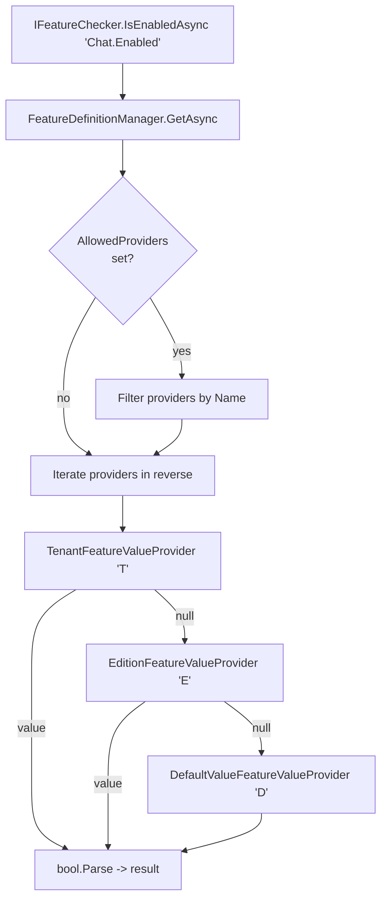
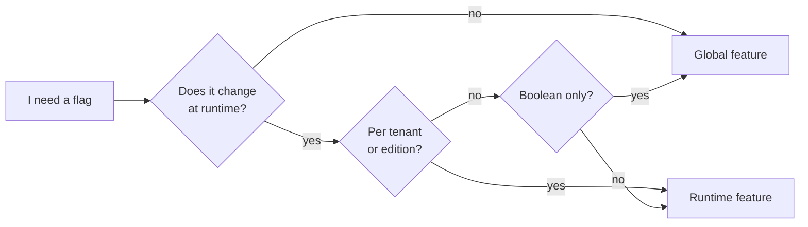

ABP exposes *two* completely separate flag systems that are often confused because both ship under a "feature" name. **Global features** (`Volo.Abp.GlobalFeatures`) are *compile-time, module-level* switches: they decide whether large slices of a module — controllers, entities, services — even exist in the application graph. **Runtime features** (`Volo.Abp.Features`) are *per-tenant, per-edition* dynamic flags resolved on every call through a chain of `IFeatureValueProvider`s, with metadata declared by `FeatureDefinitionProvider`s and consumed by `IFeatureChecker`.

This page walks the actual source for both subsystems and pinpoints when to reach for each one.

## File inventory

### Global features (`Volo.Abp.GlobalFeatures`)

| File | Role |
| --- | --- |
| `framework/src/Volo.Abp.GlobalFeatures/Volo/Abp/GlobalFeatures/GlobalFeatureManager.cs` | Static `Instance` holding a `HashSet<string>` of enabled features. |
| `framework/src/Volo.Abp.GlobalFeatures/Volo/Abp/GlobalFeatures/GlobalFeatureNameAttribute.cs` | Required on every `GlobalFeature` class — provides the lookup key. |
| `framework/src/Volo.Abp.GlobalFeatures/Volo/Abp/GlobalFeatures/RequiresGlobalFeatureAttribute.cs` | Marks a class as inactive unless its feature is enabled. |
| `framework/src/Volo.Abp.GlobalFeatures/Volo/Abp/GlobalFeatures/GlobalFeature.cs` | Base class for a feature inside a module. |
| `framework/src/Volo.Abp.GlobalFeatures/Volo/Abp/GlobalFeatures/GlobalModuleFeatures.cs` | Container holding the features of one module. |
| `framework/src/Volo.Abp.GlobalFeatures/Volo/Abp/GlobalFeatures/GlobalFeatureHelper.cs` | `IsGlobalFeatureEnabled(type, out attr)` reflection helper. |
| `framework/src/Volo.Abp.GlobalFeatures/Volo/Abp/GlobalFeatures/GlobalFeatureInterceptor.cs` | DynamicProxy interceptor that throws if the feature is disabled. |
| `framework/src/Volo.Abp.GlobalFeatures/Volo/Abp/GlobalFeatures/AbpGlobalFeatureNotEnabledException.cs` | Exception thrown by the interceptor. |

### Runtime features (`Volo.Abp.Features`)

| File | Role |
| --- | --- |
| `framework/src/Volo.Abp.Features/Volo/Abp/Features/IFeatureChecker.cs` | `GetOrNullAsync(name)` + `IsEnabledAsync(name)`. |
| `framework/src/Volo.Abp.Features/Volo/Abp/Features/FeatureCheckerBase.cs` | `bool.Parse` shim for `IsEnabledAsync`. |
| `framework/src/Volo.Abp.Features/Volo/Abp/Features/FeatureChecker.cs` | Iterates `IFeatureValueProvider`s in reverse registration order. |
| `framework/src/Volo.Abp.Features/Volo/Abp/Features/FeatureDefinition.cs` | Metadata: name, default, parent/child, allowed providers. |
| `framework/src/Volo.Abp.Features/Volo/Abp/Features/FeatureGroupDefinition.cs` | Groups features for the UI. |
| `framework/src/Volo.Abp.Features/Volo/Abp/Features/FeatureDefinitionProvider.cs` | Base class — override `Define(IFeatureDefinitionContext)`. |
| `framework/src/Volo.Abp.Features/Volo/Abp/Features/IFeatureValueProvider.cs` | Contract for a value source. |
| `framework/src/Volo.Abp.Features/Volo/Abp/Features/DefaultValueFeatureValueProvider.cs` | `Name = "D"` — returns `feature.DefaultValue`. |
| `framework/src/Volo.Abp.Features/Volo/Abp/Features/EditionFeatureValueProvider.cs` | `Name = "E"` — reads `IFeatureStore` by edition. |
| `framework/src/Volo.Abp.Features/Volo/Abp/Features/TenantFeatureValueProvider.cs` | `Name = "T"` — reads `IFeatureStore` by tenant. |
| `framework/src/Volo.Abp.Features/Volo/Abp/Features/RequiresFeatureAttribute.cs` | `[RequiresFeature]` on classes/methods, supports `RequiresAll`. |
| `framework/src/Volo.Abp.Features/Volo/Abp/Features/FeatureCheckerExtensions.cs` | `GetAsync<T>`, `CheckEnabledAsync`, OR/AND helpers. |
| `framework/src/Volo.Abp.Features/Volo/Abp/Features/AbpFeatureOptions.cs` | Registers definition providers, value providers, deletions. |
| `framework/src/Volo.Abp.Features/Volo/Abp/Features/FeatureDefinitionManager.cs` | Merges static + dynamic definition stores. |

## Two systems, two purposes

<CardGroup cols={2}>
  <Card title="Global features" icon="toggle-on">
    **Compile-/boot-time.** Decided once during module configuration. Used by commercial editions to hide modules from the DI graph and to throw on accidental use. Global, process-wide.
  </Card>
  <Card title="Runtime features" icon="flag">
    **Per call.** Resolved from tenant/edition data on every request through a provider chain. Persisted in a feature store. Used for "Up to N users", "Chat enabled", and edition-tier billing.
  </Card>
</CardGroup>

| Concern | Global features | Runtime features |
| --- | --- | --- |
| Storage | In-memory `HashSet<string>` | `IFeatureStore` (DB) + providers |
| Audience | Process-wide | Per tenant / per edition |
| Mutation point | Module `PreConfigure` / `Configure` | Admin UI / API at any time |
| Check API | `GlobalFeatureManager.Instance.IsEnabled(name)` | `await IFeatureChecker.IsEnabledAsync(name)` |
| Enforcement | `[RequiresGlobalFeature(typeof(T))]` + interceptor / type filtering | `[RequiresFeature("X")]` + interceptor |
| Failure | `AbpGlobalFeatureNotEnabledException` | `AbpAuthorizationException` with `FeatureIsNotEnabled` |

## Global features

### `GlobalFeatureManager` — a static toggle set

```csharp title="framework/src/Volo.Abp.GlobalFeatures/Volo/Abp/GlobalFeatures/GlobalFeatureManager.cs"
public class GlobalFeatureManager
{
    public static GlobalFeatureManager Instance { get; protected set; } = new GlobalFeatureManager();

    [NotNull]
    public Dictionary<object, object> Configuration { get; }

    public GlobalModuleFeaturesDictionary Modules { get; }

    protected HashSet<string> EnabledFeatures { get; }

    public virtual bool IsEnabled<TFeature>() => IsEnabled(typeof(TFeature));
    public virtual bool IsEnabled([NotNull] Type featureType)
        => IsEnabled(GlobalFeatureNameAttribute.GetName(featureType));
    public virtual bool IsEnabled(string featureName)
        => EnabledFeatures.Contains(featureName);

    public virtual void Enable<TFeature>() => Enable(typeof(TFeature));
    public virtual void Enable(string featureName) => EnabledFeatures.AddIfNotContains(featureName);
    public virtual void Disable(string featureName) => EnabledFeatures.Remove(featureName);

    public virtual IEnumerable<string> GetEnabledFeatureNames() => EnabledFeatures;
}
```

Key properties of the design:

- **It is a singleton accessed via a static `Instance`.** That is intentional — the toggle decisions have to be visible before DI is configured, while modules are being added.
- **`EnabledFeatures` is a plain `HashSet<string>`.** No persistence, no IO.
- **Names come from `[GlobalFeatureName]`** on the `GlobalFeature` class — there is no string convention to forget.

### Declaring a global feature

Each commercial module declares a `GlobalFeature` subclass per togglable slice and groups them under a `GlobalModuleFeatures` container.

```csharp title="framework/src/Volo.Abp.GlobalFeatures/Volo/Abp/GlobalFeatures/GlobalFeature.cs"
public abstract class GlobalFeature
{
    [NotNull] public GlobalModuleFeatures Module { get; }
    [NotNull] public GlobalFeatureManager FeatureManager { get; }
    [NotNull] public string FeatureName { get; }

    public bool IsEnabled {
        get => FeatureManager.IsEnabled(FeatureName);
        set => SetEnabled(value);
    }

    protected GlobalFeature([NotNull] GlobalModuleFeatures module)
    {
        Module = Check.NotNull(module, nameof(module));
        FeatureManager = Module.FeatureManager;
        FeatureName = GlobalFeatureNameAttribute.GetName(GetType());
    }

    public virtual void Enable()  => FeatureManager.Enable(FeatureName);
    public virtual void Disable() => FeatureManager.Disable(FeatureName);
}
```

### Required `[GlobalFeatureName]`

`GlobalFeatureNameAttribute.GetName(type)` throws if the attribute is missing — there is no fallback to the type name:

```csharp title="framework/src/Volo.Abp.GlobalFeatures/Volo/Abp/GlobalFeatures/GlobalFeatureNameAttribute.cs"
[NotNull]
public static string GetName([NotNull] Type type)
{
    Check.NotNull(type, nameof(type));

    var attribute = type
        .GetCustomAttributes<GlobalFeatureNameAttribute>()
        .FirstOrDefault();

    if (attribute == null)
    {
        throw new AbpException(
            $"{type.AssemblyQualifiedName} should define the {typeof(GlobalFeatureNameAttribute).FullName} atttribute!");
    }

    return attribute.As<GlobalFeatureNameAttribute>().Name;
}
```

### Enforcing the toggle: `[RequiresGlobalFeature]`

Application services and other classes opt in by attribute:

```csharp title="framework/src/Volo.Abp.GlobalFeatures/Volo/Abp/GlobalFeatures/RequiresGlobalFeatureAttribute.cs"
[AttributeUsage(AttributeTargets.Class)]
public class RequiresGlobalFeatureAttribute : Attribute
{
    public Type? Type { get; }
    public string? Name { get; }

    public RequiresGlobalFeatureAttribute([NotNull] Type type)
        => Type = Check.NotNull(type, nameof(type));

    public RequiresGlobalFeatureAttribute([NotNull] string name)
        => Name = Check.NotNullOrWhiteSpace(name, nameof(name));

    public virtual string GetFeatureName()
        => Name ?? GlobalFeatureNameAttribute.GetName(Type!);
}
```

At check time the helper looks up the attribute (returning `true` if there isn't one — undecorated classes are always enabled):

```csharp title="framework/src/Volo.Abp.GlobalFeatures/Volo/Abp/GlobalFeatures/GlobalFeatureHelper.cs"
public static class GlobalFeatureHelper
{
    public static bool IsGlobalFeatureEnabled(Type type, out RequiresGlobalFeatureAttribute? attribute)
    {
        attribute = ReflectionHelper.GetSingleAttributeOrDefault<RequiresGlobalFeatureAttribute>(type);
        return attribute == null || GlobalFeatureManager.Instance.IsEnabled(attribute.GetFeatureName());
    }
}
```

`GlobalFeatureInterceptor` consults the helper and throws `AbpGlobalFeatureNotEnabledException` on any call to a disabled service — so even a leftover `IServiceProvider.GetRequiredService<T>()` call surfaces a clear error instead of silently doing the wrong thing.

### Wiring it up

```csharp title="MyCommercialModule.cs (module configuration)"
public override void PreConfigureServices(ServiceConfigurationContext context)
{
    GlobalFeatureManager.Instance.Modules.MyModule(m =>
    {
        m.Enable<ChatFeature>();   // turns ChatFeature on for this process
    });
}
```

See [Compliance / Global features](/compliance/global-features) for the deeper "why" — including how this is used to gate audited / regulated capabilities at build time.

## Runtime features

The runtime system is what most application code interacts with day-to-day.

### `IFeatureChecker`

```csharp title="framework/src/Volo.Abp.Features/Volo/Abp/Features/IFeatureChecker.cs"
public interface IFeatureChecker
{
    Task<string?> GetOrNullAsync([NotNull] string name);
    Task<bool> IsEnabledAsync(string name);
}
```

The base class implements `IsEnabledAsync` by parsing the string value:

```csharp title="framework/src/Volo.Abp.Features/Volo/Abp/Features/FeatureCheckerBase.cs"
public abstract class FeatureCheckerBase : IFeatureChecker, ITransientDependency
{
    public abstract Task<string?> GetOrNullAsync(string name);

    public virtual async Task<bool> IsEnabledAsync(string name)
    {
        var value = await GetOrNullAsync(name);
        if (value.IsNullOrEmpty())
        {
            return false;
        }

        try
        {
            return bool.Parse(value!);
        }
        catch (Exception ex)
        {
            throw new AbpException(
                $"The value '{value}' for the feature '{name}' should be a boolean, but was not!",
                ex);
        }
    }
}
```

Note features are *strings*: a feature can be `"true"`, `"100"`, `"premium"`, or anything else. `IsEnabledAsync` only works for boolean-shaped features. For numeric/typed values use the extension:

```csharp title="framework/src/Volo.Abp.Features/Volo/Abp/Features/FeatureCheckerExtensions.cs"
public static async Task<T> GetAsync<T>(
    [NotNull] this IFeatureChecker featureChecker,
    [NotNull] string name,
    T defaultValue = default)
    where T : struct
{
    Check.NotNull(featureChecker, nameof(featureChecker));
    Check.NotNull(name, nameof(name));

    var value = await featureChecker.GetOrNullAsync(name);
    return value?.To<T>() ?? defaultValue;
}
```

`CheckEnabledAsync(featureName)` throws `AbpAuthorizationException` with `AbpFeatureErrorCodes.FeatureIsNotEnabled` on a `false`, which the authorization layer translates to a 403.

### `FeatureChecker` and the value provider chain

```csharp title="framework/src/Volo.Abp.Features/Volo/Abp/Features/FeatureChecker.cs"
public class FeatureChecker : FeatureCheckerBase
{
    protected AbpFeatureOptions Options { get; }
    protected List<IFeatureValueProvider> Providers => _providers.Value;
    private readonly Lazy<List<IFeatureValueProvider>> _providers;

    public FeatureChecker(
        IOptions<AbpFeatureOptions> options,
        IServiceProvider serviceProvider,
        IFeatureDefinitionManager featureDefinitionManager)
    {
        Options = options.Value;
        // …
        _providers = new Lazy<List<IFeatureValueProvider>>(
            () => Options
                .ValueProviders
                .Select(type => (ServiceProvider.GetRequiredService(type) as IFeatureValueProvider)!)
                .ToList(),
            true);
    }

    public override async Task<string?> GetOrNullAsync(string name)
    {
        var featureDefinition = await FeatureDefinitionManager.GetAsync(name);
        var providers = Enumerable.Reverse(Providers);

        if (featureDefinition.AllowedProviders.Any())
        {
            providers = providers.Where(p => featureDefinition.AllowedProviders.Contains(p.Name));
        }

        return await GetOrNullValueFromProvidersAsync(providers, featureDefinition);
    }

    protected virtual async Task<string?> GetOrNullValueFromProvidersAsync(
        IEnumerable<IFeatureValueProvider> providers,
        FeatureDefinition feature)
    {
        foreach (var provider in providers)
        {
            var value = await provider.GetOrNullAsync(feature);
            if (value != null)
            {
                return value;
            }
        }

        return null;
    }
}
```

Two important details that bite people:

1. **`Enumerable.Reverse(Providers)`** — providers are iterated in *reverse registration order*. The first non-null wins.
2. **`featureDefinition.AllowedProviders`** acts as a filter when non-empty. Set it (via `WithProviders("E")`, for example) to make a feature *edition-only*.

### Built-in providers

The `AbpFeaturesModule` registers three providers in this order:

```csharp title="framework/src/Volo.Abp.Features/Volo/Abp/Features/AbpFeaturesModule.cs"
context.Services.Configure<AbpFeatureOptions>(options =>
{
    options.ValueProviders.Add<DefaultValueFeatureValueProvider>();
    options.ValueProviders.Add<EditionFeatureValueProvider>();
    options.ValueProviders.Add<TenantFeatureValueProvider>();
});
```

After reversal, the chain at check time is **Tenant → Edition → Default**.

```csharp title="framework/src/Volo.Abp.Features/Volo/Abp/Features/TenantFeatureValueProvider.cs"
public class TenantFeatureValueProvider : FeatureValueProvider
{
    public const string ProviderName = "T";
    public override string Name => ProviderName;

    protected ICurrentTenant CurrentTenant { get; }

    public override async Task<string?> GetOrNullAsync(FeatureDefinition feature)
        => await FeatureStore.GetOrNullAsync(feature.Name, Name, CurrentTenant.Id?.ToString());
}
```

```csharp title="framework/src/Volo.Abp.Features/Volo/Abp/Features/EditionFeatureValueProvider.cs"
public class EditionFeatureValueProvider : FeatureValueProvider
{
    public const string ProviderName = "E";
    public override string Name => ProviderName;

    public override async Task<string?> GetOrNullAsync(FeatureDefinition feature)
    {
        var editionId = PrincipalAccessor.Principal?.FindEditionId();
        if (editionId == null)
        {
            return null;
        }

        return await FeatureStore.GetOrNullAsync(feature.Name, Name, editionId.Value.ToString());
    }
}
```

```csharp title="framework/src/Volo.Abp.Features/Volo/Abp/Features/DefaultValueFeatureValueProvider.cs"
public class DefaultValueFeatureValueProvider : FeatureValueProvider
{
    public const string ProviderName = "D";
    public override string Name => ProviderName;

    public override Task<string?> GetOrNullAsync(FeatureDefinition setting)
        => Task.FromResult<string?>(setting.DefaultValue);
}
```

### Resolution chain



### Declaring features: `FeatureDefinitionProvider`

A module describes its features through a `FeatureDefinitionProvider`:

```csharp title="framework/src/Volo.Abp.Features/Volo/Abp/Features/FeatureDefinitionProvider.cs"
public abstract class FeatureDefinitionProvider : IFeatureDefinitionProvider, ITransientDependency
{
    public abstract void Define(IFeatureDefinitionContext context);
}
```

The context lets you add groups, and groups own features:

```csharp title="framework/src/Volo.Abp.Features/Volo/Abp/Features/IFeatureDefinitionContext.cs"
public interface IFeatureDefinitionContext
{
    FeatureGroupDefinition AddGroup([NotNull] string name, ILocalizableString? displayName = null);
    FeatureGroupDefinition? GetGroupOrNull(string name);
    void RemoveGroup(string name);
}
```

`FeatureDefinition` is the metadata record:

```csharp title="framework/src/Volo.Abp.Features/Volo/Abp/Features/FeatureDefinition.cs"
public class FeatureDefinition : ICanCreateChildFeature
{
    [NotNull] public string Name { get; }
    [NotNull] public ILocalizableString DisplayName { get; set; }
    public ILocalizableString? Description { get; set; }

    public FeatureDefinition? Parent { get; private set; }
    public IReadOnlyList<FeatureDefinition> Children { get; }

    public string? DefaultValue { get; set; }
    public bool IsVisibleToClients { get; set; }
    public bool IsAvailableToHost { get; set; }
    [NotNull] public List<string> AllowedProviders { get; }
    [NotNull] public Dictionary<string, object?> Properties { get; }
    public IStringValueType? ValueType { get; set; }

    public FeatureDefinition WithProperty(string key, object value) { /* … */ }
    public FeatureDefinition WithProviders(params string[] providers) { /* … */ }

    public FeatureDefinition CreateChild(/* … */) { /* … */ }
}
```

A typical provider:

```csharp title="MyProject/Features/MyFeatureDefinitionProvider.cs"
public class MyFeatureDefinitionProvider : FeatureDefinitionProvider
{
    public override void Define(IFeatureDefinitionContext context)
    {
        var group = context.AddGroup("MyProject", L("Features:MyProject"));

        group.AddFeature(
            "Chat.Enabled",
            defaultValue: "false",
            displayName: L("Features:Chat.Enabled"),
            valueType: new ToggleStringValueType());

        group.AddFeature(
            "Users.Max",
            defaultValue: "5",
            displayName: L("Features:Users.Max"))
            .WithProviders(EditionFeatureValueProvider.ProviderName);
    }
}
```

`AbpFeaturesModule.PreConfigureServices` auto-registers every class implementing `IFeatureDefinitionProvider` via `services.OnRegistered`:

```csharp title="framework/src/Volo.Abp.Features/Volo/Abp/Features/AbpFeaturesModule.cs"
services.OnRegistered(context =>
{
    if (typeof(IFeatureDefinitionProvider).IsAssignableFrom(context.ImplementationType))
    {
        definitionProviders.Add(context.ImplementationType);
    }
});
```

### Static + dynamic definition merging

`FeatureDefinitionManager` consults a *static* store (the in-process providers) and a *dynamic* store (typically a database) and prefers static names on conflict:

```csharp title="framework/src/Volo.Abp.Features/Volo/Abp/Features/FeatureDefinitionManager.cs"
public virtual async Task<FeatureDefinition?> GetOrNullAsync(string name)
{
    Check.NotNull(name, nameof(name));

    return await StaticStore.GetOrNullAsync(name) ??
           await DynamicStore.GetOrNullAsync(name);
}
```

### `[RequiresFeature]`

For declarative enforcement on application services:

```csharp title="framework/src/Volo.Abp.Features/Volo/Abp/Features/RequiresFeatureAttribute.cs"
[AttributeUsage(AttributeTargets.Class | AttributeTargets.Method)]
public class RequiresFeatureAttribute : Attribute
{
    public string[] Features { get; }
    public bool RequiresAll { get; set; }

    public RequiresFeatureAttribute(params string[] features)
    {
        Features = features ?? Array.Empty<string>();
    }
}
```

```csharp title="ChatAppService.cs"
[RequiresFeature("Chat.Enabled")]
public class ChatAppService : ApplicationService { /* … */ }
```

The OR/AND helpers behind it:

```csharp title="framework/src/Volo.Abp.Features/Volo/Abp/Features/FeatureCheckerExtensions.cs"
public static async Task<bool> IsEnabledAsync(
    this IFeatureChecker featureChecker,
    bool requiresAll,
    params string[] featureNames)
{
    if (featureNames.IsNullOrEmpty()) return true;

    if (requiresAll)
    {
        foreach (var featureName in featureNames)
            if (!(await featureChecker.IsEnabledAsync(featureName))) return false;
        return true;
    }

    foreach (var featureName in featureNames)
        if (await featureChecker.IsEnabledAsync(featureName)) return true;
    return false;
}
```

## When do I use which?

<AccordionGroup>
  <Accordion title="Use Global features when…">
    - You ship a module to multiple customers and some never license a slice (e.g. "Chat" in a CRM).
    - You want a regulated capability to be physically absent from the DI graph when off.
    - The flag never changes after `Application.Configure()` returns.
    - You need the toggle to be visible *before* `IFeatureChecker` exists (e.g. during DbContext model building).
  </Accordion>
  <Accordion title="Use Runtime features when…">
    - The flag depends on the *current* tenant or edition.
    - A tenant administrator should be able to flip it from the admin UI.
    - You want non-boolean values: limits, quotas, plan tiers.
    - You need declarative checks on application services via `[RequiresFeature]`.
  </Accordion>
  <Accordion title="Use both when…">
    - The feature only makes sense for some customers (gate the module behind a global feature), but *within those customers* tenants can buy higher tiers (resolve a runtime numeric feature). Production examples: SaaS, Identity Pro, OpenIddict Pro.
  </Accordion>
</AccordionGroup>

## Side-by-side decision matrix



## Cross-references

<CardGroup cols={2}>
  <Card title="Settings & Features overview" icon="sliders" href="/settings-features/features-overview">
    Higher-level walkthrough of `FeatureGroupDefinition`, UI metadata, and value types.
  </Card>
  <Card title="Global features (compliance)" icon="shield-check" href="/compliance/global-features">
    Why ABP isolates regulated capabilities behind compile-time flags.
  </Card>
  <Card title="Multi-tenancy" icon="building" href="/multitenancy">
    `ICurrentTenant` and `IFeatureStore` are the runtime resolution surface.
  </Card>
  <Card title="Connection strings" icon="key" href="/config/connection-strings-and-databases">
    The other side of per-tenant configuration.
  </Card>
</CardGroup>
