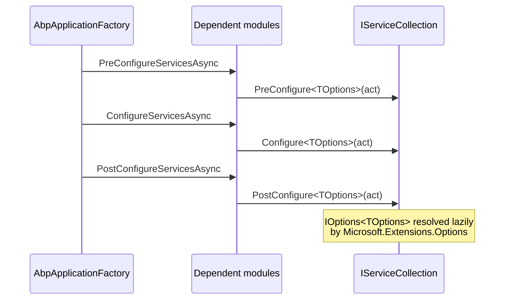

ABP does not reinvent configuration. Every module exposes its tunables as plain-C# options classes that are bound through `Microsoft.Extensions.Options` and resolved via `IOptions<T>`, `IOptionsSnapshot<T>`, or `IOptionsMonitor<T>`. The `AbpModule` base class adds a thin layer of sugar — `Configure<TOptions>()`, `PreConfigure<TOptions>()`, `PostConfigure<TOptions>()` — that forwards to `IServiceCollection.Configure(...)` while routing through the module's `ServiceConfigurationContext`. This page catalogs the options classes you will encounter when configuring a typical ABP application, with the exact signatures lifted from `framework/src/`.

<Info>
  Helpers live in `framework/src/Volo.Abp.Core/Volo/Abp/Modularity/AbpModule.cs`. The catalog below references files under `framework/src/Volo.Abp.*/` and a handful of contracts assemblies. Property summaries reproduce the source — nothing is invented.
</Info>

## The `Configure<TOptions>` pattern

`AbpModule.ConfigureServices(ServiceConfigurationContext)` is the canonical place to register options. ABP exposes five overloads of `Configure<TOptions>` plus a `PreConfigure` and `PostConfigure` pair. All forward to the standard `Microsoft.Extensions.DependencyInjection.OptionsServiceCollectionExtensions` calls so the binding semantics are identical to plain ASP.NET Core.

```csharp title="framework/src/Volo.Abp.Core/Volo/Abp/Modularity/AbpModule.cs"
protected void Configure<TOptions>(Action<TOptions> configureOptions)
    where TOptions : class
{
    ServiceConfigurationContext.Services.Configure(configureOptions);
}

protected void Configure<TOptions>(string name, Action<TOptions> configureOptions)
    where TOptions : class
{
    ServiceConfigurationContext.Services.Configure(name, configureOptions);
}

protected void Configure<TOptions>(IConfiguration configuration)
    where TOptions : class
{
    ServiceConfigurationContext.Services.Configure<TOptions>(configuration);
}

protected void Configure<TOptions>(IConfiguration configuration, Action<BinderOptions> configureBinder)
    where TOptions : class
{
    ServiceConfigurationContext.Services.Configure<TOptions>(configuration, configureBinder);
}

protected void Configure<TOptions>(string name, IConfiguration configuration)
    where TOptions : class
{
    ServiceConfigurationContext.Services.Configure<TOptions>(name, configuration);
}

protected void PreConfigure<TOptions>(Action<TOptions> configureOptions)
    where TOptions : class
{
    ServiceConfigurationContext.Services.PreConfigure(configureOptions);
}

protected void PostConfigure<TOptions>(Action<TOptions> configureOptions)
    where TOptions : class
{
    ServiceConfigurationContext.Services.PostConfigure(configureOptions);
}

protected void PostConfigureAll<TOptions>(Action<TOptions> configureOptions)
    where TOptions : class
{
    ServiceConfigurationContext.Services.PostConfigureAll(configureOptions);
}
```

### Execution order

`PreConfigureServices` runs before `ConfigureServices`, which runs before `PostConfigureServices`, in module-dependency order. The two extension methods `PreConfigure<T>` and `PostConfigure<T>` simply queue option mutators that fire respectively before/after the matching `Configure<T>` actions.



<Tip>
  Reach for `PreConfigure` when you must mutate options that a *later* module reads inside its own `ConfigureServices` (the auto-registration of `ISettingDefinitionProvider`s in `AbpSettingsModule` is the canonical example). Use `PostConfigure` for last-write-wins overrides.
</Tip>

### Reading options at runtime

```csharp title="Typical consumer"
public class MyService
{
    private readonly AbpAuditingOptions _options;

    public MyService(IOptions<AbpAuditingOptions> options)
    {
        _options = options.Value;
    }
}
```

`IOptionsSnapshot<T>` is preferred inside scoped services that need a fresh value per request; `IOptionsMonitor<T>` exposes `OnChange` callbacks. ABP itself uses `IOptions<T>` for almost every module since module options are static after startup.

## Catalog

The tables below group options classes by capability area. Every signature is reproduced from the source files referenced in the **File** column. Module references identify the `AbpModule` that *registers* the options or whose `[DependsOn]` chain pulls them in.

### Bootstrap and module lifecycle

| Class | File | Module |
| --- | --- | --- |
| `AbpApplicationCreationOptions` | `Volo.Abp.Core/Volo/Abp/AbpApplicationCreationOptions.cs` | Core (passed to `AbpApplicationFactory.Create`) |
| `AbpConfigurationBuilderOptions` | `Volo.Abp.Core/Microsoft/Extensions/Configuration/AbpConfigurationBuilderOptions.cs` | Core (nested in `AbpApplicationCreationOptions`) |
| `AbpModuleLifecycleOptions` | `Volo.Abp.Core/Volo/Abp/Modularity/AbpModuleLifecycleOptions.cs` | Core |
| `AbpSimpleStateCheckerOptions` | `Volo.Abp.Core/Volo/Abp/SimpleStateChecking/AbpSimpleStateCheckerOptions.cs` | Core |
| `AbpCorrelationIdOptions` | `Volo.Abp.Core/Volo/Abp/Tracing/AbpCorrelationIdOptions.cs` | Core |

```csharp title="framework/src/Volo.Abp.Core/Volo/Abp/AbpApplicationCreationOptions.cs"
public class AbpApplicationCreationOptions
{
    [NotNull] public IServiceCollection Services { get; }
    [NotNull] public PlugInSourceList PlugInSources { get; }
    [NotNull] public AbpConfigurationBuilderOptions Configuration { get; }
    public bool SkipConfigureServices { get; set; }
    public string? ApplicationName { get; set; }
    public string? Environment { get; set; }
}
```

`AbpConfigurationBuilderOptions` (Core) exposes `UserSecretsAssembly`, `UserSecretsId`, `FileName` (default `"appsettings"`), `Optional`/`ReloadOnChange` (both `true`), `EnvironmentName`, `BasePath`, `EnvironmentVariablesPrefix`, and `CommandLineArgs`. `AbpCorrelationIdOptions` exposes `HttpHeaderName` (default `"X-Correlation-Id"`) and `SetResponseHeader` (default `true`).

### Cross-cutting framework services

| Class | File | Module |
| --- | --- | --- |
| `AbpAuditingOptions` | `Volo.Abp.Auditing/Volo/Abp/Auditing/AbpAuditingOptions.cs` | `AbpAuditingModule` |
| `AbpPermissionOptions` | `Volo.Abp.Authorization.Abstractions/Volo/Abp/Authorization/Permissions/AbpPermissionOptions.cs` | `AbpAuthorizationAbstractionsModule` |
| `AbpFeatureOptions` | `Volo.Abp.Features/Volo/Abp/Features/AbpFeatureOptions.cs` | `AbpFeaturesModule` |
| `AbpSettingOptions` | `Volo.Abp.Settings/Volo/Abp/Settings/AbpSettingOptions.cs` | `AbpSettingsModule` |
| `AbpClockOptions` | `Volo.Abp.Timing/Volo/Abp/Timing/AbpClockOptions.cs` | `AbpTimingModule` |
| `AbpValidationOptions` | `Volo.Abp.Validation/Volo/Abp/Validation/AbpValidationOptions.cs` | `AbpValidationModule` |
| `AbpLocalizationOptions` | `Volo.Abp.Localization/Volo/Abp/Localization/AbpLocalizationOptions.cs` | `AbpLocalizationModule` |
| `AbpExceptionLocalizationOptions` | `Volo.Abp.Localization/Volo/Abp/Localization/ExceptionHandling/AbpExceptionLocalizationOptions.cs` | `AbpLocalizationModule` |
| `AbpExceptionHandlingOptions` | `Volo.Abp.ExceptionHandling/Volo/Abp/AspNetCore/ExceptionHandling/AbpExceptionHandlingOptions.cs` | `AbpExceptionHandlingModule` |
| `AbpVirtualFileSystemOptions` | `Volo.Abp.VirtualFileSystem/Volo/Abp/VirtualFileSystem/AbpVirtualFileSystemOptions.cs` | `AbpVirtualFileSystemModule` |

```csharp title="framework/src/Volo.Abp.Auditing/Volo/Abp/Auditing/AbpAuditingOptions.cs"
public class AbpAuditingOptions
{
    public bool HideErrors { get; set; }
    public bool IsEnabled { get; set; }
    public string? ApplicationName { get; set; }
    public bool IsEnabledForAnonymousUsers { get; set; }
    public bool AlwaysLogOnException { get; set; }
    public bool IsEnabledForIntegrationServices { get; set; }
    public List<Func<AuditLogInfo, Task<bool>>> AlwaysLogSelectors { get; }
    public List<AuditLogContributor> Contributors { get; }
    public List<Type> IgnoredTypes { get; }
    public IEntityHistorySelectorList EntityHistorySelectors { get; }
    public bool SaveEntityHistoryWhenNavigationChanges { get; set; } = true;
    public bool IsEnabledForGetRequests { get; set; }
    public bool DisableLogActionInfo { get; set; }
}
```

Constructor defaults: `IsEnabled`, `IsEnabledForAnonymousUsers`, `HideErrors`, `AlwaysLogOnException` start as `true`; `IgnoredTypes` is seeded with `Stream`, `Expression`, and `CancellationToken`.

The three "definition/value provider plus deletion list" options follow the same shape:

```csharp title="Permission / Feature / Setting options (identical shape, different element types)"
public class AbpPermissionOptions
{
    public ITypeList<IPermissionDefinitionProvider> DefinitionProviders { get; }
    public ITypeList<IPermissionValueProvider> ValueProviders { get; }
    public HashSet<string> DeletedPermissions { get; }
    public HashSet<string> DeletedPermissionGroups { get; }
}
// AbpFeatureOptions and AbpSettingOptions follow the same pattern
// (DefinitionProviders, ValueProviders, DeletedFeatures/DeletedSettings).
```

`AbpClockOptions` ships a single `DateTimeKind Kind` (default `Unspecified`). `AbpValidationOptions` exposes `List<Type> IgnoredTypes` and `ITypeList<IObjectValidationContributor> ObjectValidationContributors`.

```csharp title="framework/src/Volo.Abp.Localization/Volo/Abp/Localization/AbpLocalizationOptions.cs"
public class AbpLocalizationOptions
{
    public LocalizationResourceDictionary Resources { get; }
    public Type? DefaultResourceType { get; set; }
    public ITypeList<ILocalizationResourceContributor> GlobalContributors { get; }
    public List<LanguageInfo> Languages { get; }
    public Dictionary<string, List<NameValue>> LanguagesMap { get; }
    public Dictionary<string, List<NameValue>> LanguageFilesMap { get; }
    public bool TryToGetFromBaseCulture { get; set; }      // default: true
    public bool TryToGetFromDefaultCulture { get; set; }   // default: true
}
```

`AbpExceptionHandlingOptions` ships two flags: `SendExceptionsDetailsToClients` (default `false`) and `SendStackTraceToClients` (default `true`). `AbpVirtualFileSystemOptions` exposes a single `VirtualFileSetList FileSets` that modules append to via `FileSets.AddEmbedded<TModule>()`.

### Data and persistence

| Class | File | Module |
| --- | --- | --- |
| `AbpDataFilterOptions` | `Volo.Abp.Data/Volo/Abp/Data/AbpDataFilterOptions.cs` | `AbpDataModule` |
| `AbpDataSeedOptions` | `Volo.Abp.Data/Volo/Abp/Data/AbpDataSeedOptions.cs` | `AbpDataModule` |
| `AbpDbConnectionOptions` | `Volo.Abp.Data/Volo/Abp/Data/AbpDbConnectionOptions.cs` | `AbpDataModule` |
| `AbpDbContextOptions` | `Volo.Abp.EntityFrameworkCore/.../AbpDbContextOptions.cs` | `AbpEntityFrameworkCoreModule` |
| `AbpDbContextRegistrationOptions` | `Volo.Abp.EntityFrameworkCore/.../DependencyInjection/AbpDbContextRegistrationOptions.cs` | `AbpEntityFrameworkCoreModule` |
| `AbpMongoDbContextOptions` | `Volo.Abp.MongoDB/Volo/Abp/MongoDB/AbpMongoDbContextOptions.cs` | `AbpMongoDbModule` |
| `AbpMongoDbOptions` | `Volo.Abp.MongoDB/Volo/Abp/MongoDB/AbpMongoDbOptions.cs` | `AbpMongoDbModule` |

`AbpDataFilterOptions` carries one property: `Dictionary<Type, DataFilterState> DefaultStates`. `AbpDataSeedOptions` exposes `DataSeedContributorList Contributors`.

```csharp title="framework/src/Volo.Abp.Data/Volo/Abp/Data/AbpDbConnectionOptions.cs"
public class AbpDbConnectionOptions
{
    public ConnectionStrings ConnectionStrings { get; set; }
    public AbpDatabaseInfoDictionary Databases { get; set; }

    public string? GetConnectionStringOrNull(
        string connectionStringName,
        bool fallbackToDatabaseMappings = true,
        bool fallbackToDefault = true);
}
```

```csharp title="framework/src/Volo.Abp.EntityFrameworkCore/Volo/Abp/EntityFrameworkCore/AbpDbContextOptions.cs"
public class AbpDbContextOptions
{
    internal List<Action<AbpDbContextConfigurationContext>> DefaultPreConfigureActions { get; }
    internal Action<AbpDbContextConfigurationContext>? DefaultConfigureAction { get; set; }
    internal Dictionary<Type, List<object>> PreConfigureActions { get; }
    internal Dictionary<Type, object> ConfigureActions { get; }
    internal Dictionary<MultiTenantDbContextType, Type> DbContextReplacements { get; }

    public void PreConfigure(Action<AbpDbContextConfigurationContext> action);
    public void Configure(Action<AbpDbContextConfigurationContext> action);
}
```

`AbpMongoDbContextOptions` mirrors the EF Core variant: an internal `DbContextReplacements` map plus an `Action<MongoClientSettings>? MongoClientSettingsConfigurer` for the underlying driver.

### Unit of work

| Class | File | Module |
| --- | --- | --- |
| `AbpUnitOfWorkDefaultOptions` | `Volo.Abp.Uow/Volo/Abp/Uow/AbpUnitOfWorkDefaultOptions.cs` | `AbpUnitOfWorkModule` |
| `AbpUnitOfWorkOptions` | `Volo.Abp.Uow/Volo/Abp/Uow/AbpUnitOfWorkOptions.cs` | `AbpUnitOfWorkModule` |
| `AbpAspNetCoreUnitOfWorkOptions` | `Volo.Abp.AspNetCore/Volo/Abp/AspNetCore/Uow/AbpAspNetCoreUnitOfWorkOptions.cs` | `AbpAspNetCoreModule` |

```csharp title="framework/src/Volo.Abp.Uow/Volo/Abp/Uow/AbpUnitOfWorkDefaultOptions.cs"
public class AbpUnitOfWorkDefaultOptions
{
    public UnitOfWorkTransactionBehavior TransactionBehavior { get; set; }
        = UnitOfWorkTransactionBehavior.Auto;
    public IsolationLevel? IsolationLevel { get; set; }
    public int? Timeout { get; set; }

    public bool CalculateIsTransactional(bool autoValue);
}
```

### Caching, locking, and outbox-style infrastructure

| Class | File | Module |
| --- | --- | --- |
| `AbpDistributedCacheOptions` | `Volo.Abp.Caching/Volo/Abp/Caching/AbpDistributedCacheOptions.cs` | `AbpCachingModule` |
| `AbpDistributedLockOptions` | `Volo.Abp.DistributedLocking.Abstractions/.../AbpDistributedLockOptions.cs` | `AbpDistributedLockingAbstractionsModule` |
| `AbpDistributedEventBusOptions` | `Volo.Abp.EventBus/.../Distributed/AbpDistributedEventBusOptions.cs` | `AbpEventBusModule` |
| `AbpLocalEventBusOptions` | `Volo.Abp.EventBus/.../Local/AbpLocalEventBusOptions.cs` | `AbpEventBusModule` |
| `AbpEventBusBoxesOptions` | `Volo.Abp.EventBus/.../Distributed/AbpEventBusBoxesOptions.cs` | `AbpEventBusModule` |

```csharp title="framework/src/Volo.Abp.Caching/Volo/Abp/Caching/AbpDistributedCacheOptions.cs"
public class AbpDistributedCacheOptions
{
    public bool HideErrors { get; set; } = true;
    public string KeyPrefix { get; set; }
    public DistributedCacheEntryOptions GlobalCacheEntryOptions { get; set; }
    public List<Func<string, DistributedCacheEntryOptions?>> CacheConfigurators { get; set; }

    public void ConfigureCache<TCacheItem>(DistributedCacheEntryOptions? options);
    public void ConfigureCache(Type cacheItemType, DistributedCacheEntryOptions? options);
    public void ConfigureCache(string cacheName, DistributedCacheEntryOptions? options);
}
```

`AbpDistributedLockOptions` exposes a single `KeyPrefix` (default `""`). `AbpDistributedEventBusOptions` carries `ITypeList<IEventHandler> Handlers` plus `OutboxConfigDictionary Outboxes` and `InboxConfigDictionary Inboxes` (used to register the outbox/inbox pattern per database). `AbpLocalEventBusOptions` carries `ITypeList<IEventHandler> Handlers` for in-process subscribers.

### Background jobs and workers

| Class | File | Module |
| --- | --- | --- |
| `AbpBackgroundJobOptions` | `Volo.Abp.BackgroundJobs.Abstractions/.../AbpBackgroundJobOptions.cs` | `AbpBackgroundJobsAbstractionsModule` |
| `AbpBackgroundJobWorkerOptions` | `Volo.Abp.BackgroundJobs/.../AbpBackgroundJobWorkerOptions.cs` | `AbpBackgroundJobsModule` |
| `AbpBackgroundWorkerOptions` | `Volo.Abp.BackgroundWorkers/.../AbpBackgroundWorkerOptions.cs` | `AbpBackgroundWorkersModule` |
| `AbpHangfireOptions` | `Volo.Abp.HangFire/Volo/Abp/Hangfire/AbpHangfireOptions.cs` | `AbpBackgroundJobsHangfireModule` |
| `AbpQuartzOptions` | `Volo.Abp.Quartz/Volo/Abp/Quartz/AbpQuartzOptions.cs` | `AbpQuartzModule` |
| `AbpBackgroundJobQuartzOptions` | `Volo.Abp.BackgroundJobs.Quartz/.../AbpBackgroundJobQuartzOptions.cs` | `AbpBackgroundJobsQuartzModule` |
| `AbpRabbitMqBackgroundJobOptions` | `Volo.Abp.BackgroundJobs.RabbitMQ/.../AbpRabbitMqBackgroundJobOptions.cs` | `AbpBackgroundJobsRabbitMqModule` |

```csharp title="framework/src/Volo.Abp.BackgroundJobs.Abstractions/.../AbpBackgroundJobOptions.cs"
public class AbpBackgroundJobOptions
{
    public bool IsJobExecutionEnabled { get; set; } = true;

    public BackgroundJobConfiguration GetJob<TArgs>();
    public BackgroundJobConfiguration GetJob(Type argsType);
    public BackgroundJobConfiguration GetJob(string name);
    public IReadOnlyList<BackgroundJobConfiguration> GetJobs();

    public void AddJob<TJob>();
    public void AddJob(Type jobType);
    public void AddJob(BackgroundJobConfiguration jobConfiguration);
}
```

`AbpBackgroundWorkerOptions` ships only `IsEnabled` (default `true`). `AbpHangfireOptions` exposes `BackgroundJobServerOptions? ServerOptions`, `IEnumerable<IBackgroundProcess>? AdditionalProcesses`, `JobStorage? Storage`, and a `Func<IServiceProvider, BackgroundJobServer?> BackgroundJobServerFactory`. `AbpQuartzOptions` carries the Quartz `NameValueCollection Properties`, an `Action<IServiceCollectionQuartzConfigurator>? Configurator`, a `TimeSpan StartDelay`, and a `Func<IScheduler, Task> StartSchedulerFactory`.

### Messaging brokers

| Class | File | Module |
| --- | --- | --- |
| `AbpRabbitMqOptions` | `Volo.Abp.RabbitMQ/Volo/Abp/RabbitMQ/AbpRabbitMqOptions.cs` | `AbpRabbitMqModule` |
| `AbpKafkaOptions` | `Volo.Abp.Kafka/Volo/Abp/Kafka/AbpKafkaOptions.cs` | `AbpKafkaModule` |
| `AbpAzureServiceBusOptions` | `Volo.Abp.AzureServiceBus/.../AbpAzureServiceBusOptions.cs` | `AbpAzureServiceBusModule` |
| `AbpRabbitMqEventBusOptions` | `Volo.Abp.EventBus.RabbitMQ/.../AbpRabbitMqEventBusOptions.cs` | `AbpEventBusRabbitMqModule` |
| `AbpKafkaEventBusOptions` | `Volo.Abp.EventBus.Kafka/.../AbpKafkaEventBusOptions.cs` | `AbpEventBusKafkaModule` |
| `AbpAzureEventBusOptions` | `Volo.Abp.EventBus.Azure/.../AbpAzureEventBusOptions.cs` | `AbpEventBusAzureModule` |
| `AbpRebusEventBusOptions` | `Volo.Abp.EventBus.Rebus/.../AbpRebusEventBusOptions.cs` | `AbpEventBusRebusModule` |
| `AbpDaprEventBusOptions` | `Volo.Abp.EventBus.Dapr/.../AbpDaprEventBusOptions.cs` | `AbpEventBusDaprModule` |

`AbpRabbitMqOptions` exposes a single `RabbitMqConnections Connections` dictionary. `AbpKafkaOptions` carries `KafkaConnections Connections` plus three optional hooks (`Action<ProducerConfig>?`, `Action<ConsumerConfig>?`, `Action<TopicSpecification>?`) to amend Confluent.Kafka's native configuration objects.

### Multi-tenancy

| Class | File | Module |
| --- | --- | --- |
| `AbpMultiTenancyOptions` | `Volo.Abp.MultiTenancy.Abstractions/.../AbpMultiTenancyOptions.cs` | `AbpMultiTenancyAbstractionsModule` |
| `AbpTenantResolveOptions` | `Volo.Abp.MultiTenancy.Abstractions/.../AbpTenantResolveOptions.cs` | `AbpMultiTenancyAbstractionsModule` |
| `AbpDefaultTenantStoreOptions` | `Volo.Abp.MultiTenancy.Abstractions/.../ConfigurationStore/AbpDefaultTenantStoreOptions.cs` | `AbpMultiTenancyAbstractionsModule` |
| `AbpAspNetCoreMultiTenancyOptions` | `Volo.Abp.AspNetCore.MultiTenancy/.../AbpAspNetCoreMultiTenancyOptions.cs` | `AbpAspNetCoreMultiTenancyModule` |

```csharp title="framework/src/Volo.Abp.MultiTenancy.Abstractions/.../AbpMultiTenancyOptions.cs"
public class AbpMultiTenancyOptions
{
    public bool IsEnabled { get; set; }
    public MultiTenancyDatabaseStyle DatabaseStyle { get; set; }
        = MultiTenancyDatabaseStyle.Hybrid;
}
```

`AbpTenantResolveOptions` carries a single ordered `List<ITenantResolveContributor> TenantResolvers`. `AbpAspNetCoreMultiTenancyOptions` exposes `TenantKey` (default `TenantResolverConsts.DefaultTenantKey`) and a `Func<HttpContext, Exception, Task<bool>> MultiTenancyMiddlewareErrorPageBuilder` for custom error pages.

### ASP.NET Core integration

| Class | File | Module |
| --- | --- | --- |
| `AbpAspNetCoreMvcOptions` | `Volo.Abp.AspNetCore.Mvc/.../AbpAspNetCoreMvcOptions.cs` | `AbpAspNetCoreMvcModule` |
| `AbpConventionalControllerOptions` | `Volo.Abp.AspNetCore.Mvc/.../Conventions/AbpConventionalControllerOptions.cs` | `AbpAspNetCoreMvcModule` |
| `AbpAntiForgeryOptions` | `Volo.Abp.AspNetCore.Mvc/.../AntiForgery/AbpAntiForgeryOptions.cs` | `AbpAspNetCoreMvcModule` |
| `AbpEndpointRouterOptions` | `Volo.Abp.AspNetCore/.../Routing/AbpEndpointRouterOptions.cs` | `AbpAspNetCoreModule` |
| `AbpRequestLocalizationOptions` | `Volo.Abp.AspNetCore/.../RequestLocalization/AbpRequestLocalizationOptions.cs` | `AbpAspNetCoreModule` |
| `AbpSecurityHeadersOptions` | `Volo.Abp.AspNetCore/.../Security/AbpSecurityHeadersOptions.cs` | `AbpAspNetCoreModule` |
| `AbpAspNetCoreAuditingOptions` | `Volo.Abp.AspNetCore/.../Auditing/AbpAspNetCoreAuditingOptions.cs` | `AbpAspNetCoreModule` |
| `AbpClaimsMapOptions` | `Volo.Abp.AspNetCore/.../Security/Claims/AbpClaimsMapOptions.cs` | `AbpAspNetCoreModule` |
| `AbpExceptionHttpStatusCodeOptions` | `Volo.Abp.AspNetCore/.../ExceptionHandling/AbpExceptionHttpStatusCodeOptions.cs` | `AbpAspNetCoreModule` |
| `AbpAuthorizationExceptionHandlerOptions` | `Volo.Abp.AspNetCore/.../ExceptionHandling/AbpAuthorizationExceptionHandlerOptions.cs` | `AbpAspNetCoreModule` |
| `AbpAspNetCoreContentOptions` | `Volo.Abp.AspNetCore/.../VirtualFileSystem/AbpAspNetCoreContentOptions.cs` | `AbpAspNetCoreModule` |

```csharp title="framework/src/Volo.Abp.AspNetCore.Mvc/Volo/Abp/AspNetCore/Mvc/AbpAspNetCoreMvcOptions.cs"
public class AbpAspNetCoreMvcOptions
{
    public bool? MinifyGeneratedScript { get; set; }
    public AbpConventionalControllerOptions ConventionalControllers { get; }
    public HashSet<Type> IgnoredControllersOnModelExclusion { get; }
    public HashSet<Type> ControllersToRemove { get; }
    public bool ExposeIntegrationServices { get; set; } = false;
    public bool AutoModelValidation { get; set; }
    public bool EnableRazorRuntimeCompilationOnDevelopment { get; set; }
    public bool ChangeControllerModelApiExplorerGroupName { get; set; }
}
```

```csharp title="framework/src/Volo.Abp.AspNetCore.Mvc/.../AbpConventionalControllerOptions.cs"
public class AbpConventionalControllerOptions
{
    public ConventionalControllerSettingList ConventionalControllerSettings { get; }
    public List<Type> FormBodyBindingIgnoredTypes { get; }
    public bool UseV3UrlStyle { get; set; }
    public string[] IgnoredUrlSuffixesInControllerNames { get; set; } = new[] { "Integration" };

    public AbpConventionalControllerOptions Create(
        Assembly assembly,
        Action<ConventionalControllerSetting>? optionsAction = null);
}
```

`AbpEndpointRouterOptions` exposes `List<Action<EndpointRouteBuilderContext>> EndpointConfigureActions` — modules use it to register their own minimal-API endpoints. `AbpRequestLocalizationOptions` carries `List<Func<IServiceProvider, RequestLocalizationOptions, Task>> RequestLocalizationOptionConfigurators` so localization wiring can be amended after the `RequestLocalizationOptions` instance is built.

```csharp title="framework/src/Volo.Abp.AspNetCore/.../Security/AbpSecurityHeadersOptions.cs"
public class AbpSecurityHeadersOptions
{
    public bool UseContentSecurityPolicyHeader { get; set; }
    public bool UseContentSecurityPolicyScriptNonce { get; set; }
    public string? ContentSecurityPolicyValue { get; set; }
    public Dictionary<string, string> Headers { get; }
    public List<Func<HttpContext, Task<bool>>> IgnoredScriptNonceSelectors { get; }
    public List<string> IgnoredScriptNoncePaths { get; }
}
```

`AbpExceptionHttpStatusCodeOptions` keeps a `IDictionary<string, HttpStatusCode> ErrorCodeToHttpStatusCodeMappings` plus a `Map(string errorCode, HttpStatusCode)` shortcut. See [Web overview](/web/overview) for the ASP.NET Core hosting story.

### HTTP clients and remote services

| Class | File | Module |
| --- | --- | --- |
| `AbpRemoteServiceOptions` | `Volo.Abp.RemoteServices/Volo/Abp/Http/Client/AbpRemoteServiceOptions.cs` | `AbpRemoteServicesModule` |
| `AbpHttpClientOptions` | `Volo.Abp.Http.Client/Volo/Abp/Http/Client/AbpHttpClientOptions.cs` | `AbpHttpClientModule` |
| `AbpHttpClientBuilderOptions` | `Volo.Abp.Http.Client/Volo/Abp/Http/Client/AbpHttpClientBuilderOptions.cs` | `AbpHttpClientModule` |
| `AbpHttpClientProxyingOptions` | `Volo.Abp.Http.Client/.../ClientProxying/AbpHttpClientProxyingOptions.cs` | `AbpHttpClientModule` |
| `AbpHttpClientStaticProxyingOptions` | `Volo.Abp.Http.Client/.../StaticProxying/AbpHttpClientStaticProxyingOptions.cs` | `AbpHttpClientModule` |
| `AbpApiDescriptionModelOptions` | `Volo.Abp.Http.Abstractions/.../Modeling/AbpApiDescriptionModelOptions.cs` | `AbpHttpAbstractionsModule` |
| `AbpApiProxyScriptingOptions` | `Volo.Abp.Http/.../ProxyScripting/Configuration/AbpApiProxyScriptingOptions.cs` | `AbpHttpModule` |
| `AbpIdentityClientOptions` | `Volo.Abp.IdentityModel/.../AbpIdentityClientOptions.cs` | `AbpIdentityModelModule` |

`AbpRemoteServiceOptions` carries a single `RemoteServiceConfigurationDictionary RemoteServices` keyed by configuration name; `AbpHttpClientOptions` carries `Dictionary<Type, HttpClientProxyConfig> HttpClientProxies` populated by the proxy generator.

### Object mapping, JSON, encryption, text templates

| Class | File | Module |
| --- | --- | --- |
| `AbpAutoMapperOptions` | `Volo.Abp.AutoMapper/.../AbpAutoMapperOptions.cs` | `AbpAutoMapperModule` |
| `AbpJsonOptions` | `Volo.Abp.Json.Abstractions/.../AbpJsonOptions.cs` | `AbpJsonAbstractionsModule` |
| `AbpSystemTextJsonSerializerOptions` | `Volo.Abp.Json.SystemTextJson/.../AbpSystemTextJsonSerializerOptions.cs` | `AbpJsonSystemTextJsonModule` |
| `AbpNewtonsoftJsonSerializerOptions` | `Volo.Abp.Json.Newtonsoft/.../AbpNewtonsoftJsonSerializerOptions.cs` | `AbpJsonNewtonsoftModule` |
| `AbpStringEncryptionOptions` | `Volo.Abp.Security/.../Encryption/AbpStringEncryptionOptions.cs` | `AbpSecurityModule` |
| `AbpTextTemplatingOptions` | `Volo.Abp.TextTemplating.Core/.../AbpTextTemplatingOptions.cs` | `AbpTextTemplatingCoreModule` |
| `AbpBlobStoringOptions` | `Volo.Abp.BlobStoring/.../AbpBlobStoringOptions.cs` | `AbpBlobStoringModule` |

```csharp title="framework/src/Volo.Abp.AutoMapper/Volo/Abp/AutoMapper/AbpAutoMapperOptions.cs"
public class AbpAutoMapperOptions
{
    public List<Action<IAbpAutoMapperConfigurationContext>> Configurators { get; }
    public ITypeList<Profile> ValidatingProfiles { get; set; }

    public void AddMaps<TModule>(bool validate = false);
    public void AddProfile<TProfile>(bool validate = false) where TProfile : Profile, new();
    public void ValidateProfile<TProfile>(bool validate = true) where TProfile : Profile;
    public void ValidateProfile(Type profileType, bool validate = true);
}
```

`AbpJsonOptions` exposes `List<string> InputDateTimeFormats` and `string? OutputDateTimeFormat`. Both the System.Text.Json and Newtonsoft variants then layer their serializer-specific options on top.

```csharp title="framework/src/Volo.Abp.Security/.../Encryption/AbpStringEncryptionOptions.cs"
public class AbpStringEncryptionOptions
{
    public int Keysize { get; set; }                  // default: 256
    public string DefaultPassPhrase { get; set; }     // default: "gsKnGZ041HLL4IM8"
    public byte[] InitVectorBytes { get; set; }       // ASCII("jkE49230Tf093b42")
    public byte[] DefaultSalt { get; set; }           // ASCII("hgt!16kl")
}
```

<Warning>
  Always override `DefaultPassPhrase` for production. The defaults shipped in `Volo.Abp.Security` exist purely so that unit tests and templates have a stable seed value.
</Warning>

`AbpTextTemplatingOptions` carries `ITypeList<ITemplateDefinitionProvider> DefinitionProviders`, `ITypeList<ITemplateContentContributor> ContentContributors`, `IDictionary<string, Type> RenderingEngines`, an optional `DefaultRenderingEngine`, and `HashSet<string> DeletedTemplates`. `AbpBlobStoringOptions` exposes only `BlobContainerConfigurations Containers`, indexed by container name.

### Email and SMS

| Class | File | Module |
| --- | --- | --- |
| `AbpMailKitOptions` | `Volo.Abp.MailKit/Volo/Abp/MailKit/AbpMailKitOptions.cs` | `AbpMailKitModule` |
| `AbpAliyunSmsOptions` | `Volo.Abp.Sms.Aliyun/.../AbpAliyunSmsOptions.cs` | `AbpAliyunSmsModule` |

`AbpMailKitOptions` exposes a single `MailKit.Security.SecureSocketOptions? SecureSocketOption` toggle that the SMTP client passes through to MailKit.

### UI, navigation, and bundling

| Class | File | Module |
| --- | --- | --- |
| `AbpNavigationOptions` | `Volo.Abp.UI.Navigation/.../AbpNavigationOptions.cs` | `AbpUiNavigationModule` |
| `AbpLayoutHookOptions` | `Volo.Abp.UI/Volo/Abp/Ui/LayoutHooks/AbpLayoutHookOptions.cs` | `AbpUiModule` |
| `AbpBundlingOptions` | `Volo.Abp.AspNetCore.Mvc.UI.Bundling.Abstractions/.../AbpBundlingOptions.cs` | `AbpBundlingAbstractionsModule` |
| `AbpBundleContributorOptions` | `Volo.Abp.AspNetCore.Mvc.UI.Bundling/.../AbpBundleContributorOptions.cs` | `AbpBundlingModule` |
| `AbpMvcUiOptions` | `Volo.Abp.AspNetCore.Mvc.UI/.../AbpMvcUiOptions.cs` | `AbpAspNetCoreMvcUiModule` |
| `AbpThemingOptions` (MVC UI) | `Volo.Abp.AspNetCore.Mvc.UI/.../Theming/AbpThemingOptions.cs` | `AbpAspNetCoreMvcUiModule` |
| `AbpPageToolbarOptions` | `Volo.Abp.AspNetCore.Mvc.UI.Theme.Shared/PageToolbars/AbpPageToolbarOptions.cs` | Theme-shared |
| `AbpToolbarOptions` (MVC UI) | `Volo.Abp.AspNetCore.Mvc.UI.Theme.Shared/Toolbars/AbpToolbarOptions.cs` | Theme-shared |
| `AbpErrorPageOptions` | `Volo.Abp.AspNetCore.Mvc.UI.Theme.Shared/AbpErrorPageOptions.cs` | Theme-shared |
| `AbpWidgetOptions` | `Volo.Abp.AspNetCore.Mvc.UI.Widgets/.../AbpWidgetOptions.cs` | `AbpAspNetCoreMvcUiWidgetsModule` |
| `AbpDatePickerOptions` | `Volo.Abp.AspNetCore.Mvc.UI.Bootstrap/TagHelpers/Form/DatePicker/AbpDatePickerOptions.cs` | Bootstrap UI |

`AbpNavigationOptions` carries `List<IMenuContributor> MenuContributors` and `List<string> MainMenuNames` (seeded with `StandardMenus.Main`).

```csharp title="framework/src/Volo.Abp.AspNetCore.Mvc.UI.Bundling.Abstractions/.../AbpBundlingOptions.cs"
public class AbpBundlingOptions
{
    public BundleConfigurationCollection StyleBundles { get; }
    public BundleConfigurationCollection ScriptBundles { get; }
    public HashSet<string> MinificationIgnoredFiles { get; }
    public string BundleFolderName { get; } = "__bundles";
    public BundlingMode Mode { get; set; } = BundlingMode.Auto;
    public bool DeferScriptsByDefault { get; set; }
    public List<string> DeferScripts { get; }
    public bool PreloadStylesByDefault { get; set; }
    public List<string> PreloadStyles { get; }
}
```

### Blazor and SPA hosting

| Class | File | Module |
| --- | --- | --- |
| `AbpAspNetCoreApplicationCreationOptions` | `Volo.Abp.AspNetCore.Components.Web/.../AbpAspNetCoreApplicationCreationOptions.cs` | Blazor server host |
| `AbpWebAssemblyApplicationCreationOptions` | `Volo.Abp.AspNetCore.Components.WebAssembly/.../AbpWebAssemblyApplicationCreationOptions.cs` | Blazor WebAssembly host |
| `AbpRouterOptions` | `Volo.Abp.AspNetCore.Components.Web.Theming/Routing/AbpRouterOptions.cs` | Blazor theming |
| `AbpDynamicLayoutComponentOptions` | `Volo.Abp.AspNetCore.Components.Web.Theming/AbpDynamicLayoutComponentOptions.cs` | Blazor theming |

`AbpAspNetCoreApplicationCreationOptions` (Blazor server) and `AbpWebAssemblyApplicationCreationOptions` (Blazor WASM) both wrap a single `AbpApplicationCreationOptions ApplicationCreationOptions` property that the host configures before booting the module system.

### Distributed entity events and sharded data

| Class | File | Module |
| --- | --- | --- |
| `AbpDistributedEntityEventOptions` | `Volo.Abp.Ddd.Domain.Shared/.../Distributed/AbpDistributedEntityEventOptions.cs` | `AbpDddDomainSharedModule` |
| `AbpDataFilterOptions` | (see Data section) | `AbpDataModule` |
| `AbpCommonDbContextRegistrationOptions` | `Volo.Abp.Ddd.Domain/.../DependencyInjection/AbpCommonDbContextRegistrationOptions.cs` | DDD shared |
| `AbpMemoryDbContextRegistrationOptions` | `Volo.Abp.MemoryDb/.../DependencyInjection/AbpMemoryDbContextRegistrationOptions.cs` | `AbpMemoryDbModule` |

### Worked example: registering options through a custom module

The `AbpSettingsModule` itself shows three patterns at once — `PreConfigureServices` discovers `ISettingDefinitionProvider`s via `services.OnRegistered(...)` and `Configure<AbpSettingOptions>` enrolls the four built-in value providers in order:

```csharp title="framework/src/Volo.Abp.Settings/Volo/Abp/Settings/AbpSettingsModule.cs"
public class AbpSettingsModule : AbpModule
{
    public override void PreConfigureServices(ServiceConfigurationContext context)
    {
        AutoAddDefinitionProviders(context.Services);
    }

    public override void ConfigureServices(ServiceConfigurationContext context)
    {
        Configure<AbpSettingOptions>(options =>
        {
            options.ValueProviders.Add<DefaultValueSettingValueProvider>();
            options.ValueProviders.Add<ConfigurationSettingValueProvider>();
            options.ValueProviders.Add<GlobalSettingValueProvider>();
            options.ValueProviders.Add<UserSettingValueProvider>();
        });
    }

    private static void AutoAddDefinitionProviders(IServiceCollection services)
    {
        var definitionProviders = new List<Type>();

        services.OnRegistered(context =>
        {
            if (typeof(ISettingDefinitionProvider).IsAssignableFrom(context.ImplementationType))
            {
                definitionProviders.Add(context.ImplementationType);
            }
        });

        services.Configure<AbpSettingOptions>(options =>
        {
            options.DefinitionProviders.AddIfNotContains(definitionProviders);
        });
    }
}
```

### Binding options from `IConfiguration`

`AbpModule.Configure<TOptions>(IConfiguration)` is the recommended override when the option values live in `appsettings.json`. The data module wires connection strings exactly this way:

```csharp
public override void ConfigureServices(ServiceConfigurationContext context)
{
    Configure<AbpDbConnectionOptions>(context.Services.GetConfiguration());
}
```

That snippet binds the entire `ConnectionStrings` and `Databases` JSON sections into `AbpDbConnectionOptions` so that `GetConnectionStringOrNull` can be called from `IConnectionStringResolver`.

## How options compose across modules

Because every `Configure<T>` call appends a delegate to the named options pipeline, multiple modules can contribute to the *same* options instance without stepping on each other. ABP relies on this for:

1. **Type-lists that accumulate.** `AbpAuditingOptions.Contributors`, `AbpFeatureOptions.DefinitionProviders`, `AbpLocalizationOptions.Resources`, and `AbpNavigationOptions.MenuContributors` are all additive — each consumer module appends its own entry.
2. **Dictionaries that override.** `AbpExceptionHttpStatusCodeOptions.ErrorCodeToHttpStatusCodeMappings` and `AbpDbConnectionOptions.Databases` are last-write-wins; downstream modules can use `PostConfigure` to flip a value set by an upstream module.
3. **Boolean toggles in tests.** The `setting-management` module checks `services.IsDataMigrationEnvironment()` and re-runs `Configure<SettingManagementOptions>` to disable dynamic stores when EF migrations are being applied:

```csharp title="modules/setting-management/.../AbpSettingManagementDomainModule.cs"
if (context.Services.IsDataMigrationEnvironment())
{
    Configure<SettingManagementOptions>(options =>
    {
        options.SaveStaticSettingsToDatabase = false;
        options.IsDynamicSettingStoreEnabled = false;
    });
}
```

## Related reading

- [Modularity overview](/modularity/overview) — where `AbpModule` and its lifecycle methods are documented.
- [Settings overview](/settings-features/settings-overview) — for the `AbpSettingOptions` contract and the value-provider chain.
- [Settings defaults](/config/settings-defaults) — for the `*SettingNames` catalog and module-level `SettingDefinitionProvider` files.
- [Web overview](/web/overview) — for `AbpAspNetCoreMvcOptions`, `AbpEndpointRouterOptions`, and `AbpRequestLocalizationOptions` in context.
