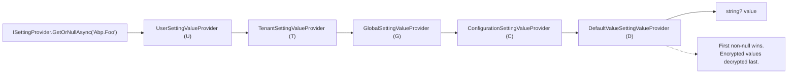
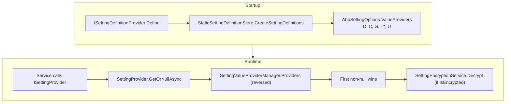

ABP's setting system is the strongly-typed, hierarchically resolved cousin of `IConfiguration`. Each module declares its tunable parameters by deriving from `SettingDefinitionProvider` and adding `SettingDefinition` instances to the central `ISettingDefinitionContext`. At read time, code calls `ISettingProvider.GetOrNullAsync(name)` and the resolver walks an ordered chain of `ISettingValueProvider` instances — user, tenant, global, configuration, and finally the static default — returning the first non-null value. This page is the ground-truth catalogue of how those parts fit together and which `*SettingNames` classes ship in the framework.

<Info>
  Core types live under `framework/src/Volo.Abp.Settings/Volo/Abp/Settings/`. Per-module setting names and providers live alongside their owning module (`Volo.Abp.Emailing`, `Volo.Abp.Timing`, `Volo.Abp.Localization`, `Volo.Abp.Ldap.Abstractions`, etc.). The `setting-management` module under `modules/setting-management/` provides persistence (`ISettingManagementProvider`) and the dynamic store.
</Info>

## Anatomy of a `SettingDefinition`

```csharp title="framework/src/Volo.Abp.Settings/Volo/Abp/Settings/SettingDefinition.cs"
public class SettingDefinition
{
    [NotNull] public string Name { get; }
    [NotNull] public ILocalizableString DisplayName { get; set; }
    public ILocalizableString? Description { get; set; }
    public string? DefaultValue { get; set; }
    public bool IsVisibleToClients { get; set; }
    public List<string> Providers { get; }
    public bool IsInherited { get; set; }
    [NotNull] public Dictionary<string, object> Properties { get; }
    public bool IsEncrypted { get; set; }

    public SettingDefinition(
        string name,
        string? defaultValue = null,
        ILocalizableString? displayName = null,
        ILocalizableString? description = null,
        bool isVisibleToClients = false,
        bool isInherited = true,
        bool isEncrypted = false);

    public virtual SettingDefinition WithProperty(string key, object value);
    public virtual SettingDefinition WithProviders(params string[] providers);
}
```

| Field | Purpose | Default |
| --- | --- | --- |
| `Name` | Globally unique key (typically `Abp.<Module>.<Setting>`) | required |
| `DefaultValue` | Static fallback returned by `DefaultValueSettingValueProvider` | `null` |
| `DisplayName` / `Description` | Localizable labels (default: `FixedLocalizableString(name)`) | `name` |
| `IsVisibleToClients` | Surfaced through application configuration endpoint | `false` |
| `Providers` | Allow-list of value provider names (empty = all allowed) | empty |
| `IsInherited` | Reserved — currently a TODO in `SettingProvider` | `true` |
| `IsEncrypted` | Encrypt/decrypt through `ISettingEncryptionService` | `false` |
| `Properties` | Free-form dictionary for module-specific metadata | empty |

<Note>
  The `IsInherited` flag is wired through the type but `SettingProvider.GetOrNullAsync` contains an explicit `//TODO: How to implement setting.IsInherited?` comment, so today every scope is consulted regardless of the flag's value.
</Note>

## Defining settings — `ISettingDefinitionProvider`

```csharp title="framework/src/Volo.Abp.Settings/Volo/Abp/Settings/ISettingDefinitionProvider.cs"
public interface ISettingDefinitionProvider
{
    void Define(ISettingDefinitionContext context);
}

public abstract class SettingDefinitionProvider : ISettingDefinitionProvider, ITransientDependency
{
    public abstract void Define(ISettingDefinitionContext context);
}
```

```csharp title="framework/src/Volo.Abp.Settings/Volo/Abp/Settings/ISettingDefinitionContext.cs"
public interface ISettingDefinitionContext
{
    SettingDefinition? GetOrNull(string name);
    IReadOnlyList<SettingDefinition> GetAll();
    void Add(params SettingDefinition[] definitions);
}
```

Providers are auto-discovered by `AbpSettingsModule.PreConfigureServices`: any concrete type assignable to `ISettingDefinitionProvider` is appended to `AbpSettingOptions.DefinitionProviders` via `IServiceCollection.OnRegistered`.

```csharp title="framework/src/Volo.Abp.Settings/Volo/Abp/Settings/AbpSettingsModule.cs"
public override void PreConfigureServices(ServiceConfigurationContext context)
{
    AutoAddDefinitionProviders(context.Services);
}

public override void ConfigureServices(ServiceConfigurationContext context)
{
    Configure<AbpSettingOptions>(options =>
    {
        options.ValueProviders.Add<DefaultValueSettingValueProvider>();
        options.ValueProviders.Add<ConfigurationSettingValueProvider>();
        options.ValueProviders.Add<GlobalSettingValueProvider>();
        options.ValueProviders.Add<UserSettingValueProvider>();
    });
}
```

`TenantSettingValueProvider` lives in `Volo.Abp.MultiTenancy` and inserts itself between Global and User when that module is referenced.

## The provider chain — `ISettingValueProvider`

```csharp title="framework/src/Volo.Abp.Settings/Volo/Abp/Settings/ISettingValueProvider.cs"
public interface ISettingValueProvider
{
    string Name { get; }
    Task<string?> GetOrNullAsync(SettingDefinition setting);
    Task<List<SettingValue>> GetAllAsync(SettingDefinition[] settings);
}
```

`ISettingProvider` exposes the public API consumed by application code; its default implementation walks the value provider list in **reverse** order so that higher-priority sources win.

```csharp title="framework/src/Volo.Abp.Settings/Volo/Abp/Settings/SettingProvider.cs"
public virtual async Task<string?> GetOrNullAsync(string name)
{
    var setting = await SettingDefinitionManager.GetAsync(name);
    var providers = Enumerable.Reverse(SettingValueProviderManager.Providers);

    if (setting.Providers.Any())
    {
        providers = providers.Where(p => setting.Providers.Contains(p.Name));
    }

    var value = await GetOrNullValueFromProvidersAsync(providers, setting);
    if (value != null && setting.IsEncrypted)
    {
        value = SettingEncryptionService.Decrypt(setting, value);
    }

    return value;
}
```

### Lookup order



| Provider | Name | Source | Constants |
| --- | --- | --- | --- |
| `UserSettingValueProvider` | `"U"` | `ISettingStore` keyed by `CurrentUser.Id` | `framework/src/Volo.Abp.Settings/.../UserSettingValueProvider.cs` |
| `TenantSettingValueProvider` | `"T"` | `ISettingStore` keyed by `CurrentTenant.Id` | `framework/src/Volo.Abp.MultiTenancy/.../TenantSettingValueProvider.cs` |
| `GlobalSettingValueProvider` | `"G"` | `ISettingStore` with a `null` scope key | `framework/src/Volo.Abp.Settings/.../GlobalSettingValueProvider.cs` |
| `ConfigurationSettingValueProvider` | `"C"` | `IConfiguration["Settings:<name>"]` | `framework/src/Volo.Abp.Settings/.../ConfigurationSettingValueProvider.cs` |
| `DefaultValueSettingValueProvider` | `"D"` | `SettingDefinition.DefaultValue` | `framework/src/Volo.Abp.Settings/.../DefaultValueSettingValueProvider.cs` |

```csharp title="framework/src/Volo.Abp.Settings/.../ConfigurationSettingValueProvider.cs"
public class ConfigurationSettingValueProvider : ISettingValueProvider, ITransientDependency
{
    public const string ConfigurationNamePrefix = "Settings:";
    public const string ProviderName = "C";

    public virtual Task<string?> GetOrNullAsync(SettingDefinition setting)
    {
        return Task.FromResult(Configuration[ConfigurationNamePrefix + setting.Name]);
    }
}
```

```csharp title="framework/src/Volo.Abp.Settings/.../DefaultValueSettingValueProvider.cs"
public class DefaultValueSettingValueProvider : SettingValueProvider
{
    public const string ProviderName = "D";

    public override Task<string?> GetOrNullAsync(SettingDefinition setting)
    {
        return Task.FromResult(setting.DefaultValue);
    }
}
```

```csharp title="framework/src/Volo.Abp.Settings/.../GlobalSettingValueProvider.cs"
public class GlobalSettingValueProvider : SettingValueProvider
{
    public const string ProviderName = "G";

    public override Task<string?> GetOrNullAsync(SettingDefinition setting)
        => SettingStore.GetOrNullAsync(setting.Name, Name, null);
}
```

```csharp title="framework/src/Volo.Abp.Settings/.../UserSettingValueProvider.cs"
public class UserSettingValueProvider : SettingValueProvider
{
    public const string ProviderName = "U";

    public override async Task<string?> GetOrNullAsync(SettingDefinition setting)
    {
        if (CurrentUser.Id == null) return null;
        return await SettingStore.GetOrNullAsync(setting.Name, Name, CurrentUser.Id.ToString());
    }
}
```

```csharp title="framework/src/Volo.Abp.MultiTenancy/.../TenantSettingValueProvider.cs"
public class TenantSettingValueProvider : SettingValueProvider
{
    public const string ProviderName = "T";

    public async override Task<string?> GetOrNullAsync(SettingDefinition setting)
        => await SettingStore.GetOrNullAsync(setting.Name, Name, CurrentTenant.Id?.ToString());
}
```

<Tip>
  A definition can pin itself to a subset of providers. `new SettingDefinition("Abp.Foo").WithProviders("U", "G")` skips configuration and default lookup; the resolver short-circuits via the `setting.Providers.Contains(p.Name)` filter inside `SettingProvider.GetOrNullAsync`.
</Tip>

### Consuming settings

The public surface is intentionally tiny:

```csharp title="framework/src/Volo.Abp.Settings/Volo/Abp/Settings/ISettingProvider.cs"
public interface ISettingProvider
{
    Task<string?> GetOrNullAsync([NotNull] string name);
    Task<List<SettingValue>> GetAllAsync([NotNull] string[] names);
    Task<List<SettingValue>> GetAllAsync();
}
```

Strongly-typed reads go through extension methods:

```csharp title="framework/src/Volo.Abp.Settings/Volo/Abp/Settings/SettingProviderExtensions.cs"
public static async Task<bool> IsTrueAsync(this ISettingProvider settingProvider, string name);

public static async Task<T> GetAsync<T>(this ISettingProvider settingProvider, string name, T defaultValue = default)
    where T : struct;
```

## `*SettingNames` catalogue

The framework ships four `*SettingNames` constant classes, plus two more in the application module catalog. Each pairs with a `SettingDefinitionProvider` that registers the definitions at startup.

| `*SettingNames` class | File | Provider | Notes |
| --- | --- | --- | --- |
| `EmailSettingNames` | `framework/src/Volo.Abp.Emailing/.../EmailSettingNames.cs` | `EmailSettingProvider` (`internal`) | SMTP host/port/credentials and default `From` |
| `LocalizationSettingNames` | `framework/src/Volo.Abp.Localization/.../LocalizationSettingNames.cs` | `LocalizationSettingProvider` | Default UI language |
| `TimingSettingNames` | `framework/src/Volo.Abp.Timing/.../TimingSettingNames.cs` | `TimingSettingProvider` | Default time zone |
| `LdapSettingNames` | `framework/src/Volo.Abp.Ldap.Abstractions/.../LdapSettingNames.cs` | `LdapSettingDefinitionProvider` (in `Volo.Abp.Ldap`) | LDAP server connection |
| `AccountSettingNames` | `modules/account/src/Volo.Abp.Account.Application.Contracts/.../AccountSettingNames.cs` | `AccountSettingDefinitionProvider` | Self-registration and local-login switches |
| `IdentitySettingNames` | `modules/identity/src/Volo.Abp.Identity.Domain.Shared/.../IdentitySettingNames.cs` | `AbpIdentitySettingDefinitionProvider` | Password, lockout, sign-in, user, OU |

### `EmailSettingNames` — `Volo.Abp.Emailing`

```csharp title="framework/src/Volo.Abp.Emailing/Volo/Abp/Emailing/EmailSettingNames.cs"
public static class EmailSettingNames
{
    public const string DefaultFromAddress     = "Abp.Mailing.DefaultFromAddress";
    public const string DefaultFromDisplayName = "Abp.Mailing.DefaultFromDisplayName";

    public static class Smtp
    {
        public const string Host                  = "Abp.Mailing.Smtp.Host";
        public const string Port                  = "Abp.Mailing.Smtp.Port";
        public const string UserName              = "Abp.Mailing.Smtp.UserName";
        public const string Password              = "Abp.Mailing.Smtp.Password";
        public const string Domain                = "Abp.Mailing.Smtp.Domain";
        public const string EnableSsl             = "Abp.Mailing.Smtp.EnableSsl";
        public const string UseDefaultCredentials = "Abp.Mailing.Smtp.UseDefaultCredentials";
    }
}
```

| Setting | Default | Encrypted |
| --- | --- | --- |
| `Abp.Mailing.Smtp.Host` | `"127.0.0.1"` | |
| `Abp.Mailing.Smtp.Port` | `"25"` | |
| `Abp.Mailing.Smtp.UserName` | _none_ | |
| `Abp.Mailing.Smtp.Password` | _none_ | ✓ (`IsEncrypted = true`) |
| `Abp.Mailing.Smtp.Domain` | _none_ | |
| `Abp.Mailing.Smtp.EnableSsl` | `"false"` | |
| `Abp.Mailing.Smtp.UseDefaultCredentials` | `"true"` | |
| `Abp.Mailing.DefaultFromAddress` | `"noreply@abp.io"` | |
| `Abp.Mailing.DefaultFromDisplayName` | `"ABP application"` | |

```csharp title="framework/src/Volo.Abp.Emailing/.../EmailSettingProvider.cs"
new SettingDefinition(
    EmailSettingNames.Smtp.Password,
    displayName: L("DisplayName:Abp.Mailing.Smtp.Password"),
    description: L("Description:Abp.Mailing.Smtp.Password"),
    isEncrypted: true),
```

### `LocalizationSettingNames` — `Volo.Abp.Localization`

```csharp title="framework/src/Volo.Abp.Localization/.../LocalizationSettingNames.cs"
public static class LocalizationSettingNames
{
    public const string DefaultLanguage = "Abp.Localization.DefaultLanguage";
}
```

```csharp title="framework/src/Volo.Abp.Localization/.../LocalizationSettingProvider.cs"
context.Add(
    new SettingDefinition(LocalizationSettingNames.DefaultLanguage,
        "en",
        L("DisplayName:Abp.Localization.DefaultLanguage"),
        L("Description:Abp.Localization.DefaultLanguage"),
        isVisibleToClients: true)
);
```

| Setting | Default | Visible to clients |
| --- | --- | --- |
| `Abp.Localization.DefaultLanguage` | `"en"` | ✓ |

### `TimingSettingNames` — `Volo.Abp.Timing`

```csharp title="framework/src/Volo.Abp.Timing/Volo/Abp/Timing/TimingSettingNames.cs"
public static class TimingSettingNames
{
    public const string TimeZone = "Abp.Timing.TimeZone";
}
```

```csharp title="framework/src/Volo.Abp.Timing/.../TimingSettingProvider.cs"
context.Add(
    new SettingDefinition(TimingSettingNames.TimeZone,
        "UTC",
        L("DisplayName:Abp.Timing.Timezone"),
        L("Description:Abp.Timing.Timezone"),
        isVisibleToClients: true)
);
```

| Setting | Default | Visible to clients |
| --- | --- | --- |
| `Abp.Timing.TimeZone` | `"UTC"` | ✓ |

### `LdapSettingNames` — `Volo.Abp.Ldap`

```csharp title="framework/src/Volo.Abp.Ldap.Abstractions/Volo/Abp/Ldap/LdapSettingNames.cs"
public static class LdapSettingNames
{
    public const string Ldaps      = "Abp.Ldap.Ldaps";
    public const string ServerHost = "Abp.Ldap.ServerHost";
    public const string ServerPort = "Abp.Ldap.ServerPort";
    public const string BaseDc     = "Abp.Ldap.BaseDc";
    public const string Domain     = "Abp.Ldap.Domain";
    public const string UserName   = "Abp.Ldap.UserName";
    public const string Password   = "Abp.Ldap.Password";
}
```

| Setting | Default | Encrypted |
| --- | --- | --- |
| `Abp.Ldap.Ldaps` | `"false"` | |
| `Abp.Ldap.ServerHost` | `""` | |
| `Abp.Ldap.ServerPort` | `"389"` | |
| `Abp.Ldap.BaseDc` | `""` | |
| `Abp.Ldap.Domain` | `""` | |
| `Abp.Ldap.UserName` | `""` | |
| `Abp.Ldap.Password` | `""` | ✓ |

The encryption flag is set in the provider:

```csharp title="framework/src/Volo.Abp.Ldap/Volo/Abp/Ldap/LdapSettingDefinitionProvider.cs"
new SettingDefinition(
    LdapSettingNames.Password,
    "",
    L("DisplayName:Abp.Ldap.Password"),
    L("Description:Abp.Ldap.Password"),
    isEncrypted: true)
```

### `AccountSettingNames` — `Volo.Abp.Account`

```csharp title="modules/account/.../AccountSettingNames.cs"
public class AccountSettingNames
{
    public const string IsSelfRegistrationEnabled = "Abp.Account.IsSelfRegistrationEnabled";
    public const string EnableLocalLogin          = "Abp.Account.EnableLocalLogin";
}
```

```csharp title="modules/account/.../AccountSettingDefinitionProvider.cs"
context.Add(
    new SettingDefinition(
        AccountSettingNames.IsSelfRegistrationEnabled,
        "true",
        L("DisplayName:Abp.Account.IsSelfRegistrationEnabled"),
        L("Description:Abp.Account.IsSelfRegistrationEnabled"),
        isVisibleToClients: true));

context.Add(
    new SettingDefinition(
        AccountSettingNames.EnableLocalLogin,
        "true",
        L("DisplayName:Abp.Account.EnableLocalLogin"),
        L("Description:Abp.Account.EnableLocalLogin"),
        isVisibleToClients: true));
```

### `IdentitySettingNames` — `Volo.Abp.Identity`

```csharp title="modules/identity/.../IdentitySettingNames.cs"
public static class IdentitySettingNames
{
    private const string Prefix = "Abp.Identity";

    public static class Password
    {
        public const string RequiredLength                       = "Abp.Identity.Password.RequiredLength";
        public const string RequiredUniqueChars                  = "Abp.Identity.Password.RequiredUniqueChars";
        public const string RequireNonAlphanumeric               = "Abp.Identity.Password.RequireNonAlphanumeric";
        public const string RequireLowercase                     = "Abp.Identity.Password.RequireLowercase";
        public const string RequireUppercase                     = "Abp.Identity.Password.RequireUppercase";
        public const string RequireDigit                         = "Abp.Identity.Password.RequireDigit";
        public const string ForceUsersToPeriodicallyChangePassword = "Abp.Identity.Password.ForceUsersToPeriodicallyChangePassword";
        public const string PasswordChangePeriodDays             = "Abp.Identity.Password.PasswordChangePeriodDays";
    }

    public static class Lockout
    {
        public const string AllowedForNewUsers   = "Abp.Identity.Lockout.AllowedForNewUsers";
        public const string LockoutDuration      = "Abp.Identity.Lockout.LockoutDuration";
        public const string MaxFailedAccessAttempts = "Abp.Identity.Lockout.MaxFailedAccessAttempts";
    }

    public static class SignIn
    {
        public const string RequireConfirmedEmail        = "Abp.Identity.SignIn.RequireConfirmedEmail";
        public const string EnablePhoneNumberConfirmation = "Abp.Identity.SignIn.EnablePhoneNumberConfirmation";
        public const string RequireConfirmedPhoneNumber  = "Abp.Identity.SignIn.RequireConfirmedPhoneNumber";
    }

    public static class User
    {
        public const string IsUserNameUpdateEnabled = "Abp.Identity.User.IsUserNameUpdateEnabled";
        public const string IsEmailUpdateEnabled    = "Abp.Identity.User.IsEmailUpdateEnabled";
    }

    public static class OrganizationUnit
    {
        public const string MaxUserMembershipCount = "Abp.Identity.OrganizationUnit.MaxUserMembershipCount";
    }
}
```

| Setting | Default | Visible to clients |
| --- | --- | --- |
| `Abp.Identity.Password.RequiredLength` | `"6"` | ✓ |
| `Abp.Identity.Password.RequiredUniqueChars` | `"1"` | ✓ |
| `Abp.Identity.Password.RequireNonAlphanumeric` | `"True"` | ✓ |
| `Abp.Identity.Password.RequireLowercase` | `"True"` | ✓ |
| `Abp.Identity.Password.RequireUppercase` | `"True"` | ✓ |
| `Abp.Identity.Password.RequireDigit` | `"True"` | ✓ |
| `Abp.Identity.Password.ForceUsersToPeriodicallyChangePassword` | `"False"` | ✓ |
| `Abp.Identity.Password.PasswordChangePeriodDays` | `"0"` | ✓ |
| `Abp.Identity.Lockout.AllowedForNewUsers` | `"True"` | ✓ |
| `Abp.Identity.Lockout.LockoutDuration` | `"300"` (5 × 60) | ✓ |
| `Abp.Identity.Lockout.MaxFailedAccessAttempts` | `"5"` | ✓ |
| `Abp.Identity.SignIn.RequireConfirmedEmail` | `"False"` | ✓ |
| `Abp.Identity.SignIn.EnablePhoneNumberConfirmation` | `"True"` | ✓ |

(Defaults are taken from `AbpIdentitySettingDefinitionProvider.Define`; see the source for the rest.)

## Definition store and value-provider manager

```csharp title="framework/src/Volo.Abp.Settings/.../StaticSettingDefinitionStore.cs"
public class StaticSettingDefinitionStore : IStaticSettingDefinitionStore, ISingletonDependency
{
    protected virtual IDictionary<string, SettingDefinition> CreateSettingDefinitions()
    {
        var settings = new Dictionary<string, SettingDefinition>();

        using (var scope = ServiceProvider.CreateScope())
        {
            var providers = Options
                .DefinitionProviders
                .Select(p => scope.ServiceProvider.GetRequiredService(p) as ISettingDefinitionProvider)
                .ToList();

            foreach (var provider in providers)
            {
                provider?.Define(new SettingDefinitionContext(settings));
            }
        }

        return settings;
    }
}
```

The store lazily materializes definitions on first read. `IDynamicSettingDefinitionStore` (default: `NullDynamicSettingDefinitionStore`) is the extension point for database-backed definitions used by the `setting-management` module.

## Persistence via the `SettingManagement` module

The framework on its own only knows three layers: **configuration**, **defaults**, and an in-memory `NullSettingStore`. The `Volo.Abp.SettingManagement.Domain` module replaces that store with an EF Core / MongoDB backed implementation and introduces a parallel chain of *write* providers:

```csharp title="modules/setting-management/.../AbpSettingManagementDomainModule.cs"
Configure<SettingManagementOptions>(options =>
{
    options.Providers.Add<DefaultValueSettingManagementProvider>();
    options.Providers.Add<ConfigurationSettingManagementProvider>();
    options.Providers.Add<GlobalSettingManagementProvider>();
    options.Providers.Add<TenantSettingManagementProvider>();
    options.Providers.Add<UserSettingManagementProvider>();
});
```

```csharp title="modules/setting-management/.../SettingManagementOptions.cs"
public class SettingManagementOptions
{
    public ITypeList<ISettingManagementProvider> Providers { get; }
    public bool SaveStaticSettingsToDatabase { get; set; } = true;
    public bool IsDynamicSettingStoreEnabled { get; set; }
}
```

When `SaveStaticSettingsToDatabase` is true (the default), the module schedules `IStaticSettingSaver.SaveAsync()` during `OnApplicationInitialization` and retries via Polly so the database row matches the static definition. When `IsDynamicSettingStoreEnabled` is true, definitions can be added or removed at runtime by other tenants/modules.

<Note>
  The module also flips both switches off when `services.IsDataMigrationEnvironment()` returns true so that EF migrations skip the seed work.
</Note>

## Reading from `IConfiguration`

`ConfigurationSettingValueProvider` strips the `Settings:` prefix when querying:

```jsonc title="appsettings.json"
{
  "Settings": {
    "Abp.Mailing.Smtp.Host": "smtp.example.com",
    "Abp.Mailing.Smtp.Port": "587",
    "Abp.Mailing.DefaultFromAddress": "noreply@example.com"
  }
}
```

That makes `appsettings.json` an effective override layer for any setting whose definition does not restrict providers — values flow into the chain just above the static `DefaultValue`.

## Putting it all together



<Tip>
  `* TenantSettingValueProvider` is only registered when `Volo.Abp.MultiTenancy` is referenced; otherwise the chain collapses to `D → C → G → U`.
</Tip>

## Reading further

- [Settings overview](/settings-features/settings-overview) — narrative tour of `Volo.Abp.Settings`, the encryption service, and `ISettingStore`.
- [Setting providers](/settings-features/setting-providers) — deep dive on value provider implementations.
- [Setting management module](/settings-features/setting-management-module) — DB-backed dynamic store, REST API, and UI.
- [Options classes catalog](/config/options-classes) — the partner page covering `AbpSettingOptions` and 30+ other module options.
- [Modularity overview](/modularity/overview) — for the auto-registration story behind `AutoAddDefinitionProviders`.
- [Web overview](/web/overview) — context on how `IsVisibleToClients` settings are exposed via `AbpApplicationConfigurationOptions`.
