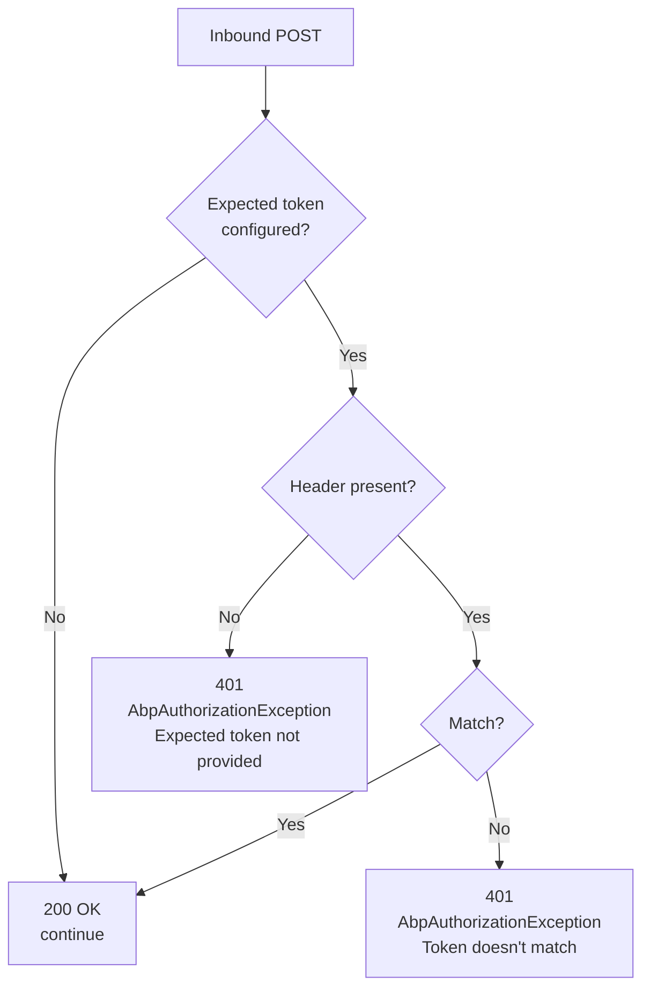
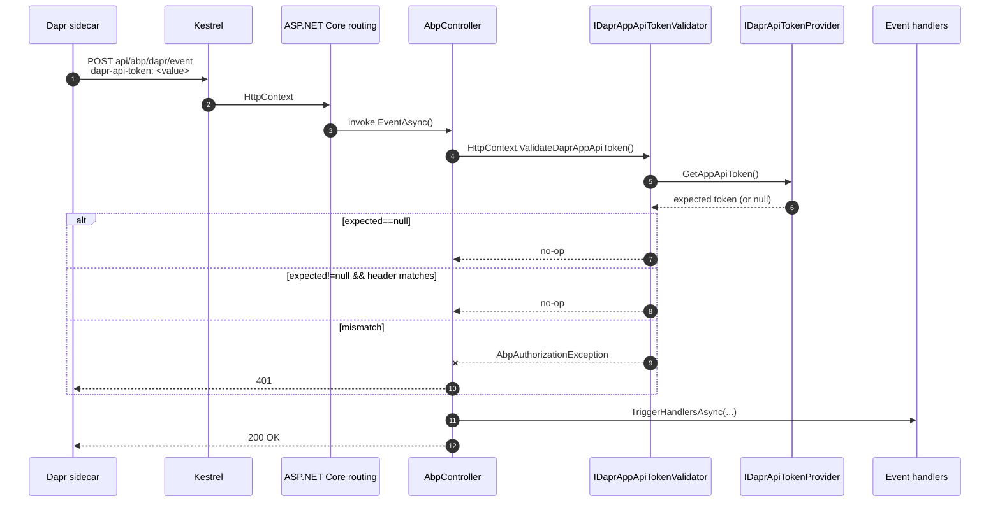

`Volo.Abp.AspNetCore.Mvc.Dapr` is the smallest of the ABP Dapr packages — its only job is to bolt the *inbound* half of the Dapr API-token model onto an MVC application. Where `Volo.Abp.Dapr` carries the *outbound* `DaprApiToken` that the application sends to the sidecar, this package introduces the *inbound* `AppApiToken` that the sidecar attaches to every callback (pub/sub deliveries, input binding triggers, service-invocation requests…) so the application can refuse forged traffic. The validator is exposed both as a DI service (`IDaprAppApiTokenValidator`) and as `HttpContext` extension methods so any MVC controller, Razor Page or minimal endpoint can opt in with a single line.

The package itself ships no controllers, middleware or filters — its consumers (notably [`/dapr/distributed-event-bus`](/dapr/distributed-event-bus)) call `HttpContext.ValidateDaprAppApiToken()` at the top of their action methods to keep the validation explicit and visible at the call site.

## File inventory

<Files>
```
framework/src/Volo.Abp.AspNetCore.Mvc.Dapr/
└── Volo/Abp/AspNetCore/Mvc/Dapr/
    ├── AbpAspNetCoreMvcDaprModule.cs   ← module (depends on MVC + Dapr base)
    ├── IDaprAppApiTokenValidator.cs    ← validator contract
    ├── DaprAppApiTokenValidator.cs     ← default impl, reads `dapr-api-token` header
    └── DaprHttpContextExtensions.cs    ← Validate/IsValid/GetOrNull on HttpContext
```
</Files>

## `AbpAspNetCoreMvcDaprModule`

The module is intentionally tiny — registration of the validator happens through `ISingletonDependency` so the class itself is enough; the module only declares the dependency on MVC and the Dapr base:

```csharp framework/src/Volo.Abp.AspNetCore.Mvc.Dapr/Volo/Abp/AspNetCore/Mvc/Dapr/AbpAspNetCoreMvcDaprModule.cs
using Volo.Abp.Dapr;
using Volo.Abp.Modularity;

namespace Volo.Abp.AspNetCore.Mvc.Dapr;

[DependsOn(
    typeof(AbpAspNetCoreMvcModule),
    typeof(AbpDaprModule)
)]
public class AbpAspNetCoreMvcDaprModule : AbpModule
{

}
```

That's the entire file. The validator's `[ISingletonDependency]` marker is what gets it registered; the module exists as a declarative dependency anchor for higher-level packages (`Volo.Abp.AspNetCore.Mvc.Dapr.EventBus` declares `[DependsOn(typeof(AbpAspNetCoreMvcDaprModule), …)]`).

## `IDaprAppApiTokenValidator`

The contract exposes three operations — two flavours of validation plus a raw accessor:

```csharp framework/src/Volo.Abp.AspNetCore.Mvc.Dapr/Volo/Abp/AspNetCore/Mvc/Dapr/IDaprAppApiTokenValidator.cs
namespace Volo.Abp.AspNetCore.Mvc.Dapr;

public interface IDaprAppApiTokenValidator
{
    void CheckDaprAppApiToken();

    bool IsValidDaprAppApiToken();

    string? GetDaprAppApiTokenOrNull();
}
```

The semantics:

| Method | Behaviour |
| --- | --- |
| `CheckDaprAppApiToken()` | Throws `AbpAuthorizationException` if the expected token is configured and the inbound header is missing or wrong. No-op if no expected token is configured. |
| `IsValidDaprAppApiToken()` | Boolean-returning variant for branching logic. Returns `true` when no expected token is configured (open mode). |
| `GetDaprAppApiTokenOrNull()` | Returns the raw `dapr-api-token` header value, or `null` when absent. |

The "open mode" (returning `true`/no-op when no token is configured) is deliberate: development environments without a token set on either side keep working without code changes.

## `DaprAppApiTokenValidator` — default implementation

The validator is registered as `ISingletonDependency` and pulls `IHttpContextAccessor` plus reads the expected token through `IDaprApiTokenProvider.GetAppApiToken()` per call:

```csharp framework/src/Volo.Abp.AspNetCore.Mvc.Dapr/Volo/Abp/AspNetCore/Mvc/Dapr/DaprAppApiTokenValidator.cs
public class DaprAppApiTokenValidator : IDaprAppApiTokenValidator, ISingletonDependency
{
    protected IHttpContextAccessor HttpContextAccessor { get; }
    protected HttpContext HttpContext => GetHttpContext();

    public DaprAppApiTokenValidator(IHttpContextAccessor httpContextAccessor)
    {
        HttpContextAccessor = httpContextAccessor;
    }

    public virtual void CheckDaprAppApiToken()
    {
        var expectedAppApiToken = GetConfiguredAppApiTokenOrNull();
        if (expectedAppApiToken.IsNullOrWhiteSpace())
        {
            return;
        }

        var headerAppApiToken = GetDaprAppApiTokenOrNull();
        if (headerAppApiToken.IsNullOrWhiteSpace())
        {
            throw new AbpAuthorizationException(
                "Expected Dapr App API Token is not provided! " +
                "Dapr should set the 'dapr-api-token' HTTP header.");
        }

        if (expectedAppApiToken != headerAppApiToken)
        {
            throw new AbpAuthorizationException(
                "The Dapr App API Token (provided in the 'dapr-api-token' HTTP header) " +
                "doesn't match the expected value!");
        }
    }

    public virtual bool IsValidDaprAppApiToken()
    {
        var expectedAppApiToken = GetConfiguredAppApiTokenOrNull();
        if (expectedAppApiToken.IsNullOrWhiteSpace())
        {
            return true;
        }

        var headerAppApiToken = GetDaprAppApiTokenOrNull();
        return expectedAppApiToken == headerAppApiToken;
    }

    public virtual string? GetDaprAppApiTokenOrNull()
    {
        string? apiTokenHeader = HttpContext.Request.Headers["dapr-api-token"];
        if (string.IsNullOrEmpty(apiTokenHeader) || apiTokenHeader.Length < 1)
        {
            return null;
        }

        return apiTokenHeader;
    }

    protected virtual string? GetConfiguredAppApiTokenOrNull()
    {
        return HttpContext
            .RequestServices
            .GetRequiredService<IDaprApiTokenProvider>()
            .GetAppApiToken();
    }

    protected virtual HttpContext GetHttpContext()
    {
        return HttpContextAccessor.HttpContext
            ?? throw new AbpException("HttpContext is not available!");
    }
}
```

Notes:

- The expected token is fetched **per call** via `HttpContext.RequestServices.GetRequiredService<IDaprApiTokenProvider>()`. That means custom providers (see [`/dapr/secret-store`](/dapr/secret-store#replacing-idaprapitokenprovider-with-a-secret-store-lookup)) get a chance to refresh from a secret store between calls.
- The header is **case-insensitive** because `HeaderDictionary` is case-insensitive — Dapr sends `dapr-api-token`.
- The exception thrown is `AbpAuthorizationException`, not `UnauthorizedAccessException`. ABP's global exception filter maps it to an HTTP `401 Unauthorized`.
- The default-deny posture is **enabled** by configuring `AbpDaprOptions.AppApiToken` (or its env-var fallback `APP_API_TOKEN`). Without it, the validator is permissive — useful in dev but should never be the production state.

## `DaprHttpContextExtensions`

Three static helpers wrap the DI lookups so action code stays short:

```csharp framework/src/Volo.Abp.AspNetCore.Mvc.Dapr/Volo/Abp/AspNetCore/Mvc/Dapr/DaprHttpContextExtensions.cs
public static class DaprHttpContextExtensions
{
    public static void ValidateDaprAppApiToken(this HttpContext httpContext)
    {
        httpContext
            .RequestServices
            .GetRequiredService<IDaprAppApiTokenValidator>()
            .CheckDaprAppApiToken();
    }

    public static bool IsValidDaprAppApiToken(this HttpContext httpContext)
    {
        return httpContext
            .RequestServices
            .GetRequiredService<IDaprAppApiTokenValidator>()
            .IsValidDaprAppApiToken();
    }

    public static string? GetDaprAppApiTokenOrNull(HttpContext httpContext)
    {
        return httpContext
            .RequestServices
            .GetRequiredService<IDaprAppApiTokenValidator>()
            .GetDaprAppApiTokenOrNull();
    }
}
```

The first two are `this`-extensions; the third is intentionally not — symmetry with `HttpContext` extensions in the rest of the framework that read but do not enforce.

## Usage patterns

### In an MVC controller

The canonical example is `AbpAspNetCoreMvcDaprEventsController` in the event-bus package:

```csharp framework/src/Volo.Abp.AspNetCore.Mvc.Dapr.EventBus/Volo/Abp/AspNetCore/Mvc/Dapr/EventBus/Controllers/AbpAspNetCoreMvcDaprEventsController.cs (excerpt)
[Area("abp")]
[RemoteService(Name = "abp")]
public class AbpAspNetCoreMvcDaprEventsController : AbpController
{
    [HttpPost(AbpAspNetCoreMvcDaprPubSubConsts.DaprEventCallbackUrl)]
    public virtual async Task<IActionResult> EventAsync()
    {
        HttpContext.ValidateDaprAppApiToken();   // ← first line

        var daprSerializer = HttpContext.RequestServices.GetRequiredService<IDaprSerializer>();
        // … deserialize the pub/sub payload and dispatch to handlers …
        return Ok();
    }
}
```

The validation runs *before* the body is read. If the token is wrong, the request never reaches the deserialiser or the handler chain, and the failure is logged through ABP's standard exception filter as `401 Unauthorized`.

### In your own Dapr-routed endpoint

Any controller that's exposed as a Dapr [input binding](https://docs.dapr.io/reference/components-reference/supported-bindings/) callback or a service-invocation target should do the same:

```csharp Controllers/PaymentWebhookController.cs
public class PaymentWebhookController : AbpController
{
    [HttpPost("api/dapr/payment-webhook")]
    public async Task<IActionResult> Handle()
    {
        HttpContext.ValidateDaprAppApiToken();

        // …read body, process …
        return Ok();
    }
}
```

In a minimal API:

```csharp Program.cs
app.MapPost("/api/dapr/payment-webhook", async ctx =>
{
    ctx.ValidateDaprAppApiToken();
    // …
});
```

### Branching logic with `IsValidDaprAppApiToken`

Use the boolean variant when an endpoint accepts both Dapr-routed and direct traffic but needs to distinguish them:

```csharp Controllers/HybridController.cs
[HttpGet("api/orders")]
public IActionResult List()
{
    if (HttpContext.IsValidDaprAppApiToken())
    {
        // came from the sidecar — skip CSRF, allow all tenants
    }
    else
    {
        // direct traffic — apply standard auth
    }
    // …
}
```

### Reading the raw header

`GetDaprAppApiTokenOrNull` is the escape hatch when you need to inspect the token for diagnostic logging or to pass it through to another component:

```csharp
var token = DaprHttpContextExtensions.GetDaprAppApiTokenOrNull(HttpContext);
Logger.LogDebug("Inbound Dapr token starts with {Prefix}…", token?[..4]);
```

## Configuration

Inbound validation is controlled by the same `AbpDaprOptions.AppApiToken` documented in [`/dapr/sidecar-and-client`](/dapr/sidecar-and-client), with the same three resolution sources `AbpDaprModule` applies:

| Source | Example | Notes |
| --- | --- | --- |
| `appsettings.json` `Dapr:AppApiToken` | `{"Dapr":{"AppApiToken":"…"}}` | Highest precedence after explicit `Configure<AbpDaprOptions>` callbacks. |
| Flat config key `APP_API_TOKEN` | `{"APP_API_TOKEN":"…"}` | Used by Helm charts that mount a single flat config. |
| Environment variable `APP_API_TOKEN` | `APP_API_TOKEN=…` | Falls back to the standard Dapr environment variable name. |

Run the sidecar with `--app-token <value>`. The same value must be set in `AbpDaprOptions.AppApiToken` (directly or via env var) so the validator can compare.

## Failure modes



The first path — *no token configured* — is the developer-mode default. As soon as you set `APP_API_TOKEN` on the sidecar **and** in `AbpDaprOptions`, both halves must match per-request.

## Interaction with other ABP pieces

| Component | Interaction |
| --- | --- |
| `AbpController` exception filter | Maps `AbpAuthorizationException` to `401`; the standard ABP logging pipeline records request id + endpoint name. |
| `ICurrentTenant` | Independent. The validator runs before tenant resolution; tenant headers (`__tenant`) are honoured by the rest of the pipeline regardless. |
| Anti-forgery | Dapr-routed pub/sub callbacks bypass anti-forgery because the controller class is decorated with `[Area("abp")]` and the event endpoint does not opt in. |
| Authorization policies | Independent. You can stack `[Authorize]` on top of `HttpContext.ValidateDaprAppApiToken()` if a callback should be both Dapr-authorised *and* user-authorised. |

## Where this fits in the request lifecycle



## Tests and overrides

`DaprAppApiTokenValidator` is `virtual` everywhere — both the public methods and the `GetConfiguredAppApiTokenOrNull` / `GetHttpContext` helpers — so the standard approach to customisation is to subclass with `[Dependency(ReplaceServices = true)]`:

```csharp Infrastructure/HmacDaprAppApiTokenValidator.cs
[Dependency(ReplaceServices = true)]
[ExposeServices(typeof(IDaprAppApiTokenValidator))]
public class HmacDaprAppApiTokenValidator : DaprAppApiTokenValidator
{
    public HmacDaprAppApiTokenValidator(IHttpContextAccessor accessor)
        : base(accessor) { }

    public override void CheckDaprAppApiToken()
    {
        base.CheckDaprAppApiToken();          // string comparison

        // Additional HMAC of the body to defend against replays
        // …
    }
}
```

For unit tests the validator depends only on `IHttpContextAccessor` plus the DI-resolved `IDaprApiTokenProvider`, so you can stub both with a `DefaultHttpContext` and an in-memory provider without spinning up a `WebApplicationFactory`.

## Related pages

<CardGroup cols={2}>
<Card title="Dapr overview" icon="folder-tree" href="/dapr/overview">
The package map and shared options surface.
</Card>
<Card title="Sidecar & client" icon="plug" href="/dapr/sidecar-and-client">
The outbound side — `AbpDaprOptions.DaprApiToken` and `IAbpDaprClientFactory`.
</Card>
<Card title="Distributed event bus" icon="bell" href="/dapr/distributed-event-bus">
The canonical consumer that calls `HttpContext.ValidateDaprAppApiToken()` before dispatching.
</Card>
<Card title="Secret store helpers" icon="lock" href="/dapr/secret-store">
How to load `AppApiToken` from a runtime secret store instead of configuration.
</Card>
<Card title="Distributed events" icon="diagram-project" href="/events/overview">
The wider IDistributedEventBus abstractions backing the protected endpoint.
</Card>
<Card title="Distributed locking with Dapr" icon="lock-keyhole" href="/locking/dapr-locking">
The lock implementation, also part of ABP's Dapr integration surface.
</Card>
</CardGroup>
