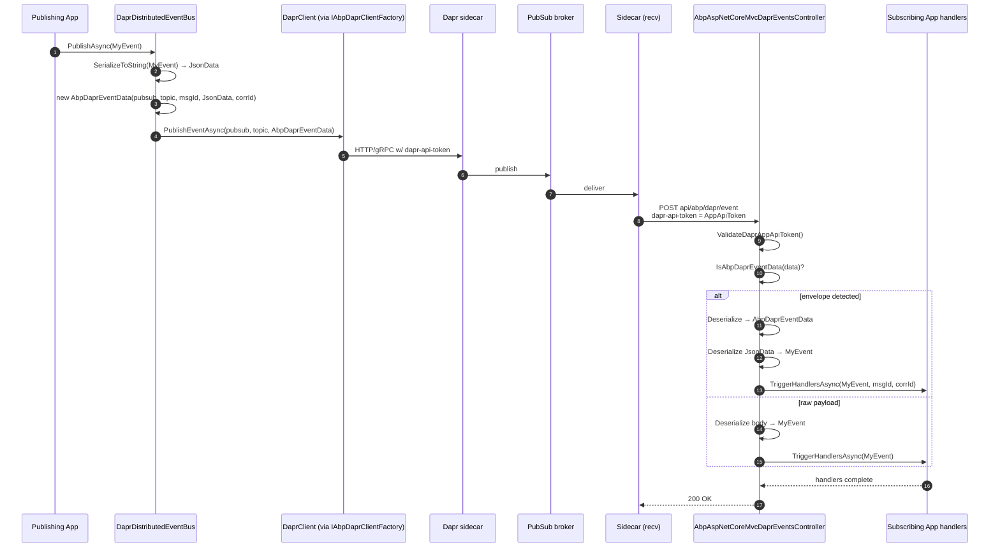

`Volo.Abp.EventBus.Dapr` is the ABP-side implementation of `IDistributedEventBus` over Dapr's pub/sub building block. It registers a `DaprDistributedEventBus` singleton that takes the place of the in-process default, serialises events into a small `AbpDaprEventData` envelope (carrying message id and correlation id), and publishes them through a configured `pubsub` component. The companion package `Volo.Abp.AspNetCore.Mvc.Dapr.EventBus` mounts a `dapr/subscribe` endpoint that advertises every distributed-event handler to the Dapr sidecar and an `api/abp/dapr/event` MVC controller that turns inbound CloudEvent payloads back into handler invocations.

The implementation supports the standard ABP **outbox/inbox** pattern via `DistributedEventBusBase`, so events can be staged inside a transactional unit of work and published from a background worker — the same code path RabbitMQ, Kafka and Azure Service Bus use.

For the user-facing guide on configuring this bus see [`/events/dapr-pubsub`](/events/dapr-pubsub); this page is the source-level walkthrough.

## File inventory

<Files>
```
framework/src/Volo.Abp.EventBus.Dapr/
├── Volo/Abp/EventBus/Dapr/
│   ├── AbpEventBusDaprModule.cs       ← module + Initialize() call
│   ├── AbpDaprEventBusOptions.cs      ← { PubSubName = "pubsub" }
│   ├── AbpDaprEventData.cs            ← envelope: pubsub, topic, messageId, jsonData, correlationId
│   └── DaprDistributedEventBus.cs     ← the real implementation (~300 LOC)
├── FodyWeavers.xml                    ← ConfigureAwait.Fody (Release)
├── FodyWeavers.xsd
└── Volo.Abp.EventBus.Dapr.csproj

framework/src/Volo.Abp.AspNetCore.Mvc.Dapr.EventBus/
├── DaprAspNetCore/
│   └── AbpDaprEndpointRouteBuilderExtensions.cs   ← MapAbpSubscribeHandler (vendored)
└── Volo/Abp/AspNetCore/Mvc/Dapr/EventBus/
    ├── AbpAspNetCoreMvcDaprEventBusModule.cs      ← endpoint route configuration
    ├── AbpAspNetCoreMvcDaprPubSubConsts.cs        ← { DaprEventCallbackUrl = "api/abp/dapr/event" }
    └── Controllers/
        └── AbpAspNetCoreMvcDaprEventsController.cs
```
</Files>

## `AbpEventBusDaprModule` — wiring

The module simply depends on `AbpEventBusModule` (for the abstractions) and `AbpDaprModule` (for `IAbpDaprClientFactory`, `IDaprSerializer`, `AbpDaprOptions`). At application initialisation it calls `Initialize()` on the `DaprDistributedEventBus` so the handler dictionary is built from `AbpDistributedEventBusOptions.Handlers`:

```csharp framework/src/Volo.Abp.EventBus.Dapr/Volo/Abp/EventBus/Dapr/AbpEventBusDaprModule.cs
[DependsOn(
    typeof(AbpEventBusModule),
    typeof(AbpDaprModule)
)]
public class AbpEventBusDaprModule : AbpModule
{
    public override void OnApplicationInitialization(ApplicationInitializationContext context)
    {
        context
            .ServiceProvider
            .GetRequiredService<DaprDistributedEventBus>()
            .Initialize();
    }
}
```

## `AbpDaprEventBusOptions` — choosing the pub/sub component

```csharp framework/src/Volo.Abp.EventBus.Dapr/Volo/Abp/EventBus/Dapr/AbpDaprEventBusOptions.cs
public class AbpDaprEventBusOptions
{
    public string PubSubName { get; set; }

    public AbpDaprEventBusOptions()
    {
        PubSubName = "pubsub";
    }
}
```

A single property — the name of the Dapr pub/sub component (matches the `metadata.name` in your `components/pubsub.yaml`). Configure it in your module's `ConfigureServices`:

```csharp YourEventModule.cs
Configure<AbpDaprEventBusOptions>(options =>
{
    options.PubSubName = "kafka-pubsub";
});
```

## `AbpDaprEventData` — the envelope

ABP wraps each event with a small JSON object that carries the message id and correlation id alongside the user payload (serialised as a string for binary-fidelity round-trip):

```csharp framework/src/Volo.Abp.EventBus.Dapr/Volo/Abp/EventBus/Dapr/AbpDaprEventData.cs
public class AbpDaprEventData
{
    public string PubSubName { get; set; }
    public string Topic { get; set; }
    public string MessageId { get; set; }
    public string JsonData { get; set; }
    public string? CorrelationId { get; set; }

    public AbpDaprEventData(
        string pubSubName,
        string topic,
        string messageId,
        string jsonData,
        string? correlationId)
    {
        PubSubName = pubSubName;
        Topic = topic;
        MessageId = messageId;
        JsonData = jsonData;
        CorrelationId = correlationId;
    }
}
```

The controller on the receiving side uses a five-property fingerprint to decide whether the inbound payload is an `AbpDaprEventData` envelope or a raw payload — see [Callback shape detection](#callback-shape-detection) below.

## `DaprDistributedEventBus`

The class extends `DistributedEventBusBase`, registers itself as a singleton, and replaces the default `IDistributedEventBus` registration:

```csharp framework/src/Volo.Abp.EventBus.Dapr/Volo/Abp/EventBus/Dapr/DaprDistributedEventBus.cs (header)
[Dependency(ReplaceServices = true)]
[ExposeServices(typeof(IDistributedEventBus), typeof(DaprDistributedEventBus))]
public class DaprDistributedEventBus : DistributedEventBusBase, ISingletonDependency
{
    protected IDaprSerializer Serializer { get; }
    protected AbpDaprEventBusOptions DaprEventBusOptions { get; }
    protected IAbpDaprClientFactory DaprClientFactory { get; }

    protected ConcurrentDictionary<Type, List<IEventHandlerFactory>> HandlerFactories { get; }
    protected ConcurrentDictionary<string, Type> EventTypes { get; }
```

`HandlerFactories` indexes handler factories by event type; `EventTypes` provides a name → type lookup used when an inbound message only carries a topic name.

The constructor wires in every collaborator the base class needs (`IServiceScopeFactory`, `ICurrentTenant`, `IUnitOfWorkManager`, `AbpDistributedEventBusOptions`, `IGuidGenerator`, `IClock`, `IEventHandlerInvoker`, `ILocalEventBus`, `ICorrelationIdProvider`) plus the Dapr-specific trio (`IDaprSerializer`, `AbpDaprEventBusOptions`, `IAbpDaprClientFactory`):

```csharp DaprDistributedEventBus.cs (ctor — abridged)
public DaprDistributedEventBus(
    IServiceScopeFactory serviceScopeFactory,
    ICurrentTenant currentTenant,
    IUnitOfWorkManager unitOfWorkManager,
    IOptions<AbpDistributedEventBusOptions> abpDistributedEventBusOptions,
    IGuidGenerator guidGenerator,
    IClock clock,
    IEventHandlerInvoker eventHandlerInvoker,
    IDaprSerializer serializer,
    IOptions<AbpDaprEventBusOptions> daprEventBusOptions,
    IAbpDaprClientFactory daprClientFactory,
    ILocalEventBus localEventBus,
    ICorrelationIdProvider correlationIdProvider)
    : base(serviceScopeFactory, currentTenant, unitOfWorkManager,
           abpDistributedEventBusOptions, guidGenerator, clock,
           eventHandlerInvoker, localEventBus, correlationIdProvider)
{
    Serializer = serializer;
    DaprEventBusOptions = daprEventBusOptions.Value;
    DaprClientFactory = daprClientFactory;

    HandlerFactories = new ConcurrentDictionary<Type, List<IEventHandlerFactory>>();
    EventTypes = new ConcurrentDictionary<string, Type>();
}
```

### Subscription lifecycle

`Initialize()` (called by the module) materialises the handlers declared in `AbpDistributedEventBusOptions.Handlers`:

```csharp DaprDistributedEventBus.cs
public void Initialize()
{
    SubscribeHandlers(AbpDistributedEventBusOptions.Handlers);
}
```

`Subscribe`, `Unsubscribe`, `UnsubscribeAll` operate over the `HandlerFactories` dictionary using the standard `Locking` extension to guard mutation:

```csharp DaprDistributedEventBus.cs
public override IDisposable Subscribe(Type eventType, IEventHandlerFactory factory)
{
    var handlerFactories = GetOrCreateHandlerFactories(eventType);

    if (factory.IsInFactories(handlerFactories))
    {
        return NullDisposable.Instance;
    }

    handlerFactories.Add(factory);

    return new EventHandlerFactoryUnregistrar(this, eventType, factory);
}
```

`GetOrCreateHandlerFactories` also keeps the `EventTypes` name → type dictionary in sync by deriving the wire name from `EventNameAttribute`:

```csharp DaprDistributedEventBus.cs
private List<IEventHandlerFactory> GetOrCreateHandlerFactories(Type eventType)
{
    return HandlerFactories.GetOrAdd(
        eventType,
        type =>
        {
            var eventName = EventNameAttribute.GetNameOrDefault(type);
            EventTypes.GetOrAdd(eventName, eventType);
            return new List<IEventHandlerFactory>();
        }
    );
}

public Type GetEventType(string eventName)
{
    return EventTypes.GetOrDefault(eventName)!;
}
```

### Publishing — direct path

`PublishToEventBusAsync` is the override called by the base class for inline publishes; it forwards to `PublishToDaprAsync`:

```csharp DaprDistributedEventBus.cs
protected async override Task PublishToEventBusAsync(Type eventType, object eventData)
{
    await PublishToDaprAsync(eventType, eventData, null, CorrelationIdProvider.Get());
}

protected virtual async Task PublishToDaprAsync(
    Type eventType,
    object eventData,
    Guid? messageId = null,
    string? correlationId = null)
{
    await PublishToDaprAsync(
        EventNameAttribute.GetNameOrDefault(eventType),
        eventData, messageId, correlationId);
}

protected virtual async Task PublishToDaprAsync(
    string eventName,
    object eventData,
    Guid? messageId = null,
    string? correlationId = null)
{
    var client = await DaprClientFactory.CreateAsync();
    var data = new AbpDaprEventData(
        DaprEventBusOptions.PubSubName,
        eventName,
        (messageId ?? GuidGenerator.Create()).ToString("N"),
        Serializer.SerializeToString(eventData),
        correlationId);
    await client.PublishEventAsync(
        pubsubName: DaprEventBusOptions.PubSubName,
        topicName: eventName,
        data: data);
}
```

A few things stand out:

- The wire `messageId` is a 32-char hex (`"N"`) so it survives any CloudEvent header constraints.
- The user payload is serialised via `IDaprSerializer.SerializeToString` and stuffed into `JsonData`. The envelope itself is then serialised again by `DaprClient.PublishEventAsync` — yes it is double-serialised, but the inner string is what allows the controller to decode it deterministically when the type is known only by name.
- The pub/sub name and topic name match what was advertised through `/dapr/subscribe` (see further down).

### Publishing — outbox path

The transactional outbox produces `OutgoingEventInfo` records; ABP's base class invokes `PublishFromOutboxAsync` / `PublishManyFromOutboxAsync` to send them. The Dapr override deserialises the persisted payload, then republishes with the original `messageId` and `correlationId`:

```csharp DaprDistributedEventBus.cs
public async override Task PublishFromOutboxAsync(OutgoingEventInfo outgoingEvent, OutboxConfig outboxConfig)
{
    using (CorrelationIdProvider.Change(outgoingEvent.GetCorrelationId()))
    {
        await TriggerDistributedEventSentAsync(new DistributedEventSent()
        {
            Source = DistributedEventSource.Outbox,
            EventName = outgoingEvent.EventName,
            EventData = outgoingEvent.EventData
        });
    }

    await PublishToDaprAsync(
        outgoingEvent.EventName,
        Serializer.Deserialize(outgoingEvent.EventData, GetEventType(outgoingEvent.EventName)),
        outgoingEvent.Id,
        outgoingEvent.GetCorrelationId());
}
```

The "many" variant simply loops over `outgoingEvents` and calls the single-event helper:

```csharp DaprDistributedEventBus.cs
public async override Task PublishManyFromOutboxAsync(
    IEnumerable<OutgoingEventInfo> outgoingEvents,
    OutboxConfig outboxConfig)
{
    var outgoingEventArray = outgoingEvents.ToArray();
    foreach (var outgoingEvent in outgoingEventArray)
    {
        using (CorrelationIdProvider.Change(outgoingEvent.GetCorrelationId()))
        {
            await TriggerDistributedEventSentAsync(new DistributedEventSent()
            {
                Source = DistributedEventSource.Outbox,
                EventName = outgoingEvent.EventName,
                EventData = outgoingEvent.EventData
            });
        }

        await PublishToDaprAsync(
            outgoingEvent.EventName,
            Serializer.Deserialize(outgoingEvent.EventData, GetEventType(outgoingEvent.EventName)),
            outgoingEvent.Id,
            outgoingEvent.GetCorrelationId());
    }
}
```

`OnAddToOutboxAsync` is overridden to ensure that the `EventTypes` cache is populated when an outbox entry is written ahead of subscription:

```csharp DaprDistributedEventBus.cs
protected override Task OnAddToOutboxAsync(string eventName, Type eventType, object eventData)
{
    EventTypes.GetOrAdd(eventName, eventType);
    return base.OnAddToOutboxAsync(eventName, eventType, eventData);
}
```

### Consuming — inbox path

The controller (next section) drives `TriggerHandlersAsync`. When inbox is configured the base class persists the incoming event and a background worker calls `ProcessFromInboxAsync`:

```csharp DaprDistributedEventBus.cs
public virtual async Task TriggerHandlersAsync(
    Type eventType, object eventData,
    string? messageId = null, string? correlationId = null)
{
    if (await AddToInboxAsync(
        messageId,
        EventNameAttribute.GetNameOrDefault(eventType),
        eventType, eventData, correlationId))
    {
        return;
    }

    using (CorrelationIdProvider.Change(correlationId))
    {
        await TriggerHandlersDirectAsync(eventType, eventData);
    }
}

public async override Task ProcessFromInboxAsync(
    IncomingEventInfo incomingEvent, InboxConfig inboxConfig)
{
    var eventType = EventTypes.GetOrDefault(incomingEvent.EventName);
    if (eventType == null) return;

    var eventData = Serializer.Deserialize(incomingEvent.EventData, eventType);
    var exceptions = new List<Exception>();
    using (CorrelationIdProvider.Change(incomingEvent.GetCorrelationId()))
    {
        await TriggerHandlersFromInboxAsync(eventType, eventData, exceptions, inboxConfig);
    }
    if (exceptions.Any())
    {
        ThrowOriginalExceptions(eventType, exceptions);
    }
}
```

### Handler matching rules

`GetHandlerFactories` walks `HandlerFactories` and includes the handler when the wire event type is the same as **or a subclass of** the registered handler event type:

```csharp DaprDistributedEventBus.cs
private static bool ShouldTriggerEventForHandler(Type targetEventType, Type handlerEventType)
{
    //Should trigger same type
    if (handlerEventType == targetEventType) return true;

    //TODO: Support inheritance? But it does not support on subscription to RabbitMq!
    //Should trigger for inherited types
    if (handlerEventType.IsAssignableFrom(targetEventType)) return true;

    return false;
}
```

Inheritance support is a Dapr-specific affordance — the inline TODO acknowledges that RabbitMQ does not match it, so portability between brokers is the user's responsibility.

## Subscribe endpoint — `MapAbpSubscribeHandler`

`Volo.Abp.AspNetCore.Mvc.Dapr.EventBus` ships a vendored copy of Dapr's `MapSubscribeHandler` renamed to `MapAbpSubscribeHandler` (file header preserves the Apache 2.0 attribution). The module configures the ABP endpoint pipeline to call it:

```csharp framework/src/Volo.Abp.AspNetCore.Mvc.Dapr.EventBus/Volo/Abp/AspNetCore/Mvc/Dapr/EventBus/AbpAspNetCoreMvcDaprEventBusModule.cs
[DependsOn(
    typeof(AbpAspNetCoreMvcDaprModule),
    typeof(AbpEventBusDaprModule)
)]
public class AbpAspNetCoreMvcDaprEventBusModule : AbpModule
{
    public override void ConfigureServices(ServiceConfigurationContext context)
    {
        var subscribeOptions = context.Services.ExecutePreConfiguredActions<AbpSubscribeOptions>();

        Configure<AbpEndpointRouterOptions>(options =>
        {
            options.EndpointConfigureActions.Add(endpointContext =>
            {
                var rootServiceProvider =
                    endpointContext.ScopeServiceProvider.GetRequiredService<IRootServiceProvider>();

                subscribeOptions.SubscriptionsCallback = subscriptions =>
                {
                    var daprEventBusOptions = rootServiceProvider
                        .GetRequiredService<IOptions<AbpDaprEventBusOptions>>().Value;

                    foreach (var handler in rootServiceProvider
                        .GetRequiredService<IOptions<AbpDistributedEventBusOptions>>().Value.Handlers)
                    {
                        foreach (var @interface in handler.GetInterfaces()
                            .Where(x => x.IsGenericType
                                     && x.GetGenericTypeDefinition() == typeof(IDistributedEventHandler<>)))
                        {
                            var eventType = @interface.GetGenericArguments()[0];
                            var eventName = EventNameAttribute.GetNameOrDefault(eventType);

                            if (subscriptions.Any(x =>
                                x.PubsubName == daprEventBusOptions.PubSubName
                                && x.Topic == eventName))
                            {
                                // Controllers with a [Topic] attribute can replace
                                // built-in event handlers.
                                continue;
                            }

                            var subscription = new AbpSubscription
                            {
                                PubsubName = daprEventBusOptions.PubSubName,
                                Topic = eventName,
                                Route = AbpAspNetCoreMvcDaprPubSubConsts.DaprEventCallbackUrl,
                                Metadata = new AbpMetadata
                                {
                                    { AbpMetadata.RawPayload, "true" }
                                }
                            };
                            subscriptions.Add(subscription);
                        }
                    }

                    return Task.CompletedTask;
                };

                endpointContext.Endpoints.MapAbpSubscribeHandler(subscribeOptions);
            });
        });
    }
}
```

What this does at boot:

1. Collects every `IDistributedEventHandler<TEvent>` registered in `AbpDistributedEventBusOptions.Handlers`.
2. For each `TEvent`, computes the wire name via `EventNameAttribute`.
3. Skips it if a `[Topic]`-decorated MVC controller already advertises the same `(pubsub, topic)` pair (user controllers win).
4. Adds an `AbpSubscription` pointing at the well-known route:

   ```csharp framework/src/Volo.Abp.AspNetCore.Mvc.Dapr.EventBus/Volo/Abp/AspNetCore/Mvc/Dapr/EventBus/AbpAspNetCoreMvcDaprPubSubConsts.cs
   public class AbpAspNetCoreMvcDaprPubSubConsts
   {
       public const string DaprEventCallbackUrl = "api/abp/dapr/event";
   }
   ```

5. Sets `rawPayload: true` so Dapr forwards the raw event body without CloudEvent envelope rewrapping.

`MapAbpSubscribeHandler` serialises the merged subscription list and exposes it on `GET dapr/subscribe`. When the sidecar boots it pulls this list and starts pushing matching topics to `/api/abp/dapr/event`.

The full vendored implementation has the supporting record types — `AbpSubscription`, `AbpSubscribeOptions`, `AbpMetadata`, `AbpRoutes`, `AbpRule` — which mirror the upstream Dapr SDK so the JSON schema is identical.

## Callback shape detection

```csharp framework/src/Volo.Abp.AspNetCore.Mvc.Dapr.EventBus/Volo/Abp/AspNetCore/Mvc/Dapr/EventBus/Controllers/AbpAspNetCoreMvcDaprEventsController.cs
[Area("abp")]
[RemoteService(Name = "abp")]
public class AbpAspNetCoreMvcDaprEventsController : AbpController
{
    [HttpPost(AbpAspNetCoreMvcDaprPubSubConsts.DaprEventCallbackUrl)]
    public virtual async Task<IActionResult> EventAsync()
    {
        HttpContext.ValidateDaprAppApiToken();

        var daprSerializer = HttpContext.RequestServices.GetRequiredService<IDaprSerializer>();
        var body = (await JsonDocument.ParseAsync(HttpContext.Request.Body));

        var pubSubName = body.RootElement.GetProperty("pubsubname").GetString();
        var topic = body.RootElement.GetProperty("topic").GetString();
        var data = body.RootElement.GetProperty("data").GetRawText();
        if (pubSubName.IsNullOrWhiteSpace() || topic.IsNullOrWhiteSpace() || data.IsNullOrWhiteSpace())
        {
            Logger.LogError("Invalid Dapr event request.");
            return BadRequest();
        }

        var distributedEventBus =
            HttpContext.RequestServices.GetRequiredService<DaprDistributedEventBus>();

        if (IsAbpDaprEventData(data))
        {
            var daprEventData = daprSerializer
                .Deserialize(data, typeof(AbpDaprEventData))
                .As<AbpDaprEventData>();
            var eventData = daprSerializer.Deserialize(
                daprEventData.JsonData,
                distributedEventBus.GetEventType(daprEventData.Topic));
            await distributedEventBus.TriggerHandlersAsync(
                distributedEventBus.GetEventType(daprEventData.Topic),
                eventData,
                daprEventData.MessageId,
                daprEventData.CorrelationId);
        }
        else
        {
            var eventData = daprSerializer.Deserialize(
                data, distributedEventBus.GetEventType(topic!));
            await distributedEventBus.TriggerHandlersAsync(
                distributedEventBus.GetEventType(topic!), eventData);
        }

        return Ok();
    }

    protected virtual bool IsAbpDaprEventData(string data)
    {
        var document = JsonDocument.Parse(data);
        var objects = document.RootElement.EnumerateObject().ToList();
        return objects.Count == 5 &&
               objects.Any(x => x.Name.Equals("PubSubName",   StringComparison.CurrentCultureIgnoreCase)) &&
               objects.Any(x => x.Name.Equals("Topic",        StringComparison.CurrentCultureIgnoreCase)) &&
               objects.Any(x => x.Name.Equals("MessageId",    StringComparison.CurrentCultureIgnoreCase)) &&
               objects.Any(x => x.Name.Equals("JsonData",     StringComparison.CurrentCultureIgnoreCase)) &&
               objects.Any(x => x.Name.Equals("CorrelationId", StringComparison.CurrentCultureIgnoreCase));
    }
}
```

Notes:

- The endpoint is registered under area `"abp"` and remote-service name `"abp"`, so the dynamic-proxy tooling does not pollute client SDKs with this internal route.
- `HttpContext.ValidateDaprAppApiToken()` runs before any deserialisation — see [`/dapr/abp-aspnet-core-dapr`](/dapr/abp-aspnet-core-dapr).
- `IsAbpDaprEventData` is a structural check: exactly five top-level properties whose names match the envelope (case-insensitive). If the payload was published by another ABP instance it is unwrapped; otherwise the body is deserialised against the user event type directly.

## End-to-end flow



## Configuration reference

| Setting | Default | Where |
| --- | --- | --- |
| `AbpDaprEventBusOptions.PubSubName` | `"pubsub"` | `Configure<AbpDaprEventBusOptions>(...)` in your module. |
| `AbpDaprOptions.HttpEndpoint` / `GrpcEndpoint` | inherited from Dapr sidecar defaults | `appsettings.json` `Dapr` section. |
| `AbpDaprOptions.DaprApiToken` | env `DAPR_API_TOKEN` | Sent **to** Dapr on publish. |
| `AbpDaprOptions.AppApiToken` | env `APP_API_TOKEN` | Validated **from** Dapr on inbound callbacks. |
| Callback route | `api/abp/dapr/event` | `AbpAspNetCoreMvcDaprPubSubConsts.DaprEventCallbackUrl`. |
| Raw payload | `true` | Set per subscription in `AbpAspNetCoreMvcDaprEventBusModule`. |

## Related pages

<CardGroup cols={2}>
<Card title="Dapr overview" icon="folder-tree" href="/dapr/overview">
The package map and shared options that frame this implementation.
</Card>
<Card title="Sidecar & client" icon="plug" href="/dapr/sidecar-and-client">
`IAbpDaprClientFactory` and `DaprClient` creation used by `PublishToDaprAsync`.
</Card>
<Card title="ASP.NET Core middleware" icon="shield" href="/dapr/abp-aspnet-core-dapr">
`HttpContext.ValidateDaprAppApiToken()` — the first thing the controller calls.
</Card>
<Card title="Distributed events" icon="diagram-project" href="/events/overview">
The `IDistributedEventBus` contract and the outbox/inbox abstractions used here.
</Card>
<Card title="Dapr pub/sub guide" icon="bell" href="/events/dapr-pubsub">
The user-facing guide that complements this internals page.
</Card>
<Card title="Dapr distributed locking" icon="lock-keyhole" href="/locking/dapr-locking">
The lock implementation that shares the same client factory.
</Card>
</CardGroup>
