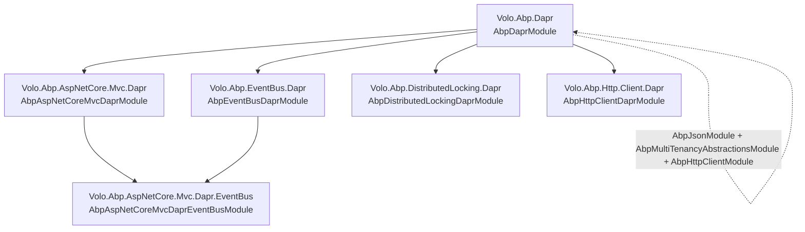
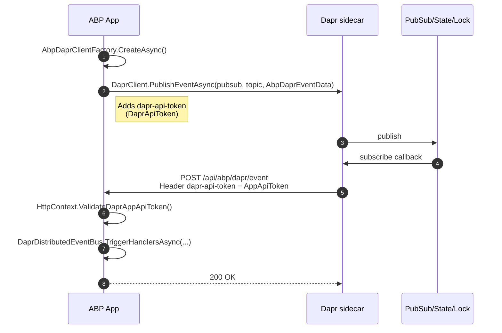

[Dapr](https://dapr.io) is a runtime that exposes distributed-systems building blocks — pub/sub, state stores, secrets, service invocation, distributed locks — through HTTP and gRPC endpoints served by a per-pod sidecar. ABP's Dapr integration plugs those building blocks into its own abstractions: `IDistributedEventBus`, `IAbpDistributedLock`, the dynamic HTTP-client proxies, and the ASP.NET Core middleware that protects controllers from forged Dapr callbacks. Everything is gathered under a single `Volo.Abp.Dapr` base package that owns the shared `DaprClient` factory and API-token configuration; the more specialised packages (`Volo.Abp.EventBus.Dapr`, `Volo.Abp.AspNetCore.Mvc.Dapr.EventBus`, `Volo.Abp.DistributedLocking.Dapr`, `Volo.Abp.Http.Client.Dapr`, `Volo.Abp.AspNetCore.Mvc.Dapr`) all depend on it.

This page is the map: it lists every package, the module each one exports, the shared options surface, and links each subsystem to its dedicated page.

## Package inventory

<Files>
```
framework/src/
├── Volo.Abp.Dapr/                        ← base: AbpDaprModule, IAbpDaprClientFactory, IDaprSerializer
├── Volo.Abp.AspNetCore.Mvc.Dapr/         ← AspNetCoreMvc + Dapr (App API token validator)
├── Volo.Abp.AspNetCore.Mvc.Dapr.EventBus/← MVC controller + subscribe endpoint for pub/sub callbacks
├── Volo.Abp.EventBus.Dapr/               ← DaprDistributedEventBus
├── Volo.Abp.DistributedLocking.Dapr/     ← DaprAbpDistributedLock
└── Volo.Abp.Http.Client.Dapr/            ← AbpInvocationHandler for HttpClient invocation through Dapr
```
</Files>

The dependency graph is shallow: every package depends on `Volo.Abp.Dapr`, and the MVC-layer event bus pulls in both `AbpAspNetCoreMvcDaprModule` and `AbpEventBusDaprModule`.



## What each package exposes

| Package | Module | Highlights |
| --- | --- | --- |
| `Volo.Abp.Dapr` | `AbpDaprModule` | `AbpDaprOptions` (HttpEndpoint, GrpcEndpoint, DaprApiToken, AppApiToken), `IAbpDaprClientFactory` / `AbpDaprClientFactory` (creates `DaprClient` and authenticated `HttpClient`), `IDaprApiTokenProvider`, `IDaprSerializer` / `Utf8JsonDaprSerializer`. |
| `Volo.Abp.AspNetCore.Mvc.Dapr` | `AbpAspNetCoreMvcDaprModule` | `IDaprAppApiTokenValidator` + `DaprAppApiTokenValidator` reading `dapr-api-token`; `HttpContext.ValidateDaprAppApiToken()` extension. |
| `Volo.Abp.AspNetCore.Mvc.Dapr.EventBus` | `AbpAspNetCoreMvcDaprEventBusModule` | Endpoint route extension `MapAbpSubscribeHandler` serving `dapr/subscribe`; `AbpAspNetCoreMvcDaprEventsController` consuming `api/abp/dapr/event` callbacks. |
| `Volo.Abp.EventBus.Dapr` | `AbpEventBusDaprModule` | `DaprDistributedEventBus` (implements `IDistributedEventBus`), `AbpDaprEventBusOptions` (PubSubName), `AbpDaprEventData` envelope. |
| `Volo.Abp.DistributedLocking.Dapr` | `AbpDistributedLockingDaprModule` | `DaprAbpDistributedLock` implementing `IAbpDistributedLock`, `AbpDistributedLockDaprOptions` (StoreName, Owner, DefaultExpirationTimeout). |
| `Volo.Abp.Http.Client.Dapr` | `AbpHttpClientDaprModule` | `AbpInvocationHandler` extending `Dapr.Client.InvocationHandler` so generated HTTP-client proxies invoke via Dapr's `/v1.0/invoke/{app-id}/method/…`. |

## The base module: `AbpDaprModule`

`Volo.Abp.Dapr` declares the dependency chain (`AbpJsonModule`, `AbpMultiTenancyAbstractionsModule`, `AbpHttpClientModule`) and binds the `Dapr:*` configuration section to `AbpDaprOptions`:

```csharp framework/src/Volo.Abp.Dapr/Volo/Abp/Dapr/AbpDaprModule.cs
[DependsOn(
    typeof(AbpJsonModule),
    typeof(AbpMultiTenancyAbstractionsModule),
    typeof(AbpHttpClientModule)
)]
public class AbpDaprModule : AbpModule
{
    public override void ConfigureServices(ServiceConfigurationContext context)
    {
        var configuration = context.Services.GetConfiguration();

        ConfigureDaprOptions(configuration);
    }

    private void ConfigureDaprOptions(IConfiguration configuration)
    {
        Configure<AbpDaprOptions>(configuration.GetSection("Dapr"));
        Configure<AbpDaprOptions>(options =>
        {
            if (options.DaprApiToken.IsNullOrWhiteSpace())
            {
                var confEnv = configuration["DAPR_API_TOKEN"];
                if (!confEnv.IsNullOrWhiteSpace()) { options.DaprApiToken = confEnv!; }
                else
                {
                    var env = Environment.GetEnvironmentVariable("DAPR_API_TOKEN");
                    if (!env.IsNullOrWhiteSpace()) { options.DaprApiToken = env!; }
                }
            }

            if (options.AppApiToken.IsNullOrWhiteSpace())
            {
                var confEnv = configuration["APP_API_TOKEN"];
                if (!confEnv.IsNullOrWhiteSpace()) { options.AppApiToken = confEnv!; }
                else
                {
                    var env = Environment.GetEnvironmentVariable("APP_API_TOKEN");
                    if (!env.IsNullOrWhiteSpace()) { options.AppApiToken = env!; }
                }
            }
        });
    }
}
```

Three configuration sources are consulted in order: the `Dapr` section in `IConfiguration`, the flat key `DAPR_API_TOKEN` / `APP_API_TOKEN` in `IConfiguration`, then the corresponding environment variable. This means containers can set `DAPR_API_TOKEN` (the standard Dapr env var) and ABP picks it up automatically without `appsettings.json` edits.

### Shared options

```csharp framework/src/Volo.Abp.Dapr/Volo/Abp/Dapr/AbpDaprOptions.cs
public class AbpDaprOptions
{
    public string? HttpEndpoint { get; set; }
    public string? GrpcEndpoint { get; set; }
    public string? DaprApiToken { get; set; }
    public string? AppApiToken { get; set; }
}
```

Each property maps to a Dapr sidecar concern:

| Property | What it controls |
| --- | --- |
| `HttpEndpoint` | Overrides the HTTP port of the local Dapr sidecar (default `http://localhost:3500`). Forwarded to `DaprClientBuilder.UseHttpEndpoint()`. |
| `GrpcEndpoint` | Same for gRPC (default `http://localhost:50001`). |
| `DaprApiToken` | Sent by the application **to** Dapr as `dapr-api-token`. Forwarded to `DaprClientBuilder.UseDaprApiToken()`. |
| `AppApiToken` | Sent **by** Dapr to the application on inbound callbacks. Validated by `DaprAppApiTokenValidator`. |

The matching JSON section looks like:

```json appsettings.json
{
  "Dapr": {
    "HttpEndpoint": "http://localhost:3500",
    "GrpcEndpoint": "http://localhost:50001",
    "DaprApiToken": "long-random-app-to-dapr-token",
    "AppApiToken":  "long-random-dapr-to-app-token"
  }
}
```

## Cross-cutting plumbing

Two more primitives sit at the base layer and are used by every higher-level integration.

### `IAbpDaprClientFactory`

A single seam for creating `DaprClient` and authenticated `HttpClient` instances:

```csharp framework/src/Volo.Abp.Dapr/Volo/Abp/Dapr/IAbpDaprClientFactory.cs
public interface IAbpDaprClientFactory
{
    Task<DaprClient> CreateAsync(Action<DaprClientBuilder>? builderAction = null);

    Task<HttpClient> CreateHttpClientAsync(
        string? appId = null,
        string? daprEndpoint = null,
        string? daprApiToken = null
    );
}
```

The default implementation wires `HttpEndpoint`/`GrpcEndpoint`/`DaprApiToken` into the builder, optionally adds tenant + correlation-id headers, and runs `IRemoteServiceHttpClientAuthenticator` so OAuth bearer tokens travel through Dapr's service-invocation API.

### `IDaprSerializer`

A simple seam over `IJsonSerializer` that all Dapr-aware code goes through:

```csharp framework/src/Volo.Abp.Dapr/Volo/Abp/Dapr/IDaprSerializer.cs
public interface IDaprSerializer
{
    byte[] Serialize(object obj);
    string SerializeToString(object obj);
    object Deserialize(byte[] value, Type type);
    object Deserialize(string value, Type type);
}
```

The default `Utf8JsonDaprSerializer` delegates to `IJsonSerializer` (typically the System.Text.Json-backed implementation) — the seam exists so consumers can override JSON behaviour for Dapr in isolation.

### `IDaprApiTokenProvider`

```csharp framework/src/Volo.Abp.Dapr/Volo/Abp/Dapr/IDaprApiTokenProvider.cs
public interface IDaprApiTokenProvider
{
    string? GetDaprApiToken();
    string? GetAppApiToken();
}
```

The default `DaprApiTokenProvider` reads both values from `AbpDaprOptions`. Replacing this provider is the right place to fetch tokens from a secret store at runtime rather than at startup.

See [`/dapr/sidecar-and-client`](/dapr/sidecar-and-client) for the full factory implementation and the headers it injects.

## Talking to the sidecar — runtime model



The two tokens are deliberately separate: `DaprApiToken` protects the sidecar from rogue code in the application's host, and `AppApiToken` protects the application from forged sidecar callbacks. Both are optional in dev but recommended in production.

## Subsystems at a glance

<CardGroup cols={2}>
<Card title="Sidecar & client" icon="plug" href="/dapr/sidecar-and-client">
`AbpDaprModule`, `AbpDaprOptions`, `IAbpDaprClientFactory` / `AbpDaprClientFactory`, `IDaprApiTokenProvider`, `Utf8JsonDaprSerializer`.
</Card>
<Card title="Distributed event bus" icon="bell" href="/dapr/distributed-event-bus">
`DaprDistributedEventBus`, `AbpDaprEventBusOptions`, `AbpDaprEventData`, the subscribe endpoint and `AbpAspNetCoreMvcDaprEventsController`.
</Card>
<Card title="ASP.NET Core middleware" icon="shield" href="/dapr/abp-aspnet-core-dapr">
`AbpAspNetCoreMvcDaprModule`, `IDaprAppApiTokenValidator` / `DaprAppApiTokenValidator`, the `DaprHttpContextExtensions`.
</Card>
<Card title="Secret store & base helpers" icon="lock" href="/dapr/secret-store">
How ABP reuses the Dapr base layer for secret-store style integrations and the `IDaprSerializer` / `IAbpDaprClientFactory` surface.
</Card>
</CardGroup>

## Related topics elsewhere

<CardGroup cols={2}>
<Card title="Distributed events overview" icon="diagram-project" href="/events/overview">
The `IDistributedEventBus` contract that `DaprDistributedEventBus` implements.
</Card>
<Card title="Dapr pub/sub event bus" icon="bell" href="/events/dapr-pubsub">
Wider page on publishing/handling distributed events over Dapr, including transactional outbox / inbox.
</Card>
<Card title="Distributed locking with Dapr" icon="lock-keyhole" href="/locking/dapr-locking">
The matching lock implementation that uses `Dapr.Client.TryLockAsync` under `IAbpDistributedLock`.
</Card>
<Card title="HTTP client (Dapr)" icon="globe" href="/http/dapr-http-client">
How `Volo.Abp.Http.Client.Dapr` plugs `AbpInvocationHandler` into the dynamic client proxy pipeline.
</Card>
</CardGroup>

## Cross-cutting concerns

A few concerns appear in every Dapr-aware ABP package and are worth singling out:

### API tokens flow in both directions

The two-token model is deliberately symmetric. Sidecar↔application traffic is mTLS-encrypted by Dapr by default; the API tokens add an application-level authorisation step on top.

| Token | Source | Direction | Validator |
| --- | --- | --- | --- |
| `DaprApiToken` (env `DAPR_API_TOKEN`) | `AbpDaprOptions.DaprApiToken` → `IDaprApiTokenProvider.GetDaprApiToken()` | App → Sidecar | Dapr sidecar's own admission check. |
| `AppApiToken` (env `APP_API_TOKEN`) | `AbpDaprOptions.AppApiToken` → `IDaprApiTokenProvider.GetAppApiToken()` | Sidecar → App | `IDaprAppApiTokenValidator` reads the `dapr-api-token` header on the app side. |

### Tenancy, correlation, culture

Outbound calls produced by `IAbpDaprClientFactory.CreateHttpClientAsync` carry:

- `X-Correlation-Id` from `ICorrelationIdProvider.Get()`
- `__tenant` header from `ICurrentTenant.Id`
- `Accept-Language` from `CultureInfo.CurrentUICulture`
- `X-Requested-With: XMLHttpRequest`
- `Authorization: Bearer <token>` when `IRemoteServiceHttpClientAuthenticator` produced one

Inbound callbacks (pub/sub, bindings) hit standard ABP middleware that interprets the same headers, so a service-invocation chain through Dapr behaves the same as a direct HTTP call.

### JSON serialisation

Every wire format (`AbpDaprEventData`, secret-store payloads, state-store reads) goes through `IDaprSerializer` and therefore inherits `AbpSystemTextJsonSerializerOptions`. Overriding the serializer is a single `[Dependency(ReplaceServices = true)]` replacement away.

### Module dependency rules

When composing modules:

- Any module that publishes events depends on `AbpEventBusDaprModule` (no need to depend on `AbpDaprModule` directly — it's transitive).
- Any module that hosts an MVC API endpoint reachable through Dapr depends on `AbpAspNetCoreMvcDaprModule` so it can call `HttpContext.ValidateDaprAppApiToken()`.
- Distributed locking is layered separately under `AbpDistributedLockingDaprModule`.

This keeps optional dependencies optional: an event-publishing background worker doesn't need to drag MVC into the host.

## Quick-start configuration

The minimum `appsettings.json` an ABP service needs in order to consume the Dapr integration:

```json appsettings.json
{
  "Dapr": {
    "HttpEndpoint": "http://localhost:3500",
    "GrpcEndpoint": "http://localhost:50001",
    "DaprApiToken": "<random-app-to-dapr-token>",
    "AppApiToken":  "<random-dapr-to-app-token>"
  }
}
```

Equivalent environment variables (read by `AbpDaprModule` as a fallback):

```bash
DAPR_API_TOKEN=<random-app-to-dapr-token>
APP_API_TOKEN=<random-dapr-to-app-token>
```

Then add the corresponding module to your host:

```csharp YourHostModule.cs
[DependsOn(
    typeof(AbpEventBusDaprModule),                 // for IDistributedEventBus over Dapr
    typeof(AbpAspNetCoreMvcDaprEventBusModule),    // for /dapr/subscribe + callback controller
    typeof(AbpDistributedLockingDaprModule),       // for IAbpDistributedLock over Dapr
    typeof(AbpHttpClientDaprModule)                // for service invocation via dynamic proxies
)]
public class YourHostModule : AbpModule { }
```

The base `AbpDaprModule` flows in transitively through every one of these — there is no need to depend on it explicitly.

## Where each subsystem lives

| Concern | Package | Page |
| --- | --- | --- |
| Sidecar config + client factory | `Volo.Abp.Dapr` | [`/dapr/sidecar-and-client`](/dapr/sidecar-and-client) |
| API-token validation (inbound) | `Volo.Abp.AspNetCore.Mvc.Dapr` | [`/dapr/abp-aspnet-core-dapr`](/dapr/abp-aspnet-core-dapr) |
| Distributed event bus | `Volo.Abp.EventBus.Dapr` + `…Mvc.Dapr.EventBus` | [`/dapr/distributed-event-bus`](/dapr/distributed-event-bus) |
| Secret-store access (no dedicated pack) | `Volo.Abp.Dapr` (base) | [`/dapr/secret-store`](/dapr/secret-store) |
| Distributed locking | `Volo.Abp.DistributedLocking.Dapr` | [`/locking/dapr-locking`](/locking/dapr-locking) |
| Service invocation via dynamic proxies | `Volo.Abp.Http.Client.Dapr` | [`/http/dapr-http-client`](/http/dapr-http-client) |
