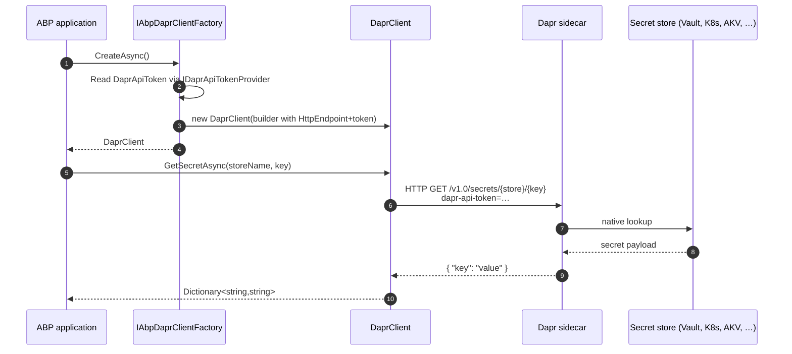

ABP's source tree does **not** ship a dedicated `Volo.Abp.SecretManagement.Dapr` (or `Volo.Abp.SettingManagement.Dapr`) package — Dapr's secret-store building block is consumed directly via the `Dapr.Client.DaprClient` produced by `IAbpDaprClientFactory`. This page documents the base-layer surface you reach for when you need to read a secret out of Vault, Kubernetes secrets, AWS Secrets Manager, Azure Key Vault, GCP Secret Manager, or any other Dapr-supported store, and how the same `AbpDaprOptions` / `IDaprApiTokenProvider` / `IDaprSerializer` machinery applies. It also shows the patterns for replacing `IDaprApiTokenProvider` so the Dapr API token itself can be fetched from a secret store at runtime.

If you are looking for the integration map across **every** ABP Dapr package, start at [`/dapr/overview`](/dapr/overview).

## What's in the repository

A grep through `framework/src/Volo.Abp.*Dapr*` returns the six packages listed below — none of them is a secret-store wrapper:

| Package | Purpose |
| --- | --- |
| `Volo.Abp.Dapr` | Base — `AbpDaprModule`, `AbpDaprOptions`, `IAbpDaprClientFactory`, `IDaprApiTokenProvider`, `IDaprSerializer`. |
| `Volo.Abp.AspNetCore.Mvc.Dapr` | Adds `IDaprAppApiTokenValidator` + `HttpContext` extensions. |
| `Volo.Abp.AspNetCore.Mvc.Dapr.EventBus` | Subscribe endpoint + callback controller for pub/sub. |
| `Volo.Abp.EventBus.Dapr` | `DaprDistributedEventBus`. |
| `Volo.Abp.DistributedLocking.Dapr` | `DaprAbpDistributedLock`. |
| `Volo.Abp.Http.Client.Dapr` | `AbpInvocationHandler` for service invocation. |

Secrets are accessed by the application code itself via `DaprClient.GetSecretAsync` / `GetBulkSecretAsync` — and the only ABP plumbing involved is `IAbpDaprClientFactory`. The rest of this page walks through that pattern.

## Provisioning a Dapr secret-store component

Dapr secret stores are resource components mounted into the sidecar at `--components-path` (or via the Kubernetes operator). For example a local-file store:

```yaml components/secretstore.yaml
apiVersion: dapr.io/v1alpha1
kind: Component
metadata:
  name: local-secret-store
spec:
  type: secretstores.local.file
  version: v1
  metadata:
    - name: secretsFile
      value: ./secrets.json
```

`secrets.json` is a flat key→string map; in production the component would be `secretstores.kubernetes`, `secretstores.azure.keyvault`, `secretstores.aws.secretmanager`, etc.

There is no ABP-side wiring required — only the runtime sidecar talks to the store. The application asks the sidecar through its HTTP/gRPC port.

## The base ABP layer — recap

```csharp framework/src/Volo.Abp.Dapr/Volo/Abp/Dapr/AbpDaprOptions.cs
public class AbpDaprOptions
{
    public string? HttpEndpoint { get; set; }
    public string? GrpcEndpoint { get; set; }
    public string? DaprApiToken { get; set; }
    public string? AppApiToken { get; set; }
}
```

`AbpDaprModule` binds the section from `IConfiguration` and falls back to env vars (`DAPR_API_TOKEN` / `APP_API_TOKEN`):

```csharp framework/src/Volo.Abp.Dapr/Volo/Abp/Dapr/AbpDaprModule.cs (excerpt)
public override void ConfigureServices(ServiceConfigurationContext context)
{
    var configuration = context.Services.GetConfiguration();

    ConfigureDaprOptions(configuration);
}

private void ConfigureDaprOptions(IConfiguration configuration)
{
    Configure<AbpDaprOptions>(configuration.GetSection("Dapr"));
    Configure<AbpDaprOptions>(options =>
    {
        if (options.DaprApiToken.IsNullOrWhiteSpace())
        {
            var confEnv = configuration["DAPR_API_TOKEN"];
            if (!confEnv.IsNullOrWhiteSpace())
            {
                options.DaprApiToken = confEnv!;
            }
            else
            {
                var env = Environment.GetEnvironmentVariable("DAPR_API_TOKEN");
                if (!env.IsNullOrWhiteSpace())
                {
                    options.DaprApiToken = env!;
                }
            }
        }
        /* same pattern for AppApiToken */
    });
}
```

`IAbpDaprClientFactory.CreateAsync` then attaches `DaprApiToken` to outbound calls — including secret-store reads. See [`/dapr/sidecar-and-client`](/dapr/sidecar-and-client) for the full factory walkthrough.

## Reading secrets through `IAbpDaprClientFactory`

The recommended pattern is to wrap the Dapr SDK call in a small service that the rest of the application depends on:

```csharp Services/DaprSecretReader.cs
using Dapr.Client;
using Microsoft.Extensions.Logging;
using Volo.Abp.Dapr;
using Volo.Abp.DependencyInjection;

public class DaprSecretReader : ITransientDependency
{
    protected IAbpDaprClientFactory ClientFactory { get; }
    protected ILogger<DaprSecretReader> Logger { get; }

    public DaprSecretReader(
        IAbpDaprClientFactory clientFactory,
        ILogger<DaprSecretReader> logger)
    {
        ClientFactory = clientFactory;
        Logger = logger;
    }

    public virtual async Task<string?> GetAsync(
        string storeName,
        string key,
        CancellationToken cancellationToken = default)
    {
        var client = await ClientFactory.CreateAsync();
        var values = await client.GetSecretAsync(
            storeName, key, cancellationToken: cancellationToken);
        if (values.TryGetValue(key, out var value))
        {
            return value;
        }

        Logger.LogWarning("Secret '{Key}' not found in store '{Store}'", key, storeName);
        return null;
    }

    public virtual async Task<IReadOnlyDictionary<string, Dictionary<string, string>>> GetBulkAsync(
        string storeName,
        CancellationToken cancellationToken = default)
    {
        var client = await ClientFactory.CreateAsync();
        return await client.GetBulkSecretAsync(
            storeName, cancellationToken: cancellationToken);
    }
}
```

Things to note:

1. `ClientFactory.CreateAsync()` produces a fully configured `DaprClient` that already carries `HttpEndpoint`, `GrpcEndpoint`, `DaprApiToken` and the JSON serializer derived from `AbpSystemTextJsonSerializerOptions`.
2. `GetSecretAsync` returns `Dictionary<string, string>` because some stores (Vault) can expose multi-field secrets keyed by name.
3. The service is `ITransientDependency` even though `IAbpDaprClientFactory` is a singleton — the wrapper carries no state so transient is the cheapest lifetime.

Usage in an application service:

```csharp PaymentAppService.cs
public class PaymentAppService : ApplicationService, IPaymentAppService
{
    private readonly DaprSecretReader _secrets;
    public PaymentAppService(DaprSecretReader secrets) => _secrets = secrets;

    public async Task ChargeAsync(ChargeInput input)
    {
        var apiKey = await _secrets.GetAsync("local-secret-store", "stripe-api-key")
                  ?? throw new BusinessException("Missing Stripe API key");

        // …call Stripe with apiKey
    }
}
```

## Replacing `IDaprApiTokenProvider` with a secret-store lookup

In production you generally don't want the Dapr API token sitting in `appsettings.json` or an environment variable. Replace `IDaprApiTokenProvider` so it lazy-loads the token from the same secret store the rest of the app uses:

```csharp Infrastructure/DaprSecretBackedApiTokenProvider.cs
using Microsoft.Extensions.Options;
using Volo.Abp.Dapr;
using Volo.Abp.DependencyInjection;

[Dependency(ReplaceServices = true)]
[ExposeServices(typeof(IDaprApiTokenProvider))]
public class DaprSecretBackedApiTokenProvider : DaprApiTokenProvider
{
    private readonly DaprSecretReader _reader;
    private readonly Lazy<string?> _daprApiToken;
    private readonly Lazy<string?> _appApiToken;

    public DaprSecretBackedApiTokenProvider(
        IOptions<AbpDaprOptions> options,
        DaprSecretReader reader)
        : base(options)
    {
        _reader = reader;
        _daprApiToken = new Lazy<string?>(() =>
            _reader.GetAsync("vault", "dapr/api-token").GetAwaiter().GetResult()
            ?? base.GetDaprApiToken());
        _appApiToken = new Lazy<string?>(() =>
            _reader.GetAsync("vault", "dapr/app-token").GetAwaiter().GetResult()
            ?? base.GetAppApiToken());
    }

    public override string? GetDaprApiToken() => _daprApiToken.Value;
    public override string? GetAppApiToken()  => _appApiToken.Value;
}
```

Why this is safe:

- `IAbpDaprClientFactory.CreateAsync` calls `IDaprApiTokenProvider.GetDaprApiToken()` on every `Build()`; caching via `Lazy<T>` avoids re-hitting Vault per call.
- The chicken-and-egg problem (you need a token to talk to the sidecar to read the secret that gives you the token) is sidestepped because Dapr secret-store calls themselves can be authorised by a sidecar-side ACL rather than the API token — but if your component requires `dapr-api-token`, set the bootstrap value via the standard `DAPR_API_TOKEN` env var and only rotate via the secret store at runtime.

The base implementation that this overrides:

```csharp framework/src/Volo.Abp.Dapr/Volo/Abp/Dapr/DaprApiTokenProvider.cs
public class DaprApiTokenProvider : IDaprApiTokenProvider, ISingletonDependency
{
    protected AbpDaprOptions Options { get; }

    public DaprApiTokenProvider(IOptions<AbpDaprOptions> options)
    {
        Options = options.Value;
    }

    public virtual string? GetDaprApiToken() => Options.DaprApiToken;
    public virtual string? GetAppApiToken()  => Options.AppApiToken;
}
```

Note `ISingletonDependency` — the replacement should also be singleton-equivalent (which is the case when registered through `[ExposeServices]` alongside the override marker).

## JSON-serialised secret payloads

When a secret value is itself a JSON blob (a common Vault pattern), use the shared `IDaprSerializer` so the same converters apply:

```csharp Services/DaprSecretReader.cs (variant)
public virtual async Task<TSecret?> GetJsonAsync<TSecret>(
    string storeName,
    string key,
    CancellationToken cancellationToken = default)
    where TSecret : class
{
    var raw = await GetAsync(storeName, key, cancellationToken);
    if (raw is null) return null;
    return (TSecret) _serializer.Deserialize(raw, typeof(TSecret));
}
```

with `_serializer` injected as `IDaprSerializer`. The interface and default implementation:

```csharp framework/src/Volo.Abp.Dapr/Volo/Abp/Dapr/IDaprSerializer.cs
public interface IDaprSerializer
{
    byte[] Serialize(object obj);
    string SerializeToString(object obj);
    object Deserialize(byte[] value, Type type);
    object Deserialize(string value, Type type);
}
```

```csharp framework/src/Volo.Abp.Dapr/Volo/Abp/Dapr/Utf8JsonDaprSerializer.cs
public class Utf8JsonDaprSerializer : IDaprSerializer, ITransientDependency
{
    private readonly IJsonSerializer _jsonSerializer;

    public Utf8JsonDaprSerializer(IJsonSerializer jsonSerializer)
    {
        _jsonSerializer = jsonSerializer;
    }

    public byte[] Serialize(object obj)
        => Encoding.UTF8.GetBytes(_jsonSerializer.Serialize(obj));

    public string SerializeToString(object obj)
        => _jsonSerializer.Serialize(obj);

    public object Deserialize(byte[] value, Type type)
        => _jsonSerializer.Deserialize(type, Encoding.UTF8.GetString(value));

    public object Deserialize(string value, Type type)
        => _jsonSerializer.Deserialize(type, value);
}
```

`Utf8JsonDaprSerializer` is transient, but reusing it across calls is fine because it carries no per-call state.

## Bridging to ABP's Setting Management

ABP ships [Setting Management](/settings-features/settings-overview) — a per-tenant, per-user override system. The recommended pattern is to read the secret once via the helper above, then feed it into a custom `ISettingValueProvider` registered in `AbpSettingOptions`. This way callers depend on `ISettingProvider.GetAsync("Payments.StripeApiKey")` and the secret-store transport is invisible.

A minimal provider:

```csharp DaprSecretSettingValueProvider.cs
public class DaprSecretSettingValueProvider : SettingValueProvider
{
    public override string Name => "DaprSecret";
    private readonly DaprSecretReader _reader;

    public DaprSecretSettingValueProvider(
        ISettingStore settingStore,
        DaprSecretReader reader)
        : base(settingStore)
    {
        _reader = reader;
    }

    public override async Task<string?> GetOrNullAsync(SettingDefinition setting)
    {
        if (!setting.Properties.TryGetValue("DaprStore", out var storeObj)) return null;
        if (!setting.Properties.TryGetValue("DaprKey", out var keyObj))    return null;
        return await _reader.GetAsync(storeObj!.ToString()!, keyObj!.ToString()!);
    }
}
```

Then in your `AppSettingDefinitionProvider`:

```csharp AppSettingDefinitionProvider.cs
public override void Define(ISettingDefinitionContext context)
{
    context.Add(
        new SettingDefinition("Payments.StripeApiKey", isInherited: false)
            .WithProperty("DaprStore", "vault")
            .WithProperty("DaprKey",   "stripe/api-key"));
}
```

This is a sketch — the broader Setting Management surface is documented elsewhere in this wiki.

## Security checklist

<Warning>
Dapr secret-store calls still hit the sidecar. If the sidecar's metadata endpoint is publicly exposed, an attacker can enumerate available secret keys. Always run the sidecar bound to `127.0.0.1` (the default) and only expose the application port.
</Warning>

| Concern | Mitigation |
| --- | --- |
| Sidecar accepts unauthenticated calls | Configure `DAPR_API_TOKEN` — `AbpDaprModule` picks it up automatically; `IAbpDaprClientFactory` attaches it to every request. |
| Application accepts unauthenticated callbacks | Configure `APP_API_TOKEN` and validate via `HttpContext.ValidateDaprAppApiToken()` — see [`/dapr/abp-aspnet-core-dapr`](/dapr/abp-aspnet-core-dapr). |
| Token rotation | Replace `IDaprApiTokenProvider` with a lazy or per-call reader — example above. |
| Cross-tenant secret access | Store secrets per tenant under a per-tenant prefix and apply `ICurrentTenant.Id` when constructing the key inside your `DaprSecretReader` wrapper. |

## End-to-end flow



## Related pages

<CardGroup cols={2}>
<Card title="Dapr overview" icon="folder-tree" href="/dapr/overview">
The package map and shared options surface.
</Card>
<Card title="Sidecar & client" icon="plug" href="/dapr/sidecar-and-client">
`IAbpDaprClientFactory`, `AbpDaprClientFactory` and the JSON / header decoration that secret calls inherit.
</Card>
<Card title="ASP.NET Core middleware" icon="shield" href="/dapr/abp-aspnet-core-dapr">
`DaprAppApiTokenValidator` for the inbound side.
</Card>
<Card title="Distributed event bus" icon="bell" href="/dapr/distributed-event-bus">
Another consumer of `IAbpDaprClientFactory.CreateAsync`.
</Card>
<Card title="Distributed locking with Dapr" icon="lock-keyhole" href="/locking/dapr-locking">
Same factory used by the lock implementation.
</Card>
</CardGroup>
