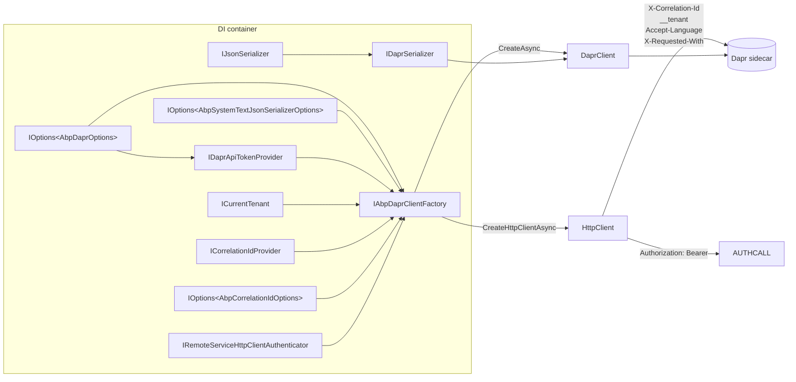

`Volo.Abp.Dapr` is the base layer every other ABP Dapr integration sits on. It is responsible for binding the `Dapr` configuration section to `AbpDaprOptions`, sourcing the API tokens from environment variables when not configured explicitly, and producing two artefacts the rest of the framework consumes: a configured `Dapr.Client.DaprClient` and an `HttpClient` aimed at the sidecar's service-invocation endpoint. The `HttpClient` flavour also goes through ABP's standard outbound pipeline — correlation id, current tenant id, accept-language, `X-Requested-With`, and an OAuth bearer token obtained from `IRemoteServiceHttpClientAuthenticator` — so a Dapr-routed call carries the same context as a direct HTTP call would.

This page is the source-level tour of the base module. For the wider package map and links to the higher-level integrations see [`/dapr/overview`](/dapr/overview).

## File inventory

<Files>
```
framework/src/Volo.Abp.Dapr/
└── Volo/Abp/Dapr/
    ├── AbpDaprModule.cs           ← binds Dapr section, falls back to env vars
    ├── AbpDaprOptions.cs          ← HttpEndpoint, GrpcEndpoint, DaprApiToken, AppApiToken
    ├── IAbpDaprClientFactory.cs   ← factory contract
    ├── AbpDaprClientFactory.cs    ← default impl, ISingletonDependency
    ├── IDaprApiTokenProvider.cs   ← token reader contract
    ├── DaprApiTokenProvider.cs    ← default impl
    ├── IDaprSerializer.cs         ← seam over IJsonSerializer
    └── Utf8JsonDaprSerializer.cs  ← default impl (UTF-8 → IJsonSerializer)
```
</Files>

## `AbpDaprModule`

The module depends on three abstractions packages and binds the `Dapr` section in `IConfiguration`:

```csharp framework/src/Volo.Abp.Dapr/Volo/Abp/Dapr/AbpDaprModule.cs
[DependsOn(
    typeof(AbpJsonModule),
    typeof(AbpMultiTenancyAbstractionsModule),
    typeof(AbpHttpClientModule)
)]
public class AbpDaprModule : AbpModule
{
    public override void ConfigureServices(ServiceConfigurationContext context)
    {
        var configuration = context.Services.GetConfiguration();

        ConfigureDaprOptions(configuration);
    }

    private void ConfigureDaprOptions(IConfiguration configuration)
    {
        Configure<AbpDaprOptions>(configuration.GetSection("Dapr"));
        Configure<AbpDaprOptions>(options =>
        {
            if (options.DaprApiToken.IsNullOrWhiteSpace())
            {
                var confEnv = configuration["DAPR_API_TOKEN"];
                if (!confEnv.IsNullOrWhiteSpace())
                {
                    options.DaprApiToken = confEnv!;
                }
                else
                {
                    var env = Environment.GetEnvironmentVariable("DAPR_API_TOKEN");
                    if (!env.IsNullOrWhiteSpace())
                    {
                        options.DaprApiToken = env!;
                    }
                }
            }

            if (options.AppApiToken.IsNullOrWhiteSpace())
            {
                var confEnv = configuration["APP_API_TOKEN"];
                if (!confEnv.IsNullOrWhiteSpace())
                {
                    options.AppApiToken = confEnv!;
                }
                else
                {
                    var env = Environment.GetEnvironmentVariable("APP_API_TOKEN");
                    if (!env.IsNullOrWhiteSpace())
                    {
                        options.AppApiToken = env!;
                    }
                }
            }
        });
    }
}
```

Three observations:

1. The dependency on `AbpHttpClientModule` brings `IRemoteServiceHttpClientAuthenticator` into scope — the factory uses it to inject bearer tokens.
2. `AbpMultiTenancyAbstractionsModule` brings `ICurrentTenant` into scope so the factory can decorate `HttpClient` with the tenant id.
3. Token resolution prefers `Configure<AbpDaprOptions>` callbacks, then a flat configuration key, then an environment variable. The flat key path means a Helm chart can write `DAPR_API_TOKEN: …` straight into `appsettings.json` (or a typed `IConfiguration` provider) without nesting it under `Dapr.DaprApiToken`.

## `AbpDaprOptions`

The shared options object lives at the base of every package:

```csharp framework/src/Volo.Abp.Dapr/Volo/Abp/Dapr/AbpDaprOptions.cs
public class AbpDaprOptions
{
    public string? HttpEndpoint { get; set; }
    public string? GrpcEndpoint { get; set; }
    public string? DaprApiToken { get; set; }
    public string? AppApiToken { get; set; }
}
```

| Property | Role | Forwarded to |
| --- | --- | --- |
| `HttpEndpoint` | HTTP URL of the sidecar (`http://localhost:3500` by default). | `DaprClientBuilder.UseHttpEndpoint()` and `DaprClient.CreateInvokeHttpClient(daprEndpoint: …)`. |
| `GrpcEndpoint` | gRPC URL of the sidecar (`http://localhost:50001` by default). | `DaprClientBuilder.UseGrpcEndpoint()`. |
| `DaprApiToken` | API token the **application sends to the sidecar**. | `DaprClientBuilder.UseDaprApiToken()` and `daprApiToken` arg of `CreateInvokeHttpClient`. |
| `AppApiToken` | API token the **sidecar sends to the application** on inbound callbacks. | Validated by `DaprAppApiTokenValidator` (see [`/dapr/abp-aspnet-core-dapr`](/dapr/abp-aspnet-core-dapr)). |

## `IDaprApiTokenProvider` and the default

```csharp framework/src/Volo.Abp.Dapr/Volo/Abp/Dapr/IDaprApiTokenProvider.cs
public interface IDaprApiTokenProvider
{
    string? GetDaprApiToken();
    string? GetAppApiToken();
}
```

```csharp framework/src/Volo.Abp.Dapr/Volo/Abp/Dapr/DaprApiTokenProvider.cs
public class DaprApiTokenProvider : IDaprApiTokenProvider, ISingletonDependency
{
    protected AbpDaprOptions Options { get; }

    public DaprApiTokenProvider(IOptions<AbpDaprOptions> options)
    {
        Options = options.Value;
    }

    public virtual string? GetDaprApiToken() => Options.DaprApiToken;
    public virtual string? GetAppApiToken()  => Options.AppApiToken;
}
```

Trivial out of the box — but the seam is what makes it possible to fetch the token from a secret store on every call. Override:

```csharp
public class VaultDaprApiTokenProvider : DaprApiTokenProvider
{
    private readonly IVaultClient _vault;
    public VaultDaprApiTokenProvider(IOptions<AbpDaprOptions> options, IVaultClient vault)
        : base(options)
    {
        _vault = vault;
    }

    public override string? GetDaprApiToken() =>
        _vault.ReadSecret("dapr/api-token");
}
```

The override registers with `[Dependency(ReplaceServices = true)]` per ABP's standard DI conventions.

## `IDaprSerializer` — single JSON seam

Every other Dapr package uses `IDaprSerializer` rather than `IJsonSerializer` directly. This way overriding JSON for Dapr traffic does not impact other JSON usage:

```csharp framework/src/Volo.Abp.Dapr/Volo/Abp/Dapr/IDaprSerializer.cs
public interface IDaprSerializer
{
    byte[] Serialize(object obj);
    string SerializeToString(object obj);
    object Deserialize(byte[] value, Type type);
    object Deserialize(string value, Type type);
}
```

```csharp framework/src/Volo.Abp.Dapr/Volo/Abp/Dapr/Utf8JsonDaprSerializer.cs
public class Utf8JsonDaprSerializer : IDaprSerializer, ITransientDependency
{
    private readonly IJsonSerializer _jsonSerializer;

    public Utf8JsonDaprSerializer(IJsonSerializer jsonSerializer)
    {
        _jsonSerializer = jsonSerializer;
    }

    public byte[] Serialize(object obj)
        => Encoding.UTF8.GetBytes(_jsonSerializer.Serialize(obj));

    public string SerializeToString(object obj)
        => _jsonSerializer.Serialize(obj);

    public object Deserialize(byte[] value, Type type)
        => _jsonSerializer.Deserialize(type, Encoding.UTF8.GetString(value));

    public object Deserialize(string value, Type type)
        => _jsonSerializer.Deserialize(type, value);
}
```

`IJsonSerializer` is provided by `AbpJsonModule` — by default the System.Text.Json implementation that honours `AbpSystemTextJsonSerializerOptions`.

## `IAbpDaprClientFactory`

The factory contract is two methods:

```csharp framework/src/Volo.Abp.Dapr/Volo/Abp/Dapr/IAbpDaprClientFactory.cs
public interface IAbpDaprClientFactory
{
    Task<DaprClient> CreateAsync(Action<DaprClientBuilder>? builderAction = null);

    Task<HttpClient> CreateHttpClientAsync(
        string? appId = null,
        string? daprEndpoint = null,
        string? daprApiToken = null
    );
}
```

`CreateAsync` returns a sidecar-aware `Dapr.Client.DaprClient`; `CreateHttpClientAsync` returns an `HttpClient` whose base address points at `http://localhost:3500/v1.0/invoke/<appId>/method/` (or the configured override) so callers can simply `httpClient.GetAsync("orders/123")`.

## `AbpDaprClientFactory` — default implementation

The class is registered as a singleton and pulls in seven collaborators:

```csharp framework/src/Volo.Abp.Dapr/Volo/Abp/Dapr/AbpDaprClientFactory.cs (constructor)
public class AbpDaprClientFactory : IAbpDaprClientFactory, ISingletonDependency
{
    protected AbpDaprOptions DaprOptions { get; }
    protected JsonSerializerOptions JsonSerializerOptions { get; }
    protected IDaprApiTokenProvider DaprApiTokenProvider { get; }
    protected ICurrentTenant CurrentTenant { get; }
    protected ICorrelationIdProvider CorrelationIdProvider { get; }
    protected IOptions<AbpCorrelationIdOptions> AbpCorrelationIdOptions { get; }
    protected IRemoteServiceHttpClientAuthenticator RemoteServiceHttpClientAuthenticator { get; }

    public AbpDaprClientFactory(
        IOptions<AbpDaprOptions> options,
        IOptions<AbpSystemTextJsonSerializerOptions> systemTextJsonSerializerOptions,
        IDaprApiTokenProvider daprApiTokenProvider,
        ICurrentTenant currentTenant,
        ICorrelationIdProvider correlationIdProvider,
        IOptions<AbpCorrelationIdOptions> abpCorrelationIdOptions,
        IRemoteServiceHttpClientAuthenticator remoteServiceHttpClientAuthenticator)
    {
        DaprApiTokenProvider = daprApiTokenProvider;
        CurrentTenant = currentTenant;
        CorrelationIdProvider = correlationIdProvider;
        AbpCorrelationIdOptions = abpCorrelationIdOptions;
        RemoteServiceHttpClientAuthenticator = remoteServiceHttpClientAuthenticator;
        DaprOptions = options.Value;
        JsonSerializerOptions = CreateJsonSerializerOptions(systemTextJsonSerializerOptions.Value);
    }
```

### Creating a `DaprClient`

The implementation conditionally calls each builder hook only when an option is configured — Dapr's own defaults take over otherwise:

```csharp AbpDaprClientFactory.cs
public virtual Task<DaprClient> CreateAsync(Action<DaprClientBuilder>? builderAction = null)
{
    var builder = new DaprClientBuilder()
        .UseJsonSerializationOptions(JsonSerializerOptions);

    if (!DaprOptions.HttpEndpoint.IsNullOrWhiteSpace())
    {
        builder.UseHttpEndpoint(DaprOptions.HttpEndpoint);
    }

    if (!DaprOptions.GrpcEndpoint.IsNullOrWhiteSpace())
    {
        builder.UseGrpcEndpoint(DaprOptions.GrpcEndpoint);
    }

    var apiToken = DaprApiTokenProvider.GetDaprApiToken();
    if (!apiToken.IsNullOrWhiteSpace())
    {
        builder.UseDaprApiToken(apiToken);
    }

    builderAction?.Invoke(builder);

    return Task.FromResult(builder.Build());
}
```

The returned client honours every JSON setting from `AbpSystemTextJsonSerializerOptions`, so DTOs serialised by Dapr look exactly like DTOs serialised by `IJsonSerializer`. The `Task.FromResult` wrapper exists because `IAbpDaprClientFactory.CreateAsync` returns `Task<DaprClient>` for consistency with the HTTP-client variant, which is genuinely async.

### Creating an invocation `HttpClient`

```csharp AbpDaprClientFactory.cs
public virtual async Task<HttpClient> CreateHttpClientAsync(
    string? appId = null,
    string? daprEndpoint = null,
    string? daprApiToken = null)
{
    if (daprEndpoint.IsNullOrWhiteSpace() &&
        !DaprOptions.HttpEndpoint.IsNullOrWhiteSpace())
    {
        daprEndpoint = DaprOptions.HttpEndpoint;
    }

    var httpClient = DaprClient.CreateInvokeHttpClient(
        appId,
        daprEndpoint,
        daprApiToken ?? DaprApiTokenProvider.GetDaprApiToken()
    );

    AddHeaders(httpClient);

    var request = new HttpRequestMessage();
    await RemoteServiceHttpClientAuthenticator.Authenticate(
        new RemoteServiceHttpClientAuthenticateContext(
            httpClient,
            request,
            new RemoteServiceConfiguration("/"),
            string.Empty
        )
    );

    var bearerToken = request.Headers.Authorization?.Parameter;
    if (!bearerToken.IsNullOrWhiteSpace())
    {
        httpClient.SetBearerToken(bearerToken);
    }

    return httpClient;
}
```

Step-by-step:

<Steps>
<Step title="Resolve endpoint">
If the caller didn't pass `daprEndpoint` and `AbpDaprOptions.HttpEndpoint` is set, use the configured override; otherwise the Dapr SDK defaults to `http://127.0.0.1:3500`.
</Step>
<Step title="Build invocation client">
`DaprClient.CreateInvokeHttpClient(appId, daprEndpoint, daprApiToken)` is a Dapr SDK helper that returns an `HttpClient` whose `BaseAddress` already contains `/v1.0/invoke/{appId}/method/`, so callers write `httpClient.GetAsync("orders/123")` and Dapr translates it to a sidecar-routed call against the target app.
</Step>
<Step title="Add ABP context headers">
`AddHeaders` decorates the client with correlation, tenant, culture and `X-Requested-With`. See next section.
</Step>
<Step title="Acquire bearer token">
A throwaway `HttpRequestMessage` is built and passed to `IRemoteServiceHttpClientAuthenticator.Authenticate`. The authenticator runs the ABP outbound auth pipeline — including IdentityModel client-credentials / on-behalf-of flows — and writes the bearer token to `request.Headers.Authorization`. If a token came back, it's attached to the long-lived `httpClient` via the IdentityModel `SetBearerToken` extension.
</Step>
</Steps>

This is what makes Dapr service invocation **transparent** for ABP consumers: a microservice that uses the dynamic HTTP-client proxies just gets one of these clients and never has to think about correlation, tenancy or auth.

### Header decoration

```csharp AbpDaprClientFactory.cs
protected virtual void AddHeaders(HttpClient httpClient)
{
    //CorrelationId
    httpClient.DefaultRequestHeaders.Add(
        AbpCorrelationIdOptions.Value.HttpHeaderName,
        CorrelationIdProvider.Get());

    //TenantId
    if (CurrentTenant.Id.HasValue)
    {
        //TODO: Use AbpAspNetCoreMultiTenancyOptions to get the key
        httpClient.DefaultRequestHeaders.Add(
            TenantResolverConsts.DefaultTenantKey,
            CurrentTenant.Id.Value.ToString());
    }

    //Culture
    //TODO: Is that the way we want? Couldn't send the culture (not ui culture)
    var currentCulture = CultureInfo.CurrentUICulture.Name ?? CultureInfo.CurrentCulture.Name;
    if (!currentCulture.IsNullOrEmpty())
    {
        httpClient.DefaultRequestHeaders.AcceptLanguage.Add(
            new StringWithQualityHeaderValue(currentCulture));
    }

    //X-Requested-With
    httpClient.DefaultRequestHeaders.Add("X-Requested-With", "XMLHttpRequest");
}
```

| Header | Source | Purpose |
| --- | --- | --- |
| `AbpCorrelationIdOptions.HttpHeaderName` (`X-Correlation-Id` by default) | `ICorrelationIdProvider.Get()` | Distributed tracing. |
| `TenantResolverConsts.DefaultTenantKey` (`__tenant`) | `ICurrentTenant.Id` | Tenant resolution on the receiving side. |
| `Accept-Language` | `CultureInfo.CurrentUICulture` (or `CurrentCulture` fallback) | Localisation. |
| `X-Requested-With: XMLHttpRequest` | hard-coded | Allows ASP.NET Core to short-circuit `[ValidateAntiForgeryToken]` flows for API endpoints. |

The two inline TODOs are honest comments about known imperfections: tenant key name should come from `AbpAspNetCoreMultiTenancyOptions`, and only UI culture is forwarded today.

### JSON options

The factory derives its `JsonSerializerOptions` from `AbpSystemTextJsonSerializerOptions` so the same converter set used elsewhere is reused:

```csharp AbpDaprClientFactory.cs
protected virtual JsonSerializerOptions CreateJsonSerializerOptions(
    AbpSystemTextJsonSerializerOptions systemTextJsonSerializerOptions)
{
    return new JsonSerializerOptions(systemTextJsonSerializerOptions.JsonSerializerOptions);
}
```

The result is then handed to `DaprClientBuilder.UseJsonSerializationOptions(...)` — overriding camelCase, `PropertyNameCaseInsensitive`, custom converters, etc.

## `Volo.Abp.Http.Client.Dapr` — the proxy bridge

`AbpInvocationHandler` extends `Dapr.Client.InvocationHandler` and is added to every dynamic HTTP-client proxy by `AbpHttpClientDaprModule`:

```csharp framework/src/Volo.Abp.Http.Client.Dapr/Volo/Abp/Http/Client/Dapr/AbpHttpClientDaprModule.cs
[DependsOn(
    typeof(AbpHttpClientModule),
    typeof(AbpDaprModule)
)]
public class AbpHttpClientDaprModule : AbpModule
{
    public override void PreConfigureServices(ServiceConfigurationContext context)
    {
        PreConfigure<AbpHttpClientBuilderOptions>(options =>
        {
            options.ProxyClientBuildActions.Add((_, clientBuilder) =>
            {
                clientBuilder.AddHttpMessageHandler<AbpInvocationHandler>();
            });
        });
    }
}
```

```csharp framework/src/Volo.Abp.Http.Client.Dapr/Volo/Abp/Http/Client/Dapr/AbpInvocationHandler.cs
public class AbpInvocationHandler : InvocationHandler, ITransientDependency
{
    public AbpInvocationHandler(IOptions<AbpDaprOptions> daprOptions)
    {
        if (!daprOptions.Value.HttpEndpoint.IsNullOrWhiteSpace())
        {
            DaprEndpoint = daprOptions.Value.HttpEndpoint!;
        }
    }
}
```

`InvocationHandler` from `Dapr.AspNetCore` rewrites the outgoing request URI from `http://<app-id>/<path>` to `http://<DaprEndpoint>/v1.0/invoke/<app-id>/method/<path>` and attaches the configured `dapr-api-token`. Adding it to the standard ABP proxy pipeline means that any C# service interface generated by `AddHttpClientProxies` automatically routes through the sidecar — no per-call code required.

See [`/http/dapr-http-client`](/http/dapr-http-client) for the user-facing guide.

## Lifetime map



## Worked example — invoking another service

```csharp YourService.cs
public class OrderForwarder : ITransientDependency
{
    private readonly IAbpDaprClientFactory _factory;

    public OrderForwarder(IAbpDaprClientFactory factory) => _factory = factory;

    public async Task<OrderDto> GetOrderAsync(Guid id)
    {
        // 1. Get a client targeted at the "ordering" service through the sidecar
        var http = await _factory.CreateHttpClientAsync(appId: "ordering");

        // 2. Headers already include correlation, tenant, culture, X-Requested-With
        //    Authorization: Bearer <token> is set if RemoteServiceHttpClientAuthenticator
        //    returned a token (e.g. via client-credentials flow).
        // 3. Path is relative to /v1.0/invoke/ordering/method/
        var response = await http.GetAsync($"orders/{id}");

        response.EnsureSuccessStatusCode();
        var stream = await response.Content.ReadAsStreamAsync();
        return await JsonSerializer.DeserializeAsync<OrderDto>(stream);
    }
}
```

For state-store and pub/sub access, use `CreateAsync` instead — it returns the full `DaprClient` with `PublishEventAsync`, `SaveStateAsync`, `InvokeBindingAsync`, etc.

## Configuration reference

```json appsettings.json
{
  "Dapr": {
    "HttpEndpoint": "http://localhost:3500",
    "GrpcEndpoint": "http://localhost:50001",
    "DaprApiToken": "...",
    "AppApiToken":  "..."
  },
  "DAPR_API_TOKEN": "...",
  "APP_API_TOKEN": "..."
}
```

Effective values are resolved in order: `Dapr:DaprApiToken` → `DAPR_API_TOKEN` config key → `DAPR_API_TOKEN` env var; same for `AppApiToken`.

## Related pages

<CardGroup cols={2}>
<Card title="Dapr overview" icon="folder-tree" href="/dapr/overview">
The package map and shared options surface.
</Card>
<Card title="Distributed event bus" icon="bell" href="/dapr/distributed-event-bus">
How `DaprDistributedEventBus` uses `CreateAsync` to publish events.
</Card>
<Card title="ASP.NET Core middleware" icon="shield" href="/dapr/abp-aspnet-core-dapr">
The inbound side — validating `AppApiToken` on incoming Dapr callbacks.
</Card>
<Card title="Secret store helpers" icon="lock" href="/dapr/secret-store">
Reusing `IDaprSerializer` / `IAbpDaprClientFactory` for Dapr secret-store access.
</Card>
<Card title="Dapr HTTP client" icon="globe" href="/http/dapr-http-client">
The dynamic HTTP-client proxy integration that uses `AbpInvocationHandler`.
</Card>
<Card title="Dapr distributed locking" icon="lock-keyhole" href="/locking/dapr-locking">
Another consumer of the same `IAbpDaprClientFactory`.
</Card>
</CardGroup>
