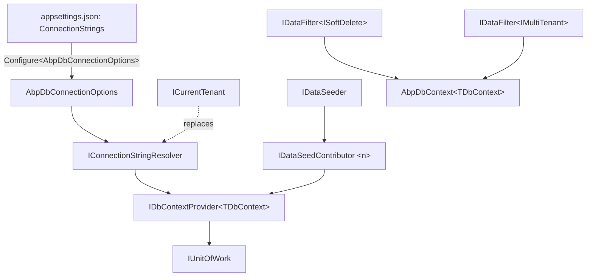

`Volo.Abp.Data` is the small, dependency-free package that every other data-access module in ABP builds on top of. It declares the contracts that decouple your application code from EF Core, MongoDB, Dapper, or any other store: `IConnectionStringResolver` answers the question *"which connection string should I use right now?"*, `IDataSeeder` drives module-supplied seed contributors at application start-up, and `IDataFilter<TFilter>` is what makes the soft-delete and multi-tenant query filters opt-in-able from inside a request scope. This page reads every file in `framework/src/Volo.Abp.Data/Volo/Abp/Data/` and explains how the pieces lock together.

## File inventory

Every file under `framework/src/Volo.Abp.Data/Volo/Abp/Data/`:

| File | Role |
| --- | --- |
| `AbpDataModule.cs` | Module class; binds `AbpDbConnectionOptions` from configuration, auto-registers `IDataSeedContributor`s |
| `AbpDbConnectionOptions.cs` | Options bag with `ConnectionStrings` + `Databases` |
| `ConnectionStrings.cs` | `Dictionary<string, string?>` with a `Default` shortcut |
| `ConnectionStringNameAttribute.cs` | `[ConnectionStringName("X")]` marker on `DbContext` types |
| `IConnectionStringResolver.cs` | Resolves a logical name to a real connection string |
| `DefaultConnectionStringResolver.cs` | Single-tenant implementation (replaced by `MultiTenantConnectionStringResolver` from `Volo.Abp.MultiTenancy`) |
| `ConnectionStringResolverExtensions.cs` | Generic overloads (`ResolveAsync<TDbContext>()`) |
| `IConnectionStringChecker.cs` | Health-check style probe |
| `DefaultConnectionStringChecker.cs` | No-op; provider modules override |
| `AbpConnectionStringCheckResult.cs` | DTO returned by checkers |
| `AbpDatabaseInfo.cs` / `AbpDatabaseInfoDictionary.cs` | Lookup table that maps `ConnectionStringName` → "physical" database (used by tenancy + migrations) |
| `IDataSeeder.cs` / `DataSeeder.cs` | Pipeline that walks all `IDataSeedContributor`s |
| `IDataSeedContributor.cs` | Per-module seed contract |
| `DataSeedContext.cs` | Tenant id + free-form properties dictionary |
| `DataSeedContributorList.cs` | Ordered list of contributor types |
| `AbpDataSeedOptions.cs` | Options bag exposing `Contributors` |
| `DataSeederExtensions.cs` | `SeedAsync(tenantId)` shortcut and `SeedInSeparateUowAsync` |
| `IDataFilter.cs` / `DataFilter.cs` | Generic `IDataFilter<TFilter>` with `AsyncLocal` state |
| `DataFilterState.cs` | Cloneable struct used as the per-filter state |
| `AbpDataFilterOptions.cs` | Default-state map for filters |
| `AbpDbConcurrencyException.cs` | Provider-agnostic concurrency wrapper |
| `ConcurrencyStampExtensions.cs` | Helpers for `IHasConcurrencyStamp.ConcurrencyStamp` |
| `AbpCommonDbProperties.cs` | Shared column-length constants (e.g. extra-properties JSON) |
| `AbpDataMigrationEnvironment.cs` / `…Extensions.cs` | Flag set by `AddDataMigrationEnvironment()` on the `DbMigrator` host |
| `ApplyDatabaseMigrationsEto.cs` / `AppliedDatabaseMigrationsEto.cs` | Distributed events used by per-tenant database creation |

## The module

`AbpDataModule` does three things during `ConfigureServices`: bind `AbpDbConnectionOptions` from configuration so `ConnectionStrings:Default` (etc.) flow in, register the generic `DataFilter<>` for every `TFilter` type, and (in `PreConfigureServices`) hook the registrar so any class implementing `IDataSeedContributor` is automatically appended to `AbpDataSeedOptions.Contributors`.

```csharp framework/src/Volo.Abp.Data/Volo/Abp/Data/AbpDataModule.cs
public override void PreConfigureServices(ServiceConfigurationContext context)
{
    AutoAddDataSeedContributors(context.Services);
}

public override void ConfigureServices(ServiceConfigurationContext context)
{
    var configuration = context.Services.GetConfiguration();

    Configure<AbpDbConnectionOptions>(configuration);

    context.Services.AddSingleton(typeof(IDataFilter<>), typeof(DataFilter<>));
}
```

The auto-registration is plain DI introspection:

```csharp framework/src/Volo.Abp.Data/Volo/Abp/Data/AbpDataModule.cs
private static void AutoAddDataSeedContributors(IServiceCollection services)
{
    var contributors = new List<Type>();

    services.OnRegistered(context =>
    {
        if (typeof(IDataSeedContributor).IsAssignableFrom(context.ImplementationType))
        {
            contributors.Add(context.ImplementationType);
        }
    });

    services.Configure<AbpDataSeedOptions>(options =>
    {
        options.Contributors.AddIfNotContains(contributors);
    });
}
```

`OnRegistered` is the conventional-registration hook (see [Conventional Registration](/di/conventional-registration)) — every `ITransientDependency`/`ISingletonDependency`/`IScopedDependency` implementing `IDataSeedContributor` gets added to the list without any explicit wiring.

## Connection strings

### The `ConnectionStrings` dictionary

A plain `Dictionary<string, string?>` with one well-known key:

```csharp framework/src/Volo.Abp.Data/Volo/Abp/Data/ConnectionStrings.cs
[Serializable]
public class ConnectionStrings : Dictionary<string, string?>
{
    public const string DefaultConnectionStringName = "Default";

    public string? Default {
        get => this.GetOrDefault(DefaultConnectionStringName);
        set => this[DefaultConnectionStringName] = value;
    }
}
```

Because `AbpDataModule` binds `Configure<AbpDbConnectionOptions>(configuration)` directly against the root `IConfiguration`, the `ConnectionStrings` JSON section in `appsettings.json` ends up in `AbpDbConnectionOptions.ConnectionStrings` — exactly the same source the ASP.NET Core host uses for `Configuration.GetConnectionString(...)`.

### `[ConnectionStringName]`

Each `AbpDbContext` (and `AbpMongoDbContext`) is decorated with `[ConnectionStringName("X")]`; the attribute gives ABP the *logical* name to look up at resolution time:

```csharp framework/src/Volo.Abp.Data/Volo/Abp/Data/ConnectionStringNameAttribute.cs
public static string GetConnStringName(Type type)
{
    var nameAttribute = type.GetTypeInfo().GetCustomAttribute<ConnectionStringNameAttribute>();

    if (nameAttribute == null)
    {
        return type.FullName!;
    }

    return nameAttribute.Name;
}
```

If a context is not annotated, its full type name becomes the connection-string key.

### `IConnectionStringResolver`

```csharp framework/src/Volo.Abp.Data/Volo/Abp/Data/IConnectionStringResolver.cs
public interface IConnectionStringResolver
{
    [Obsolete("Use ResolveAsync method.")]
    string Resolve(string? connectionStringName = null);

    Task<string> ResolveAsync(string? connectionStringName = null);
}
```

The default implementation walks `AbpDbConnectionOptions.GetConnectionStringOrNull(name)`, which performs three fallbacks: explicit key → mapped database (via `AbpDatabaseInfoDictionary`) → default key.

```csharp framework/src/Volo.Abp.Data/Volo/Abp/Data/AbpDbConnectionOptions.cs
public string? GetConnectionStringOrNull(
    string connectionStringName,
    bool fallbackToDatabaseMappings = true,
    bool fallbackToDefault = true)
{
    var connectionString = ConnectionStrings.GetOrDefault(connectionStringName);
    if (!connectionString.IsNullOrEmpty())
    {
        return connectionString;
    }

    if (fallbackToDatabaseMappings)
    {
        var database = Databases.GetMappedDatabaseOrNull(connectionStringName);
        if (database != null)
        {
            connectionString = ConnectionStrings.GetOrDefault(database.DatabaseName);
            if (!connectionString.IsNullOrEmpty())
            {
                return connectionString;
            }
        }
    }

    if (fallbackToDefault)
    {
        connectionString = ConnectionStrings.Default;
        if (!connectionString.IsNullOrWhiteSpace())
        {
            return connectionString;
        }
    }

    return null;
}
```

`DefaultConnectionStringResolver` is single-tenant. The `Volo.Abp.MultiTenancy` module replaces this service with `MultiTenantConnectionStringResolver`, which first checks `ICurrentTenant.ConnectionStrings` (per-tenant override stored on the tenant entity), then falls back to the host options. See [Multi-Tenancy](/multitenancy) for the tenant-aware variant.

### Resolving by `DbContext` type

The extension methods turn a generic `<TDbContext>` call into the right string-keyed call:

```csharp framework/src/Volo.Abp.Data/Volo/Abp/Data/ConnectionStringResolverExtensions.cs
public static Task<string> ResolveAsync<T>(this IConnectionStringResolver resolver)
{
    return resolver.ResolveAsync(typeof(T));
}

public static Task<string> ResolveAsync(this IConnectionStringResolver resolver, Type type)
{
    return resolver.ResolveAsync(ConnectionStringNameAttribute.GetConnStringName(type));
}
```

`UnitOfWorkDbContextProvider<TDbContext>` calls exactly this overload when it needs to create a `DbContext` instance.

### `AbpDatabaseInfo` and database mappings

Connection-string *names* (logical, e.g. `"AbpIdentity"`) are not the same as physical *databases*. The `Databases` dictionary lets a host say *"AbpIdentity, AbpTenantManagement and AbpPermissionManagement all live in the same database"* so per-tenant connection-string overrides only need a single entry. `RefreshIndexes` is called in `PostConfigureServices` to materialise the reverse lookup.

```csharp framework/src/Volo.Abp.Data/Volo/Abp/Data/AbpDatabaseInfo.cs
public class AbpDatabaseInfo
{
    public string DatabaseName { get; }
    public HashSet<string> MappedConnections { get; }
    public bool IsUsedByTenants { get; set; } = true;

    internal AbpDatabaseInfo(string databaseName)
    {
        DatabaseName = databaseName;
        MappedConnections = new HashSet<string>();
    }
}
```

## Data seeding

### Contracts

`IDataSeeder` is the single entry point your host invokes; `IDataSeedContributor` is the per-module hook that gets dispatched:

```csharp framework/src/Volo.Abp.Data/Volo/Abp/Data/IDataSeeder.cs
public interface IDataSeeder
{
    Task SeedAsync(DataSeedContext context);
}
```

```csharp framework/src/Volo.Abp.Data/Volo/Abp/Data/IDataSeedContributor.cs
public interface IDataSeedContributor
{
    Task SeedAsync(DataSeedContext context);
}
```

`DataSeedContext` carries the tenant identity plus an open property bag. The framework reserves three property keys (declared on `DataSeederExtensions`) for unit-of-work control; everything else is yours to use to pass things like the admin email/password from the host into module seeders.

```csharp framework/src/Volo.Abp.Data/Volo/Abp/Data/DataSeedContext.cs
public class DataSeedContext
{
    public Guid? TenantId { get; set; }

    public object? this[string name] {
        get => Properties.GetOrDefault(name);
        set => Properties[name] = value;
    }

    [NotNull]
    public Dictionary<string, object?> Properties { get; }

    public DataSeedContext(Guid? tenantId = null)
    {
        TenantId = tenantId;
        Properties = new Dictionary<string, object?>();
    }

    public virtual DataSeedContext WithProperty(string key, object? value)
    {
        Properties[key] = value;
        return this;
    }
}
```

### The default seeder

`DataSeeder` is the default `IDataSeeder` implementation. By default it runs every contributor inside the *current* unit of work (the `[UnitOfWork]` attribute ambient-starts one). If you flag the context with `SeedInSeparateUow`, each contributor gets its *own* UoW so a failure in one does not roll back the others:

```csharp framework/src/Volo.Abp.Data/Volo/Abp/Data/DataSeeder.cs
[UnitOfWork]
public virtual async Task SeedAsync(DataSeedContext context)
{
    using (var scope = ServiceScopeFactory.CreateScope())
    {
        if (context.Properties.ContainsKey(DataSeederExtensions.SeedInSeparateUow))
        {
            var manager = scope.ServiceProvider.GetRequiredService<IUnitOfWorkManager>();
            foreach (var contributorType in Options.Contributors)
            {
                var options = context.Properties.TryGetValue(DataSeederExtensions.SeedInSeparateUowOptions, out var uowOptions)
                    ? (AbpUnitOfWorkOptions) uowOptions!
                    : new AbpUnitOfWorkOptions();
                var requiresNew = context.Properties.TryGetValue(DataSeederExtensions.SeedInSeparateUowRequiresNew, out var obj) && (bool) obj!;

                using (var uow = manager.Begin(options, requiresNew))
                {
                    var contributor = (IDataSeedContributor)scope.ServiceProvider.GetRequiredService(contributorType);
                    await contributor.SeedAsync(context);
                    await uow.CompleteAsync();
                }
            }
        }
        else
        {
            foreach (var contributorType in Options.Contributors)
            {
                var contributor = (IDataSeedContributor)scope.ServiceProvider.GetRequiredService(contributorType);
                await contributor.SeedAsync(context);
            }
        }
    }
}
```

The convenient `SeedInSeparateUowAsync` extension sets the right properties for you:

```csharp framework/src/Volo.Abp.Data/Volo/Abp/Data/DataSeederExtensions.cs
public const string SeedInSeparateUow = "__SeedInSeparateUow";
public const string SeedInSeparateUowOptions = "__SeedInSeparateUowOptions";
public const string SeedInSeparateUowRequiresNew = "__SeedInSeparateUowRequiresNew";

public static Task SeedAsync(this IDataSeeder seeder, Guid? tenantId = null)
{
    return seeder.SeedAsync(new DataSeedContext(tenantId));
}

public static Task SeedInSeparateUowAsync(this IDataSeeder seeder, Guid? tenantId = null, AbpUnitOfWorkOptions? options = null, bool requiresNew = false)
{
    var context = new DataSeedContext(tenantId);
    context.WithProperty(SeedInSeparateUow, true);
    context.WithProperty(SeedInSeparateUowOptions, options);
    context.WithProperty(SeedInSeparateUowRequiresNew, requiresNew);
    return seeder.SeedAsync(context);
}
```

See [Data Seeding](/data/data-seeding) for a worked end-to-end example.

## Data filters

`IDataFilter<TFilter>` is what makes statements like `using (_dataFilter.Disable<ISoftDelete>())` work. It is per-filter-type state held in an `AsyncLocal<DataFilterState>` so it flows across `await` boundaries without leaking to other requests.

```csharp framework/src/Volo.Abp.Data/Volo/Abp/Data/IDataFilter.cs
public interface IDataFilter<TFilter>
    where TFilter : class
{
    IDisposable Enable();

    IDisposable Disable();

    bool IsEnabled { get; }
}

public interface IDataFilter
{
    IDisposable Enable<TFilter>()
        where TFilter : class;

    IDisposable Disable<TFilter>()
        where TFilter : class;

    bool IsEnabled<TFilter>()
        where TFilter : class;
}
```

The non-generic `IDataFilter` is a router that resolves the right closed generic on demand:

```csharp framework/src/Volo.Abp.Data/Volo/Abp/Data/DataFilter.cs
public IDisposable Enable<TFilter>()
    where TFilter : class
{
    return GetFilter<TFilter>().Enable();
}

private IDataFilter<TFilter> GetFilter<TFilter>()
    where TFilter : class
{
    return (_filters.GetOrAdd(
        typeof(TFilter),
        factory: () => _serviceProvider.GetRequiredService<IDataFilter<TFilter>>()
    ) as IDataFilter<TFilter>)!;
}
```

`DataFilter<TFilter>` itself defaults to enabled unless `AbpDataFilterOptions.DefaultStates` says otherwise. Enabling on an already-enabled filter returns `NullDisposable.Instance` so `using` blocks always nest cleanly.

ABP defines two standard filter marker types: `ISoftDelete` (from `Volo.Abp.Ddd.Domain`) and `IMultiTenant` (from `Volo.Abp.MultiTenancy`). `AbpDbContext<TDbContext>` consults `IDataFilter.IsEnabled<TFilter>()` while building EF query filters:

```csharp framework/src/Volo.Abp.EntityFrameworkCore/Volo/Abp/EntityFrameworkCore/AbpDbContext.cs
protected virtual bool IsMultiTenantFilterEnabled => DataFilter?.IsEnabled<IMultiTenant>() ?? false;

protected virtual bool IsSoftDeleteFilterEnabled => DataFilter?.IsEnabled<ISoftDelete>() ?? false;
```

## Concurrency

When a `DbUpdateConcurrencyException` is thrown EF Core, `AbpDbContext` re-wraps it as the provider-agnostic `AbpDbConcurrencyException`:

```csharp framework/src/Volo.Abp.Data/Volo/Abp/Data/AbpDbConcurrencyException.cs
public class AbpDbConcurrencyException : AbpException
{
    public AbpDbConcurrencyException() { }

    public AbpDbConcurrencyException(string message)
        : base(message) { }

    public AbpDbConcurrencyException(string message, Exception innerException)
        : base(message, innerException) { }
}
```

This is what surfaces to your application code. The MongoDB and in-memory providers also throw this type, which is why catching it lets you write provider-neutral retry logic.

## `IGuidGenerator` integration

`Volo.Abp.Data` itself does not own `IGuidGenerator` (it lives in `Volo.Abp.Guids`), but the provider modules layer on top of it. Each `Abp*EntityFrameworkCoreModule` sets a default `SequentialGuidType`:

| Provider | Default `SequentialGuidType` |
| --- | --- |
| SQL Server | `SequentialAtEnd` |
| MySQL | `SequentialAsString` |
| PostgreSQL | `SequentialAsString` |
| Oracle (both providers) | `SequentialAsBinary` |
| SQLite | (inherits framework default) |

So an `EfCoreRepository<,,>` that calls `GuidGenerator.Create()` on insert gets a clustered-index-friendly id without any extra code.

## How it all hangs together



## Cross references

<CardGroup cols={2}>
  <Card title="Entity Framework Core" href="/data/entity-framework-core">How `IDbContextProvider<>` and `AbpDbContext<>` consume these primitives.</Card>
  <Card title="MongoDB" href="/data/mongodb">Same primitives, applied to `AbpMongoDbContext`.</Card>
  <Card title="Data Seeding" href="/data/data-seeding">End-to-end example of `IDataSeedContributor` registration and invocation.</Card>
  <Card title="Unit of Work" href="/uow">The transaction scope inside which seeders, filters and repositories live.</Card>
  <Card title="Multi-Tenancy" href="/multitenancy">`MultiTenantConnectionStringResolver` and per-tenant overrides.</Card>
  <Card title="Repositories" href="/ddd/repositories">The DDD contracts implemented by each provider's repository class.</Card>
</CardGroup>
