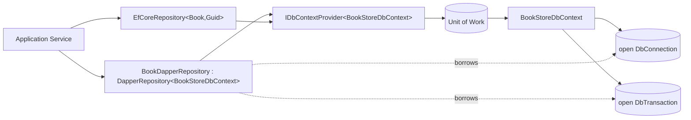

`Volo.Abp.Dapper` is the *thinnest* data-access module in ABP. It does not own a connection, a context, or a unit of work — instead it borrows all three from the already-registered [EF Core integration](/data/entity-framework-core). `DapperRepository<TDbContext>` simply exposes the open `IDbConnection` and `IDbTransaction` from the `TDbContext` resolved by `IDbContextProvider<TDbContext>`, so any Dapper extension method (`QueryAsync`, `ExecuteAsync`, …) runs on the same physical connection as your EF Core LINQ queries — same transaction, same UoW, same per-tenant connection string. This page reads every file in `framework/src/Volo.Abp.Dapper/` and shows how to use it.

## File inventory

`Volo.Abp.Dapper` is a four-file package:

| File | Role |
| --- | --- |
| `Volo/Abp/Dapper/AbpDapperModule.cs` | Module class declaring the EF Core dependency |
| `Volo/Abp/Domain/Repositories/Dapper/IDapperRepository.cs` | Public contract |
| `Volo/Abp/Domain/Repositories/Dapper/DapperRepository.cs` | Generic `DapperRepository<TDbContext>` |

## The module

```csharp framework/src/Volo.Abp.Dapper/Volo/Abp/Dapper/AbpDapperModule.cs
using Volo.Abp.Domain;
using Volo.Abp.EntityFrameworkCore;
using Volo.Abp.Modularity;

namespace Volo.Abp.Dapper;

[DependsOn(
    typeof(AbpDddDomainModule),
    typeof(AbpEntityFrameworkCoreModule))]
public class AbpDapperModule : AbpModule
{
}
```

That is the entire module. It does not register any service of its own — Dapper itself is a static `IDbConnection` extension library, and `DapperRepository<TDbContext>` is auto-registered by ABP's conventional registrar (it inherits the `ITransientDependency` lifestyle from `RepositoryBase`-style classes when you derive from it).

The crucial implication of `[DependsOn(typeof(AbpEntityFrameworkCoreModule))]` is that **you must register an EF Core `DbContext` for Dapper to use**. There is no "Dapper-only" mode. Most teams therefore add Dapper to projects that already use EF Core for command-side aggregates and want raw SQL for read-side queries.

## `IDapperRepository`

```csharp framework/src/Volo.Abp.Dapper/Volo/Abp/Domain/Repositories/Dapper/IDapperRepository.cs
public interface IDapperRepository
{
    [Obsolete("Use GetDbConnectionAsync method.")]
    IDbConnection DbConnection { get; }

    Task<IDbConnection> GetDbConnectionAsync();

    [Obsolete("Use GetDbTransactionAsync method.")]
    IDbTransaction? DbTransaction { get; }

    Task<IDbTransaction?> GetDbTransactionAsync();
}
```

The contract is intentionally minimal — it just hands you the ADO.NET primitives. Dapper itself owns the API surface (`Query`, `Execute`, `QueryMultiple`, …); ABP just makes sure the connection and transaction are the *right* ones.

## `DapperRepository<TDbContext>`

```csharp framework/src/Volo.Abp.Dapper/Volo/Abp/Domain/Repositories/Dapper/DapperRepository.cs
public class DapperRepository<TDbContext> : IDapperRepository, IUnitOfWorkEnabled
    where TDbContext : IEfCoreDbContext
{
    public IAbpLazyServiceProvider LazyServiceProvider { get; set; } = default!;

    public IDataFilter DataFilter => LazyServiceProvider.LazyGetRequiredService<IDataFilter>();

    public ICurrentTenant CurrentTenant => LazyServiceProvider.LazyGetRequiredService<ICurrentTenant>();

    public IUnitOfWorkManager UnitOfWorkManager => LazyServiceProvider.LazyGetRequiredService<IUnitOfWorkManager>();

    public ICancellationTokenProvider CancellationTokenProvider => LazyServiceProvider.LazyGetService<ICancellationTokenProvider>(NullCancellationTokenProvider.Instance);

    private readonly IDbContextProvider<TDbContext> _dbContextProvider;

    public DapperRepository(IDbContextProvider<TDbContext> dbContextProvider)
    {
        _dbContextProvider = dbContextProvider;
    }

    [Obsolete("Use GetDbConnectionAsync method.")]
    public IDbConnection DbConnection => _dbContextProvider.GetDbContext().Database.GetDbConnection();

    public virtual async Task<IDbConnection> GetDbConnectionAsync() => (await _dbContextProvider.GetDbContextAsync()).Database.GetDbConnection();

    [Obsolete("Use GetDbTransactionAsync method.")]
    public IDbTransaction? DbTransaction => _dbContextProvider.GetDbContext().Database.CurrentTransaction?.GetDbTransaction();

    public virtual async Task<IDbTransaction?> GetDbTransactionAsync() => (await _dbContextProvider.GetDbContextAsync()).Database.CurrentTransaction?.GetDbTransaction();

    protected virtual CancellationToken GetCancellationToken(CancellationToken preferredValue = default)
    {
        return CancellationTokenProvider.FallbackToProvider(preferredValue);
    }
}
```

Three lines do all the work:

- `GetDbConnectionAsync()` → `(await _dbContextProvider.GetDbContextAsync()).Database.GetDbConnection()`. Because `_dbContextProvider` is `UnitOfWorkDbContextProvider<TDbContext>`, the *first* call inside a UoW creates the `DbContext` (running every configurer in `AbpDbContextOptions`) and stores it in the UoW. Every subsequent `GetDbConnectionAsync()` returns the *same* `DbConnection`.
- `GetDbTransactionAsync()` → `CurrentTransaction?.GetDbTransaction()`. If the unit of work is transactional, the EF Core `IDbContextTransaction` has already opened a `DbTransaction`; Dapper enlists onto it.
- `IUnitOfWorkEnabled` is a marker interface that signals to the ABP interceptors that calls into this repository should participate in any ambient unit of work.

## Use pattern

A typical Dapper-backed read model looks like:

```csharp BookDapperRepository.cs
public class BookDapperRepository : DapperRepository<BookStoreDbContext>, ITransientDependency
{
    public BookDapperRepository(IDbContextProvider<BookStoreDbContext> dbContextProvider)
        : base(dbContextProvider)
    {
    }

    public virtual async Task<List<BookSummary>> GetSummariesAsync()
    {
        var connection = await GetDbConnectionAsync();
        var transaction = await GetDbTransactionAsync();

        return (await connection.QueryAsync<BookSummary>(
            "SELECT Id, Name, Price FROM Books WHERE IsDeleted = 0",
            transaction: transaction
        )).ToList();
    }
}
```

Three things to notice:

1. **`transaction:` argument is passed to `QueryAsync`.** This is non-optional — if you forget it and the UoW is transactional, the read happens *outside* the transaction and will block until commit on isolation levels above READ COMMITTED.
2. **Hand-write the soft-delete predicate.** Dapper does not know about `ISoftDelete`. You must include `WHERE IsDeleted = 0` (and the `TenantId = @CurrentTenantId` filter for multi-tenant entities) explicitly. `CurrentTenant.Id` is available via the inherited property.
3. **The method is virtual.** ABP's auditing and validation interceptors are dynamic-proxy-based; making methods virtual is what allows them to be intercepted.

## A note on `IUnitOfWork.CompleteAsync`

When the surrounding UoW completes, `IDatabaseApi.SaveChangesAsync` is called on the cached `EfCoreDatabaseApi`, which calls `DbContext.SaveChangesAsync()`. Because Dapper writes the SQL directly (no change-tracker entries), `SaveChangesAsync` is a no-op for Dapper's writes — but it still commits the EF Core transaction that wraps both the EF Core changes and the Dapper writes. This is why Dapper's writes must use the *active* transaction returned by `GetDbTransactionAsync`: forgetting it bypasses the transaction entirely, and the Dapper write succeeds even if the surrounding UoW is later rolled back.

## `IDbConnection` lifetime

Crucially, `DapperRepository<TDbContext>` does **not** open or close the connection — those operations belong to the EF Core `DbContext` whose lifetime is managed by `UnitOfWorkDbContextProvider<TDbContext>`. The first repository call inside a UoW (whether EF Core or Dapper) materialises the `DbContext`, which opens its `DbConnection` lazily on the first command. The `DbContext` lives as long as the UoW; when the UoW disposes, the `DbContext` is disposed, which closes the connection and returns it to the ADO.NET connection pool. **Never** call `Dispose()` on the `IDbConnection` returned by `GetDbConnectionAsync()` — you would break the EF Core context still using it.

## Connection / transaction sharing in action

```mermaid
sequenceDiagram
    autonumber
    participant App as Application Service
    participant Ef as EfCoreRepository&lt;Book,Guid&gt;
    participant Dap as BookDapperRepository
    participant Prov as IDbContextProvider&lt;BookStoreDbContext&gt;
    participant Ctx as BookStoreDbContext
    participant Db as (Connection + Transaction)

    App->>Ef: GetListAsync()
    Ef->>Prov: GetDbContextAsync()
    Prov->>Ctx: new + UseSqlServer
    Prov->>Db: BeginTransaction()
    Prov-->>Ef: BookStoreDbContext
    App->>Dap: GetSummariesAsync()
    Dap->>Prov: GetDbContextAsync()
    Prov-->>Dap: same BookStoreDbContext (cached)
    Dap->>Db: Database.GetDbConnection()
    Dap->>Db: CurrentTransaction.GetDbTransaction()
    Dap->>Db: QueryAsync(..., transaction)
```

The UoW slot keyed by `{type}_{connectionString}` is what makes the second call cheap — no second connection, no second transaction.

## When (not) to use Dapper

<Tip>
Dapper is the right tool when EF Core's LINQ translation generates SQL you cannot tune, when you need a window function or a CTE that EF Core does not expose, or when you want to project directly into a read-model DTO without the materialisation cost of change tracking. It is **not** the right tool for command-side aggregates — those should stay on the EF Core repository so ABP's audit-stamping, soft-delete, and domain-event publishing continue to apply.
</Tip>

### Things you must hand-implement when using Dapper

| Concern | EF Core repository | Dapper repository |
| --- | --- | --- |
| Soft-delete filter | Automatic | You write `WHERE IsDeleted = 0` |
| Multi-tenant filter | Automatic | You write `WHERE TenantId = @TenantId` |
| Audit property stamping | Automatic on `SaveChanges` | You compute `CreationTime`, `CreatorId`, etc. in SQL |
| `IGuidGenerator` for new ids | Automatic | You call `GuidGenerator.Create()` and pass as parameter |
| Domain event publishing | Automatic on `SaveChanges` | You call `ILocalEventBus` / `IDistributedEventBus` manually |
| Concurrency stamp | Automatic | You write `WHERE ConcurrencyStamp = @oldStamp` |

For aggregates you care about consistency on, prefer the EF Core repository and let `AbpDbContext<>.SaveChangesAsync` do the work. Dapper shines on the read side.

## Multi-tenancy and per-tenant connections

Because `DapperRepository<TDbContext>` resolves the `DbContext` through the standard `IDbContextProvider<>`, a per-tenant connection-string override (resolved via `MultiTenantConnectionStringResolver` — see [Multi-Tenancy](/multitenancy)) is honoured for free. When tenant *X* hits the application:

1. ABP sets `ICurrentTenant.Id = X`.
2. `IDbContextProvider<BookStoreDbContext>.GetDbContextAsync()` resolves the *X-specific* connection string.
3. `GetDbConnectionAsync()` on the Dapper repository returns the connection on *X's* database.

So a single `SELECT … FROM Books` query naturally targets the right database without any additional configuration.

## `IUnitOfWorkEnabled` and interception

`DapperRepository<TDbContext>` is marked `IUnitOfWorkEnabled` — a tag interface used by ABP's dynamic-proxy interceptors to determine whether a class participates in a unit of work. When a derived repository method is called from outside a UoW context, the [Unit of Work](/uow) interceptor (registered by `Volo.Abp.Uow`) opens an ambient transaction for the duration of the call, even though Dapper itself has no awareness of it. The repository's `GetDbTransactionAsync()` then returns the transaction the UoW opened on the EF Core `DbContext`.

The implication: a Dapper repository called from an application service that already has `[UnitOfWork]` semantics behaves identically to an EF Core repository. There is no second transaction, no second connection, no cross-database deadlock risk.

## Provider matrix

`DapperRepository<TDbContext>` works against *any* EF Core provider because it only consumes the abstract `IDbConnection` and `IDbTransaction` from `Database.GetDbConnection()`. The Dapper SQL you write is what carries the dialect:

| Provider | `DbConnection` type | Dialect surface |
| --- | --- | --- |
| SQL Server | `SqlConnection` | T-SQL |
| MySQL | `MySqlConnection` | MySQL SQL |
| PostgreSQL | `NpgsqlConnection` | PostgreSQL SQL |
| Oracle | `OracleConnection` | PL/SQL |
| SQLite | `SqliteConnection` | SQLite SQL |

If you want a single Dapper repository to be portable across providers, parameterise the SQL through a `Func<EfCoreDatabaseProvider, string>` indirection, or — more commonly — accept that the Dapper repository is provider-specific and lives next to the migrations for that provider.

## Reading large result sets

For large query results, prefer Dapper's streaming overloads (`QueryAsync<T>` with `buffered: false`) so memory stays bounded. Combine with `CommandFlags.NoCache` if you have many one-off variants of the same SQL — Dapper's parameter cache otherwise grows without bound.

```csharp BookDapperRepository.cs
public async IAsyncEnumerable<BookSummary> StreamSummariesAsync()
{
    var connection = await GetDbConnectionAsync();
    var transaction = await GetDbTransactionAsync();

    var reader = await connection.ExecuteReaderAsync(
        "SELECT Id, Name, Price FROM Books WHERE IsDeleted = 0",
        transaction: transaction);

    var parser = reader.GetRowParser<BookSummary>();
    while (await reader.ReadAsync())
    {
        yield return parser(reader);
    }
}
```

## Writing through Dapper

Hand-written `INSERT`/`UPDATE`/`DELETE` is technically valid but bypasses every cross-cutting concern ABP normally applies in `AbpDbContext.SaveChangesAsync` — soft delete, audit stamps, concurrency stamps, domain events, entity history. If you must write through Dapper, replicate those concerns manually:

| Concern | What the EF Core path does | Dapper equivalent |
| --- | --- | --- |
| `Creator/LastModifier` fields | `IAuditPropertySetter.SetCreationProperties` | Pass `@CreatorId = currentUserId` and `@CreationTime = clock.Now` parameters |
| `ConcurrencyStamp` | Auto-generated by `AbpDbContext.HandlePropertiesBeforeSave` | `WHERE ConcurrencyStamp = @oldStamp; SET @newStamp = @newGuid` |
| Soft delete | `ISoftDelete.IsDeleted` set in `SaveChangesAsync` | `UPDATE … SET IsDeleted = 1, DeleterId = @userId, DeletionTime = @now` |
| Domain events | `DistributedEventBus.PublishAsync` after commit | Manually publish via `ILocalEventBus`/`IDistributedEventBus` after the SQL succeeds |

If most of your aggregate writes need these concerns, the EF Core repository is the right tool. Dapper writes are useful for bulk imports, denormalisation jobs, and cases where the SQL is fundamentally set-based (`INSERT … SELECT … FROM …`) and would round-trip in EF Core.

## Testing Dapper repositories

The `EfCoreRepository<,,>` integration test pattern relies on EF Core's `Database.EnsureCreated()` materialising the schema from the model. Dapper has no model — it only knows about the SQL you write — so your tests must materialise the schema either through EF Core migrations or by executing the table-creation DDL by hand. The common pattern is to share the EF Core DbContext registration with tests (so `EnsureCreated` runs) and then exercise the Dapper repository through the same UoW:

```csharp
using var uow = _unitOfWorkManager.Begin();
var summaries = await _bookDapperRepository.GetSummariesAsync();
summaries.Count.ShouldBe(2);
await uow.CompleteAsync();
```

The repository call materialises the EF Core `DbContext` first (via `IDbContextProvider`), which is what populates the SQLite in-memory database with the schema.

## Composition diagram



## Related pages

<CardGroup cols={2}>
  <Card title="EF Core" href="/data/entity-framework-core">The provider Dapper borrows the `DbContext` from.</Card>
  <Card title="Repositories" href="/ddd/repositories">DDD repository contracts (`IRepository<,>` is *not* implemented by Dapper).</Card>
  <Card title="Unit of Work" href="/uow">How the shared transaction is opened, committed, and rolled back.</Card>
  <Card title="Volo.Abp.Data" href="/data/abp-data">Connection-string primitives.</Card>
  <Card title="Multi-Tenancy" href="/multitenancy">Per-tenant connection strings consumed transparently.</Card>
</CardGroup>
