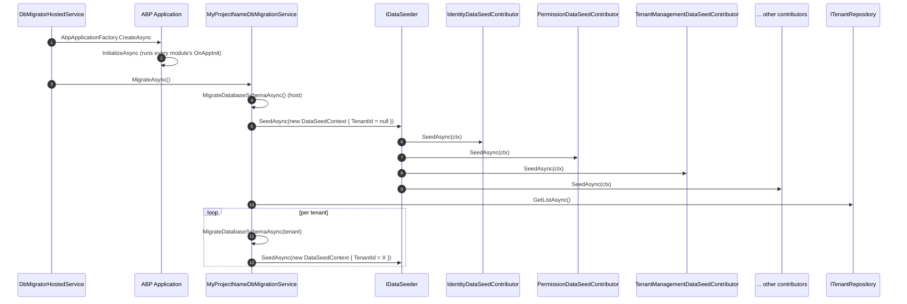

ABP's data-seeding pipeline is the standard way modules ship "this row must exist for the app to work" data — the default admin user, the default tenant, the built-in permission grants, demo books, and so on. It is intentionally *not* part of EF Core migrations: it lives one layer up so the same contributor can seed a SQL Server database, a Mongo collection, or even an in-memory test store unchanged. This page walks the three contracts (`IDataSeeder`, `IDataSeedContributor`, `DataSeedContext`), shows how the `DbMigrator` host triggers the pipeline, and points at real-world contributors shipped by the framework.

## The three contracts

`IDataSeeder` is the *host-facing* entry point — your `Program.Main` (via the `DbMigrator` host) calls `IDataSeeder.SeedAsync(...)` exactly once. `IDataSeedContributor` is the *module-facing* extension point — every module that needs seed data implements one. `DataSeedContext` carries the tenant identity plus a free-form property bag so seeders can talk to each other (e.g. *"create the tenant first, then call my contributor with `TenantId = X`"*).

```csharp framework/src/Volo.Abp.Data/Volo/Abp/Data/IDataSeeder.cs
public interface IDataSeeder
{
    Task SeedAsync(DataSeedContext context);
}
```

```csharp framework/src/Volo.Abp.Data/Volo/Abp/Data/IDataSeedContributor.cs
public interface IDataSeedContributor
{
    Task SeedAsync(DataSeedContext context);
}
```

```csharp framework/src/Volo.Abp.Data/Volo/Abp/Data/DataSeedContext.cs
public class DataSeedContext
{
    public Guid? TenantId { get; set; }

    public object? this[string name] {
        get => Properties.GetOrDefault(name);
        set => Properties[name] = value;
    }

    [NotNull]
    public Dictionary<string, object?> Properties { get; }

    public DataSeedContext(Guid? tenantId = null)
    {
        TenantId = tenantId;
        Properties = new Dictionary<string, object?>();
    }

    public virtual DataSeedContext WithProperty(string key, object? value)
    {
        Properties[key] = value;
        return this;
    }
}
```

## Auto-registration of contributors

You never list contributors by hand. `AbpDataModule.PreConfigureServices` hooks into the DI registrar (see [Conventional Registration](/di/conventional-registration)) and appends every implementation of `IDataSeedContributor` to `AbpDataSeedOptions.Contributors`:

```csharp framework/src/Volo.Abp.Data/Volo/Abp/Data/AbpDataModule.cs
private static void AutoAddDataSeedContributors(IServiceCollection services)
{
    var contributors = new List<Type>();

    services.OnRegistered(context =>
    {
        if (typeof(IDataSeedContributor).IsAssignableFrom(context.ImplementationType))
        {
            contributors.Add(context.ImplementationType);
        }
    });

    services.Configure<AbpDataSeedOptions>(options =>
    {
        options.Contributors.AddIfNotContains(contributors);
    });
}
```

So *any* class implementing `IDataSeedContributor` (and using one of the lifecycle marker interfaces like `ITransientDependency`) gets picked up automatically — no manifest, no manual `options.Contributors.Add<X>()` call, no startup-order ceremony.

## The default seeder

`DataSeeder` is the default `IDataSeeder`. It opens a service scope, iterates `Options.Contributors` in registration order, and dispatches to each contributor. The dispatch happens inside the ambient unit of work by default (`[UnitOfWork]` on the method) so every contributor sees the same `DbContext` instance — handy when one contributor inserts a user and another contributor assigns roles to that same just-inserted user.

```csharp framework/src/Volo.Abp.Data/Volo/Abp/Data/DataSeeder.cs
[UnitOfWork]
public virtual async Task SeedAsync(DataSeedContext context)
{
    using (var scope = ServiceScopeFactory.CreateScope())
    {
        if (context.Properties.ContainsKey(DataSeederExtensions.SeedInSeparateUow))
        {
            var manager = scope.ServiceProvider.GetRequiredService<IUnitOfWorkManager>();
            foreach (var contributorType in Options.Contributors)
            {
                var options = context.Properties.TryGetValue(DataSeederExtensions.SeedInSeparateUowOptions, out var uowOptions)
                    ? (AbpUnitOfWorkOptions) uowOptions!
                    : new AbpUnitOfWorkOptions();
                var requiresNew = context.Properties.TryGetValue(DataSeederExtensions.SeedInSeparateUowRequiresNew, out var obj) && (bool) obj!;

                using (var uow = manager.Begin(options, requiresNew))
                {
                    var contributor = (IDataSeedContributor)scope.ServiceProvider.GetRequiredService(contributorType);
                    await contributor.SeedAsync(context);
                    await uow.CompleteAsync();
                }
            }
        }
        else
        {
            foreach (var contributorType in Options.Contributors)
            {
                var contributor = (IDataSeedContributor)scope.ServiceProvider.GetRequiredService(contributorType);
                await contributor.SeedAsync(context);
            }
        }
    }
}
```

### Two execution modes

| Mode | Trigger | Behaviour |
| --- | --- | --- |
| **Single UoW** | default | All contributors share one UoW; one failure rolls back every change. Good for testing. |
| **Per-contributor UoW** | `WithProperty(SeedInSeparateUow, true)` | Each contributor runs in its own UoW; a failure does not roll back earlier successful contributors. Used by `DbMigrator` in production so a single broken module does not block the rest of the seed. |

The `SeedInSeparateUowAsync` extension is the convenient shortcut:

```csharp framework/src/Volo.Abp.Data/Volo/Abp/Data/DataSeederExtensions.cs
public const string SeedInSeparateUow = "__SeedInSeparateUow";
public const string SeedInSeparateUowOptions = "__SeedInSeparateUowOptions";
public const string SeedInSeparateUowRequiresNew = "__SeedInSeparateUowRequiresNew";

public static Task SeedAsync(this IDataSeeder seeder, Guid? tenantId = null)
{
    return seeder.SeedAsync(new DataSeedContext(tenantId));
}

public static Task SeedInSeparateUowAsync(this IDataSeeder seeder, Guid? tenantId = null, AbpUnitOfWorkOptions? options = null, bool requiresNew = false)
{
    var context = new DataSeedContext(tenantId);
    context.WithProperty(SeedInSeparateUow, true);
    context.WithProperty(SeedInSeparateUowOptions, options);
    context.WithProperty(SeedInSeparateUowRequiresNew, requiresNew);
    return seeder.SeedAsync(context);
}
```

## A real contributor — identity

The Identity module ships `IdentityDataSeedContributor`, which creates the default `admin` user and the `admin` role on first run. It reads the admin email/password from the `DataSeedContext` property bag so the host can override them:

```csharp modules/identity/src/Volo.Abp.Identity.Domain/Volo/Abp/Identity/IdentityDataSeedContributor.cs
public class IdentityDataSeedContributor : IDataSeedContributor, ITransientDependency
{
    public const string AdminEmailPropertyName = "AdminEmail";
    public const string AdminEmailDefaultValue = "admin@abp.io";
    public const string AdminPasswordPropertyName = "AdminPassword";
    public const string AdminPasswordDefaultValue = "1q2w3E*";

    protected IIdentityDataSeeder IdentityDataSeeder { get; }

    public IdentityDataSeedContributor(IIdentityDataSeeder identityDataSeeder)
    {
        IdentityDataSeeder = identityDataSeeder;
    }

    public virtual Task SeedAsync(DataSeedContext context)
    {
        return IdentityDataSeeder.SeedAsync(
            context?[AdminEmailPropertyName] as string ?? AdminEmailDefaultValue,
            context?[AdminPasswordPropertyName] as string ?? AdminPasswordDefaultValue,
            context?.TenantId
        );
    }
}
```

Two patterns to copy:

1. **Property constants on the contributor class.** The host can override `admin@abp.io` by calling `context.WithProperty(IdentityDataSeedContributor.AdminEmailPropertyName, "ops@contoso.com")`.
2. **Delegate to a `*DataSeeder` service.** The contributor itself is wafer-thin; the actual write logic lives in `IIdentityDataSeeder`, which is reusable from outside the seeding pipeline (e.g. an admin "reset to defaults" command).

## How the `DbMigrator` host invokes seeding

The standard solution template ships a `DbMigrator` host project. Its `DbMigratorHostedService` boots an ABP application module, resolves `MyProjectNameDbMigrationService`, and calls `MigrateAsync` — which seeds the host *and* every tenant database in turn:

```csharp templates/app/aspnet-core/src/MyCompanyName.MyProjectName.DbMigrator/DbMigratorHostedService.cs
public async Task StartAsync(CancellationToken cancellationToken)
{
    using (var application = await AbpApplicationFactory.CreateAsync<MyProjectNameDbMigratorModule>(options =>
    {
       options.Services.ReplaceConfiguration(_configuration);
       options.UseAutofac();
       options.Services.AddLogging(c => c.AddSerilog());
       options.AddDataMigrationEnvironment();
    }))
    {
        await application.InitializeAsync();

        await application
            .ServiceProvider
            .GetRequiredService<MyProjectNameDbMigrationService>()
            .MigrateAsync();

        await application.ShutdownAsync();

        _hostApplicationLifetime.StopApplication();
    }
}
```

`MigrateAsync` itself does the work of separating host seeding from tenant seeding:

```csharp templates/app/aspnet-core/src/MyCompanyName.MyProjectName.Domain/Data/MyProjectNameDbMigrationService.cs
public async Task MigrateAsync()
{
    // ...
    Logger.LogInformation("Started database migrations...");

    await MigrateDatabaseSchemaAsync();
    await SeedDataAsync();

    Logger.LogInformation($"Successfully completed host database migrations.");

    var tenants = await _tenantRepository.GetListAsync(includeDetails: true);

    var migratedDatabaseSchemas = new HashSet<string>();
    foreach (var tenant in tenants)
    {
        using (_currentTenant.Change(tenant.Id))
        {
            if (tenant.ConnectionStrings.Any())
            {
                var tenantConnectionStrings = tenant.ConnectionStrings
                    .Select(x => x.Value)
                    .ToList();

                if (!migratedDatabaseSchemas.IsSupersetOf(tenantConnectionStrings))
                {
                    await MigrateDatabaseSchemaAsync(tenant);

                    migratedDatabaseSchemas.AddIfNotContains(tenantConnectionStrings);
                }
            }

            await SeedDataAsync(tenant);
        }
    }
}
```

`SeedDataAsync` is the call into `IDataSeeder` itself. It passes the admin email/password into `DataSeedContext.Properties` so `IdentityDataSeedContributor` picks them up:

```csharp templates/app/aspnet-core/src/MyCompanyName.MyProjectName.Domain/Data/MyProjectNameDbMigrationService.cs
private async Task SeedDataAsync(Tenant? tenant = null)
{
    Logger.LogInformation($"Executing {(tenant == null ? "host" : tenant.Name + " tenant")} database seed...");

    await _dataSeeder.SeedAsync(new DataSeedContext(tenant?.Id)
        .WithProperty(IdentityDataSeedContributor.AdminEmailPropertyName, IdentityDataSeedContributor.AdminEmailDefaultValue)
        .WithProperty(IdentityDataSeedContributor.AdminPasswordPropertyName, IdentityDataSeedContributor.AdminPasswordDefaultValue)
    );
}
```

## End-to-end flow



## Writing your own contributor

A minimal `IDataSeedContributor` is just:

```csharp BookStoreDataSeedContributor.cs
public class BookStoreDataSeedContributor : IDataSeedContributor, ITransientDependency
{
    private readonly IRepository<Book, Guid> _bookRepository;
    private readonly IGuidGenerator _guidGenerator;

    public BookStoreDataSeedContributor(
        IRepository<Book, Guid> bookRepository,
        IGuidGenerator guidGenerator)
    {
        _bookRepository = bookRepository;
        _guidGenerator = guidGenerator;
    }

    public async Task SeedAsync(DataSeedContext context)
    {
        if (await _bookRepository.GetCountAsync() > 0)
        {
            return;
        }

        await _bookRepository.InsertAsync(
            new Book(_guidGenerator.Create(), "Domain Driven Design"),
            autoSave: true
        );
    }
}
```

Three rules to live by:

1. **Be idempotent.** Check whether the row already exists before inserting. Seeders run on every `DbMigrator` execution.
2. **Use `IGuidGenerator`.** Never `Guid.NewGuid()` — that breaks clustered-index locality and tests-replay scenarios.
3. **Pick the right repository.** For host-only entities, the repository is fine as-is. For per-tenant entities, ABP automatically scopes the writes to the active `ICurrentTenant.Id` (which `DataSeeder` sets from `DataSeedContext.TenantId` via the surrounding `_currentTenant.Change(tenantId)` block in `MyProjectNameDbMigrationService.MigrateAsync`).

## When not to use seeders

<Tip>
Use `IDataSeedContributor` for **reference data and bootstrap rows** (admin user, default settings, lookup tables). For **demo or sample data** that exists only in dev environments, gate the contributor on an environment check using `IHostEnvironment.IsDevelopment()` — or skip the seeder entirely and ship a separate `Sample.DbMigrator` host.
</Tip>

## Related pages

<CardGroup cols={2}>
  <Card title="Volo.Abp.Data" href="/data/abp-data">The package that defines `IDataSeeder` and `DataSeedContext`.</Card>
  <Card title="Database Migration" href="/data/database-migration">How the `DbMigrator` host runs schema migrations before seeding.</Card>
  <Card title="Multi-Tenancy" href="/multitenancy">Per-tenant seeding via `ICurrentTenant.Change(tenantId)`.</Card>
  <Card title="Unit of Work" href="/uow">The `[UnitOfWork]` scope wrapping every contributor.</Card>
  <Card title="EF Core" href="/data/entity-framework-core">Writing to a real database from inside a seeder.</Card>
  <Card title="MongoDB" href="/data/mongodb">Same seeder model against `IMongoCollection<T>`.</Card>
</CardGroup>
