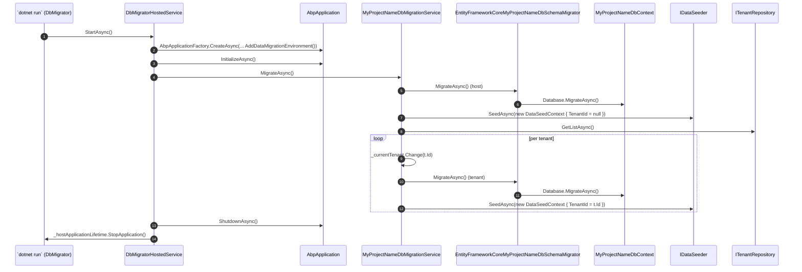

ABP keeps schema migration **out** of your web host. The standard solution template ships a dedicated `MyCompanyName.MyProjectName.DbMigrator` console project whose sole responsibility is to apply EF Core migrations and run the seeder pipeline — for the host database first, then for every tenant. This page explains the moving parts: the `DbMigratorHostedService`, the `MyProjectNameDbMigrationService` orchestrator, the `IMyProjectNameDbSchemaMigrator` provider-specific implementation, the EF migration assembly convention, and the `EfCoreDatabaseMigrationEventHandlerBase` that lets tenant database creation happen at runtime via distributed events. Everything quoted below comes from `templates/app/aspnet-core/src/MyCompanyName.MyProjectName.DbMigrator/` and `framework/src/Volo.Abp.EntityFrameworkCore/Volo/Abp/EntityFrameworkCore/Migrations/`.

## The `DbMigrator` project

```
templates/app/aspnet-core/src/MyCompanyName.MyProjectName.DbMigrator/
├── DbMigratorHostedService.cs
├── MyCompanyName.MyProjectName.DbMigrator.csproj
├── MyProjectNameDbMigratorModule.cs
├── Program.cs
└── appsettings.json
```

The project is a regular ASP.NET Core `IHostedService` console host. It boots once, runs the migration, and exits. The fundamental three files:

### `Program.cs`

```csharp templates/app/aspnet-core/src/MyCompanyName.MyProjectName.DbMigrator/Program.cs
class Program
{
    static async Task Main(string[] args)
    {
        Log.Logger = new LoggerConfiguration()
            .MinimumLevel.Information()
            .MinimumLevel.Override("Microsoft", LogEventLevel.Warning)
            .MinimumLevel.Override("Volo.Abp", LogEventLevel.Warning)
            // ...
            .WriteTo.Async(c => c.File("Logs/logs.txt"))
            .WriteTo.Async(c => c.Console())
            .CreateLogger();

        await CreateHostBuilder(args).RunConsoleAsync();
    }

    public static IHostBuilder CreateHostBuilder(string[] args) =>
        Host.CreateDefaultBuilder(args)
            .AddAppSettingsSecretsJson()
            .ConfigureLogging((context, logging) => logging.ClearProviders())
            .ConfigureServices((hostContext, services) =>
            {
                services.AddHostedService<DbMigratorHostedService>();
            });
}
```

Vanilla `Host.CreateDefaultBuilder` with a single hosted service. The Serilog wiring is the only non-default piece, and `RunConsoleAsync()` keeps the process alive until the hosted service signals completion.

### `MyProjectNameDbMigratorModule.cs`

The migrator module depends on the *EF Core* module of the application (not the web host) and the *Application Contracts* module so it has access to permission definitions while seeding:

```csharp templates/app/aspnet-core/src/MyCompanyName.MyProjectName.DbMigrator/MyProjectNameDbMigratorModule.cs
[DependsOn(
    typeof(AbpAutofacModule),
    typeof(AbpCachingStackExchangeRedisModule),
    typeof(MyProjectNameEntityFrameworkCoreModule),
    typeof(MyProjectNameApplicationContractsModule)
    )]
public class MyProjectNameDbMigratorModule : AbpModule
{
    public override void ConfigureServices(ServiceConfigurationContext context)
    {
        Configure<AbpDistributedCacheOptions>(options => { options.KeyPrefix = "MyProjectName:"; });
    }
}
```

Notice what is *not* in the `[DependsOn]`: no web host, no HTTP API, no auth server. The migrator runs offline.

### `DbMigratorHostedService.cs`

```csharp templates/app/aspnet-core/src/MyCompanyName.MyProjectName.DbMigrator/DbMigratorHostedService.cs
public async Task StartAsync(CancellationToken cancellationToken)
{
    using (var application = await AbpApplicationFactory.CreateAsync<MyProjectNameDbMigratorModule>(options =>
    {
       options.Services.ReplaceConfiguration(_configuration);
       options.UseAutofac();
       options.Services.AddLogging(c => c.AddSerilog());
       options.AddDataMigrationEnvironment();
    }))
    {
        await application.InitializeAsync();

        await application
            .ServiceProvider
            .GetRequiredService<MyProjectNameDbMigrationService>()
            .MigrateAsync();

        await application.ShutdownAsync();

        _hostApplicationLifetime.StopApplication();
    }
}
```

Two important calls:

- **`AbpApplicationFactory.CreateAsync<MyProjectNameDbMigratorModule>`** — the same factory that boots a web host; here it builds the module graph for the migrator module instead.
- **`options.AddDataMigrationEnvironment()`** — flags the application as "I am the migrator". The flag is stored as an `ObjectAccessor<AbpDataMigrationEnvironment>` so any service can inspect it:

```csharp framework/src/Volo.Abp.Data/Volo/Abp/Data/AbpDataMigrationEnvironmentExtensions.cs
public static void AddDataMigrationEnvironment(this AbpApplicationCreationOptions options, AbpDataMigrationEnvironment? environment = null)
{
    options.Services.AddDataMigrationEnvironment(environment ?? new AbpDataMigrationEnvironment());
}

public static AbpDataMigrationEnvironment? GetDataMigrationEnvironment(this IServiceProvider serviceProvider)
{
    return serviceProvider.GetService<IObjectAccessor<AbpDataMigrationEnvironment>>()?.Value;
}

public static bool IsDataMigrationEnvironment(this IServiceProvider serviceProvider)
{
    return serviceProvider.GetDataMigrationEnvironment() != null;
}
```

Modules that need to skip work when "we are migrating, not serving requests" (e.g. background workers that would crash on a half-migrated schema) call `serviceProvider.IsDataMigrationEnvironment()`.

## `MyProjectNameDbMigrationService`

The orchestrator lives in the **Domain** project so both the EF Core and MongoDB providers can plug a `IMyProjectNameDbSchemaMigrator` implementation in. Its `MigrateAsync` method walks the host database, then every tenant:

```csharp templates/app/aspnet-core/src/MyCompanyName.MyProjectName.Domain/Data/MyProjectNameDbMigrationService.cs
public async Task MigrateAsync()
{
    // ... EF Core only: AddInitialMigrationIfNotExist() — see below ...

    Logger.LogInformation("Started database migrations...");

    await MigrateDatabaseSchemaAsync();
    await SeedDataAsync();

    Logger.LogInformation($"Successfully completed host database migrations.");

    var tenants = await _tenantRepository.GetListAsync(includeDetails: true);

    var migratedDatabaseSchemas = new HashSet<string>();
    foreach (var tenant in tenants)
    {
        using (_currentTenant.Change(tenant.Id))
        {
            if (tenant.ConnectionStrings.Any())
            {
                var tenantConnectionStrings = tenant.ConnectionStrings
                    .Select(x => x.Value)
                    .ToList();

                if (!migratedDatabaseSchemas.IsSupersetOf(tenantConnectionStrings))
                {
                    await MigrateDatabaseSchemaAsync(tenant);

                    migratedDatabaseSchemas.AddIfNotContains(tenantConnectionStrings);
                }
            }

            await SeedDataAsync(tenant);
        }
    }

    Logger.LogInformation("Successfully completed all database migrations.");
}
```

Three observations:

1. **`_currentTenant.Change(tenant.Id)`** — flipping `ICurrentTenant.Id` makes `IConnectionStringResolver` return that tenant's per-tenant connection string (via [`MultiTenantConnectionStringResolver`](/multitenancy)), so every `DbContext` materialised inside the `using` block targets the tenant's database.
2. **`migratedDatabaseSchemas`** — multiple tenants can *share* one physical database. The hash-set tracks which connection strings have already been migrated so we do not run EF migrations N times.
3. **Seed happens after migrate** — schema first, data second, both for host and each tenant.

`MigrateDatabaseSchemaAsync` delegates to one or more `IMyProjectNameDbSchemaMigrator` implementations:

```csharp templates/app/aspnet-core/src/MyCompanyName.MyProjectName.Domain/Data/MyProjectNameDbMigrationService.cs
private async Task MigrateDatabaseSchemaAsync(Tenant? tenant = null)
{
    Logger.LogInformation(
        $"Migrating schema for {(tenant == null ? "host" : tenant.Name + " tenant")} database...");

    foreach (var migrator in _dbSchemaMigrators)
    {
        await migrator.MigrateAsync();
    }
}
```

## `IMyProjectNameDbSchemaMigrator`

The interface is intentionally trivial — it is the only place provider-specific code lives:

```csharp templates/app/aspnet-core/src/MyCompanyName.MyProjectName.Domain/Data/IMyProjectNameDbSchemaMigrator.cs
public interface IMyProjectNameDbSchemaMigrator
{
    Task MigrateAsync();
}
```

A `Null` implementation in the Domain project keeps the contract satisfiable even when no provider module is loaded (e.g. a unit-test only run):

```csharp templates/app/aspnet-core/src/MyCompanyName.MyProjectName.Domain/Data/NullMyProjectNameDbSchemaMigrator.cs
public class NullMyProjectNameDbSchemaMigrator : IMyProjectNameDbSchemaMigrator, ITransientDependency
{
    public Task MigrateAsync()
    {
        return Task.CompletedTask;
    }
}
```

The **real** EF Core implementation lives in the EntityFrameworkCore project:

```csharp templates/app/aspnet-core/src/MyCompanyName.MyProjectName.EntityFrameworkCore/EntityFrameworkCore/EntityFrameworkCoreMyProjectNameDbSchemaMigrator.cs
public class EntityFrameworkCoreMyProjectNameDbSchemaMigrator
    : IMyProjectNameDbSchemaMigrator, ITransientDependency
{
    private readonly IServiceProvider _serviceProvider;

    public EntityFrameworkCoreMyProjectNameDbSchemaMigrator(
        IServiceProvider serviceProvider)
    {
        _serviceProvider = serviceProvider;
    }

    public async Task MigrateAsync()
    {
        /* We intentionally resolve the MyProjectNameDbContext
         * from IServiceProvider (instead of directly injecting it)
         * to properly get the connection string of the current tenant in the
         * current scope.
         */

        await _serviceProvider
            .GetRequiredService<MyProjectNameDbContext>()
            .Database
            .MigrateAsync();
    }
}
```

The comment is the key insight: the migrator resolves the `DbContext` **per call**, not per constructor, so the active `ICurrentTenant.Id` (changed by `MyProjectNameDbMigrationService.MigrateAsync`) drives connection-string resolution. Calling `Database.MigrateAsync()` is the EF Core API that creates the database if necessary and applies every pending migration.

## EF migration assembly convention

By ABP convention, migrations live in the **EntityFrameworkCore** project, *not* the DbMigrator project. The `DbContext` is decorated to point EF Core at the right migration assembly:

```csharp MyProjectNameEntityFrameworkCoreModule.cs
public override void PreConfigureServices(ServiceConfigurationContext context)
{
    MyProjectNameEfCoreEntityExtensionMappings.Configure();
}

public override void ConfigureServices(ServiceConfigurationContext context)
{
    context.Services.AddAbpDbContext<MyProjectNameDbContext>(options =>
    {
        options.AddDefaultRepositories(includeAllEntities: true);
    });

    Configure<AbpDbContextOptions>(options =>
    {
        options.UseSqlServer();
    });
}
```

When you run `dotnet ef migrations add Init` from the EntityFrameworkCore project, EF Core's design-time tooling finds `MyProjectNameDbContextFactory : IDesignTimeDbContextFactory<MyProjectNameDbContext>` and builds an options object that points to the assembly containing the factory. ABP's `AbpDesignTimeDbContextBase` is provided as the suggested base for that factory.

The `DbMigrator` project itself contains no migrations — it only *runs* them, by depending on the EntityFrameworkCore project.

### Initial migration generation

`MyProjectNameDbMigrationService.AddInitialMigrationIfNotExist` (only the EF Core code-path) detects a fresh checkout where the `EntityFrameworkCore/Migrations` folder does not yet exist, and shells out to the ABP CLI to scaffold the initial migration *and* re-run the migrator. This is what makes the very first `DbMigrator` execution after `abp new` work end-to-end without manual intervention.

## Multi-tenant migrations: at-runtime via distributed events

The `DbMigrator` console handles **scheduled** migrations. ABP also supports **on-tenant-creation** migrations so a brand-new tenant gets its database provisioned without taking the application down. This is driven by `ApplyDatabaseMigrationsEto`:

```csharp framework/src/Volo.Abp.Data/Volo/Abp/Data/ApplyDatabaseMigrationsEto.cs
[Serializable]
[EventName("abp.data.apply_database_migrations")]
public class ApplyDatabaseMigrationsEto : EtoBase
{
    public Guid? TenantId { get; set; }

    public string DatabaseName { get; set; } = default!;
}
```

When a tenant is created with a per-tenant connection string, the tenant management module publishes both `TenantCreatedEto` and `ApplyDatabaseMigrationsEto` over the distributed event bus. `EfCoreDatabaseMigrationEventHandlerBase<TDbContext>` listens for all three of these events:

```csharp framework/src/Volo.Abp.EntityFrameworkCore/Volo/Abp/EntityFrameworkCore/Migrations/EfCoreDatabaseMigrationEventHandlerBase.cs
public abstract class EfCoreDatabaseMigrationEventHandlerBase<TDbContext> :
    IDistributedEventHandler<TenantCreatedEto>,
    IDistributedEventHandler<TenantConnectionStringUpdatedEto>,
    IDistributedEventHandler<ApplyDatabaseMigrationsEto>,
    ITransientDependency
    where TDbContext : DbContext, IEfCoreDbContext
{
    protected string DatabaseName { get; }

    protected const string TryCountPropertyName = "__TryCount";

    protected int MaxEventTryCount { get; set; } = 3;
}
```

Each module's `*EntityFrameworkCoreModule` typically registers a derived handler that overrides `MigrateDatabaseSchemaAsync` and `SeedAsync`, and matches its own `DatabaseName`. The `HandleEventAsync(ApplyDatabaseMigrationsEto)` branch:

```csharp framework/src/Volo.Abp.EntityFrameworkCore/Volo/Abp/EntityFrameworkCore/Migrations/EfCoreDatabaseMigrationEventHandlerBase.cs
public virtual async Task HandleEventAsync(ApplyDatabaseMigrationsEto eventData)
{
    if (eventData.DatabaseName != DatabaseName)
    {
        return;
    }

    var schemaMigrated = false;
    try
    {
        schemaMigrated = await MigrateDatabaseSchemaAsync(eventData.TenantId);
        await SeedAsync(eventData.TenantId);

        if (schemaMigrated)
        {
            await DistributedEventBus.PublishAsync(
                new AppliedDatabaseMigrationsEto
                {
                    DatabaseName = DatabaseName,
                    TenantId = eventData.TenantId
                }
            );
        }
    }
    catch (Exception ex)
    {
        await HandleErrorOnApplyDatabaseMigrationAsync(eventData, ex);
    }
```

Three patterns to absorb:

1. **`DatabaseName` filtering**. Each handler only acts on events that match its own database. The `Identity` module's handler ignores `BookStore` migrations, and vice versa.
2. **Followed-up by `AppliedDatabaseMigrationsEto`**. After a successful migration, a confirmation event lets sibling services react (cache invalidation, monitoring dashboards, …).
3. **Retry-aware**. The base class tracks `__TryCount` in the event properties; failures are re-enqueued up to `MaxEventTryCount` with a randomised wait between `MinValueToWaitOnFailure` and `MaxValueToWaitOnFailure` milliseconds.

The runtime base class `EfCoreRuntimeDatabaseMigratorBase` provides the actual `MigrateDatabaseSchemaAsync` implementation — calling `Database.MigrateAsync` inside a service scope bound to the right tenant.

## Entity history (audit log) selectors

A related concept worth flagging: when you enable entity-history auditing, you tell ABP which entity types to track. The `IEntityHistorySelectorList` (registered against `AbpAuditingOptions.EntityHistorySelectors`) accepts selectors by name and predicate. The framework ships `AddAllEntities()` as a one-liner for "track every `IEntity`":

```csharp framework/src/Volo.Abp.Ddd.Domain/Volo/Abp/Auditing/EntityHistorySelectorListExtensions.cs
public static class EntityHistorySelectorListExtensions
{
    public const string AllEntitiesSelectorName = "Abp.Entities.All";

    public static void AddAllEntities(this IEntityHistorySelectorList selectors)
    {
        if (selectors.Any(s => s.Name == AllEntitiesSelectorName))
        {
            return;
        }

        selectors.Add(new NamedTypeSelector(AllEntitiesSelectorName, t => typeof(IEntity).IsAssignableFrom(t)));
    }
}
```

Wire it in a module's `ConfigureServices`:

```csharp
Configure<AbpAuditingOptions>(options =>
{
    options.IsEnabledForGetRequests = true;
    options.EntityHistorySelectors.AddAllEntities();
});
```

The selector is consulted by `EntityHistoryHelper.CreateChangeList` inside `AbpDbContext.SaveChangesAsync` (see [EF Core](/data/entity-framework-core#savechangesasync)) — selected types produce `EntityChangeInfo` entries added to the active audit log.

## End-to-end flow



## Recommended workflow

<Tip>
For local development run `dotnet run` from the `DbMigrator` project after every model change. In CI, run it as the first step before integration tests. In production, run it as a Kubernetes `Job` (or AWS Lambda / Azure Container App job) gated on a release pipeline — *not* on web-host startup. The host should fail fast if the schema is out of date, not silently apply changes.
</Tip>

## Related pages

<CardGroup cols={2}>
  <Card title="Data Seeding" href="/data/data-seeding">`IDataSeeder` pipeline run after every migration.</Card>
  <Card title="Volo.Abp.Data" href="/data/abp-data">`AbpDataMigrationEnvironment` flag and connection-string resolution.</Card>
  <Card title="EF Core" href="/data/entity-framework-core">`AbpDbContext<>` and migration assembly conventions.</Card>
  <Card title="MongoDB" href="/data/mongodb">`IMongoDbContext` equivalent migration story.</Card>
  <Card title="Multi-Tenancy" href="/multitenancy">Per-tenant connection-string overrides and `ICurrentTenant.Change`.</Card>
  <Card title="Unit of Work" href="/uow">UoW behaviour during long-running migrations.</Card>
</CardGroup>
