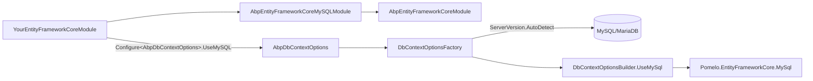

`Volo.Abp.EntityFrameworkCore.MySQL` is the MySQL/MariaDB provider module for ABP. It is built on top of the community-maintained **Pomelo.EntityFrameworkCore.MySql** driver (the package Microsoft itself recommends for MySQL) and exposes a `UseMySQL` extension that auto-detects the server version on connect. Because Pomelo also supports MariaDB, this module is the right choice for both. This page walks every file under `framework/src/Volo.Abp.EntityFrameworkCore.MySQL/` and explains how it integrates with the [EF Core core](/data/entity-framework-core) module.

## File inventory

| File | Role |
| --- | --- |
| `Volo/Abp/EntityFrameworkCore/MySQL/AbpEntityFrameworkCoreMySQLModule.cs` | Module class |
| `Volo/Abp/EntityFrameworkCore/AbpDbContextOptionsMySQLExtensions.cs` | `UseMySQL()` on `AbpDbContextOptions` |
| `Volo/Abp/EntityFrameworkCore/AbpDbContextConfigurationContextMySQLExtensions.cs` | `UseMySQL()` on `AbpDbContextConfigurationContext` |
| `Volo/Abp/EntityFrameworkCore/ConnectionStrings/MySqlConnectionStringChecker.cs` | `IConnectionStringChecker` probe |
| `Microsoft/EntityFrameworkCore/AbpMySqlModelBuilderExtensions.cs` | MySQL-specific model conventions |

## The module

```csharp framework/src/Volo.Abp.EntityFrameworkCore.MySQL/Volo/Abp/EntityFrameworkCore/MySQL/AbpEntityFrameworkCoreMySQLModule.cs
[DependsOn(
    typeof(AbpEntityFrameworkCoreModule)
    )]
public class AbpEntityFrameworkCoreMySQLModule : AbpModule
{
    public override void ConfigureServices(ServiceConfigurationContext context)
    {
        Configure<AbpSequentialGuidGeneratorOptions>(options =>
        {
            if (options.DefaultSequentialGuidType == null)
            {
                options.DefaultSequentialGuidType = SequentialGuidType.SequentialAsString;
            }
        });
    }
}
```

MySQL stores GUIDs as `CHAR(36)` strings by default, so ABP picks `SequentialAsString`. The generated values stay sortable when serialised, which keeps inserts append-only in InnoDB clustered indexes.

## `UseMySQL` — host-side configurer

```csharp framework/src/Volo.Abp.EntityFrameworkCore.MySQL/Volo/Abp/EntityFrameworkCore/AbpDbContextOptionsMySQLExtensions.cs
public static class AbpDbContextOptionsMySQLExtensions
{
    public static void UseMySQL(
            [NotNull] this AbpDbContextOptions options,
            Action<MySqlDbContextOptionsBuilder>? mySQLOptionsAction = null)
    {
        options.Configure(context =>
        {
            context.UseMySQL(mySQLOptionsAction);
        });
    }

    public static void UseMySQL<TDbContext>(
        [NotNull] this AbpDbContextOptions options,
        Action<MySqlDbContextOptionsBuilder>? mySQLOptionsAction = null)
        where TDbContext : AbpDbContext<TDbContext>
    {
        options.Configure<TDbContext>(context =>
        {
            context.UseMySQL(mySQLOptionsAction);
        });
    }
}
```

Same two-overload shape as every provider module: default slot + per-context slot. The callback type is `Action<MySqlDbContextOptionsBuilder>`, where `MySqlDbContextOptionsBuilder` comes from Pomelo's namespace `Microsoft.EntityFrameworkCore.Infrastructure`.

## `UseMySQL` — per-request configurer

The real call into Pomelo happens here:

```csharp framework/src/Volo.Abp.EntityFrameworkCore.MySQL/Volo/Abp/EntityFrameworkCore/AbpDbContextConfigurationContextMySQLExtensions.cs
public static class AbpDbContextConfigurationContextMySQLExtensions
{
    public static DbContextOptionsBuilder UseMySQL(
       [NotNull] this AbpDbContextConfigurationContext context,
       Action<MySqlDbContextOptionsBuilder>? mySQLOptionsAction = null)
    {
        if (context.ExistingConnection != null)
        {
            return context.DbContextOptions.UseMySql(context.ExistingConnection,
                ServerVersion.AutoDetect(context.ConnectionString), optionsBuilder =>
                {
                    optionsBuilder.UseQuerySplittingBehavior(QuerySplittingBehavior.SplitQuery);
                    mySQLOptionsAction?.Invoke(optionsBuilder);
                });
        }
        else
        {
            return context.DbContextOptions.UseMySql(context.ConnectionString,
                ServerVersion.AutoDetect(context.ConnectionString), optionsBuilder =>
                {
                    optionsBuilder.UseQuerySplittingBehavior(QuerySplittingBehavior.SplitQuery);
                    mySQLOptionsAction?.Invoke(optionsBuilder);
                });
        }
    }
}
```

Three behaviours worth flagging:

1. **`ServerVersion.AutoDetect(connectionString)`** opens a short-lived connection to ask the server for its version string. The result drives Pomelo's SQL generation (MariaDB 10.x vs MySQL 8.x produce different DDL). On startup this is an extra round-trip — for production hosts you typically want to pin the version to skip the probe:

   ```csharp
   options.UseMySQL(mysql =>
   {
       mysql.ServerVersion = ServerVersion.Parse("8.0.36-mysql");
   });
   ```

2. **`QuerySplittingBehavior.SplitQuery`** — same default as SQL Server (multiple round-trips, no cross-join explosion).

3. **Existing-connection reuse** — when the active UoW already owns a connection on this connection string, Pomelo reuses it so a transaction can span multiple `DbContext` types.

## Connection-string convention

A solution generated by the ABP CLI with the `--database-provider=mysql` switch ships an `appsettings.json` like:

```json appsettings.json
{
  "ConnectionStrings": {
    "Default": "Server=localhost;Port=3306;Database=BookStore;User=root;Password=myPassword;"
  }
}
```

The Pomelo provider name surfaces in `AbpDbContext<>.GetDatabaseProviderOrNull` as `"Pomelo.EntityFrameworkCore.MySql"`, which maps to `EfCoreDatabaseProvider.MySql`. Any model builder using `if (provider == EfCoreDatabaseProvider.MySql)` blocks (e.g. for collation tweaks) becomes active.

## Connection-string check

`MySqlConnectionStringChecker` implements `IConnectionStringChecker` for the tenant management *Test connection* button. Same pattern as the SQL Server checker: open a `MySqlConnection`, ask whether the database exists, and return `AbpConnectionStringCheckResult`.

## Migrations history table

For multi-module databases, override the `MigrationsHistoryTable` so each EF migration assembly records its history independently:

```csharp
options.UseMySQL(mysql =>
{
    mysql.MigrationsHistoryTable("__BookStoreMigrationsHistory");
});
```

## Multi-tenancy

Per-tenant connection-string overrides work the same way as on every other relational provider. `MultiTenantConnectionStringResolver` returns the tenant-specific string, the configurer's `ServerVersion.AutoDetect(context.ConnectionString)` call probes that server, and Pomelo emits the matching SQL dialect. If you have tenants on MySQL 5.7, MySQL 8.x, and MariaDB simultaneously, the auto-detect is what keeps each tenant's DDL valid — at the cost of one probe per tenant per process startup. Pinning the server version makes sense only when *every* tenant runs the same flavour.

## Composition diagram



## Charset and collation

Pomelo defaults to `utf8mb4` for new tables — the right pick for emoji and the full BMP. For case-insensitive comparisons set `utf8mb4_general_ci` (the MySQL default) or `utf8mb4_0900_ai_ci` (MySQL 8.x); for case-sensitive comparisons use `utf8mb4_bin`. Set at the database level when you create the schema, and EF Core migrations on new tables inherit the database default — no per-table override required.

## Recommended tunings

<Tip>
For hot-path production hosts pin the server version (avoids one network round-trip per process start), keep `QuerySplittingBehavior.SplitQuery` (the ABP default), and configure a retry policy:

```csharp
options.UseMySQL(mysql =>
{
    mysql.ServerVersion = ServerVersion.Parse("10.11.6-mariadb");
    mysql.EnableRetryOnFailure(maxRetryCount: 3);
});
```
</Tip>

## `SequentialAsString` and MySQL's CHAR(36) GUIDs

By default Pomelo maps `Guid` to `CHAR(36)` (the hyphenated text form). MySQL's collation sorts that text byte-by-byte, so a clustered-index-friendly GUID is one whose **leading** bytes increase monotonically. `SequentialGuidType.SequentialAsString` does exactly this: the first 6 bytes carry the timestamp and produce ascending text values. The `AbpEntityFrameworkCoreMySQLModule` flips this on automatically:

```csharp framework/src/Volo.Abp.EntityFrameworkCore.MySQL/Volo/Abp/EntityFrameworkCore/MySQL/AbpEntityFrameworkCoreMySQLModule.cs
Configure<AbpSequentialGuidGeneratorOptions>(options =>
{
    if (options.DefaultSequentialGuidType == null)
    {
        options.DefaultSequentialGuidType = SequentialGuidType.SequentialAsString;
    }
});
```

If you remap `Guid` to `BINARY(16)` (the more compact storage), you should override the default to `SequentialAsBinary` so the monotonic ordering still matches the index sort.

## Provider detection inside `AbpDbContext`

After EF Core constructs the model, `AbpDbContext<>.GetDatabaseProviderOrNull` returns `EfCoreDatabaseProvider.MySql` for the Pomelo provider name:

```csharp framework/src/Volo.Abp.EntityFrameworkCore/Volo/Abp/EntityFrameworkCore/AbpDbContext.cs
case "Pomelo.EntityFrameworkCore.MySql":
    return EfCoreDatabaseProvider.MySql;
```

Model-builder helpers that switch on `EfCoreDatabaseProvider.MySql` can register MySQL-specific column conventions — for example marking `LONGTEXT` for `IHasExtraProperties.ExtraProperties` JSON, or adjusting case sensitivity by setting a collation on individual columns.

## MariaDB support

Pomelo treats MariaDB as a first-class server version — `ServerVersion.AutoDetect` reports `MariaDb` for those connections and Pomelo emits MariaDB-compatible SQL. The ABP module does not differentiate: pointing your `Default` connection string at MariaDB just works. The only practical difference is that MariaDB does not currently support JSON path expressions identical to MySQL 8.x, so EF Core LINQ that translates to `JSON_VALUE` may behave differently on the two servers.

## Choosing between MySQL and MariaDB

`Pomelo.EntityFrameworkCore.MySql` recognises both products and emits compatible DDL based on the detected `ServerVersion`. For new ABP projects either is fine; pick MariaDB only if you have an existing operational story for it. Mixing MySQL and MariaDB tenants in the same host works but means each tenant's startup pays an `AutoDetect` probe — pin the version per-tenant via a custom configurer if you want to skip it.

## Existing-connection reuse in detail

The configurer ranges over two branches; the *first* triggers whenever `context.ExistingConnection` is non-null. That happens when `UnitOfWorkDbContextProvider<TDbContext>` is materialising a *second* `DbContext` under the same UoW and connection string — e.g. a `BookStoreDbContext` and an `AuditingDbContext` both targeting the same MySQL database. Pomelo's `UseMySql(DbConnection, ServerVersion, …)` overload enlists onto the open connection without dialling a new TCP session:

```csharp framework/src/Volo.Abp.EntityFrameworkCore.MySQL/Volo/Abp/EntityFrameworkCore/AbpDbContextConfigurationContextMySQLExtensions.cs
if (context.ExistingConnection != null)
{
    return context.DbContextOptions.UseMySql(context.ExistingConnection,
        ServerVersion.AutoDetect(context.ConnectionString), optionsBuilder =>
        // ...
```

The `ServerVersion.AutoDetect(context.ConnectionString)` call still receives the original connection-string text — pinning the version stops this from happening twice per process startup.

## Common pitfalls

| Symptom | Cause | Fix |
| --- | --- | --- |
| `LONGTEXT` columns truncate | MySQL `max_allowed_packet` too low on the server | Raise `max_allowed_packet` or chunk the writes |
| `IUtcDateTime` columns drift by 1 hour | MySQL session timezone differs from `IClock` | Configure timezone in connection string |
| Unexpected case-insensitive `WHERE` matches | MySQL collation defaults to case-insensitive `utf8mb4_general_ci`/`utf8mb4_0900_ai_ci` | Explicitly set `utf8mb4_bin` (or `_cs`) on the database/column when comparisons must be case-sensitive |
| `ServerVersion.AutoDetect` extra round-trip | Default behaviour | Pin via `mysql.ServerVersion = ServerVersion.Parse("…")` |

## Related pages

<CardGroup cols={2}>
  <Card title="EF Core (Core)" href="/data/entity-framework-core">Configurer pipeline, `UnitOfWorkDbContextProvider`.</Card>
  <Card title="SQL Server" href="/data/ef-core-sqlserver">Microsoft EF Core SQL Server provider.</Card>
  <Card title="PostgreSQL" href="/data/ef-core-postgresql">Npgsql-based variant.</Card>
  <Card title="Volo.Abp.Data" href="/data/abp-data">Connection-string resolution and seeders.</Card>
  <Card title="Multi-Tenancy" href="/multitenancy">Per-tenant connection strings.</Card>
</CardGroup>
