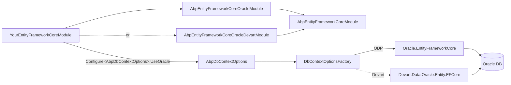

ABP ships **two** Oracle provider modules side-by-side: `Volo.Abp.EntityFrameworkCore.Oracle`, built on top of the official Oracle-published `Oracle.EntityFrameworkCore` (ODP.NET Core), and `Volo.Abp.EntityFrameworkCore.Oracle.Devart`, built on Devart's commercial `dotConnect for Oracle` driver (`Devart.Data.Oracle.Entity.EFCore`). Both packages expose a `UseOracle` extension and pick the same `SequentialAsBinary` GUID generator, but the underlying ADO.NET driver, licensing, and the Devart-only `useExistingConnectionIfAvailable` flag differ. This page reads every file in both packages and explains when to pick which.

## Side-by-side file inventory

| `Volo.Abp.EntityFrameworkCore.Oracle` (ODP.NET) | `Volo.Abp.EntityFrameworkCore.Oracle.Devart` (Devart) |
| --- | --- |
| `Volo/Abp/EntityFrameworkCore/Oracle/AbpEntityFrameworkCoreOracleModule.cs` | `Volo/Abp/EntityFrameworkCore/Oracle/Devart/AbpEntityFrameworkCoreOracleDevartModule.cs` |
| `Volo/Abp/EntityFrameworkCore/AbpDbContextOptionsOracleExtensions.cs` | `Volo/Abp/EntityFrameworkCore/AbpDbContextOptionsOracleDevartExtensions.cs` |
| `Volo/Abp/EntityFrameworkCore/AbpDbContextConfigurationContextOracleExtensions.cs` | `Volo/Abp/EntityFrameworkCore/AbpDbContextConfigurationContextOracleDevartExtensions.cs` |
| `Volo/Abp/EntityFrameworkCore/ConnectionStrings/OracleConnectionStringChecker.cs` | `Volo/Abp/EntityFrameworkCore/ConnectionStrings/OracleDevartConnectionStringChecker.cs` |
| — | `Microsoft/EntityFrameworkCore/AbpOracleModelBuilderExtensions.cs` |

The Devart variant additionally exposes `AbpOracleModelBuilderExtensions` — a set of Devart-specific model-builder helpers (sequences, identity columns) that ODP.NET handles through standard EF Core APIs.

## The modules

Both modules pick `SequentialAsBinary` because Oracle's `RAW(16)` storage is sorted bytewise:

```csharp framework/src/Volo.Abp.EntityFrameworkCore.Oracle/Volo/Abp/EntityFrameworkCore/Oracle/AbpEntityFrameworkCoreOracleModule.cs
[DependsOn(typeof(AbpEntityFrameworkCoreModule))]
public class AbpEntityFrameworkCoreOracleModule : AbpModule
{
    public override void ConfigureServices(ServiceConfigurationContext context)
    {
        Configure<AbpSequentialGuidGeneratorOptions>(options =>
        {
            if (options.DefaultSequentialGuidType == null)
            {
                options.DefaultSequentialGuidType = SequentialGuidType.SequentialAsBinary;
            }
        });
    }
}
```

```csharp framework/src/Volo.Abp.EntityFrameworkCore.Oracle.Devart/Volo/Abp/EntityFrameworkCore/Oracle/Devart/AbpEntityFrameworkCoreOracleDevartModule.cs
[DependsOn(
    typeof(AbpEntityFrameworkCoreModule)
    )]
public class AbpEntityFrameworkCoreOracleDevartModule : AbpModule
{
    public override void ConfigureServices(ServiceConfigurationContext context)
    {
        Configure<AbpSequentialGuidGeneratorOptions>(options =>
        {
            if (options.DefaultSequentialGuidType == null)
            {
                options.DefaultSequentialGuidType = SequentialGuidType.SequentialAsBinary;
            }
        });
    }
}
```

Pick *one* (never both) when adding the dependency to your `*EntityFrameworkCoreModule`.

## `UseOracle` — ODP.NET host-side configurer

```csharp framework/src/Volo.Abp.EntityFrameworkCore.Oracle/Volo/Abp/EntityFrameworkCore/AbpDbContextOptionsOracleExtensions.cs
public static class AbpDbContextOptionsOracleExtensions
{
    public static void UseOracle(
            [NotNull] this AbpDbContextOptions options,
            Action<OracleDbContextOptionsBuilder>? oracleOptionsAction = null)
    {
        options.Configure(context =>
        {
            context.UseOracle(oracleOptionsAction);
        });
    }

    public static void UseOracle<TDbContext>(
        [NotNull] this AbpDbContextOptions options,
        Action<OracleDbContextOptionsBuilder>? oracleOptionsAction = null)
        where TDbContext : AbpDbContext<TDbContext>
    {
        options.Configure<TDbContext>(context =>
        {
            context.UseOracle(oracleOptionsAction);
        });
    }
}
```

Identical shape to the SQL Server / PostgreSQL extensions — two overloads, two configurer slots.

## `UseOracle` — Devart host-side configurer

```csharp framework/src/Volo.Abp.EntityFrameworkCore.Oracle.Devart/Volo/Abp/EntityFrameworkCore/AbpDbContextOptionsOracleDevartExtensions.cs
public static class AbpDbContextOptionsOracleDevartExtensions
{
    public static void UseOracle(
            [NotNull] this AbpDbContextOptions options,
            Action<OracleDbContextOptionsBuilder>? oracleOptionsAction = null,
            bool useExistingConnectionIfAvailable = false)
    {
        options.Configure(context =>
        {
            context.UseOracle(oracleOptionsAction, useExistingConnectionIfAvailable);
        });
    }

    public static void UseOracle<TDbContext>(
        [NotNull] this AbpDbContextOptions options,
        Action<OracleDbContextOptionsBuilder>? oracleOptionsAction = null,
        bool useExistingConnectionIfAvailable = false)
        where TDbContext : AbpDbContext<TDbContext>
    {
        options.Configure<TDbContext>(context =>
        {
            context.UseOracle(oracleOptionsAction, useExistingConnectionIfAvailable);
        });
    }
}
```

The Devart overloads carry an extra `useExistingConnectionIfAvailable` flag (default: `false`). The ODP.NET variant *always* tries to reuse the existing connection (relying on `context.ExistingConnection`); Devart's variant gives you the choice because some early `Devart.Data.Oracle` releases have edge cases around enlisting onto a pre-opened connection.

## Per-request configurers

The ODP.NET configurer follows the standard ABP pattern:

```csharp framework/src/Volo.Abp.EntityFrameworkCore.Oracle/Volo/Abp/EntityFrameworkCore/AbpDbContextConfigurationContextOracleExtensions.cs
public static DbContextOptionsBuilder UseOracle(
   [NotNull] this AbpDbContextConfigurationContext context,
   Action<OracleDbContextOptionsBuilder>? oracleOptionsAction = null)
{
    if (context.ExistingConnection != null)
    {
        return context.DbContextOptions.UseOracle(context.ExistingConnection, optionsBuilder =>
        {
            optionsBuilder.UseQuerySplittingBehavior(QuerySplittingBehavior.SplitQuery);
            oracleOptionsAction?.Invoke(optionsBuilder);
        });
    }
    else
    {
        return context.DbContextOptions.UseOracle(context.ConnectionString, optionsBuilder =>
        {
            optionsBuilder.UseQuerySplittingBehavior(QuerySplittingBehavior.SplitQuery);
            oracleOptionsAction?.Invoke(optionsBuilder);
        });
    }
}
```

The Devart configurer gates the existing-connection branch on the flag:

```csharp framework/src/Volo.Abp.EntityFrameworkCore.Oracle.Devart/Volo/Abp/EntityFrameworkCore/AbpDbContextConfigurationContextOracleDevartExtensions.cs
public static DbContextOptionsBuilder UseOracle(
   [NotNull] this AbpDbContextConfigurationContext context,
   Action<OracleDbContextOptionsBuilder>? oracleOptionsAction = null,
   bool useExistingConnectionIfAvailable = false)
{
    if (useExistingConnectionIfAvailable && context.ExistingConnection != null)
    {
        return context.DbContextOptions.UseOracle(context.ExistingConnection, optionsBuilder =>
        {
            optionsBuilder.UseQuerySplittingBehavior(QuerySplittingBehavior.SplitQuery);
            oracleOptionsAction?.Invoke(optionsBuilder);
        });
    }
    else
    {
        return context.DbContextOptions.UseOracle(context.ConnectionString, optionsBuilder =>
        {
            optionsBuilder.UseQuerySplittingBehavior(QuerySplittingBehavior.SplitQuery);
            oracleOptionsAction?.Invoke(optionsBuilder);
        });
    }
}
```

Both default to `QuerySplittingBehavior.SplitQuery`, matching every other ABP-supported provider.

## Provider detection

`AbpDbContext<TDbContext>.GetDatabaseProviderOrNull` accepts **either** Oracle provider name and returns `EfCoreDatabaseProvider.Oracle`:

```csharp framework/src/Volo.Abp.EntityFrameworkCore/Volo/Abp/EntityFrameworkCore/AbpDbContext.cs
case "Oracle.EntityFrameworkCore":
case "Devart.Data.Oracle.Entity.EFCore":
    return EfCoreDatabaseProvider.Oracle;
```

So model-builder code that branches on `EfCoreDatabaseProvider.Oracle` works regardless of which provider the host picked.

## ODP.NET vs Devart — when to pick which

<CardGroup cols={2}>
  <Card title="Oracle.EntityFrameworkCore (ODP.NET)" icon="oracle">
    Free, published by Oracle itself, the safest choice for new solutions. Recommended when you need an officially supported driver, are running on Oracle Cloud, or do not need bleeding-edge EF Core features.
  </Card>
  <Card title="Devart dotConnect for Oracle" icon="bolt">
    Commercial driver. Pick this when you need its specific feature set (e.g. advanced LINQ translations, broader EF Core version coverage, performance tuning knobs) or you already have an enterprise Devart licence.
  </Card>
</CardGroup>

| Concern | ODP.NET (`Oracle.EntityFrameworkCore`) | Devart (`Devart.Data.Oracle.Entity.EFCore`) |
| --- | --- | --- |
| Vendor | Oracle Corp | Devart |
| Licence | Free | Commercial |
| ABP module | `AbpEntityFrameworkCoreOracleModule` | `AbpEntityFrameworkCoreOracleDevartModule` |
| `UseOracle` parameters | `Action<OracleDbContextOptionsBuilder>?` | + `bool useExistingConnectionIfAvailable` |
| Existing-connection reuse | Automatic | Opt-in via the bool |
| `AbpOracleModelBuilderExtensions` | Not provided | Provided |
| Provider name string | `"Oracle.EntityFrameworkCore"` | `"Devart.Data.Oracle.Entity.EFCore"` |
| Default `SequentialGuidType` | `SequentialAsBinary` | `SequentialAsBinary` |

## Connection-string check

Both packages ship an `IConnectionStringChecker` (`OracleConnectionStringChecker` and `OracleDevartConnectionStringChecker`) that opens an `OracleConnection` via the corresponding driver and reports back through `AbpConnectionStringCheckResult`.

## Composition diagram



## Why two modules

Both packages target the same `EfCoreDatabaseProvider.Oracle` enum value and integrate with the same `AbpDbContext<>` pipeline, but they are *not* interchangeable in a single host. The reasons ABP ships both:

- **ODP.NET** is the officially-supported Oracle driver and the one Oracle's own EF Core test matrix targets. It is the safest pick for new projects.
- **Devart** has historically tracked new EF Core versions faster and exposes some performance knobs (bulk inserts, LINQ translations) that ODP.NET does not. Some enterprises already own a Devart licence and prefer not to add a second driver to the build.

Pick exactly one for a given host: add either `AbpEntityFrameworkCoreOracleModule` *or* `AbpEntityFrameworkCoreOracleDevartModule` to your `[DependsOn]` chain. Both ship the same extension method name (`UseOracle`) on `AbpDbContextOptions`, so the host-side code reads the same regardless of which provider you keep.

## Sequential GUIDs and `RAW(16)`

Oracle has no native UUID type — the framework stores `Guid` as `RAW(16)` (binary 16 bytes). Oracle's binary sort is byte-major, so the right monotonic strategy is `SequentialAsBinary`: bytes 0-5 carry the timestamp and stay monotonic across calls. Both modules pin this default automatically with the `if (options.DefaultSequentialGuidType == null)` guard so a host's explicit choice still wins.

## Connection strings

Oracle connection strings come in two forms — Easy Connect and TNS — and both work transparently with `IConnectionStringResolver`. Examples for `appsettings.json`:

```json appsettings.json
{
  "ConnectionStrings": {
    "Default": "User Id=BOOKSTORE;Password=secret;Data Source=localhost:1521/ORCLCDB"
  }
}
```

Or, with TNS aliases:

```json
{
  "ConnectionStrings": {
    "Default": "User Id=BOOKSTORE;Password=secret;Data Source=BookStore_TNS"
  }
}
```

The Devart-flavoured connection string accepts `Direct=True` so you can avoid distributing TNSnames.ora; ODP.NET behaves the same way with `SERVER=//host:port/service`.

## Migrations history table

Oracle schemas have stricter naming conventions (uppercase, 30-char limit in older versions). Override the migrations history table to a short uppercase name:

```csharp
options.UseOracle(oracle =>
{
    oracle.MigrationsHistoryTable("EFMIGRATIONSHISTORY");
});
```

Both providers expose this via the `OracleDbContextOptionsBuilder` they receive in the callback.

## Recommended tunings

<Tip>
For both providers enable retry-on-failure and set a sane command timeout. Oracle's default network timeouts can otherwise leave a connection hanging for minutes when the database is unreachable.
</Tip>

```csharp
Configure<AbpDbContextOptions>(options =>
{
    options.UseOracle(oracle =>
    {
        oracle.CommandTimeout(60);
    });
});
```

## Multi-tenancy

Tenant-aware connection strings work the same way as on every other provider — `MultiTenantConnectionStringResolver` resolves per-tenant overrides from `ICurrentTenant.ConnectionStrings`, and `UnitOfWorkDbContextProvider` keys the UoW slot by `{type}_{connectionString}`. There is nothing Oracle-specific to configure beyond storing one Oracle connection string per tenant (e.g. `User Id=TENANT_X;…`).

## Related pages

<CardGroup cols={2}>
  <Card title="EF Core (Core)" href="/data/entity-framework-core">`AbpDbContext<>` and the configurer pipeline.</Card>
  <Card title="SQL Server" href="/data/ef-core-sqlserver">Microsoft EF Core SQL Server provider.</Card>
  <Card title="PostgreSQL" href="/data/ef-core-postgresql">Npgsql provider.</Card>
  <Card title="Volo.Abp.Data" href="/data/abp-data">Connection-string primitives.</Card>
  <Card title="Database Migration" href="/data/database-migration">`DbMigrator` host conventions.</Card>
</CardGroup>
