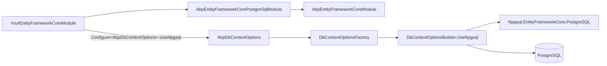

`Volo.Abp.EntityFrameworkCore.PostgreSql` is the PostgreSQL provider module for ABP, built on top of the official **Npgsql.EntityFrameworkCore.PostgreSQL** driver. The package exposes a `UseNpgsql` extension (and the older `UsePostgreSql` alias, kept around for backwards compatibility) that plugs into `AbpDbContextOptions` the same way every other provider does. This page walks every file under `framework/src/Volo.Abp.EntityFrameworkCore.PostgreSql/` and explains how it composes with the [EF Core core](/data/entity-framework-core) module.

## File inventory

| File | Role |
| --- | --- |
| `Volo/Abp/EntityFrameworkCore/PostgreSql/AbpEntityFrameworkCorePostgreSqlModule.cs` | Module class |
| `Volo/Abp/EntityFrameworkCore/AbpDbContextOptionsPostgreSqlExtensions.cs` | `UseNpgsql()` (and obsolete `UsePostgreSql()`) on `AbpDbContextOptions` |
| `Volo/Abp/EntityFrameworkCore/AbpDbContextConfigurationContextPostgreSqlExtensions.cs` | `UseNpgsql()` on `AbpDbContextConfigurationContext` |
| `Volo/Abp/EntityFrameworkCore/ConnectionStrings/NpgsqlConnectionStringChecker.cs` | `IConnectionStringChecker` probe |
| `Microsoft/EntityFrameworkCore/AbpPostgreSqlModelBuilderExtensions.cs` | PostgreSQL-specific model conventions |

## The module

```csharp framework/src/Volo.Abp.EntityFrameworkCore.PostgreSql/Volo/Abp/EntityFrameworkCore/PostgreSql/AbpEntityFrameworkCorePostgreSqlModule.cs
[DependsOn(
    typeof(AbpEntityFrameworkCoreModule)
    )]
public class AbpEntityFrameworkCorePostgreSqlModule : AbpModule
{
    public override void ConfigureServices(ServiceConfigurationContext context)
    {
        Configure<AbpSequentialGuidGeneratorOptions>(options =>
        {
            if (options.DefaultSequentialGuidType == null)
            {
                options.DefaultSequentialGuidType = SequentialGuidType.SequentialAsString;
            }
        });
    }
}
```

PostgreSQL stores `uuid` in lexicographic byte order, so ABP picks `SequentialAsString` — the same choice as MySQL — so that sequentially-generated GUIDs remain sortable on the wire.

## `UseNpgsql` — host-side configurer

The package exposes both the new and obsolete names. The `[Obsolete]` markers steer new code towards `UseNpgsql`:

```csharp framework/src/Volo.Abp.EntityFrameworkCore.PostgreSql/Volo/Abp/EntityFrameworkCore/AbpDbContextOptionsPostgreSqlExtensions.cs
public static class AbpDbContextOptionsPostgreSqlExtensions
{
    [Obsolete("Use 'UseNpgsql(...)' method instead. This will be removed in future versions.")]
    public static void UsePostgreSql(
        [NotNull] this AbpDbContextOptions options,
        Action<NpgsqlDbContextOptionsBuilder>? postgreSqlOptionsAction = null)
    {
        options.Configure(context =>
        {
            context.UseNpgsql(postgreSqlOptionsAction);
        });
    }

    public static void UseNpgsql(
        [NotNull] this AbpDbContextOptions options,
        Action<NpgsqlDbContextOptionsBuilder>? postgreSqlOptionsAction = null)
    {
        options.Configure(context =>
        {
            context.UseNpgsql(postgreSqlOptionsAction);
        });
    }

    public static void UseNpgsql<TDbContext>(
        [NotNull] this AbpDbContextOptions options,
        Action<NpgsqlDbContextOptionsBuilder>? postgreSqlOptionsAction = null)
        where TDbContext : AbpDbContext<TDbContext>
    {
        options.Configure<TDbContext>(context =>
        {
            context.UseNpgsql(postgreSqlOptionsAction);
        });
    }
}
```

Both methods funnel into the same configurer stored in [`AbpDbContextOptions`](/data/entity-framework-core#abpdbcontextoptions). Internally `UsePostgreSql` simply calls `UseNpgsql`; there is no behavioural difference except the name.

Typical use:

```csharp BookStoreEntityFrameworkCoreModule.cs
Configure<AbpDbContextOptions>(options =>
{
    options.UseNpgsql(npgsql =>
    {
        npgsql.EnableRetryOnFailure(maxRetryCount: 5);
    });
});
```

## `UseNpgsql` — per-request configurer

```csharp framework/src/Volo.Abp.EntityFrameworkCore.PostgreSql/Volo/Abp/EntityFrameworkCore/AbpDbContextConfigurationContextPostgreSqlExtensions.cs
public static DbContextOptionsBuilder UseNpgsql(
    [NotNull] this AbpDbContextConfigurationContext context,
    Action<NpgsqlDbContextOptionsBuilder>? postgreSqlOptionsAction = null)
{
    if (context.ExistingConnection != null)
    {
        return context.DbContextOptions.UseNpgsql(context.ExistingConnection, optionsBuilder =>
        {
            optionsBuilder.UseQuerySplittingBehavior(QuerySplittingBehavior.SplitQuery);
            postgreSqlOptionsAction?.Invoke(optionsBuilder);
        });
    }
    else
    {
        return context.DbContextOptions.UseNpgsql(context.ConnectionString, optionsBuilder =>
        {
            optionsBuilder.UseQuerySplittingBehavior(QuerySplittingBehavior.SplitQuery);
            postgreSqlOptionsAction?.Invoke(optionsBuilder);
        });
    }
}
```

Two key behaviours, identical in shape to the SQL Server configurer:

1. **Existing-connection reuse** — when the active UoW has already opened a connection on the same connection string (because another `DbContext` opened it first), Npgsql re-enlists onto that physical connection, so the SQL transaction spans both contexts.
2. **`QuerySplittingBehavior.SplitQuery`** — defaults to multiple round-trips so multi-`Include` aggregates do not explode into cross joins.

## Provider detection inside `AbpDbContext`

The provider name `"Npgsql.EntityFrameworkCore.PostgreSQL"` is recognised by `AbpDbContext<TDbContext>.GetDatabaseProviderOrNull`, which maps it to `EfCoreDatabaseProvider.PostgreSql`:

```csharp framework/src/Volo.Abp.EntityFrameworkCore/Volo/Abp/EntityFrameworkCore/AbpDbContext.cs
case "Npgsql.EntityFrameworkCore.PostgreSQL":
    return EfCoreDatabaseProvider.PostgreSql;
```

Anywhere a `ModelBuilder` extension checks the active provider it will see `PostgreSql` and can apply provider-specific tweaks (e.g. citext, GIN indexes, snake_case naming conventions).

## Extension types and `enum`

PostgreSQL supports user-defined `enum` types and a rich ecosystem of extensions (`citext`, `uuid-ossp`, `pgcrypto`, ...). Npgsql exposes these via `MapEnum<T>` and similar registrations on `NpgsqlDataSourceBuilder`. For an ABP solution wanting native PostgreSQL enums (rather than the EF Core default of `int` columns), call `NpgsqlConnection.GlobalTypeMapper.MapEnum<MyEnum>()` from `PreConfigure` so the mapping is registered before the first connection opens.

## Connection-string check

`NpgsqlConnectionStringChecker` performs the *Test connection* probe surfaced in the tenant management UI by opening a `NpgsqlConnection`, asking the system catalog (`pg_database`) whether the requested database exists, and returning `AbpConnectionStringCheckResult { Connected, DatabaseExists }`.

## Connection-string convention

Solutions generated with the PostgreSQL provider ship `appsettings.json` like:

```json appsettings.json
{
  "ConnectionStrings": {
    "Default": "Host=localhost;Port=5432;Database=BookStore;User Id=postgres;Password=myPassword;Include Error Detail=true"
  }
}
```

`Include Error Detail=true` is the Npgsql flag that surfaces parameter values in exceptions — handy in development, dangerous in production logs.

## Multi-tenancy

Per-tenant connection-string overrides work the same way as on every other provider — `MultiTenantConnectionStringResolver` checks `ICurrentTenant.ConnectionStrings` first, and the Npgsql configurer receives the per-tenant connection string. There is nothing PostgreSQL-specific to wire; per-tenant database isolation is a configuration concern, not a code one. See [Multi-Tenancy](/multitenancy).

## Composition diagram



## Sequential GUID strategy

PostgreSQL's `uuid` type stores 16 bytes and sorts lexicographically. `SequentialAsString` makes the first 6 bytes monotonic — exactly the prefix PostgreSQL uses when comparing two `uuid` values — so the clustered access pattern stays append-only. The module flips this default on automatically:

```csharp framework/src/Volo.Abp.EntityFrameworkCore.PostgreSql/Volo/Abp/EntityFrameworkCore/PostgreSql/AbpEntityFrameworkCorePostgreSqlModule.cs
Configure<AbpSequentialGuidGeneratorOptions>(options =>
{
    if (options.DefaultSequentialGuidType == null)
    {
        options.DefaultSequentialGuidType = SequentialGuidType.SequentialAsString;
    }
});
```

If you override this with `SequentialAtEnd`, GUIDs cluster on the *end* of the value space — fine for SQL Server, mediocre for PostgreSQL because the index page that's currently hot may become a tail-only hot spot under heavy concurrent insert load.

## Snake-case naming

PostgreSQL's convention is `snake_case` table and column names, but EF Core's default is `PascalCase`. Many ABP applications register a naming convention plugin (e.g. `EFCore.NamingConventions`) inside the `UseNpgsql` callback so the schema looks native:

```csharp BookStoreEntityFrameworkCoreModule.cs
Configure<AbpDbContextOptions>(options =>
{
    options.UseNpgsql();
});

Configure<AbpDbContextOptions>(options =>
{
    options.PreConfigure(ctx =>
    {
        ctx.DbContextOptions.UseSnakeCaseNamingConvention();
    });
});
```

Both blocks compose because `PreConfigure` runs before the provider's `Configure` action — see [EF Core `AbpDbContextOptions`](/data/entity-framework-core#abpdbcontextoptions).

## Citext, JSONB, and array columns

Npgsql gives PostgreSQL several first-class types EF Core does not have built-in: `citext` for case-insensitive text, `jsonb` for indexable JSON, and arrays of any scalar. They are configured via EF Core conventions and Npgsql-specific extension methods:

- `entity.Property(x => x.Email).HasColumnType("citext")` enables case-insensitive comparison without a `LOWER(...)` index.
- `entity.Property(x => x.Metadata).HasColumnType("jsonb")` lets you query JSON paths in SQL with a GIN index.
- `entity.Property(x => x.Tags).HasColumnType("text[]")` maps a C# `string[]` directly to a PostgreSQL array.

ABP's `IHasExtraProperties` (the JSON blob attached to every aggregate) lives in `text` by default on PostgreSQL — switch it to `jsonb` if you want server-side path queries.

## Multiple modules sharing a database

Pointing several modules at the same physical PostgreSQL database is straightforward: leave each module's `[ConnectionStringName]` in place and rely on `AbpDbConnectionOptions.GetConnectionStringOrNull` falling through to `Default`. Use the `MigrationsHistoryTable` knob to keep each module's EF history separate:

```csharp
options.UseNpgsql(npgsql =>
{
    npgsql.MigrationsHistoryTable("__BookStoreMigrationsHistory");
});
```

## Schema isolation

PostgreSQL schemas are namespaces inside a database. ABP modules typically place their tables in the `public` schema, but you can isolate per module via `b.ToTable("AbpUsers", "Identity")` in your DbContext model builder — exactly the same pattern as SQL Server. PostgreSQL additionally lets you alter `search_path` per role to make schema-qualified queries optional, which is handy when running ad-hoc psql sessions against a multi-module database.

## Existing-connection reuse in detail

When multiple `DbContext`s coexist under the same UoW, Npgsql receives the open `NpgsqlConnection` from `context.ExistingConnection` and never opens a second physical session. This is what makes a transaction span every DbContext attached to the same connection string. The two branches in the configurer are:

```csharp framework/src/Volo.Abp.EntityFrameworkCore.PostgreSql/Volo/Abp/EntityFrameworkCore/AbpDbContextConfigurationContextPostgreSqlExtensions.cs
if (context.ExistingConnection != null)
{
    return context.DbContextOptions.UseNpgsql(context.ExistingConnection, optionsBuilder =>
    // ...
}
else
{
    return context.DbContextOptions.UseNpgsql(context.ConnectionString, optionsBuilder =>
    // ...
}
```

The `ExistingConnection` branch is invisible to user code — `UnitOfWorkDbContextProvider<TDbContext>` populates `DbContextCreationContext.Current.ExistingConnection` before the configurer runs.

## `SplitQuery` and aggregates

PostgreSQL handles split queries efficiently — each round-trip is a single statement, and the pooled `NpgsqlConnection` keeps the latency low. The ABP default `QuerySplittingBehavior.SplitQuery` is the right pick for DDD aggregates with two or more collection navigations. As with the other relational providers you can override on a per-query basis with `AsSingleQuery()` when you know the result cardinality stays small.

## Recommended tunings

<Tip>
For production hosts, prefer `EnableRetryOnFailure` (handles transient Npgsql failures), set a `CommandTimeout` per operation profile, and consider `NpgsqlDataSource` integration (EF Core 8+) when you want to share connection-pool tuning across the host.
</Tip>

```csharp
options.UseNpgsql(npgsql =>
{
    npgsql.EnableRetryOnFailure(maxRetryCount: 3);
    npgsql.CommandTimeout(30);
});
```

## Related pages

<CardGroup cols={2}>
  <Card title="EF Core (Core)" href="/data/entity-framework-core">`AbpDbContext<>`, `IDbContextProvider<>` and the configurer pipeline.</Card>
  <Card title="SQL Server" href="/data/ef-core-sqlserver">Microsoft EF Core SQL Server provider.</Card>
  <Card title="MySQL" href="/data/ef-core-mysql">Pomelo MySQL provider.</Card>
  <Card title="Volo.Abp.Data" href="/data/abp-data">Connection-string resolution.</Card>
  <Card title="Multi-Tenancy" href="/multitenancy">Per-tenant connection-string overrides.</Card>
  <Card title="Database Migration" href="/data/database-migration">`DbMigrator` host and tenant migrations.</Card>
</CardGroup>
