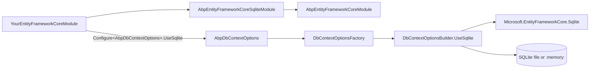

`Volo.Abp.EntityFrameworkCore.Sqlite` is the smallest of the relational provider modules. It wires `Microsoft.EntityFrameworkCore.Sqlite` into ABP's [EF Core core](/data/entity-framework-core) and exposes a `UseSqlite` extension that mirrors the SQL Server / PostgreSQL APIs. It is the provider of choice for **integration tests** (file-backed or `:memory:`), **mobile or desktop** scenarios where the database ships with the application, and rapid prototyping. This page reads every file under `framework/src/Volo.Abp.EntityFrameworkCore.Sqlite/` and explains the differences from the server-class providers.

## File inventory

| File | Role |
| --- | --- |
| `Volo/Abp/EntityFrameworkCore/Sqlite/AbpEntityFrameworkCoreSqliteModule.cs` | Module class — empty body, dependency only |
| `Volo/Abp/EntityFrameworkCore/AbpDbContextOptionsSqliteExtensions.cs` | `UseSqlite()` on `AbpDbContextOptions` |
| `Volo/Abp/EntityFrameworkCore/AbpDbContextConfigurationContextSqliteExtensions.cs` | `UseSqlite()` on `AbpDbContextConfigurationContext` (overloaded for `DbConnection`) |
| `Volo/Abp/EntityFrameworkCore/ConnectionStrings/SqliteConnectionStringChecker.cs` | `IConnectionStringChecker` probe |
| `Microsoft/EntityFrameworkCore/AbpSqliteModelBuilderExtensions.cs` | SQLite-specific model conventions |

## The module

The Sqlite module is the most minimal of the lot — it does not even override `ConfigureServices`. Unlike SQL Server / MySQL / PostgreSQL / Oracle, no default `SequentialGuidType` is pinned because SQLite stores GUIDs as `BLOB` and there is no clustered-index optimisation to chase.

```csharp framework/src/Volo.Abp.EntityFrameworkCore.Sqlite/Volo/Abp/EntityFrameworkCore/Sqlite/AbpEntityFrameworkCoreSqliteModule.cs
using Volo.Abp.Modularity;

namespace Volo.Abp.EntityFrameworkCore.Sqlite;

[DependsOn(
    typeof(AbpEntityFrameworkCoreModule)
)]
public class AbpEntityFrameworkCoreSqliteModule : AbpModule
{

}
```

The dependency declaration alone is enough — once the module is in your `[DependsOn]` graph, the `UseSqlite` extensions become callable from any module that imports the `Volo.Abp.EntityFrameworkCore` namespace.

## `UseSqlite` — host-side configurer

```csharp framework/src/Volo.Abp.EntityFrameworkCore.Sqlite/Volo/Abp/EntityFrameworkCore/AbpDbContextOptionsSqliteExtensions.cs
public static class AbpDbContextOptionsSqliteExtensions
{
    public static void UseSqlite(
        [NotNull] this AbpDbContextOptions options,
        Action<SqliteDbContextOptionsBuilder>? sqliteOptionsAction = null)
    {
        options.Configure(context =>
        {
            context.UseSqlite(sqliteOptionsAction);
        });
    }

    public static void UseSqlite<TDbContext>(
        [NotNull] this AbpDbContextOptions options,
        Action<SqliteDbContextOptionsBuilder>? sqliteOptionsAction = null)
        where TDbContext : AbpDbContext<TDbContext>
    {
        options.Configure<TDbContext>(context =>
        {
            context.UseSqlite(sqliteOptionsAction);
        });
    }
}
```

The standard two-overload pattern: default slot and per-context slot.

## `UseSqlite` — per-request configurer

```csharp framework/src/Volo.Abp.EntityFrameworkCore.Sqlite/Volo/Abp/EntityFrameworkCore/AbpDbContextConfigurationContextSqliteExtensions.cs
public static DbContextOptionsBuilder UseSqlite(
    [NotNull] this AbpDbContextConfigurationContext context,
    Action<SqliteDbContextOptionsBuilder>? sqliteOptionsAction = null)
{
    if (context.ExistingConnection != null)
    {
        return context.DbContextOptions.UseSqlite(context.ExistingConnection, optionsBuilder =>
        {
            optionsBuilder.UseQuerySplittingBehavior(QuerySplittingBehavior.SplitQuery);
            sqliteOptionsAction?.Invoke(optionsBuilder);
        });
    }
    else
    {
        return context.DbContextOptions.UseSqlite(context.ConnectionString, optionsBuilder =>
        {
            optionsBuilder.UseQuerySplittingBehavior(QuerySplittingBehavior.SplitQuery);
            sqliteOptionsAction?.Invoke(optionsBuilder);
        });
    }
}
```

Sqlite is the **one** provider that ships an additional overload taking a raw `DbConnection`. This is what test fixtures use to keep an in-memory database alive across the `DbContext` lifetime:

```csharp framework/src/Volo.Abp.EntityFrameworkCore.Sqlite/Volo/Abp/EntityFrameworkCore/AbpDbContextConfigurationContextSqliteExtensions.cs
public static DbContextOptionsBuilder UseSqlite(
    [NotNull] this AbpDbContextConfigurationContext context,
    DbConnection connection,
    Action<SqliteDbContextOptionsBuilder>? sqliteOptionsAction = null)
{
    if (context.ExistingConnection != null)
    {
        return context.DbContextOptions.UseSqlite(context.ExistingConnection, optionsBuilder =>
        {
            optionsBuilder.UseQuerySplittingBehavior(QuerySplittingBehavior.SplitQuery);
            sqliteOptionsAction?.Invoke(optionsBuilder);
        });
    }
    else
    {
        return context.DbContextOptions.UseSqlite(connection, optionsBuilder =>
        {
            optionsBuilder.UseQuerySplittingBehavior(QuerySplittingBehavior.SplitQuery);
            sqliteOptionsAction?.Invoke(optionsBuilder);
        });
    }
}
```

The reason this matters: SQLite's `:memory:` database is destroyed the moment the *single* `SqliteConnection` that opened it closes. If you let EF Core open/close the connection per `DbContext`, every save wipes the database. Tests therefore open one `SqliteConnection`, keep it alive for the lifetime of the test, and feed it into `UseSqlite(connection)`.

## Provider detection

`AbpDbContext<TDbContext>.GetDatabaseProviderOrNull` matches the provider name and returns `EfCoreDatabaseProvider.Sqlite`:

```csharp framework/src/Volo.Abp.EntityFrameworkCore/Volo/Abp/EntityFrameworkCore/AbpDbContext.cs
case "Microsoft.EntityFrameworkCore.Sqlite":
    return EfCoreDatabaseProvider.Sqlite;
```

So model-builder code can specialise (e.g. drop `decimal` precision because SQLite's `NUMERIC` affinity is loose).

## Connection-string convention

SQLite connection strings are file paths or `:memory:`:

```json appsettings.json
{
  "ConnectionStrings": {
    "Default": "Data Source=BookStore.db"
  }
}
```

For tests:

```csharp BookStoreTestBaseModule.cs
Configure<AbpDbContextOptions>(options =>
{
    options.Configure(opts =>
    {
        opts.DbContextOptions
            .UseSqlite(_connection); // long-lived SqliteConnection
    });
});
```

## Multi-tenancy in tests

For multi-tenant test scenarios you typically register a single shared `:memory:` connection and accept that every tenant lives in the same database file. This trades fidelity for test speed — production isolates tenants by connection string, tests do not. If your test asserts on connection-string resolution itself, prefer a file-backed SQLite with a per-tenant `Data Source=` and exercise `MultiTenantConnectionStringResolver` end-to-end.

## Foreign-key enforcement

SQLite does not enforce foreign keys by default — you must opt in with `PRAGMA foreign_keys = ON;`. Microsoft's EF Core SQLite provider issues this PRAGMA automatically when it opens the connection, so EF Core CRUD works as expected. Be aware, however, that any raw SQL you execute over the same connection inherits that pragma — Dapper queries via `Volo.Abp.Dapper` therefore see foreign-key enforcement turned on too, which matches production behaviour.

## Composition diagram



## Connection-string convention reminder

Solution templates generated by the ABP CLI bind every `[ConnectionStringName]`-decorated DbContext through the standard `AbpDbConnectionOptions.GetConnectionStringOrNull` chain — explicit key → mapped database → `Default`. SQLite plays no special role: the same fallback applies. For a one-file embedded database that holds every module's data, leave `Default` set to `Data Source=app.db` and let every module's connection-string name resolve through the default fallback.

## When to pick SQLite

<Tip>
SQLite is the best default for **integration tests** of ABP applications because it spins up faster than running SQL Server in Docker and supports almost the entire LINQ surface area that EF Core compiles for SQL Server. The classic gotcha — case-sensitive `LIKE`, no `decimal` precision, single-writer — generally does not bite tests but will bite production.
</Tip>

- ✅ Integration tests (file or `:memory:`)
- ✅ Mobile / desktop apps shipping with their own database
- ✅ Edge / IoT scenarios
- ❌ Multi-writer production workloads — pick SQL Server, PostgreSQL, MySQL, or Oracle.

## Provider detection

After the model is built, `AbpDbContext<>.GetDatabaseProviderOrNull` returns `EfCoreDatabaseProvider.Sqlite` so any model-builder code can branch on the active provider:

```csharp framework/src/Volo.Abp.EntityFrameworkCore/Volo/Abp/EntityFrameworkCore/AbpDbContext.cs
case "Microsoft.EntityFrameworkCore.Sqlite":
    return EfCoreDatabaseProvider.Sqlite;
```

Watch out for SQLite's lax typing: `decimal` precision is not enforced, `bool` is stored as an integer, and `DateTime` is stored as text. ABP's `AbpDateTimeValueConverter` handles the round-trip via `IClock.Normalize`, but `decimal` precision differences between test (SQLite) and production (SQL Server) are a classic source of "passes in CI, fails in prod" bugs. Pin the precision explicitly on the entity:

```csharp
b.Property(x => x.Price).HasColumnType("decimal(18,2)");
```

## In-memory test fixture pattern

The canonical ABP test pattern is to spin up a `SqliteConnection("DataSource=:memory:")`, keep it open for the lifetime of the test, and feed it into the configurer. Because the in-memory database is destroyed the moment the *single* underlying connection closes, the pattern relies on the connection-overloaded `UseSqlite`:

```csharp BookStoreTestBaseModule.cs
public override void ConfigureServices(ServiceConfigurationContext context)
{
    var connection = new SqliteConnection("DataSource=:memory:");
    connection.Open();

    context.Services.AddSingleton(connection);

    Configure<AbpDbContextOptions>(options =>
    {
        options.Configure(opts =>
        {
            opts.DbContextOptions.UseSqlite(connection);
        });
    });
}
```

The `Configure(opts => …)` slot fills `AbpDbContextOptions.DefaultConfigureAction` — see [`AbpDbContextOptions`](/data/entity-framework-core#abpdbcontextoptions) — so every DbContext uses this connection. Inside individual tests you call `context.Database.EnsureCreated()` (the test base usually does this in `[OneTimeSetUp]`) so the schema is materialised inside the in-memory database before tests run.

## File-backed integration tests

For tests that need persistence across test fixtures (e.g. multi-process integration tests where one process writes and another reads), point `Data Source=` at a temp file:

```json appsettings.Testing.json
{
  "ConnectionStrings": {
    "Default": "Data Source=/tmp/booktest-{random}.db"
  }
}
```

Use a per-test random suffix to keep tests parallel-safe. The same `UseSqlite(connectionString)` overload handles this automatically (no `DbConnection` needed because each `DbContext` can open its own file).

## What works and what doesn't

SQLite + EF Core covers about 95% of EF Core's LINQ translation. The 5% that does not work matters mostly in advanced scenarios:

| Feature | SQLite EF Core | Workaround |
| --- | --- | --- |
| `decimal` precision | Stored as `NUMERIC`, lax | `HasColumnType("decimal(p,s)")` and accept run-time rounding |
| Window functions (`OVER`) | Supported since EF Core 8 | none required |
| Full-text search | Not in vanilla EF Core | call FTS5 SQL directly via `FromSqlRaw` |
| `DateTimeOffset` | Stored as TEXT | works, but no `AT TIME ZONE` |
| Multi-writer concurrency | Single writer | acceptable for tests, never for production |
| Transactions | Supported | UoW behaves like any other relational provider |

## Connection-string check

`SqliteConnectionStringChecker` performs the *Test connection* probe: it tries to open the SQLite file (or `:memory:`) and reports success/failure through `AbpConnectionStringCheckResult`. For most SQLite scenarios the answer is uninteresting because the database is auto-created on first write.

## Related pages

<CardGroup cols={2}>
  <Card title="EF Core (Core)" href="/data/entity-framework-core">`AbpDbContext<>` and the configurer pipeline.</Card>
  <Card title="SQL Server" href="/data/ef-core-sqlserver">Production-grade Microsoft provider.</Card>
  <Card title="In-Memory Database" href="/data/memory-db">Pure-managed ABP test database — no SQLite needed.</Card>
  <Card title="Volo.Abp.Data" href="/data/abp-data">Connection-string primitives shared by every provider.</Card>
</CardGroup>
