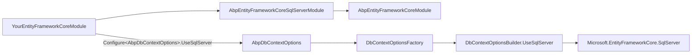

`Volo.Abp.EntityFrameworkCore.SqlServer` is the thinnest of the provider modules: it pulls in `Microsoft.EntityFrameworkCore.SqlServer`, adds a tiny module that picks a sensible default `SequentialGuidType`, and exposes a pair of `UseSqlServer` extension methods that plug into `AbpDbContextOptions`. This is the provider every ASP.NET Core Boilerplate solution template defaults to, and the one that ships with the official ABP commercial templates. This page reads every file under `framework/src/Volo.Abp.EntityFrameworkCore.SqlServer/` and explains how it composes with the [EF Core core](/data/entity-framework-core) module.

## File inventory

| File | Role |
| --- | --- |
| `Volo/Abp/EntityFrameworkCore/SqlServer/AbpEntityFrameworkCoreSqlServerModule.cs` | Module class |
| `Volo/Abp/EntityFrameworkCore/AbpDbContextOptionsSqlServerExtensions.cs` | `UseSqlServer()` on `AbpDbContextOptions` |
| `Volo/Abp/EntityFrameworkCore/AbpDbContextConfigurationContextSqlServerExtensions.cs` | `UseSqlServer()` on `AbpDbContextConfigurationContext` |
| `Volo/Abp/EntityFrameworkCore/ConnectionStrings/SqlServerConnectionStringChecker.cs` | `IConnectionStringChecker` health probe |
| `Microsoft/EntityFrameworkCore/AbpSqlServerModelBuilderExtensions.cs` | SQL-Server-specific model conventions |

## The module

```csharp framework/src/Volo.Abp.EntityFrameworkCore.SqlServer/Volo/Abp/EntityFrameworkCore/SqlServer/AbpEntityFrameworkCoreSqlServerModule.cs
[DependsOn(
    typeof(AbpEntityFrameworkCoreModule)
    )]
public class AbpEntityFrameworkCoreSqlServerModule : AbpModule
{
    public override void ConfigureServices(ServiceConfigurationContext context)
    {
        Configure<AbpSequentialGuidGeneratorOptions>(options =>
        {
            if (options.DefaultSequentialGuidType == null)
            {
                options.DefaultSequentialGuidType = SequentialGuidType.SequentialAtEnd;
            }
        });
    }
}
```

The module only does one thing besides declaring the dependency: it picks `SequentialGuidType.SequentialAtEnd`. SQL Server uses *byte-major-end* sorting for `uniqueidentifier`, so generating Guids whose **end** bytes are monotonic produces clustered-index-friendly inserts (avoiding page splits). The `if (options.DefaultSequentialGuidType == null)` guard means a host that explicitly configured a different value is respected.

`IGuidGenerator` itself lives in `Volo.Abp.Guids` and is consumed automatically by `AbpDbContext<>.HandlePropertiesBeforeSave` whenever a `Guid` primary key is `Guid.Empty` on insert — see [EF Core](/data/entity-framework-core#abpdbcontexttdbcontext).

## `UseSqlServer` — the host-side entry point

The `AbpDbContextOptions` extension is what application modules call from `ConfigureServices`:

```csharp framework/src/Volo.Abp.EntityFrameworkCore.SqlServer/Volo/Abp/EntityFrameworkCore/AbpDbContextOptionsSqlServerExtensions.cs
public static class AbpDbContextOptionsSqlServerExtensions
{
    public static void UseSqlServer(
        [NotNull] this AbpDbContextOptions options,
        Action<SqlServerDbContextOptionsBuilder>? sqlServerOptionsAction = null)
    {
        options.Configure(context =>
        {
            context.UseSqlServer(sqlServerOptionsAction);
        });
    }

    public static void UseSqlServer<TDbContext>(
        [NotNull] this AbpDbContextOptions options,
        Action<SqlServerDbContextOptionsBuilder>? sqlServerOptionsAction = null)
        where TDbContext : AbpDbContext<TDbContext>
    {
        options.Configure<TDbContext>(context =>
        {
            context.UseSqlServer(sqlServerOptionsAction);
        });
    }
}
```

Two overloads, two slots in [`AbpDbContextOptions`](/data/entity-framework-core#abpdbcontextoptions): the parameterless one fills the *default* configurer used by every `TDbContext`, the generic one fills the *per-context* slot so you can run one `DbContext` on SQL Server and another on PostgreSQL inside the same host.

Typical use:

```csharp BookStoreEntityFrameworkCoreModule.cs
public override void ConfigureServices(ServiceConfigurationContext context)
{
    context.Services.AddAbpDbContext<BookStoreDbContext>(options =>
    {
        options.AddDefaultRepositories(includeAllEntities: true);
    });

    Configure<AbpDbContextOptions>(options =>
    {
        options.UseSqlServer();
    });
}
```

The `Configure<AbpDbContextOptions>(options => options.UseSqlServer())` call only registers the configurer. The actual `DbContextOptionsBuilder.UseSqlServer(connectionString)` call is deferred until `DbContextOptionsFactory.Create<TDbContext>` runs — which is what gives ABP enough time to resolve the per-tenant connection string before EF Core sees it.

## `UseSqlServer` — the per-request configurer

The configurer registered above receives an `AbpDbContextConfigurationContext` and is responsible for actually calling `DbContextOptionsBuilder.UseSqlServer(...)`. This is where ABP decides whether to start a new SQL connection or reuse one already opened by an earlier `DbContext` in the same unit of work.

```csharp framework/src/Volo.Abp.EntityFrameworkCore.SqlServer/Volo/Abp/EntityFrameworkCore/AbpDbContextConfigurationContextSqlServerExtensions.cs
public static class AbpDbContextConfigurationContextSqlServerExtensions
{
    public static DbContextOptionsBuilder UseSqlServer(
        [NotNull] this AbpDbContextConfigurationContext context,
        Action<SqlServerDbContextOptionsBuilder>? sqlServerOptionsAction = null)
    {
        if (context.ExistingConnection != null)
        {
            return context.DbContextOptions.UseSqlServer(context.ExistingConnection, optionsBuilder =>
            {
                optionsBuilder.UseQuerySplittingBehavior(QuerySplittingBehavior.SplitQuery);
                sqlServerOptionsAction?.Invoke(optionsBuilder);
            });
        }
        else
        {
            return context.DbContextOptions.UseSqlServer(context.ConnectionString, optionsBuilder =>
            {
                optionsBuilder.UseQuerySplittingBehavior(QuerySplittingBehavior.SplitQuery);
                sqlServerOptionsAction?.Invoke(optionsBuilder);
            });
        }
    }
}
```

Two important behaviours surface:

1. **Existing connection reuse**. `UnitOfWorkDbContextProvider` pre-populates `context.ExistingConnection` from `DbContextCreationContext.Current.ExistingConnection` whenever the active UoW already holds a transaction on the same connection string. SQL Server (a relational provider) reuses that `DbConnection` instead of dialling a second one, which is what allows a single transaction to enlist multiple `DbContext` types.
2. **`UseQuerySplittingBehavior(SplitQuery)`**. ABP defaults to *split queries* — multiple round-trips, one per `Include` — rather than the EF Core default of a single SQL statement with cross joins. This avoids cartesian explosion on aggregates that have several collection navigations (a typical shape in DDD). A host can flip it back with the `sqlServerOptionsAction` callback:

```csharp
options.UseSqlServer(sqlServer =>
{
    sqlServer.UseQuerySplittingBehavior(QuerySplittingBehavior.SingleQuery);
    sqlServer.EnableRetryOnFailure(maxRetryCount: 5);
});
```

## Multi-tenancy

Per-tenant connection-string overrides work transparently. `MultiTenantConnectionStringResolver` from `Volo.Abp.MultiTenancy` (which replaces `DefaultConnectionStringResolver` once the multi-tenancy module is in your `[DependsOn]` chain) checks `ICurrentTenant.ConnectionStrings[name]` first; the SQL Server configurer is then invoked with the resolved per-tenant connection string, so each tenant ends up on its own database without changing any application code. See [Multi-Tenancy](/multitenancy) for the resolver and tenant-store details.

## Existing-connection reuse in detail

`UnitOfWorkDbContextProvider<TDbContext>` pre-fills `DbContextCreationContext.Current.ExistingConnection` whenever a second DbContext type is being materialised under the same unit of work *and* same connection string. The SQL Server configurer detects that and dispatches to the `UseSqlServer(DbConnection)` overload instead of `UseSqlServer(string)`. SQL Server then enlists the new DbContext on the open `SqlConnection`, so the single `IDbContextTransaction` opened by the *first* DbContext can span the second one too. This is the mechanism that lets, for example, your `BookStoreDbContext` and an `AuditingDbContext` participate in the same transaction without a distributed transaction coordinator.

## Connection-string check

`SqlServerConnectionStringChecker` is what the [tenant management UI](/multitenancy) calls when a user attaches a per-tenant connection string and clicks *Test connection*. The provider-specific overrides replace `DefaultConnectionStringChecker` (see [`Volo.Abp.Data`](/data/abp-data#connection-strings)).

It uses ADO.NET directly — opening a `SqlConnection`, asking the catalog whether the database exists, and reporting back via `AbpConnectionStringCheckResult`. The same pattern is used by every provider's `*ConnectionStringChecker`.

## Model-builder helpers

`AbpSqlServerModelBuilderExtensions` lives under `Microsoft.EntityFrameworkCore` (as is the EF Core convention) and exposes SQL-Server-specific helpers used by entity configurations. They are normally invoked inside `OnModelCreating` after the entity type has been built — e.g. when an ABP module wants to register a temporal table, a clustered index hint, or a SQL-Server sequence.

## Connection-string convention

Solutions generated by the ABP CLI bind to `appsettings.json` keys named after the module's `[ConnectionStringName]` attribute:

```json appsettings.json
{
  "ConnectionStrings": {
    "Default": "Server=(LocalDb)\\MSSQLLocalDB;Database=BookStore;Trusted_Connection=true;TrustServerCertificate=True"
  }
}
```

The `Default` key feeds every `DbContext` whose `[ConnectionStringName]` is not overridden — usually the host `BookStoreDbContext`. Per-module DbContexts (e.g. `AbpIdentityDbContext`) fall back to `Default` via the resolver chain in [`AbpDbConnectionOptions.GetConnectionStringOrNull`](/data/abp-data#abpdatabaseinfo-and-database-mappings).

## Splitting queries

`QuerySplittingBehavior.SplitQuery` makes EF Core emit one round-trip per `Include` collection, joined client-side. The alternative, `SingleQuery`, joins everything into a cross-product SQL — which for an aggregate with two collection navigations of size 100 produces a 10,000-row result. ABP defaults to split queries because DDD aggregates often have multiple collections, but it is worth knowing the trade-offs:

| Mode | Pro | Con |
| --- | --- | --- |
| `SplitQuery` (ABP default) | No cross-join explosion | One extra round trip per `Include` |
| `SingleQuery` (EF Core default) | One round trip | Risk of cartesian explosion |

For read-heavy paths where you know the cardinality is small, flip back to `SingleQuery` on a per-query basis with `AsSingleQuery()` on the `IQueryable<T>`.

## Where it sits in the dependency graph



## Sequential GUIDs explained

ABP's `IGuidGenerator` is `SequentialGuidGenerator` by default (registered by `Volo.Abp.Guids`). Whenever `AbpDbContext<>.HandlePropertiesBeforeSave` finds an entity with `Id == Guid.Empty`, it calls `IGuidGenerator.Create()` — the value flows out of the *current* `SequentialGuidType`. The four flavours in `Volo.Abp.Guids` correspond to four different "where does the monotonic part of the GUID live" choices:

| `SequentialGuidType` | Monotonic bytes | Best for |
| --- | --- | --- |
| `SequentialAtEnd` | last 6 | SQL Server (sorts by end) |
| `SequentialAsString` | first 6 (text sort) | MySQL, PostgreSQL (CHAR/UUID lexicographic) |
| `SequentialAsBinary` | first 6 (binary sort) | Oracle (RAW(16) byte sort) |

`AbpEntityFrameworkCoreSqlServerModule` flipping the default to `SequentialAtEnd` is what keeps the SQL Server clustered index on `uniqueidentifier` columns from fragmenting on every insert. If you override the default — `Configure<AbpSequentialGuidGeneratorOptions>(o => o.DefaultSequentialGuidType = SequentialGuidType.SequentialAsString)` — the module respects your choice because of the `if (options.DefaultSequentialGuidType == null)` guard.

## Mixing SQL Server with another provider

The per-context overloads (`UseSqlServer<TDbContext>`) make it valid to run one DbContext on SQL Server and another on a different provider in the same host:

```csharp HostModule.cs
Configure<AbpDbContextOptions>(options =>
{
    options.UseSqlServer();                        // default for every DbContext
    options.UseNpgsql<AuditingDbContext>();        // override for one context
});
```

When `UnitOfWorkDbContextProvider<AuditingDbContext>` runs, the `ConfigureActions[typeof(AuditingDbContext)]` slot is found and applied; the default `UseSqlServer` is skipped for that specific context type. Other contexts (`BookStoreDbContext`, `IdentityDbContext`) still resolve through the default and end up on SQL Server. This is the same `AbpDbContextOptions` machinery covered in [EF Core](/data/entity-framework-core#abpdbcontextoptions).

## Detection inside `AbpDbContext`

After EF Core builds the model, `AbpDbContext<>.GetDatabaseProviderOrNull` reads `Database.ProviderName` and returns `EfCoreDatabaseProvider.SqlServer`. Any model-builder code that conditionally configures SQL-Server-specific features (e.g. case-insensitive collations, sequences, temporal tables) can branch on the returned enum:

```csharp framework/src/Volo.Abp.EntityFrameworkCore/Volo/Abp/EntityFrameworkCore/AbpDbContext.cs
case "Microsoft.EntityFrameworkCore.SqlServer":
    return EfCoreDatabaseProvider.SqlServer;
```

This is how, for example, the SQL-Server-specific JSON column support in EF Core 8+ can be enabled without affecting MySQL or PostgreSQL builds of the same context.

## Common runtime knobs

A typical production callback looks like:

```csharp BookStoreEntityFrameworkCoreModule.cs
Configure<AbpDbContextOptions>(options =>
{
    options.UseSqlServer(sqlServer =>
    {
        sqlServer.EnableRetryOnFailure(maxRetryCount: 5);
        sqlServer.CommandTimeout(60);
        sqlServer.MigrationsHistoryTable("__BookStoreMigrationsHistory");
    });
});
```

The callback runs *inside* ABP's configurer for every DbContext on every UoW. Because the configurer is wrapped in `UseQuerySplittingBehavior(SplitQuery)`, any override you set in the callback wins (callback fires after the default), but the split-query default stays in place unless you explicitly flip it.

## Schema isolation per module

When a single SQL Server database hosts multiple ABP modules (host application, Identity, AuditLogging, ...), the EF Core conventions install each module's tables in the `dbo` schema by default. Override per-module via `Configure<AbpDbContextOptions>(opts => opts.UseSqlServer())` plus model-builder calls such as `b.ToTable("AbpUsers", "Identity")` — the ABP modules already place their tables in their own schemas (e.g. `Identity`, `AbpAudits`). This keeps cross-module joins explicit and migration history isolated.

## Migrations history table

By convention ABP keeps the EF migrations history under the default name `__EFMigrationsHistory`. When running multiple modules against the *same* database — e.g. host application and a separate auditing module — set distinct `MigrationsHistoryTable` names so the modules' migration assemblies do not overwrite each other's entries.

## Related pages

<CardGroup cols={2}>
  <Card title="EF Core (Core)" href="/data/entity-framework-core">`AbpDbContext<>`, `IDbContextProvider<>` and the configurer pipeline.</Card>
  <Card title="MySQL" href="/data/ef-core-mysql">Pomelo-based alternative for MySQL/MariaDB.</Card>
  <Card title="PostgreSQL" href="/data/ef-core-postgresql">Npgsql-based alternative.</Card>
  <Card title="Volo.Abp.Data" href="/data/abp-data">Connection-string resolution shared by every provider.</Card>
  <Card title="Multi-Tenancy" href="/multitenancy">Per-tenant connection string overrides.</Card>
  <Card title="Database Migration" href="/data/database-migration">Running migrations via the `DbMigrator` host.</Card>
</CardGroup>
