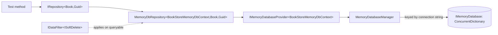

`Volo.Abp.MemoryDb` is a pure-managed in-process database that ABP uses internally for unit tests, integration tests of templates, and any scenario where standing up SQL Server or MongoDB would be overkill. It implements `IRepository<TEntity, TKey>` against a process-wide `ConcurrentDictionary<Type, …>` so your application code can be tested without any external dependency — the same repository surface that production code uses, just with a different `[DependsOn]`. This page reads every file in `framework/src/Volo.Abp.MemoryDb/` and shows how to wire it into a test project.

## File inventory

Files in `framework/src/Volo.Abp.MemoryDb/Volo/Abp/MemoryDb/`:

| File | Role |
| --- | --- |
| `AbpMemoryDbModule.cs` | Module class |
| `MemoryDbContext.cs` | Base for user-defined contexts |
| `IMemoryDatabaseProvider.cs` | Per-UoW database accessor |
| `DependencyInjection/AbpMemoryDbContextRegistrationOptions.cs` | Fluent options |
| `DependencyInjection/IAbpMemoryDbContextRegistrationOptionsBuilder.cs` | Builder contract |
| `DependencyInjection/MemoryDbRepositoryRegistrar.cs` | Registers `MemoryDbRepository<,,>` |

Files in `framework/src/Volo.Abp.MemoryDb/Volo/Abp/Domain/Repositories/MemoryDb/`:

| File | Role |
| --- | --- |
| `IMemoryDatabase.cs` | Database contract |
| `MemoryDatabase.cs` | Default implementation backed by `ConcurrentDictionary` |
| `MemoryDatabaseManager.cs` | Singleton cache keyed by database name |
| `IMemoryDatabaseCollection.cs` / `MemoryDatabaseCollection.cs` | Per-entity-type storage |
| `IMemoryDbRepository.cs` | Public repository contract |
| `MemoryDbRepository.cs` | Generic implementation |
| `InMemoryIdGenerator.cs` | Auto-incrementing integer ids |
| `IMemoryDbSerializer.cs` / `Utf8JsonMemoryDbSerializer.cs` / `Utf8JsonMemoryDbSerializerOptions.cs` | Deep-clone (write-isolation) via JSON serialization |

Files in `framework/src/Volo.Abp.MemoryDb/Volo/Abp/Uow/MemoryDb/`:

| File | Role |
| --- | --- |
| `UnitOfWorkMemoryDatabaseProvider.cs` | `IMemoryDatabaseProvider<>` implementation |
| `MemoryDbDatabaseApi.cs` | `IDatabaseApi` adapter |

## The module

```csharp framework/src/Volo.Abp.MemoryDb/Volo/Abp/MemoryDb/AbpMemoryDbModule.cs
[DependsOn(typeof(AbpDddDomainModule))]
public class AbpMemoryDbModule : AbpModule
{
    public override void ConfigureServices(ServiceConfigurationContext context)
    {
        context.Services.TryAddTransient(typeof(IMemoryDatabaseProvider<>), typeof(UnitOfWorkMemoryDatabaseProvider<>));
        context.Services.TryAddTransient(typeof(IMemoryDatabaseCollection<>), typeof(MemoryDatabaseCollection<>));
    }
}
```

Two registrations: the per-UoW database accessor and the per-entity storage collection. Both are `TryAdd`, so a host can swap either implementation.

## `MemoryDbContext`

`MemoryDbContext` is an extraordinarily thin base class — it just publishes the entity types it owns. There is no `OnModelCreating`, no collection mapping, no fluent configuration:

```csharp framework/src/Volo.Abp.MemoryDb/Volo/Abp/MemoryDb/MemoryDbContext.cs
public abstract class MemoryDbContext : ISingletonDependency
{
    private static readonly Type[] EmptyTypeList = new Type[0];

    public virtual IReadOnlyList<Type> GetEntityTypes()
    {
        return EmptyTypeList;
    }
}
```

A user-defined context looks like:

```csharp BookStoreMemoryDbContext.cs
public class BookStoreMemoryDbContext : MemoryDbContext
{
    public override IReadOnlyList<Type> GetEntityTypes() => new[]
    {
        typeof(Book),
        typeof(Author),
    };
}
```

The `ISingletonDependency` lifetime is intentional — the context itself is stateless, and the actual data lives in `IMemoryDatabase`, which is a per-database-name singleton.

## `IMemoryDatabase`

```csharp framework/src/Volo.Abp.MemoryDb/Volo/Abp/Domain/Repositories/MemoryDb/IMemoryDatabase.cs
public interface IMemoryDatabase
{
    IMemoryDatabaseCollection<TEntity> Collection<TEntity>() where TEntity : class, IEntity;

    TKey GenerateNextId<TEntity, TKey>();
}
```

Two operations: get the typed collection for an entity, and generate a fresh sequential id (used for `IEntity<int>`, `IEntity<long>`, etc.). The default implementation stores collections lazily:

```csharp framework/src/Volo.Abp.MemoryDb/Volo/Abp/Domain/Repositories/MemoryDb/MemoryDatabase.cs
public class MemoryDatabase : IMemoryDatabase, ITransientDependency
{
    private readonly ConcurrentDictionary<Type, object> _sets;
    private readonly ConcurrentDictionary<Type, InMemoryIdGenerator> _entityIdGenerators;
    private readonly IServiceProvider _serviceProvider;

    public IMemoryDatabaseCollection<TEntity> Collection<TEntity>()
        where TEntity : class, IEntity
    {
        return (_sets.GetOrAdd(typeof(TEntity),
                _ => _serviceProvider.GetRequiredService<IMemoryDatabaseCollection<TEntity>>()) as
            IMemoryDatabaseCollection<TEntity>)!;
    }

    public TKey GenerateNextId<TEntity, TKey>()
    {
        return _entityIdGenerators
            .GetOrAdd(typeof(TEntity), () => new InMemoryIdGenerator())
            .GenerateNext<TKey>();
    }
}
```

The class is `ITransientDependency`, but the *uniqueness* of the in-memory database is enforced by `MemoryDatabaseManager`:

```csharp framework/src/Volo.Abp.MemoryDb/Volo/Abp/Domain/Repositories/MemoryDb/MemoryDatabaseManager.cs
public class MemoryDatabaseManager : ISingletonDependency
{
    private readonly ConcurrentDictionary<string, IMemoryDatabase> _databases =
        new ConcurrentDictionary<string, IMemoryDatabase>();

    private readonly IServiceProvider _serviceProvider;

    public MemoryDatabaseManager(IServiceProvider serviceProvider)
    {
        _serviceProvider = serviceProvider;
    }

    public IMemoryDatabase Get(string databaseName)
    {
        return _databases.GetOrAdd(databaseName, _ => _serviceProvider.GetRequiredService<IMemoryDatabase>());
    }
}
```

The `databaseName` is the resolved connection string — this is what allows per-tenant isolation: the host's `IConnectionStringResolver` (replaced by `MultiTenantConnectionStringResolver` when tenancy is on) returns a *different* string per tenant, so each tenant gets its own `IMemoryDatabase`.

## `IMemoryDatabaseProvider<TMemoryDbContext>`

```csharp framework/src/Volo.Abp.MemoryDb/Volo/Abp/MemoryDb/IMemoryDatabaseProvider.cs
public interface IMemoryDatabaseProvider<TMemoryDbContext>
    where TMemoryDbContext : MemoryDbContext
{
    [Obsolete("Use GetDbContextAsync method.")]
    TMemoryDbContext DbContext { get; }

    Task<TMemoryDbContext> GetDbContextAsync();

    [Obsolete("Use GetDatabaseAsync method.")]
    IMemoryDatabase GetDatabase();

    Task<IMemoryDatabase> GetDatabaseAsync();
}
```

The default implementation `UnitOfWorkMemoryDatabaseProvider<TMemoryDbContext>` resolves the database through the same `IConnectionStringResolver` chain every other provider uses — see the EF Core / MongoDB pages for the parallel.

```csharp framework/src/Volo.Abp.MemoryDb/Volo/Abp/Uow/MemoryDb/UnitOfWorkMemoryDatabaseProvider.cs
public class UnitOfWorkMemoryDatabaseProvider<TMemoryDbContext> : IMemoryDatabaseProvider<TMemoryDbContext>
    where TMemoryDbContext : MemoryDbContext
{
    public TMemoryDbContext DbContext { get; }

    private readonly IUnitOfWorkManager _unitOfWorkManager;
    private readonly IConnectionStringResolver _connectionStringResolver;
    private readonly MemoryDatabaseManager _memoryDatabaseManager;
    private readonly ICurrentTenant _currentTenant;

    public Task<TMemoryDbContext> GetDbContextAsync()
    {
        return Task.FromResult(DbContext);
    }
}
```

The `MemoryDbDatabaseApi` adapter holds the resolved database so the UoW manager can find it back when scoping operations:

```csharp framework/src/Volo.Abp.MemoryDb/Volo/Abp/Uow/MemoryDb/MemoryDbDatabaseApi.cs
public class MemoryDbDatabaseApi : IDatabaseApi
{
    public IMemoryDatabase Database { get; }

    public MemoryDbDatabaseApi(IMemoryDatabase database)
    {
        Database = database;
    }
}
```

There is **no transaction support** — `MemoryDbDatabaseApi` deliberately does not implement `ISupportsSavingChanges` or `ISupportsRollback`. The in-memory provider commits every write immediately, so a transactional UoW that rolls back will *not* undo in-memory changes. This is acceptable for unit tests; it would be a bug in production.

## `MemoryDbRepository<TMemoryDbContext, TEntity, TKey>`

```csharp framework/src/Volo.Abp.MemoryDb/Volo/Abp/Domain/Repositories/MemoryDb/MemoryDbRepository.cs
public class MemoryDbRepository<TMemoryDbContext, TEntity> : RepositoryBase<TEntity>, IMemoryDbRepository<TEntity>
    where TMemoryDbContext : MemoryDbContext
    where TEntity : class, IEntity
{
    public virtual async Task<IMemoryDatabaseCollection<TEntity>> GetCollectionAsync()
    {
        return (await GetDatabaseAsync()).Collection<TEntity>();
    }

    public virtual IMemoryDatabase Database => DatabaseProvider.GetDatabase();

    public Task<IMemoryDatabase> GetDatabaseAsync()
    {
        return DatabaseProvider.GetDatabaseAsync();
    }

    protected IMemoryDatabaseProvider<TMemoryDbContext> DatabaseProvider { get; }

    public ILocalEventBus LocalEventBus => LazyServiceProvider.LazyGetService<ILocalEventBus>(NullLocalEventBus.Instance);

    public IDistributedEventBus DistributedEventBus => LazyServiceProvider.LazyGetService<IDistributedEventBus>(NullDistributedEventBus.Instance);

    public IEntityChangeEventHelper EntityChangeEventHelper => LazyServiceProvider.LazyGetService<IEntityChangeEventHelper>(NullEntityChangeEventHelper.Instance);

    public IGuidGenerator GuidGenerator => LazyServiceProvider.LazyGetService<IGuidGenerator>(SimpleGuidGenerator.Instance);

    public IAuditPropertySetter AuditPropertySetter => LazyServiceProvider.LazyGetRequiredService<IAuditPropertySetter>();

    public MemoryDbRepository(IMemoryDatabaseProvider<TMemoryDbContext> databaseProvider)
    {
        DatabaseProvider = databaseProvider;
    }

    public override async Task<IQueryable<TEntity>> GetQueryableAsync()
    {
        return ApplyDataFilters((await GetCollectionAsync()).AsQueryable());
    }
}
```

The provider follows the same contract as `EfCoreRepository<,,>` and `MongoDbRepository<,,>`: lazy injected dependencies, `ApplyDataFilters` for soft-delete and multi-tenant filtering, audit stamping on insert/update, and domain-event publication after writes. The difference is that the underlying store is a `ConcurrentDictionary`, so writes are immediate.

The `ApplyDataFilters` call in `GetQueryableAsync` is what gives the in-memory provider the same `WHERE` semantics as EF Core — `using (_dataFilter.Disable<ISoftDelete>())` reveals soft-deleted rows in tests too.

## Registration

```csharp framework/src/Volo.Abp.MemoryDb/Microsoft/Extensions/DependencyInjection/AbpMemoryDbServiceCollectionExtensions.cs
public static IServiceCollection AddMemoryDbContext<TMemoryDbContext>(this IServiceCollection services, Action<IAbpMemoryDbContextRegistrationOptionsBuilder>? optionsBuilder = null)
    where TMemoryDbContext : MemoryDbContext
{
    var options = new AbpMemoryDbContextRegistrationOptions(typeof(TMemoryDbContext), services);
    optionsBuilder?.Invoke(options);

    if (options.DefaultRepositoryDbContextType != typeof(TMemoryDbContext))
    {
        services.TryAddSingleton(options.DefaultRepositoryDbContextType, sp => sp.GetRequiredService<TMemoryDbContext>());
    }

    foreach (var entry in options.ReplacedDbContextTypes)
    {
        var originalDbContextType = entry.Key.Type;
        var targetDbContextType = entry.Value ?? typeof(TMemoryDbContext);

        services.Replace(
            ServiceDescriptor.Singleton(
                originalDbContextType,
                sp => sp.GetRequiredService(targetDbContextType)
            )
        );
    }

    new MemoryDbRepositoryRegistrar(options).AddRepositories();

    return services;
}
```

The shape is identical to `AddAbpDbContext` and `AddMongoDbContext` — `[ReplaceDbContext]` rewiring plus a `MemoryDbRepositoryRegistrar` that auto-registers every entity declared by `TMemoryDbContext.GetEntityTypes()`.

## Use pattern in tests

A typical ABP test project registers an in-memory database in its `*TestBaseModule`:

```csharp BookStoreTestBaseModule.cs
public override void ConfigureServices(ServiceConfigurationContext context)
{
    context.Services.AddMemoryDbContext<BookStoreMemoryDbContext>(options =>
    {
        options.AddDefaultRepositories(includeAllEntities: true);
    });
}
```

The same application code (`Book book = await _bookRepository.GetAsync(id);`) then runs unchanged — only the provider module behind `IRepository<Book, Guid>` changes.

## Composition diagram



## Limitations

| Concern | Production-grade providers | `Volo.Abp.MemoryDb` |
| --- | --- | --- |
| Transactions | Yes (with rollback) | No — every write is immediate |
| Process restart durability | Yes | No — state lives in a `ConcurrentDictionary` |
| Schema evolution | EF migrations | None — `GetEntityTypes()` is the schema |
| Concurrency stamps | Enforced by RDBMS | Honoured by `MemoryDbRepository.UpdateAsync` via `Utf8JsonMemoryDbSerializer` clone |
| Foreign keys | Enforced by RDBMS | Not enforced — your test code can write inconsistent state |

<Warning>
Do not use `Volo.Abp.MemoryDb` in production. It is exclusively for tests and prototypes. The lack of transaction support and persistence makes it unsuitable for any scenario where data must survive a process restart.
</Warning>

## Related pages

<CardGroup cols={2}>
  <Card title="EF Core" href="/data/entity-framework-core">Production-grade EF Core repository.</Card>
  <Card title="SQLite" href="/data/ef-core-sqlite">Test-friendly EF Core variant with transactions.</Card>
  <Card title="Repositories" href="/ddd/repositories">DDD repository contracts.</Card>
  <Card title="Unit of Work" href="/uow">UoW semantics — but transactions are no-ops here.</Card>
</CardGroup>
