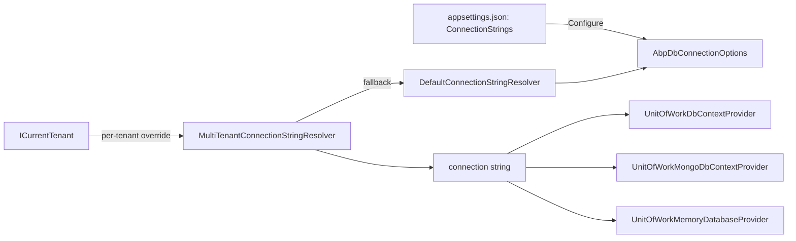

The ABP Framework keeps domain code completely free of database technology by funnelling every read and write through a small set of provider-agnostic abstractions. `Volo.Abp.Data` defines the shared building blocks — connection-string resolution, data seeding, soft/multi-tenant filters, concurrency exceptions — and a family of provider modules (`Volo.Abp.EntityFrameworkCore`, `Volo.Abp.MongoDB`, `Volo.Abp.Dapper`, `Volo.Abp.MemoryDb`) plug into those abstractions to give you real `IRepository<TEntity, TKey>` implementations backed by EF Core, the MongoDB C# driver, Dapper, or an in-memory store. This page is the map; the rest of the `data/` group walks each provider in depth.

## What "data layer" means in ABP

The data layer in ABP is everything that sits between [domain repositories](/ddd/repositories) and the underlying database driver. It is *not* the database itself — ABP never ships an ORM — but the glue that:

- Resolves the **connection string** for the current operation through `IConnectionStringResolver` (multi-tenant aware).
- Materialises a **database context** scoped to the active [unit of work](/uow) (`IDbContextProvider<TDbContext>`, `IMongoDbContextProvider<TMongoDbContext>`, `IMemoryDatabaseProvider<TMemoryDbContext>`).
- Implements `IRepository<TEntity[, TKey]>` for each provider (`EfCoreRepository<,,>`, `MongoDbRepository<,,>`, `MemoryDbRepository<,,>`).
- Hooks into the [auditing](/auditing/overview), [domain events](/ddd/domain-events), and [multi-tenancy](/multitenancy) pipelines on every `SaveChanges`.
- Runs **data seeders** (`IDataSeeder` ⇒ `IDataSeedContributor` ⇒ provider-specific seeders) during host start-up or migration.

## File inventory — top level

| Package | Path (relative to repo root) | Role |
| --- | --- | --- |
| Core abstractions | `framework/src/Volo.Abp.Data` | Connection strings, seeding, filters |
| EF Core | `framework/src/Volo.Abp.EntityFrameworkCore` | `AbpDbContext<TDbContext>`, `EfCoreRepository<,,>` |
| EF Core / SQL Server | `framework/src/Volo.Abp.EntityFrameworkCore.SqlServer` | `UseSqlServer` extensions |
| EF Core / MySQL | `framework/src/Volo.Abp.EntityFrameworkCore.MySQL` | Pomelo-based `UseMySQL` |
| EF Core / PostgreSQL | `framework/src/Volo.Abp.EntityFrameworkCore.PostgreSql` | `UseNpgsql` extensions |
| EF Core / Oracle (ODP) | `framework/src/Volo.Abp.EntityFrameworkCore.Oracle` | `UseOracle` (Oracle.EntityFrameworkCore) |
| EF Core / Oracle (Devart) | `framework/src/Volo.Abp.EntityFrameworkCore.Oracle.Devart` | `UseOracle` (Devart) |
| EF Core / SQLite | `framework/src/Volo.Abp.EntityFrameworkCore.Sqlite` | `UseSqlite` extensions |
| MongoDB | `framework/src/Volo.Abp.MongoDB` | `AbpMongoDbContext`, `MongoDbRepository<,,>` |
| Dapper | `framework/src/Volo.Abp.Dapper` | `DapperRepository<TDbContext>` (sits on EF Core's connection/UoW) |
| In-memory | `framework/src/Volo.Abp.MemoryDb` | `MemoryDbContext`, `MemoryDbRepository<,,>` for tests |

## Provider modules at a glance

<CardGroup cols={2}>
  <Card title="EF Core" icon="database" href="/data/entity-framework-core">
    Default provider in every solution template. `AbpDbContext<TDbContext>` adds auditing, soft-delete, multi-tenant filters and domain-event publishing on top of `Microsoft.EntityFrameworkCore.DbContext`.
  </Card>
  <Card title="MongoDB" icon="leaf" href="/data/mongodb">
    `AbpMongoDbContext` exposes typed `IMongoCollection<T>` instances; `MongoDbRepository<,,>` implements `IRepository<,>` against the MongoDB C# driver.
  </Card>
  <Card title="Dapper" icon="bolt" href="/data/dapper">
    Micro-ORM for hand-tuned SQL. `DapperRepository<TDbContext>` borrows the EF Core unit of work, so transactions stay aligned with EF queries.
  </Card>
  <Card title="In-memory" icon="flask" href="/data/memory-db">
    `MemoryDbContext` + `MemoryDbRepository<,,>` provide a thread-safe in-process database for unit tests where spinning up SQL Server is overkill.
  </Card>
</CardGroup>

## Repository abstractions

ABP exposes three repository contracts (declared in `Volo.Abp.Ddd.Domain` — see [Repositories](/ddd/repositories)):

- `IReadOnlyBasicRepository<TEntity[, TKey]>` — `GetAsync`, `FindAsync`, `GetListAsync`, `GetCountAsync`.
- `IBasicRepository<TEntity[, TKey]>` — adds `InsertAsync`, `UpdateAsync`, `DeleteAsync`.
- `IRepository<TEntity[, TKey]>` — `IBasicRepository` + `IQueryable<TEntity>` support via `GetQueryableAsync`.

Each provider implements the same triangle:

| Provider | Concrete repository | DbContext provider | UoW database API |
| --- | --- | --- | --- |
| EF Core | `EfCoreRepository<TDbContext, TEntity, TKey>` | `UnitOfWorkDbContextProvider<TDbContext>` | `EfCoreDatabaseApi` |
| MongoDB | `MongoDbRepository<TMongoDbContext, TEntity, TKey>` | `UnitOfWorkMongoDbContextProvider<TMongoDbContext>` | `MongoDbDatabaseApi` |
| In-memory | `MemoryDbRepository<TMemoryDbContext, TEntity, TKey>` | `UnitOfWorkMemoryDatabaseProvider<TMemoryDbContext>` | `MemoryDbDatabaseApi` |
| Dapper | `DapperRepository<TDbContext>` | reuses `IDbContextProvider<TDbContext>` (EF Core) | shares `EfCoreDatabaseApi` |

## How a single request flows through the data layer

```mermaid
flowchart LR
    A[Application Service] --> B[IRepository&lt;Book, Guid&gt;]
    B --> C[EfCoreRepository&lt;BookStoreDbContext, Book, Guid&gt;]
    C --> D[IDbContextProvider&lt;BookStoreDbContext&gt;]
    D -->|UnitOfWorkDbContextProvider| E[IUnitOfWork.GetOrAddDatabaseApi]
    E --> F[EfCoreDatabaseApi]
    F --> G[AbpDbContext&lt;BookStoreDbContext&gt;]
    G --> H[(SQL Server / MySQL / ...) ]
    D -.uses.-> I[IConnectionStringResolver]
    I -.reads.-> J[AbpDbConnectionOptions.ConnectionStrings]
```

The same shape applies for MongoDB (`UnitOfWorkMongoDbContextProvider` → `MongoDbDatabaseApi` → `AbpMongoDbContext`) and for the in-memory provider.

## Configuration entry points

Every solution generated by the ABP CLI wires the data layer in two places: the `*EntityFrameworkCoreModule` (or `*MongoDbModule`) inside the `EntityFrameworkCore` / `MongoDB` project, and the `appsettings.json` in the host project.

```csharp framework/src/Volo.Abp.EntityFrameworkCore/Volo/Abp/EntityFrameworkCore/AbpEntityFrameworkCoreModule.cs
[DependsOn(typeof(AbpDddDomainModule))]
public class AbpEntityFrameworkCoreModule : AbpModule
{
    public override void ConfigureServices(ServiceConfigurationContext context)
    {
        Configure<AbpDbContextOptions>(options =>
        {
            options.PreConfigure(abpDbContextConfigurationContext =>
            {
                abpDbContextConfigurationContext.DbContextOptions
                    .ConfigureWarnings(warnings =>
                    {
                        warnings.Ignore(CoreEventId.LazyLoadOnDisposedContextWarning);
                    });
            });
        });

        context.Services.TryAddTransient(typeof(IDbContextProvider<>), typeof(UnitOfWorkDbContextProvider<>));
        context.Services.AddTransient(typeof(IDbContextEventOutbox<>), typeof(DbContextEventOutbox<>));
        context.Services.AddTransient(typeof(IDbContextEventInbox<>), typeof(DbContextEventInbox<>));
    }
}
```

The `ConnectionStrings` section of `appsettings.json` is bound to `AbpDbConnectionOptions` by `AbpDataModule.ConfigureServices`:

```csharp framework/src/Volo.Abp.Data/Volo/Abp/Data/AbpDataModule.cs
public override void ConfigureServices(ServiceConfigurationContext context)
{
    var configuration = context.Services.GetConfiguration();

    Configure<AbpDbConnectionOptions>(configuration);

    context.Services.AddSingleton(typeof(IDataFilter<>), typeof(DataFilter<>));
}
```

So the literal JSON

```json appsettings.json
{
  "ConnectionStrings": {
    "Default": "Server=.;Database=BookStore;Trusted_Connection=True;TrustServerCertificate=True"
  }
}
```

ends up in `AbpDbConnectionOptions.ConnectionStrings.Default` and is what `DefaultConnectionStringResolver.ResolveAsync(null)` returns.

## Cross-cutting concerns ABP adds

When an `AbpDbContext` (or `MongoDbRepository`) saves changes it transparently performs:

| Concern | Where it lives | Notes |
| --- | --- | --- |
| Audit properties (`Creator`, `LastModifier`, soft delete stamps) | `AbpDbContext<>.HandlePropertiesBeforeSave` | Uses `IAuditPropertySetter` from `Volo.Abp.Auditing` |
| Soft delete filter | `AbpDbContext<>.ConfigureBaseProperties<TEntity>` | Applies a `HasQueryFilter` keyed off `IDataFilter<ISoftDelete>` |
| Multi-tenant filter | Same place | Keyed off `IDataFilter<IMultiTenant>` and `ICurrentTenant.Id` |
| Concurrency stamps | `ConcurrencyStampExtensions` | Wraps `DbUpdateConcurrencyException` as `AbpDbConcurrencyException` |
| Domain events | `AbpDbContext<>.PublishEntityEvents` | Distributes via `ILocalEventBus` / `IDistributedEventBus` |
| Entity history | `IEntityHistoryHelper` (or `NullEntityHistoryHelper`) | Emitted into the active `IAuditingManager.Current.Log` |

These are inherited by every entity touched through `EfCoreRepository<,,>` — you do not opt in per class.

## Choosing a provider

<Tip>
Most ABP solutions ship with both the EF Core and MongoDB projects pre-generated; the host's `[DependsOn]` chain picks which one is active. You can mix providers in the same application — e.g. EF Core for transactional aggregates and MongoDB for a document-oriented audit log — by registering both modules and giving each `DbContext` its own `ConnectionStringName`.
</Tip>

- **EF Core** is the default. Use it whenever your aggregates have rich relational shape, you want migrations, or you need full LINQ.
- **MongoDB** is preferred for document-shaped aggregates and for solutions that need horizontal scale without sharding logic.
- **Dapper** is *not* a standalone provider — it requires an EF Core `DbContext` for the connection and unit of work. Reach for it when a specific query needs raw SQL performance.
- **MemoryDb** is intended for tests and rapid prototyping. Do not use it in production.

## Connection-string flow at a glance



`MultiTenantConnectionStringResolver` from `Volo.Abp.MultiTenancy` first checks `ICurrentTenant.ConnectionStrings[name]` for a per-tenant override, then falls back to the host-level `AbpDbConnectionOptions` chain. This is why per-tenant database separation does not require any change in repository code.

## Filtering and `IDataFilter`

The two ABP-wide query filters (`ISoftDelete` and `IMultiTenant`) flow through `IDataFilter<TFilter>` so application code can opt out for a single block:

```csharp
using (_dataFilter.Disable<ISoftDelete>())
{
    // queries inside this block include soft-deleted rows
    var deletedBooks = await _bookRepository.GetListAsync(x => x.IsDeleted);
}
```

Inside an `AbpDbContext`, `IsSoftDeleteFilterEnabled` is queried while building the global EF query filter so the predicate becomes `!IsSoftDeleteFilterEnabled || !EF.Property<bool>(e, "IsDeleted")`. Inside a `MongoDbRepository`, `IMongoDbRepositoryFilterer<TEntity>` consults the same flag while assembling the `Builders<T>.Filter`. Inside `MemoryDbRepository`, `ApplyDataFilters` applies the predicates LINQ-side on `IMemoryDatabaseCollection<TEntity>.AsQueryable()`. The mechanism is provider-agnostic — see [`IDataFilter`](/data/abp-data#data-filters).

## What you do *not* write yourself

Because every provider implements `IRepository<TEntity[, TKey]>` (defined in [`Volo.Abp.Ddd.Domain`](/ddd/repositories)) and `AbpDbContext`/`AbpMongoDbContext` share the same auditing/multi-tenant/soft-delete pipeline, a typical ABP service contains zero raw SQL, zero `MongoClient.GetDatabase(...)` calls, and zero `BeginTransaction` ceremony:

```csharp BookAppService.cs
public class BookAppService : ApplicationService, IBookAppService
{
    private readonly IRepository<Book, Guid> _bookRepository;

    public BookAppService(IRepository<Book, Guid> bookRepository)
    {
        _bookRepository = bookRepository;
    }

    public async Task<BookDto> CreateAsync(CreateBookDto input)
    {
        var book = await _bookRepository.InsertAsync(
            new Book(GuidGenerator.Create(), input.Name, input.Price),
            autoSave: true
        );

        return ObjectMapper.Map<Book, BookDto>(book);
    }
}
```

The constructor parameter `IRepository<Book, Guid>` is wired by `EfCoreRepositoryRegistrar` (for EF Core) or `MongoDbRepositoryRegistrar` (for MongoDB) — the provider module decides which concrete class fulfils the contract. Switching from SQL Server to PostgreSQL changes one line in your `*EntityFrameworkCoreModule` (`UseSqlServer()` → `UseNpgsql()`); switching from EF Core to MongoDB swaps the `*EntityFrameworkCoreModule` `[DependsOn]` for `*MongoDbModule`. The `BookAppService` itself does not change.

## Unit-of-work integration

Every provider repository is bound to the active unit of work. `UnitOfWorkDbContextProvider<TDbContext>`, `UnitOfWorkMongoDbContextProvider<TMongoDbContext>`, and `UnitOfWorkMemoryDatabaseProvider<TMemoryDbContext>` all share the same pattern: look up the *current* UoW via `IUnitOfWorkManager.Current`, key a per-(type + connection-string) slot, create the database context on first use, and reuse the cached instance on every subsequent call inside the same UoW. The UoW's `CompleteAsync` then iterates the `IDatabaseApi` slots and calls `SaveChangesAsync` on each one — see [Unit of Work](/uow).

## Provider modules — compact API surface

| Module | Configurer extension | Default `SequentialGuidType` | Driver |
| --- | --- | --- | --- |
| `AbpEntityFrameworkCoreSqlServerModule` | `UseSqlServer()` | `SequentialAtEnd` | `Microsoft.EntityFrameworkCore.SqlServer` |
| `AbpEntityFrameworkCoreMySQLModule` | `UseMySQL()` | `SequentialAsString` | `Pomelo.EntityFrameworkCore.MySql` |
| `AbpEntityFrameworkCorePostgreSqlModule` | `UseNpgsql()` (+ obsolete `UsePostgreSql`) | `SequentialAsString` | `Npgsql.EntityFrameworkCore.PostgreSQL` |
| `AbpEntityFrameworkCoreOracleModule` | `UseOracle()` | `SequentialAsBinary` | `Oracle.EntityFrameworkCore` (ODP.NET) |
| `AbpEntityFrameworkCoreOracleDevartModule` | `UseOracle()` (+ `useExistingConnectionIfAvailable`) | `SequentialAsBinary` | `Devart.Data.Oracle.Entity.EFCore` |
| `AbpEntityFrameworkCoreSqliteModule` | `UseSqlite()` (+ `DbConnection` overload) | (unchanged) | `Microsoft.EntityFrameworkCore.Sqlite` |
| `AbpMongoDbModule` | `AddMongoDbContext<T>()` | n/a (Mongo `_id`) | `MongoDB.Driver` |
| `AbpMemoryDbModule` | `AddMemoryDbContext<T>()` | n/a | none — pure managed |
| `AbpDapperModule` | (inherits EF Core) | inherits | inherits |

Every provider module depends transitively on `AbpEntityFrameworkCoreModule` *or* `AbpMongoDbModule` *or* `AbpMemoryDbModule` — never standalone — because the UoW and repository abstractions live in those parents.

## Reading a single entity

Across providers the read flow is uniform:

```mermaid
sequenceDiagram
    autonumber
    participant App as Application Service
    participant Repo as IRepository&lt;Book,Guid&gt;
    participant Filter as IDataFilter
    participant Provider as Provider repository
    participant DB as Storage

    App->>Repo: await _bookRepository.GetAsync(id)
    Repo->>Provider: GetAsync
    Provider->>Filter: IsEnabled&lt;ISoftDelete&gt;
    Provider->>Filter: IsEnabled&lt;IMultiTenant&gt;
    Provider->>DB: SELECT/find by Id
    DB-->>Provider: row/document
    Provider-->>Repo: TEntity
    Repo-->>App: TEntity
```

The provider differs (EF Core LINQ, Mongo `Find`, in-memory dictionary), but the filter contract and the `IRepository` surface are identical. Switching providers does not change application code.

## Saving changes — the cross-cutting list

`AbpDbContext<>.SaveChangesAsync` and `MongoDbRepository<,,>.InsertAsync`/`UpdateAsync`/`DeleteAsync` both apply the same list of cross-cutting concerns before and after the actual write:

1. **Audit property stamping** — `CreationTime`/`CreatorId` on insert, `LastModificationTime`/`LastModifierId` on update, `DeletionTime`/`DeleterId` on soft delete.
2. **Guid generation** — entities of type `IEntity<Guid>` with `Id == Guid.Empty` receive `IGuidGenerator.Create()` so the inserted row has a clustered-index-friendly key.
3. **Soft-delete handling** — `ISoftDelete.IsDeleted = true` rather than a hard `DELETE` for entities implementing the marker.
4. **Multi-tenant stamping** — `IMultiTenant.TenantId = ICurrentTenant.Id` on insert so the row belongs to the active tenant.
5. **Concurrency stamp** — `IHasConcurrencyStamp.ConcurrencyStamp` rotated on every update.
6. **Domain-event publication** — events queued on `IGeneratesDomainEvents` aggregates flow to `ILocalEventBus` and `IDistributedEventBus` *after* the SQL commits.
7. **Entity history capture** — `EntityHistoryHelper.CreateChangeList` extracts before/after snapshots into the active audit log.

These are inherited by every entity touched through a provider's repository. You do not opt-in per class.

## Multi-tenancy interaction

ABP's multi-tenancy module (`Volo.Abp.MultiTenancy`) replaces `IConnectionStringResolver` with `MultiTenantConnectionStringResolver` so the data layer becomes tenant-aware **without changing any repository code**. The replacement consults `ICurrentTenant.ConnectionStrings[name]` first, then falls back to the host-level options chain. The same mechanism applies regardless of provider — see [Multi-Tenancy](/multitenancy) for the resolver and tenant store implementation details.

## Where each topic continues

<CardGroup cols={2}>
  <Card title="Volo.Abp.Data" href="/data/abp-data">Provider-agnostic primitives: seeders, connection strings, filters.</Card>
  <Card title="Entity Framework Core" href="/data/entity-framework-core">`AbpDbContext<>`, repository registration, unit-of-work integration.</Card>
  <Card title="MongoDB" href="/data/mongodb">`AbpMongoDbContext`, dynamic-proxy interception, repository internals.</Card>
  <Card title="Dapper" href="/data/dapper">Hand-tuned SQL borrowing EF Core's `DbContext`.</Card>
  <Card title="In-Memory" href="/data/memory-db">`MemoryDbContext` for tests and prototypes.</Card>
  <Card title="Data Seeding" href="/data/data-seeding">`IDataSeeder` pipeline and module-supplied contributors.</Card>
  <Card title="Database Migration" href="/data/database-migration">The `DbMigrator` host, `DbMigrationService` scaffolding, multi-tenant migrations.</Card>
  <Card title="Unit of Work" href="/uow">How transactions, connections, and `SaveChanges` are coordinated.</Card>
  <Card title="Repositories" href="/ddd/repositories">The DDD contracts implemented by every provider.</Card>
  <Card title="Multi-Tenancy" href="/multitenancy">Per-tenant connection-string overrides.</Card>
</CardGroup>
