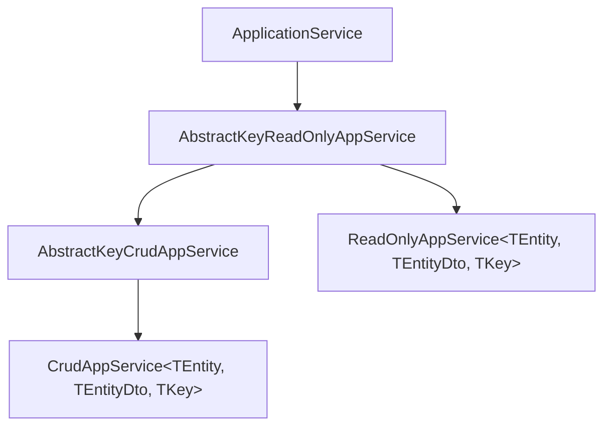

In ABP's DDD layering, **application services** are the orchestration layer
that converts incoming DTOs into domain operations, applies authorization, and
shapes results for the caller. The runtime base classes live in
`framework/src/Volo.Abp.Ddd.Application/Volo/Abp/Application/Services/`; the
contracts (interfaces) live in
`framework/src/Volo.Abp.Ddd.Application.Contracts/Volo/Abp/Application/Services/`.
Splitting them lets clients reference only the lightweight contracts package.

## File inventory

### Contracts (`Volo.Abp.Ddd.Application.Contracts`)

| Path (under `…/Volo/Abp/Application/Services/`) | Role |
| --- | --- |
| `IApplicationService.cs` | Marker that extends `IRemoteService` |
| `IReadOnlyAppService.cs` | `GetAsync` + `GetListAsync` |
| `ICreateAppService.cs` | `CreateAsync` |
| `IUpdateAppService.cs` | `UpdateAsync` |
| `IDeleteAppService.cs` | `DeleteAsync` |
| `ICreateUpdateAppService.cs` | Combined create + update contract |
| `ICrudAppService.cs` | Full CRUD contract |

### Implementations (`Volo.Abp.Ddd.Application`)

| Path (under `…/Volo/Abp/Application/Services/`) | Role |
| --- | --- |
| `ApplicationService.cs` | Base — DI, mapping, authorization, localization |
| `AbstractKeyReadOnlyAppService.cs` | Read-only CRUD with abstract id resolver |
| `AbstractKeyCrudAppService.cs` | Full CRUD with abstract id resolver |
| `ReadOnlyAppService.cs` | Read-only CRUD specialising on `IEntity<TKey>` |
| `CrudAppService.cs` | Full CRUD specialising on `IEntity<TKey>` |

## `IApplicationService` marker

```csharp framework/src/Volo.Abp.Ddd.Application.Contracts/Volo/Abp/Application/Services/IApplicationService.cs
namespace Volo.Abp.Application.Services;

public interface IApplicationService : IRemoteService
{

}
```

Two roles:

1. Identifies an application service for conventional registration (auto-DI).
2. Inherits `IRemoteService`, which makes the type a candidate for the
   [HTTP API auto-discovery](/web/auto-api-controllers) — every public method
   becomes an HTTP endpoint without writing a controller.

The application module excludes `IApplicationService` (along with
`IRemoteService`, `IUnitOfWorkEnabled`, etc.) from the generated API
description so it doesn't appear as a "feature" of every service:

```csharp framework/src/Volo.Abp.Ddd.Application/Volo/Abp/Application/AbpDddApplicationModule.cs
public override void ConfigureServices(ServiceConfigurationContext context)
{
    Configure<AbpApiDescriptionModelOptions>(options =>
    {
        options.IgnoredInterfaces.AddIfNotContains(typeof(IRemoteService));
        options.IgnoredInterfaces.AddIfNotContains(typeof(IApplicationService));
        options.IgnoredInterfaces.AddIfNotContains(typeof(IUnitOfWorkEnabled));
        options.IgnoredInterfaces.AddIfNotContains(typeof(IAuditingEnabled));
        options.IgnoredInterfaces.AddIfNotContains(typeof(IValidationEnabled));
        options.IgnoredInterfaces.AddIfNotContains(typeof(IGlobalFeatureCheckingEnabled));
    });
}
```

## `ApplicationService` base

`ApplicationService` is the concrete base every other CRUD class extends. It
piggybacks on `IAbpLazyServiceProvider` so adding a dependency doesn't break
constructor chains.

```csharp framework/src/Volo.Abp.Ddd.Application/Volo/Abp/Application/Services/ApplicationService.cs
public abstract class ApplicationService :
    IApplicationService,
    IAvoidDuplicateCrossCuttingConcerns,
    IValidationEnabled,
    IUnitOfWorkEnabled,
    IAuditingEnabled,
    IGlobalFeatureCheckingEnabled,
    ITransientDependency
{
    public IAbpLazyServiceProvider LazyServiceProvider { get; set; } = default!;

    [Obsolete("Use LazyServiceProvider instead.")]
    public IServiceProvider ServiceProvider { get; set; } = default!;

    public static string[] CommonPostfixes { get; set; } = { "AppService", "ApplicationService", "Service" };

    public List<string> AppliedCrossCuttingConcerns { get; } = new();
```

Each marker interface drives a framework behavior:

| Interface | What the framework does |
| --- | --- |
| `ITransientDependency` | Auto-registered, transient lifetime |
| `IUnitOfWorkEnabled` | UoW interceptor wraps every method in a UoW |
| `IValidationEnabled` | DTOs and parameters are validated before the call |
| `IAuditingEnabled` | Calls are logged by the auditing interceptor |
| `IAvoidDuplicateCrossCuttingConcerns` | Cross-cutting concerns aren't applied twice when one service calls another |
| `IGlobalFeatureCheckingEnabled` | `[RequiresGlobalFeature]` checks fire |

`CommonPostfixes` controls how the application module converts class names to
service names — `BookAppService` exposes as `Book`, `OrderApplicationService`
as `Order`, etc.

### Lazy-loaded helpers

```csharp framework/src/Volo.Abp.Ddd.Application/Volo/Abp/Application/Services/ApplicationService.cs
protected IUnitOfWorkManager UnitOfWorkManager => LazyServiceProvider.LazyGetRequiredService<IUnitOfWorkManager>();

protected IAsyncQueryableExecuter AsyncExecuter => LazyServiceProvider.LazyGetRequiredService<IAsyncQueryableExecuter>();

protected Type? ObjectMapperContext { get; set; }
protected IObjectMapper ObjectMapper => LazyServiceProvider.LazyGetService<IObjectMapper>(provider =>
    ObjectMapperContext == null
        ? provider.GetRequiredService<IObjectMapper>()
        : (IObjectMapper)provider.GetRequiredService(typeof(IObjectMapper<>).MakeGenericType(ObjectMapperContext)));

protected IGuidGenerator GuidGenerator => LazyServiceProvider.LazyGetService<IGuidGenerator>(SimpleGuidGenerator.Instance);

protected ICurrentTenant CurrentTenant => LazyServiceProvider.LazyGetRequiredService<ICurrentTenant>();

protected IDataFilter DataFilter => LazyServiceProvider.LazyGetRequiredService<IDataFilter>();

protected ICurrentUser CurrentUser => LazyServiceProvider.LazyGetRequiredService<ICurrentUser>();

protected ISettingProvider SettingProvider => LazyServiceProvider.LazyGetRequiredService<ISettingProvider>();

protected IClock Clock => LazyServiceProvider.LazyGetRequiredService<IClock>();

protected IAuthorizationService AuthorizationService => LazyServiceProvider.LazyGetRequiredService<IAuthorizationService>();

protected IFeatureChecker FeatureChecker => LazyServiceProvider.LazyGetRequiredService<IFeatureChecker>();

protected IStringLocalizerFactory StringLocalizerFactory => LazyServiceProvider.LazyGetRequiredService<IStringLocalizerFactory>();
```

The `ObjectMapperContext` mechanism is what makes `IObjectMapper<TContext>`
work — set the property in a derived service's constructor (or via
`ObjectMapperContext = typeof(MyModule)`) and the resolved mapper uses only
profiles registered for that context. See [Object mapping](/ddd/object-mapping).

### Policy checks

```csharp framework/src/Volo.Abp.Ddd.Application/Volo/Abp/Application/Services/ApplicationService.cs
protected virtual async Task CheckPolicyAsync(string? policyName)
{
    if (string.IsNullOrEmpty(policyName))
    {
        return;
    }

    await AuthorizationService.CheckAsync(policyName!);
}
```

CRUD subclasses expose `CreatePolicyName`, `UpdatePolicyName`, `DeletePolicyName`,
`GetPolicyName`, `GetListPolicyName` properties that are checked through this
helper. Set them in your service's constructor:

```csharp
public BookAppService(IRepository<Book, Guid> repository)
    : base(repository)
{
    GetPolicyName = BookStorePermissions.Books.Default;
    GetListPolicyName = BookStorePermissions.Books.Default;
    CreatePolicyName = BookStorePermissions.Books.Create;
    UpdatePolicyName = BookStorePermissions.Books.Edit;
    DeletePolicyName = BookStorePermissions.Books.Delete;
}
```

## `IReadOnlyAppService<TEntityDto, TKey>`

```csharp framework/src/Volo.Abp.Ddd.Application.Contracts/Volo/Abp/Application/Services/IReadOnlyAppService.cs
public interface IReadOnlyAppService<TEntityDto, in TKey>
    : IReadOnlyAppService<TEntityDto, TEntityDto, TKey, PagedAndSortedResultRequestDto>
{

}

public interface IReadOnlyAppService<TGetOutputDto, TGetListOutputDto, in TKey, in TGetListInput>
    : IApplicationService
{
    Task<TGetOutputDto> GetAsync(TKey id);

    Task<PagedResultDto<TGetListOutputDto>> GetListAsync(TGetListInput input);
}
```

`PagedResultDto<T>` is documented on [Data transfer objects](/ddd/data-transfer-objects).

## `ICrudAppService<TEntityDto, TKey>`

```csharp framework/src/Volo.Abp.Ddd.Application.Contracts/Volo/Abp/Application/Services/ICrudAppService.cs
public interface ICrudAppService<TGetOutputDto, TGetListOutputDto, in TKey, in TGetListInput, in TCreateInput, in TUpdateInput>
    : IReadOnlyAppService<TGetOutputDto, TGetListOutputDto, TKey, TGetListInput>,
        ICreateUpdateAppService<TGetOutputDto, TKey, TCreateInput, TUpdateInput>,
        IDeleteAppService<TKey>
{

}
```

The decomposition lets you mix-and-match — a "read-only + delete" service is
expressible by combining `IReadOnlyAppService` and `IDeleteAppService` instead
of `ICrudAppService`:

```csharp framework/src/Volo.Abp.Ddd.Application.Contracts/Volo/Abp/Application/Services/ICreateAppService.cs
public interface ICreateAppService<TGetOutputDto, in TCreateInput> : IApplicationService
{
    Task<TGetOutputDto> CreateAsync(TCreateInput input);
}
```

```csharp framework/src/Volo.Abp.Ddd.Application.Contracts/Volo/Abp/Application/Services/IDeleteAppService.cs
public interface IDeleteAppService<in TKey> : IApplicationService
{
    Task DeleteAsync(TKey id);
}
```

```csharp framework/src/Volo.Abp.Ddd.Application.Contracts/Volo/Abp/Application/Services/IUpdateAppService.cs
public interface IUpdateAppService<TGetOutputDto, in TKey, in TUpdateInput> : IApplicationService
{
    Task<TGetOutputDto> UpdateAsync(TKey id, TUpdateInput input);
}
```

## `AbstractKeyReadOnlyAppService`

`AbstractKeyReadOnlyAppService` works against any entity (it requires
`IEntity`, not `IEntity<TKey>`) — the subclass must implement
`GetEntityByIdAsync(TKey)` to resolve the row. That makes it the right base
when the entity has a composite key or you want to look up by a natural id.

```csharp framework/src/Volo.Abp.Ddd.Application/Volo/Abp/Application/Services/AbstractKeyReadOnlyAppService.cs
public abstract class AbstractKeyReadOnlyAppService<TEntity, TGetOutputDto, TGetListOutputDto, TKey, TGetListInput>
    : ApplicationService
    , IReadOnlyAppService<TGetOutputDto, TGetListOutputDto, TKey, TGetListInput>
    where TEntity : class, IEntity
{
    protected IReadOnlyRepository<TEntity> ReadOnlyRepository { get; }

    protected virtual string? GetPolicyName { get; set; }

    protected virtual string? GetListPolicyName { get; set; }

    public virtual async Task<TGetOutputDto> GetAsync(TKey id)
    {
        await CheckGetPolicyAsync();

        var entity = await GetEntityByIdAsync(id);

        return await MapToGetOutputDtoAsync(entity);
    }

    public virtual async Task<PagedResultDto<TGetListOutputDto>> GetListAsync(TGetListInput input)
    {
        await CheckGetListPolicyAsync();

        var query = await CreateFilteredQueryAsync(input);
        var totalCount = await AsyncExecuter.CountAsync(query);

        var entities = new List<TEntity>();
        var entityDtos = new List<TGetListOutputDto>();

        if (totalCount > 0)
        {
            query = ApplySorting(query, input);
            query = ApplyPaging(query, input);

            entities = await AsyncExecuter.ToListAsync(query);
            entityDtos = await MapToGetListOutputDtosAsync(entities);
        }

        return new PagedResultDto<TGetListOutputDto>(
            totalCount,
            entityDtos
        );
    }

    protected abstract Task<TEntity> GetEntityByIdAsync(TKey id);
```

Notice how the implementation uses `AsyncExecuter` (an
`IAsyncQueryableExecuter`) — the same `GetListAsync` runs unchanged under EF
Core or MongoDB.

### Sorting and paging

```csharp framework/src/Volo.Abp.Ddd.Application/Volo/Abp/Application/Services/AbstractKeyReadOnlyAppService.cs
protected virtual IQueryable<TEntity> ApplySorting(IQueryable<TEntity> query, TGetListInput input)
{
    //Try to sort query if available
    if (input is ISortedResultRequest sortInput)
    {
        if (!sortInput.Sorting.IsNullOrWhiteSpace())
        {
            return query.OrderBy(sortInput.Sorting!);
        }
    }

    //IQueryable.Task requires sorting, so we should sort if Take will be used.
    if (input is ILimitedResultRequest)
    {
        return ApplyDefaultSorting(query);
    }
```

The `OrderBy(string)` call uses `System.Linq.Dynamic.Core`, so input like
`"Name desc"` or `"CreationTime,Id desc"` works out of the box.

## `AbstractKeyCrudAppService`

`AbstractKeyCrudAppService` builds on `AbstractKeyReadOnlyAppService` to add
the write methods. The contract is generic over **seven** type parameters in
its most general form, with overloads that fix common defaults:

```csharp framework/src/Volo.Abp.Ddd.Application/Volo/Abp/Application/Services/AbstractKeyCrudAppService.cs
public abstract class AbstractKeyCrudAppService<TEntity, TGetOutputDto, TGetListOutputDto, TKey, TGetListInput, TCreateInput, TUpdateInput>
    : AbstractKeyReadOnlyAppService<TEntity, TGetOutputDto, TGetListOutputDto, TKey, TGetListInput>,
        ICrudAppService<TGetOutputDto, TGetListOutputDto, TKey, TGetListInput, TCreateInput, TUpdateInput>
    where TEntity : class, IEntity
{
    protected IRepository<TEntity> Repository { get; }

    protected virtual string? CreatePolicyName { get; set; }

    protected virtual string? UpdatePolicyName { get; set; }

    protected virtual string? DeletePolicyName { get; set; }
```

```csharp framework/src/Volo.Abp.Ddd.Application/Volo/Abp/Application/Services/AbstractKeyCrudAppService.cs
public virtual async Task<TGetOutputDto> CreateAsync(TCreateInput input)
{
    await CheckCreatePolicyAsync();

    var entity = await MapToEntityAsync(input);

    TryToSetTenantId(entity);

    await Repository.InsertAsync(entity, autoSave: true);

    return await MapToGetOutputDtoAsync(entity);
}

public virtual async Task<TGetOutputDto> UpdateAsync(TKey id, TUpdateInput input)
{
    await CheckUpdatePolicyAsync();

    var entity = await GetEntityByIdAsync(id);
    //TODO: Check if input has id different than given id and normalize if it's default value, throw ex otherwise
    await MapToEntityAsync(input, entity);
    await Repository.UpdateAsync(entity, autoSave: true);

    return await MapToGetOutputDtoAsync(entity);
}

public virtual async Task DeleteAsync(TKey id)
{
    await CheckDeletePolicyAsync();

    await DeleteByIdAsync(id);
}
```

### Default mapping

`MapToEntityAsync` defers to `MapToEntity`, which calls into
`ObjectMapper.Map<TCreateInput, TEntity>(...)` — so configuring AutoMapper
profiles between your DTOs and entities is enough to get CRUD working
end-to-end:

```csharp framework/src/Volo.Abp.Ddd.Application/Volo/Abp/Application/Services/AbstractKeyCrudAppService.cs
protected virtual Task<TEntity> MapToEntityAsync(TCreateInput createInput)
{
    return Task.FromResult(MapToEntity(createInput));
}

protected virtual TEntity MapToEntity(TCreateInput createInput)
{
    var entity = ObjectMapper.Map<TCreateInput, TEntity>(createInput);
    SetIdForGuids(entity);
    return entity;
}
```

## `CrudAppService<TEntity, TEntityDto, TKey>`

The most common entry point. It constrains `TEntity : IEntity<TKey>` and
`TEntityDto : IEntityDto<TKey>` so the abstract `GetEntityByIdAsync` /
`DeleteByIdAsync` are implemented for you against `IRepository<TEntity, TKey>`.

```csharp framework/src/Volo.Abp.Ddd.Application/Volo/Abp/Application/Services/CrudAppService.cs
public abstract class CrudAppService<TEntity, TEntityDto, TKey>
    : CrudAppService<TEntity, TEntityDto, TKey, PagedAndSortedResultRequestDto>
    where TEntity : class, IEntity<TKey>
    where TEntityDto : IEntityDto<TKey>
{
    protected CrudAppService(IRepository<TEntity, TKey> repository)
        : base(repository)
    {

    }
}

public abstract class CrudAppService<TEntity, TEntityDto, TKey, TGetListInput>
    : CrudAppService<TEntity, TEntityDto, TKey, TGetListInput, TEntityDto>
    where TEntity : class, IEntity<TKey>
    where TEntityDto : IEntityDto<TKey>
{
    protected CrudAppService(IRepository<TEntity, TKey> repository)
        : base(repository)
    {

    }
}
```

The full inheritance chain — useful when you need separate create/update DTOs:

```csharp framework/src/Volo.Abp.Ddd.Application/Volo/Abp/Application/Services/CrudAppService.cs
public abstract class CrudAppService<TEntity, TEntityDto, TKey, TGetListInput, TCreateInput, TUpdateInput>
    : CrudAppService<TEntity, TEntityDto, TEntityDto, TKey, TGetListInput, TCreateInput, TUpdateInput>
    where TEntity : class, IEntity<TKey>
    where TEntityDto : IEntityDto<TKey>
```

## `ReadOnlyAppService<TEntity, TEntityDto, TKey>`

```csharp framework/src/Volo.Abp.Ddd.Application/Volo/Abp/Application/Services/ReadOnlyAppService.cs
public abstract class ReadOnlyAppService<TEntity, TEntityDto, TKey>
    : ReadOnlyAppService<TEntity, TEntityDto, TEntityDto, TKey, PagedAndSortedResultRequestDto>
    where TEntity : class, IEntity<TKey>
    where TEntityDto : IEntityDto<TKey>
{
    protected ReadOnlyAppService(IReadOnlyRepository<TEntity, TKey> repository)
        : base(repository)
    {

    }
}
```

Takes an `IReadOnlyRepository<TEntity, TKey>` and gives you `GetAsync` +
`GetListAsync` for free.

## Class hierarchy



## Application service service-name conventions

The `CommonPostfixes` array tells the HTTP API auto-controller generator how
to name routes. With `CommonPostfixes = { "AppService", "ApplicationService", "Service" }`:

| Class name | Route name |
| --- | --- |
| `BookAppService` | `Book` |
| `OrderApplicationService` | `Order` |
| `MailService` | `Mail` |
| `BookManagementAppService` | `BookManagement` |

You can override `CommonPostfixes` once during startup if you need a different
convention.

## A complete CRUD service

```csharp BookAppService.cs (pattern)
public class BookAppService :
    CrudAppService<Book, BookDto, Guid, PagedAndSortedResultRequestDto, CreateUpdateBookDto>,
    IBookAppService
{
    public BookAppService(IRepository<Book, Guid> repository)
        : base(repository)
    {
        GetPolicyName = BookStorePermissions.Books.Default;
        GetListPolicyName = BookStorePermissions.Books.Default;
        CreatePolicyName = BookStorePermissions.Books.Create;
        UpdatePolicyName = BookStorePermissions.Books.Edit;
        DeletePolicyName = BookStorePermissions.Books.Delete;
    }
}
```

This class:

- Inherits seven framework methods (`GetAsync`, `GetListAsync`, `CreateAsync`,
  `UpdateAsync`, `DeleteAsync`, plus base helpers).
- Exposes itself as `IBookAppService` over HTTP via dynamic controllers.
- Wraps every method in a unit of work, validates inputs, checks the named
  policy, and audits the call.

## Cross-cutting interceptor pipeline


`IAvoidDuplicateCrossCuttingConcerns` prevents these interceptors from running
twice when one application service calls another in the same scope.

## Choosing the right base

<CardGroup cols={2}>
  <Card title="`CrudAppService<…, TKey>`" icon="rectangle-list">
    Default. Entity has an `Id` of `TKey` and a matching DTO.
  </Card>
  <Card title="`ReadOnlyAppService<…, TKey>`" icon="eye">
    Query-only services that don't expose Create / Update / Delete.
  </Card>
  <Card title="`AbstractKeyCrudAppService<…, TKey>`" icon="key">
    Custom identifier (composite key, natural id). Implement
    `GetEntityByIdAsync`.
  </Card>
  <Card title="`ApplicationService`" icon="screwdriver-wrench">
    Anything that isn't CRUD — checkout flow, reporting, batch jobs.
  </Card>
</CardGroup>

## Related pages

- [DTOs](/ddd/data-transfer-objects) — `EntityDto`, `PagedResultDto`,
  `PagedAndSortedResultRequestDto`.
- [Repositories](/ddd/repositories) — the constructor dependency.
- [Object mapping](/ddd/object-mapping) — drives `MapToEntity` /
  `MapToGetOutputDto`.
- [Unit of Work](/uow/overview) — UoW interceptor wraps every method call.
- [Domain services](/ddd/domain-services) — typically composed by application services.
