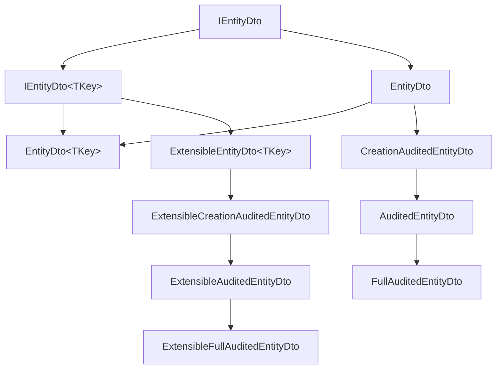

In the ABP Framework, DTOs are the lingua franca between application services
and their clients — HTTP, Blazor WebAssembly, dynamic C# / TypeScript proxies.
Because they cross the wire, they live in a separate package from the
implementations: `Volo.Abp.Ddd.Application.Contracts`. This page is a
walk-through of every DTO base class and request / response interface ABP
ships, with the real signatures from
`framework/src/Volo.Abp.Ddd.Application.Contracts/Volo/Abp/Application/Dtos/`.

## File inventory

| Path (under `framework/src/Volo.Abp.Ddd.Application.Contracts/Volo/Abp/Application/Dtos/`) | Role |
| --- | --- |
| `IEntityDto.cs` | `IEntityDto`, `IEntityDto<TKey>` markers |
| `EntityDto.cs` | `EntityDto`, `EntityDto<TKey>` base |
| `CreationAuditedEntityDto.cs` | + `CreationTime`, `CreatorId` |
| `AuditedEntityDto.cs` | + `LastModificationTime`, `LastModifierId` |
| `FullAuditedEntityDto.cs` | + `IsDeleted`, `DeleterId`, `DeletionTime` |
| `CreationAuditedEntityWithUserDto.cs` | Audited variant with `TUser` navigation |
| `AuditedEntityWithUserDto.cs` | Audited variant with `TUser` |
| `FullAuditedEntityWithUserDto.cs` | Full-audited variant with `TUser` |
| `ExtensibleEntityDto.cs` | `IHasExtraProperties` DTO base |
| `ExtensibleCreationAuditedEntityDto.cs` | + extras + creation audit |
| `ExtensibleAuditedEntityDto.cs` | + extras + audit |
| `ExtensibleFullAuditedEntityDto.cs` | + extras + full audit |
| `Extensible*WithUserDto.cs` | + user navigation |
| `IListResult.cs` | `Items` collection |
| `ListResultDto.cs` | `ListResultDto<T>` + extensible variant |
| `IPagedResult.cs` | List + `TotalCount` |
| `IHasTotalCount.cs` | `long TotalCount { get; set; }` |
| `PagedResultDto.cs` | `PagedResultDto<T>` + extensible variant |
| `ILimitedResultRequest.cs` | `MaxResultCount` |
| `IPagedResultRequest.cs` | + `SkipCount` |
| `ISortedResultRequest.cs` | `Sorting` |
| `IPagedAndSortedResultRequest.cs` | Combined |
| `LimitedResultRequestDto.cs` | `MaxResultCount` + validator |
| `PagedResultRequestDto.cs` | + `SkipCount` |
| `PagedAndSortedResultRequestDto.cs` | + `Sorting` — the default for `CrudAppService` |

## `IEntityDto` and `IEntityDto<TKey>`

```csharp framework/src/Volo.Abp.Ddd.Application.Contracts/Volo/Abp/Application/Dtos/IEntityDto.cs
public interface IEntityDto
{

}

public interface IEntityDto<TKey> : IEntityDto
{
    TKey Id { get; set; }
}
```

`IEntityDto` is a pure marker. `IEntityDto<TKey>` is the constraint applied to
the output DTO in `CrudAppService` — the framework relies on it to map between
the DTO's `Id` and the underlying entity's `Id`.

## `EntityDto` base

```csharp framework/src/Volo.Abp.Ddd.Application.Contracts/Volo/Abp/Application/Dtos/EntityDto.cs
[Serializable]
public abstract class EntityDto : IEntityDto //TODO: Consider to delete this class
{
    public override string ToString()
    {
        return $"[DTO: {GetType().Name}]";
    }
}

[Serializable]
public abstract class EntityDto<TKey> : EntityDto, IEntityDto<TKey>
{
    /// <summary>
    /// Id of the entity.
    /// </summary>
    public TKey Id { get; set; } = default!;

    public override string ToString()
    {
        return $"[DTO: {GetType().Name}] Id = {Id}";
    }
}
```

`EntityDto<TKey>` exposes `Id` with a public setter (DTOs are deliberately
mutable — they're transport, not behavior). The non-generic `EntityDto` is
marked with a `TODO` comment to be deleted; new code should always pass a
`TKey`.

## Auditing DTO ladder

The auditing DTO ladder mirrors the entity ladder
([Entities and aggregates](/ddd/entities-and-aggregates)) so a service can map
an entity to its DTO without losing any audit information.

### `CreationAuditedEntityDto`

```csharp framework/src/Volo.Abp.Ddd.Application.Contracts/Volo/Abp/Application/Dtos/CreationAuditedEntityDto.cs
[Serializable]
public abstract class CreationAuditedEntityDto : EntityDto, ICreationAuditedObject
{
    public DateTime CreationTime { get; set; }
    public Guid? CreatorId { get; set; }
}

[Serializable]
public abstract class CreationAuditedEntityDto<TPrimaryKey> : EntityDto<TPrimaryKey>, ICreationAuditedObject
{
    public DateTime CreationTime { get; set; }
    public Guid? CreatorId { get; set; }
}
```

### `AuditedEntityDto`

```csharp framework/src/Volo.Abp.Ddd.Application.Contracts/Volo/Abp/Application/Dtos/AuditedEntityDto.cs
[Serializable]
public abstract class AuditedEntityDto : CreationAuditedEntityDto, IAuditedObject
{
    public DateTime? LastModificationTime { get; set; }
    public Guid? LastModifierId { get; set; }
}

[Serializable]
public abstract class AuditedEntityDto<TPrimaryKey> : CreationAuditedEntityDto<TPrimaryKey>, IAuditedObject
{
    public DateTime? LastModificationTime { get; set; }
    public Guid? LastModifierId { get; set; }
}
```

### `FullAuditedEntityDto`

```csharp framework/src/Volo.Abp.Ddd.Application.Contracts/Volo/Abp/Application/Dtos/FullAuditedEntityDto.cs
[Serializable]
public abstract class FullAuditedEntityDto : AuditedEntityDto, IFullAuditedObject
{
    public bool IsDeleted { get; set; }
    public Guid? DeleterId { get; set; }
    public DateTime? DeletionTime { get; set; }
}

[Serializable]
public abstract class FullAuditedEntityDto<TPrimaryKey> : AuditedEntityDto<TPrimaryKey>, IFullAuditedObject
{
    public bool IsDeleted { get; set; }
    public Guid? DeleterId { get; set; }
    public DateTime? DeletionTime { get; set; }
}
```

These implement the same `IAuditedObject` / `IFullAuditedObject` interfaces as
the entity base classes, so the AutoMapper profile in
[Object mapping](/ddd/object-mapping) flows the audit triple without explicit
member configuration.

## Extensible DTO ladder

Extensible DTOs add `IHasExtraProperties` so dynamic / module-extension data
flows through the wire alongside the typed properties.

```csharp framework/src/Volo.Abp.Ddd.Application.Contracts/Volo/Abp/Application/Dtos/ExtensibleEntityDto.cs
[Serializable]
public abstract class ExtensibleEntityDto<TKey> : ExtensibleObject, IEntityDto<TKey>
{
    public TKey Id { get; set; } = default!;

    protected ExtensibleEntityDto()
        : this(true)
    {

    }

    protected ExtensibleEntityDto(bool setDefaultsForExtraProperties)
        : base(setDefaultsForExtraProperties)
    {

    }

    public override string ToString()
    {
        return $"[DTO: {GetType().Name}] Id = {Id}";
    }
}

[Serializable]
public abstract class ExtensibleEntityDto : ExtensibleObject, IEntityDto
{
    protected ExtensibleEntityDto()
        : this(true)
    {

    }

    protected ExtensibleEntityDto(bool setDefaultsForExtraProperties)
        : base(setDefaultsForExtraProperties)
    {

    }

    public override string ToString()
    {
        return $"[DTO: {GetType().Name}]";
    }
}
```

The `setDefaultsForExtraProperties` flag controls whether the constructor pulls
the default values for every registered extra property (see
[Object extending](/data/abp-data)).

The full extensible chain mirrors the regular chain:

```csharp framework/src/Volo.Abp.Ddd.Application.Contracts/Volo/Abp/Application/Dtos/ExtensibleAuditedEntityDto.cs
[Serializable]
public abstract class ExtensibleAuditedEntityDto<TPrimaryKey> : ExtensibleCreationAuditedEntityDto<TPrimaryKey>, IAuditedObject
{
    public DateTime? LastModificationTime { get; set; }
    public Guid? LastModifierId { get; set; }

    protected ExtensibleAuditedEntityDto() : this(true) { }

    protected ExtensibleAuditedEntityDto(bool setDefaultsForExtraProperties) : base(setDefaultsForExtraProperties) { }
}
```

```csharp framework/src/Volo.Abp.Ddd.Application.Contracts/Volo/Abp/Application/Dtos/ExtensibleFullAuditedEntityDto.cs
[Serializable]
public abstract class ExtensibleFullAuditedEntityDto<TPrimaryKey> : ExtensibleAuditedEntityDto<TPrimaryKey>, IFullAuditedObject
{
    public bool IsDeleted { get; set; }
    public Guid? DeleterId { get; set; }
    public DateTime? DeletionTime { get; set; }
}
```

## DTO hierarchy



## List and paged result contracts

### `IListResult<T>` and `ListResultDto<T>`

```csharp framework/src/Volo.Abp.Ddd.Application.Contracts/Volo/Abp/Application/Dtos/IListResult.cs
public interface IListResult<T>
{
    /// <summary>
    /// List of items.
    /// </summary>
    IReadOnlyList<T> Items { get; set; }
}
```

```csharp framework/src/Volo.Abp.Ddd.Application.Contracts/Volo/Abp/Application/Dtos/ListResultDto.cs
[Serializable]
public class ListResultDto<T> : IListResult<T>
{
    public IReadOnlyList<T> Items
    {
        get { return _items ?? (_items = new List<T>()); }
        set { _items = value; }
    }
    private IReadOnlyList<T>? _items;

    public ListResultDto() { }

    public ListResultDto(IReadOnlyList<T> items)
    {
        Items = items;
    }
}
```

The `_items ?? (_items = new List<T>())` pattern makes `Items` non-nullable
even when the consumer doesn't initialise it.

### `IPagedResult<T>` and `PagedResultDto<T>`

```csharp framework/src/Volo.Abp.Ddd.Application.Contracts/Volo/Abp/Application/Dtos/IPagedResult.cs
public interface IPagedResult<T> : IListResult<T>, IHasTotalCount
{

}
```

```csharp framework/src/Volo.Abp.Ddd.Application.Contracts/Volo/Abp/Application/Dtos/IHasTotalCount.cs
public interface IHasTotalCount
{
    /// <summary>
    /// Total count of Items.
    /// </summary>
    long TotalCount { get; set; }
}
```

```csharp framework/src/Volo.Abp.Ddd.Application.Contracts/Volo/Abp/Application/Dtos/PagedResultDto.cs
[Serializable]
public class PagedResultDto<T> : ListResultDto<T>, IPagedResult<T>
{
    public long TotalCount { get; set; } //TODO: Can be a long value..?

    public PagedResultDto() { }

    public PagedResultDto(long totalCount, IReadOnlyList<T> items)
        : base(items)
    {
        TotalCount = totalCount;
    }
}
```

`PagedResultDto<T>` is what `CrudAppService.GetListAsync` returns — the
caller gets `Items` plus the total row count regardless of how many were
included in the page. Notice that `TotalCount` is `long`, so very large
tables don't overflow the count.

There's an `ExtensiblePagedResultDto<T>` for cases where the page itself
carries `ExtraProperties` (e.g. aggregate sums alongside the items).

## Request DTO interfaces

```csharp framework/src/Volo.Abp.Ddd.Application.Contracts/Volo/Abp/Application/Dtos/ILimitedResultRequest.cs
public interface ILimitedResultRequest
{
    int MaxResultCount { get; set; }
}
```

```csharp framework/src/Volo.Abp.Ddd.Application.Contracts/Volo/Abp/Application/Dtos/IPagedResultRequest.cs
public interface IPagedResultRequest : ILimitedResultRequest
{
    int SkipCount { get; set; }
}
```

```csharp framework/src/Volo.Abp.Ddd.Application.Contracts/Volo/Abp/Application/Dtos/ISortedResultRequest.cs
public interface ISortedResultRequest
{
    /// <summary>
    /// Sorting information.
    /// Should include sorting field and optionally a direction (ASC or DESC)
    /// Can contain more than one field separated by comma (,).
    /// </summary>
    string? Sorting { get; set; }
}
```

`Sorting` accepts strings like `"Name"`, `"Name DESC"`, `"Name ASC, Age DESC"`.
`AbstractKeyReadOnlyAppService.ApplySorting` (see
[Application services](/ddd/application-services)) parses these with
`System.Linq.Dynamic.Core`.

```csharp framework/src/Volo.Abp.Ddd.Application.Contracts/Volo/Abp/Application/Dtos/IPagedAndSortedResultRequest.cs
public interface IPagedAndSortedResultRequest : IPagedResultRequest, ISortedResultRequest
{

}
```

## Request DTO implementations

### `LimitedResultRequestDto` — validating `MaxResultCount`

```csharp framework/src/Volo.Abp.Ddd.Application.Contracts/Volo/Abp/Application/Dtos/LimitedResultRequestDto.cs
[Serializable]
public class LimitedResultRequestDto : ILimitedResultRequest, IValidatableObject
{
    /// <summary>
    /// Default value: 10.
    /// </summary>
    public static int DefaultMaxResultCount { get; set; } = 10;

    /// <summary>
    /// Maximum possible value of the <see cref="MaxResultCount"/>.
    /// Default value: 1,000.
    /// </summary>
    public static int MaxMaxResultCount { get; set; } = 1000;

    [Range(1, int.MaxValue)]
    public virtual int MaxResultCount { get; set; } = DefaultMaxResultCount;

    public virtual IEnumerable<ValidationResult> Validate(ValidationContext validationContext)
    {
        if (MaxResultCount > MaxMaxResultCount)
        {
            var localizer = validationContext.GetRequiredService<IStringLocalizer<AbpDddApplicationContractsResource>>();

            yield return new ValidationResult(
                localizer[
                    "MaxResultCountExceededExceptionMessage",
                    nameof(MaxResultCount),
                    MaxMaxResultCount,
                    typeof(LimitedResultRequestDto).FullName!,
                    nameof(MaxMaxResultCount)
                ],
                new[] { nameof(MaxResultCount) });
        }
    }
}
```

Two safety nets are built in:

- `[Range(1, int.MaxValue)]` rejects zero / negative values at model
  binding.
- `Validate` enforces a globally-configurable upper bound
  (`MaxMaxResultCount`, default 1,000) to prevent a malicious client from
  asking for a one-million-row page.

You can change the defaults once at startup:

```csharp
LimitedResultRequestDto.DefaultMaxResultCount = 25;
LimitedResultRequestDto.MaxMaxResultCount = 500;
```

### `PagedResultRequestDto`

```csharp framework/src/Volo.Abp.Ddd.Application.Contracts/Volo/Abp/Application/Dtos/PagedResultRequestDto.cs
[Serializable]
public class PagedResultRequestDto : LimitedResultRequestDto, IPagedResultRequest
{
    [Range(0, int.MaxValue)]
    public virtual int SkipCount { get; set; }
}
```

### `PagedAndSortedResultRequestDto`

```csharp framework/src/Volo.Abp.Ddd.Application.Contracts/Volo/Abp/Application/Dtos/PagedAndSortedResultRequestDto.cs
[Serializable]
public class PagedAndSortedResultRequestDto : PagedResultRequestDto, IPagedAndSortedResultRequest
{
    public virtual string? Sorting { get; set; }
}
```

This is the default `TGetListInput` for `CrudAppService<TEntity, TEntityDto, TKey>`
— so a client calling `GET /api/app/book` can pass `MaxResultCount`,
`SkipCount`, and `Sorting` without any additional work in the service.

## Putting it together

```csharp BookListDto.cs (pattern)
public class BookListDto : EntityDto<Guid>
{
    public string Name { get; set; } = default!;
    public BookType Type { get; set; }
    public DateTime PublishDate { get; set; }
    public float Price { get; set; }
}

public class GetBookListInput : PagedAndSortedResultRequestDto
{
    public string? Filter { get; set; }
    public BookType? Type { get; set; }
}
```

```csharp BookAppService.cs (pattern)
public class BookAppService :
    CrudAppService<Book, BookDto, Guid, GetBookListInput, CreateUpdateBookDto>,
    IBookAppService
{
    public BookAppService(IRepository<Book, Guid> repository)
        : base(repository) { }

    protected override async Task<IQueryable<Book>> CreateFilteredQueryAsync(GetBookListInput input)
    {
        var query = await base.CreateFilteredQueryAsync(input);
        return query
            .WhereIf(input.Type.HasValue, b => b.Type == input.Type)
            .WhereIf(!input.Filter.IsNullOrWhiteSpace(), b => b.Name.Contains(input.Filter!));
    }
}
```

## Result vs request — quick reference


## Choosing the right DTO base

<CardGroup cols={2}>
  <Card title="`EntityDto<TKey>`" icon="circle-dot">
    Simple read DTOs that just carry an Id and a few fields.
  </Card>
  <Card title="`AuditedEntityDto<TKey>`" icon="user-clock">
    When you want the audit triple (creation + modification) on the wire.
  </Card>
  <Card title="`FullAuditedEntityDto<TKey>`" icon="trash-arrow-up">
    Soft-deletable rows — clients can see `IsDeleted` flags.
  </Card>
  <Card title="`ExtensibleEntityDto<TKey>`" icon="puzzle-piece">
    Module-extension data — `ExtraProperties` flows alongside typed fields.
  </Card>
</CardGroup>

## Localization resource

The validation message used by `LimitedResultRequestDto.Validate` is fetched
from `AbpDddApplicationContractsResource`. The module registers it via
virtual files:

```csharp framework/src/Volo.Abp.Ddd.Application.Contracts/Volo/Abp/Application/AbpDddApplicationContractsModule.cs
Configure<AbpLocalizationOptions>(options =>
{
    options.Resources
        .Add<AbpDddApplicationContractsResource>("en")
        .AddVirtualJson("/Volo/Abp/Application/Localization/Resources/AbpDdd");
});
```

You can override the message by registering a translation for
`MaxResultCountExceededExceptionMessage` in your own localization resource.

## Related pages

- [Application services](/ddd/application-services) — `CrudAppService` consumes these DTOs.
- [Object mapping](/ddd/object-mapping) — how DTOs are mapped from entities.
- [Entities and aggregates](/ddd/entities-and-aggregates) — the audit ladder mirrors this one.
- [Object extending](/data/abp-data) — how `ExtraProperties` flows.
- [HTTP API auto-controllers](/web/auto-api-controllers) — surfaces these DTOs as JSON.
