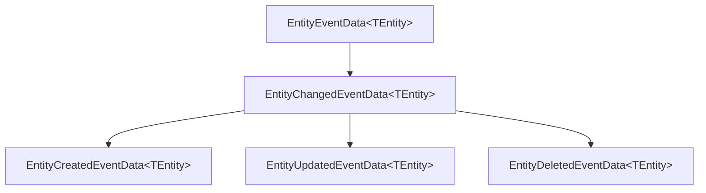
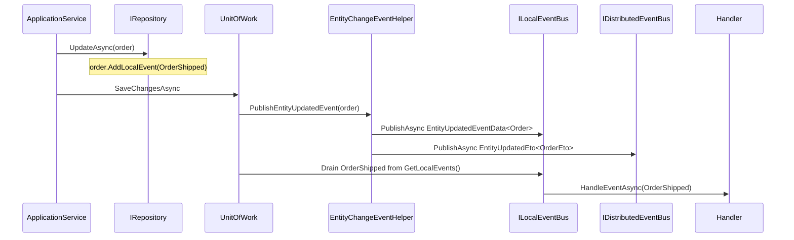

The ABP Framework distinguishes between **business domain events** that an
aggregate raises explicitly (via `BasicAggregateRoot.AddLocalEvent`) and
**entity change events** that the persistence layer emits automatically when
rows are inserted, updated, or deleted. Both flow through `ILocalEventBus`, and
both use the strongly-typed event-data classes in
`framework/src/Volo.Abp.Ddd.Domain/Volo/Abp/Domain/Entities/Events/`. This page
walks through every event class and the helper that publishes them.

## File inventory

| Path (under `framework/src/Volo.Abp.Ddd.Domain/Volo/Abp/Domain/Entities/Events/`) | Role |
| --- | --- |
| `EntityEventData.cs` | Generic base — wraps the entity, exposes tenant |
| `EntityChangedEventData.cs` | Base for create/update/delete |
| `EntityCreatedEventData.cs` | "After insert" event |
| `EntityUpdatedEventData.cs` | "After update" event |
| `EntityDeletedEventData.cs` | "After delete" event |
| `EntityChangeEventHelper.cs` | Publishes the local and distributed events |
| `IEntityChangeEventHelper.cs` | Helper contract |
| `NullEntityChangeEventHelper.cs` | No-op default for testing |
| `EntityEventReport.cs` | Aggregates the per-entity entries during UoW |
| `EntityChangeEntry.cs` | A single change record (entity + change type) |
| `DomainEventEntry.cs` | A queued business event with its order |
| `Distributed/EntitySynchronizer.cs` | Handler base for distributed entity replication |
| `Distributed/EntityToEtoMapper.cs` | Maps entity → ETO for the distributed bus |
| `Distributed/AutoEntityDistributedEventSelectorListExtensions.cs` | Selector list helper |

Related types in `framework/src/Volo.Abp.Ddd.Domain/Volo/Abp/Domain/Entities/`:

| Path | Role |
| --- | --- |
| `IGeneratesDomainEvents.cs` | Aggregate hook for local + distributed event queues |
| `DomainEventRecord.cs` | Wraps an event with a monotonic ordering counter |

ETO (Event Transfer Object) classes for the distributed bus live in
`Volo.Abp.Ddd.Domain.Shared`:

| Path | Role |
| --- | --- |
| `framework/src/Volo.Abp.Ddd.Domain.Shared/Volo/Abp/Domain/Entities/Events/Distributed/EntityEto.cs` | Generic ETO base |
| `EntityCreatedEto.cs` / `EntityUpdatedEto.cs` / `EntityDeletedEto.cs` | Distributed change ETOs |
| `EtoMappingDictionary.cs` | Entity → ETO registration |
| `AbpDistributedEntityEventOptions.cs` | Configuration / selector list |

## The event-data type hierarchy



### `EntityEventData<TEntity>` — the base

```csharp framework/src/Volo.Abp.Ddd.Domain/Volo/Abp/Domain/Entities/Events/EntityEventData.cs
[Serializable]
public class EntityEventData<TEntity> : IEventDataWithInheritableGenericArgument, IEventDataMayHaveTenantId
{
    /// <summary>
    /// Related entity with this event.
    /// </summary>
    public TEntity Entity { get; }

    public EntityEventData(TEntity entity)
    {
        Entity = entity;
    }

    public virtual object[] GetConstructorArgs()
    {
        return new object[] { Entity! };
    }

    public virtual bool IsMultiTenant(out Guid? tenantId)
    {
        if (Entity is IMultiTenant multiTenantEntity)
        {
            tenantId = multiTenantEntity.TenantId;
            return true;
        }

        tenantId = null;
        return false;
    }
}
```

Two notable design choices:

- The class implements `IEventDataWithInheritableGenericArgument` so handlers
  registered for `EntityCreatedEventData<TBaseEntity>` also receive events for
  derived entity types.
- Tenant id is exposed automatically when the entity implements `IMultiTenant`,
  which lets distributed event handlers re-establish the tenant scope.

### `EntityChangedEventData<TEntity>`

```csharp framework/src/Volo.Abp.Ddd.Domain/Volo/Abp/Domain/Entities/Events/EntityChangedEventData.cs
[Serializable]
public class EntityChangedEventData<TEntity> : EntityEventData<TEntity>
{
    public EntityChangedEventData(TEntity entity)
        : base(entity)
    {

    }
}
```

A common base — useful when you want to handle "any change" without
distinguishing create vs update vs delete.

### `EntityCreatedEventData<TEntity>` / `Updated` / `Deleted`

```csharp framework/src/Volo.Abp.Ddd.Domain/Volo/Abp/Domain/Entities/Events/EntityCreatedEventData.cs
[Serializable]
public class EntityCreatedEventData<TEntity> : EntityChangedEventData<TEntity>
{
    public EntityCreatedEventData(TEntity entity)
        : base(entity)
    {

    }
}
```

```csharp framework/src/Volo.Abp.Ddd.Domain/Volo/Abp/Domain/Entities/Events/EntityUpdatedEventData.cs
[Serializable]
public class EntityUpdatedEventData<TEntity> : EntityChangedEventData<TEntity>
{
    public EntityUpdatedEventData(TEntity entity)
        : base(entity)
    {

    }
}
```

```csharp framework/src/Volo.Abp.Ddd.Domain/Volo/Abp/Domain/Entities/Events/EntityDeletedEventData.cs
[Serializable]
public class EntityDeletedEventData<TEntity> : EntityChangedEventData<TEntity>
{
    public EntityDeletedEventData(TEntity entity)
        : base(entity)
    {

    }
}
```

## Handling entity events

Implement `ILocalEventHandler<TEvent>` and the conventional registrar wires
your class as a transient event handler. The interface lives in the event-bus
abstractions module:

```csharp framework/src/Volo.Abp.EventBus.Abstractions/Volo/Abp/EventBus/Local/ILocalEventHandler.cs
public interface ILocalEventHandler<in TEvent> : IEventHandler
{
    /// <summary>
    /// Handler handles the event by implementing this method.
    /// </summary>
    Task HandleEventAsync(TEvent eventData);
}
```

A typical handler:

```csharp UserCreatedAuditHandler.cs (pattern)
public class UserCreatedAuditHandler :
    ILocalEventHandler<EntityCreatedEventData<User>>,
    ITransientDependency
{
    private readonly ILogger<UserCreatedAuditHandler> _logger;

    public UserCreatedAuditHandler(ILogger<UserCreatedAuditHandler> logger)
    {
        _logger = logger;
    }

    public Task HandleEventAsync(EntityCreatedEventData<User> eventData)
    {
        _logger.LogInformation("User {Id} created", eventData.Entity.Id);
        return Task.CompletedTask;
    }
}
```

Because `EntityEventData` implements `IEventDataWithInheritableGenericArgument`,
a handler registered for `EntityCreatedEventData<User>` also receives the event
when a `MembershipUser : User` row is inserted.

## How events get published

Entity change events are not raised by the entity — they're raised by the
**persistence layer** through `IEntityChangeEventHelper` after a row is
inserted, updated, or deleted. The default implementation lives in the domain
module:

```csharp framework/src/Volo.Abp.Ddd.Domain/Volo/Abp/Domain/Entities/Events/EntityChangeEventHelper.cs
public class EntityChangeEventHelper : IEntityChangeEventHelper, ITransientDependency
{
    private const string UnitOfWorkEventRecordEntityPropName = "_Abp_Entity";

    public ILogger<EntityChangeEventHelper> Logger { get; set; }
    public ILocalEventBus LocalEventBus { get; set; }
    public IDistributedEventBus DistributedEventBus { get; set; }

    protected IUnitOfWorkManager UnitOfWorkManager { get; }
    protected IEntityToEtoMapper EntityToEtoMapper { get; }
    protected AbpDistributedEntityEventOptions DistributedEntityEventOptions { get; }
```

It pushes one entry per change into the current unit of work, which dispatches
them after `SaveChanges`. The "after the commit succeeds" guarantee is the
reason ABP integrates events with the [unit of work](/uow/overview).

```csharp framework/src/Volo.Abp.Ddd.Domain/Volo/Abp/Domain/Entities/Events/EntityChangeEventHelper.cs
public virtual void PublishEntityCreatedEvent(object entity)
{
    TriggerEventWithEntity(
        LocalEventBus,
        typeof(EntityCreatedEventData<>),
        entity,
        entity
    );

    if (ShouldPublishDistributedEventForEntity(entity))
    {
        var eto = EntityToEtoMapper.Map(entity);
        if (eto != null)
        {
            TriggerEventWithEntity(
                DistributedEventBus,
                typeof(EntityCreatedEto<>),
                eto,
                entity
            );
        }
    }
}
```

Distributed events are gated by `AbpDistributedEntityEventOptions.AutoEventSelectors`
— add a selector for your entity type to opt in. See the
[Distributed events](/events/overview) page for details.

## Business events from aggregates

For events that express **business intent** (e.g. `OrderShipped`) rather than
"any row changed", the aggregate queues the event with `AddLocalEvent` (from
`BasicAggregateRoot`). The persistence layer then drains
`IGeneratesDomainEvents.GetLocalEvents()` after `SaveChanges`:

```csharp framework/src/Volo.Abp.Ddd.Domain/Volo/Abp/Domain/Entities/IGeneratesDomainEvents.cs
public interface IGeneratesDomainEvents
{
    IEnumerable<DomainEventRecord> GetLocalEvents();
    IEnumerable<DomainEventRecord> GetDistributedEvents();
    void ClearLocalEvents();
    void ClearDistributedEvents();
}
```

The `DomainEventRecord` wraps each event with a monotonic order counter so the
dispatcher fires them in the order they were raised across all aggregates
touched in a UoW:

```csharp framework/src/Volo.Abp.Ddd.Domain/Volo/Abp/Domain/Entities/DomainEventRecord.cs
public class DomainEventRecord
{
    public object EventData { get; }
    public long EventOrder { get; }

    public DomainEventRecord(object eventData, long eventOrder)
    {
        EventData = eventData;
        EventOrder = eventOrder;
    }
}
```

## End-to-end publishing flow



The key invariant: events are **only** dispatched after the UoW commits the
write. If the transaction rolls back, queued events are discarded.

## Distributed ETOs in `Domain.Shared`

`Domain.Shared` ships flat ETO types so consumers — including microservices on
the other side of the bus — can deserialize them without referencing the full
domain assembly:

```csharp framework/src/Volo.Abp.Ddd.Domain.Shared/Volo/Abp/Domain/Entities/Events/Distributed/EntityEto.cs
[Serializable]
public class EntityEto : EtoBase
{
    public string EntityType { get; set; } = default!;
    public string KeysAsString { get; set; } = default!;

    public EntityEto() { }

    public EntityEto(string entityType, string keysAsString)
    {
        EntityType = entityType;
        KeysAsString = keysAsString;
    }
}

public abstract class EntityEto<TKey> : IEntityEto<TKey>
{
    public TKey Id { get; set; } = default!;
}
```

```csharp framework/src/Volo.Abp.Ddd.Domain.Shared/Volo/Abp/Domain/Entities/Events/Distributed/EntityCreatedEto.cs
[Serializable]
[GenericEventName(Postfix = ".Created")]
public class EntityCreatedEto<TEntityEto> : IEventDataMayHaveTenantId
{
    public TEntityEto Entity { get; set; }

    public EntityCreatedEto(TEntityEto entity)
    {
        Entity = entity;
    }

    public virtual bool IsMultiTenant(out Guid? tenantId)
    {
        if (Entity is IMultiTenant multiTenantEntity)
        {
            tenantId = multiTenantEntity.TenantId;
            return true;
        }

        tenantId = null;
        return false;
    }
}
```

`[GenericEventName(Postfix = ".Created")]` controls the message topic produced
by the distributed event bus integration (RabbitMQ / Kafka / Azure Service Bus).

## Patterns

### Subscribe across the inheritance chain

Because `EntityCreatedEventData<T>` extends `EntityChangedEventData<T>`, a
single handler registered for `EntityChangedEventData<Order>` is invoked for
every create / update / delete on `Order`:

```csharp
public class OrderHistoryProjector :
    ILocalEventHandler<EntityChangedEventData<Order>>,
    ITransientDependency
{
    public Task HandleEventAsync(EntityChangedEventData<Order> eventData)
    {
        return _projector.AppendAsync(eventData.Entity);
    }
}
```

### Handler order

Inside a single UoW, business events queued with `AddLocalEvent` are dispatched
in `EventOrder` ascending order, then entity-change events are dispatched in
insertion order. Handlers cannot rely on cross-handler ordering — design
handlers to be idempotent.

### Disable distributed events for an entity

Don't add the entity to `AbpDistributedEntityEventOptions.AutoEventSelectors`,
or register a no-op `IEntityToEtoMapper` for the type. See the
[Distributed events](/events/overview) reference for the selector API.

## Choosing the right event

<CardGroup cols={2}>
  <Card title="Entity change event" icon="bolt">
    Use `EntityCreatedEventData<T>` / `Updated` / `Deleted` when you need
    "something happened to a row" — projection, cache invalidation, audit logs.
  </Card>
  <Card title="Business domain event" icon="megaphone">
    Use a custom event class queued with `AddLocalEvent` when the meaning is
    business-level (e.g. `OrderShipped`, `PasswordReset`).
  </Card>
</CardGroup>

## Related pages

- [Entities and aggregates](/ddd/entities-and-aggregates) — `BasicAggregateRoot.AddLocalEvent`.
- [Unit of Work](/uow/overview) — the commit hook that drains events.
- [Event bus](/events/overview) — local vs distributed dispatcher, handlers, retry.
- [Multi-tenancy](/multitenancy/overview) — `IEventDataMayHaveTenantId` and tenant re-establishment.
- [Application services](/ddd/application-services) — usually the call site that triggers the change.
