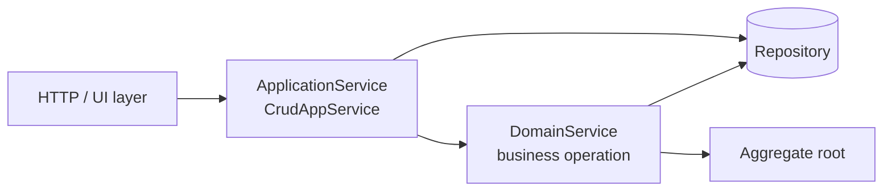

A **domain service** in the ABP Framework is the home for business operations
that don't naturally fit on a single aggregate — typically because they
coordinate multiple aggregates, validate against an invariant that spans the
boundary, or call out to a repository to look something up before acting. The
contract lives in `framework/src/Volo.Abp.Ddd.Domain/Volo/Abp/Domain/Services/`
and consists of just two files: a marker interface and a convenience base
class.

## File inventory

| Path | Role |
| --- | --- |
| `framework/src/Volo.Abp.Ddd.Domain/Volo/Abp/Domain/Services/IDomainService.cs` | Marker — also `ITransientDependency` |
| `framework/src/Volo.Abp.Ddd.Domain/Volo/Abp/Domain/Services/DomainService.cs` | Abstract base with lazy resolution of framework services |

The deliberate smallness is the design: domain services should be your own
types, expressing your business vocabulary. ABP only provides registration and
a comfortable place to reach the cross-cutting helpers.

## `IDomainService`

```csharp framework/src/Volo.Abp.Ddd.Domain/Volo/Abp/Domain/Services/IDomainService.cs
using Volo.Abp.DependencyInjection;

namespace Volo.Abp.Domain.Services;

/// <summary>
/// This interface can be implemented by all domain services to identify them by convention.
/// </summary>
public interface IDomainService : ITransientDependency
{

}
```

Two effects from this two-line definition:

1. Any class that implements `IDomainService` is **auto-registered** by the
   [conventional registrar](/di/conventional-registration) as a transient
   service, exposed under its implemented interfaces.
2. The framework can identify "this is a domain service" anywhere it reflects
   over types (auditing selectors, source generators, etc.).

`ITransientDependency` lives in
`framework/src/Volo.Abp.Core/Volo/Abp/DependencyInjection/ITransientDependency.cs`.
Marking `IDomainService` with it means every domain service is transient by
default — wrap-and-discard semantics fit business operations better than
singletons.

## `DomainService` base class

The base class wires in `IAbpLazyServiceProvider` and exposes the most-used
framework services as protected properties:

```csharp framework/src/Volo.Abp.Ddd.Domain/Volo/Abp/Domain/Services/DomainService.cs
public abstract class DomainService : IDomainService
{
    public IAbpLazyServiceProvider LazyServiceProvider { get; set; } = default!;

    [Obsolete("Use LazyServiceProvider instead.")]
    public IServiceProvider ServiceProvider { get; set; } = default!;

    protected IClock Clock => LazyServiceProvider.LazyGetRequiredService<IClock>();

    protected IGuidGenerator GuidGenerator => LazyServiceProvider.LazyGetService<IGuidGenerator>(SimpleGuidGenerator.Instance);

    protected ILoggerFactory LoggerFactory => LazyServiceProvider.LazyGetRequiredService<ILoggerFactory>();

    protected ICurrentTenant CurrentTenant => LazyServiceProvider.LazyGetRequiredService<ICurrentTenant>();

    protected IAsyncQueryableExecuter AsyncExecuter => LazyServiceProvider.LazyGetRequiredService<IAsyncQueryableExecuter>();

    protected ILogger Logger => LazyServiceProvider.LazyGetService<ILogger>(provider => LoggerFactory?.CreateLogger(GetType().FullName!) ?? NullLogger.Instance);
}
```

Property injection through `IAbpLazyServiceProvider` is intentional — it keeps
constructors compact even when the service grows over time. See the
[Lazy service provider](/di/lazy-service-provider) page for the inner workings.

## What the base class gives you

| Property | Type | Resolved from |
| --- | --- | --- |
| `Clock` | `IClock` | `Volo.Abp.Timing` — abstracted now/utcnow |
| `GuidGenerator` | `IGuidGenerator` | `Volo.Abp.Guids` — sequential or simple GUIDs |
| `LoggerFactory` | `ILoggerFactory` | `Microsoft.Extensions.Logging` |
| `CurrentTenant` | `ICurrentTenant` | `Volo.Abp.MultiTenancy` |
| `AsyncExecuter` | `IAsyncQueryableExecuter` | `Volo.Abp.Threading.IAsyncQueryableExecuter` |
| `Logger` | `ILogger` | `LoggerFactory.CreateLogger(this.GetType().FullName)` |

Everything else is resolved on demand: inject other services through
constructor parameters or pull them with `LazyServiceProvider.LazyGetRequiredService<T>()`.

## Anatomy of a domain service

```csharp PasswordResetService.cs (pattern)
public class PasswordResetService : DomainService
{
    private readonly IRepository<User, Guid> _userRepository;
    private readonly IPasswordHasher _passwordHasher;

    public PasswordResetService(
        IRepository<User, Guid> userRepository,
        IPasswordHasher passwordHasher)
    {
        _userRepository = userRepository;
        _passwordHasher = passwordHasher;
    }

    public async Task ResetAsync(Guid userId, string newPassword)
    {
        var user = await _userRepository.GetAsync(userId);

        if (user.IsLocked)
        {
            throw new BusinessException("PasswordReset:UserLocked");
        }

        user.SetPasswordHash(_passwordHasher.Hash(newPassword));
        user.MarkResetAt(Clock.Now);

        await _userRepository.UpdateAsync(user);
    }
}
```

Key conventions visible here:

- Inject **repositories** by their interface so the service stays testable.
- Use `Clock.Now` rather than `DateTime.Now` to keep the operation
  deterministic in tests.
- Throw a `BusinessException` (from `Volo.Abp`) for domain rule violations —
  ABP translates those to localised messages on the wire.

## Registration via conventional registrar

Because `IDomainService : ITransientDependency`, the
[`DefaultConventionalRegistrar`](/di/conventional-registration) picks up your
class without an attribute. The exposed services are determined by
`IExposedServiceTypesProvider`:

- All implemented interfaces (excluding framework markers).
- The concrete class itself.

So a `PasswordResetService` is resolvable as `PasswordResetService` or as any
custom `IPasswordResetService` you define on it.

## Domain services vs application services



| Aspect | Domain service | Application service |
| --- | --- | --- |
| Lives in | `Volo.Abp.Ddd.Domain` (server only) | `Volo.Abp.Ddd.Application` (server only) |
| Vocabulary | Domain ubiquitous language | Use cases, screens |
| Inputs / outputs | Entities, value objects | DTOs |
| Knows about UoW? | Indirectly via repository | Yes — wraps operations in UoW |
| Authorization | None | Yes (`AuthorizationService`, `[Authorize]`) |
| Validation | Domain invariants | DTO validation via `IValidationEnabled` |
| Object mapping | Rare | Frequent (`IObjectMapper`) |

A safe rule: if the operation talks about DTOs or requires authorization, it
belongs on an `ApplicationService` that *calls* a `DomainService`. If it
expresses a pure business rule, it belongs on the `DomainService`.

## Using `AsyncExecuter` from a domain service

When the operation needs to look something up in addition to the supplied
aggregate, project through `IRepository.GetQueryableAsync()` and execute it
with `AsyncExecuter`:

```csharp UniqueUsernameChecker.cs (pattern)
public class UniqueUsernameChecker : DomainService
{
    private readonly IRepository<User, Guid> _users;

    public UniqueUsernameChecker(IRepository<User, Guid> users) => _users = users;

    public async Task CheckAsync(string username, Guid? expectedId = null)
    {
        var queryable = await _users.GetQueryableAsync();
        queryable = queryable.Where(u => u.NormalizedUsername == username.ToUpperInvariant());

        if (expectedId.HasValue)
        {
            queryable = queryable.Where(u => u.Id != expectedId.Value);
        }

        if (await AsyncExecuter.AnyAsync(queryable))
        {
            throw new BusinessException("Account:UsernameAlreadyTaken")
                .WithData("Username", username);
        }
    }
}
```

`AsyncExecuter` is provider-agnostic: this same code works under EF Core and
MongoDB without rewriting it. See [Repositories](/ddd/repositories).

## Object mapping inside a domain service

Domain services seldom need `IObjectMapper`, but when they do (typically when
mapping between two value objects or between a snapshot and an entity), inject
it explicitly:

```csharp
public class OrderArchiver : DomainService
{
    private readonly IObjectMapper _objectMapper;
    private readonly IRepository<OrderArchive, Guid> _archives;

    public OrderArchiver(IObjectMapper objectMapper, IRepository<OrderArchive, Guid> archives)
    {
        _objectMapper = objectMapper;
        _archives = archives;
    }

    public async Task ArchiveAsync(Order order)
    {
        var snapshot = _objectMapper.Map<Order, OrderArchive>(order);
        await _archives.InsertAsync(snapshot);
    }
}
```

See [Object mapping](/ddd/object-mapping) for the `IObjectMapper` contract.

## Domain events from domain services

Domain services do not call `ILocalEventBus` directly. Instead they mutate an
aggregate which raises the event through `AddLocalEvent` — the persistence
layer then drains the queue after `SaveChanges`. Compare:

<CardGroup cols={2}>
  <Card title="✅ Idiomatic" icon="check">
    Mutate the aggregate so the event is raised in the same atomic update.
  </Card>
  <Card title="❌ Avoid" icon="xmark">
    Calling `ILocalEventBus.PublishAsync` from the service skips the UoW
    guarantee that the event only fires when the change is committed.
  </Card>
</CardGroup>

```csharp Promoter.cs (pattern)
public class Promoter : DomainService
{
    public Task PromoteAsync(Member member, MemberLevel newLevel)
    {
        member.PromoteTo(newLevel, Clock.Now); // raises MemberPromotedEvent via AddLocalEvent
        return Task.CompletedTask;
    }
}
```

See [Domain events](/ddd/domain-events) for the full event flow.

## Naming conventions

ABP modules consistently use the **noun + role** pattern for domain services:

| Pattern | Examples |
| --- | --- |
| `*Manager` | `IdentityUserManager`, `OrganizationUnitManager` |
| `*Checker` | `PasswordValidator`, `UniqueChecker` |
| `*Calculator` | `DiscountCalculator`, `TaxCalculator` |
| `*Generator` | `InvoiceNumberGenerator` |

The pattern matters more than the suffix — pick a word that reflects the
domain operation rather than its plumbing.

## Lifetime caveat

Because `IDomainService : ITransientDependency`, a domain service is created
**per resolution**. If you cache something on `this` it will not be shared
across calls. Use `LazyServiceProvider.LazyGetRequiredService<TCache>()` to
reach a singleton cache instead.

## Testing

Domain services compose naturally in unit tests — instantiate with mock
repositories and assign the framework helpers through property injection:

```csharp
[Fact]
public async Task ShouldThrowWhenUsernameTaken()
{
    var clock = new ManualClock(DateTime.UtcNow);
    var lazy = TestLazyServiceProvider.With(clock);
    var sut = new UniqueUsernameChecker(repoMock.Object)
    {
        LazyServiceProvider = lazy
    };

    await Should.ThrowAsync<BusinessException>(() => sut.CheckAsync("alice"));
}
```

(`Should.ThrowAsync` comes from Shouldly, a common dependency in ABP tests.)

## Related pages

- [Application services](/ddd/application-services) — how higher-level services compose domain services.
- [Repositories](/ddd/repositories) — the typical collaborator.
- [Entities and aggregates](/ddd/entities-and-aggregates) — domain services orchestrate aggregate methods.
- [Lazy service provider](/di/lazy-service-provider) — backs the `LazyServiceProvider` property.
- [Object mapping](/ddd/object-mapping) — for occasional snapshot mapping.
