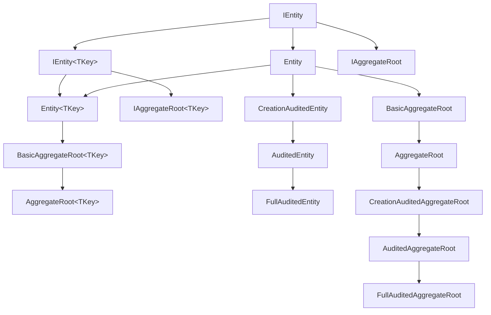

In the ABP Framework, the building blocks for the **transactional model** —
entities, aggregate roots, and the cross-cutting interfaces they implement
(auditing, soft delete, multi-tenancy, concurrency, extensibility) — live in
`framework/src/Volo.Abp.Ddd.Domain/Volo/Abp/Domain/Entities/`. This page walks
through each abstraction with real signatures, shows the inheritance chain, and
explains which interface controls which framework behavior.

## File inventory

| Path (under `framework/src/Volo.Abp.Ddd.Domain/Volo/Abp/Domain/Entities/`) | Role |
| --- | --- |
| `IEntity.cs` | `IEntity` and `IEntity<TKey>` interfaces |
| `Entity.cs` | `Entity` / `Entity<TKey>` abstract base |
| `EntityHelper.cs` | Reflection-based helpers used by the framework |
| `IAggregateRoot.cs` | `IAggregateRoot` / `IAggregateRoot<TKey>` markers |
| `BasicAggregateRoot.cs` | Aggregate root **without** extra properties or concurrency stamp |
| `AggregateRoot.cs` | Aggregate root **with** `ExtraProperties` and `ConcurrencyStamp` |
| `IGeneratesDomainEvents.cs` | Aggregate-event collection contract |
| `DomainEventRecord.cs` | Wrapper for a queued event |
| `ConcurrencyStampConsts.cs` | Field length constants |
| `DisableIdGenerationAttribute.cs` | Skip GUID auto-generation |
| `Auditing/CreationAuditedEntity.cs` | + `CreationTime` / `CreatorId` |
| `Auditing/AuditedEntity.cs` | + `LastModificationTime` / `LastModifierId` |
| `Auditing/FullAuditedEntity.cs` | + `IsDeleted` / `DeleterId` / `DeletionTime` |
| `Auditing/CreationAuditedAggregateRoot.cs` | Same audit triplet for aggregates |
| `Auditing/AuditedAggregateRoot.cs` | Same audit pair for aggregates |
| `Auditing/FullAuditedAggregateRoot.cs` | Aggregate variant with soft delete |
| `Auditing/*WithUser.cs` | Variants with `TUser` navigation property |

The cross-cutting interfaces implemented by these classes live in **other**
packages:

| Interface | Source |
| --- | --- |
| `IHasCreationTime` | `Volo.Abp.Auditing.Contracts/Volo/Abp/Auditing/IHasCreationTime.cs` |
| `ICreationAuditedObject` | `Volo.Abp.Auditing.Contracts/Volo/Abp/Auditing/ICreationAuditedObject.cs` |
| `IAuditedObject` | `Volo.Abp.Auditing.Contracts/Volo/Abp/Auditing/IAuditedObject.cs` |
| `IFullAuditedObject` | `Volo.Abp.Auditing.Contracts/Volo/Abp/Auditing/IFullAuditedObject.cs` |
| `ISoftDelete` | `Volo.Abp.Core/Volo/Abp/ISoftDelete.cs` |
| `IMultiTenant` | `Volo.Abp.MultiTenancy.Abstractions/Volo/Abp/MultiTenancy/IMultiTenant.cs` |
| `IHasConcurrencyStamp` | `Volo.Abp.Data/Volo/Abp/Domain/Entities/IHasConcurrencyStamp.cs` |
| `IHasExtraProperties` | `Volo.Abp.ObjectExtending/Volo/Abp/Data/IHasExtraProperties.cs` |

## `IEntity` and `IEntity<TKey>`

`IEntity` is the lowest-level contract. It returns the **ordered key tuple** for
the entity, supporting both single and composite primary keys.

```csharp framework/src/Volo.Abp.Ddd.Domain/Volo/Abp/Domain/Entities/IEntity.cs
public interface IEntity
{
    /// <summary>
    /// Returns an array of ordered keys for this entity.
    /// </summary>
    object?[] GetKeys();
}

public interface IEntity<TKey> : IEntity
{
    /// <summary>
    /// Unique identifier for this entity.
    /// </summary>
    TKey Id { get; }
}
```

When the entity has a single primary key, prefer `IEntity<TKey>` — repositories,
DTO base classes, and CRUD application services all key off it.

## `Entity` and `Entity<TKey>`

The abstract `Entity` base implements `IEntity` and is responsible for two
things: setting the `TenantId` automatically when the entity is constructed
inside a tenant scope, and exposing an `EntityEquals` helper that compares two
entities by their ordered key tuple (and tenant if applicable).

```csharp framework/src/Volo.Abp.Ddd.Domain/Volo/Abp/Domain/Entities/Entity.cs
[Serializable]
public abstract class Entity : IEntity
{
    protected Entity()
    {
        EntityHelper.TrySetTenantId(this);
    }

    public override string ToString()
    {
        return $"[ENTITY: {GetType().Name}] Keys = {GetKeys().JoinAsString(", ")}";
    }

    public abstract object?[] GetKeys();

    public bool EntityEquals(IEntity other)
    {
        return EntityHelper.EntityEquals(this, other);
    }
}

[Serializable]
public abstract class Entity<TKey> : Entity, IEntity<TKey>
{
    public virtual TKey Id { get; protected set; } = default!;

    protected Entity() { }

    protected Entity(TKey id) { Id = id; }

    public override object?[] GetKeys()
    {
        return new object?[] { Id };
    }

    public override string ToString()
    {
        return $"[ENTITY: {GetType().Name}] Id = {Id}";
    }
}
```

<Tip>
`Entity<TKey>.Id` has a `protected set;` so consumers cannot mutate the identifier
after construction. Pick `Guid` for distributed-friendly IDs and let
`IGuidGenerator` (from the `AbpGuidsModule` dependency) populate it.
</Tip>

## Aggregate marker interfaces

`IAggregateRoot` and `IAggregateRoot<TKey>` are pure markers. Their only job is
to signal "this entity is the consistency boundary for its subgraph", which is
the cue the framework uses to choose which entity gets a repository, which one
publishes events, and which one is the target of the auditing interceptor.

```csharp framework/src/Volo.Abp.Ddd.Domain/Volo/Abp/Domain/Entities/IAggregateRoot.cs
public interface IAggregateRoot : IEntity { }

public interface IAggregateRoot<TKey> : IEntity<TKey>, IAggregateRoot { }
```

## `BasicAggregateRoot`

`BasicAggregateRoot` is the lightest aggregate base. It does **not** add
`ExtraProperties` or `ConcurrencyStamp` — use it when you want a slim entity that
still raises local and distributed domain events.

```csharp framework/src/Volo.Abp.Ddd.Domain/Volo/Abp/Domain/Entities/BasicAggregateRoot.cs
[Serializable]
public abstract class BasicAggregateRoot : Entity,
    IAggregateRoot,
    IGeneratesDomainEvents
{
    private readonly ICollection<DomainEventRecord> _distributedEvents = new Collection<DomainEventRecord>();
    private readonly ICollection<DomainEventRecord> _localEvents = new Collection<DomainEventRecord>();

    public virtual IEnumerable<DomainEventRecord> GetLocalEvents() => _localEvents;
    public virtual IEnumerable<DomainEventRecord> GetDistributedEvents() => _distributedEvents;

    public virtual void ClearLocalEvents() => _localEvents.Clear();
    public virtual void ClearDistributedEvents() => _distributedEvents.Clear();

    protected virtual void AddLocalEvent(object eventData)
    {
        _localEvents.Add(new DomainEventRecord(eventData, EventOrderGenerator.GetNext()));
    }

    protected virtual void AddDistributedEvent(object eventData)
    {
        _distributedEvents.Add(new DomainEventRecord(eventData, EventOrderGenerator.GetNext()));
    }
}
```

`IGeneratesDomainEvents` is the contract that the persistence layer inspects
after `SaveChanges` to publish queued events.

```csharp framework/src/Volo.Abp.Ddd.Domain/Volo/Abp/Domain/Entities/IGeneratesDomainEvents.cs
public interface IGeneratesDomainEvents
{
    IEnumerable<DomainEventRecord> GetLocalEvents();
    IEnumerable<DomainEventRecord> GetDistributedEvents();
    void ClearLocalEvents();
    void ClearDistributedEvents();
}
```

Each enqueued event becomes a `DomainEventRecord` — `EventData` plus an ordering
counter from `EventOrderGenerator`, used by the dispatcher to fire events in the
order they were raised across all aggregates touched in a single
[unit of work](/uow/overview).

```csharp framework/src/Volo.Abp.Ddd.Domain/Volo/Abp/Domain/Entities/DomainEventRecord.cs
public class DomainEventRecord
{
    public object EventData { get; }
    public long EventOrder { get; }

    public DomainEventRecord(object eventData, long eventOrder)
    {
        EventData = eventData;
        EventOrder = eventOrder;
    }
}
```

## `AggregateRoot`

`AggregateRoot` is the "fully loaded" aggregate base — it extends
`BasicAggregateRoot` with `IHasExtraProperties` (for dynamic properties via
[ObjectExtending](/data/abp-data)) and `IHasConcurrencyStamp` (optimistic
concurrency).

```csharp framework/src/Volo.Abp.Ddd.Domain/Volo/Abp/Domain/Entities/AggregateRoot.cs
[Serializable]
public abstract class AggregateRoot : BasicAggregateRoot,
    IHasExtraProperties,
    IHasConcurrencyStamp
{
    public virtual ExtraPropertyDictionary ExtraProperties { get; protected set; }

    [DisableAuditing]
    public virtual string ConcurrencyStamp { get; set; }

    protected AggregateRoot()
    {
        ConcurrencyStamp = Guid.NewGuid().ToString("N");
        ExtraProperties = new ExtraPropertyDictionary();
        this.SetDefaultsForExtraProperties();
    }

    public virtual IEnumerable<ValidationResult> Validate(ValidationContext validationContext)
    {
        return ExtensibleObjectValidator.GetValidationErrors(
            this,
            validationContext
        );
    }
}
```

`AggregateRoot<TKey>` has the same body plus an `Id` constructor. The
`[DisableAuditing]` attribute on `ConcurrencyStamp` tells the audit-logging
interceptor not to record changes to that field (it changes on every write and
would otherwise generate noise).

## The cross-cutting marker interfaces

Aggregates and entities pick up framework behavior by implementing one or more
of the following interfaces.

### `IHasConcurrencyStamp`

```csharp framework/src/Volo.Abp.Data/Volo/Abp/Domain/Entities/IHasConcurrencyStamp.cs
namespace Volo.Abp.Domain.Entities;

public interface IHasConcurrencyStamp
{
    string ConcurrencyStamp { get; set; }
}
```

The EF Core integration maps this field as a row-version equivalent so that
`UpdateAsync` throws on concurrent edits.

### `ISoftDelete`

```csharp framework/src/Volo.Abp.Core/Volo/Abp/ISoftDelete.cs
public interface ISoftDelete
{
    bool IsDeleted { get; }
}
```

Implemented automatically by `FullAuditedEntity` / `FullAuditedAggregateRoot`.
The repository base filters out soft-deleted rows when `IDataFilter` is enabled
for `ISoftDelete` — see the snippet from `RepositoryBase` below.

### `IMultiTenant`

```csharp framework/src/Volo.Abp.MultiTenancy.Abstractions/Volo/Abp/MultiTenancy/IMultiTenant.cs
public interface IMultiTenant
{
    /// <summary>
    /// Id of the related tenant.
    /// </summary>
    Guid? TenantId { get; }
}
```

`Entity`'s constructor invokes `EntityHelper.TrySetTenantId(this)` which reads
the current tenant from `ICurrentTenant` and assigns `TenantId` for entities
that implement `IMultiTenant`. See [Multi-tenancy](/multitenancy/overview) for
the full picture.

<Note>
ABP does not ship an `IMustHaveTenant` interface — host-level entities use
`Guid? TenantId` from `IMultiTenant` and `null` represents the host.
</Note>

### `IHasExtraProperties`

```csharp framework/src/Volo.Abp.ObjectExtending/Volo/Abp/Data/IHasExtraProperties.cs
namespace Volo.Abp.Data;

public interface IHasExtraProperties
{
    ExtraPropertyDictionary ExtraProperties { get; }
}
```

`AggregateRoot` initialises this dictionary so module-extension scenarios can
attach arbitrary fields without modifying the entity itself.

### Auditing interfaces

```csharp framework/src/Volo.Abp.Auditing.Contracts/Volo/Abp/Auditing/IHasCreationTime.cs
public interface IHasCreationTime
{
    DateTime CreationTime { get; }
}
```

```csharp framework/src/Volo.Abp.Auditing.Contracts/Volo/Abp/Auditing/ICreationAuditedObject.cs
public interface ICreationAuditedObject : IHasCreationTime, IMayHaveCreator { }
```

```csharp framework/src/Volo.Abp.Auditing.Contracts/Volo/Abp/Auditing/IAuditedObject.cs
public interface IAuditedObject : ICreationAuditedObject, IModificationAuditedObject { }
```

```csharp framework/src/Volo.Abp.Auditing.Contracts/Volo/Abp/Auditing/IFullAuditedObject.cs
public interface IFullAuditedObject : IAuditedObject, IDeletionAuditedObject { }
```

The audit interceptor inspects entities by these interfaces and populates
`CreationTime` / `CreatorId` / `LastModificationTime` / `LastModifierId` /
`IsDeleted` / `DeleterId` / `DeletionTime` automatically.

## Audited entity ladder

`Auditing/` contains a complete ladder from plain entity → creation-audited →
audited → full-audited. Each step adds the corresponding interface and the
properties for it.

```csharp framework/src/Volo.Abp.Ddd.Domain/Volo/Abp/Domain/Entities/Auditing/CreationAuditedEntity.cs
[Serializable]
public abstract class CreationAuditedEntity : Entity, ICreationAuditedObject
{
    public virtual DateTime CreationTime { get; protected set; }
    public virtual Guid? CreatorId { get; protected set; }
}
```

```csharp framework/src/Volo.Abp.Ddd.Domain/Volo/Abp/Domain/Entities/Auditing/AuditedEntity.cs
[Serializable]
public abstract class AuditedEntity : CreationAuditedEntity, IAuditedObject
{
    public virtual DateTime? LastModificationTime { get; set; }
    public virtual Guid? LastModifierId { get; set; }
}

[Serializable]
public abstract class AuditedEntity<TKey> : CreationAuditedEntity<TKey>, IAuditedObject
{
    public virtual DateTime? LastModificationTime { get; set; }
    public virtual Guid? LastModifierId { get; set; }

    protected AuditedEntity() { }
    protected AuditedEntity(TKey id) : base(id) { }
}
```

```csharp framework/src/Volo.Abp.Ddd.Domain/Volo/Abp/Domain/Entities/Auditing/FullAuditedEntity.cs
[Serializable]
public abstract class FullAuditedEntity : AuditedEntity, IFullAuditedObject
{
    public virtual bool IsDeleted { get; set; }
    public virtual Guid? DeleterId { get; set; }
    public virtual DateTime? DeletionTime { get; set; }
}

[Serializable]
public abstract class FullAuditedEntity<TKey> : AuditedEntity<TKey>, IFullAuditedObject
{
    public virtual bool IsDeleted { get; set; }
    public virtual Guid? DeleterId { get; set; }
    public virtual DateTime? DeletionTime { get; set; }

    protected FullAuditedEntity() { }
    protected FullAuditedEntity(TKey id) : base(id) { }
}
```

The aggregate-root variants (`CreationAuditedAggregateRoot`,
`AuditedAggregateRoot`, `FullAuditedAggregateRoot`) carry the same property
sets but extend `AggregateRoot` instead of `Entity`.

```csharp framework/src/Volo.Abp.Ddd.Domain/Volo/Abp/Domain/Entities/Auditing/FullAuditedAggregateRoot.cs
[Serializable]
public abstract class FullAuditedAggregateRoot : AuditedAggregateRoot, IFullAuditedObject
{
    public virtual bool IsDeleted { get; set; }
    public virtual Guid? DeleterId { get; set; }
    public virtual DateTime? DeletionTime { get; set; }
}
```

## Inheritance map



## How interfaces drive framework behavior

| Interface | Implemented by | What the framework does |
| --- | --- | --- |
| `IGeneratesDomainEvents` | `BasicAggregateRoot`, `AggregateRoot` | Persistence layer drains `GetLocalEvents()` and publishes via `ILocalEventBus` after `SaveChanges`. |
| `IHasConcurrencyStamp` | `AggregateRoot` | EF Core column mapped as concurrency token; UoW rolls back on conflict. |
| `IHasExtraProperties` | `AggregateRoot` | `ExtraProperties` is serialised to a JSON column by `AbpDataModule`. |
| `ISoftDelete` | `FullAuditedEntity`, `FullAuditedAggregateRoot` | `DeleteAsync` sets `IsDeleted = true`; `IDataFilter<ISoftDelete>` hides deleted rows. |
| `IMultiTenant` | (consumer entities) | Filtered by `IDataFilter<IMultiTenant>`; `TenantId` set on construction. |
| `IAuditedObject` / `IFullAuditedObject` | Audited entity ladder | `AuditPropertySetter` fills the audit columns inside the EF/Mongo interceptor. |

## Soft delete and multi-tenancy in `RepositoryBase`

The repository base applies these interfaces to every query by default:

```csharp framework/src/Volo.Abp.Ddd.Domain/Volo/Abp/Domain/Repositories/RepositoryBase.cs
protected virtual TQueryable ApplyDataFilters<TQueryable, TOtherEntity>(TQueryable query)
    where TQueryable : IQueryable<TOtherEntity>
{
    if (typeof(ISoftDelete).IsAssignableFrom(typeof(TOtherEntity)))
    {
        query = (TQueryable)query.WhereIf(DataFilter.IsEnabled<ISoftDelete>(), e => ((ISoftDelete)e!).IsDeleted == false);
    }

    if (typeof(IMultiTenant).IsAssignableFrom(typeof(TOtherEntity)))
    {
        var tenantId = CurrentTenant.Id;
        query = (TQueryable)query.WhereIf(DataFilter.IsEnabled<IMultiTenant>(), e => ((IMultiTenant)e!).TenantId == tenantId);
    }

    return query;
}
```

## Choosing the right base class

<CardGroup cols={2}>
  <Card title="`Entity<TKey>`" icon="circle-dot">
    Use for **child entities** inside an aggregate that need an identifier but
    are not the consistency boundary.
  </Card>
  <Card title="`BasicAggregateRoot<TKey>`" icon="cube">
    Use for slim aggregates that participate in event publishing but don't need
    `ExtraProperties` or a concurrency stamp.
  </Card>
  <Card title="`AggregateRoot<TKey>`" icon="cubes">
    The default choice. Includes `ExtraProperties`, `ConcurrencyStamp`, and
    domain events.
  </Card>
  <Card title="`FullAuditedAggregateRoot<TKey>`" icon="shield-check">
    Use when you need creation / modification / soft-delete audit columns plus
    everything `AggregateRoot` provides.
  </Card>
</CardGroup>

## Related pages

- [Repositories](/ddd/repositories) — `IRepository<TEntity, TKey>` is constrained on `IEntity<TKey>`.
- [Value objects](/ddd/value-objects) — for immutable parts of an aggregate.
- [Domain events](/ddd/domain-events) — events raised through `AddLocalEvent`.
- [Multi-tenancy](/multitenancy/overview) — how `Entity` picks up `TenantId`.
- [Unit of Work](/uow/overview) — `SaveChanges` is what triggers the event drain.
