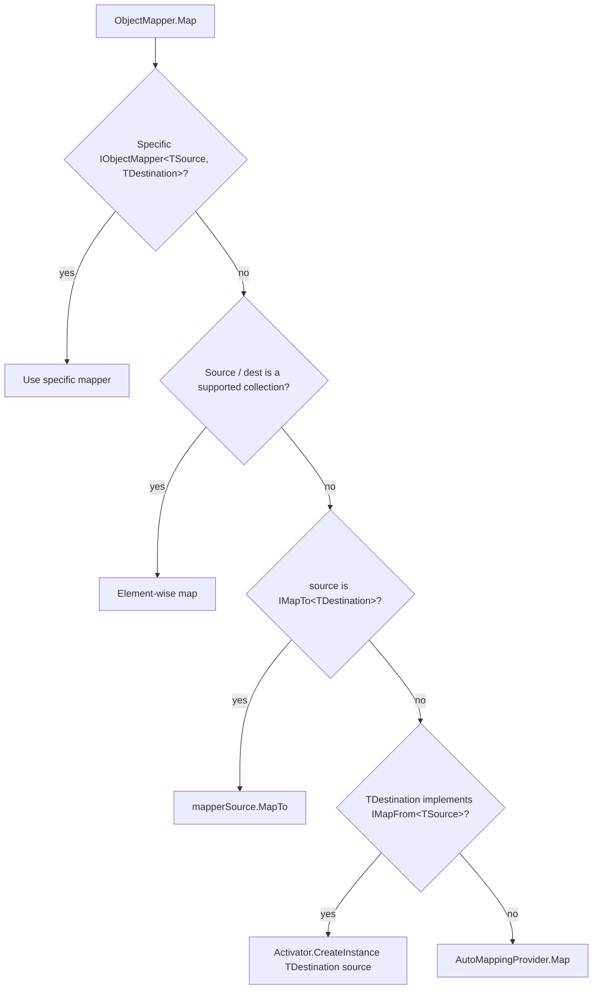

Mapping between entities and DTOs sits at the seam between every application
service and its consumers, so ABP ships an abstraction — `IObjectMapper` —
that hides the underlying mapping engine. The default implementation lives in
`framework/src/Volo.Abp.ObjectMapping/`; an AutoMapper-backed provider plugs in
via `framework/src/Volo.Abp.AutoMapper/`. This page walks through both layers
and shows the patterns ABP modules use to keep mapping pluggable.

## File inventory

### `Volo.Abp.ObjectMapping`

| Path (under `framework/src/Volo.Abp.ObjectMapping/Volo/Abp/ObjectMapping/`) | Role |
| --- | --- |
| `AbpObjectMappingModule.cs` | Registers `IObjectMapper<TContext>` and exposes `IObjectMapper<,>` services |
| `IObjectMapper.cs` | The two-arity mapping contract + `IObjectMapper<TContext>` + `IObjectMapper<TSource, TDestination>` |
| `DefaultObjectMapper.cs` | Default implementation — type-specific mapper, collection mapping, `IMapTo` / `IMapFrom`, fallback to auto-mapping provider |
| `ObjectMapperExtensions.cs` | Reflection-based `Map(Type, Type, object)` overloads |
| `IAutoObjectMappingProvider.cs` | Provider the default mapper delegates to when no specific mapper exists |
| `NotImplementedAutoObjectMappingProvider.cs` | Default provider that throws — replaced when AutoMapper is added |
| `IMapTo.cs` | Source-side opt-in interface |
| `IMapFrom.cs` | Destination-side opt-in interface |

### `Volo.Abp.AutoMapper`

| Path (under `framework/src/Volo.Abp.AutoMapper/`) | Role |
| --- | --- |
| `Volo/Abp/AutoMapper/AbpAutoMapperModule.cs` | Module — registers AutoMapper, configures profiles |
| `Volo/Abp/AutoMapper/AutoMapperAutoObjectMappingProvider.cs` | Replacement for `IAutoObjectMappingProvider` |
| `Volo/Abp/AutoMapper/AbpAutoMapperOptions.cs` | Holds configurator and profile-validation lists |
| `Volo/Abp/AutoMapper/IAbpAutoMapperConfigurationContext.cs` | Context passed to configurators |
| `Microsoft/Extensions/DependencyInjection/AbpAutoMapperServiceCollectionExtensions.cs` | `AddAutoMapperObjectMapper`, `AddAutoMapperProfile` |

## `IObjectMapper`

```csharp framework/src/Volo.Abp.ObjectMapping/Volo/Abp/ObjectMapping/IObjectMapper.cs
public interface IObjectMapper
{
    /// <summary>
    /// Gets the underlying <see cref="IAutoObjectMappingProvider"/> object that is used for auto object mapping.
    /// </summary>
    IAutoObjectMappingProvider AutoObjectMappingProvider { get; }

    /// <summary>
    /// Converts an object to another. Creates a new object of <see cref="TDestination"/>.
    /// </summary>
    TDestination Map<TSource, TDestination>(TSource source);

    /// <summary>
    /// Execute a mapping from the source object to the existing destination object
    /// </summary>
    TDestination Map<TSource, TDestination>(TSource source, TDestination destination);
}

public interface IObjectMapper<TContext> : IObjectMapper
{

}

public interface IObjectMapper<in TSource, TDestination>
{
    TDestination Map(TSource source);
    TDestination Map(TSource source, TDestination destination);
}
```

Three roles:

- `IObjectMapper` — the general-purpose, two-method contract. Inject this in
  application services.
- `IObjectMapper<TContext>` — context-scoped variant. The application-service
  base resolves it when `ObjectMapperContext` is set, so each module can have
  its own AutoMapper profiles without leaking into others.
- `IObjectMapper<TSource, TDestination>` — implement this to **fully override**
  mapping for one specific pair (handy when AutoMapper isn't expressive
  enough).

## `AbpObjectMappingModule`

```csharp framework/src/Volo.Abp.ObjectMapping/Volo/Abp/ObjectMapping/AbpObjectMappingModule.cs
public class AbpObjectMappingModule : AbpModule
{
    public override void PreConfigureServices(ServiceConfigurationContext context)
    {
        context.Services.OnExposing(onServiceExposingContext =>
        {
                //Register types for IObjectMapper<TSource, TDestination> if implements
                onServiceExposingContext.ExposedTypes.AddRange(
                ReflectionHelper.GetImplementedGenericTypes(
                    onServiceExposingContext.ImplementationType,
                    typeof(IObjectMapper<,>)
                )
            );
        });
    }

    public override void ConfigureServices(ServiceConfigurationContext context)
    {
        context.Services.AddTransient(
            typeof(IObjectMapper<>),
            typeof(DefaultObjectMapper<>)
        );
    }
}
```

Two effects:

- The `OnExposing` hook auto-exposes any class that implements
  `IObjectMapper<TSource, TDestination>` under its closed generic interfaces.
  Just create a class and the framework registers it.
- `IObjectMapper<TContext>` is registered as the open generic
  `DefaultObjectMapper<TContext>`, which forwards to the context-specific
  provider.

## `DefaultObjectMapper`

The default mapper is a small **dispatcher**: it checks (1) a registered
`IObjectMapper<TSource, TDestination>`, (2) collection mapping, (3)
`IMapTo<TDestination>` / `IMapFrom<TSource>`, and (4) falls back to the
auto-mapping provider.

```csharp framework/src/Volo.Abp.ObjectMapping/Volo/Abp/ObjectMapping/DefaultObjectMapper.cs
public virtual TDestination Map<TSource, TDestination>(TSource source)
{
    if (source == null)
    {
        return default!;
    }

    using (var scope = ServiceProvider.CreateScope())
    {
        var specificMapper = scope.ServiceProvider.GetService<IObjectMapper<TSource, TDestination>>();
        if (specificMapper != null)
        {
            return specificMapper.Map(source);
        }

        var result = TryToMapCollection<TSource, TDestination>(scope, source, default);
        if (result != null)
        {
            return result;
        }
    }

    if (source is IMapTo<TDestination> mapperSource)
    {
        return mapperSource.MapTo();
    }

    if (typeof(IMapFrom<TSource>).IsAssignableFrom(typeof(TDestination)))
    {
        try
        {
            return (TDestination)Activator.CreateInstance(typeof(TDestination), source)!;
        }
        catch
        {
        }
    }

    return AutoMap<TSource, TDestination>(source);
}
```

The two-arg overload is symmetric:

```csharp framework/src/Volo.Abp.ObjectMapping/Volo/Abp/ObjectMapping/DefaultObjectMapper.cs
public virtual TDestination Map<TSource, TDestination>(TSource source, TDestination destination)
{
    if (source == null) return default!;

    using (var scope = ServiceProvider.CreateScope())
    {
        var specificMapper = scope.ServiceProvider.GetService<IObjectMapper<TSource, TDestination>>();
        if (specificMapper != null)
        {
            return specificMapper.Map(source, destination);
        }

        var result = TryToMapCollection(scope, source, destination);
        if (result != null) return result;
    }

    if (source is IMapTo<TDestination> mapperSource)
    {
        mapperSource.MapTo(destination);
        return destination;
    }

    if (destination is IMapFrom<TSource> mapperDestination)
    {
        mapperDestination.MapFrom(source);
        return destination;
    }

    return AutoMap(source, destination);
}
```

## Resolution order



## `IMapTo<TDestination>` and `IMapFrom<TSource>`

`IMapTo` is the source-side opt-in. Implement it when the entity controls how
it should be projected to a DTO:

```csharp framework/src/Volo.Abp.ObjectMapping/Volo/Abp/ObjectMapping/IMapTo.cs
public interface IMapTo<TDestination>
{
    TDestination MapTo();
    void MapTo(TDestination destination);
}
```

`IMapFrom` is the destination-side opt-in. Implement it when the DTO can
materialise itself from an entity:

```csharp framework/src/Volo.Abp.ObjectMapping/Volo/Abp/ObjectMapping/IMapFrom.cs
public interface IMapFrom<in TSource>
{
    void MapFrom(TSource source);
}
```

When both are present, `IMapTo` wins (look at the resolution order above).

## Collection mapping

`DefaultObjectMapper.TryToMapCollection` recognises arrays and the common
generic collection types when a specific element mapper is registered:

```csharp framework/src/Volo.Abp.ObjectMapping/Volo/Abp/ObjectMapping/DefaultObjectMapper.cs
var supportedCollectionTypes = new[]
{
    typeof(IEnumerable<>),
    typeof(ICollection<>),
    typeof(Collection<>),
    typeof(IList<>),
    typeof(List<>)
};
```

So `objectMapper.Map<List<Book>, List<BookDto>>(books)` works as long as a
`Book → BookDto` mapping exists (specific mapper or AutoMapper profile).

## Auto-mapping provider

When no specific mapper is registered and the source / destination don't
implement `IMapTo` / `IMapFrom`, the default mapper delegates to
`IAutoObjectMappingProvider`:

```csharp framework/src/Volo.Abp.ObjectMapping/Volo/Abp/ObjectMapping/IAutoObjectMappingProvider.cs
public interface IAutoObjectMappingProvider
{
    TDestination Map<TSource, TDestination>(object source);
    TDestination Map<TSource, TDestination>(TSource source, TDestination destination);
}

public interface IAutoObjectMappingProvider<TContext> : IAutoObjectMappingProvider
{

}
```

By default the provider is the "not implemented" stub — calling it throws so
you know an auto-mapper isn't configured:

```csharp framework/src/Volo.Abp.ObjectMapping/Volo/Abp/ObjectMapping/NotImplementedAutoObjectMappingProvider.cs
public sealed class NotImplementedAutoObjectMappingProvider : IAutoObjectMappingProvider, ISingletonDependency
{
    public TDestination Map<TSource, TDestination>(object source)
    {
        throw new NotImplementedException($"Can not map from given object ({source}) to {typeof(TDestination).AssemblyQualifiedName}.");
    }

    public TDestination Map<TSource, TDestination>(TSource source, TDestination destination)
    {
        throw new NotImplementedException($"Can no map from {typeof(TSource).AssemblyQualifiedName} to {typeof(TDestination).AssemblyQualifiedName}.");
    }
}
```

This is what `AbpAutoMapperModule` replaces.

## `ObjectMapperExtensions` — reflection overloads

For scenarios where `TSource` / `TDestination` aren't known at compile time
(generic projections, dynamic field selectors), call the reflection helpers:

```csharp framework/src/Volo.Abp.ObjectMapping/Volo/Abp/ObjectMapping/ObjectMapperExtensions.cs
public static object Map(this IObjectMapper objectMapper, Type sourceType, Type destinationType, object source)
{
    return MapToNewObjectMethod
        .MakeGenericMethod(sourceType, destinationType)
        .Invoke(objectMapper, new[] { source })!;
}

public static object Map(this IObjectMapper objectMapper, Type sourceType, Type destinationType, object source, object destination)
{
    return MapToExistingObjectMethod
        .MakeGenericMethod(sourceType, destinationType)
        .Invoke(objectMapper, new[] { source, destination })!;
}
```

## AutoMapper integration

`AbpAutoMapperModule` plugs AutoMapper in as the auto-mapping provider. After
referencing the package, the default behavior of `IObjectMapper` becomes
"delegate to AutoMapper" for any mapping you haven't overridden.

```csharp framework/src/Volo.Abp.AutoMapper/Volo/Abp/AutoMapper/AbpAutoMapperModule.cs
[DependsOn(
    typeof(AbpObjectMappingModule),
    typeof(AbpObjectExtendingModule),
    typeof(AbpAuditingModule)
)]
public class AbpAutoMapperModule : AbpModule
{
    public override void PreConfigureServices(ServiceConfigurationContext context)
    {
        context.Services.AddConventionalRegistrar(new AbpAutoMapperConventionalRegistrar());
    }

    public override void ConfigureServices(ServiceConfigurationContext context)
    {
        context.Services.AddAutoMapperObjectMapper();

        context.Services.AddSingleton<IConfigurationProvider>(sp =>
        {
            using (var scope = sp.CreateScope())
            {
                var options = scope.ServiceProvider.GetRequiredService<IOptions<AbpAutoMapperOptions>>().Value;

                var mapperConfigurationExpression = sp.GetRequiredService<IOptions<MapperConfigurationExpression>>().Value;
                var autoMapperConfigurationContext = new AbpAutoMapperConfigurationContext(mapperConfigurationExpression, scope.ServiceProvider);

                foreach (var configurator in options.Configurators)
                {
                    configurator(autoMapperConfigurationContext);
                }
                var mapperConfiguration = new MapperConfiguration(mapperConfigurationExpression);

                foreach (var profileType in options.ValidatingProfiles)
                {
                    mapperConfiguration.Internal().AssertConfigurationIsValid(((Profile)Activator.CreateInstance(profileType)).ProfileName);
                }

                return mapperConfiguration;
            }
        });
```

`AutoMapperAutoObjectMappingProvider` is the actual replacement:

```csharp framework/src/Volo.Abp.AutoMapper/Volo/Abp/AutoMapper/AutoMapperAutoObjectMappingProvider.cs
public class AutoMapperAutoObjectMappingProvider : IAutoObjectMappingProvider
{
    public IMapperAccessor MapperAccessor { get; }

    public AutoMapperAutoObjectMappingProvider(IMapperAccessor mapperAccessor)
    {
        MapperAccessor = mapperAccessor;
    }

    public virtual TDestination Map<TSource, TDestination>(object source)
    {
        return MapperAccessor.Mapper.Map<TDestination>(source);
    }

    public virtual TDestination Map<TSource, TDestination>(TSource source, TDestination destination)
    {
        return MapperAccessor.Mapper.Map(source, destination);
    }
}
```

The `TContext`-aware version inherits from it and resolves the context-specific
`IMapperAccessor`. This is how a module can ship its own AutoMapper profile
without colliding with another module's mapping for the same types.

## Configuring an AutoMapper profile

Add `[DependsOn(typeof(AbpAutoMapperModule))]` to your module and register a
profile in `ConfigureServices`:

```csharp BookStoreApplicationModule.cs (pattern)
[DependsOn(
    typeof(AbpAutoMapperModule),
    typeof(BookStoreDomainModule),
    typeof(BookStoreApplicationContractsModule)
    )]
public class BookStoreApplicationModule : AbpModule
{
    public override void ConfigureServices(ServiceConfigurationContext context)
    {
        Configure<AbpAutoMapperOptions>(options =>
        {
            options.AddMaps<BookStoreApplicationModule>();
        });
    }
}

public class BookStoreApplicationAutoMapperProfile : Profile
{
    public BookStoreApplicationAutoMapperProfile()
    {
        CreateMap<Book, BookDto>();
        CreateMap<CreateUpdateBookDto, Book>();
    }
}
```

`AddMaps<TModule>()` scans the assembly the module type lives in for any
`Profile` subclasses and registers them under the module's `TContext`.

## Context-scoped mapping in application services

`ApplicationService.ObjectMapperContext` controls which mapper is resolved.
Set it to your module type to keep mapping local:

```csharp BookAppService.cs (pattern)
public class BookAppService : ApplicationService, IBookAppService
{
    public BookAppService()
    {
        ObjectMapperContext = typeof(BookStoreApplicationModule);
    }

    public async Task<BookDto> GetAsync(Guid id)
    {
        var book = await _bookRepository.GetAsync(id);
        return ObjectMapper.Map<Book, BookDto>(book);
    }
}
```

When `ObjectMapperContext` is null (the default), `ApplicationService` resolves
the global `IObjectMapper`. The relevant code lives in the base class:

```csharp framework/src/Volo.Abp.Ddd.Application/Volo/Abp/Application/Services/ApplicationService.cs
protected Type? ObjectMapperContext { get; set; }
protected IObjectMapper ObjectMapper => LazyServiceProvider.LazyGetService<IObjectMapper>(provider =>
    ObjectMapperContext == null
        ? provider.GetRequiredService<IObjectMapper>()
        : (IObjectMapper)provider.GetRequiredService(typeof(IObjectMapper<>).MakeGenericType(ObjectMapperContext)));
```

## Overriding for one specific pair

Sometimes AutoMapper isn't the right tool — handwritten mapping is clearer for
complex projections. Implement `IObjectMapper<TSource, TDestination>`:

```csharp BookProjector.cs (pattern)
public class BookProjector : IObjectMapper<Book, BookDto>, ITransientDependency
{
    public BookDto Map(Book source) => new BookDto
    {
        Id = source.Id,
        Name = source.Title,
        DisplayPrice = $"{source.Price:C} {source.Currency}"
    };

    public BookDto Map(Book source, BookDto destination)
    {
        destination.Id = source.Id;
        destination.Name = source.Title;
        destination.DisplayPrice = $"{source.Price:C} {source.Currency}";
        return destination;
    }
}
```

The `OnExposing` hook in `AbpObjectMappingModule` auto-registers this under
`IObjectMapper<Book, BookDto>`. `DefaultObjectMapper.Map<Book, BookDto>(book)`
will find it first and skip the AutoMapper path.

## Mapping inside a CRUD service

`CrudAppService.MapToEntity` and `MapToGetOutputDto` call `ObjectMapper.Map`
internally — so the simplest "CRUD with AutoMapper" setup needs zero mapping
code in the service itself; only the profile in your module class:

```csharp
public class BookAppService : CrudAppService<Book, BookDto, Guid, PagedAndSortedResultRequestDto, CreateUpdateBookDto>, IBookAppService
{
    public BookAppService(IRepository<Book, Guid> repository) : base(repository)
    {
        ObjectMapperContext = typeof(BookStoreApplicationModule);
    }
}
```

## When to use which mechanism

<CardGroup cols={2}>
  <Card title="AutoMapper profile" icon="rotate">
    Default for entity ↔ DTO. Reflection-based, fast enough, declarative.
  </Card>
  <Card title="`IMapTo` / `IMapFrom`" icon="arrow-right-arrow-left">
    Co-locate mapping on the source / destination type. Useful for value
    objects.
  </Card>
  <Card title="`IObjectMapper<S, D>`" icon="hand">
    Replace mapping for a single pair, no profile needed. Discovered
    automatically.
  </Card>
  <Card title="Reflection extensions" icon="microscope">
    `objectMapper.Map(srcType, destType, src)` for dynamic / generic plumbing.
  </Card>
</CardGroup>

## Related pages

- [Application services](/ddd/application-services) — primary consumer of `IObjectMapper`.
- [DTOs](/ddd/data-transfer-objects) — what gets mapped to / from.
- [Object extending](/data/abp-data) — `ExtensibleEntityDto` carries `ExtraProperties` across the wire.
- [Modularity](/modularity/overview) — `AbpAutoMapperModule` and `AbpObjectMappingModule` in the dependency graph.
- [Domain services](/ddd/domain-services) — occasionally inject `IObjectMapper` directly.
