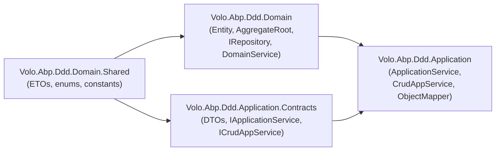
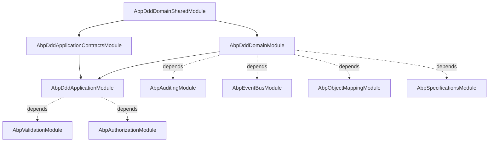

The ABP Framework ships a complete set of Domain Driven Design (DDD) building
blocks that are split across four NuGet packages so the same model can be reused
on both server and client tiers. This overview maps the four packages to their
responsibilities, lists the modules and their dependencies, and points to the
sibling pages where each abstraction is documented in depth. Every path on this
page is rooted at `framework/src/` inside the
[`abpframework/abp`](https://github.com/abpframework/abp) repository.

## The four DDD packages

ABP layers DDD primitives following the standard "shared kernel + domain +
contracts + application" partition. Each package is implemented as an
[`AbpModule`](/modularity/abp-module) so that downstream modules pick up only the
layer they need.

| Package | Module class | Purpose |
| --- | --- | --- |
| `Volo.Abp.Ddd.Domain.Shared` | `AbpDddDomainSharedModule` | Constants, enums, and ETOs that both the Domain and Application.Contracts tiers reuse. |
| `Volo.Abp.Ddd.Domain` | `AbpDddDomainModule` | Entities, aggregate roots, repositories, domain services, domain events. |
| `Volo.Abp.Ddd.Application.Contracts` | `AbpDddApplicationContractsModule` | DTOs, application service interfaces, paged-result contracts. Safe to ship to clients. |
| `Volo.Abp.Ddd.Application` | `AbpDddApplicationModule` | `ApplicationService`, `CrudAppService`, object-mapper wiring, validation, authorization. |

```csharp framework/src/Volo.Abp.Ddd.Domain/Volo/Abp/Domain/AbpDddDomainModule.cs
[DependsOn(
    typeof(AbpAuditingModule),
    typeof(AbpDataModule),
    typeof(AbpEventBusModule),
    typeof(AbpGuidsModule),
    typeof(AbpTimingModule),
    typeof(AbpObjectMappingModule),
    typeof(AbpExceptionHandlingModule),
    typeof(AbpSpecificationsModule),
    typeof(AbpCachingModule),
    typeof(AbpDddDomainSharedModule)
    )]
public class AbpDddDomainModule : AbpModule
{
    public override void PreConfigureServices(ServiceConfigurationContext context)
    {
        context.Services.AddConventionalRegistrar(new AbpRepositoryConventionalRegistrar());
        context.Services.OnRegistered(ChangeTrackingInterceptorRegistrar.RegisterIfNeeded);
    }
}
```

```csharp framework/src/Volo.Abp.Ddd.Application/Volo/Abp/Application/AbpDddApplicationModule.cs
[DependsOn(
    typeof(AbpDddDomainModule),
    typeof(AbpDddApplicationContractsModule),
    typeof(AbpSecurityModule),
    typeof(AbpObjectMappingModule),
    typeof(AbpValidationModule),
    typeof(AbpAuthorizationModule),
    typeof(AbpHttpAbstractionsModule),
    typeof(AbpSettingsModule),
    typeof(AbpFeaturesModule),
    typeof(AbpGlobalFeaturesModule)
    )]
public class AbpDddApplicationModule : AbpModule
```

## Where each abstraction lives



The `AbpDddDomainSharedModule` depends only on
`AbpMultiTenancyAbstractionsModule` and `AbpEventBusAbstractionsModule`, which is
why it is safe to reference from the client tier when you want to share entity
ETOs (Event Transfer Objects) such as `EntityCreatedEto` for distributed events.

```csharp framework/src/Volo.Abp.Ddd.Domain.Shared/Volo/Abp/Domain/AbpDddDomainSharedModule.cs
[DependsOn(
    typeof(AbpMultiTenancyAbstractionsModule),
    typeof(AbpEventBusAbstractionsModule)
)]
public class AbpDddDomainSharedModule : AbpModule
{

}
```

## File inventory

The table below is the authoritative map of where each DDD primitive lives.
Subsequent pages reference these files verbatim.

### Domain.Shared

| Path | Role |
| --- | --- |
| `Volo.Abp.Ddd.Domain.Shared/Volo/Abp/Domain/AbpDddDomainSharedModule.cs` | Shared kernel module |
| `Volo.Abp.Ddd.Domain.Shared/Volo/Abp/Domain/Entities/Events/Distributed/EntityEto.cs` | Generic entity ETO base |
| `Volo.Abp.Ddd.Domain.Shared/Volo/Abp/Domain/Entities/Events/Distributed/EntityCreatedEto.cs` | Created ETO |
| `Volo.Abp.Ddd.Domain.Shared/Volo/Abp/Domain/Entities/Events/Distributed/EntityUpdatedEto.cs` | Updated ETO |
| `Volo.Abp.Ddd.Domain.Shared/Volo/Abp/Domain/Entities/Events/Distributed/EntityDeletedEto.cs` | Deleted ETO |
| `Volo.Abp.Ddd.Domain.Shared/Volo/Abp/Domain/Entities/Events/Distributed/AbpDistributedEntityEventOptions.cs` | Selector / mapping options |
| `Volo.Abp.Ddd.Domain.Shared/Volo/Abp/Domain/Entities/Events/Distributed/EtoMappingDictionary.cs` | Entity → ETO mapping dictionary |

### Domain

| Path | Role |
| --- | --- |
| `Volo.Abp.Ddd.Domain/Volo/Abp/Domain/AbpDddDomainModule.cs` | Module class — registers conventional repository registrar |
| `Volo.Abp.Ddd.Domain/Volo/Abp/Domain/Entities/IEntity.cs` | `IEntity`, `IEntity<TKey>` |
| `Volo.Abp.Ddd.Domain/Volo/Abp/Domain/Entities/Entity.cs` | `Entity`, `Entity<TKey>` base classes |
| `Volo.Abp.Ddd.Domain/Volo/Abp/Domain/Entities/IAggregateRoot.cs` | Aggregate marker interfaces |
| `Volo.Abp.Ddd.Domain/Volo/Abp/Domain/Entities/BasicAggregateRoot.cs` | Aggregate root without `ExtraProperties` / `ConcurrencyStamp` |
| `Volo.Abp.Ddd.Domain/Volo/Abp/Domain/Entities/AggregateRoot.cs` | Aggregate root with `IHasExtraProperties` and `IHasConcurrencyStamp` |
| `Volo.Abp.Ddd.Domain/Volo/Abp/Domain/Entities/IGeneratesDomainEvents.cs` | Hook for aggregates that raise events |
| `Volo.Abp.Ddd.Domain/Volo/Abp/Domain/Entities/EntityHelper.cs` | Reflection helpers (key discovery, tenant assignment) |
| `Volo.Abp.Ddd.Domain/Volo/Abp/Domain/Entities/Auditing/*.cs` | `AuditedEntity`, `FullAuditedEntity`, audited aggregate variants |
| `Volo.Abp.Ddd.Domain/Volo/Abp/Domain/Entities/Events/*.cs` | `EntityCreatedEventData`, `EntityUpdatedEventData`, `EntityDeletedEventData` |
| `Volo.Abp.Ddd.Domain/Volo/Abp/Domain/Repositories/IRepository.cs` | Generic repository contract |
| `Volo.Abp.Ddd.Domain/Volo/Abp/Domain/Repositories/IBasicRepository.cs` | Write contract |
| `Volo.Abp.Ddd.Domain/Volo/Abp/Domain/Repositories/IReadOnlyRepository.cs` | Read + `IQueryable` contract |
| `Volo.Abp.Ddd.Domain/Volo/Abp/Domain/Repositories/RepositoryBase.cs` | Abstract base for ORM-specific repos |
| `Volo.Abp.Ddd.Domain/Volo/Abp/Domain/Repositories/AbpRepositoryConventionalRegistrar.cs` | DI registrar |
| `Volo.Abp.Ddd.Domain/Volo/Abp/Domain/Services/IDomainService.cs` | Marker / `ITransientDependency` |
| `Volo.Abp.Ddd.Domain/Volo/Abp/Domain/Services/DomainService.cs` | Base with lazy services |
| `Volo.Abp.Ddd.Domain/Volo/Abp/Domain/Values/ValueObject.cs` | DDD value object base |

### Application.Contracts

| Path | Role |
| --- | --- |
| `Volo.Abp.Ddd.Application.Contracts/Volo/Abp/Application/AbpDddApplicationContractsModule.cs` | Module class |
| `Volo.Abp.Ddd.Application.Contracts/Volo/Abp/Application/Services/IApplicationService.cs` | Marker interface |
| `Volo.Abp.Ddd.Application.Contracts/Volo/Abp/Application/Services/ICrudAppService.cs` | Generic CRUD contract |
| `Volo.Abp.Ddd.Application.Contracts/Volo/Abp/Application/Services/IReadOnlyAppService.cs` | Read-only CRUD contract |
| `Volo.Abp.Ddd.Application.Contracts/Volo/Abp/Application/Services/ICreateAppService.cs` | Single-op contracts |
| `Volo.Abp.Ddd.Application.Contracts/Volo/Abp/Application/Services/IUpdateAppService.cs` | Single-op contracts |
| `Volo.Abp.Ddd.Application.Contracts/Volo/Abp/Application/Services/IDeleteAppService.cs` | Single-op contracts |
| `Volo.Abp.Ddd.Application.Contracts/Volo/Abp/Application/Dtos/*.cs` | Entity DTOs, paged-result DTOs |

### Application

| Path | Role |
| --- | --- |
| `Volo.Abp.Ddd.Application/Volo/Abp/Application/AbpDddApplicationModule.cs` | Module class |
| `Volo.Abp.Ddd.Application/Volo/Abp/Application/Services/ApplicationService.cs` | Base application service |
| `Volo.Abp.Ddd.Application/Volo/Abp/Application/Services/CrudAppService.cs` | Generic CRUD service |
| `Volo.Abp.Ddd.Application/Volo/Abp/Application/Services/AbstractKeyCrudAppService.cs` | CRUD variant that accepts any key type |
| `Volo.Abp.Ddd.Application/Volo/Abp/Application/Services/ReadOnlyAppService.cs` | Read-only CRUD service |
| `Volo.Abp.Ddd.Application/Volo/Abp/Application/Services/AbstractKeyReadOnlyAppService.cs` | Read-only base |

## Layer responsibilities

<CardGroup cols={2}>
  <Card title="Domain.Shared" icon="cube">
    Stable contracts safe to ship to **any** tier: enums, constants, distributed
    event ETOs, multi-tenancy abstractions.
  </Card>
  <Card title="Domain" icon="layer-group">
    Entities, aggregates, value objects, repositories, domain services,
    domain-event base classes — the heart of the DDD model.
  </Card>
  <Card title="Application.Contracts" icon="file-contract">
    DTOs and application service **interfaces**. Referenced by HTTP API
    clients and Blazor WASM front-ends. No EF Core / MongoDB dependency.
  </Card>
  <Card title="Application" icon="server">
    Concrete `ApplicationService`/`CrudAppService` base classes. Wires
    authorization, validation, object mapping, and unit of work.
  </Card>
</CardGroup>

### Why split Contracts from Application

`AbpDddApplicationContractsModule` depends only on `AbpAuditingContractsModule`,
`AbpLocalizationModule`, and `AbpDataModule`. That keeps DTOs free of server-side
dependencies so the same package can be referenced from:

- The HTTP API client (Refit / dynamic proxy)
- A Blazor WebAssembly client
- A separate microservice consuming the entity ETOs

```csharp framework/src/Volo.Abp.Ddd.Application.Contracts/Volo/Abp/Application/AbpDddApplicationContractsModule.cs
[DependsOn(
    typeof(AbpLocalizationModule),
    typeof(AbpAuditingContractsModule),
    typeof(AbpDataModule)
    )]
public class AbpDddApplicationContractsModule : AbpModule
{
    public override void ConfigureServices(ServiceConfigurationContext context)
    {
        Configure<AbpVirtualFileSystemOptions>(options =>
        {
            options.FileSets.AddEmbedded<AbpDddApplicationContractsModule>();
        });

        Configure<AbpLocalizationOptions>(options =>
        {
            options.Resources
                .Add<AbpDddApplicationContractsResource>("en")
                .AddVirtualJson("/Volo/Abp/Application/Localization/Resources/AbpDdd");
        });
    }
}
```

## Module dependency graph



## Repository registrar

Repositories are not registered by their concrete class by default — the domain
module hooks an `AbpRepositoryConventionalRegistrar` that exposes only the
implemented `IRepository`/`IBasicRepository`/`IReadOnlyRepository` interfaces.

```csharp framework/src/Volo.Abp.Ddd.Domain/Volo/Abp/Domain/Repositories/AbpRepositoryConventionalRegistrar.cs
public class AbpRepositoryConventionalRegistrar : DefaultConventionalRegistrar
{
    public static bool ExposeRepositoryClasses { get; set; }

    protected override bool IsConventionalRegistrationDisabled(Type type)
    {
        return !typeof(IRepository).IsAssignableFrom(type) || base.IsConventionalRegistrationDisabled(type);
    }

    protected override List<Type> GetExposedServiceTypes(Type type)
    {
        if (ExposeRepositoryClasses)
        {
            return base.GetExposedServiceTypes(type);
        }

        return base.GetExposedServiceTypes(type)
            .Where(x => x.IsInterface)
            .ToList();
    }

    protected override ServiceLifetime? GetDefaultLifeTimeOrNull(Type type)
    {
        return ServiceLifetime.Transient;
    }
}
```

Set `AbpRepositoryConventionalRegistrar.ExposeRepositoryClasses = true` when you
need the concrete repository class to also be resolvable — for example to inject
a `MyEntityRepository` directly into a domain service that uses ORM-specific
extension methods.

## Cross-references

<CardGroup cols={2}>
  <Card title="Entities & aggregates" href="/ddd/entities-and-aggregates" icon="diagram-project">
    `Entity<TKey>`, `BasicAggregateRoot`, `AggregateRoot`, audit + soft-delete interfaces.
  </Card>
  <Card title="Value objects" href="/ddd/value-objects" icon="gem">
    `ValueObject` base class and the equality semantics built on `GetAtomicValues`.
  </Card>
  <Card title="Repositories" href="/ddd/repositories" icon="database">
    `IRepository`, `IBasicRepository`, `IReadOnlyRepository`, `RepositoryBase`.
  </Card>
  <Card title="Domain services" href="/ddd/domain-services" icon="screwdriver-wrench">
    `IDomainService` and `DomainService` base class with lazy services.
  </Card>
  <Card title="Specifications" href="/ddd/specifications" icon="filter">
    `Specification<T>`, `AndSpecification`, `OrSpecification`, `NotSpecification`.
  </Card>
  <Card title="Domain events" href="/ddd/domain-events" icon="bell">
    `EntityCreatedEventData`, `EntityUpdatedEventData`, `EntityDeletedEventData`.
  </Card>
  <Card title="Application services" href="/ddd/application-services" icon="server">
    `ApplicationService`, `CrudAppService`, `AbstractKeyCrudAppService`.
  </Card>
  <Card title="DTOs" href="/ddd/data-transfer-objects" icon="file-export">
    `EntityDto`, `PagedResultDto`, `ExtensibleEntityDto`, request DTOs.
  </Card>
  <Card title="Object mapping" href="/ddd/object-mapping" icon="arrows-left-right">
    `IObjectMapper`, `MapTo`, AutoMapper integration.
  </Card>
</CardGroup>

## Related framework pages

- [Modularity overview](/modularity/overview) — how `AbpDddDomainModule` and friends are loaded.
- [Unit of Work](/uow/overview) — `RepositoryBase.SaveChangesAsync` participates in the ambient UoW.
- [Event bus](/events/overview) — domain events queued in `BasicAggregateRoot` flow through `ILocalEventBus`.
- [Object mapping](/mapping/overview) — `ApplicationService.ObjectMapper` and `IObjectMapper<TContext>` are documented here.
- [Multi-tenancy](/multitenancy/overview) — `Entity` constructor calls `EntityHelper.TrySetTenantId` to assign `TenantId`.
