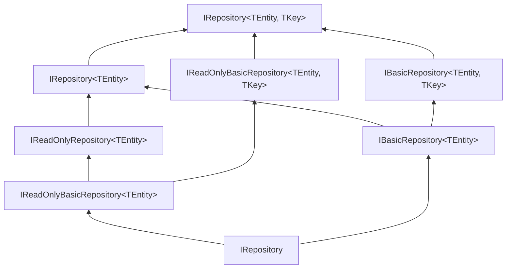

The repository pattern in the ABP Framework is split into three layered
interfaces — basic, read-only, and the combined `IRepository` — so consumers
can ask for exactly the surface they need. All three live in
`framework/src/Volo.Abp.Ddd.Domain/Volo/Abp/Domain/Repositories/`, with the
abstract `RepositoryBase` providing data-filter / multi-tenancy / lazy-service
plumbing that ORM-specific implementations (EF Core, Mongo, in-memory) inherit
from.

## File inventory

| Path (under `framework/src/Volo.Abp.Ddd.Domain/Volo/Abp/Domain/Repositories/`) | Role |
| --- | --- |
| `IRepository.cs` | `IRepository`, `IRepository<TEntity>`, `IRepository<TEntity, TKey>` |
| `IBasicRepository.cs` | Insert / update / delete contracts |
| `IReadOnlyRepository.cs` | `IQueryable` + read methods |
| `IReadOnlyBasicRepository.cs` | `GetListAsync`, `GetCountAsync`, `GetPagedListAsync` |
| `RepositoryBase.cs` | Abstract base for read+write repositories |
| `BasicRepositoryBase.cs` | Abstract base for write-only ORMs |
| `RepositoryAsyncExtensions.cs` | `IQueryable` → async extension overloads |
| `RepositoryExtensions.cs` | Discovery helpers |
| `AbpRepositoryConventionalRegistrar.cs` | DI registrar |
| `EntityChangeTrackingProvider.cs` | Reads `[EnableEntityChangeTracking]` / `[DisableEntityChangeTracking]` |
| `IEntityChangeTrackingProvider.cs` | Contract for the above |
| `RepositoryRegistrarBase.cs` | Base for ORM-specific registrars |
| `UnitOfWorkItemNames.cs` | UoW dictionary keys used by integrations |
| `ISupportsExplicitLoading.cs` | Optional marker for explicit `Include`-style loading |

The async-queryable executer interfaces referenced below live in another
package:

| Path | Role |
| --- | --- |
| `framework/src/Volo.Abp.Threading/Volo/Abp/Linq/IAsyncQueryableExecuter.cs` | Contract |
| `framework/src/Volo.Abp.Threading/Volo/Abp/Linq/AsyncQueryableExecuter.cs` | Default implementation |

## The layered contract



## `IRepository`

`IRepository` itself is a **marker** interface used by
`AbpRepositoryConventionalRegistrar` to discover repository classes. It exposes
a single property:

```csharp framework/src/Volo.Abp.Ddd.Domain/Volo/Abp/Domain/Repositories/IRepository.cs
public interface IRepository
{
    bool? IsChangeTrackingEnabled { get; }
}
```

`IsChangeTrackingEnabled` lets you mark a repository instance as tracking or
read-only at runtime — it overrides the `[EnableEntityChangeTracking]` /
`[DisableEntityChangeTracking]` attributes.

## `IReadOnlyBasicRepository<TEntity>`

The minimum read contract — list, count, and paged list:

```csharp framework/src/Volo.Abp.Ddd.Domain/Volo/Abp/Domain/Repositories/IReadOnlyBasicRepository.cs
public interface IReadOnlyBasicRepository<TEntity> : IRepository
    where TEntity : class, IEntity
{
    Task<List<TEntity>> GetListAsync(bool includeDetails = false, CancellationToken cancellationToken = default);

    Task<long> GetCountAsync(CancellationToken cancellationToken = default);

    Task<List<TEntity>> GetPagedListAsync(
        int skipCount,
        int maxResultCount,
        string sorting,
        bool includeDetails = false,
        CancellationToken cancellationToken = default);
}
```

With a key:

```csharp framework/src/Volo.Abp.Ddd.Domain/Volo/Abp/Domain/Repositories/IReadOnlyBasicRepository.cs
public interface IReadOnlyBasicRepository<TEntity, TKey> : IReadOnlyBasicRepository<TEntity>
    where TEntity : class, IEntity<TKey>
{
    [NotNull]
    Task<TEntity> GetAsync(TKey id, bool includeDetails = true, CancellationToken cancellationToken = default);

    Task<TEntity?> FindAsync(TKey id, bool includeDetails = true, CancellationToken cancellationToken = default);
}
```

`GetAsync` throws `EntityNotFoundException` when the row is missing.
`FindAsync` returns `null` instead.

## `IReadOnlyRepository<TEntity>`

Adds queryable access plus the predicate-based list overload:

```csharp framework/src/Volo.Abp.Ddd.Domain/Volo/Abp/Domain/Repositories/IReadOnlyRepository.cs
public interface IReadOnlyRepository<TEntity> : IReadOnlyBasicRepository<TEntity>
    where TEntity : class, IEntity
{
    IAsyncQueryableExecuter AsyncExecuter { get; }

    [Obsolete("Use WithDetailsAsync method.")]
    IQueryable<TEntity> WithDetails();

    [Obsolete("Use WithDetailsAsync method.")]
    IQueryable<TEntity> WithDetails(params Expression<Func<TEntity, object>>[] propertySelectors);

    Task<IQueryable<TEntity>> WithDetailsAsync();

    Task<IQueryable<TEntity>> WithDetailsAsync(params Expression<Func<TEntity, object>>[] propertySelectors);

    Task<IQueryable<TEntity>> GetQueryableAsync();

    Task<List<TEntity>> GetListAsync(
        [NotNull] Expression<Func<TEntity, bool>> predicate,
        bool includeDetails = false,
        CancellationToken cancellationToken = default);
}
```

The `AsyncExecuter` property is the gateway to ORM-agnostic async LINQ — see
the dedicated section below.

## `IBasicRepository<TEntity>`

The write surface — insert, update, delete in single and batched forms:

```csharp framework/src/Volo.Abp.Ddd.Domain/Volo/Abp/Domain/Repositories/IBasicRepository.cs
public interface IBasicRepository<TEntity> : IReadOnlyBasicRepository<TEntity>
    where TEntity : class, IEntity
{
    [NotNull]
    Task<TEntity> InsertAsync([NotNull] TEntity entity, bool autoSave = false, CancellationToken cancellationToken = default);

    Task InsertManyAsync([NotNull] IEnumerable<TEntity> entities, bool autoSave = false, CancellationToken cancellationToken = default);

    [NotNull]
    Task<TEntity> UpdateAsync([NotNull] TEntity entity, bool autoSave = false, CancellationToken cancellationToken = default);

    Task UpdateManyAsync([NotNull] IEnumerable<TEntity> entities, bool autoSave = false, CancellationToken cancellationToken = default);

    Task DeleteAsync([NotNull] TEntity entity, bool autoSave = false, CancellationToken cancellationToken = default);

    Task DeleteManyAsync([NotNull] IEnumerable<TEntity> entities, bool autoSave = false, CancellationToken cancellationToken = default);
}
```

The `autoSave` flag forces a `SaveChangesAsync` immediately — useful when the
ORM batches writes but you need the row before the ambient unit of work
completes.

With a key, you get the convenience of deleting by id:

```csharp framework/src/Volo.Abp.Ddd.Domain/Volo/Abp/Domain/Repositories/IBasicRepository.cs
public interface IBasicRepository<TEntity, TKey> : IBasicRepository<TEntity>, IReadOnlyBasicRepository<TEntity, TKey>
    where TEntity : class, IEntity<TKey>
{
    Task DeleteAsync(TKey id, bool autoSave = false, CancellationToken cancellationToken = default);
    Task DeleteManyAsync([NotNull] IEnumerable<TKey> ids, bool autoSave = false, CancellationToken cancellationToken = default);
}
```

## `IRepository<TEntity>` — the full surface

`IRepository<TEntity>` is the union of read and write plus predicate-aware
find / get / delete methods:

```csharp framework/src/Volo.Abp.Ddd.Domain/Volo/Abp/Domain/Repositories/IRepository.cs
public interface IRepository<TEntity> : IReadOnlyRepository<TEntity>, IBasicRepository<TEntity>
    where TEntity : class, IEntity
{
    Task<TEntity?> FindAsync(
        [NotNull] Expression<Func<TEntity, bool>> predicate,
        bool includeDetails = true,
        CancellationToken cancellationToken = default
    );

    Task<TEntity> GetAsync(
        [NotNull] Expression<Func<TEntity, bool>> predicate,
        bool includeDetails = true,
        CancellationToken cancellationToken = default
    );

    Task DeleteAsync(
        [NotNull] Expression<Func<TEntity, bool>> predicate,
        bool autoSave = false,
        CancellationToken cancellationToken = default
    );

    Task DeleteDirectAsync(
        [NotNull] Expression<Func<TEntity, bool>> predicate,
        CancellationToken cancellationToken = default
    );
}

public interface IRepository<TEntity, TKey> : IRepository<TEntity>, IReadOnlyRepository<TEntity, TKey>, IBasicRepository<TEntity, TKey>
    where TEntity : class, IEntity<TKey>
{
}
```

<Warning>
`DeleteDirectAsync` bypasses soft-delete, multi-tenancy, and audit logging — it
emits a SQL `DELETE` directly. Use it only when bulk deletion performance
matters and you have verified the rows are not multi-tenant or soft-deletable.
</Warning>

## `BasicRepositoryBase<TEntity>`

`BasicRepositoryBase` provides the shared plumbing every repository needs.
Notice how it leans on `IAbpLazyServiceProvider` to resolve framework services
on demand without bloating constructor signatures.

```csharp framework/src/Volo.Abp.Ddd.Domain/Volo/Abp/Domain/Repositories/BasicRepositoryBase.cs
public abstract class BasicRepositoryBase<TEntity> :
    IBasicRepository<TEntity>,
    IServiceProviderAccessor,
    IUnitOfWorkEnabled
    where TEntity : class, IEntity
{
    public IAbpLazyServiceProvider LazyServiceProvider { get; set; } = default!;

    public IServiceProvider ServiceProvider { get; set; } = default!;

    public IDataFilter DataFilter => LazyServiceProvider.LazyGetRequiredService<IDataFilter>();

    public ICurrentTenant CurrentTenant => LazyServiceProvider.LazyGetRequiredService<ICurrentTenant>();

    public IAsyncQueryableExecuter AsyncExecuter => LazyServiceProvider.LazyGetRequiredService<IAsyncQueryableExecuter>();

    public IUnitOfWorkManager UnitOfWorkManager => LazyServiceProvider.LazyGetRequiredService<IUnitOfWorkManager>();

    public ICancellationTokenProvider CancellationTokenProvider => LazyServiceProvider.LazyGetService<ICancellationTokenProvider>(NullCancellationTokenProvider.Instance);

    public IEntityChangeTrackingProvider EntityChangeTrackingProvider => LazyServiceProvider.LazyGetRequiredService<IEntityChangeTrackingProvider>();

    public bool? IsChangeTrackingEnabled { get; protected set; }
```

The `SaveChangesAsync` helper bridges the repository with the ambient unit of
work — when the repository participates in a UoW, all writes are committed
together; otherwise each `autoSave` becomes a no-op.

```csharp framework/src/Volo.Abp.Ddd.Domain/Volo/Abp/Domain/Repositories/BasicRepositoryBase.cs
protected virtual Task SaveChangesAsync(CancellationToken cancellationToken)
{
    if (UnitOfWorkManager?.Current != null)
    {
        return UnitOfWorkManager.Current.SaveChangesAsync(cancellationToken);
    }

    return Task.CompletedTask;
}
```

`InsertManyAsync` / `UpdateManyAsync` / `DeleteManyAsync` delegate to the
single-row variants by default — concrete ORM repositories override these to
batch when their store supports it.

## `RepositoryBase<TEntity>`

`RepositoryBase` adds the `IQueryable`-aware read surface and the data-filter
helpers that every ORM-specific repository reuses.

```csharp framework/src/Volo.Abp.Ddd.Domain/Volo/Abp/Domain/Repositories/RepositoryBase.cs
public abstract class RepositoryBase<TEntity> : BasicRepositoryBase<TEntity>, IRepository<TEntity>, IUnitOfWorkManagerAccessor
    where TEntity : class, IEntity
{
    [Obsolete("Use WithDetailsAsync method.")]
    public virtual IQueryable<TEntity> WithDetails() => GetQueryable();

    public virtual Task<IQueryable<TEntity>> WithDetailsAsync() => GetQueryableAsync();

    public abstract Task<IQueryable<TEntity>> GetQueryableAsync();

    public abstract Task<TEntity?> FindAsync(
        Expression<Func<TEntity, bool>> predicate,
        bool includeDetails = true,
        CancellationToken cancellationToken = default);

    public async Task<TEntity> GetAsync(
        Expression<Func<TEntity, bool>> predicate,
        bool includeDetails = true,
        CancellationToken cancellationToken = default)
    {
        var entity = await FindAsync(predicate, includeDetails, cancellationToken);
        if (entity == null)
        {
            throw new EntityNotFoundException(typeof(TEntity));
        }
        return entity;
    }
}
```

The keyed variant adds `DeleteAsync(TKey)` and `DeleteManyAsync(IEnumerable<TKey>)`:

```csharp framework/src/Volo.Abp.Ddd.Domain/Volo/Abp/Domain/Repositories/RepositoryBase.cs
public abstract class RepositoryBase<TEntity, TKey> : RepositoryBase<TEntity>, IRepository<TEntity, TKey>
    where TEntity : class, IEntity<TKey>
{
    public abstract Task<TEntity> GetAsync(TKey id, bool includeDetails = true, CancellationToken cancellationToken = default);

    public abstract Task<TEntity?> FindAsync(TKey id, bool includeDetails = true, CancellationToken cancellationToken = default);

    public virtual async Task DeleteAsync(TKey id, bool autoSave = false, CancellationToken cancellationToken = default)
    {
        var entity = await FindAsync(id, cancellationToken: cancellationToken);
        if (entity == null)
        {
            return;
        }

        await DeleteAsync(entity, autoSave, cancellationToken);
    }
}
```

## Data-filter integration

`RepositoryBase.ApplyDataFilters` is the single point where `ISoftDelete` and
`IMultiTenant` are translated into LINQ `Where` clauses, gated by `IDataFilter`
toggles:

```csharp framework/src/Volo.Abp.Ddd.Domain/Volo/Abp/Domain/Repositories/RepositoryBase.cs
protected virtual TQueryable ApplyDataFilters<TQueryable, TOtherEntity>(TQueryable query)
    where TQueryable : IQueryable<TOtherEntity>
{
    if (typeof(ISoftDelete).IsAssignableFrom(typeof(TOtherEntity)))
    {
        query = (TQueryable)query.WhereIf(DataFilter.IsEnabled<ISoftDelete>(), e => ((ISoftDelete)e!).IsDeleted == false);
    }

    if (typeof(IMultiTenant).IsAssignableFrom(typeof(TOtherEntity)))
    {
        var tenantId = CurrentTenant.Id;
        query = (TQueryable)query.WhereIf(DataFilter.IsEnabled<IMultiTenant>(), e => ((IMultiTenant)e!).TenantId == tenantId);
    }

    return query;
}
```

Wrap calls in `using (DataFilter.Disable<ISoftDelete>())` to temporarily see
deleted rows, or `using (CurrentTenant.Change(tenantId))` to read another
tenant's data. See [Multi-tenancy](/multitenancy/overview).

## `IAsyncQueryableExecuter`

`AsyncExecuter` is the ORM-agnostic async LINQ surface. Calling it from a
domain or application service means the same code works under EF Core, Mongo,
or the in-memory store.

```csharp framework/src/Volo.Abp.Threading/Volo/Abp/Linq/IAsyncQueryableExecuter.cs
public interface IAsyncQueryableExecuter
{
    Task<bool> ContainsAsync<T>([NotNull] IQueryable<T> queryable, [NotNull] T item, CancellationToken cancellationToken = default);
    Task<bool> AnyAsync<T>([NotNull] IQueryable<T> queryable, CancellationToken cancellationToken = default);
    Task<bool> AnyAsync<T>([NotNull] IQueryable<T> queryable, [NotNull] Expression<Func<T, bool>> predicate, CancellationToken cancellationToken = default);
    Task<bool> AllAsync<T>([NotNull] IQueryable<T> queryable, [NotNull] Expression<Func<T, bool>> predicate, CancellationToken cancellationToken = default);
    // …Count, FirstOrDefault, Sum, Min, Max, ToList, etc.
}
```

Use it like this from a domain service:

```csharp Example
var queryable = await _orderRepository.GetQueryableAsync();
var hasOpen = await AsyncExecuter.AnyAsync(queryable.Where(o => o.Status == OrderStatus.Open));
```

## Bulk-operation hook

`IBasicRepository` does not include a public `IBulkOperationProvider`
interface — bulk operations on `*ManyAsync` are routed through the unit of work
by individual ORM integrations (EF Core extra package, Mongo, etc.). The
default behaviour for `InsertManyAsync` in `BasicRepositoryBase` is a loop:

```csharp framework/src/Volo.Abp.Ddd.Domain/Volo/Abp/Domain/Repositories/BasicRepositoryBase.cs
public virtual async Task InsertManyAsync(IEnumerable<TEntity> entities, bool autoSave = false, CancellationToken cancellationToken = default)
{
    foreach (var entity in entities)
    {
        await InsertAsync(entity, cancellationToken: cancellationToken);
    }

    if (autoSave)
    {
        await SaveChangesAsync(cancellationToken);
    }
}
```

ORM-specific repositories override these to use batched APIs (`AddRange`,
`BulkInsert`, etc.).

## Conventional registration

`AbpDddDomainModule.PreConfigureServices` registers the repository registrar:

```csharp framework/src/Volo.Abp.Ddd.Domain/Volo/Abp/Domain/AbpDddDomainModule.cs
context.Services.AddConventionalRegistrar(new AbpRepositoryConventionalRegistrar());
```

The registrar:

```csharp framework/src/Volo.Abp.Ddd.Domain/Volo/Abp/Domain/Repositories/AbpRepositoryConventionalRegistrar.cs
public class AbpRepositoryConventionalRegistrar : DefaultConventionalRegistrar
{
    public static bool ExposeRepositoryClasses { get; set; }

    protected override bool IsConventionalRegistrationDisabled(Type type)
    {
        return !typeof(IRepository).IsAssignableFrom(type) || base.IsConventionalRegistrationDisabled(type);
    }

    protected override List<Type> GetExposedServiceTypes(Type type)
    {
        if (ExposeRepositoryClasses)
        {
            return base.GetExposedServiceTypes(type);
        }

        return base.GetExposedServiceTypes(type)
            .Where(x => x.IsInterface)
            .ToList();
    }

    protected override ServiceLifetime? GetDefaultLifeTimeOrNull(Type type)
    {
        return ServiceLifetime.Transient;
    }
}
```

Two notes:

- Only classes that implement `IRepository` are picked up.
- Repository classes are exposed by their **interfaces** by default. Set
  `AbpRepositoryConventionalRegistrar.ExposeRepositoryClasses = true` to expose
  the concrete class too — useful when you have a custom repository like
  `OrderRepository : EfCoreRepository<...>, IOrderRepository` with extra
  methods.

## `AddDefaultRepository`

ORM-specific extensions call `AddDefaultRepository(entityType, implementationType)`
to register a generic repository. The dispatcher iterates each layer of the
contract and registers exactly the interfaces the implementation satisfies:

```csharp framework/src/Volo.Abp.Ddd.Domain/Microsoft/Extensions/DependencyInjection/ServiceCollectionRepositoryExtensions.cs
public static IServiceCollection AddDefaultRepository(
    this IServiceCollection services,
    Type entityType,
    Type repositoryImplementationType,
    bool replaceExisting = false)
{
    //IReadOnlyBasicRepository<TEntity>
    var readOnlyBasicRepositoryInterface = typeof(IReadOnlyBasicRepository<>).MakeGenericType(entityType);
    if (readOnlyBasicRepositoryInterface.IsAssignableFrom(repositoryImplementationType))
    {
        RegisterService(services, readOnlyBasicRepositoryInterface, repositoryImplementationType, replaceExisting, true);

        //IReadOnlyRepository<TEntity>
        var readOnlyRepositoryInterface = typeof(IReadOnlyRepository<>).MakeGenericType(entityType);
        if (readOnlyRepositoryInterface.IsAssignableFrom(repositoryImplementationType))
        {
            RegisterService(services, readOnlyRepositoryInterface, repositoryImplementationType, replaceExisting, true);
        }
```

## Change-tracking attributes

`BasicRepositoryBase.ShouldTrackingEntityChange` decides whether the EF Core
context should track materialized entities. The order of precedence is:

1. The `IsChangeTrackingEnabled` instance property (when explicitly set).
2. `[EnableEntityChangeTracking]` / `[DisableEntityChangeTracking]` attributes
   surfaced via `IEntityChangeTrackingProvider.Enabled`.
3. Default: tracking is **on**.

```csharp framework/src/Volo.Abp.Ddd.Domain/Volo/Abp/Domain/Repositories/BasicRepositoryBase.cs
protected virtual bool ShouldTrackingEntityChange()
{
    if (IsChangeTrackingEnabled.HasValue)
    {
        return IsChangeTrackingEnabled.Value;
    }

    if (EntityChangeTrackingProvider.Enabled.HasValue)
    {
        return EntityChangeTrackingProvider.Enabled.Value;
    }

    return true;
}
```

## Picking the right interface

<CardGroup cols={2}>
  <Card title="`IReadOnlyBasicRepository<T, TKey>`" icon="eye">
    Query side. Inject when you only need `GetAsync(id)` / `FindAsync(id)` /
    `GetListAsync()`.
  </Card>
  <Card title="`IReadOnlyRepository<T>`" icon="binoculars">
    Inject when you need `IQueryable` (`GetQueryableAsync`) plus async LINQ.
  </Card>
  <Card title="`IBasicRepository<T, TKey>`" icon="pen-to-square">
    Inject when you only need insert / update / delete and the entity-by-id
    overloads, no query language required.
  </Card>
  <Card title="`IRepository<T, TKey>`" icon="layer-group">
    The default in CRUD application services — read, write, queryable, and
    expression-based delete in one.
  </Card>
</CardGroup>

## Related pages

- [Entities and aggregates](/ddd/entities-and-aggregates) — the `where TEntity : class, IEntity<TKey>` constraint.
- [Unit of Work](/uow/overview) — `SaveChangesAsync` and ambient transactions.
- [Application services](/ddd/application-services) — `CrudAppService` consumes `IRepository<T, TKey>`.
- [Multi-tenancy](/multitenancy/overview) — `ICurrentTenant` and `IDataFilter<IMultiTenant>` interplay.
- [Events](/events/overview) — repositories drive domain-event publication.
