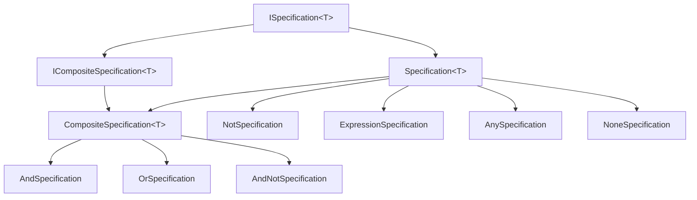

The Specification pattern lets you encapsulate query predicates as reusable
objects that can be composed with `And` / `Or` / `Not` semantics and then
either executed against an `IQueryable` (database-side) or applied to an
in-memory instance (`IsSatisfiedBy`). ABP ships the pattern as the
`Volo.Abp.Specifications` module under
`framework/src/Volo.Abp.Specifications/Volo/Abp/Specifications/`. The whole
module is a small set of pure C# classes with **no infrastructure dependencies**
— it depends only on `AbpModule`.

## File inventory

| Path (under `framework/src/Volo.Abp.Specifications/Volo/Abp/Specifications/`) | Role |
| --- | --- |
| `AbpSpecificationsModule.cs` | Empty module — registration anchor |
| `ISpecification.cs` | `ISpecification<T>` contract |
| `ICompositeSpecification.cs` | `Left` / `Right` exposing combinator contract |
| `Specification.cs` | Abstract base implementing `ISpecification<T>` |
| `CompositeSpecification.cs` | Abstract base for binary combinators |
| `AndSpecification.cs` | `Left AND Right` |
| `OrSpecification.cs` | `Left OR Right` |
| `NotSpecification.cs` | `NOT specification` |
| `AndNotSpecification.cs` | `Left AND (NOT Right)` |
| `AnySpecification.cs` | `o => true` |
| `NoneSpecification.cs` | `o => false` |
| `ExpressionSpecification.cs` | Wraps an existing `Expression<Func<T,bool>>` |
| `SpecificationExtensions.cs` | `And` / `Or` / `Not` / `AndNot` extension methods |
| `ExpressionFuncExtender.cs` | Internal expression composer (parameter rebinding) |
| `ParameterRebinder.cs` | Internal expression visitor |
| `ISpecificationParser.cs` | Parser hook (extensibility point) |

## Module entry point

```csharp framework/src/Volo.Abp.Specifications/Volo/Abp/Specifications/AbpSpecificationsModule.cs
using Volo.Abp.Modularity;

namespace Volo.Abp.Specifications;

public class AbpSpecificationsModule : AbpModule
{

}
```

`AbpDddDomainModule` declares `AbpSpecificationsModule` as a dependency
([overview](/ddd/overview)) so domain code can freely use the types without
manually wiring the module.

## `ISpecification<T>`

```csharp framework/src/Volo.Abp.Specifications/Volo/Abp/Specifications/ISpecification.cs
public interface ISpecification<T>
{
    /// <summary>
    /// Returns a <see cref="bool"/> value which indicates whether the specification
    /// is satisfied by the given object.
    /// </summary>
    bool IsSatisfiedBy(T obj);

    /// <summary>
    /// Gets the LINQ expression which represents the current specification.
    /// </summary>
    Expression<Func<T, bool>> ToExpression();
}
```

A specification has **two evaluation modes**:

- `IsSatisfiedBy(obj)` — invoked on a materialized instance, returns `true`
  / `false`. Use this in domain services to verify a rule.
- `ToExpression()` — returns a LINQ predicate. Pass this to
  `IQueryable.Where(...)` and the database evaluates it.

## `Specification<T>` base class

The default implementation of `IsSatisfiedBy` compiles `ToExpression()` and
invokes it — so subclasses only need to override `ToExpression()`:

```csharp framework/src/Volo.Abp.Specifications/Volo/Abp/Specifications/Specification.cs
public abstract class Specification<T> : ISpecification<T>
{
    public virtual bool IsSatisfiedBy(T obj)
    {
        return ToExpression().Compile()(obj);
    }

    public abstract Expression<Func<T, bool>> ToExpression();

    /// <summary>
    /// Implicitly converts a specification to expression.
    /// </summary>
    public static implicit operator Expression<Func<T, bool>>(Specification<T> specification)
    {
        return specification.ToExpression();
    }
}
```

The implicit conversion to `Expression<Func<T,bool>>` is convenient — you can
pass a specification directly to `Where`:

```csharp
var spec = new ActiveCustomerSpecification();
var queryable = await _customerRepository.GetQueryableAsync();
var query = queryable.Where(spec); // implicit conversion
```

## Writing a specification

```csharp ActiveCustomerSpecification.cs (pattern)
public class ActiveCustomerSpecification : Specification<Customer>
{
    public override Expression<Func<Customer, bool>> ToExpression()
    {
        return c => !c.IsLocked && c.LastLoginTime >= DateTime.UtcNow.AddDays(-30);
    }
}
```

The same specification can be used to filter a list or check a single instance:

```csharp
var active = customers.Where(new ActiveCustomerSpecification().ToExpression().Compile());

// or:
if (new ActiveCustomerSpecification().IsSatisfiedBy(customer)) { /* ... */ }
```

## Composite specifications

`CompositeSpecification<T>` is the binary-combinator base. Concrete
combinators expose `Left` and `Right` and override `ToExpression()`:

```csharp framework/src/Volo.Abp.Specifications/Volo/Abp/Specifications/CompositeSpecification.cs
public abstract class CompositeSpecification<T> : Specification<T>, ICompositeSpecification<T>
{
    protected CompositeSpecification(ISpecification<T> left, ISpecification<T> right)
    {
        Left = left;
        Right = right;
    }

    public ISpecification<T> Left { get; }

    public ISpecification<T> Right { get; }
}
```

```csharp framework/src/Volo.Abp.Specifications/Volo/Abp/Specifications/ICompositeSpecification.cs
public interface ICompositeSpecification<T> : ISpecification<T>
{
    ISpecification<T> Left { get; }
    ISpecification<T> Right { get; }
}
```

### `AndSpecification<T>`

```csharp framework/src/Volo.Abp.Specifications/Volo/Abp/Specifications/AndSpecification.cs
public class AndSpecification<T> : CompositeSpecification<T>
{
    public AndSpecification(ISpecification<T> left, ISpecification<T> right) : base(left, right)
    {
    }

    public override Expression<Func<T, bool>> ToExpression()
    {
        return Left.ToExpression().And(Right.ToExpression());
    }
}
```

### `OrSpecification<T>`

```csharp framework/src/Volo.Abp.Specifications/Volo/Abp/Specifications/OrSpecification.cs
public class OrSpecification<T> : CompositeSpecification<T>
{
    public OrSpecification(ISpecification<T> left, ISpecification<T> right) : base(left, right)
    {
    }

    public override Expression<Func<T, bool>> ToExpression()
    {
        return Left.ToExpression().Or(Right.ToExpression());
    }
}
```

### `NotSpecification<T>`

```csharp framework/src/Volo.Abp.Specifications/Volo/Abp/Specifications/NotSpecification.cs
public class NotSpecification<T> : Specification<T>
{
    private readonly ISpecification<T> _specification;

    public NotSpecification(ISpecification<T> specification)
    {
        _specification = specification;
    }

    public override Expression<Func<T, bool>> ToExpression()
    {
        var expression = _specification.ToExpression();
        return Expression.Lambda<Func<T, bool>>(
            Expression.Not(expression.Body),
            expression.Parameters
        );
    }
}
```

### `AndNotSpecification<T>`

```csharp framework/src/Volo.Abp.Specifications/Volo/Abp/Specifications/AndNotSpecification.cs
public class AndNotSpecification<T> : CompositeSpecification<T>
{
    public AndNotSpecification(ISpecification<T> left, ISpecification<T> right) : base(left, right) { }

    public override Expression<Func<T, bool>> ToExpression()
    {
        var rightExpression = Right.ToExpression();
        var bodyNot = Expression.Not(rightExpression.Body);
        var bodyNotExpression = Expression.Lambda<Func<T, bool>>(bodyNot, rightExpression.Parameters);
        return Left.ToExpression().And(bodyNotExpression);
    }
}
```

### `AnySpecification<T>` / `NoneSpecification<T>`

```csharp framework/src/Volo.Abp.Specifications/Volo/Abp/Specifications/AnySpecification.cs
public sealed class AnySpecification<T> : Specification<T>
{
    public override Expression<Func<T, bool>> ToExpression()
    {
        return o => true;
    }
}
```

`AnySpecification` and `NoneSpecification` (which returns `o => false`) are
useful neutral elements when you accumulate criteria conditionally.

## `ExpressionSpecification<T>` — lifting an existing predicate

You often already have a lambda you want to reuse — wrap it instead of
declaring a class:

```csharp framework/src/Volo.Abp.Specifications/Volo/Abp/Specifications/ExpressionSpecification.cs
public class ExpressionSpecification<T> : Specification<T>
{
    private readonly Expression<Func<T, bool>> _expression;

    public ExpressionSpecification(Expression<Func<T, bool>> expression)
    {
        _expression = expression;
    }

    public override Expression<Func<T, bool>> ToExpression()
    {
        return _expression;
    }
}
```

```csharp
var spec = new ExpressionSpecification<Customer>(c => c.Country == "DE");
```

## Composition via `SpecificationExtensions`

`SpecificationExtensions` makes composition idiomatic — you don't need to
`new` the combinator classes manually:

```csharp framework/src/Volo.Abp.Specifications/Volo/Abp/Specifications/SpecificationExtensions.cs
public static ISpecification<T> And<T>([NotNull] this ISpecification<T> specification,
    [NotNull] ISpecification<T> other)
{
    Check.NotNull(specification, nameof(specification));
    Check.NotNull(other, nameof(other));

    return new AndSpecification<T>(specification, other);
}

public static ISpecification<T> Or<T>([NotNull] this ISpecification<T> specification,
    [NotNull] ISpecification<T> other)
{
    Check.NotNull(specification, nameof(specification));
    Check.NotNull(other, nameof(other));

    return new OrSpecification<T>(specification, other);
}

public static ISpecification<T> AndNot<T>([NotNull] this ISpecification<T> specification,
    [NotNull] ISpecification<T> other)
{
    Check.NotNull(specification, nameof(specification));
    Check.NotNull(other, nameof(other));

    return new AndNotSpecification<T>(specification, other);
}

public static ISpecification<T> Not<T>([NotNull] this ISpecification<T> specification)
{
    Check.NotNull(specification, nameof(specification));

    return new NotSpecification<T>(specification);
}
```

Now you can write:

```csharp
var spec = new ActiveCustomerSpecification()
    .And(new HasOpenInvoiceSpecification())
    .Or(new VipCustomerSpecification());
```

## Parameter rebinding behind `And`/`Or`

`Left.ToExpression().And(Right.ToExpression())` looks like a simple call but
involves expression-tree surgery: two lambdas with different parameter
instances can't simply be combined because `c1.Foo && c2.Foo` is not the same
as `c.Foo && c.Foo`. ABP rebinds the parameters with `ParameterRebinder` and
`ExpressionFuncExtender` so the merged expression is valid EF Core / IQueryable
input.

```csharp framework/src/Volo.Abp.Specifications/Volo/Abp/Specifications/ExpressionFuncExtender.cs
private static Expression<T> Compose<T>(this Expression<T> first, Expression<T> second,
    Func<Expression, Expression, Expression> merge)
{
    // build parameter map (from parameters of second to parameters of first)
    var map = first.Parameters.Select((f, i) => new { f, s = second.Parameters[i] })
        .ToDictionary(p => p.s, p => p.f);

    // replace parameters in the second lambda expression with parameters from the first
    var secondBody = ParameterRebinder.ReplaceParameters(map, second.Body);

    // apply composition of lambda expression bodies to parameters from the first expression
    return Expression.Lambda<T>(merge(first.Body, secondBody), first.Parameters);
}
```

## Composition graph



## Patterns

### Specification + repository

```csharp
public class CustomerService : DomainService
{
    private readonly IRepository<Customer, Guid> _customers;

    public CustomerService(IRepository<Customer, Guid> customers) => _customers = customers;

    public async Task<List<Customer>> GetEligibleForBonusAsync()
    {
        var queryable = await _customers.GetQueryableAsync();
        var spec = new ActiveCustomerSpecification()
            .And(new HasOpenInvoiceSpecification())
            .Not(); // → eligible == NOT(active AND has open invoice)

        return await AsyncExecuter.ToListAsync(queryable.Where(spec.ToExpression()));
    }
}
```

### Conditional accumulation

When criteria depend on user input, start from `AnySpecification` and `And` /
`Or` extra rules as needed:

```csharp
ISpecification<Order> spec = new AnySpecification<Order>();

if (input.OnlyOpen)
{
    spec = spec.And(new OpenOrderSpecification());
}

if (input.CustomerId.HasValue)
{
    spec = spec.And(new ExpressionSpecification<Order>(o => o.CustomerId == input.CustomerId.Value));
}
```

### Reusing a specification for validation

The same `IsSatisfiedBy` makes specifications a natural fit for **invariants**:

```csharp
if (!new EligibleForRefundSpecification().IsSatisfiedBy(order))
{
    throw new BusinessException("Order:NotEligibleForRefund");
}
```

## Why no DI footprint?

Specifications are **values**, not services. They are constructed with `new`,
composed inline, and discarded. The framework registers no specifications by
default — keep them in your domain assembly next to the entity they target.

## Related pages

- [Repositories](/ddd/repositories) — pass `spec.ToExpression()` to
  `IQueryable.Where`, or call `repository.GetListAsync(spec)`.
- [Domain services](/ddd/domain-services) — typical composition point.
- [Entities and aggregates](/ddd/entities-and-aggregates) — the `T` in
  `Specification<T>` is usually an aggregate root.
- [Object mapping](/ddd/object-mapping) — when projecting after filtering.
