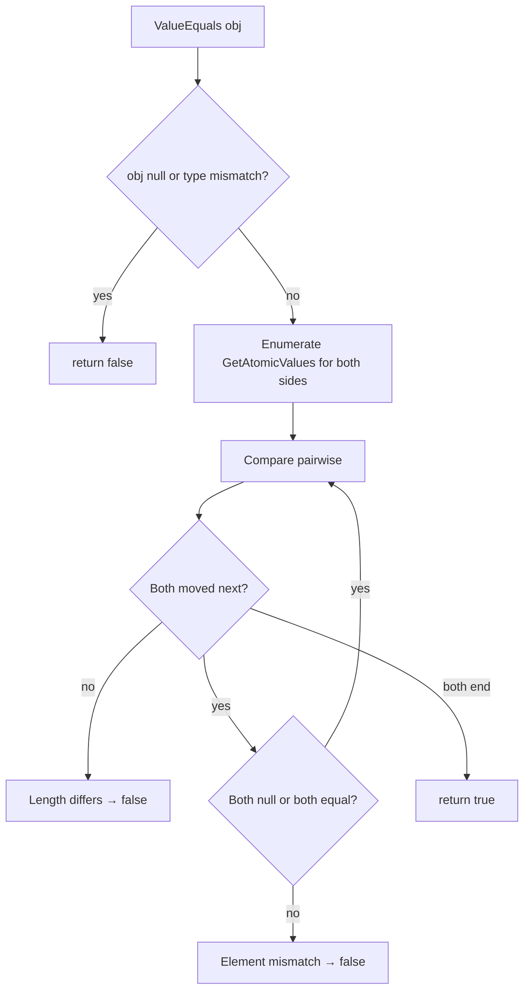

In Domain Driven Design, **value objects** model concepts that are defined
purely by their attributes — `Money(amount, currency)`, `Address(street, city,
postal)`, `DateRange(from, to)`. The ABP Framework ships a single base class,
`Volo.Abp.Domain.Values.ValueObject`, that captures the equality semantics
required for value-object types. This page is a walk-through of the class and
the patterns you build on top of it.

## File inventory

| Path | Role |
| --- | --- |
| `framework/src/Volo.Abp.Ddd.Domain/Volo/Abp/Domain/Values/ValueObject.cs` | `ValueObject` abstract base with `ValueEquals` and `GetAtomicValues` |

That is the entire surface. Value objects in ABP are deliberately a single
class — composability and immutability are conventions of your own type, not
infrastructure the framework provides.

## The `ValueObject` base class

```csharp framework/src/Volo.Abp.Ddd.Domain/Volo/Abp/Domain/Values/ValueObject.cs
//Inspired from https://docs.microsoft.com/en-us/dotnet/standard/microservices-architecture/microservice-ddd-cqrs-patterns/implement-value-objects

public abstract class ValueObject
{
    protected abstract IEnumerable<object> GetAtomicValues();

    public bool ValueEquals(object obj)
    {
        if (obj == null || obj.GetType() != GetType())
        {
            return false;
        }

        var other = (ValueObject)obj;

        var thisValues = GetAtomicValues().GetEnumerator();
        var otherValues = other.GetAtomicValues().GetEnumerator();

        var thisMoveNext = thisValues.MoveNext();
        var otherMoveNext = otherValues.MoveNext();
        while (thisMoveNext && otherMoveNext)
        {
            if (ReferenceEquals(thisValues.Current, null) ^ ReferenceEquals(otherValues.Current, null))
            {
                return false;
            }

            if (thisValues.Current != null && !thisValues.Current.Equals(otherValues.Current))
            {
                return false;
            }

            thisMoveNext = thisValues.MoveNext();
            otherMoveNext = otherValues.MoveNext();

            if (thisMoveNext != otherMoveNext)
            {
                return false;
            }
        }

        return !thisMoveNext && !otherMoveNext;
    }
}
```

Three observations from the source:

1. The class is `abstract` and forces subclasses to implement
   `GetAtomicValues()` — the ordered enumerable of fields that participates in
   equality.
2. Type equality is exact (`obj.GetType() != GetType()`) — a `Money` is never
   equal to a `DiscountedMoney`, even if they share atomic values.
3. The walk compares atomic values **pairwise** and short-circuits on the first
   mismatch. The XOR check (`ReferenceEquals(... null) ^ ...`) handles the case
   where one side has a `null` element and the other doesn't.

<Note>
`ValueEquals` is **not** an override of `object.Equals`. It is a separate
instance method. ABP intentionally keeps `Equals` / `GetHashCode` open so each
value-object type can choose the right hash strategy.
</Note>

## Anatomy of a value object

A typical ABP value object looks like this (this is a documentation pattern, not
shipped code — but it follows the conventions used throughout the modules in
`modules/`):

```csharp Address.cs (pattern)
public class Address : ValueObject
{
    public string Street { get; }
    public string City { get; }
    public string PostalCode { get; }
    public string Country { get; }

    private Address() { /* For ORM */ }

    public Address(string street, string city, string postalCode, string country)
    {
        Street = Check.NotNullOrWhiteSpace(street, nameof(street));
        City = Check.NotNullOrWhiteSpace(city, nameof(city));
        PostalCode = Check.NotNullOrWhiteSpace(postalCode, nameof(postalCode));
        Country = Check.NotNullOrWhiteSpace(country, nameof(country));
    }

    protected override IEnumerable<object> GetAtomicValues()
    {
        yield return Street;
        yield return City;
        yield return PostalCode;
        yield return Country;
    }
}
```

Two patterns are visible:

- A private parameterless constructor for ORM materialisation (EF Core /
  Mongo).
- Getter-only properties so consumers cannot mutate the object after
  construction.

## Equality semantics — step by step



A pairwise comparison means the **order** of fields in `GetAtomicValues` is
significant. Two value objects with the same fields in different order are not
equal — so always yield in the same canonical order.

## When (not) to inherit from `ValueObject`

| Use `ValueObject` when | Don't use `ValueObject` when |
| --- | --- |
| The concept is defined by its values (Money, Address, GeoPoint) | The concept has a lifecycle and identity (Customer, Order) — use `Entity<TKey>` instead |
| You want structural equality across instances | You need a database-generated identifier |
| The state is immutable once constructed | The aggregate root owns mutable behavior |

For identity-bearing classes use [`Entity<TKey>`](/ddd/entities-and-aggregates).

## Composing value objects inside aggregates

A common pattern is to expose a value object as a property on an aggregate:

```csharp Order.cs (pattern)
public class Order : AggregateRoot<Guid>
{
    public Address ShippingAddress { get; private set; }
    public Money Total { get; private set; }

    private Order() { /* ORM */ }

    public Order(Guid id, Address shippingAddress, Money total)
        : base(id)
    {
        ShippingAddress = Check.NotNull(shippingAddress, nameof(shippingAddress));
        Total = Check.NotNull(total, nameof(total));
    }

    public void ShipTo(Address newAddress)
    {
        ShippingAddress = newAddress;
        AddLocalEvent(new OrderShippingAddressChanged(Id, newAddress));
    }
}
```

EF Core models the value object either as an **owned type** or by mapping its
fields to columns of the owning entity's table. The relational integration in
[`framework/src/Volo.Abp.EntityFrameworkCore`](/data/entity-framework-core)
documents the configuration helpers available.

## Hashing and dictionary keys

Because `ValueObject` does not override `GetHashCode`, dictionary lookups on
value-object keys fall back to reference equality. If you need value-object keys
in `Dictionary<TKey,TValue>` or `HashSet<T>`, override `GetHashCode` in your
subclass — typically by XOR-folding the atomic values:

```csharp Money.cs (pattern)
public class Money : ValueObject
{
    public decimal Amount { get; }
    public string Currency { get; }

    public Money(decimal amount, string currency)
    {
        Amount = amount;
        Currency = Check.NotNullOrWhiteSpace(currency, nameof(currency));
    }

    protected override IEnumerable<object> GetAtomicValues()
    {
        yield return Amount;
        yield return Currency;
    }

    public override int GetHashCode() => HashCode.Combine(Amount, Currency);

    public override bool Equals(object? obj) => obj is Money m && ValueEquals(m);
}
```

## Comparing with `ValueEquals`

```csharp
var a = new Money(10m, "EUR");
var b = new Money(10m, "EUR");
var c = new Money(10m, "USD");

a.ValueEquals(b); // true  — same atomic values
a.ValueEquals(c); // false — Currency differs
a.ValueEquals(null); // false
a.ValueEquals("10 EUR"); // false — type mismatch
```

## Validation patterns

Value objects are an ideal place for **invariants**. Throwing in the
constructor guarantees the object cannot be constructed in an invalid state:

```csharp DateRange.cs (pattern)
public class DateRange : ValueObject
{
    public DateTime From { get; }
    public DateTime To { get; }

    public DateRange(DateTime from, DateTime to)
    {
        if (to < from)
        {
            throw new BusinessException("DateRange:InvalidOrder");
        }

        From = from;
        To = to;
    }

    protected override IEnumerable<object> GetAtomicValues()
    {
        yield return From;
        yield return To;
    }
}
```

`BusinessException` lives in `framework/src/Volo.Abp.ExceptionHandling/` and
flows through ABP's exception-translation pipeline so the error reaches the
client as a localized message.

## Module placement

The `ValueObject` base is part of `AbpDddDomainModule`. There is no separate
service to register — it's a pure abstract class with no DI footprint.

## Related pages

- [Entities and aggregates](/ddd/entities-and-aggregates) — value objects nested inside aggregates.
- [Repositories](/ddd/repositories) — repositories operate on aggregates that compose value objects.
- [Domain services](/ddd/domain-services) — coordinate across aggregates and value objects.
- [Object mapping](/ddd/object-mapping) — map value objects to / from DTOs.
- [Object extending](/data/abp-data) — alternative when you want loosely-typed extra properties instead of strongly-typed value objects.
