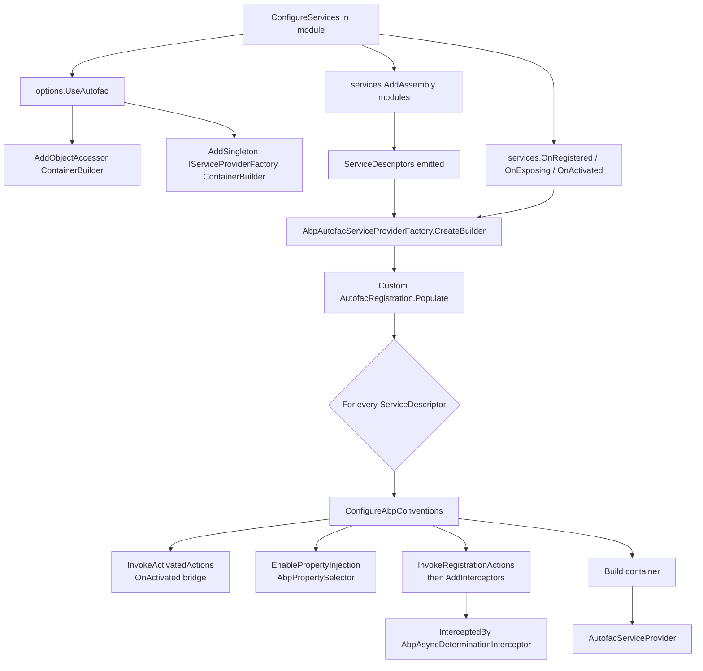

ABP runs on top of any container that consumes an `IServiceCollection`, but the framework's signature
features — property injection of `Logger` / `LazyServiceProvider`, and Castle DynamicProxy-based interception
for unit-of-work, auditing, authorization, and feature checks — require **Autofac**. Enabling Autofac is the
single line `options.UseAutofac()` in `AbpApplicationCreationOptions`; behind the scenes it installs
`AbpAutofacServiceProviderFactory`, which routes every `ServiceDescriptor` through
`AbpRegistrationBuilderExtensions.ConfigureAbpConventions` to bridge ABP's hooks into Autofac. This page
documents that wiring, the host-builder variant, and the Blazor WebAssembly bridge. All paths are under
`framework/src/Volo.Abp.Autofac/` and `framework/src/Volo.Abp.Autofac.WebAssembly/`.

## Files involved

| File | Role |
| --- | --- |
| `framework/src/Volo.Abp.Autofac/Volo/Abp/AbpAutofacAbpApplicationCreationOptionsExtensions.cs` | `options.UseAutofac()` and the `IServiceCollection` factory-installer. |
| `framework/src/Volo.Abp.Autofac/Volo/Abp/Autofac/AbpAutofacServiceProviderFactory.cs` | `IServiceProviderFactory<ContainerBuilder>` implementation. |
| `framework/src/Volo.Abp.Autofac/Volo/Abp/Autofac/AbpAutofacModule.cs` | The ABP module — depends on `AbpCastleCoreModule`. |
| `framework/src/Volo.Abp.Autofac/Volo/Abp/Autofac/AbpPropertySelector.cs` | The Autofac `IPropertySelector` filtering `[DisablePropertyInjection]`. |
| `framework/src/Volo.Abp.Autofac/Autofac/Builder/AbpRegistrationBuilderExtensions.cs` | Bridge for `OnRegistered`, `OnActivated`, property injection, and interceptors. |
| `framework/src/Volo.Abp.Autofac/Autofac/Extensions/DependencyInjection/AutofacRegistration.cs` | Re-implementation of `Populate` that calls into `ConfigureAbpConventions` for every descriptor. |
| `framework/src/Volo.Abp.Autofac/Microsoft/Extensions/Hosting/AbpAutofacHostBuilderExtensions.cs` | `IHostBuilder.UseAutofac()` for non-`AbpApplication` hosting. |
| `framework/src/Volo.Abp.Autofac/Microsoft/Extensions/DependencyInjection/AbpAutofacServiceCollectionExtensions.cs` | `GetContainerBuilder` accessor and `BuildAutofacServiceProvider`. |
| `framework/src/Volo.Abp.Autofac.WebAssembly/Microsoft/AspNetCore/Components/WebAssembly/Hosting/AbpWebAssemblyApplicationCreationOptionsAutofacExtensions.cs` | `options.UseAutofac()` for `AbpWebAssemblyApplicationCreationOptions`. |
| `framework/src/Volo.Abp.Autofac.WebAssembly/Volo/Abp/Autofac/WebAssembly/AbpAutofacWebAssemblyModule.cs` | Module wiring for the Blazor WebAssembly variant. |

## The `options.UseAutofac()` entry point

The entry point is one method, and it does two things: install the factory, and stash the
`ContainerBuilder` in an `ObjectAccessor` so the rest of the framework can reach it before the container is
built.

```csharp framework/src/Volo.Abp.Autofac/Volo/Abp/AbpAutofacAbpApplicationCreationOptionsExtensions.cs
public static class AbpAutofacAbpApplicationCreationOptionsExtensions
{
    public static void UseAutofac(this AbpApplicationCreationOptions options)
    {
        options.Services.AddAutofacServiceProviderFactory();
    }

    public static AbpAutofacServiceProviderFactory AddAutofacServiceProviderFactory(this IServiceCollection services)
    {
        return services.AddAutofacServiceProviderFactory(new ContainerBuilder());
    }

    public static AbpAutofacServiceProviderFactory AddAutofacServiceProviderFactory(this IServiceCollection services, ContainerBuilder containerBuilder)
    {
        var factory = new AbpAutofacServiceProviderFactory(containerBuilder);

        services.AddObjectAccessor(containerBuilder);
        services.AddSingleton((IServiceProviderFactory<ContainerBuilder>)factory);

        return factory;
    }
}
```

Two registrations are pushed:

1. `IObjectAccessor<ContainerBuilder>` — see [Lazy Providers](/di/lazy-service-provider#iobjectaccessort--the-cross-collection-bridge) for the pattern.
2. `IServiceProviderFactory<ContainerBuilder>` — picked up by the generic host pipeline.

Code outside the host can fetch the builder later via `services.GetContainerBuilder()`:

```csharp framework/src/Volo.Abp.Autofac/Microsoft/Extensions/DependencyInjection/AbpAutofacServiceCollectionExtensions.cs
public static ContainerBuilder GetContainerBuilder([NotNull] this IServiceCollection services)
{
    Check.NotNull(services, nameof(services));

    var builder = services.GetObjectOrNull<ContainerBuilder>();
    if (builder == null)
    {
        throw new AbpException($"Could not find ContainerBuilder. Be sure that you have called {nameof(AbpAutofacAbpApplicationCreationOptionsExtensions.UseAutofac)} method before!");
    }

    return builder;
}
```

<Warning>
`GetContainerBuilder()` throws *exactly* the message above if you call any of ABP's Autofac-only utilities
without `UseAutofac()`. Read it as "you forgot to enable Autofac".
</Warning>

## The factory

`AbpAutofacServiceProviderFactory` is a standard `IServiceProviderFactory<ContainerBuilder>`. The single
non-obvious detail: it uses the same `ContainerBuilder` instance that was put into the `ObjectAccessor`, so
modules that populated it during `ConfigureServices` see their changes survive.

```csharp framework/src/Volo.Abp.Autofac/Volo/Abp/Autofac/AbpAutofacServiceProviderFactory.cs
public class AbpAutofacServiceProviderFactory : IServiceProviderFactory<ContainerBuilder>
{
    private readonly ContainerBuilder _builder;
    private IServiceCollection _services = default!;

    public AbpAutofacServiceProviderFactory(ContainerBuilder builder)
    {
        _builder = builder;
    }

    public ContainerBuilder CreateBuilder(IServiceCollection services)
    {
        _services = services;

        _builder.Populate(services);

        return _builder;
    }

    public IServiceProvider CreateServiceProvider(ContainerBuilder containerBuilder)
    {
        Check.NotNull(containerBuilder, nameof(containerBuilder));

        return new AutofacServiceProvider(containerBuilder.Build());
    }
}
```

The `_builder.Populate(services)` call uses ABP's customised `AutofacRegistration.Populate` — see the next
section.

## The custom `Populate`

`framework/src/Volo.Abp.Autofac/Autofac/Extensions/DependencyInjection/AutofacRegistration.cs` is a fork of
`Autofac.Extensions.DependencyInjection.AutofacRegistration` (its license header is intact) that calls back
into `AbpRegistrationBuilderExtensions.ConfigureAbpConventions` for every `ServiceDescriptor` it processes.
That's where ABP's three pipelines (registered / activated / exposed) are bridged to Autofac, and where
property injection and interception are applied. The relevant call shape is:

```csharp framework/src/Volo.Abp.Autofac/Autofac/Extensions/DependencyInjection/AutofacRegistration.cs (excerpt)
builder.RegisterType<AutofacServiceProvider>()
    .As<IServiceProvider>()
    .As<IServiceProviderIsService>()
    .As<IKeyedServiceProvider>()
    .As<IServiceProviderIsKeyedService>()
    .ExternallyOwned();

var autofacServiceScopeFactory = typeof(AutofacServiceProvider).Assembly.GetType("Autofac.Extensions.DependencyInjection.AutofacServiceScopeFactory");
if (autofacServiceScopeFactory == null)
{
    throw new AbpException("Unable get type of Autofac.Extensions.DependencyInjection.AutofacServiceScopeFactory!");
}

// Issue #83: IServiceScopeFactory must be a singleton and scopes must be flat, not hierarchical.
builder
    .RegisterType(autofacServiceScopeFactory)
    .As<IServiceScopeFactory>()
    .SingleInstance();
```

The full file goes on to wire `KeyedServiceMiddlewareSource` and `AnyKeyRegistrationSource` for keyed
service compatibility, then iterates every descriptor and calls into the ABP-specific configuration. See
the file directly for the long version.

## The bridge in one diagram



## Property injection — the Autofac-only feature

This is fully covered in [Property Injection & Interception](/di/property-injection-and-interception),
but two short reminders here:

- Property injection is **only enabled by Autofac** because it's the only container ABP's bridge talks to.
  Hosting on the built-in MS DI container will silently disable every `public` setter.
- The selector lives in `AbpPropertySelector.cs`:

```csharp framework/src/Volo.Abp.Autofac/Volo/Abp/Autofac/AbpPropertySelector.cs
public class AbpPropertySelector : DefaultPropertySelector
{
    public AbpPropertySelector(bool preserveSetValues)
        : base(preserveSetValues)
    {
    }

    public override bool InjectProperty(PropertyInfo propertyInfo, object instance)
    {
        return propertyInfo.GetCustomAttributes(typeof(DisablePropertyInjectionAttribute), true).IsNullOrEmpty() &&
               base.InjectProperty(propertyInfo, instance);
    }
}
```

## Interception — bridged via `AbpAsyncDeterminationInterceptor`

Likewise documented in detail in [Castle Dynamic Proxy](/di/castle-dynamic-proxy). The Autofac side wires
Castle's `EnableInterfaceInterceptors` / `EnableClassInterceptors` and registers the closed-generic
adapter:

```csharp framework/src/Volo.Abp.Autofac/Autofac/Builder/AbpRegistrationBuilderExtensions.cs
foreach (var interceptor in interceptors)
{
    registrationBuilder.InterceptedBy(
        typeof(AbpAsyncDeterminationInterceptor<>).MakeGenericType(interceptor)
    );
}
```

The `AbpCastleCoreModule` registers `AbpAsyncDeterminationInterceptor<>` as an open generic in MS DI — that
in turn relies on the fact that `AbpAutofacModule` `[DependsOn]` it:

```csharp framework/src/Volo.Abp.Autofac/Volo/Abp/Autofac/AbpAutofacModule.cs
[DependsOn(typeof(AbpCastleCoreModule))]
public class AbpAutofacModule : AbpModule
{

}
```

```csharp framework/src/Volo.Abp.Castle.Core/Volo/Abp/Castle/AbpCastleCoreModule.cs
public class AbpCastleCoreModule : AbpModule
{
    public override void ConfigureServices(ServiceConfigurationContext context)
    {
        context.Services.AddTransient(typeof(AbpAsyncDeterminationInterceptor<>));
    }
}
```

## Hosting outside `AbpApplicationCreationOptions`

For Worker services and any other generic-host scenario where you have an `IHostBuilder` but not an
`AbpApplication`, ABP exposes a parallel `IHostBuilder.UseAutofac()`:

```csharp framework/src/Volo.Abp.Autofac/Microsoft/Extensions/Hosting/AbpAutofacHostBuilderExtensions.cs
public static class AbpAutofacHostBuilderExtensions
{
    public static IHostBuilder UseAutofac(this IHostBuilder hostBuilder)
    {
        var containerBuilder = new ContainerBuilder();

        return hostBuilder.ConfigureServices((_, services) =>
            {
                services.AddObjectAccessor(containerBuilder);
            })
            .UseServiceProviderFactory(new AbpAutofacServiceProviderFactory(containerBuilder));
    }
}
```

The pattern mirrors `options.UseAutofac()`: register the `ObjectAccessor<ContainerBuilder>` and install the
factory. `IHost.Run()` (or `IHostBuilder.Build()`) does the rest.

## Building a standalone provider

If you need an Autofac-backed `IServiceProvider` outside of a host (tests, scripts), the helper is:

```csharp framework/src/Volo.Abp.Autofac/Microsoft/Extensions/DependencyInjection/AbpAutofacServiceCollectionExtensions.cs
public static IServiceProvider BuildAutofacServiceProvider([NotNull] this IServiceCollection services, Action<ContainerBuilder>? builderAction = null)
{
    return services.BuildServiceProviderFromFactory(builderAction);
}
```

This relies on `BuildServiceProviderFromFactory` from
`Microsoft.Extensions.DependencyInjection` looking up the registered
`IServiceProviderFactory<ContainerBuilder>` — which means you must call `options.UseAutofac()`
**or** `AddAutofacServiceProviderFactory()` first.

## Blazor WebAssembly

The WebAssembly variant lives in its own assembly because `AbpWebAssemblyApplicationCreationOptions` has a
different shape (the host is built by `WebAssemblyHostBuilder`, not `IHostBuilder`).

```csharp framework/src/Volo.Abp.Autofac.WebAssembly/Microsoft/AspNetCore/Components/WebAssembly/Hosting/AbpWebAssemblyApplicationCreationOptionsAutofacExtensions.cs
public static class AbpWebAssemblyApplicationCreationOptionsAutofacExtensions
{
    public static void UseAutofac(
        [NotNull] this AbpWebAssemblyApplicationCreationOptions options,
        Action<ContainerBuilder>? configure = null)
    {
        options.HostBuilder.Services.AddAutofacServiceProviderFactory();
        options.HostBuilder.ConfigureContainer(
            options.HostBuilder.Services.GetSingletonInstance<IServiceProviderFactory<ContainerBuilder>>(),
            configure
        );
    }
}
```

```csharp framework/src/Volo.Abp.Autofac.WebAssembly/Volo/Abp/Autofac/WebAssembly/AbpAutofacWebAssemblyModule.cs
[DependsOn(
    typeof(AbpAutofacModule),
    typeof(AbpAspNetCoreComponentsWebAssemblyModule)
    )]
public class AbpAutofacWebAssemblyModule : AbpModule
{

}
```

What's specific to the WebAssembly side:

- The host builder is `WebAssemblyHostBuilder` from
  `Microsoft.AspNetCore.Components.WebAssembly.Hosting`. There is no generic `IHostBuilder`, so the
  generic-host `UseAutofac()` cannot be reused directly — hence this overload.
- The optional `Action<ContainerBuilder>` parameter lets you contribute Autofac-only registrations
  *before* the container is built (e.g. modules, interceptors, custom `Register*` calls).
- Module dependency on `AbpAspNetCoreComponentsWebAssemblyModule` ensures Blazor WebAssembly's framework
  services are present in the descriptor list before the factory builds the container.

## Picking the right extension

| Hosting model | Call |
| --- | --- |
| `AbpApplicationFactory.Create<TModule>(o => o.UseAutofac())` | `options.UseAutofac()` from `AbpAutofacAbpApplicationCreationOptionsExtensions`. |
| Generic host (worker / minimal host) | `Host.CreateDefaultBuilder(args).UseAutofac()` from `AbpAutofacHostBuilderExtensions`. |
| Blazor WebAssembly via `AbpWebAssemblyApplicationCreationOptions` | `options.UseAutofac(configure?)` from `AbpWebAssemblyApplicationCreationOptionsAutofacExtensions`. |
| Tests / scripts | `services.AddAutofacServiceProviderFactory()` + `services.BuildAutofacServiceProvider()`. |

## Worked example — minimal host

```csharp
public class Program
{
    public static async Task Main(string[] args)
    {
        await AbpApplicationFactory.CreateAsync<MyWorkerModule>(options =>
        {
            options.UseAutofac();
        }).RunAsync();
    }
}

[DependsOn(typeof(AbpAutofacModule))]
public class MyWorkerModule : AbpModule
{
    public override void ConfigureServices(ServiceConfigurationContext context)
    {
        context.Services.OnRegistered(ctx =>
        {
            if (typeof(IBackgroundJob).IsAssignableFrom(ctx.ImplementationType))
            {
                ctx.Interceptors.TryAdd<MyJobInterceptor>();
            }
        });
    }
}
```

The interceptor will be wrapped by `AbpAsyncDeterminationInterceptor<MyJobInterceptor>` and applied at
activation — no per-type plumbing required.

## Common gotchas

<Warning>
- **Module ordering matters.** Add `[DependsOn(typeof(AbpAutofacModule))]` to your composition root module
  so the Castle interceptor open-generic is registered before any module that pushes interceptors.
- **Use exactly one host-level `UseAutofac()`.** Calling it twice creates two factories; only the last one
  wins, but `AddObjectAccessor<ContainerBuilder>` will throw because it's already registered.
- **`Services.AddAutofacServiceProviderFactory(containerBuilder)` overload is your seam** when you need to
  pre-configure the builder (modules, scopes) before ABP populates it.
- **Blazor WebAssembly modules must `[DependsOn]` `AbpAutofacWebAssemblyModule`,** not the generic
  `AbpAutofacModule`, because the WebAssembly module pulls in the Components.WebAssembly framework module.
- **The factory keeps a single `ContainerBuilder` reference.** If you mutate the builder *after*
  `CreateBuilder` runs but before `CreateServiceProvider`, your changes are included — useful for late
  module contributions.
</Warning>

## Cross-links

<CardGroup cols={3}>
  <Card title="Property Injection & Interception" icon="syringe" href="/di/property-injection-and-interception">Hooks bridged by `ConfigureAbpConventions`.</Card>
  <Card title="Castle Dynamic Proxy" icon="puzzle-piece" href="/di/castle-dynamic-proxy">The interceptor adapter used by Autofac registrations.</Card>
  <Card title="Conventional Registration" icon="gear" href="/di/conventional-registration">Where the `ServiceDescriptor`s come from.</Card>
</CardGroup>
