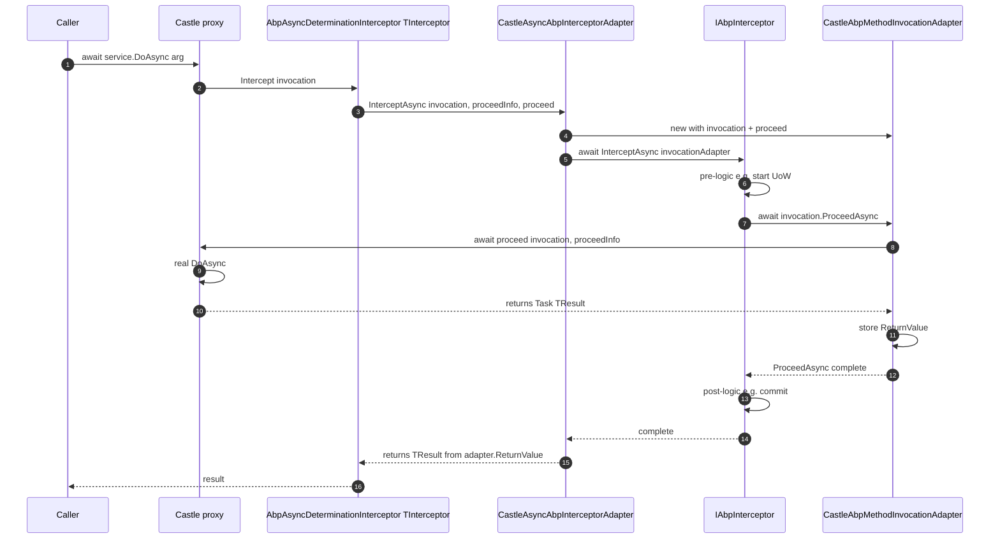

ABP's interception model is intentionally container-agnostic: modules write interceptors against
`IAbpInterceptor`, never against a Castle type. The bridge that lets those interceptors actually run on top of
Castle DynamicProxy lives in a tiny module, `Volo.Abp.Castle.Core`. It contributes one open generic to MS DI
(`AbpAsyncDeterminationInterceptor<>`) plus three adapter classes that translate Castle's synchronous-or-async
`IInvocation` model into ABP's purely async `IAbpMethodInvocation`. This page documents every type in that
module and how it co-operates with the [Autofac integration](/di/autofac-integration) to produce a working
proxy. All paths are under `framework/src/Volo.Abp.Castle.Core/`.

## Files involved

| File | Role |
| --- | --- |
| `framework/src/Volo.Abp.Castle.Core/Volo/Abp/Castle/AbpCastleCoreModule.cs` | The ABP module — registers `AbpAsyncDeterminationInterceptor<>` as transient. |
| `framework/src/Volo.Abp.Castle.Core/Volo/Abp/Castle/DynamicProxy/AbpAsyncDeterminationInterceptor.cs` | Castle interceptor that dispatches to a `CastleAsyncAbpInterceptorAdapter<TInterceptor>`. |
| `framework/src/Volo.Abp.Castle.Core/Volo/Abp/Castle/DynamicProxy/CastleAsyncAbpInterceptorAdapter.cs` | Bridges `AsyncInterceptorBase` (from Castle.Core.AsyncInterceptor) to `IAbpInterceptor.InterceptAsync`. |
| `framework/src/Volo.Abp.Castle.Core/Volo/Abp/Castle/DynamicProxy/CastleAbpMethodInvocationAdapterBase.cs` | Common adapter for `IInvocation` → `IAbpMethodInvocation`. |
| `framework/src/Volo.Abp.Castle.Core/Volo/Abp/Castle/DynamicProxy/CastleAbpMethodInvocationAdapter.cs` | Adapter for void / `Task`-returning methods. |
| `framework/src/Volo.Abp.Castle.Core/Volo/Abp/Castle/DynamicProxy/CastleAbpMethodInvocationAdapterWithReturnValue.cs` | Adapter for `Task<TResult>`-returning methods. |
| `framework/src/Volo.Abp.Core/Volo/Abp/DynamicProxy/IAbpInterceptor.cs` | The ABP-side contract. |
| `framework/src/Volo.Abp.Core/Volo/Abp/DynamicProxy/IAbpMethodInvocation.cs` | The ABP-side method invocation. |
| `framework/src/Volo.Abp.Core/Volo/Abp/DynamicProxy/ProxyHelper.cs` | Utilities for un-proxying / inspecting Castle-generated types. |

## The module

`AbpCastleCoreModule` does just one thing — register the closed-over generic Castle wrapper so any
`AbpAsyncDeterminationInterceptor<TInterceptor>` can be resolved on demand.

```csharp framework/src/Volo.Abp.Castle.Core/Volo/Abp/Castle/AbpCastleCoreModule.cs
public class AbpCastleCoreModule : AbpModule
{
    public override void ConfigureServices(ServiceConfigurationContext context)
    {
        context.Services.AddTransient(typeof(AbpAsyncDeterminationInterceptor<>));
    }
}
```

`AbpAutofacModule` `[DependsOn(typeof(AbpCastleCoreModule))]`, so any Autofac-backed application picks this
up automatically.

## The Castle entry point

`AbpAsyncDeterminationInterceptor<TInterceptor>` is the type Autofac actually attaches to a registration via
`.InterceptedBy(typeof(AbpAsyncDeterminationInterceptor<>).MakeGenericType(interceptor))`. It inherits from
`AsyncDeterminationInterceptor` (from the *Castle.Core.AsyncInterceptor* package), which figures out whether
each intercepted method is sync, `Task`, or `Task<T>` and routes to the right method on the underlying
adapter.

```csharp framework/src/Volo.Abp.Castle.Core/Volo/Abp/Castle/DynamicProxy/AbpAsyncDeterminationInterceptor.cs
public class AbpAsyncDeterminationInterceptor<TInterceptor> : AsyncDeterminationInterceptor
    where TInterceptor : IAbpInterceptor
{
    public AbpAsyncDeterminationInterceptor(TInterceptor abpInterceptor)
        : base(new CastleAsyncAbpInterceptorAdapter<TInterceptor>(abpInterceptor))
    {

    }
}
```

The constructor takes the actual `IAbpInterceptor` instance (resolved by the container) and wraps it in a
`CastleAsyncAbpInterceptorAdapter`. Because the wrapper is **transient**, every intercepted resolution gets
its own adapter — keep this in mind for interceptors that store per-call state.

## The async adapter

`CastleAsyncAbpInterceptorAdapter<TInterceptor>` inherits Castle's `AsyncInterceptorBase` and overrides the
two abstract methods (one for `Task`, one for `Task<TResult>`). Each adapter call builds an
`IAbpMethodInvocation` from the `IInvocation` + a continuation, and hands it to the underlying ABP
interceptor.

```csharp framework/src/Volo.Abp.Castle.Core/Volo/Abp/Castle/DynamicProxy/CastleAsyncAbpInterceptorAdapter.cs
public class CastleAsyncAbpInterceptorAdapter<TInterceptor> : AsyncInterceptorBase
    where TInterceptor : IAbpInterceptor
{
    private readonly TInterceptor _abpInterceptor;

    public CastleAsyncAbpInterceptorAdapter(TInterceptor abpInterceptor)
    {
        _abpInterceptor = abpInterceptor;
    }

    protected override async Task InterceptAsync(IInvocation invocation, IInvocationProceedInfo proceedInfo, Func<IInvocation, IInvocationProceedInfo, Task> proceed)
    {
        await _abpInterceptor.InterceptAsync(
            new CastleAbpMethodInvocationAdapter(invocation, proceedInfo, proceed)
        );
    }

    protected override async Task<TResult> InterceptAsync<TResult>(IInvocation invocation, IInvocationProceedInfo proceedInfo, Func<IInvocation, IInvocationProceedInfo, Task<TResult>> proceed)
    {
        var adapter = new CastleAbpMethodInvocationAdapterWithReturnValue<TResult>(invocation, proceedInfo, proceed);

        await _abpInterceptor.InterceptAsync(
            adapter
        );

        return (TResult)adapter.ReturnValue;
    }
}
```

Important details:

- The `Func<IInvocation, IInvocationProceedInfo, Task<TResult>> proceed` lambda is what Castle uses to
  invoke the *next* interceptor or, eventually, the target method. ABP forwards it via `ProceedAsync` on the
  adapter.
- The `Task<TResult>` overload reads `ReturnValue` back from the adapter after the interceptor has run.
  Your interceptor must therefore set `invocation.ReturnValue = …` (or rely on `ProceedAsync` to do it) —
  not just return a value.

## The method invocation adapter — base

`CastleAbpMethodInvocationAdapterBase` does most of the work. It exposes the same shape `IAbpMethodInvocation`
demands, lazily computing the parameter-name → value dictionary because most interceptors don't read it.

```csharp framework/src/Volo.Abp.Castle.Core/Volo/Abp/Castle/DynamicProxy/CastleAbpMethodInvocationAdapterBase.cs
public abstract class CastleAbpMethodInvocationAdapterBase : IAbpMethodInvocation
{
    public object[] Arguments => Invocation.Arguments;

    public IReadOnlyDictionary<string, object> ArgumentsDictionary => _lazyArgumentsDictionary.Value;
    private readonly Lazy<IReadOnlyDictionary<string, object>> _lazyArgumentsDictionary;

    public Type[] GenericArguments => Invocation.GenericArguments;

    public object TargetObject => Invocation.InvocationTarget ?? Invocation.MethodInvocationTarget;

    public MethodInfo Method => Invocation.MethodInvocationTarget ?? Invocation.Method;

    public object ReturnValue { get; set; } = default!;

    protected IInvocation Invocation { get; }

    protected CastleAbpMethodInvocationAdapterBase(IInvocation invocation)
    {
        Invocation = invocation;
        _lazyArgumentsDictionary = new Lazy<IReadOnlyDictionary<string, object>>(GetArgumentsDictionary);
    }

    public abstract Task ProceedAsync();

    private IReadOnlyDictionary<string, object> GetArgumentsDictionary()
    {
        var dict = new Dictionary<string, object>();

        var methodParameters = Method.GetParameters();
        for (int i = 0; i < methodParameters.Length; i++)
        {
            dict[methodParameters[i].Name!] = Invocation.Arguments[i];
        }

        return dict;
    }
}
```

Note the two coalescing reads:

- `TargetObject = Invocation.InvocationTarget ?? Invocation.MethodInvocationTarget`. With class proxies the
  *invocation* target and the *method-invocation* target can differ; the coalesce keeps interceptor code
  agnostic to that distinction.
- `Method = Invocation.MethodInvocationTarget ?? Invocation.Method`. The `MethodInvocationTarget` is the
  resolved implementation method (post-overrides); `Invocation.Method` is the interface declaration. The
  coalesce gives you the most specific `MethodInfo` available.

## The two concrete adapters

`CastleAbpMethodInvocationAdapter` covers `void` and `Task` returns; it just awaits the supplied `proceed`
continuation.

```csharp framework/src/Volo.Abp.Castle.Core/Volo/Abp/Castle/DynamicProxy/CastleAbpMethodInvocationAdapter.cs
public class CastleAbpMethodInvocationAdapter : CastleAbpMethodInvocationAdapterBase, IAbpMethodInvocation
{
    protected IInvocationProceedInfo ProceedInfo { get; }
    protected Func<IInvocation, IInvocationProceedInfo, Task> Proceed { get; }

    public CastleAbpMethodInvocationAdapter(IInvocation invocation, IInvocationProceedInfo proceedInfo,
        Func<IInvocation, IInvocationProceedInfo, Task> proceed)
        : base(invocation)
    {
        ProceedInfo = proceedInfo;
        Proceed = proceed;
    }

    public override async Task ProceedAsync()
    {
        await Proceed(Invocation, ProceedInfo);
    }
}
```

`CastleAbpMethodInvocationAdapterWithReturnValue<TResult>` covers `Task<TResult>` and stuffs the result back
into `ReturnValue` so the outer `CastleAsyncAbpInterceptorAdapter` can pick it up:

```csharp framework/src/Volo.Abp.Castle.Core/Volo/Abp/Castle/DynamicProxy/CastleAbpMethodInvocationAdapterWithReturnValue.cs
public class CastleAbpMethodInvocationAdapterWithReturnValue<TResult> : CastleAbpMethodInvocationAdapterBase, IAbpMethodInvocation
{
    protected IInvocationProceedInfo ProceedInfo { get; }
    protected Func<IInvocation, IInvocationProceedInfo, Task<TResult>> Proceed { get; }

    public CastleAbpMethodInvocationAdapterWithReturnValue(IInvocation invocation,
        IInvocationProceedInfo proceedInfo,
        Func<IInvocation, IInvocationProceedInfo, Task<TResult>> proceed)
        : base(invocation)
    {
        ProceedInfo = proceedInfo;
        Proceed = proceed;
    }

    public override async Task ProceedAsync()
    {
        ReturnValue = (await Proceed(Invocation, ProceedInfo))!;
    }
}
```

## Putting it together



## Writing an interceptor

```csharp
public class TimingInterceptor : AbpInterceptor, ITransientDependency
{
    private readonly ILogger<TimingInterceptor> _logger;

    public TimingInterceptor(ILogger<TimingInterceptor> logger)
    {
        _logger = logger;
    }

    public override async Task InterceptAsync(IAbpMethodInvocation invocation)
    {
        var sw = System.Diagnostics.Stopwatch.StartNew();
        try
        {
            await invocation.ProceedAsync();
        }
        finally
        {
            sw.Stop();
            _logger.LogInformation(
                "{Type}.{Method} took {Elapsed} ms",
                invocation.TargetObject.GetType().Name,
                invocation.Method.Name,
                sw.ElapsedMilliseconds);
        }
    }
}
```

Wire it up:

```csharp
public override void ConfigureServices(ServiceConfigurationContext context)
{
    context.Services.OnRegistered(ctx =>
    {
        if (typeof(IApplicationService).IsAssignableFrom(ctx.ImplementationType))
        {
            ctx.Interceptors.TryAdd<TimingInterceptor>();
        }
    });
}
```

See [Property Injection & Interception](/di/property-injection-and-interception#interception--the-activation-pipeline)
for the full registration story and [Autofac Integration](/di/autofac-integration) for the container glue.

## Un-proxying — `ProxyHelper`

ABP also ships a small utility for situations where you need to reach through the proxy to the underlying
instance (e.g. equality / reflection from infrastructure code).

```csharp framework/src/Volo.Abp.Core/Volo/Abp/DynamicProxy/ProxyHelper.cs
public static class ProxyHelper
{
    private const string ProxyNamespace = "Castle.Proxies";

    public static object UnProxy(object obj)
    {
        if (obj.GetType().Namespace != ProxyNamespace)
        {
            return obj;
        }

        var targetField = obj.GetType()
            .GetFields(BindingFlags.Instance | BindingFlags.NonPublic)
            .FirstOrDefault(f => f.Name == "__target");

        if (targetField == null)
        {
            return obj;
        }

        return targetField.GetValue(obj)!;
    }

    public static Type GetUnProxiedType(object obj)
    {
        if (obj.GetType().Namespace == ProxyNamespace)
        {
            var target = UnProxy(obj);
            if (target == obj)
            {
                return obj.GetType().GetTypeInfo().BaseType!;
            }

            return target.GetType();
        }

        return obj.GetType();
    }
}
```

Two cases the helper handles:

- **Interface proxy** — has a private `__target` field whose value is the underlying implementation.
  `UnProxy` reads it.
- **Class proxy** — there is no `__target`; the proxy *is* a subclass of the real type, so
  `GetUnProxiedType` returns `obj.GetType().BaseType`.

<Tip>
Always prefer `ProxyHelper.GetUnProxiedType(obj)` over `obj.GetType()` when you need to compare types,
serialise type names, or look up custom attributes — the proxy's metadata is "noise".
</Tip>

## Why an "async determination" interceptor at all?

Castle DynamicProxy by itself is synchronous: `IInterceptor.Intercept(IInvocation)`. The community wrapper
**Castle.Core.AsyncInterceptor** adds `AsyncInterceptorBase`, which inspects the method's return type at
runtime and dispatches to one of three callbacks — sync, `Task`, or `Task<T>`. `AsyncDeterminationInterceptor`
is its base class.

ABP picks this design because **every** ABP interceptor is declared as async (`Task InterceptAsync(...)`).
The async-determination layer makes that uniform shape work over synchronous target methods (Castle still
returns synchronously, but the interceptor body itself is allowed to `await`).

## Gotchas

<Warning>
- **Sync methods returning a non-`Task`/non-`Task<T>` value** are wrapped synchronously by
  `AsyncDeterminationInterceptor`. Your interceptor's `InterceptAsync` will still be awaited, but blocking
  inside it will block the calling thread — *do not* call `.Result` or `.Wait()` inside an interceptor.
- **`ReturnValue` is the source of truth for `Task<T>`.** Setting `invocation.ReturnValue = something` in an
  interceptor wins over whatever the target method returned. Useful for short-circuiting, dangerous if done
  by accident.
- **Class proxies require unsealed, virtual members.** The Castle layer cannot intercept sealed or
  non-virtual methods; the interceptor simply is not invoked.
- **`__target` field is private.** `ProxyHelper.UnProxy` uses reflection (`BindingFlags.NonPublic`). If
  Castle ever renames it (it has been stable for many years), this helper would silently fall back to
  returning the proxy unchanged.
- **The wrapper is transient.** A single resolved service uses one wrapper per call site — don't store
  per-instance state on `AbpAsyncDeterminationInterceptor<TInterceptor>` itself; store it on the inner
  `IAbpInterceptor`.
</Warning>

## Cross-links

<CardGroup cols={3}>
  <Card title="Property Injection & Interception" icon="syringe" href="/di/property-injection-and-interception">The `OnRegistered` event and `IAbpInterceptor` contract.</Card>
  <Card title="Autofac Integration" icon="plug" href="/di/autofac-integration">Where `AbpAsyncDeterminationInterceptor<>` is attached.</Card>
  <Card title="Overview" icon="map" href="/di/overview">Big-picture pipeline.</Card>
</CardGroup>
