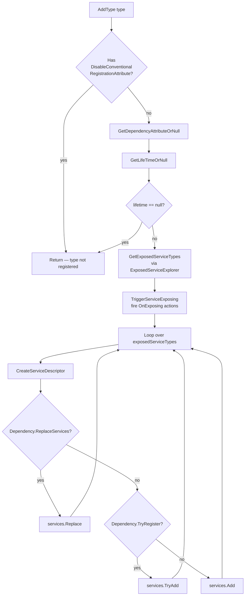

ABP discovers and registers services by running every module assembly through a chain of
`IConventionalRegistrar` instances. The default registrar — `DefaultConventionalRegistrar` — turns
`ITransientDependency` / `ISingletonDependency` / `IScopedDependency` markers, `[Dependency]` attributes, and
`[ExposeServices]` declarations into MS-DI `ServiceDescriptor`s. This page documents every moving part so you
can predict what gets registered, and shows how to plug in your own registrar when the default rules are not
enough. All source lives under `framework/src/Volo.Abp.Core/Volo/Abp/DependencyInjection/`.

## Files involved

| File | Role |
| --- | --- |
| `IConventionalRegistrar.cs` | Three-method contract: `AddAssembly`, `AddTypes`, `AddType`. |
| `ConventionalRegistrarBase.cs` | Shared logic: type filtering, exposed-service computation, lifetime fallback, descriptor creation, redirect rules. |
| `DefaultConventionalRegistrar.cs` | The single concrete registrar the framework installs by default. |
| `ConventionalRegistrarList.cs` | `internal class ConventionalRegistrarList : List<IConventionalRegistrar>` — kept in an `IObjectAccessor` on the service collection. |
| `DependencyAttribute.cs` | Optional class-level attribute controlling lifetime, `TryRegister`, and `ReplaceServices`. |
| `DisableConventionalRegistrationAttribute.cs` | Skips a class entirely. |
| `ITransientDependency.cs` / `ISingletonDependency.cs` / `IScopedDependency.cs` | Marker interfaces used for lifetime detection. |
| `ExposedServiceExplorer.cs` | Decides the list of exposed service types — see [Exposed Services](/di/exposed-services). |
| `framework/src/Volo.Abp.Core/Microsoft/Extensions/DependencyInjection/ServiceCollectionConventionalRegistrationExtensions.cs` | `IServiceCollection.AddConventionalRegistrar`, `AddAssembly`, `AddAssemblyOf<T>`, `AddTypes`, `AddType`, `GetConventionalRegistrars`. |

## The interface

`IConventionalRegistrar` is intentionally tiny — it operates on `IServiceCollection` plus a reflected
`Assembly` or `Type`.

```csharp framework/src/Volo.Abp.Core/Volo/Abp/DependencyInjection/IConventionalRegistrar.cs
public interface IConventionalRegistrar
{
    void AddAssembly(IServiceCollection services, Assembly assembly);

    void AddTypes(IServiceCollection services, params Type[] types);

    void AddType(IServiceCollection services, Type type);
}
```

## Shared logic — `ConventionalRegistrarBase`

`ConventionalRegistrarBase` provides the discovery loop and the bulk of the policy. The only abstract member
is `AddType`; concrete subclasses customise it.

```csharp framework/src/Volo.Abp.Core/Volo/Abp/DependencyInjection/ConventionalRegistrarBase.cs
public virtual void AddAssembly(IServiceCollection services, Assembly assembly)
{
    var types = AssemblyHelper
        .GetAllTypes(assembly)
        .Where(
            type => type != null &&
                    type.IsClass &&
                    !type.IsAbstract &&
                    !type.IsGenericType
        ).ToArray();

    AddTypes(services, types);
}
```

<Warning>
Open generic types and abstract classes are filtered out *before* any of the rest of the pipeline runs. If
you need an open-generic registration (the canonical case is a repository), register it explicitly:

```csharp
services.AddTransient(typeof(IRepository<>), typeof(EfCoreRepository<>));
```
</Warning>

### Lifetime detection

The base class encodes a three-tier fallback:

1. `DependencyAttribute.Lifetime` wins if present.
2. Otherwise, the marker-interface check: `ITransientDependency` → `Transient`, `ISingletonDependency` →
   `Singleton`, `IScopedDependency` → `Scoped`.
3. Otherwise, the virtual `GetDefaultLifeTimeOrNull(type)` (returns `null` by default — i.e. no registration).

```csharp framework/src/Volo.Abp.Core/Volo/Abp/DependencyInjection/ConventionalRegistrarBase.cs
protected virtual ServiceLifetime? GetLifeTimeOrNull(Type type, DependencyAttribute? dependencyAttribute)
{
    return dependencyAttribute?.Lifetime
        ?? GetServiceLifetimeFromClassHierarchy(type)
        ?? GetDefaultLifeTimeOrNull(type);
}

protected virtual ServiceLifetime? GetServiceLifetimeFromClassHierarchy(Type type)
{
    if (typeof(ITransientDependency).GetTypeInfo().IsAssignableFrom(type))
    {
        return ServiceLifetime.Transient;
    }

    if (typeof(ISingletonDependency).GetTypeInfo().IsAssignableFrom(type))
    {
        return ServiceLifetime.Singleton;
    }

    if (typeof(IScopedDependency).GetTypeInfo().IsAssignableFrom(type))
    {
        return ServiceLifetime.Scoped;
    }

    return null;
}
```

### Descriptor creation and the redirect trick

For `Singleton` and `Scoped` services exposed under multiple service types, ABP avoids the classical
"two singletons" bug by **redirecting** secondary descriptors to the primary one via a factory. The
primary is chosen as the descriptor whose service type equals the implementation type, otherwise the first
exposed type that is assignable to the current one.

```csharp framework/src/Volo.Abp.Core/Volo/Abp/DependencyInjection/ConventionalRegistrarBase.cs
protected virtual ServiceDescriptor CreateServiceDescriptor(
    Type implementationType,
    Type exposingServiceType,
    List<Type> allExposingServiceTypes,
    ServiceLifetime lifeTime)
{
    if (lifeTime.IsIn(ServiceLifetime.Singleton, ServiceLifetime.Scoped))
    {
        var redirectedType = GetRedirectedTypeOrNull(
            implementationType,
            exposingServiceType,
            allExposingServiceTypes
        );

        if (redirectedType != null)
        {
            return ServiceDescriptor.Describe(
                exposingServiceType,
                provider => provider.GetService(redirectedType)!,
                lifeTime
            );
        }
    }

    return ServiceDescriptor.Describe(
        exposingServiceType,
        implementationType,
        lifeTime
    );
}
```

<Tip>
This is why injecting two different service interfaces of the same scoped class always yields the **same**
instance — there is exactly one singleton/scoped slot for the implementation type, and the other slots are
factory-redirects to it.
</Tip>

## `DefaultConventionalRegistrar`

The default registrar wires the four primitives together. Note the `TODO` left by the maintainers about
making the type extensible by overriding only `GetLifeTimeOrNull`.

```csharp framework/src/Volo.Abp.Core/Volo/Abp/DependencyInjection/DefaultConventionalRegistrar.cs
//TODO: Make DefaultConventionalRegistrar extensible, so we can only define GetLifeTimeOrNull to contribute to the convention. This can be more performant!
public class DefaultConventionalRegistrar : ConventionalRegistrarBase
{
    public override void AddType(IServiceCollection services, Type type)
    {
        if (IsConventionalRegistrationDisabled(type))
        {
            return;
        }

        var dependencyAttribute = GetDependencyAttributeOrNull(type);
        var lifeTime = GetLifeTimeOrNull(type, dependencyAttribute);

        if (lifeTime == null)
        {
            return;
        }

        var exposedServiceTypes = GetExposedServiceTypes(type);

        TriggerServiceExposing(services, type, exposedServiceTypes);

        foreach (var exposedServiceType in exposedServiceTypes)
        {
            var serviceDescriptor = CreateServiceDescriptor(
                type,
                exposedServiceType,
                exposedServiceTypes,
                lifeTime.Value
            );

            if (dependencyAttribute?.ReplaceServices == true)
            {
                services.Replace(serviceDescriptor);
            }
            else if (dependencyAttribute?.TryRegister == true)
            {
                services.TryAdd(serviceDescriptor);
            }
            else
            {
                services.Add(serviceDescriptor);
            }
        }
    }
}
```

## Per-type flow



## Lifetime markers

The three marker interfaces are empty contracts; they exist purely so reflection can detect the intended
lifetime.

```csharp framework/src/Volo.Abp.Core/Volo/Abp/DependencyInjection/ITransientDependency.cs
namespace Volo.Abp.DependencyInjection;

public interface ITransientDependency
{

}
```

```csharp framework/src/Volo.Abp.Core/Volo/Abp/DependencyInjection/ISingletonDependency.cs
namespace Volo.Abp.DependencyInjection;

public interface ISingletonDependency
{

}
```

```csharp framework/src/Volo.Abp.Core/Volo/Abp/DependencyInjection/IScopedDependency.cs
namespace Volo.Abp.DependencyInjection;

public interface IScopedDependency
{
}
```

### Pick rule of thumb

| Use… | When |
| --- | --- |
| `ITransientDependency` | Cheap, stateless services. Most application/domain services in ABP. |
| `IScopedDependency` | Per-request state, EF Core repositories, current-user-scoped caches. |
| `ISingletonDependency` | Heavy initialisation, in-memory caches, framework-wide options. |

<Warning>
A class can't combine markers — the `GetServiceLifetimeFromClassHierarchy` check fires in declaration order
(Transient → Singleton → Scoped) and returns the first hit. Don't rely on this; pick exactly one.
</Warning>

## The `DependencyAttribute`

`DependencyAttribute` is the explicit override path. It can:

- Pin the lifetime independently of the marker hierarchy.
- Switch `services.Add` into `services.TryAdd` (`TryRegister = true`).
- Switch `services.Add` into `services.Replace` (`ReplaceServices = true`).

```csharp framework/src/Volo.Abp.Core/Volo/Abp/DependencyInjection/DependencyAttribute.cs
public class DependencyAttribute : Attribute
{
    public virtual ServiceLifetime? Lifetime { get; set; }

    public virtual bool TryRegister { get; set; }

    public virtual bool ReplaceServices { get; set; }

    public DependencyAttribute()
    {

    }

    public DependencyAttribute(ServiceLifetime lifetime)
    {
        Lifetime = lifetime;
    }
}
```

### Common patterns

```csharp
// Replace another module's IMyService implementation
[Dependency(ReplaceServices = true)]
[ExposeServices(typeof(IMyService))]
public class CustomMyService : IMyService, ITransientDependency { ... }

// Only register if nobody else has
[Dependency(ServiceLifetime.Scoped, TryRegister = true)]
public class FallbackUserContext : IUserContext { ... }
```

<Warning>
`TryRegister` short-circuits on the **first** registered descriptor for that service type. Order matters —
make sure the module providing the fallback runs **before** the module providing the real implementation,
or your fallback will mask the real one.
</Warning>

## Opting out — `[DisableConventionalRegistration]`

The simplest escape hatch. The `inherit = true` argument in
`type.IsDefined(typeof(DisableConventionalRegistrationAttribute), true)` means the attribute is honoured even
when inherited from a base class.

```csharp framework/src/Volo.Abp.Core/Volo/Abp/DependencyInjection/DisableConventionalRegistrationAttribute.cs
public class DisableConventionalRegistrationAttribute : Attribute
{

}
```

Use it when you need full manual control of the descriptor — for example to register a service against many
keys, or to add it as a factory:

```csharp
services.AddSingleton<ISpecialThing>(sp => new SpecialThing(sp.GetRequiredService<IFoo>()));
```

## Driving the pipeline from `IServiceCollection`

The `ServiceCollectionConventionalRegistrationExtensions` static class is where modules and tests reach into
the registrar list:

```csharp framework/src/Volo.Abp.Core/Microsoft/Extensions/DependencyInjection/ServiceCollectionConventionalRegistrationExtensions.cs
public static IServiceCollection AddConventionalRegistrar(this IServiceCollection services, IConventionalRegistrar registrar)
{
    GetOrCreateRegistrarList(services).Add(registrar);
    return services;
}

public static List<IConventionalRegistrar> GetConventionalRegistrars(this IServiceCollection services)
{
    return GetOrCreateRegistrarList(services);
}

private static ConventionalRegistrarList GetOrCreateRegistrarList(IServiceCollection services)
{
    var conventionalRegistrars = services.GetSingletonInstanceOrNull<IObjectAccessor<ConventionalRegistrarList>>()?.Value;
    if (conventionalRegistrars == null)
    {
        conventionalRegistrars = new ConventionalRegistrarList { new DefaultConventionalRegistrar() };
        services.AddObjectAccessor(conventionalRegistrars);
    }

    return conventionalRegistrars;
}
```

Note the seeded `DefaultConventionalRegistrar` — calling `AddConventionalRegistrar` *adds* to the chain, it
does not replace the default. To replace the default entirely you have to mutate the list returned by
`GetConventionalRegistrars`.

### Per-assembly and per-type helpers

```csharp framework/src/Volo.Abp.Core/Microsoft/Extensions/DependencyInjection/ServiceCollectionConventionalRegistrationExtensions.cs
public static IServiceCollection AddAssemblyOf<T>(this IServiceCollection services)
{
    return services.AddAssembly(typeof(T).GetTypeInfo().Assembly);
}

public static IServiceCollection AddAssembly(this IServiceCollection services, Assembly assembly)
{
    foreach (var registrar in services.GetConventionalRegistrars())
    {
        registrar.AddAssembly(services, assembly);
    }

    return services;
}
```

`AddAssembly` is what `AbpApplicationBase.ConfigureServicesAsync` calls for every module assembly. Modules
rarely need to call it themselves — opt out with `AbpModule.SkipAutoServiceRegistration` if you want manual
control.

## Building a custom registrar

A common reason to add a registrar is to register types that don't follow ABP's naming conventions, or to
fold a third-party library into the same pipeline. Inherit from `ConventionalRegistrarBase` and override
`AddType`:

```csharp
public class HandlerConventionalRegistrar : ConventionalRegistrarBase
{
    public override void AddType(IServiceCollection services, Type type)
    {
        if (IsConventionalRegistrationDisabled(type))
        {
            return;
        }

        // Register every IRequestHandler<,> implementation as Transient.
        if (type.GetInterfaces().Any(i =>
            i.IsGenericType && i.GetGenericTypeDefinition() == typeof(IRequestHandler<,>)))
        {
            var exposed = GetExposedServiceTypes(type);
            TriggerServiceExposing(services, type, exposed);

            foreach (var exposedType in exposed)
            {
                services.Add(CreateServiceDescriptor(type, exposedType, exposed, ServiceLifetime.Transient));
            }
        }
    }
}
```

Register it as early as possible (typically inside `PreConfigureServices`):

```csharp
public override void PreConfigureServices(ServiceConfigurationContext context)
{
    context.Services.AddConventionalRegistrar(new HandlerConventionalRegistrar());
}
```

## Cross-module ordering

<Steps>
  <Step title="PreConfigureServices">
    Best place to register a custom `IConventionalRegistrar`. By the time `ConfigureServices` fires on any
    module, ABP will already have called `AddAssembly` for every dependency assembly — too late to retroact
    new registrars.
  </Step>
  <Step title="ConfigureServices">
    Use it for explicit `services.Add*` calls, `OnRegistered` / `OnExposing` / `OnActivated` hooks, and
    `Configure<TOptions>(…)` setups.
  </Step>
  <Step title="PostConfigureServices">
    Final fix-ups. By now every assembly has been scanned; the descriptor list is "closed" but the container
    has not been built. Last chance for `services.Replace(...)`.
  </Step>
</Steps>

## Cross-links

<CardGroup cols={3}>
  <Card title="Overview" icon="map" href="/di/overview">Pipeline overview, lifetime conventions, action lists.</Card>
  <Card title="Exposed Services" icon="link" href="/di/exposed-services">How service types are computed.</Card>
  <Card title="Autofac Integration" icon="plug" href="/di/autofac-integration">Where the descriptors actually get realised.</Card>
</CardGroup>
