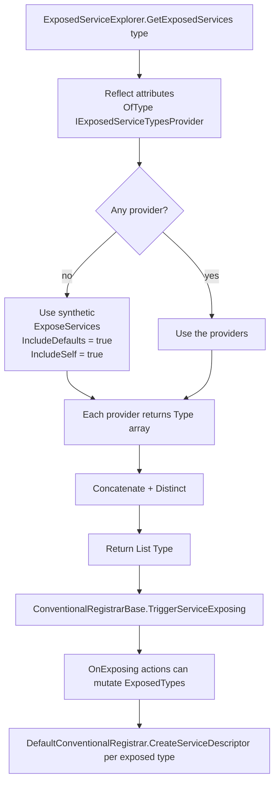

When ABP's `DefaultConventionalRegistrar` decides to register a class, the next question is *under which
service types?* That decision is delegated to `ExposedServiceExplorer.GetExposedServices`, which is driven by
two abstractions: `IExposedServiceTypesProvider` (any attribute can implement it) and the built-in
`ExposeServicesAttribute`. After the list of exposed types is computed, the registrar fires an `OnExposing`
event so modules can mutate it before descriptors are emitted. This page documents the rules end-to-end, with
the exact source from `framework/src/Volo.Abp.Core/Volo/Abp/DependencyInjection/`.

## Files involved

| File | Role |
| --- | --- |
| `ExposeServicesAttribute.cs` | The default attribute. Carries a list of service types plus `IncludeDefaults` / `IncludeSelf`. |
| `IExposedServiceTypesProvider.cs` | `Type[] GetExposedServiceTypes(Type targetType)` — any attribute implementing this contributes to the list. |
| `ExposedServiceExplorer.cs` | Aggregator. Collects every `IExposedServiceTypesProvider` attribute on a class. |
| `IOnServiceExposingContext.cs` / `OnServiceExposingContext.cs` | Mutable context passed to `OnExposing` handlers. |
| `ServiceExposingActionList.cs` | The shared list of `Action<IOnServiceExposingContext>` callbacks, stored in an `IObjectAccessor`. |
| `framework/src/Volo.Abp.Core/Microsoft/Extensions/DependencyInjection/ServiceCollectionRegistrationActionExtensions.cs` | `services.OnExposing(...)` extension. |
| `ConventionalRegistrarBase.cs` | Calls `ExposedServiceExplorer` and fires the exposing event. |

## The default rule

If a class carries **no** `IExposedServiceTypesProvider` attribute, `ExposedServiceExplorer` substitutes a
synthetic `ExposeServicesAttribute { IncludeDefaults = true, IncludeSelf = true }` — i.e. the class is
registered under every "matching" interface plus itself.

```csharp framework/src/Volo.Abp.Core/Volo/Abp/DependencyInjection/ExposedServiceExplorer.cs
public static class ExposedServiceExplorer
{
    private static readonly ExposeServicesAttribute DefaultExposeServicesAttribute =
        new ExposeServicesAttribute
        {
            IncludeDefaults = true,
            IncludeSelf = true
        };

    public static List<Type> GetExposedServices(Type type)
    {
        return type
            .GetCustomAttributes(true)
            .OfType<IExposedServiceTypesProvider>()
            .DefaultIfEmpty(DefaultExposeServicesAttribute)
            .SelectMany(p => p.GetExposedServiceTypes(type))
            .Distinct()
            .ToList();
    }
}
```

Two consequences are worth highlighting:

1. **Multiple `[ExposeServices]` attributes are additive** — the explorer concatenates `GetExposedServiceTypes` from every provider and then `Distinct()`s the result.
2. **Adding *any* provider attribute removes the default** — the `DefaultIfEmpty` only kicks in when the
   class has no provider attribute at all. So `[ExposeServices(typeof(IFoo))]` alone exposes **only** `IFoo`,
   not `IFoo` plus the type itself.

## The `[ExposeServices]` attribute

`ExposeServicesAttribute` implements `IExposedServiceTypesProvider`. It takes a `params Type[]` list plus the
two switches:

```csharp framework/src/Volo.Abp.Core/Volo/Abp/DependencyInjection/ExposeServicesAttribute.cs
public class ExposeServicesAttribute : Attribute, IExposedServiceTypesProvider
{
    public Type[] ServiceTypes { get; }

    public bool IncludeDefaults { get; set; }

    public bool IncludeSelf { get; set; }

    public ExposeServicesAttribute(params Type[] serviceTypes)
    {
        ServiceTypes = serviceTypes ?? Type.EmptyTypes;
    }

    public Type[] GetExposedServiceTypes(Type targetType)
    {
        var serviceList = ServiceTypes.ToList();

        if (IncludeDefaults)
        {
            foreach (var type in GetDefaultServices(targetType))
            {
                serviceList.AddIfNotContains(type);
            }

            if (IncludeSelf)
            {
                serviceList.AddIfNotContains(targetType);
            }
        }
        else if (IncludeSelf)
        {
            serviceList.AddIfNotContains(targetType);
        }

        return serviceList.ToArray();
    }
    ...
}
```

### What "defaults" means

`GetDefaultServices` walks every interface implemented by the class and keeps those whose name "matches" the
class name by the *Service* naming convention: if the class is `UserAppService` and it implements
`IUserAppService` (or `IUserService`, …) the matching interface is included. Generic interfaces are matched
by their non-generic part (everything before the back-tick).

```csharp framework/src/Volo.Abp.Core/Volo/Abp/DependencyInjection/ExposeServicesAttribute.cs
private static List<Type> GetDefaultServices(Type type)
{
    var serviceTypes = new List<Type>();

    foreach (var interfaceType in type.GetTypeInfo().GetInterfaces())
    {
        var interfaceName = interfaceType.Name;
        if (interfaceType.IsGenericType)
        {
            interfaceName = interfaceType.Name.Left(interfaceType.Name.IndexOf('`'));
        }

        if (interfaceName.StartsWith("I"))
        {
            interfaceName = interfaceName.Right(interfaceName.Length - 1);
        }

        if (type.Name.EndsWith(interfaceName))
        {
            serviceTypes.Add(interfaceType);
        }
    }

    return serviceTypes;
}
```

Examples of the matcher:

| Class | Interface | Matches default? |
| --- | --- | --- |
| `UserAppService` | `IUserAppService` | ✅ — name ends with `UserAppService` after stripping `I`. |
| `UserAppService` | `IService` | ❌ — name doesn't end with `Service` *unless* the implementation type is literally `Service`. |
| `EfCoreRepository<Book>` | `IRepository<Book>` | ✅ — generic part `Repository` matched. |
| `MyHandler` | `INotificationHandler` | ❌ — `MyHandler` doesn't end with `NotificationHandler`. |
| `BookManager` | `IBookManager` | ✅ — name matches. |

## Decision flow



## Patterns

### Expose under exactly one interface

```csharp
[ExposeServices(typeof(IBookManager))]
public class BookManager : DomainService, IBookManager, ITransientDependency { ... }
```

`BookManager` is *not* itself resolvable — only `IBookManager` is.

### Expose under the defaults plus an extra

```csharp
[ExposeServices(typeof(ITenantStore), IncludeDefaults = true, IncludeSelf = true)]
public class CachingTenantStore : ITenantStore, ITenantInformationProvider, ITransientDependency { ... }
```

Resolved service types: `ITenantStore` (extra), `ITenantInformationProvider` (default match), plus
`CachingTenantStore` itself.

### Expose only itself

```csharp
[ExposeServices(IncludeSelf = true)]
public class HeavyHelper : ITransientDependency { ... }
```

### Expose nothing (silently)

A class with `[ExposeServices()]` and *no* `IncludeSelf` / `IncludeDefaults` exposes **zero** types — the
descriptor loop in `DefaultConventionalRegistrar.AddType` then does nothing. Useful as a soft skip without
suppressing the lifetime check.

<Tip>
Prefer `[DisableConventionalRegistration]` for that intent — it's clearer and short-circuits earlier.
See [Conventional Registration](/di/conventional-registration#opting-out--disableconventionalregistration).
</Tip>

## The exposing event

`ConventionalRegistrarBase.TriggerServiceExposing` runs the `ServiceExposingActionList` against an
`OnServiceExposingContext` whose `ExposedTypes` list is the **same instance** the registrar later iterates
over — modify it and the modifications take effect.

```csharp framework/src/Volo.Abp.Core/Volo/Abp/DependencyInjection/ConventionalRegistrarBase.cs
protected virtual void TriggerServiceExposing(IServiceCollection services, Type implementationType, List<Type> serviceTypes)
{
    var exposeActions = services.GetExposingActionList();
    if (exposeActions.Any())
    {
        var args = new OnServiceExposingContext(implementationType, serviceTypes);
        foreach (var action in exposeActions)
        {
            action(args);
        }
    }
}
```

The context interface is intentionally read-mostly — only the list itself is mutable:

```csharp framework/src/Volo.Abp.Core/Volo/Abp/DependencyInjection/IOnServiceExposingContext.cs
public interface IOnServiceExposingContext
{
    Type ImplementationType { get; }

    List<Type> ExposedTypes { get; }
}
```

```csharp framework/src/Volo.Abp.Core/Volo/Abp/DependencyInjection/OnServiceExposingContext.cs
public class OnServiceExposingContext : IOnServiceExposingContext
{
    public Type ImplementationType { get; }

    public List<Type> ExposedTypes { get; }

    public OnServiceExposingContext([NotNull] Type implementationType, List<Type> exposedTypes)
    {
        ImplementationType = Check.NotNull(implementationType, nameof(implementationType));
        ExposedTypes = Check.NotNull(exposedTypes, nameof(exposedTypes));
    }
}
```

### Registering a handler

The extension lives in `ServiceCollectionRegistrationActionExtensions.cs`:

```csharp framework/src/Volo.Abp.Core/Microsoft/Extensions/DependencyInjection/ServiceCollectionRegistrationActionExtensions.cs
public static void OnExposing(this IServiceCollection services, Action<IOnServiceExposingContext> exposeAction)
{
    GetOrCreateExposingList(services).Add(exposeAction);
}

public static ServiceExposingActionList GetExposingActionList(this IServiceCollection services)
{
    return GetOrCreateExposingList(services);
}
```

Use it from `PreConfigureServices` so it sees every later assembly:

```csharp
public override void PreConfigureServices(ServiceConfigurationContext context)
{
    context.Services.OnExposing(ctx =>
    {
        // Strip a marker interface from everyone in a particular assembly
        if (ctx.ImplementationType.Assembly == typeof(SomeRootType).Assembly)
        {
            ctx.ExposedTypes.RemoveAll(t => t == typeof(IObsoleteMarker));
        }
    });
}
```

<Warning>
`OnExposing` fires **once per implementation type**, not once per exposed type. Don't assume the list is
small — for some classes it can contain ten or more entries.
</Warning>

## Custom `IExposedServiceTypesProvider`

If your project has a convention not covered by `[ExposeServices]`, write an attribute that implements
`IExposedServiceTypesProvider`:

```csharp framework/src/Volo.Abp.Core/Volo/Abp/DependencyInjection/IExposedServiceTypesProvider.cs
public interface IExposedServiceTypesProvider
{
    Type[] GetExposedServiceTypes(Type targetType);
}
```

```csharp
[AttributeUsage(AttributeTargets.Class, AllowMultiple = false, Inherited = true)]
public class ExposeOpenGenericInterfacesAttribute : Attribute, IExposedServiceTypesProvider
{
    public Type[] GetExposedServiceTypes(Type targetType)
    {
        return targetType.GetInterfaces()
            .Where(i => i.IsGenericType)
            .Select(i => i.GetGenericTypeDefinition())
            .ToArray();
    }
}
```

Remember the additive rule: stacking your attribute together with `[ExposeServices]` merges their results
via `Distinct`.

## How the registrar uses the result

After `TriggerServiceExposing`, the default registrar iterates the (possibly mutated) list and creates one
descriptor per entry:

```csharp framework/src/Volo.Abp.Core/Volo/Abp/DependencyInjection/DefaultConventionalRegistrar.cs
var exposedServiceTypes = GetExposedServiceTypes(type);

TriggerServiceExposing(services, type, exposedServiceTypes);

foreach (var exposedServiceType in exposedServiceTypes)
{
    var serviceDescriptor = CreateServiceDescriptor(
        type,
        exposedServiceType,
        exposedServiceTypes,
        lifeTime.Value
    );
    ...
}
```

For multi-interface scoped/singleton services, `CreateServiceDescriptor`'s redirect trick (described in
[Conventional Registration](/di/conventional-registration#descriptor-creation-and-the-redirect-trick))
guarantees a single shared instance per implementation, regardless of how many interfaces it is resolved
through.

## Common gotchas

<Warning>
- **`[ExposeServices(typeof(IFoo))]` hides the class itself.** Add `IncludeSelf = true` if you also want
  `MyClass` resolvable directly.
- **Default matching is suffix-based.** `INotification` won't be picked up by `BookCreatedEvent` —
  you'll need an explicit `[ExposeServices(typeof(INotification))]`.
- **Attributes on base classes count.** `[ExposeServices]` is inherited through
  `type.GetCustomAttributes(true)` in `ExposedServiceExplorer`. A base class's contract is therefore applied
  to every derived class.
- **The list passed to `OnExposing` is the working copy.** Don't replace it (`ctx.ExposedTypes = …` would
  fail to compile anyway); add/remove entries in place.
</Warning>

## Related pages

<CardGroup cols={3}>
  <Card title="Conventional Registration" icon="gear" href="/di/conventional-registration">Lifetimes, registrars, and `[Dependency]`.</Card>
  <Card title="Overview" icon="map" href="/di/overview">Pipeline diagram and three action lists.</Card>
  <Card title="Autofac Integration" icon="plug" href="/di/autofac-integration">Where exposed descriptors become real container registrations.</Card>
</CardGroup>
