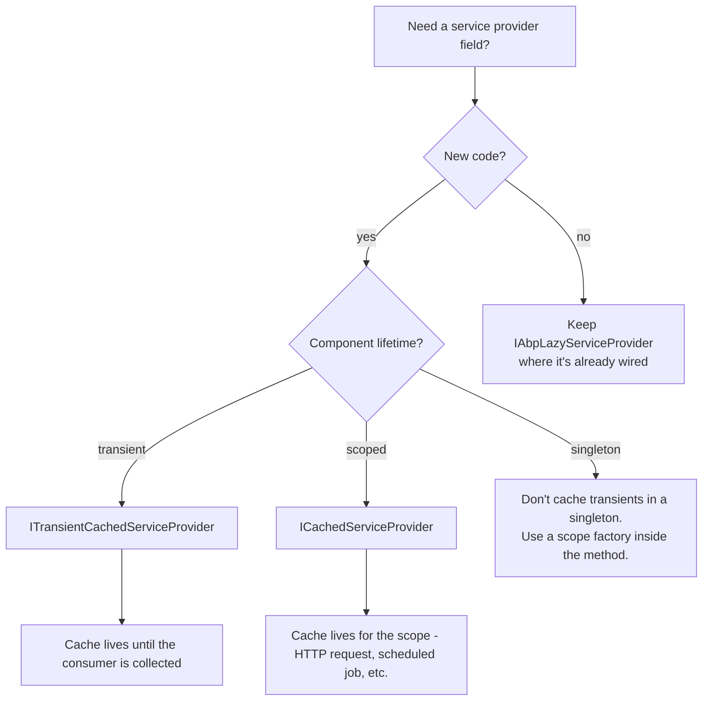

ABP layers a small family of *service-provider abstractions* on top of `IServiceProvider`. They exist to
solve three recurring problems: deferring resolution until first use (lazy), avoiding repeated
resolutions of the same service from the same `IServiceProvider` (cached), and bridging values across
service-collection / container boundaries (object accessor). This page covers `IAbpLazyServiceProvider`,
`ITransientCachedServiceProvider`, `ICachedServiceProvider`, `IRootServiceProvider`,
`IClientScopeServiceProviderAccessor`, and `IObjectAccessor<T>` — every one of them lives in
`framework/src/Volo.Abp.Core/Volo/Abp/DependencyInjection/`.

## Files involved

| File | Role |
| --- | --- |
| `IAbpLazyServiceProvider.cs` / `AbpLazyServiceProvider.cs` | The original lazy provider. Kept for backward compatibility — new code should use `ITransientCachedServiceProvider`. |
| `ICachedServiceProviderBase.cs` / `CachedServiceProviderBase.cs` | Shared caching implementation. |
| `ICachedServiceProvider.cs` / `CachedServiceProvider.cs` | Scoped-lifetime cache. |
| `ITransientCachedServiceProvider.cs` / `TransientCachedServiceProvider.cs` | Transient-lifetime cache. |
| `IRootServiceProviderAccessor.cs` / `RootServiceProvider.cs` | Singleton wrapper around the root `IServiceProvider`. |
| `IServiceProviderAccessor.cs` | Generic "current provider" accessor. |
| `IClientScopeServiceProviderAccessor.cs` | Used by the Blazor WebAssembly bridge. |
| `IObjectAccessor.cs` / `ObjectAccessor.cs` | Mutable singleton container — used to pass things through `IServiceCollection` before the container is built. |
| `framework/src/Volo.Abp.Core/Microsoft/Extensions/DependencyInjection/ServiceCollectionObjectAccessorExtensions.cs` | `AddObjectAccessor`, `TryAddObjectAccessor`, `GetObjectOrNull`, `GetObject`. |

## The base class — cached resolution

`CachedServiceProviderBase` is the workhorse. It wraps any `IServiceProvider` and remembers every resolved
service in a `ConcurrentDictionary<Type, Lazy<object?>>`. Even *transient* services resolved through it are
returned as the same instance on subsequent calls — that is the whole point.

```csharp framework/src/Volo.Abp.Core/Volo/Abp/DependencyInjection/CachedServiceProviderBase.cs
public abstract class CachedServiceProviderBase : ICachedServiceProviderBase
{
    protected IServiceProvider ServiceProvider { get; }
    protected ConcurrentDictionary<Type, Lazy<object?>> CachedServices { get; }

    protected CachedServiceProviderBase(IServiceProvider serviceProvider)
    {
        ServiceProvider = serviceProvider;
        CachedServices = new ConcurrentDictionary<Type, Lazy<object?>>();
        CachedServices.TryAdd(typeof(IServiceProvider), new Lazy<object?>(() => ServiceProvider));
    }

    public virtual object? GetService(Type serviceType)
    {
        return CachedServices.GetOrAdd(
            serviceType,
            _ => new Lazy<object?>(() => ServiceProvider.GetService(serviceType))
        ).Value;
    }
    ...
}
```

It also exposes default-value and factory overloads through `ICachedServiceProviderBase`:

```csharp framework/src/Volo.Abp.Core/Volo/Abp/DependencyInjection/ICachedServiceProviderBase.cs
public interface ICachedServiceProviderBase : IServiceProvider
{
    T GetService<T>(T defaultValue);

    object GetService(Type serviceType, object defaultValue);

    T GetService<T>(Func<IServiceProvider, object> factory);

    object GetService(Type serviceType, Func<IServiceProvider, object> factory);
}
```

## The two cached providers

Two concrete subclasses differ only in lifetime.

```csharp framework/src/Volo.Abp.Core/Volo/Abp/DependencyInjection/CachedServiceProvider.cs
[ExposeServices(typeof(ICachedServiceProvider))]
public class CachedServiceProvider :
    CachedServiceProviderBase,
    ICachedServiceProvider,
    IScopedDependency
{
    public CachedServiceProvider(IServiceProvider serviceProvider)
        : base(serviceProvider)
    {
    }
}
```

```csharp framework/src/Volo.Abp.Core/Volo/Abp/DependencyInjection/TransientCachedServiceProvider.cs
[ExposeServices(typeof(ITransientCachedServiceProvider))]
public class TransientCachedServiceProvider :
    CachedServiceProviderBase,
    ITransientCachedServiceProvider,
    ITransientDependency
{
    public TransientCachedServiceProvider(IServiceProvider serviceProvider)
        : base(serviceProvider)
    {
    }
}
```

| Service | Lifetime | Typical user |
| --- | --- | --- |
| `ICachedServiceProvider` | `Scoped` | Per-request resolution caches — for example, controllers that need to resolve N optional services across one HTTP request. |
| `ITransientCachedServiceProvider` | `Transient` | Components that want to resolve a few services lazily once, then keep them for the lifetime of *that* component. |

The XML-doc on `ICachedServiceProvider` spells out the constraint:

```csharp framework/src/Volo.Abp.Core/Volo/Abp/DependencyInjection/ICachedServiceProvider.cs
/// <summary>
/// Provides services by caching the resolved services.
/// It caches all type of services including transients.
/// This service's lifetime is scoped and it should be used
/// for a limited scope.
/// </summary>
public interface ICachedServiceProvider : ICachedServiceProviderBase
{

}
```

<Warning>
The cache **is** the leak risk. Because the dictionary keeps strong references, holding a long-lived
`ICachedServiceProvider` (e.g. inadvertently capturing it in a singleton) will pin every transient it has
ever resolved. The interface intentionally requires a scoped lifetime — respect it.
</Warning>

## `IAbpLazyServiceProvider` — the legacy lazy API

`AbpLazyServiceProvider` is the original abstraction (predating the *Cached* terminology). Internally it is
the same `CachedServiceProviderBase` — the methods just expose a `LazyGet*` naming. The XML-doc explicitly
points new code at `ITransientCachedServiceProvider`.

```csharp framework/src/Volo.Abp.Core/Volo/Abp/DependencyInjection/IAbpLazyServiceProvider.cs
/// <summary>
/// This service is equivalent of the <see cref="ITransientCachedServiceProvider"/>.
/// Use <see cref="ITransientCachedServiceProvider"/> instead of this interface, for new projects.
/// </summary>
public interface IAbpLazyServiceProvider : ICachedServiceProviderBase
{
    /// <summary>
    /// This method is equivalent of the GetRequiredService method.
    /// It does exists for backward compatibility.
    /// </summary>
    T LazyGetRequiredService<T>();
    ...
}
```

The implementation is a thin shim over `CachedServiceProviderBase`:

```csharp framework/src/Volo.Abp.Core/Volo/Abp/DependencyInjection/AbpLazyServiceProvider.cs
[ExposeServices(typeof(IAbpLazyServiceProvider))]
public class AbpLazyServiceProvider :
    CachedServiceProviderBase,
    IAbpLazyServiceProvider,
    ITransientDependency
{
    public AbpLazyServiceProvider(IServiceProvider serviceProvider)
        : base(serviceProvider)
    {
    }

    public virtual T LazyGetRequiredService<T>()
    {
        return (T)LazyGetRequiredService(typeof(T));
    }

    public virtual object LazyGetRequiredService(Type serviceType)
    {
        return this.GetRequiredService(serviceType);
    }
    ...
}
```

### The "lazy property" pattern

The classical use is for components that want their own `IServiceProvider` *without* the boilerplate of
injecting every collaborator in the constructor:

```csharp
public class BookManager : DomainService
{
    private IBookRepository BookRepository => LazyServiceProvider.LazyGetRequiredService<IBookRepository>();
    private IStringLocalizer<MyResource> L => LazyServiceProvider.LazyGetRequiredService<IStringLocalizer<MyResource>>();

    // LazyServiceProvider is a property on DomainService (set via property injection).
}
```

This works precisely because the provider caches the resolution: the second access to `BookRepository`
returns the same instance, so the property *behaves* like a field initialised on demand.

## When to use which



## The root service provider

`RootServiceProvider` wraps the application's root `IServiceProvider` and exposes it as
`IRootServiceProvider`. The implementation is intentionally small — its value is that you can inject it
*anywhere* without taking a direct dependency on `IServiceProvider` (and confusing the captive-dependency
analyzer with it).

```csharp framework/src/Volo.Abp.Core/Volo/Abp/DependencyInjection/IRootServiceProviderAccessor.cs
/// <summary>
/// The root service provider of the application.
/// Be careful to use the root service provider since there is no way
/// to release/dispose objects resolved from the root service provider.
/// So, always create a new scope if you need to resolve any service.
/// </summary>
public interface IRootServiceProvider : IServiceProvider
{

}
```

```csharp framework/src/Volo.Abp.Core/Volo/Abp/DependencyInjection/RootServiceProvider.cs
[ExposeServices(typeof(IRootServiceProvider))]
public class RootServiceProvider : IRootServiceProvider, ISingletonDependency
{
    protected IServiceProvider ServiceProvider { get; }

    public RootServiceProvider(IObjectAccessor<IServiceProvider> objectAccessor)
    {
        ServiceProvider = objectAccessor.Value!;
    }

    public virtual object? GetService(Type serviceType)
    {
        return ServiceProvider.GetService(serviceType);
    }
}
```

<Warning>
The comment in the source is not just style — **never** resolve scoped or transient services directly from
`IRootServiceProvider`. Open a scope first:

```csharp
using (var scope = rootServiceProvider.CreateScope())
{
    var repo = scope.ServiceProvider.GetRequiredService<IBookRepository>();
    ...
}
```
</Warning>

## `IServiceProviderAccessor` and `IClientScopeServiceProviderAccessor`

Two accessor abstractions surface the *current* provider depending on context:

```csharp framework/src/Volo.Abp.Core/Volo/Abp/DependencyInjection/IServiceProviderAccessor.cs
public interface IServiceProviderAccessor
{
    IServiceProvider ServiceProvider { get; }
}
```

```csharp framework/src/Volo.Abp.Core/Volo/Abp/DependencyInjection/IClientScopeServiceProviderAccessor.cs
public interface IClientScopeServiceProviderAccessor
{
    IServiceProvider ServiceProvider { get; }
}
```

| Abstraction | Implemented where | Used for |
| --- | --- | --- |
| `IServiceProviderAccessor` | Multiple — hosts, framework helpers. | Late binding to a contextual scope. |
| `IClientScopeServiceProviderAccessor` | Blazor WebAssembly client scope (see [Autofac Integration](/di/autofac-integration#blazor-webassembly)). | Resolving services that belong to a *client* scope while running on a Blazor circuit. |

## `IObjectAccessor<T>` — the cross-collection bridge

`ObjectAccessor<T>` is the pattern ABP uses to pass mutable singletons through `IServiceCollection`
**before** the container is built. The conventional-registration list, the registration / exposing /
activated action lists, and Autofac's `ContainerBuilder` are all shared this way.

```csharp framework/src/Volo.Abp.Core/Volo/Abp/DependencyInjection/IObjectAccessor.cs
public interface IObjectAccessor<out T>
{
    T? Value { get; }
}
```

```csharp framework/src/Volo.Abp.Core/Volo/Abp/DependencyInjection/ObjectAccessor.cs
public class ObjectAccessor<T> : IObjectAccessor<T>
{
    public T? Value { get; set; }

    public ObjectAccessor()
    {

    }

    public ObjectAccessor(T? obj)
    {
        Value = obj;
    }
}
```

### Registration helpers

The companion extensions live in `ServiceCollectionObjectAccessorExtensions.cs`:

```csharp framework/src/Volo.Abp.Core/Microsoft/Extensions/DependencyInjection/ServiceCollectionObjectAccessorExtensions.cs
public static ObjectAccessor<T> AddObjectAccessor<T>(this IServiceCollection services, ObjectAccessor<T> accessor)
{
    if (services.Any(s => s.ServiceType == typeof(ObjectAccessor<T>)))
    {
        throw new Exception("An object accessor is registered before for type: " + typeof(T).AssemblyQualifiedName);
    }

    //Add to the beginning for fast retrieve
    services.Insert(0, ServiceDescriptor.Singleton(typeof(ObjectAccessor<T>), accessor));
    services.Insert(0, ServiceDescriptor.Singleton(typeof(IObjectAccessor<T>), accessor));

    return accessor;
}

public static T? GetObjectOrNull<T>(this IServiceCollection services)
    where T : class
{
    return services.GetSingletonInstanceOrNull<IObjectAccessor<T>>()?.Value;
}

public static T GetObject<T>(this IServiceCollection services)
    where T : class
{
    return services.GetObjectOrNull<T>()
        ?? throw new Exception($"Could not find an object of {typeof(T).AssemblyQualifiedName} in services. Be sure that you have used AddObjectAccessor before!");
}
```

Two important quirks:

1. **Two descriptors are inserted at index `0`** so subsequent linear scans of the service collection find
   the accessor immediately.
2. **Adding twice throws** — call `TryAddObjectAccessor<T>()` instead if you want idempotent semantics:

```csharp framework/src/Volo.Abp.Core/Microsoft/Extensions/DependencyInjection/ServiceCollectionObjectAccessorExtensions.cs
public static ObjectAccessor<T> TryAddObjectAccessor<T>(this IServiceCollection services)
{
    if (services.Any(s => s.ServiceType == typeof(ObjectAccessor<T>)))
    {
        return services.GetSingletonInstance<ObjectAccessor<T>>();
    }

    return services.AddObjectAccessor<T>();
}
```

### Why the framework needs it

`ConventionalRegistrarList`, `ServiceRegistrationActionList`, `ServiceExposingActionList`, and
`ServiceActivatedActionList` are all mutable lists that must:

- Be discoverable across modules — modules don't share static fields.
- Be readable while the container is being built (i.e. before `IServiceProvider` exists).

`IObjectAccessor<T>` is the simplest abstraction that satisfies both: insert one descriptor whose
`ImplementationInstance` is the accessor, and any caller can look it up with
`services.GetSingletonInstance<IObjectAccessor<T>>().Value`.

## Putting them together

```mermaid
sequenceDiagram
    autonumber
    participant Mod as Module
    participant SC as IServiceCollection
    participant Acc as ObjectAccessor
    participant Reg as ConventionalRegistrarList
    participant Root as RootServiceProvider
    participant Comp as Application Component
    participant Lazy as ITransientCachedServiceProvider
    Mod->>SC: AddConventionalRegistrar(MyRegistrar)
    SC->>Acc: stored as ObjectAccessor list
    SC->>Reg: list now MyRegistrar + DefaultConventionalRegistrar
    Note over SC: app boots; container built
    SC->>Root: ObjectAccessor IServiceProvider populated
    Comp->>Lazy: injected per-instance
    Comp->>Lazy: LazyGetRequiredService IFoo
    Lazy->>Lazy: cache miss
    Lazy->>Root: forwards to inner provider
    Root-->>Lazy: returns Foo
    Lazy-->>Comp: cached Foo
    Comp->>Lazy: LazyGetRequiredService IFoo again
    Lazy-->>Comp: same Foo from cache
```

## Patterns and pitfalls

<CardGroup cols={2}>
  <Card title="Use ITransientCachedServiceProvider on application/domain services" icon="check">
    Inject it once, then expose `private SomeService MyService => Provider.GetService(...)` properties.
    Avoids constructor bloat without leaking resolutions outside the component lifetime.
  </Card>
  <Card title="Avoid Func IServiceProvider in singletons" icon="triangle-exclamation">
    Capturing the root provider in a singleton is a captive-dependency anti-pattern. Use
    `IRootServiceProvider` *and* create a scope per call.
  </Card>
  <Card title="Don't use ObjectAccessor for runtime state" icon="x">
    `ObjectAccessor<T>` is for *bootstrap* data — values that need to survive between
    `IServiceCollection`-only code paths. At runtime, register a normal service.
  </Card>
  <Card title="Property injection works hand-in-hand" icon="syringe" href="/di/property-injection-and-interception">
    `LazyServiceProvider` is set by property injection on every ABP base class. See the
    [property injection page](/di/property-injection-and-interception) for the mechanism.
  </Card>
</CardGroup>

## Related pages

<CardGroup cols={3}>
  <Card title="Overview" icon="map" href="/di/overview">Pipeline overview and lifetime conventions.</Card>
  <Card title="Property Injection & Interception" icon="syringe" href="/di/property-injection-and-interception">How `LazyServiceProvider` ends up on every component.</Card>
  <Card title="Autofac Integration" icon="plug" href="/di/autofac-integration">Where `IClientScopeServiceProviderAccessor` is implemented.</Card>
</CardGroup>
