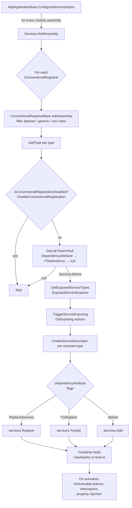

ABP Framework builds on top of `Microsoft.Extensions.DependencyInjection` (MS DI) and adds a thin but opinionated registration pipeline on top of every `IServiceCollection`. Each module's assembly is scanned by a chain of `IConventionalRegistrar` instances that pick a lifetime, compute the list of *exposed* services, and emit `ServiceDescriptor`s — and any container that can consume an `IServiceCollection` (the default Microsoft container, [Autofac](/di/autofac-integration), or the WebAssembly variant) can host an ABP application. This page is the map of that pipeline; the rest of the DI section drills into individual stages.

## Where the code lives

<Info>
Every type referenced here lives in the [`abpframework/abp`](https://github.com/abpframework/abp) repository under
`framework/src/Volo.Abp.Core/Volo/Abp/DependencyInjection/`. The Autofac and Castle integrations sit in sibling
projects under `framework/src/`.
</Info>

| Folder | What it contains |
| --- | --- |
| `framework/src/Volo.Abp.Core/Volo/Abp/DependencyInjection/` | Core abstractions: registrars, lifetimes, exposed services, lazy/cached providers, object accessors, action lists. |
| `framework/src/Volo.Abp.Core/Microsoft/Extensions/DependencyInjection/` | `IServiceCollection` extensions that drive the pipeline (`AddAssembly`, `AddType`, `OnRegistered`, `OnExposing`, `OnActivated`, object accessors). |
| `framework/src/Volo.Abp.Core/Volo/Abp/DynamicProxy/` | `IAbpInterceptor`, `IAbpMethodInvocation`, `ProxyHelper`, `DynamicProxyIgnoreTypes`. |
| `framework/src/Volo.Abp.Core/Volo/Abp/Aspects/` | `AbpCrossCuttingConcerns` and `IAvoidDuplicateCrossCuttingConcerns` — used by interceptors. |
| `framework/src/Volo.Abp.Autofac/` | Autofac service-provider factory, registration builder extensions, property selector. |
| `framework/src/Volo.Abp.Autofac.WebAssembly/` | Blazor WebAssembly bridge for the Autofac integration. |
| `framework/src/Volo.Abp.Castle.Core/` | Castle DynamicProxy adapter (`AbpAsyncDeterminationInterceptor<>` and friends). |

## The big picture

Module loading is the entry point. When an ABP application boots, `Volo.Abp.AbpApplicationBase` walks every module assembly and pushes it through `IServiceCollection.AddAssembly`, which dispatches to every registered `IConventionalRegistrar`:

```csharp Volo.Abp.AbpApplicationBase.ConfigureServicesAsync (excerpt) {15}
//ConfigureServices
foreach (var module in Modules)
{
    if (module.Instance is AbpModule abpModule)
    {
        if (!abpModule.SkipAutoServiceRegistration)
        {
            foreach (var assembly in module.AllAssemblies)
            {
                if (!assemblies.Contains(assembly))
                {
                    Services.AddAssembly(assembly);
                    assemblies.Add(assembly);
                }
            }
        }
    }
    ...
}
```

`Services.AddAssembly(assembly)` is defined in `ServiceCollectionConventionalRegistrationExtensions.cs`. It looks up the `ConventionalRegistrarList` (seeded with a single `DefaultConventionalRegistrar`) and lets every registrar inspect every type:

```csharp framework/src/Volo.Abp.Core/Microsoft/Extensions/DependencyInjection/ServiceCollectionConventionalRegistrationExtensions.cs
public static IServiceCollection AddAssembly(this IServiceCollection services, Assembly assembly)
{
    foreach (var registrar in services.GetConventionalRegistrars())
    {
        registrar.AddAssembly(services, assembly);
    }

    return services;
}
```

From there each type travels through five stages — discovery, lifetime detection, exposed-service computation, the exposing event, and the descriptor add — described in the diagram below.



## The five stages

<Steps>
  <Step title="Discovery">
    `ConventionalRegistrarBase.AddAssembly` uses `AssemblyHelper.GetAllTypes(assembly)` and keeps types where
    `type.IsClass && !type.IsAbstract && !type.IsGenericType`. Generic types are intentionally skipped because
    they cannot be registered with a concrete `ServiceDescriptor` without a constructed type.
  </Step>
  <Step title="Opt-out check">
    `DefaultConventionalRegistrar.AddType` calls `IsConventionalRegistrationDisabled`, which looks for the
    `[DisableConventionalRegistration]` attribute (inherit = true). Types decorated with it are left alone —
    register them by hand if you need them.
  </Step>
  <Step title="Lifetime selection">
    `GetLifeTimeOrNull` first reads `DependencyAttribute.Lifetime`, then falls back to
    `ITransientDependency` / `ISingletonDependency` / `IScopedDependency` on the class hierarchy, then to a
    custom `GetDefaultLifeTimeOrNull` override. If nothing matches, the type is skipped — this is why a plain
    POCO is not automatically resolvable.
  </Step>
  <Step title="Exposed services">
    `GetExposedServiceTypes` delegates to `ExposedServiceExplorer.GetExposedServices(type)`. It collects every
    `IExposedServiceTypesProvider` attribute on the class (typically `[ExposeServices]`) or — if none — uses
    the default rule of *include defaults + include self*. See [Exposed Services](/di/exposed-services).
  </Step>
  <Step title="Registration">
    For every exposed type, `CreateServiceDescriptor` produces a `ServiceDescriptor`, optionally redirecting
    multiple service types to a single shared instance for non-transient lifetimes. The descriptor is then
    added with `services.Add`, `services.TryAdd`, or `services.Replace` depending on the
    `DependencyAttribute` flags.
  </Step>
</Steps>

## Lifetime conventions at a glance

| Marker / attribute | Effective `ServiceLifetime` | Source |
| --- | --- | --- |
| `ITransientDependency` | `Transient` | `framework/src/Volo.Abp.Core/Volo/Abp/DependencyInjection/ITransientDependency.cs` |
| `ISingletonDependency` | `Singleton` | `framework/src/Volo.Abp.Core/Volo/Abp/DependencyInjection/ISingletonDependency.cs` |
| `IScopedDependency` | `Scoped` | `framework/src/Volo.Abp.Core/Volo/Abp/DependencyInjection/IScopedDependency.cs` |
| `[Dependency(ServiceLifetime.X)]` | `X` (wins over the marker interface) | `DependencyAttribute.cs` |
| `[Dependency(TryRegister = true)]` | adds via `services.TryAdd` | `DefaultConventionalRegistrar.cs` |
| `[Dependency(ReplaceServices = true)]` | adds via `services.Replace` | `DefaultConventionalRegistrar.cs` |
| `[DisableConventionalRegistration]` | not registered at all | `DisableConventionalRegistrationAttribute.cs` |

See [Conventional Registration](/di/conventional-registration) for a complete walk-through of the registrar
pipeline and how to plug in your own `IConventionalRegistrar`.

## Service exposition

By default a class is exposed as itself plus every interface whose name matches its type name (e.g. `UserAppService` → `IUserAppService`). Override with `[ExposeServices(typeof(IFoo), typeof(IBar))]`, possibly toggling `IncludeDefaults` and `IncludeSelf`.

```csharp framework/src/Volo.Abp.Core/Volo/Abp/DependencyInjection/ExposedServiceExplorer.cs
private static readonly ExposeServicesAttribute DefaultExposeServicesAttribute =
    new ExposeServicesAttribute
    {
        IncludeDefaults = true,
        IncludeSelf = true
    };

public static List<Type> GetExposedServices(Type type)
{
    return type
        .GetCustomAttributes(true)
        .OfType<IExposedServiceTypesProvider>()
        .DefaultIfEmpty(DefaultExposeServicesAttribute)
        .SelectMany(p => p.GetExposedServiceTypes(type))
        .Distinct()
        .ToList();
}
```

Details live in [Exposed Services](/di/exposed-services).

## Three extension points: registration, exposing, activation

The pipeline fires three kinds of events. Each is backed by a typed action list smuggled through an
`IObjectAccessor` so it survives module boundaries:

<CardGroup cols={3}>
  <Card title="OnRegistered" icon="bolt">
    `services.OnRegistered(ctx => …)` — called once per `(serviceType, implementationType)` to let modules
    push interceptors into `ctx.Interceptors` (`ServiceRegistrationActionList`). Bridged into Autofac via
    `AbpRegistrationBuilderExtensions.InvokeRegistrationActions`.
  </Card>
  <Card title="OnExposing" icon="eye">
    `services.OnExposing(ctx => …)` — fires from `ConventionalRegistrarBase.TriggerServiceExposing` with the
    implementation type and the mutable `ExposedTypes` list, so modules can append additional service
    contracts before descriptors are created.
  </Card>
  <Card title="OnActivated" icon="play">
    `services.OnActivated(descriptor, ctx => …)` — invoked when a service instance is produced. Autofac's
    `OnActivated` hook is wired into `InvokeActivatedActions` in
    `AbpRegistrationBuilderExtensions.cs`.
  </Card>
</CardGroup>

## Service providers — lazy, cached, root, scoped

ABP layers a few extra service-provider abstractions on top of `IServiceProvider`:

| Abstraction | Lifetime | Purpose |
| --- | --- | --- |
| `IAbpLazyServiceProvider` / `AbpLazyServiceProvider` | Transient | Legacy lazy resolution with caching; superseded by `ITransientCachedServiceProvider`. |
| `ITransientCachedServiceProvider` / `TransientCachedServiceProvider` | Transient | Caches resolved services for the lifetime of the owning component. |
| `ICachedServiceProvider` / `CachedServiceProvider` | Scoped | Caches services within a request/scope. |
| `IRootServiceProvider` / `RootServiceProvider` | Singleton | Wraps the root provider — see comment in source to always create a scope before resolving. |
| `IServiceProviderAccessor` | per-host | Generic "current `IServiceProvider`" accessor. |
| `IClientScopeServiceProviderAccessor` | Blazor / client scope | Lets the Autofac WebAssembly bridge surface the active client scope. |
| `IObjectAccessor<T>` / `ObjectAccessor<T>` | Singleton | Inserts a mutable singleton at the head of the service collection — used by the pipeline to share action lists. |

Full details and examples live in [Lazy & Cached Service Providers](/di/lazy-service-provider).

```csharp framework/src/Volo.Abp.Core/Volo/Abp/DependencyInjection/RootServiceProvider.cs
[ExposeServices(typeof(IRootServiceProvider))]
public class RootServiceProvider : IRootServiceProvider, ISingletonDependency
{
    protected IServiceProvider ServiceProvider { get; }

    public RootServiceProvider(IObjectAccessor<IServiceProvider> objectAccessor)
    {
        ServiceProvider = objectAccessor.Value!;
    }

    public virtual object? GetService(Type serviceType)
    {
        return ServiceProvider.GetService(serviceType);
    }
}
```

## Interception in two layers

ABP separates *what an interceptor does* from *which container hosts it*.

1. **Abstraction** — `IAbpInterceptor` (`framework/src/Volo.Abp.Core/Volo/Abp/DynamicProxy/IAbpInterceptor.cs`) takes an `IAbpMethodInvocation` and is async-first. Modules declare interceptors against this interface only.
2. **Bridge** — `Volo.Abp.Castle.DynamicProxy.AbpAsyncDeterminationInterceptor<TInterceptor>` adapts an `IAbpInterceptor` to Castle DynamicProxy via the `CastleAsyncAbpInterceptorAdapter<TInterceptor>` and `CastleAbpMethodInvocationAdapter` types.
3. **Wiring** — when Autofac builds the container, `AbpRegistrationBuilderExtensions.AddInterceptors` calls `EnableInterfaceInterceptors()` (or `EnableClassInterceptors()`) and registers the closed-generic `AbpAsyncDeterminationInterceptor<TInterceptor>` as the Castle interceptor.

```csharp framework/src/Volo.Abp.Autofac/Autofac/Builder/AbpRegistrationBuilderExtensions.cs
if (serviceType.IsInterface)
{
    registrationBuilder = registrationBuilder.EnableInterfaceInterceptors();
}
else
{
    if (serviceRegistrationActionList.IsClassInterceptorsDisabled)
    {
        return registrationBuilder;
    }

    (registrationBuilder as IRegistrationBuilder<TLimit, ConcreteReflectionActivatorData, TRegistrationStyle>)?.EnableClassInterceptors();
}

foreach (var interceptor in interceptors)
{
    registrationBuilder.InterceptedBy(
        typeof(AbpAsyncDeterminationInterceptor<>).MakeGenericType(interceptor)
    );
}
```

To opt out globally, call `services.DisableAbpClassInterceptors()` (see `ServiceCollectionRegistrationActionExtensions.cs`). To opt out for a single type, add it to `DynamicProxyIgnoreTypes` — controllers and other fast-paths use this.

Continue to [Property Injection & Interception](/di/property-injection-and-interception) for the activation-time side and [Castle Dynamic Proxy](/di/castle-dynamic-proxy) for the Castle-side adapters.

## Hosting on a real container

ABP applications must choose a container that understands the `IServiceCollection` produced by the pipeline. Two containers are shipped:

<CardGroup cols={2}>
  <Card title="Microsoft.Extensions.DependencyInjection" icon="microsoft">
    Works out of the box, but does **not** support property injection or Castle interception. Use it when
    you only need basic constructor-injected services.
  </Card>
  <Card title="Autofac" icon="cube" href="/di/autofac-integration">
    Required if you want property injection or any feature that relies on Castle DynamicProxy
    (auditing, unit-of-work, authorization, feature checks, …). Enabled by `options.UseAutofac()` —
    see [Autofac Integration](/di/autofac-integration).
  </Card>
</CardGroup>

## Common gotchas

<Warning>
- **No marker, no registration.** Pure POCOs without `I*Dependency`, `[Dependency]`, or `[ExposeServices(IncludeSelf = true)]` (plus a lifetime) are simply skipped by `DefaultConventionalRegistrar`.
- **Generic and abstract types are skipped at the discovery stage.** Register open generics manually with `services.AddTransient(typeof(IRepository<>), typeof(MyRepository<>))`.
- **`[Dependency(ReplaceServices = true)]` only replaces the first descriptor** — use it after the original module has registered.
- **Property injection is Autofac-only.** Switching off Autofac silently disables every `public` setter previously injected.
- **`[DisablePropertyInjection]`** can target a single property *or* an entire class — the Autofac selector and the builder both honour it.
- **Class interceptors require the class to be non-sealed and methods to be virtual.** Castle DynamicProxy cannot intercept sealed members.
</Warning>

## Next steps

<CardGroup cols={3}>
  <Card title="Conventional Registration" icon="gear" href="/di/conventional-registration">
    The contract behind `IConventionalRegistrar` and the default lifetime / attribute rules.
  </Card>
  <Card title="Exposed Services" icon="link" href="/di/exposed-services">
    `[ExposeServices]`, `ExposedServiceExplorer`, and the `OnExposing` extension point.
  </Card>
  <Card title="Lazy & Cached Providers" icon="layer-group" href="/di/lazy-service-provider">
    `IAbpLazyServiceProvider`, `ICachedServiceProvider`, and the object-accessor pattern.
  </Card>
  <Card title="Property Injection & Interception" icon="syringe" href="/di/property-injection-and-interception">
    The Autofac property selector, `[DisablePropertyInjection]`, and the `IAbpInterceptor` aspect model.
  </Card>
  <Card title="Autofac Integration" icon="plug" href="/di/autofac-integration">
    `UseAutofac()`, the service-provider factory, and the Blazor WebAssembly variant.
  </Card>
  <Card title="Castle Dynamic Proxy" icon="puzzle-piece" href="/di/castle-dynamic-proxy">
    `AbpAsyncDeterminationInterceptor<>` and the Castle/ABP method-invocation adapters.
  </Card>
</CardGroup>
