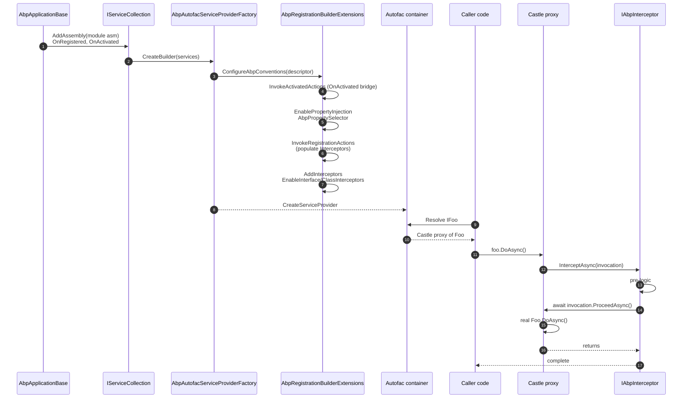

ABP gives application code two activation-time superpowers on top of plain MS DI: **property injection** of
optional dependencies (so base classes can ship with a `Logger`, a `LazyServiceProvider`, a
`StringLocalizerFactory`, …) and **method interception** via `IAbpInterceptor` (the basis for auditing,
unit-of-work, authorization, feature checks, and more). Both rely on Autofac at runtime; the abstractions
themselves are container-agnostic. This page walks through the wiring with the actual source from
`framework/src/Volo.Abp.Autofac/`, `framework/src/Volo.Abp.Core/Volo/Abp/DynamicProxy/`, and
`framework/src/Volo.Abp.Core/Volo/Abp/Aspects/`.

## Files involved

| File | Role |
| --- | --- |
| `framework/src/Volo.Abp.Autofac/Autofac/Builder/AbpRegistrationBuilderExtensions.cs` | The Autofac glue. Hooks `OnActivated`, configures property injection, adds Castle interceptors. |
| `framework/src/Volo.Abp.Autofac/Volo/Abp/Autofac/AbpPropertySelector.cs` | The Autofac `IPropertySelector` that filters out `[DisablePropertyInjection]` members. |
| `framework/src/Volo.Abp.Core/Volo/Abp/DependencyInjection/DisablePropertyInjectionAttribute.cs` | Opt-out attribute, valid on class or property. |
| `framework/src/Volo.Abp.Core/Volo/Abp/DependencyInjection/OnServiceRegistredContext.cs` | The mutable context fired during registration. |
| `framework/src/Volo.Abp.Core/Volo/Abp/DependencyInjection/ServiceRegistrationActionList.cs` | List of `OnRegistered` callbacks + `IsClassInterceptorsDisabled` flag. |
| `framework/src/Volo.Abp.Core/Volo/Abp/DependencyInjection/OnServiceActivatedContext.cs` | Mutable context fired on activation. |
| `framework/src/Volo.Abp.Core/Volo/Abp/DependencyInjection/ServiceActivatedActionList.cs` | Per-descriptor `OnActivated` callbacks. |
| `framework/src/Volo.Abp.Core/Volo/Abp/DynamicProxy/IAbpInterceptor.cs` | The interceptor contract. |
| `framework/src/Volo.Abp.Core/Volo/Abp/DynamicProxy/IAbpMethodInvocation.cs` | The method-invocation contract. |
| `framework/src/Volo.Abp.Core/Volo/Abp/DynamicProxy/AbpInterceptor.cs` | Base class. |
| `framework/src/Volo.Abp.Core/Volo/Abp/DynamicProxy/DynamicProxyIgnoreTypes.cs` | Global opt-out list (controllers and similar). |
| `framework/src/Volo.Abp.Core/Volo/Abp/Aspects/AbpCrossCuttingConcerns.cs` | Helper for cross-cutting state on intercepted objects. |
| `framework/src/Volo.Abp.Core/Volo/Abp/Aspects/IAvoidDuplicateCrossCuttingConcerns.cs` | Marker for objects that track applied concerns. |

## Property injection — how it actually happens

Property injection is **opt-in by container** — only the Autofac integration enables it. The decision is
made when Autofac realises every `ServiceDescriptor` that came out of the ABP pipeline. The relevant
extension is `AbpRegistrationBuilderExtensions.ConfigureAbpConventions`, called by Autofac's
`AbpAutofacServiceProviderFactory` for every registration:

```csharp framework/src/Volo.Abp.Autofac/Autofac/Builder/AbpRegistrationBuilderExtensions.cs
public static IRegistrationBuilder<TLimit, TActivatorData, TRegistrationStyle> ConfigureAbpConventions<TLimit, TActivatorData, TRegistrationStyle>(
        this IRegistrationBuilder<TLimit, TActivatorData, TRegistrationStyle> registrationBuilder,
        ServiceDescriptor serviceDescriptor,
        IModuleContainer moduleContainer,
        ServiceRegistrationActionList registrationActionList,
        ServiceActivatedActionList activatedActionList)
    where TActivatorData : ReflectionActivatorData
{
    registrationBuilder = registrationBuilder.InvokeActivatedActions(activatedActionList, serviceDescriptor);

    var serviceType = registrationBuilder.RegistrationData.Services.OfType<IServiceWithType>().FirstOrDefault()?.ServiceType;
    if (serviceType == null)
    {
        return registrationBuilder;
    }

    var implementationType = registrationBuilder.ActivatorData.ImplementationType;
    if (implementationType == null)
    {
        return registrationBuilder;
    }

    registrationBuilder = registrationBuilder.EnablePropertyInjection(moduleContainer, implementationType);
    registrationBuilder = registrationBuilder.InvokeRegistrationActions(registrationActionList, serviceType, implementationType);

    return registrationBuilder;
}
```

The three things that happen, in order:

<Steps>
  <Step title="OnActivated bridge">
    `InvokeActivatedActions` hooks Autofac's `OnActivated` and replays every callback registered through
    `services.OnActivated(descriptor, …)` against an `OnServiceActivatedContext` wrapping the new instance.
  </Step>
  <Step title="Property injection (if eligible)">
    `EnablePropertyInjection` switches on Autofac's `PropertiesAutowired` only when the implementation type
    lives inside a module assembly and is not marked `[DisablePropertyInjection]`.
  </Step>
  <Step title="OnRegistered + interceptors">
    `InvokeRegistrationActions` fires the `ServiceRegistrationActionList`, then — if any callback pushed an
    interceptor into the context — calls `EnableInterfaceInterceptors` / `EnableClassInterceptors` and
    `InterceptedBy(AbpAsyncDeterminationInterceptor<TInterceptor>)`.
  </Step>
</Steps>

### The eligibility check

```csharp framework/src/Volo.Abp.Autofac/Autofac/Builder/AbpRegistrationBuilderExtensions.cs
private static IRegistrationBuilder<TLimit, TActivatorData, TRegistrationStyle> EnablePropertyInjection<TLimit, TActivatorData, TRegistrationStyle>(
        this IRegistrationBuilder<TLimit, TActivatorData, TRegistrationStyle> registrationBuilder,
        IModuleContainer moduleContainer,
        Type implementationType)
    where TActivatorData : ReflectionActivatorData
{
    // Enable Property Injection only for types in an assembly containing an AbpModule and without a DisablePropertyInjection attribute on class or properties.
    if (moduleContainer.Modules.Any(m => m.AllAssemblies.Contains(implementationType.Assembly)) &&
        implementationType.GetCustomAttributes(typeof(DisablePropertyInjectionAttribute), true).IsNullOrEmpty())
    {
        registrationBuilder = registrationBuilder.PropertiesAutowired(new AbpPropertySelector(false));
    }

    return registrationBuilder;
}
```

Two gates:

1. **Assembly gate** — only types whose assembly is referenced by an `AbpModule` get property injection.
   Third-party types are left alone.
2. **Class-level attribute gate** — `[DisablePropertyInjection]` on the class skips the entire type.

### The per-property gate

When `PropertiesAutowired` is on, Autofac asks the selector per property. `AbpPropertySelector` adds the
attribute filter on top of Autofac's `DefaultPropertySelector`:

```csharp framework/src/Volo.Abp.Autofac/Volo/Abp/Autofac/AbpPropertySelector.cs
public class AbpPropertySelector : DefaultPropertySelector
{
    public AbpPropertySelector(bool preserveSetValues)
        : base(preserveSetValues)
    {
    }

    public override bool InjectProperty(PropertyInfo propertyInfo, object instance)
    {
        return propertyInfo.GetCustomAttributes(typeof(DisablePropertyInjectionAttribute), true).IsNullOrEmpty() &&
               base.InjectProperty(propertyInfo, instance);
    }
}
```

`DefaultPropertySelector(preserveSetValues: false)` will overwrite properties even if they already have a
value — that's why constructor-initialised properties typically get squashed by property injection unless
the type opts out.

```csharp framework/src/Volo.Abp.Core/Volo/Abp/DependencyInjection/DisablePropertyInjectionAttribute.cs
[AttributeUsage(AttributeTargets.Class | AttributeTargets.Property)]
public class DisablePropertyInjectionAttribute : Attribute
{

}
```

<Tip>
Use `[DisablePropertyInjection]` on a single property when you want most of the class auto-wired but need
to keep one read/write property under your own control. Use it on the class when the type is performance-
sensitive (or when constructor injection is sufficient and you want to avoid the reflection cost).
</Tip>

### Idiomatic ABP pattern

```csharp
public class MyManager : DomainService
{
    // DomainService base class declares these as get-set;
    // they are property-injected by Autofac at activation time.
    // public ILogger<MyManager> Logger { get; set; }
    // public IAbpLazyServiceProvider LazyServiceProvider { get; set; }
    // public IStringLocalizerFactory StringLocalizerFactory { get; set; }

    public async Task DoAsync(Guid id)
    {
        Logger.LogInformation("Doing for {Id}", id);
        var repo = LazyServiceProvider.LazyGetRequiredService<IMyRepository>();
        ...
    }
}
```

Because these properties are not constructor parameters, deriving from `DomainService` (and friends) costs
nothing in terms of constructor verbosity.

## Interception — the activation pipeline

Interception is split between **abstraction** (`IAbpInterceptor` / `IAbpMethodInvocation`),
**registration** (the `OnRegistered` event), and **wiring** (Autofac → Castle DynamicProxy).

```csharp framework/src/Volo.Abp.Core/Volo/Abp/DynamicProxy/IAbpInterceptor.cs
public interface IAbpInterceptor
{
    Task InterceptAsync(IAbpMethodInvocation invocation);
}
```

```csharp framework/src/Volo.Abp.Core/Volo/Abp/DynamicProxy/IAbpMethodInvocation.cs
public interface IAbpMethodInvocation
{
    object[] Arguments { get; }

    IReadOnlyDictionary<string, object> ArgumentsDictionary { get; }

    Type[] GenericArguments { get; }

    object TargetObject { get; }

    MethodInfo Method { get; }

    object ReturnValue { get; set; }

    Task ProceedAsync();
}
```

```csharp framework/src/Volo.Abp.Core/Volo/Abp/DynamicProxy/AbpInterceptor.cs
public abstract class AbpInterceptor : IAbpInterceptor
{
    public abstract Task InterceptAsync(IAbpMethodInvocation invocation);
}
```

A concrete interceptor inherits `AbpInterceptor` and dispatches `await invocation.ProceedAsync()` somewhere
inside its body. Synchronous methods are supported transparently — `IAbpMethodInvocation.ProceedAsync` is
implemented by the Castle adapter (`CastleAbpMethodInvocationAdapter` / `CastleAbpMethodInvocationAdapterWithReturnValue<TResult>`) so the interceptor can stay async even for non-async target methods. See
[Castle Dynamic Proxy](/di/castle-dynamic-proxy) for the adapter classes.

### Registering an interceptor — the `OnRegistered` hook

`OnRegistered` is the single supported entry point. The context exposes the implementation type and a
mutable list of interceptor types:

```csharp framework/src/Volo.Abp.Core/Volo/Abp/DependencyInjection/OnServiceRegistredContext.cs
public class OnServiceRegistredContext : IOnServiceRegistredContext
{
    public virtual ITypeList<IAbpInterceptor> Interceptors { get; }

    public virtual Type ServiceType { get; }

    public virtual Type ImplementationType { get; }

    public OnServiceRegistredContext(Type serviceType, [NotNull] Type implementationType)
    {
        ServiceType = Check.NotNull(serviceType, nameof(serviceType));
        ImplementationType = Check.NotNull(implementationType, nameof(implementationType));

        Interceptors = new TypeList<IAbpInterceptor>();
    }
}
```

```csharp
public class MyInterceptorRegistrar
{
    public static void RegisterIfNeeded(IOnServiceRegistredContext context)
    {
        if (ShouldIntercept(context.ImplementationType))
        {
            context.Interceptors.TryAdd<MyAuditingInterceptor>();
        }
    }
}

// Inside an AbpModule.ConfigureServices:
context.Services.OnRegistered(MyInterceptorRegistrar.RegisterIfNeeded);
```

The `ServiceRegistrationActionList` is shared via `IObjectAccessor<ServiceRegistrationActionList>`:

```csharp framework/src/Volo.Abp.Core/Volo/Abp/DependencyInjection/ServiceRegistrationActionList.cs
public class ServiceRegistrationActionList : List<Action<IOnServiceRegistredContext>>
{
    public bool IsClassInterceptorsDisabled { get; set; }
}
```

### Autofac side — building the proxy

The Autofac builder reads the populated context and enables the right kind of proxy. Note the conditional:

```csharp framework/src/Volo.Abp.Autofac/Autofac/Builder/AbpRegistrationBuilderExtensions.cs
private static IRegistrationBuilder<TLimit, TActivatorData, TRegistrationStyle>
    AddInterceptors<TLimit, TActivatorData, TRegistrationStyle>(
        this IRegistrationBuilder<TLimit, TActivatorData, TRegistrationStyle> registrationBuilder,
        ServiceRegistrationActionList serviceRegistrationActionList,
        Type serviceType,
        IEnumerable<Type> interceptors)
    where TActivatorData : ReflectionActivatorData
{
    if (serviceType.IsInterface)
    {
        registrationBuilder = registrationBuilder.EnableInterfaceInterceptors();
    }
    else
    {
        if (serviceRegistrationActionList.IsClassInterceptorsDisabled)
        {
            return registrationBuilder;
        }

        (registrationBuilder as IRegistrationBuilder<TLimit, ConcreteReflectionActivatorData, TRegistrationStyle>)?.EnableClassInterceptors();
    }

    foreach (var interceptor in interceptors)
    {
        registrationBuilder.InterceptedBy(
            typeof(AbpAsyncDeterminationInterceptor<>).MakeGenericType(interceptor)
        );
    }

    return registrationBuilder;
}
```

Take-aways:

- **Interface registrations** (`serviceType.IsInterface`) get a transparent proxy — methods don't need to be
  `virtual`. This is the preferred shape.
- **Class registrations** use Castle's class proxy — methods *must* be `public virtual` (or `protected
  virtual`) to be intercepted. Sealed classes / non-virtual methods are silently ignored.
- The closed generic `AbpAsyncDeterminationInterceptor<TInterceptor>` is registered as the actual Castle
  interceptor. See [Castle Dynamic Proxy](/di/castle-dynamic-proxy) for that adapter.

### Disabling class interceptors globally

`services.DisableAbpClassInterceptors()` flips the `IsClassInterceptorsDisabled` flag on the action list and
suppresses class-proxy generation everywhere — useful when a host (e.g. unit tests, an AOT scenario) cannot
tolerate dynamic class proxies.

```csharp framework/src/Volo.Abp.Core/Microsoft/Extensions/DependencyInjection/ServiceCollectionRegistrationActionExtensions.cs
public static void DisableAbpClassInterceptors(this IServiceCollection services)
{
    GetOrCreateRegistrationActionList(services).IsClassInterceptorsDisabled = true;
}
```

### Disabling proxies per type — `DynamicProxyIgnoreTypes`

For specific high-throughput types (the canonical case is ASP.NET Core controllers), ABP exposes a static
ignore list:

```csharp framework/src/Volo.Abp.Core/Volo/Abp/DynamicProxy/DynamicProxyIgnoreTypes.cs
/// <summary>
/// Castle's dynamic proxy class feature will have performance issues for some components, such as the controller of Asp net core MVC.
/// For related discussions, see: https://github.com/castleproject/Core/issues/486 https://github.com/abpframework/abp/issues/3180
/// The Abp framework may enable interceptors for certain components (UOW, Auditing, Authorization, etc.), which requires dynamic proxy classes, but will cause application performance to decline.
/// We need to use other methods for the controller to implement interception, such as middleware or MVC / Page filters.
/// So we provide some ignored types to avoid enabling dynamic proxy classes.
/// By default it is empty. When you use middleware or filters for these components in your application, you can add these types to the list.
/// </summary>
public static class DynamicProxyIgnoreTypes
{
    private static HashSet<Type> IgnoredTypes { get; } = new HashSet<Type>();

    public static void Add<T>()
    {
        lock (IgnoredTypes)
        {
            IgnoredTypes.AddIfNotContains(typeof(T));
        }
    }

    public static bool Contains(Type type, bool includeDerivedTypes = true)
    {
        lock (IgnoredTypes)
        {
            return includeDerivedTypes
                ? IgnoredTypes.Any(t => t.IsAssignableFrom(type))
                : IgnoredTypes.Contains(type);
        }
    }
}
```

Modules that ship the cross-cutting concerns implement those concerns with middleware/filters for ignored
types and with interceptors for everything else.

## The OnActivated hook

```csharp framework/src/Volo.Abp.Autofac/Autofac/Builder/AbpRegistrationBuilderExtensions.cs
private static IRegistrationBuilder<TLimit, TActivatorData, TRegistrationStyle> InvokeActivatedActions<TLimit, TActivatorData, TRegistrationStyle>(
    this IRegistrationBuilder<TLimit, TActivatorData, TRegistrationStyle> registrationBuilder,
    ServiceActivatedActionList activatedActionList,
    ServiceDescriptor serviceDescriptor)
    where TActivatorData : ReflectionActivatorData
{
    registrationBuilder.OnActivated(context =>
    {
        var serviceActivatedContext = new OnServiceActivatedContext(context.Instance!);
        foreach (var action in activatedActionList.GetActions(serviceDescriptor))
        {
            action.Invoke(serviceActivatedContext);
        }
    });

    return registrationBuilder;
}
```

This is the catch-all extension point for "do something to the instance just after construction" —
typically state hydration. The matching extension on `IServiceCollection`:

```csharp framework/src/Volo.Abp.Core/Microsoft/Extensions/DependencyInjection/ServiceCollectionLifetimeEventExtensions.cs
public static void OnActivated(this IServiceCollection services, ServiceDescriptor descriptor, Action<IOnServiceActivatedContext> onActivatedAction)
{
    GetOrCreateOnActivatedActionList(services).Add(new KeyValuePair<ServiceDescriptor, Action<IOnServiceActivatedContext>>(descriptor, onActivatedAction));
}
```

Note that the lookup is keyed on the exact `ServiceDescriptor` instance — if you replace the descriptor
later, your activation handler will not fire.

## Aspects — avoiding double application

Many interceptors are idempotent in the worst case, but `AbpCrossCuttingConcerns` lets you skip them
properly when an outer interceptor has already applied the concern.

```csharp framework/src/Volo.Abp.Core/Volo/Abp/Aspects/IAvoidDuplicateCrossCuttingConcerns.cs
public interface IAvoidDuplicateCrossCuttingConcerns
{
    List<string> AppliedCrossCuttingConcerns { get; }
}
```

```csharp framework/src/Volo.Abp.Core/Volo/Abp/Aspects/AbpCrossCuttingConcerns.cs
public const string Auditing = "AbpAuditing";
public const string UnitOfWork = "AbpUnitOfWork";
public const string FeatureChecking = "AbpFeatureChecking";
public const string GlobalFeatureChecking = "AbpGlobalFeatureChecking";

public static IDisposable Applying(object obj, params string[] concerns)
{
    AddApplied(obj, concerns);
    return new DisposeAction<ValueTuple<object, string[]>>(static (state) =>
    {
        var (obj, concerns) = state;
        RemoveApplied(obj, concerns);
    }, (obj, concerns));
}

public static bool IsApplied([NotNull] object obj, [NotNull] string concern)
{
    ...
    return (obj as IAvoidDuplicateCrossCuttingConcerns)?.AppliedCrossCuttingConcerns.Contains(concern) ?? false;
}
```

Pattern:

```csharp
public override async Task InterceptAsync(IAbpMethodInvocation invocation)
{
    if (AbpCrossCuttingConcerns.IsApplied(invocation.TargetObject, AbpCrossCuttingConcerns.Auditing))
    {
        await invocation.ProceedAsync();
        return;
    }

    using (AbpCrossCuttingConcerns.Applying(invocation.TargetObject, AbpCrossCuttingConcerns.Auditing))
    {
        // ... do auditing setup ...
        await invocation.ProceedAsync();
    }
}
```

## End-to-end flow



## Gotchas

<Warning>
- **Class proxies require virtual methods.** A sealed class or non-virtual method silently bypasses class
  interceptors — there's no exception, only "my interceptor didn't run".
- **Property injection can clobber constructor-set values** because `AbpPropertySelector` is constructed
  with `preserveSetValues: false`. If you must keep your manually-set value, mark the property
  `[DisablePropertyInjection]`.
- **`OnActivated` runs after property injection.** Adjust state in `OnActivated` if you need the injected
  properties to already be populated.
- **Disabling property injection on a base class is inherited.** `[DisablePropertyInjection]` on
  `AbpFastBase` disables injection for every subclass — be explicit.
- **`DisableAbpClassInterceptors` is global.** Once flipped, the only way to keep class interception is to
  rewrite affected types behind interfaces.
- **`OnRegistered` fires once per (service, implementation) pair.** A class exposed under three interfaces
  will see the callback three times — design your interceptor-decision logic to be idempotent.
</Warning>

## Cross-links

<CardGroup cols={3}>
  <Card title="Autofac Integration" icon="plug" href="/di/autofac-integration">Hooking the factory into the host.</Card>
  <Card title="Castle Dynamic Proxy" icon="puzzle-piece" href="/di/castle-dynamic-proxy">`AbpAsyncDeterminationInterceptor` and adapters.</Card>
  <Card title="Lazy Providers" icon="layer-group" href="/di/lazy-service-provider">Why property-injected `LazyServiceProvider` works.</Card>
</CardGroup>
