The Azure Service Bus binding splits across `Volo.Abp.AzureServiceBus` — a thin wrapper over `Azure.Messaging.ServiceBus` that builds connection, publisher and processor pools — and `Volo.Abp.EventBus.Azure`, whose `AzureDistributedEventBus` replaces the default [`LocalDistributedEventBus`](/events/distributed-event-bus#localdistributedeventbus) via `[Dependency(ReplaceServices = true)]`. Every ABP distributed event becomes a single `ServiceBusMessage` sent to a configurable **topic**, with the event name carried in `Subject`. Consumers attach to a **subscription** named after the service and let the ABP inbox dedupe by `MessageId`.

This page walks the source under `framework/src/Volo.Abp.EventBus.Azure` and `framework/src/Volo.Abp.AzureServiceBus`, the configuration sections the modules read, and the publish/consume flow.

## File inventory

| Package | File | Path | Role |
| --- | --- | --- | --- |
| EventBus.Azure | `AbpEventBusAzureModule.cs` | `framework/src/Volo.Abp.EventBus.Azure/Volo/Abp/EventBus/Azure` | Binds `Azure:EventBus`; calls `AzureDistributedEventBus.Initialize()` unless the bus is disabled. |
| EventBus.Azure | `AbpAzureEventBusOptions.cs` | same | `ConnectionName`, `TopicName`, `SubscriberName`, `IsServiceBusDisabled`. |
| EventBus.Azure | `AzureDistributedEventBus.cs` | same | Subclass of `DistributedEventBusBase` over Service Bus topics. |
| AzureServiceBus | `AbpAzureServiceBusModule.cs` | `framework/src/Volo.Abp.AzureServiceBus/Volo/Abp/AzureServiceBus` | Binds `Azure:ServiceBus` configuration. |
| AzureServiceBus | `AbpAzureServiceBusOptions.cs` | same | `AzureServiceBusConnections`. |
| AzureServiceBus | `AzureServiceBusConnections.cs` / `ClientConfig.cs` | same | Connection map; per-connection `ConnectionString`, admin/client/processor options. |
| AzureServiceBus | `ConnectionPool.cs` | same | Caches `ServiceBusClient` and `ServiceBusAdministrationClient` per connection. |
| AzureServiceBus | `PublisherPool.cs` | same | Lazy `ServiceBusSender` cache keyed by topic. |
| AzureServiceBus | `ProcessorPool.cs` | same | `ServiceBusProcessor` cache for subscriptions. |
| AzureServiceBus | `AzureServiceBusMessageConsumer.cs` / `…Factory.cs` | same | Long-lived consumer used by the event bus. |
| AzureServiceBus | `ServiceBusAdministrationClientExtensions.cs` | same | `SetupTopicAsync` helpers that ensure topic + subscription exist. |
| AzureServiceBus | `Utf8JsonAzureServiceBusSerializer.cs` | same | Default `IAzureServiceBusSerializer`. |

## `AbpEventBusAzureModule`

Depends on `AbpEventBusModule` + `AbpAzureServiceBusModule`. It binds its options from `Azure:EventBus` and initialises the bus only when Service Bus is enabled:

```csharp framework/src/Volo.Abp.EventBus.Azure/Volo/Abp/EventBus/Azure/AbpEventBusAzureModule.cs
[DependsOn(
    typeof(AbpEventBusModule),
    typeof(AbpAzureServiceBusModule)
)]
public class AbpEventBusAzureModule : AbpModule
{
    public override void ConfigureServices(ServiceConfigurationContext context)
    {
        var configuration = context.Services.GetConfiguration();
        Configure<AbpAzureEventBusOptions>(configuration.GetSection("Azure:EventBus"));
    }

    public override void OnApplicationInitialization(ApplicationInitializationContext context)
    {
        var options = context.ServiceProvider
            .GetRequiredService<IOptions<AbpAzureEventBusOptions>>().Value;

        if (!options.IsServiceBusDisabled)
        {
            context
                .ServiceProvider
                .GetRequiredService<AzureDistributedEventBus>()
                .Initialize();
        }
    }
}
```

`IsServiceBusDisabled = true` is a convenient toggle for hosts that share the same composition root but should run without a broker (e.g. design-time tooling).

## Options

### `AbpAzureEventBusOptions`

```csharp framework/src/Volo.Abp.EventBus.Azure/Volo/Abp/EventBus/Azure/AbpAzureEventBusOptions.cs
public class AbpAzureEventBusOptions
{
    public string? ConnectionName { get; set; }
    public string SubscriberName { get; set; } = default!;
    public string TopicName { get; set; } = default!;
    public bool IsServiceBusDisabled { get; set; }
}
```

- `ConnectionName` — picks an entry in `AbpAzureServiceBusOptions.Connections`.
- `TopicName` — the shared Service Bus topic that carries all ABP distributed events.
- `SubscriberName` — the subscription name unique to this microservice (akin to a Kafka group id).
- `IsServiceBusDisabled` — short-circuits `Initialize()`.

### `AbpAzureServiceBusOptions` and `ClientConfig`

```csharp framework/src/Volo.Abp.AzureServiceBus/Volo/Abp/AzureServiceBus/AbpAzureServiceBusOptions.cs
public class AbpAzureServiceBusOptions
{
    public AzureServiceBusConnections Connections { get; }
}
```

```csharp framework/src/Volo.Abp.AzureServiceBus/Volo/Abp/AzureServiceBus/ClientConfig.cs
public class ClientConfig
{
    public string ConnectionString { get; set; } = default!;

    public ServiceBusAdministrationClientOptions Admin { get; set; } = new();
    public ServiceBusClientOptions Client { get; set; } = new();
    public ServiceBusProcessorOptions Processor { get; set; } = new();
}
```

`ConnectionString` is the namespace-level connection string with `Endpoint=…;SharedAccessKeyName=…;SharedAccessKey=…`. The three nested option objects come straight from the Azure SDK and let you tune retry policies (`Client.RetryOptions`), prefetch (`Processor.PrefetchCount`), and lock duration (`Processor.MaxAutoLockRenewalDuration`).

```json appsettings.json
{
  "Azure": {
    "ServiceBus": {
      "Connections": {
        "Default": {
          "ConnectionString": "Endpoint=sb://...servicebus.windows.net/;..."
        }
      }
    },
    "EventBus": {
      "TopicName": "abp-events",
      "SubscriberName": "orders-service"
    }
  }
}
```

## Pools

### `ConnectionPool`

`ConnectionPool` exposes two getters: `GetClient(connectionName)` returns a cached `ServiceBusClient` used for senders and processors, while `GetAdministrationClient(connectionName)` returns a cached `ServiceBusAdministrationClient` used to create topics and subscriptions on demand.

### `PublisherPool`

`PublisherPool` is a `ISingletonDependency` keyed by topic. Its `GetAsync` ensures the topic exists (`SetupTopicAsync` is an extension on `ServiceBusAdministrationClient`) before returning a cached `ServiceBusSender`:

```csharp framework/src/Volo.Abp.AzureServiceBus/Volo/Abp/AzureServiceBus/PublisherPool.cs
public async Task<ServiceBusSender> GetAsync(string topicName, string? connectionName)
{
    var admin = _connectionPool.GetAdministrationClient(connectionName);
    await admin.SetupTopicAsync(topicName);

    return _publishers.GetOrAdd(
        topicName, new Lazy<ServiceBusSender>(() =>
        {
            var client = _connectionPool.GetClient(connectionName);
            return client.CreateSender(topicName);
        })
    ).Value;
}
```

The pool's `DisposeAsync` closes every cached sender during application shutdown.

### `ProcessorPool` and `AzureServiceBusMessageConsumerFactory`

`AzureServiceBusMessageConsumerFactory` builds the long-lived consumer used by the event bus. It opens a DI scope, retrieves an `AzureServiceBusMessageConsumer`, initialises it with the topic + subscription + connection name, and returns it:

```csharp framework/src/Volo.Abp.AzureServiceBus/Volo/Abp/AzureServiceBus/AzureServiceBusMessageConsumerFactory.cs
public class AzureServiceBusMessageConsumerFactory
    : IAzureServiceBusMessageConsumerFactory, ISingletonDependency, IDisposable
{
    protected IServiceScope ServiceScope { get; }

    public AzureServiceBusMessageConsumerFactory(IServiceScopeFactory serviceScopeFactory)
    {
        ServiceScope = serviceScopeFactory.CreateScope();
    }

    public IAzureServiceBusMessageConsumer CreateMessageConsumer(
        string topicName,
        string subscriptionName,
        string? connectionName)
    {
        var processor = ServiceScope.ServiceProvider
            .GetRequiredService<AzureServiceBusMessageConsumer>();
        processor.Initialize(topicName, subscriptionName, connectionName);
        return processor;
    }

    public void Dispose() => ServiceScope?.Dispose();
}
```

The consumer in turn pulls a `ServiceBusProcessor` from `ProcessorPool`, wires `ProcessMessageAsync` / `ProcessErrorAsync`, and starts the processor.

## `AzureDistributedEventBus`

```csharp framework/src/Volo.Abp.EventBus.Azure/Volo/Abp/EventBus/Azure/AzureDistributedEventBus.cs
[Dependency(ReplaceServices = true)]
[ExposeServices(typeof(IDistributedEventBus), typeof(AzureDistributedEventBus))]
public class AzureDistributedEventBus : DistributedEventBusBase, ISingletonDependency
```

The constructor takes the standard `DistributedEventBusBase` ambient services plus:

- `IOptions<AbpAzureEventBusOptions>` — topic + subscription + connection.
- `IAzureServiceBusSerializer` — JSON serializer by default.
- `IAzureServiceBusMessageConsumerFactory` — used in `Initialize()`.
- `IPublisherPool` — used for every send.

### Initialise

`Initialize()` creates the consumer, hooks the per-message callback, and subscribes handlers:

```csharp framework/src/Volo.Abp.EventBus.Azure/Volo/Abp/EventBus/Azure/AzureDistributedEventBus.cs
public void Initialize()
{
    Consumer = MessageConsumerFactory.CreateMessageConsumer(
        Options.TopicName,
        Options.SubscriberName,
        Options.ConnectionName);

    Consumer.OnMessageReceived(ProcessEventAsync);
    SubscribeHandlers(AbpDistributedEventBusOptions.Handlers);
}
```

### Publish

`PublishToEventBusAsync` builds a `ServiceBusMessage`, sets the **subject** to the event name, picks a `MessageId` (the outbox row id when publishing from the outbox, otherwise a fresh guid), and sends through the publisher pool:

```csharp framework/src/Volo.Abp.EventBus.Azure/Volo/Abp/EventBus/Azure/AzureDistributedEventBus.cs
protected virtual async Task PublishAsync(
    string eventName,
    byte[] body,
    string? correlationId,
    Guid? eventId)
{
    var message = new ServiceBusMessage(body)
    {
        Subject = eventName
    };

    if (message.MessageId.IsNullOrWhiteSpace())
    {
        message.MessageId = (eventId ?? GuidGenerator.Create()).ToString("N");
    }

    message.CorrelationId = correlationId;

    var publisher = await PublisherPool.GetAsync(
        Options.TopicName,
        Options.ConnectionName);

    await publisher.SendMessageAsync(message);
}
```

### Batched outbox

`PublishManyFromOutboxAsync` is the most idiosyncratic of all brokers — it constructs a `ServiceBusMessageBatch` and tries to add every outbox row to it:

```csharp framework/src/Volo.Abp.EventBus.Azure/Volo/Abp/EventBus/Azure/AzureDistributedEventBus.cs
public async override Task PublishManyFromOutboxAsync(
    IEnumerable<OutgoingEventInfo> outgoingEvents,
    OutboxConfig outboxConfig)
{
    var outgoingEventArray = outgoingEvents.ToArray();

    var publisher = await PublisherPool.GetAsync(
        Options.TopicName,
        Options.ConnectionName);

    using var messageBatch = await publisher.CreateMessageBatchAsync();

    foreach (var outgoingEvent in outgoingEventArray)
    {
        var message = new ServiceBusMessage(outgoingEvent.EventData)
        {
            Subject = outgoingEvent.EventName
        };

        if (message.MessageId.IsNullOrWhiteSpace())
        {
            message.MessageId = outgoingEvent.Id.ToString();
        }

        message.CorrelationId = outgoingEvent.GetCorrelationId();

        if (!messageBatch.TryAddMessage(message))
        {
            throw new AbpException(
                "The message is too large to fit in the batch. Set AbpEventBusBoxesOptions.OutboxWaitingEventMaxCount to reduce the number");
        }

        using (CorrelationIdProvider.Change(outgoingEvent.GetCorrelationId()))
        {
            await TriggerDistributedEventSentAsync(new DistributedEventSent()
            {
                Source = DistributedEventSource.Outbox,
                EventName = outgoingEvent.EventName,
                EventData = outgoingEvent.EventData
            });
        }
    }

    await publisher.SendMessagesAsync(messageBatch);
}
```

If `TryAddMessage` returns `false` (the batch exceeded the broker's size limit) the whole call fails — the outbox row stays put and the next cycle retries. Lower `AbpEventBusBoxesOptions.OutboxWaitingEventMaxCount` if you produce large payloads.

### Consume

`ProcessEventAsync` reads the event name from `message.Subject`, looks up the CLR type, deserialises the body and either delegates to the inbox or fires handlers directly:

```csharp framework/src/Volo.Abp.EventBus.Azure/Volo/Abp/EventBus/Azure/AzureDistributedEventBus.cs
private async Task ProcessEventAsync(ServiceBusReceivedMessage message)
{
    var eventName = message.Subject;
    if (eventName == null) return;

    var eventType = EventTypes.GetOrDefault(eventName);
    if (eventType == null) return;

    var eventData = Serializer.Deserialize(message.Body.ToArray(), eventType);

    if (await AddToInboxAsync(message.MessageId, eventName, eventType, eventData, message.CorrelationId))
    {
        return;
    }

    using (CorrelationIdProvider.Change(message.CorrelationId))
    {
        await TriggerHandlersDirectAsync(eventType, eventData);
    }
}
```

`message.MessageId` is what the [inbox dedupe](/events/distributed-event-bus#inbox-dedupe) uses to drop duplicates after a redelivery.

## Topology

```mermaid
flowchart LR
    subgraph Producer["Producer process"]
        Publish["IDistributedEventBus.PublishAsync"]
        Decide{"useOutbox<br/>+ Outbox match?"}
        Out["IEventOutbox.EnqueueAsync"]
        Worker["OutboxSender"]
        Batch["PublisherPool.GetAsync(topic)<br/>CreateMessageBatchAsync<br/>SendMessagesAsync"]
        Direct["SendMessageAsync"]
    end

    Topic[("Service Bus topic<br/>TopicName")]
    Sub[("Subscription<br/>SubscriberName")]

    subgraph Consumer["Consumer process"]
        Cons["AzureServiceBusMessageConsumer<br/>ProcessEventAsync"]
        Lookup["EventTypes.GetOrDefault(message.Subject)"]
        Inbox{"AddToInboxAsync<br/>by message.MessageId?"}
        Persist["IEventInbox.EnqueueAsync"]
        Processor["InboxProcessor"]
        Handlers["TriggerHandlersFromInboxAsync"]
        Skip["TriggerHandlersDirectAsync"]
    end

    Publish --> Decide
    Decide -- yes --> Out --> Worker --> Batch --> Topic
    Decide -- no --> Direct --> Topic
    Topic --> Sub --> Cons --> Lookup --> Inbox
    Inbox -- match --> Persist --> Processor --> Handlers
    Inbox -- none --> Skip
```



Each microservice owns its subscription name. Service Bus topics fanout to every subscription, so every service sees every event — load balancing inside a service happens through multiple receivers on the same subscription.

## Topic and subscription provisioning

`PublisherPool.GetAsync` calls `ServiceBusAdministrationClientExtensions.SetupTopicAsync`, which creates the topic if it does not exist. The consumer side similarly creates the subscription on `Initialize()`. For air-gapped or least-privilege scenarios where your runtime credentials cannot manage the namespace, pre-create both resources and assign the SAS rules `Send` / `Listen` to the runtime identity.

## Serialization

`Utf8JsonAzureServiceBusSerializer` is the default `IAzureServiceBusSerializer`. Replace it via DI to switch to a custom format. `DistributedEventBusBase.Serialize` delegates to whichever serializer is registered, so outbox rows are also encoded with the custom format.

## Failure modes

<Warning>The batch publish fails atomically. If even one outbox row is rejected by `TryAddMessage`, the whole batch is left in the outbox; the next worker cycle retries it. Verify your average payload is well under 1 MB or reduce `OutboxWaitingEventMaxCount`.</Warning>

<Note>Service Bus delivers messages with at-least-once semantics. The ABP inbox dedupes by `MessageId` (`outgoingEvent.Id.ToString()` from the outbox, or a fresh guid otherwise). Make sure that the inbox is wired in your consumer or you may process the same event twice after a redelivery.</Note>

<Tip>`ClientConfig.Processor.PrefetchCount` improves throughput at the cost of larger memory usage. Set it through `Configure<AbpAzureServiceBusOptions>` if you need to tune for high-volume topics.</Tip>

<Tip>Set `IsServiceBusDisabled = true` from a CLI tool host that shares the same composition root as your worker — the dependency injection graph stays valid but nothing connects to Azure during a `Database.Migrate()` call.</Tip>

## Authoring an event

ABP does not require dedicated types for Azure Service Bus — the same `[EventName("...")]` POCO used by other brokers works unchanged. Subject-based routing is fully driven by `EventNameAttribute`:

```csharp Event and handler
[EventName("identity.user.created")]
public class UserCreatedEto
{
    public Guid Id { get; set; }
    public string UserName { get; set; } = default!;
}

public class WelcomeUserHandler
    : IDistributedEventHandler<UserCreatedEto>, ITransientDependency
{
    public Task HandleEventAsync(UserCreatedEto eventData) => Task.CompletedTask;
}
```

## Related guides

<CardGroup cols={3}>
  <Card title="Distributed bus" href="/events/distributed-event-bus" icon="network-wired" />
  <Card title="Event bus overview" href="/events/overview" icon="bolt" />
  <Card title="RabbitMQ binding" href="/events/rabbitmq" icon="rabbit" />
  <Card title="Kafka binding" href="/events/kafka" icon="server" />
  <Card title="UoW event publisher" href="/uow/event-publisher-integration" icon="rotate" />
  <Card title="Background workers" href="/background/background-workers" icon="gear" />
</CardGroup>
