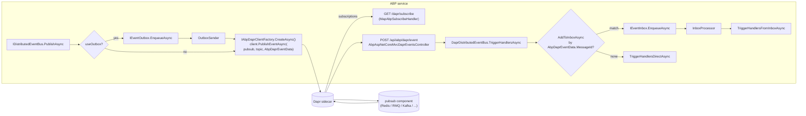

The Dapr binding is split across three packages. `Volo.Abp.EventBus.Dapr` provides `DaprDistributedEventBus`, which uses `IDaprClient` to publish topic messages to the configured pub/sub component (Redis, RabbitMQ, Service Bus, Kafka, …). `Volo.Abp.AspNetCore.Mvc.Dapr.EventBus` plugs an MVC controller and the `MapAbpSubscribeHandler` endpoint that exposes `/dapr/subscribe` so the sidecar knows where to POST messages. Together they implement the standard [outbox/inbox pattern](/events/distributed-event-bus) on top of the Dapr runtime.

This page reads the source under `framework/src/Volo.Abp.EventBus.Dapr` and `framework/src/Volo.Abp.AspNetCore.Mvc.Dapr.EventBus`, explains the topic discovery flow, and shows how to enable the integration in a host.

## File inventory

| Package | File | Path | Role |
| --- | --- | --- | --- |
| EventBus.Dapr | `AbpEventBusDaprModule.cs` | `framework/src/Volo.Abp.EventBus.Dapr/Volo/Abp/EventBus/Dapr` | Initialises the bus during app startup. |
| EventBus.Dapr | `AbpDaprEventBusOptions.cs` | same | Holds the `PubSubName` (default `"pubsub"`). |
| EventBus.Dapr | `DaprDistributedEventBus.cs` | same | Subclass of `DistributedEventBusBase` that publishes via `IDaprClient`. |
| EventBus.Dapr | `AbpDaprEventData.cs` | same | Envelope that wraps the JSON payload + headers. |
| AspNetCore.Mvc.Dapr.EventBus | `AbpAspNetCoreMvcDaprEventBusModule.cs` | `framework/src/Volo.Abp.AspNetCore.Mvc.Dapr.EventBus/Volo/Abp/AspNetCore/Mvc/Dapr/EventBus` | Maps `/dapr/subscribe`; declares one subscription per registered distributed handler. |
| AspNetCore.Mvc.Dapr.EventBus | `AbpAspNetCoreMvcDaprPubSubConsts.cs` | same | `DaprEventCallbackUrl = "api/abp/dapr/event"`. |
| AspNetCore.Mvc.Dapr.EventBus | `Controllers/AbpAspNetCoreMvcDaprEventsController.cs` | same | MVC controller that receives Dapr POSTs. |
| AspNetCore.Mvc.Dapr.EventBus | `DaprAspNetCore/AbpDaprEndpointRouteBuilderExtensions.cs` | same | `MapAbpSubscribeHandler` produces the `/dapr/subscribe` response. |

## `AbpEventBusDaprModule`

The module depends on `AbpEventBusModule` + `AbpDaprModule`, and during init it calls the bus' `Initialize()`:

```csharp framework/src/Volo.Abp.EventBus.Dapr/Volo/Abp/EventBus/Dapr/AbpEventBusDaprModule.cs
[DependsOn(
    typeof(AbpEventBusModule),
    typeof(AbpDaprModule)
)]
public class AbpEventBusDaprModule : AbpModule
{
    public override void OnApplicationInitialization(ApplicationInitializationContext context)
    {
        context
            .ServiceProvider
            .GetRequiredService<DaprDistributedEventBus>()
            .Initialize();
    }
}
```

`Initialize()` just calls `SubscribeHandlers(AbpDistributedEventBusOptions.Handlers)` — it does **not** open any connection. All actual publishing goes through `IAbpDaprClientFactory.CreateAsync()`, which speaks HTTP/gRPC to the local sidecar. Refer to the [Dapr integration guide](/dapr/overview) for how the client and sidecar token are wired.

## `AbpDaprEventBusOptions`

```csharp framework/src/Volo.Abp.EventBus.Dapr/Volo/Abp/EventBus/Dapr/AbpDaprEventBusOptions.cs
public class AbpDaprEventBusOptions
{
    public string PubSubName { get; set; }

    public AbpDaprEventBusOptions()
    {
        PubSubName = "pubsub";
    }
}
```

`PubSubName` matches the `name:` field in the `dapr/components/pubsub.yaml` configuration that the sidecar loads. Override it in your module:

```csharp
Configure<AbpDaprEventBusOptions>(options =>
{
    options.PubSubName = "events-pubsub";
});
```

## `DaprDistributedEventBus`

```csharp framework/src/Volo.Abp.EventBus.Dapr/Volo/Abp/EventBus/Dapr/DaprDistributedEventBus.cs
[Dependency(ReplaceServices = true)]
[ExposeServices(typeof(IDistributedEventBus), typeof(DaprDistributedEventBus))]
public class DaprDistributedEventBus : DistributedEventBusBase, ISingletonDependency
```

Its dependencies bring in `IDaprSerializer`, `IAbpDaprClientFactory`, plus the standard `DistributedEventBusBase` ambient services. The bus does not own a long-lived consumer; Dapr delivers messages over HTTP and the MVC controller forwards them to the bus.

### Publish

`PublishToEventBusAsync` constructs an `AbpDaprEventData` envelope and posts it to the sidecar's `publish` endpoint via `IDaprClient.PublishEventAsync`:

```csharp framework/src/Volo.Abp.EventBus.Dapr/Volo/Abp/EventBus/Dapr/DaprDistributedEventBus.cs
protected async override Task PublishToEventBusAsync(Type eventType, object eventData)
{
    await PublishToDaprAsync(eventType, eventData, null, CorrelationIdProvider.Get());
}

protected virtual async Task PublishToDaprAsync(
    string eventName,
    object eventData,
    Guid? messageId = null,
    string? correlationId = null)
{
    var client = await DaprClientFactory.CreateAsync();
    var data = new AbpDaprEventData(
        DaprEventBusOptions.PubSubName,
        eventName,
        (messageId ?? GuidGenerator.Create()).ToString("N"),
        Serializer.SerializeToString(eventData),
        correlationId);
    await client.PublishEventAsync(
        pubsubName: DaprEventBusOptions.PubSubName,
        topicName: eventName,
        data: data);
}
```

`AbpDaprEventData` is a flat POCO holding the Dapr metadata needed to round-trip ABP semantics:

```csharp framework/src/Volo.Abp.EventBus.Dapr/Volo/Abp/EventBus/Dapr/AbpDaprEventData.cs
public class AbpDaprEventData
{
    public string PubSubName { get; set; }
    public string Topic { get; set; }
    public string MessageId { get; set; }
    public string JsonData { get; set; }
    public string? CorrelationId { get; set; }
}
```

Wrapping the payload in `JsonData` lets the consumer side recover the **exact** bytes that were serialised originally, which matters when the producer and consumer use the same `IDaprSerializer` but are configured with different defaults (e.g. casing, datetime handling).

### Outbox

`PublishFromOutboxAsync` deserialises the outbox row and posts it through the same `PublishToDaprAsync` path. The batched variant simply loops over the events — there is no native batch publish in Dapr's pub/sub API.

### Consume

`TriggerHandlersAsync(Type, object, string?, string?)` is the entry point the MVC controller calls. It dedupes through the inbox and triggers handlers in a fresh tenant scope:

```csharp framework/src/Volo.Abp.EventBus.Dapr/Volo/Abp/EventBus/Dapr/DaprDistributedEventBus.cs
public virtual async Task TriggerHandlersAsync(
    Type eventType, object eventData,
    string? messageId = null, string? correlationId = null)
{
    if (await AddToInboxAsync(messageId, EventNameAttribute.GetNameOrDefault(eventType), eventType, eventData, correlationId))
    {
        return;
    }

    using (CorrelationIdProvider.Change(correlationId))
    {
        await TriggerHandlersDirectAsync(eventType, eventData);
    }
}
```

`GetEventType(string eventName)` is the public lookup that the controller uses to resolve the CLR type from the Dapr topic name:

```csharp framework/src/Volo.Abp.EventBus.Dapr/Volo/Abp/EventBus/Dapr/DaprDistributedEventBus.cs
public Type GetEventType(string eventName)
{
    return EventTypes.GetOrDefault(eventName)!;
}
```

The `EventTypes` map is populated by `Subscribe` (when handlers are discovered) and by `OnAddToOutboxAsync` (when an event is enqueued), exactly as for the other brokers.

## MVC integration

### `AbpAspNetCoreMvcDaprEventsController`

The MVC controller is mapped to `api/abp/dapr/event` (constant `DaprEventCallbackUrl`). It validates the Dapr app API token, parses the JSON Cloud Event envelope, and forwards the payload to the bus:

```csharp framework/src/Volo.Abp.AspNetCore.Mvc.Dapr.EventBus/Volo/Abp/AspNetCore/Mvc/Dapr/EventBus/Controllers/AbpAspNetCoreMvcDaprEventsController.cs
[HttpPost(AbpAspNetCoreMvcDaprPubSubConsts.DaprEventCallbackUrl)]
public virtual async Task<IActionResult> EventAsync()
{
    HttpContext.ValidateDaprAppApiToken();

    var daprSerializer = HttpContext.RequestServices.GetRequiredService<IDaprSerializer>();
    var body = (await JsonDocument.ParseAsync(HttpContext.Request.Body));

    var pubSubName = body.RootElement.GetProperty("pubsubname").GetString();
    var topic = body.RootElement.GetProperty("topic").GetString();
    var data = body.RootElement.GetProperty("data").GetRawText();
    if (pubSubName.IsNullOrWhiteSpace() || topic.IsNullOrWhiteSpace() || data.IsNullOrWhiteSpace())
    {
        Logger.LogError("Invalid Dapr event request.");
        return BadRequest();
    }

    var distributedEventBus = HttpContext.RequestServices.GetRequiredService<DaprDistributedEventBus>();

    if (IsAbpDaprEventData(data))
    {
        var daprEventData = daprSerializer.Deserialize(data, typeof(AbpDaprEventData)).As<AbpDaprEventData>();
        var eventData = daprSerializer.Deserialize(daprEventData.JsonData,
            distributedEventBus.GetEventType(daprEventData.Topic));
        await distributedEventBus.TriggerHandlersAsync(
            distributedEventBus.GetEventType(daprEventData.Topic),
            eventData,
            daprEventData.MessageId,
            daprEventData.CorrelationId);
    }
    else
    {
        var eventData = daprSerializer.Deserialize(data, distributedEventBus.GetEventType(topic!));
        await distributedEventBus.TriggerHandlersAsync(
            distributedEventBus.GetEventType(topic!), eventData);
    }

    return Ok();
}
```

`IsAbpDaprEventData` checks whether the payload has the five `AbpDaprEventData` fields — if so, the controller unwraps the envelope to recover `MessageId` and `CorrelationId` for the inbox dedupe. If a publisher outside ABP wrote to the topic, the controller falls back to deserialising the raw payload directly.

### `MapAbpSubscribeHandler`

`AbpAspNetCoreMvcDaprEventBusModule` plugs into `AbpEndpointRouterOptions` and maps `MapAbpSubscribeHandler`. The `SubscriptionsCallback` walks every `IDistributedEventHandler<TEvent>` registration and emits one Dapr subscription entry per handler:

```csharp framework/src/Volo.Abp.AspNetCore.Mvc.Dapr.EventBus/Volo/Abp/AspNetCore/Mvc/Dapr/EventBus/AbpAspNetCoreMvcDaprEventBusModule.cs
subscribeOptions.SubscriptionsCallback = subscriptions =>
{
    var daprEventBusOptions = rootServiceProvider
        .GetRequiredService<IOptions<AbpDaprEventBusOptions>>().Value;
    foreach (var handler in rootServiceProvider
        .GetRequiredService<IOptions<AbpDistributedEventBusOptions>>().Value.Handlers)
    {
        foreach (var @interface in handler.GetInterfaces()
            .Where(x => x.IsGenericType
                && x.GetGenericTypeDefinition() == typeof(IDistributedEventHandler<>)))
        {
            var eventType = @interface.GetGenericArguments()[0];
            var eventName = EventNameAttribute.GetNameOrDefault(eventType);

            if (subscriptions.Any(x => x.PubsubName == daprEventBusOptions.PubSubName
                && x.Topic == eventName))
            {
                // Controllers with a [Topic] attribute can replace built-in event handlers.
                continue;
            }

            var subscription = new AbpSubscription
            {
                PubsubName = daprEventBusOptions.PubSubName,
                Topic = eventName,
                Route = AbpAspNetCoreMvcDaprPubSubConsts.DaprEventCallbackUrl,
                Metadata = new AbpMetadata
                {
                    { AbpMetadata.RawPayload, "true" }
                }
            };
            subscriptions.Add(subscription);
        }
    }

    return Task.CompletedTask;
};

endpointContext.Endpoints.MapAbpSubscribeHandler(subscribeOptions);
```

Three subtleties are worth highlighting:

1. **Route always points to `api/abp/dapr/event`.** That single endpoint is the universal receiver; the controller dispatches by topic at runtime.
2. **Subscriptions already declared via `[Topic]`** (on a custom controller, for example) are skipped, letting you opt out of the ABP envelope.
3. **`RawPayload = "true"`** is added so Dapr does not wrap the message in a Cloud Event envelope — the ABP envelope already carries `MessageId` and `CorrelationId`.

`MapAbpSubscribeHandler` itself reads endpoint metadata (`ITopicMetadata`, `IDeadLetterTopicMetadata`, `IRawTopicMetadata`, `IOriginalTopicMetadata`) and writes the JSON response that Dapr polls at startup. The full implementation lives in `framework/src/Volo.Abp.AspNetCore.Mvc.Dapr.EventBus/DaprAspNetCore/AbpDaprEndpointRouteBuilderExtensions.cs`.

## End-to-end flow



## Configuring a host

<Steps>
  <Step title="Reference packages">
    Add `Volo.Abp.EventBus.Dapr` (always) and `Volo.Abp.AspNetCore.Mvc.Dapr.EventBus` (in your ASP.NET Core host). Depend on `AbpAspNetCoreMvcDaprEventBusModule` from the host module.
  </Step>
  <Step title="Configure the pub/sub name">
    ```csharp
    Configure<AbpDaprEventBusOptions>(options =>
    {
        options.PubSubName = "abp-pubsub";
    });
    ```
    The value must match a `pubsub` component name in `dapr/components/`.
  </Step>
  <Step title="Run with the Dapr sidecar">
    ```bash
    dapr run --app-id orders \
        --app-port 5000 \
        --resources-path ./components \
        -- dotnet run --project src/Orders.HttpApi.Host
    ```
    The sidecar fetches `/dapr/subscribe` on startup and POSTs incoming events to `/api/abp/dapr/event`.
  </Step>
  <Step title="Publish from any UoW">
    ```csharp
    await _distributedEventBus.PublishAsync(new OrderPlacedEto { Id = orderId });
    ```
    The publish is enqueued in the [outbox](/events/distributed-event-bus#outboxsender) and shipped by the background worker, exactly as for the broker-native bindings.
  </Step>
</Steps>

## Tips and caveats

<Tip>The `Route` for every ABP-generated subscription is the **same** endpoint. There is no per-topic routing inside ASP.NET Core — dispatch happens inside `DaprDistributedEventBus`. This keeps the subscription file flat and easy to inspect at `/dapr/subscribe`.</Tip>

<Warning>The sidecar only knows about a subscription if the corresponding distributed handler is registered. If a service is a pure producer with no `IDistributedEventHandler<T>`, it does not need to expose `/dapr/subscribe` at all.</Warning>

<Note>`HttpContext.ValidateDaprAppApiToken()` enforces the `dapr-api-token` header — set `DAPR_API_TOKEN` in the sidecar's environment and `AbpDaprOptions.AppApiToken` in your service so unauthenticated POSTs to `/api/abp/dapr/event` are rejected.</Note>

<Tip>If you need a custom topic route (for example for an event published by a non-ABP service), declare it via a controller action decorated with `[Topic(pubsubName, topicName)]`. The ABP module skips topics that are already in the subscription list.</Tip>

## Related guides

<CardGroup cols={3}>
  <Card title="Distributed bus" href="/events/distributed-event-bus" icon="network-wired" />
  <Card title="Event bus overview" href="/events/overview" icon="bolt" />
  <Card title="RabbitMQ binding" href="/events/rabbitmq" icon="rabbit" />
  <Card title="Kafka binding" href="/events/kafka" icon="server" />
  <Card title="UoW event publisher" href="/uow/event-publisher-integration" icon="rotate" />
  <Card title="Background workers" href="/background/background-workers" icon="gear" />
</CardGroup>
