`IDistributedEventBus` is the cross-process counterpart of [`ILocalEventBus`](/events/local-event-bus). It exposes the same publish/subscribe surface as `IEventBus`, adds a `useOutbox` flag for transactional publishing, and routes traffic through a broker-specific implementation registered with `[Dependency(ReplaceServices = true)]`. Behind every binding sits a single base class, `DistributedEventBusBase`, that owns the outbox enqueue, the inbox dedupe, the `DistributedEventSent` / `DistributedEventReceived` notifications, and the marshalling of `EventNameAttribute.GetNameOrDefault`.

This page documents the shared distributed-bus machinery in `framework/src/Volo.Abp.EventBus`: the contracts, the `OutgoingEventInfo` / `IncomingEventInfo` records, the `OutboxSender` and `InboxProcessor` background workers, and the option dictionaries that configure them. Broker-specific behaviour is covered on each integration page.

## File inventory

The distributed bus straddles two assemblies. Abstractions live next to the local bus interfaces; the implementation lives with `LocalEventBus`.

| File | Path | Role |
| --- | --- | --- |
| `IDistributedEventBus.cs` | `framework/src/Volo.Abp.EventBus.Abstractions/Volo/Abp/EventBus/Distributed` | Adds `useOutbox` and distributed handler subscribe overloads. |
| `IDistributedEventHandler.cs` | same folder | `HandleEventAsync(TEvent)` marker interface. |
| `IEventOutbox.cs` / `IEventInbox.cs` | same folder | Storage abstractions implemented by EF Core providers. |
| `IInboxProcessor.cs` / `IOutboxSender.cs` | same folder | Background worker interfaces. |
| `ISupportsEventBoxes.cs` | same folder | Surface exposed to `OutboxSender` / `InboxProcessor`. |
| `InboxConfig.cs` / `OutboxConfig.cs` | same folder | Per-database descriptors. |
| `InboxConfigDictionary.cs` / `OutboxConfigDictionary.cs` | same folder | `Dictionary<string, …>` with `Configure(name, action)` helpers. |
| `IncomingEventInfo.cs` / `OutgoingEventInfo.cs` | same folder | Persisted event envelopes. |
| `DistributedEventSent.cs` / `DistributedEventReceived.cs` | same folder | Local events raised on send/receive. |
| `DistributedEventSource.cs` | same folder | `Direct \| Inbox \| Outbox` enum. |
| `DistributedEventBusBase.cs` | `framework/src/Volo.Abp.EventBus/Volo/Abp/EventBus/Distributed` | Shared publish/inbox/outbox plumbing. |
| `LocalDistributedEventBus.cs` | same folder | Fallback that delegates everything to `ILocalEventBus`. |
| `NullDistributedEventBus.cs` | same folder | No-op for hosts without a bus. |
| `AbpDistributedEventBusOptions.cs` | same folder | `Handlers` + `Outboxes` + `Inboxes`. |
| `AbpEventBusBoxesOptions.cs` | same folder | Timing and batching for the background workers. |
| `OutboxSender.cs` / `OutboxSenderManager.cs` | same folder | Periodic background worker draining the outbox table. |
| `InboxProcessor.cs` / `InboxProcessManager.cs` | same folder | Periodic background worker draining the inbox table. |
| `AbpDistributedEventBusExtensions.cs` | same folder | `AsSupportsEventBoxes()` helper. |

## `IDistributedEventBus`

The interface inherits `IEventBus` and adds a `useOutbox` parameter on each overload:

```csharp framework/src/Volo.Abp.EventBus.Abstractions/Volo/Abp/EventBus/Distributed/IDistributedEventBus.cs
public interface IDistributedEventBus : IEventBus
{
    IDisposable Subscribe<TEvent>(IDistributedEventHandler<TEvent> handler)
        where TEvent : class;

    Task PublishAsync<TEvent>(
        TEvent eventData,
        bool onUnitOfWorkComplete = true,
        bool useOutbox = true)
        where TEvent : class;

    Task PublishAsync(
        Type eventType,
        object eventData,
        bool onUnitOfWorkComplete = true,
        bool useOutbox = true);
}
```

When `useOutbox` is `true` and any `OutboxConfig` matches the event type, the publish is persisted as an `OutgoingEventInfo` row instead of going directly to the broker. The default `LocalDistributedEventBus` ignores the flag because it has no broker — it just forwards to the local bus.

## `DistributedEventBusBase`

`DistributedEventBusBase` is the abstract parent every broker implementation derives from. It receives the same ambient services as `EventBusBase`, plus a `IGuidGenerator`, `IClock`, `ILocalEventBus`, `ICorrelationIdProvider`, and the options:

```csharp framework/src/Volo.Abp.EventBus/Volo/Abp/EventBus/Distributed/DistributedEventBusBase.cs
protected DistributedEventBusBase(
    IServiceScopeFactory serviceScopeFactory,
    ICurrentTenant currentTenant,
    IUnitOfWorkManager unitOfWorkManager,
    IOptions<AbpDistributedEventBusOptions> abpDistributedEventBusOptions,
    IGuidGenerator guidGenerator,
    IClock clock,
    IEventHandlerInvoker eventHandlerInvoker,
    ILocalEventBus localEventBus,
    ICorrelationIdProvider correlationIdProvider) : base(...)
```

### `PublishAsync` orchestration

`PublishAsync(Type, object, bool, bool)` is the canonical entry point. It defers to the UoW (queuing a `UnitOfWorkEventRecord` with `useOutbox`), then tries the outbox, then publishes a `DistributedEventSent` local event with `DistributedEventSource.Direct`, and finally calls the broker-specific `PublishToEventBusAsync`:

```csharp framework/src/Volo.Abp.EventBus/Volo/Abp/EventBus/Distributed/DistributedEventBusBase.cs
public async Task PublishAsync(
    Type eventType,
    object eventData,
    bool onUnitOfWorkComplete = true,
    bool useOutbox = true)
{
    if (onUnitOfWorkComplete && UnitOfWorkManager.Current != null)
    {
        AddToUnitOfWork(
            UnitOfWorkManager.Current,
            new UnitOfWorkEventRecord(eventType, eventData, EventOrderGenerator.GetNext(), useOutbox)
        );
        return;
    }

    if (useOutbox)
    {
        if (await AddToOutboxAsync(eventType, eventData))
        {
            return;
        }
    }

    await TriggerDistributedEventSentAsync(new DistributedEventSent()
    {
        Source = DistributedEventSource.Direct,
        EventName = EventNameAttribute.GetNameOrDefault(eventType),
        EventData = eventData
    });

    await PublishToEventBusAsync(eventType, eventData);
}
```

`AddToOutboxAsync` iterates `Outboxes.Values.OrderBy(x => x.Selector is null)` (selective outboxes first, catch-all last), resolves the `IEventOutbox` implementation from the current UoW's service scope, captures the correlation id, and enqueues `OutgoingEventInfo`:

```csharp framework/src/Volo.Abp.EventBus/Volo/Abp/EventBus/Distributed/DistributedEventBusBase.cs
foreach (var outboxConfig in AbpDistributedEventBusOptions.Outboxes.Values
    .OrderBy(x => x.Selector is null))
{
    if (outboxConfig.Selector == null || outboxConfig.Selector(eventType))
    {
        var eventOutbox = (IEventOutbox)unitOfWork.ServiceProvider
            .GetRequiredService(outboxConfig.ImplementationType);
        var eventName = EventNameAttribute.GetNameOrDefault(eventType);

        await OnAddToOutboxAsync(eventName, eventType, eventData);

        var outgoingEventInfo = new OutgoingEventInfo(
            GuidGenerator.Create(),
            eventName,
            Serialize(eventData),
            Clock.Now
        );
        outgoingEventInfo.SetCorrelationId(CorrelationIdProvider.Get()!);
        await eventOutbox.EnqueueAsync(outgoingEventInfo);
        return true;
    }
}
```

### Inbox dedupe

When a broker delivers a message, the consumer-side call invokes `AddToInboxAsync` before triggering handlers. The bus iterates `Inboxes`, skips the row if `ExistsByMessageIdAsync` returns `true`, and persists `IncomingEventInfo`:

```csharp framework/src/Volo.Abp.EventBus/Volo/Abp/EventBus/Distributed/DistributedEventBusBase.cs
foreach (var inboxConfig in AbpDistributedEventBusOptions.Inboxes.Values
    .OrderBy(x => x.EventSelector is null))
{
    if (inboxConfig.EventSelector == null || inboxConfig.EventSelector(eventType))
    {
        var eventInbox = (IEventInbox)scope.ServiceProvider
            .GetRequiredService(inboxConfig.ImplementationType);

        if (!messageId.IsNullOrEmpty())
        {
            if (await eventInbox.ExistsByMessageIdAsync(messageId!))
            {
                continue;
            }
        }

        var incomingEventInfo = new IncomingEventInfo(
            GuidGenerator.Create(),
            messageId!,
            eventName,
            Serialize(eventData),
            Clock.Now
        );
        incomingEventInfo.SetCorrelationId(correlationId!);
        await eventInbox.EnqueueAsync(incomingEventInfo);
    }
}
```

When there is no inbox configured, the consumer falls back to `TriggerHandlersDirectAsync`, which raises a `DistributedEventReceived` local event with `Source = Direct` and then invokes handlers in a fresh tenant scope.

### Abstract members

Each broker overrides three abstract methods:

```csharp framework/src/Volo.Abp.EventBus/Volo/Abp/EventBus/Distributed/DistributedEventBusBase.cs
public abstract Task PublishFromOutboxAsync(
    OutgoingEventInfo outgoingEvent,
    OutboxConfig outboxConfig
);

public abstract Task PublishManyFromOutboxAsync(
    IEnumerable<OutgoingEventInfo> outgoingEvents,
    OutboxConfig outboxConfig
);

public abstract Task ProcessFromInboxAsync(
    IncomingEventInfo incomingEvent,
    InboxConfig inboxConfig
);

protected abstract byte[] Serialize(object eventData);
```

`PublishFromOutboxAsync` is called for each row when batching is disabled; `PublishManyFromOutboxAsync` is called once for the whole batch when `AbpEventBusBoxesOptions.BatchPublishOutboxEvents` is `true`. `ProcessFromInboxAsync` deserialises an `IncomingEventInfo` and runs handlers under the original correlation id.

## `OutgoingEventInfo` and `IncomingEventInfo`

Both records are EF-friendly POCOs with extra properties:

```csharp framework/src/Volo.Abp.EventBus.Abstractions/Volo/Abp/EventBus/Distributed/OutgoingEventInfo.cs
public class OutgoingEventInfo : IHasExtraProperties
{
    public static int MaxEventNameLength { get; set; } = 256;
    public ExtraPropertyDictionary ExtraProperties { get; protected set; }
    public Guid Id { get; }
    public string EventName { get; } = default!;
    public byte[] EventData { get; } = default!;
    public DateTime CreationTime { get; }
}
```

```csharp framework/src/Volo.Abp.EventBus.Abstractions/Volo/Abp/EventBus/Distributed/IncomingEventInfo.cs
public class IncomingEventInfo : IHasExtraProperties
{
    public Guid Id { get; }
    public string MessageId { get; } = default!;
    public string EventName { get; } = default!;
    public byte[] EventData { get; } = default!;
    public DateTime CreationTime { get; }
}
```

Both call `SetCorrelationId(string)` to stash the active `ICorrelationIdProvider.Get()` value in `ExtraProperties[EventBusConsts.CorrelationIdHeaderName]`. Brokers read it back when relaying.

## `IEventOutbox` and `IEventInbox`

These are the storage contracts an EF Core (or other) provider implements:

```csharp framework/src/Volo.Abp.EventBus.Abstractions/Volo/Abp/EventBus/Distributed/IEventOutbox.cs
public interface IEventOutbox
{
    Task EnqueueAsync(OutgoingEventInfo outgoingEvent);
    Task<List<OutgoingEventInfo>> GetWaitingEventsAsync(int maxCount, CancellationToken cancellationToken = default);
    Task DeleteAsync(Guid id);
    Task DeleteManyAsync(IEnumerable<Guid> ids);
}
```

```csharp framework/src/Volo.Abp.EventBus.Abstractions/Volo/Abp/EventBus/Distributed/IEventInbox.cs
public interface IEventInbox
{
    Task EnqueueAsync(IncomingEventInfo incomingEvent);
    Task<List<IncomingEventInfo>> GetWaitingEventsAsync(int maxCount, CancellationToken cancellationToken = default);
    Task MarkAsProcessedAsync(Guid id);
    Task<bool> ExistsByMessageIdAsync(string messageId);
    Task DeleteOldEventsAsync();
}
```

`MarkAsProcessedAsync` does not delete — it flips a flag so the row survives until `DeleteOldEventsAsync` runs, which the inbox processor calls once per cycle (subject to `CleanOldEventTimeIntervalSpan`).

## Options

### `AbpDistributedEventBusOptions`

`AbpDistributedEventBusOptions` is filled by `AbpEventBusModule` and your own configuration calls:

```csharp framework/src/Volo.Abp.EventBus/Volo/Abp/EventBus/Distributed/AbpDistributedEventBusOptions.cs
public class AbpDistributedEventBusOptions
{
    public ITypeList<IEventHandler> Handlers { get; }
    public OutboxConfigDictionary Outboxes { get; }
    public InboxConfigDictionary Inboxes { get; }
}
```

The two dictionaries are `Dictionary<string, OutboxConfig>` / `Dictionary<string, InboxConfig>` with a `Configure(string name, Action<…>)` helper:

```csharp framework/src/Volo.Abp.EventBus.Abstractions/Volo/Abp/EventBus/Distributed/OutboxConfigDictionary.cs
public void Configure(Action<OutboxConfig> configAction)
{
    Configure("Default", configAction);
}

public void Configure(string outboxName, Action<OutboxConfig> configAction)
{
    var outboxConfig = this.GetOrAdd(outboxName, () => new OutboxConfig(outboxName));
    configAction(outboxConfig);
}
```

A module typically wires the outbox in `ConfigureServices` like this:

```csharp Outbox/inbox wiring
Configure<AbpDistributedEventBusOptions>(options =>
{
    options.Outboxes.Configure(config =>
    {
        config.DatabaseName = "Default";
        config.ImplementationType = typeof(OrdersDbContext);
    });

    options.Inboxes.Configure(config =>
    {
        config.DatabaseName = "Default";
        config.ImplementationType = typeof(OrdersDbContext);
    });
});
```

`ImplementationType` is the class registered for `IEventOutbox` / `IEventInbox` — usually an EF Core `DbContext` implementing both interfaces.

### `AbpEventBusBoxesOptions`

This options class tunes the background workers:

```csharp framework/src/Volo.Abp.EventBus/Volo/Abp/EventBus/Distributed/AbpEventBusBoxesOptions.cs
public class AbpEventBusBoxesOptions
{
    public TimeSpan CleanOldEventTimeIntervalSpan { get; set; }       // default 6 hours
    public int InboxWaitingEventMaxCount { get; set; }                // default 1000
    public int OutboxWaitingEventMaxCount { get; set; }               // default 1000
    public TimeSpan PeriodTimeSpan { get; set; }                      // default 2 seconds
    public TimeSpan DistributedLockWaitDuration { get; set; }         // default 15 seconds
    public TimeSpan WaitTimeToDeleteProcessedInboxEvents { get; set; }// default 2 hours
    public bool BatchPublishOutboxEvents { get; set; }                // default true
}
```

`PeriodTimeSpan` controls the poll interval of both workers; `BatchPublishOutboxEvents = true` chooses `PublishManyFromOutboxAsync` over the per-row variant.

## `OutboxSender`

`OutboxSender` is a transient `IOutboxSender` instantiated by `OutboxSenderManager` once per `OutboxConfig`:

```csharp framework/src/Volo.Abp.EventBus/Volo/Abp/EventBus/Distributed/OutboxSenderManager.cs
public async Task StartAsync(CancellationToken cancellationToken = default)
{
    foreach (var outboxConfig in Options.Outboxes.Values)
    {
        if (outboxConfig.IsSendingEnabled)
        {
            var sender = ServiceProvider.GetRequiredService<IOutboxSender>();
            await sender.StartAsync(outboxConfig, cancellationToken);
            Senders.Add(sender);
        }
    }
}
```

The sender uses an `AbpAsyncTimer`, acquires an `IAbpDistributedLock` named `"AbpOutbox_<DatabaseName>"`, and drains in a loop:

```csharp framework/src/Volo.Abp.EventBus/Volo/Abp/EventBus/Distributed/OutboxSender.cs
await using (var handle = await DistributedLock.TryAcquireAsync(DistributedLockName, cancellationToken: StoppingToken))
{
    if (handle != null)
    {
        while (true)
        {
            var waitingEvents = await Outbox.GetWaitingEventsAsync(
                EventBusBoxesOptions.OutboxWaitingEventMaxCount, StoppingToken);
            if (waitingEvents.Count <= 0) break;

            if (EventBusBoxesOptions.BatchPublishOutboxEvents)
            {
                await PublishOutgoingMessagesInBatchAsync(waitingEvents);
            }
            else
            {
                await PublishOutgoingMessagesAsync(waitingEvents);
            }
        }
    }
}
```

Each call drains up to `OutboxWaitingEventMaxCount` rows, invokes `DistributedEventBus.AsSupportsEventBoxes().PublishFromOutboxAsync` (or the many-variant), then deletes the rows from the outbox. The distributed lock guarantees that only one app instance ships a given outbox at a time.

## `InboxProcessor`

`InboxProcessor` mirrors the sender. It holds an `IAbpDistributedLock` keyed `"AbpInbox_<DatabaseName>"`, calls `DeleteOldEventsAsync` once per cycle (respecting `CleanOldEventTimeIntervalSpan`), then drains the inbox under a fresh transactional UoW per event:

```csharp framework/src/Volo.Abp.EventBus/Volo/Abp/EventBus/Distributed/InboxProcessor.cs
foreach (var waitingEvent in waitingEvents)
{
    using (var uow = UnitOfWorkManager.Begin(isTransactional: true, requiresNew: true))
    {
        await DistributedEventBus
            .AsSupportsEventBoxes()
            .ProcessFromInboxAsync(waitingEvent, InboxConfig);

        await Inbox.MarkAsProcessedAsync(waitingEvent.Id);

        await uow.CompleteAsync(StoppingToken);
    }
}
```

Wrapping the handler call and the inbox `MarkAsProcessedAsync` in the same transaction is how ABP gets exactly-once handler execution against the inbox database. See [unit of work overview](/uow/overview) for how `requiresNew: true` isolates the inner scope.

## Publish, outbox, and inbox flow

```mermaid
flowchart LR
    subgraph Producer["Producer service"]
        Caller["IDistributedEventBus.PublishAsync(useOutbox: true)"]
        UoW["UnitOfWork enqueues<br/>UnitOfWorkEventRecord"]
        Commit["uow.CompleteAsync"]
        AddOutbox["IEventOutbox.EnqueueAsync(OutgoingEventInfo)"]
        OutTable[("Outbox table")]
        Worker["OutboxSender background worker<br/>(IAbpDistributedLock 'AbpOutbox_{db}')"]
        Sent["DistributedEventSent<br/>(Source = Outbox) local event"]
        Publish["broker-specific<br/>PublishFromOutboxAsync"]
    end

    Broker[("Message broker")]

    subgraph Consumer["Consumer service"]
        Recv["Broker callback (RabbitMQ/Kafka/SB/Rebus/Dapr)"]
        Dedupe{"IEventInbox.ExistsByMessageIdAsync?"}
        AddInbox["IEventInbox.EnqueueAsync(IncomingEventInfo)"]
        InTable[("Inbox table")]
        Processor["InboxProcessor<br/>(IAbpDistributedLock 'AbpInbox_{db}')"]
        Recv2["DistributedEventReceived<br/>(Source = Inbox) local event"]
        Trigger["ProcessFromInboxAsync → handlers"]
        Mark["IEventInbox.MarkAsProcessedAsync"]
    end

    Caller --> UoW --> Commit --> AddOutbox --> OutTable
    OutTable --> Worker --> Sent --> Publish --> Broker
    Broker --> Recv --> Dedupe
    Dedupe -- new --> AddInbox --> InTable --> Processor --> Recv2 --> Trigger --> Mark
    Dedupe -- duplicate --> Mark
```



The same dance applies to every broker. RabbitMQ delivers messages to `ProcessEventAsync(IModel, BasicDeliverEventArgs)`; Kafka delivers to `ProcessEventAsync(Message<string, byte[]>)`; Azure Service Bus calls `ProcessEventAsync(ServiceBusReceivedMessage)`; Rebus calls `ProcessEventAsync(Type, object)`; Dapr posts through the MVC controller and `TriggerHandlersAsync`. All of them call `AddToInboxAsync` before invoking handlers when an inbox is configured.

## `DistributedEventSent` and `DistributedEventReceived`

Every send and every receive raises a local event so observers can audit traffic without subscribing to the broker. The source is one of `Direct`, `Outbox` or `Inbox`:

```csharp framework/src/Volo.Abp.EventBus.Abstractions/Volo/Abp/EventBus/Distributed/DistributedEventSent.cs
public class DistributedEventSent
{
    public DistributedEventSource Source { get; set; }
    public string EventName { get; set; } = default!;
    public object EventData { get; set; } = default!;
}
```

A `ILocalEventHandler<DistributedEventSent>` is a convenient hook for tracing or metrics. The notifications are best-effort: `TriggerDistributedEventSentAsync` swallows exceptions to keep publishing reliable.

## `ISupportsEventBoxes`

`OutboxSender` and `InboxProcessor` talk to the bus through `ISupportsEventBoxes`, an interface that `DistributedEventBusBase` implements directly. `AbpDistributedEventBusExtensions.AsSupportsEventBoxes` casts and throws if the bus is missing it:

```csharp framework/src/Volo.Abp.EventBus/Volo/Abp/EventBus/Distributed/AbpDistributedEventBusExtensions.cs
public static ISupportsEventBoxes AsSupportsEventBoxes(this IDistributedEventBus eventBus)
{
    var supportsEventBoxes = eventBus as ISupportsEventBoxes;
    if (supportsEventBoxes == null)
    {
        throw new AbpException(
            $"Given type ({eventBus.GetType().AssemblyQualifiedName}) should implement {nameof(ISupportsEventBoxes)}!");
    }
    return supportsEventBoxes;
}
```

`LocalDistributedEventBus` does *not* implement the interface — using outbox/inbox without a broker integration throws.

## `EventTypes` cache

Every broker keeps a `ConcurrentDictionary<string, Type> EventTypes` that maps the routing key / topic key / subject back to the CLR type. The entry is populated when:

1. A handler is registered for the type via `Subscribe`, in `GetOrCreateHandlerFactories`.
2. An event is added to the outbox, in `OnAddToOutboxAsync`.

That cache is what lets the consumer side resolve a `Type` from a raw `eventName` string before deserialising the payload — without it, `ProcessFromInboxAsync` and the broker callbacks would not know which type to deserialise into.

## `LocalDistributedEventBus` fallback

When no broker integration is referenced, the default implementation forwards every call to `ILocalEventBus`:

```csharp framework/src/Volo.Abp.EventBus/Volo/Abp/EventBus/Distributed/LocalDistributedEventBus.cs
[Dependency(TryRegister = true)]
[ExposeServices(typeof(IDistributedEventBus), typeof(LocalDistributedEventBus))]
public class LocalDistributedEventBus : IDistributedEventBus, ISingletonDependency
{
    public Task PublishAsync<TEvent>(TEvent eventData, bool onUnitOfWorkComplete = true,
        bool useOutbox = true) where TEvent : class
    {
        return _localEventBus.PublishAsync(eventData, onUnitOfWorkComplete);
    }
    // ...
}
```

Because it is registered with `TryRegister = true`, any broker package replaces it via `[Dependency(ReplaceServices = true)]` on the broker-specific bus. The fallback also wires `LocalEventBus.OnEventHandleInvoking` and `OnPublishing` so `DistributedEventSent` / `DistributedEventReceived` notifications still fire in the no-broker scenario.

## Configuring an outbox or inbox

<Steps>
  <Step title="Implement IEventOutbox / IEventInbox">
    Add the two interfaces to an EF Core `DbContext` (the EF integration ships built-in `OutgoingEvents` and `IncomingEvents` tables).
  </Step>
  <Step title="Register the boxes">
    Call `options.Outboxes.Configure` and `options.Inboxes.Configure` in your module's `ConfigureServices`, pointing `ImplementationType` at the DbContext class.
  </Step>
  <Step title="Plug in a distributed lock">
    Add an `IAbpDistributedLockProvider` implementation (Redis, SQL, etc.). Without one, both workers run on a single instance only.
  </Step>
  <Step title="Pick a broker">
    Reference exactly one of the broker packages — [RabbitMQ](/events/rabbitmq), [Kafka](/events/kafka), [Azure Service Bus](/events/azure-service-bus), [Rebus](/events/rebus-integration), or [Dapr](/events/dapr-pubsub) — to replace `LocalDistributedEventBus`.
  </Step>
  <Step title="Publish">
    Call `await _bus.PublishAsync(eventData)` from inside a UoW. The event is persisted in the outbox transactionally with your business data; the background worker ships it later.
  </Step>
</Steps>

## Tips and pitfalls

<Warning>The outbox / inbox tables must live in the **same** database as the data being modified — otherwise the transactional guarantee is gone. `OutboxConfig.DatabaseName` is the logical name used by the distributed lock; the `ImplementationType` is the DI key.</Warning>

<Tip>Use `OutboxConfig.Selector` to route different event categories to different databases when an app spans multiple bounded contexts. The bus iterates selective outboxes first.</Tip>

<Note>`AbpEventBusBoxesOptions.WaitTimeToDeleteProcessedInboxEvents` lets ABP keep processed inbox rows around briefly so a retry doesn't re-deliver them — the rows are deleted later by `DeleteOldEventsAsync`.</Note>

<Tip>Subscribe to `DistributedEventSent` and `DistributedEventReceived` from a `ILocalEventHandler<>` to feed metrics and tracing pipelines without touching the broker SDK.</Tip>

## Related guides

<CardGroup cols={3}>
  <Card title="Event bus overview" href="/events/overview" icon="bolt" />
  <Card title="Local event bus" href="/events/local-event-bus" icon="bolt" />
  <Card title="UoW event publisher" href="/uow/event-publisher-integration" icon="rotate" />
  <Card title="Background workers" href="/background/background-workers" icon="gear" />
  <Card title="RabbitMQ binding" href="/events/rabbitmq" icon="rabbit" />
  <Card title="Dapr pub/sub" href="/events/dapr-pubsub" icon="cube" />
</CardGroup>
