The Kafka binding is a pair of packages: `Volo.Abp.Kafka` provides reusable `IProducerPool` / `IConsumerPool` wrappers around the `Confluent.Kafka` client, and `Volo.Abp.EventBus.Kafka` builds `KafkaDistributedEventBus` on top of them and replaces the default [`LocalDistributedEventBus`](/events/distributed-event-bus#localdistributedeventbus) via `[Dependency(ReplaceServices = true)]`. Every ABP distributed event is published as a single Kafka message to a configurable topic; the **message key** is the event name (`EventNameAttribute.GetNameOrDefault(eventType)`), which is how the consumer looks the CLR type back up.

This page reads the source under `framework/src/Volo.Abp.Kafka` and `framework/src/Volo.Abp.EventBus.Kafka`, lists the configuration knobs the module reads, and traces a publish through the producer pool.

## File inventory

| Package | File | Path | Role |
| --- | --- | --- | --- |
| EventBus.Kafka | `AbpEventBusKafkaModule.cs` | `framework/src/Volo.Abp.EventBus.Kafka/Volo/Abp/EventBus/Kafka` | Binds `Kafka:EventBus` config, initialises the bus. |
| EventBus.Kafka | `AbpKafkaEventBusOptions.cs` | same | `ConnectionName`, `TopicName`, `GroupId`. |
| EventBus.Kafka | `KafkaDistributedEventBus.cs` | same | Subclass of `DistributedEventBusBase` that overrides every publish/consume hook. |
| EventBus.Kafka | `MessageExtensions.cs` | same | `GetMessageId` / `GetCorrelationId` helpers reading Kafka `Headers`. |
| Kafka | `AbpKafkaModule.cs` | `framework/src/Volo.Abp.Kafka/Volo/Abp/Kafka` | Binds the `Kafka` configuration section, disposes pools on shutdown. |
| Kafka | `AbpKafkaOptions.cs` | same | Connection map plus producer/consumer/topic configuration delegates. |
| Kafka | `KafkaConnections.cs` | same | `Dictionary<string, ClientConfig>` keyed by connection name. |
| Kafka | `IProducerPool.cs` / `ProducerPool.cs` | same | Lazy `IProducer<string, byte[]>` cache per connection name. |
| Kafka | `IConsumerPool.cs` / `ConsumerPool.cs` | same | Lazy `IConsumer<string, byte[]>` cache per connection name. |
| Kafka | `IKafkaMessageConsumer.cs` / `KafkaMessageConsumer.cs` | same | Long-lived consumer that delivers messages to a callback. |
| Kafka | `IKafkaMessageConsumerFactory.cs` / `KafkaMessageConsumerFactory.cs` | same | Factory used by `KafkaDistributedEventBus.Initialize`. |
| Kafka | `Utf8JsonKafkaSerializer.cs` | same | Default `IKafkaSerializer`. |

## `AbpEventBusKafkaModule`

Depends on `AbpEventBusModule` + `AbpKafkaModule`, binds options from `Kafka:EventBus`, and calls `Initialize()` on the bus:

```csharp framework/src/Volo.Abp.EventBus.Kafka/Volo/Abp/EventBus/Kafka/AbpEventBusKafkaModule.cs
[DependsOn(
    typeof(AbpEventBusModule),
    typeof(AbpKafkaModule))]
public class AbpEventBusKafkaModule : AbpModule
{
    public override void ConfigureServices(ServiceConfigurationContext context)
    {
        var configuration = context.Services.GetConfiguration();
        Configure<AbpKafkaEventBusOptions>(configuration.GetSection("Kafka:EventBus"));
    }

    public override void OnApplicationInitialization(ApplicationInitializationContext context)
    {
        context
            .ServiceProvider
            .GetRequiredService<KafkaDistributedEventBus>()
            .Initialize();
    }
}
```

`Initialize()` creates the long-lived `IKafkaMessageConsumer`, hooks `ProcessEventAsync` as the per-message callback, and subscribes the discovered distributed handlers.

## Options

### `AbpKafkaEventBusOptions`

The bus-level options are small — just three strings:

```csharp framework/src/Volo.Abp.EventBus.Kafka/Volo/Abp/EventBus/Kafka/AbpKafkaEventBusOptions.cs
public class AbpKafkaEventBusOptions
{
    public string? ConnectionName { get; set; }
    public string TopicName { get; set; } = default!;
    public string GroupId { get; set; } = default!;
}
```

- `ConnectionName` — selects the entry in `AbpKafkaOptions.Connections`. Falls back to `"Default"` when null.
- `TopicName` — the single Kafka topic all ABP distributed events are written to.
- `GroupId` — the consumer group used by `IKafkaMessageConsumer`. Each microservice should have its own group id so they each receive a copy.

A typical `appsettings.json`:

```json appsettings.json
{
  "Kafka": {
    "Connections": {
      "Default": {
        "BootstrapServers": "kafka1:9092,kafka2:9092"
      }
    },
    "EventBus": {
      "TopicName": "abp-events",
      "GroupId": "orders-service"
    }
  }
}
```

### `AbpKafkaOptions`

The infrastructure module's options combine a connection map with three optional configuration callbacks:

```csharp framework/src/Volo.Abp.Kafka/Volo/Abp/Kafka/AbpKafkaOptions.cs
public class AbpKafkaOptions
{
    public KafkaConnections Connections { get; }

    public Action<ProducerConfig>? ConfigureProducer { get; set; }
    public Action<ConsumerConfig>? ConfigureConsumer { get; set; }
    public Action<TopicSpecification>? ConfigureTopic { get; set; }
}
```

`ConfigureProducer` and `ConfigureConsumer` are passed the `ProducerConfig` / `ConsumerConfig` produced by `ProducerPool` / `ConsumerPool` and let you set advanced knobs like `EnableIdempotence`, `Acks`, `SessionTimeoutMs`, or SASL/SSL settings. `ConfigureTopic` is used by topic-creation helpers but **not** by the event bus itself — Kafka expects the topic to exist before the bus starts.

### `KafkaConnections`

```csharp framework/src/Volo.Abp.Kafka/Volo/Abp/Kafka/KafkaConnections.cs
public class KafkaConnections : Dictionary<string, ClientConfig>
{
    public const string DefaultConnectionName = "Default";

    public ClientConfig Default {
        get => this[DefaultConnectionName];
        set => this[DefaultConnectionName] = Check.NotNull(value, nameof(value));
    }

    public ClientConfig GetOrDefault(string? connectionName)
    {
        connectionName ??= DefaultConnectionName;
        if (TryGetValue(connectionName, out var connectionFactory)) return connectionFactory;
        return Default;
    }
}
```

The map values are full `ClientConfig` instances, so anything you can set on a `Confluent.Kafka` client — security protocol, SSL paths, SASL credentials — is configurable through `appsettings.json` or in code.

## Pools

### `ProducerPool`

`ProducerPool` is a `ISingletonDependency` keyed by connection name. It builds a `ProducerConfig` from the matching `ClientConfig`, applies `AbpKafkaOptions.ConfigureProducer`, and caches the producer via `Lazy<>`:

```csharp framework/src/Volo.Abp.Kafka/Volo/Abp/Kafka/ProducerPool.cs
public virtual IProducer<string, byte[]> Get(string? connectionName = null)
{
    connectionName ??= KafkaConnections.DefaultConnectionName;

    return Producers.GetOrAdd(
        connectionName, connection => new Lazy<IProducer<string, byte[]>>(() =>
        {
            var producerConfig = new ProducerConfig(
                Options.Connections.GetOrDefault(connection)
                    .ToDictionary(k => k.Key, v => v.Value));
            Options.ConfigureProducer?.Invoke(producerConfig);
            return new ProducerBuilder<string, byte[]>(producerConfig).Build();
        })).Value;
}
```

The producer is `IProducer<string, byte[]>` — string keys, byte-array values — which matches how `KafkaDistributedEventBus` calls `Produce` / `ProduceAsync`. `AbpKafkaModule.OnApplicationShutdown` disposes the pool, which calls `Dispose()` on every cached producer.

### `ConsumerPool`

`ConsumerPool` mirrors the producer pool. It always sets `EnableAutoCommit = false` so commit timing is controlled by `KafkaMessageConsumer`:

```csharp framework/src/Volo.Abp.Kafka/Volo/Abp/Kafka/ConsumerPool.cs
public virtual IConsumer<string, byte[]> Get(string groupId, string? connectionName = null)
{
    connectionName ??= KafkaConnections.DefaultConnectionName;

    return Consumers.GetOrAdd(
        connectionName, connection => new Lazy<IConsumer<string, byte[]>>(() =>
        {
            var config = new ConsumerConfig(
                Options.Connections.GetOrDefault(connection)
                    .ToDictionary(k => k.Key, v => v.Value))
            {
                GroupId = groupId,
                EnableAutoCommit = false
            };

            Options.ConfigureConsumer?.Invoke(config);
            return new ConsumerBuilder<string, byte[]>(config).Build();
        })
    ).Value;
}
```

The consumer's `Unsubscribe` + `Close` + `Dispose` sequence is invoked on shutdown so the consumer group rebalances cleanly.

## `KafkaDistributedEventBus`

The bus is registered to replace any other `IDistributedEventBus`:

```csharp framework/src/Volo.Abp.EventBus.Kafka/Volo/Abp/EventBus/Kafka/KafkaDistributedEventBus.cs
[Dependency(ReplaceServices = true)]
[ExposeServices(typeof(IDistributedEventBus), typeof(KafkaDistributedEventBus))]
public class KafkaDistributedEventBus : DistributedEventBusBase, ISingletonDependency
```

Its dependencies wire the producer pool, the consumer factory, the serializer, and the standard set required by `DistributedEventBusBase`. `Initialize()` creates the consumer and hooks the callback:

```csharp framework/src/Volo.Abp.EventBus.Kafka/Volo/Abp/EventBus/Kafka/KafkaDistributedEventBus.cs
public void Initialize()
{
    Consumer = MessageConsumerFactory.Create(
        AbpKafkaEventBusOptions.TopicName,
        AbpKafkaEventBusOptions.GroupId,
        AbpKafkaEventBusOptions.ConnectionName);
    Consumer.OnMessageReceived(ProcessEventAsync);

    SubscribeHandlers(AbpDistributedEventBusOptions.Handlers);
}
```

### Publish path

`PublishToEventBusAsync` builds a `Headers` collection containing `messageId` and (optionally) the correlation id header, then calls the internal `PublishAsync` overload:

```csharp framework/src/Volo.Abp.EventBus.Kafka/Volo/Abp/EventBus/Kafka/KafkaDistributedEventBus.cs
protected async override Task PublishToEventBusAsync(Type eventType, object eventData)
{
    var headers = new Headers
    {
        { "messageId", System.Text.Encoding.UTF8.GetBytes(Guid.NewGuid().ToString("N")) }
    };

    if (CorrelationIdProvider.Get() != null)
    {
        headers.Add(EventBusConsts.CorrelationIdHeaderName,
            System.Text.Encoding.UTF8.GetBytes(CorrelationIdProvider.Get()!));
    }

    await PublishAsync(
        AbpKafkaEventBusOptions.TopicName,
        eventType,
        eventData,
        headers
    );
}
```

`PublishAsync` ultimately calls the cached producer:

```csharp framework/src/Volo.Abp.EventBus.Kafka/Volo/Abp/EventBus/Kafka/KafkaDistributedEventBus.cs
private Task<DeliveryResult<string, byte[]>> PublishAsync(
    string topicName,
    string eventName,
    byte[] body,
    Headers headers)
{
    var producer = ProducerPool.Get(AbpKafkaEventBusOptions.ConnectionName);

    return producer.ProduceAsync(
        topicName,
        new Message<string, byte[]>
        {
            Key = eventName,
            Value = body,
            Headers = headers
        });
}
```

The key is set to the event name. Kafka partitioning is therefore by event name by default; all messages of the same type land on the same partition, which preserves ordering per event type within a single producer instance.

### Outbox publishing

`PublishFromOutboxAsync` repeats the per-event flow but with `outgoingEvent.Id` baked into the `messageId` header so the consumer-side inbox can dedupe by it:

```csharp framework/src/Volo.Abp.EventBus.Kafka/Volo/Abp/EventBus/Kafka/KafkaDistributedEventBus.cs
public async override Task PublishFromOutboxAsync(
    OutgoingEventInfo outgoingEvent,
    OutboxConfig outboxConfig)
{
    using (CorrelationIdProvider.Change(outgoingEvent.GetCorrelationId()))
    {
        await TriggerDistributedEventSentAsync(new DistributedEventSent()
        {
            Source = DistributedEventSource.Outbox,
            EventName = outgoingEvent.EventName,
            EventData = outgoingEvent.EventData
        });
    }

    var headers = new Headers
    {
        { "messageId", System.Text.Encoding.UTF8.GetBytes(outgoingEvent.Id.ToString("N")) }
    };
    if (outgoingEvent.GetCorrelationId() != null)
    {
        headers.Add(EventBusConsts.CorrelationIdHeaderName,
            System.Text.Encoding.UTF8.GetBytes(outgoingEvent.GetCorrelationId()!));
    }

    await PublishAsync(
        AbpKafkaEventBusOptions.TopicName,
        outgoingEvent.EventName,
        outgoingEvent.EventData,
        headers
    );
}
```

The batched variant `PublishManyFromOutboxAsync` calls the synchronous `producer.Produce(...)` for each event without awaiting individual confirmations — the producer's internal buffer batches them on the wire. The outbox row is removed only after the foreach completes successfully (see [`OutboxSender.PublishOutgoingMessagesInBatchAsync`](/events/distributed-event-bus#outboxsender)).

### Consume path

`ProcessEventAsync` is the consumer callback. It reads the event name from the Kafka **key**, looks up the CLR type, deserialises the body, and either dedupes through the inbox or fires handlers directly:

```csharp framework/src/Volo.Abp.EventBus.Kafka/Volo/Abp/EventBus/Kafka/KafkaDistributedEventBus.cs
private async Task ProcessEventAsync(Message<string, byte[]> message)
{
    var eventName = message.Key;
    var eventType = EventTypes.GetOrDefault(eventName);
    if (eventType == null) return;

    var messageId = message.GetMessageId();
    var eventData = Serializer.Deserialize(message.Value, eventType);
    var correlationId = message.GetCorrelationId();

    if (await AddToInboxAsync(messageId, eventName, eventType, eventData, correlationId))
    {
        return;
    }

    using (CorrelationIdProvider.Change(correlationId))
    {
        await TriggerHandlersDirectAsync(eventType, eventData);
    }
}
```

`MessageExtensions.GetMessageId` / `GetCorrelationId` read the headers added during publish:

```csharp framework/src/Volo.Abp.EventBus.Kafka/Volo/Abp/EventBus/Kafka/MessageExtensions.cs
public static string? GetMessageId<TKey, TValue>(this Message<TKey, TValue> message)
{
    if (message.Headers.TryGetLastBytes("messageId", out var messageIdBytes))
    {
        return System.Text.Encoding.UTF8.GetString(messageIdBytes);
    }
    return null;
}
```

## Publish flow

```mermaid
flowchart LR
    subgraph Producer["Producer process"]
        Publish["IDistributedEventBus.PublishAsync(...)"]
        Decide{"useOutbox<br/>+ Outbox match?"}
        Out["IEventOutbox.EnqueueAsync"]
        Worker["OutboxSender"]
        Trigger["DistributedEventSent (Outbox)"]
        Sender["ProducerPool.Get(...).Produce<br/>Message&lt;string,byte[]&gt;<br/>Key = eventName"]
    end

    Topic[("Kafka topic<br/>(AbpKafkaEventBusOptions.TopicName)")]

    subgraph Consumer["Consumer process"]
        Cons["KafkaMessageConsumer<br/>ProcessEventAsync(Message)"]
        Lookup["EventTypes.GetOrDefault(message.Key)"]
        Inbox{"AddToInboxAsync via<br/>message.GetMessageId()?"}
        Persist["IEventInbox.EnqueueAsync"]
        Processor["InboxProcessor"]
        Handlers["TriggerHandlersFromInboxAsync"]
        Skip["TriggerHandlersDirectAsync"]
    end

    Publish --> Decide
    Decide -- yes --> Out --> Worker --> Trigger --> Sender --> Topic
    Decide -- no --> Sender
    Topic --> Cons --> Lookup --> Inbox
    Inbox -- match --> Persist --> Processor --> Handlers
    Inbox -- none --> Skip
```



## Topic and group semantics

A Kafka topic in ABP carries every distributed event type a producer emits — the routing is by **message key**, not topic. Consumer groups decide who sees what:

- Use a unique `GroupId` per microservice (`"orders-service"`, `"identity-service"`, etc.). Each service then sees every message exactly once.
- Use the **same** `GroupId` across replicas of one service for load balancing — partitions are split across the replicas.
- Pre-create the topic with the partition count that matches your throughput target; ABP does not create it for you.

`AbpKafkaOptions.ConfigureTopic` lets you supply a `TopicSpecification` for tooling code (e.g. infrastructure-as-code helpers) but is **not** invoked by the event bus.

## Producer tuning

Three options matter most for production:

```csharp Producer hardening
Configure<AbpKafkaOptions>(options =>
{
    options.ConfigureProducer = producer =>
    {
        producer.Acks = Acks.All;
        producer.EnableIdempotence = true;
        producer.MessageSendMaxRetries = 5;
        producer.RetryBackoffMs = 200;
    };
});
```

`EnableIdempotence = true` makes the producer dedupe its own retries, which combined with the [outbox](/events/distributed-event-bus#outboxsender) gives exactly-once semantics through the producer side. The consumer side achieves the same through the **inbox** dedupe by `messageId`.

## Consumer tuning

```csharp Consumer hardening
Configure<AbpKafkaOptions>(options =>
{
    options.ConfigureConsumer = consumer =>
    {
        consumer.AutoOffsetReset = AutoOffsetReset.Earliest;
        consumer.SessionTimeoutMs = 10000;
    };
});
```

Note that `EnableAutoCommit = false` is forced by `ConsumerPool` — `KafkaMessageConsumer` commits offsets explicitly after a successful callback so a failing handler does not skip the message.

## Serialization

`Utf8JsonKafkaSerializer` is the default `IKafkaSerializer` and uses `System.Text.Json`. Replace via DI:

```csharp Custom serializer
context.Services.Replace(
    ServiceDescriptor.Singleton<IKafkaSerializer, MyAvroKafkaSerializer>());
```

`DistributedEventBusBase.Serialize` delegates to the registered serializer for outbox rows too, so a custom format is honoured end-to-end.

## Tips

<Tip>Kafka does not have AMQP-style routing keys. The bus uses the **message key** to map back to a CLR type via `EventTypes`. Don't overwrite `Key` on the message — ABP relies on it.</Tip>

<Warning>If two replicas of the same service use the same `GroupId`, only one receives each partition's messages. Use a stable group id like `<service-name>-<bounded-context>` rather than an instance-specific value.</Warning>

<Note>Pre-create the topic with replication factor ≥ 2 in production. ABP will publish to a missing topic only if `auto.create.topics.enable` is set on the broker — relying on auto-creation is brittle.</Note>

<Tip>The inbox dedupes by `messageId`, not by Kafka offset, so re-reading a partition after a rebalance does not double-fire handlers.</Tip>

## Related guides

<CardGroup cols={3}>
  <Card title="Distributed bus" href="/events/distributed-event-bus" icon="network-wired" />
  <Card title="Event bus overview" href="/events/overview" icon="bolt" />
  <Card title="RabbitMQ binding" href="/events/rabbitmq" icon="rabbit" />
  <Card title="Azure Service Bus" href="/events/azure-service-bus" icon="cloud" />
  <Card title="UoW event publisher" href="/uow/event-publisher-integration" icon="rotate" />
  <Card title="Background workers" href="/background/background-workers" icon="gear" />
</CardGroup>
