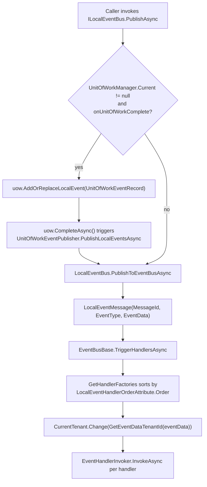

`ILocalEventBus` is the in-process side of ABP's event pipeline. It is a singleton `LocalEventBus` registered by `AbpEventBusModule` that holds a `ConcurrentDictionary<Type, List<IEventHandlerFactory>>` of subscribers, fans out a `PublishAsync` to every matching handler in `LocalEventHandlerOrderAttribute` order, and — when invoked inside a unit of work — defers the publish until the UoW commits so handlers see committed state instead of in-flight transactions.

This page walks the source files under `framework/src/Volo.Abp.EventBus/Volo/Abp/EventBus/Local`, the abstractions in `framework/src/Volo.Abp.EventBus.Abstractions/Volo/Abp/EventBus/Local`, the handler discovery path through `AbpLocalEventBusOptions`, and the differences from the [distributed bus](/events/distributed-event-bus).

## File inventory

The local bus is split across two folders.

| File | Path | Role |
| --- | --- | --- |
| `ILocalEventBus.cs` | `framework/src/Volo.Abp.EventBus.Abstractions/Volo/Abp/EventBus/Local` | Adds `Subscribe<TEvent>(ILocalEventHandler<TEvent>)` on top of `IEventBus`. |
| `ILocalEventHandler.cs` | `framework/src/Volo.Abp.EventBus.Abstractions/Volo/Abp/EventBus/Local` | Single-method `HandleEventAsync(TEvent)` handler interface. |
| `LocalEventHandlerOrderAttribute.cs` | `framework/src/Volo.Abp.EventBus.Abstractions/Volo/Abp/EventBus/Local` | Numeric `Order` used to sort sibling handlers. |
| `LocalEventBus.cs` | `framework/src/Volo.Abp.EventBus/Volo/Abp/EventBus/Local` | Concrete singleton implementation of `ILocalEventBus`. |
| `AbpLocalEventBusOptions.cs` | `framework/src/Volo.Abp.EventBus/Volo/Abp/EventBus/Local` | Holds the `ITypeList<IEventHandler>` discovered by `AbpEventBusModule`. |
| `LocalEventMessage.cs` | `framework/src/Volo.Abp.EventBus/Volo/Abp/EventBus/Local` | Internal envelope (`MessageId`, `EventData`, `EventType`). |
| `NullLocalEventBus.cs` | `framework/src/Volo.Abp.EventBus/Volo/Abp/EventBus/Local` | No-op fallback used in test contexts. |

## Contracts

### `ILocalEventBus`

`ILocalEventBus` is the publish/subscribe surface application code resolves. It inherits every member of `IEventBus` and adds a typed overload that takes a handler instance:

```csharp framework/src/Volo.Abp.EventBus.Abstractions/Volo/Abp/EventBus/Local/ILocalEventBus.cs
public interface ILocalEventBus : IEventBus
{
    IDisposable Subscribe<TEvent>(ILocalEventHandler<TEvent> handler)
        where TEvent : class;
}
```

The returned `IDisposable` is an `EventHandlerFactoryUnregistrar`; disposing it removes the factory from the dictionary entry for that event type.

### `ILocalEventHandler<TEvent>`

A handler is a plain class that implements `ILocalEventHandler<TEvent>` with a single async method. Note the namespace — the file declares `Volo.Abp.EventBus` rather than `Volo.Abp.EventBus.Local` for backward compatibility:

```csharp framework/src/Volo.Abp.EventBus.Abstractions/Volo/Abp/EventBus/Local/ILocalEventHandler.cs
namespace Volo.Abp.EventBus;

public interface ILocalEventHandler<in TEvent> : IEventHandler
{
    Task HandleEventAsync(TEvent eventData);
}
```

A handler is normally registered as `ITransientDependency` (or any DI lifetime); the bus creates a fresh scope through `IocEventHandlerFactory` for each event so transient dependencies behave correctly.

### `LocalEventHandlerOrderAttribute`

Handlers can opt into deterministic ordering by annotating the class with `LocalEventHandlerOrderAttribute`. Lower numbers run first; the default is `0`:

```csharp framework/src/Volo.Abp.EventBus.Abstractions/Volo/Abp/EventBus/Local/LocalEventHandlerOrderAttribute.cs
[AttributeUsage(AttributeTargets.Class, AllowMultiple = false, Inherited = true)]
public class LocalEventHandlerOrderAttribute : Attribute
{
    public int Order { get; set; }

    public LocalEventHandlerOrderAttribute(int order)
    {
        Order = order;
    }
}
```

The bus reads the attribute via `ReflectionHelper.GetAttributesOfMemberOrDeclaringType<LocalEventHandlerOrderAttribute>` and sorts the factory list ascending — see the `GetHandlerFactories` snippet below.

## `LocalEventBus`

`LocalEventBus` is a singleton (`ISingletonDependency`) exposing both `ILocalEventBus` and `LocalEventBus` from the DI container:

```csharp framework/src/Volo.Abp.EventBus/Volo/Abp/EventBus/Local/LocalEventBus.cs
[ExposeServices(typeof(ILocalEventBus), typeof(LocalEventBus))]
public class LocalEventBus : EventBusBase, ILocalEventBus, ISingletonDependency
{
    public ILogger<LocalEventBus> Logger { get; set; }

    protected AbpLocalEventBusOptions Options { get; }
    protected ConcurrentDictionary<Type, List<IEventHandlerFactory>> HandlerFactories { get; }

    public LocalEventBus(
        IOptions<AbpLocalEventBusOptions> options,
        IServiceScopeFactory serviceScopeFactory,
        ICurrentTenant currentTenant,
        IUnitOfWorkManager unitOfWorkManager,
        IEventHandlerInvoker eventHandlerInvoker)
        : base(serviceScopeFactory, currentTenant, unitOfWorkManager, eventHandlerInvoker)
    {
        Options = options.Value;
        Logger = NullLogger<LocalEventBus>.Instance;

        HandlerFactories = new ConcurrentDictionary<Type, List<IEventHandlerFactory>>();
        SubscribeHandlers(Options.Handlers);
    }
}
```

`SubscribeHandlers` (inherited from `EventBusBase`) walks every type in `AbpLocalEventBusOptions.Handlers`, looks at each `IEventHandler`-derived interface, and registers an `IocEventHandlerFactory` against the generic argument — that's how a class implementing `ILocalEventHandler<UserCreatedEto>` becomes a subscriber for `typeof(UserCreatedEto)` with no manual wiring.

### `Subscribe`

`Subscribe(Type, IEventHandlerFactory)` is the single overload all sugar overloads collapse to. It uses `ConcurrentDictionary.GetOrAdd` then a per-list lock to avoid double registration:

```csharp framework/src/Volo.Abp.EventBus/Volo/Abp/EventBus/Local/LocalEventBus.cs
public override IDisposable Subscribe(Type eventType, IEventHandlerFactory factory)
{
    GetOrCreateHandlerFactories(eventType)
        .Locking(factories =>
            {
                if (!factory.IsInFactories(factories))
                {
                    factories.Add(factory);
                }
            }
        );

    return new EventHandlerFactoryUnregistrar(this, eventType, factory);
}
```

The `IDisposable` returned wraps a reverse `Unsubscribe` — disposing it removes the factory.

### Publish

`PublishToEventBusAsync` is the override of `EventBusBase` that fires the handlers. It produces a `LocalEventMessage` envelope and triggers handlers synchronously:

```csharp framework/src/Volo.Abp.EventBus/Volo/Abp/EventBus/Local/LocalEventBus.cs
protected override async Task PublishToEventBusAsync(Type eventType, object eventData)
{
    await PublishAsync(new LocalEventMessage(Guid.NewGuid(), eventData, eventType));
}

public virtual async Task PublishAsync(LocalEventMessage localEventMessage)
{
    await TriggerHandlersAsync(localEventMessage.EventType, localEventMessage.EventData);
}
```

`LocalEventMessage` is just a record-style envelope:

```csharp framework/src/Volo.Abp.EventBus/Volo/Abp/EventBus/Local/LocalEventMessage.cs
public class LocalEventMessage
{
    public Guid MessageId { get; }
    public object EventData { get; }
    public Type EventType { get; }
}
```

### Handler ordering

`GetHandlerFactories` is where `LocalEventHandlerOrderAttribute` is applied. The bus builds tuples of `(factory, eventType, order)`, sorts them ascending and re-wraps each tuple as an `EventTypeWithEventHandlerFactories` so the parent's `TriggerHandlersAsync` loop iterates them in order:

```csharp framework/src/Volo.Abp.EventBus/Volo/Abp/EventBus/Local/LocalEventBus.cs
protected override IEnumerable<EventTypeWithEventHandlerFactories> GetHandlerFactories(Type eventType)
{
    var handlerFactoryList = new List<Tuple<IEventHandlerFactory, Type, int>>();
    foreach (var handlerFactory in HandlerFactories.Where(hf => ShouldTriggerEventForHandler(eventType, hf.Key)))
    {
        foreach (var factory in handlerFactory.Value)
        {
            handlerFactoryList.Add(new Tuple<IEventHandlerFactory, Type, int>(
                factory,
                handlerFactory.Key,
                ReflectionHelper
                    .GetAttributesOfMemberOrDeclaringType<LocalEventHandlerOrderAttribute>(
                        factory.GetHandler().EventHandler.GetType())
                    .FirstOrDefault()?.Order ?? 0));
        }
    }

    return handlerFactoryList
        .OrderBy(x => x.Item3)
        .Select(x => new EventTypeWithEventHandlerFactories(
            x.Item2, new List<IEventHandlerFactory> { x.Item1 }))
        .ToArray();
}
```

Inheritance is honoured too — `ShouldTriggerEventForHandler` returns `true` when `handlerEventType.IsAssignableFrom(targetEventType)`, so a handler for a base event type fires for derived events as well.

## `AbpLocalEventBusOptions`

The options class is tiny — a `TypeList` of handler types:

```csharp framework/src/Volo.Abp.EventBus/Volo/Abp/EventBus/Local/AbpLocalEventBusOptions.cs
public class AbpLocalEventBusOptions
{
    public ITypeList<IEventHandler> Handlers { get; }

    public AbpLocalEventBusOptions()
    {
        Handlers = new TypeList<IEventHandler>();
    }
}
```

It is filled by `AbpEventBusModule.PreConfigureServices` from every DI registration whose implementation type closes `ILocalEventHandler<>`. You rarely interact with `Handlers` directly — adding the handler to DI is enough.

## Unit of work integration

`LocalEventBus.AddToUnitOfWork` enqueues the event on the active UoW so it is published only after `CompleteAsync()` succeeds:

```csharp framework/src/Volo.Abp.EventBus/Volo/Abp/EventBus/Local/LocalEventBus.cs
protected override void AddToUnitOfWork(IUnitOfWork unitOfWork, UnitOfWorkEventRecord eventRecord)
{
    unitOfWork.AddOrReplaceLocalEvent(eventRecord);
}
```

`unitOfWork.AddOrReplaceLocalEvent` merges records keyed by event type — see the [unit-of-work event publisher integration](/uow/event-publisher-integration) page for how `UnitOfWorkEventPublisher` calls `PublishAsync(..., onUnitOfWorkComplete: false)` at commit time. Pass `onUnitOfWorkComplete: false` if you must publish during a transaction (for example for an audit trace), but be aware the handler will then see uncommitted data.

## Publish flow



The same `EventHandlerInvoker` reflection cache (`framework/src/Volo.Abp.EventBus/Volo/Abp/EventBus/EventHandlerInvoker.cs`) drives both buses; it discovers which generic interface (`ILocalEventHandler<T>` or `IDistributedEventHandler<T>`) a class implements and dispatches accordingly.

## Authoring a handler

<Steps>
  <Step title="Declare the event POCO">
    A simple class with public properties; `IMultiTenant` is honoured by the tenant switch.
    ```csharp
    public class OrderPlacedEvent
    {
        public Guid OrderId { get; set; }
        public decimal Total { get; set; }
    }
    ```
  </Step>
  <Step title="Implement ILocalEventHandler">
    Add an `ITransientDependency` so DI discovers it.
    ```csharp
    public class SendOrderConfirmationEmail
        : ILocalEventHandler<OrderPlacedEvent>, ITransientDependency
    {
        public Task HandleEventAsync(OrderPlacedEvent eventData) => Task.CompletedTask;
    }
    ```
  </Step>
  <Step title="Order siblings (optional)">
    Annotate the class with `[LocalEventHandlerOrder(10)]` to run before a default-ordered handler.
    ```csharp
    [LocalEventHandlerOrder(10)]
    public class WarmCache : ILocalEventHandler<OrderPlacedEvent>, ITransientDependency { /* ... */ }
    ```
  </Step>
  <Step title="Publish from anywhere">
    Inject `ILocalEventBus` and call `PublishAsync` — UoW deferral happens automatically.
    ```csharp
    await _localEventBus.PublishAsync(new OrderPlacedEvent { OrderId = id, Total = total });
    ```
  </Step>
</Steps>

## Manual subscribe and unsubscribe

For dynamic scenarios (e.g. test harnesses, scripted modules) `LocalEventBus` exposes every overload of `IEventBus`. A subscription returns an `IDisposable` whose `Dispose()` calls back into `Unsubscribe(eventType, factory)`:

```csharp Manual subscribe
public class TraceListener : IDisposable
{
    private readonly IDisposable _registration;

    public TraceListener(ILocalEventBus bus)
    {
        _registration = bus.Subscribe<OrderPlacedEvent>(e =>
        {
            Console.WriteLine($"Order {e.OrderId} for {e.Total}");
            return Task.CompletedTask;
        });
    }

    public void Dispose() => _registration.Dispose();
}
```

Internally `Subscribe(Func<TEvent, Task>)` wraps the delegate in `ActionEventHandler<TEvent>` and registers it through `SingleInstanceHandlerFactory`; `Unsubscribe(Func<TEvent, Task>)` finds and removes the matching factory by referential equality of the `Func`.

## `NullLocalEventBus`

`NullLocalEventBus` is the no-op fallback registered with `[Dependency(TryRegister = true)]` so a host without `AbpEventBusModule` still resolves `ILocalEventBus`. It is not used in production scenarios — `LocalEventBus` is registered with `ExposeServices(typeof(ILocalEventBus))` and replaces it.

## Exceptions and aggregation

`EventBusBase.TriggerHandlersAsync` collects exceptions into a list. After all handlers run:

- If exactly one handler threw, that exception is rethrown with its original stack.
- If more than one threw, an `AggregateException` with the message `"More than one error has occurred while triggering the event: <type>"` is thrown.

```csharp framework/src/Volo.Abp.EventBus/Volo/Abp/EventBus/EventBusBase.cs
protected void ThrowOriginalExceptions(Type eventType, List<Exception> exceptions)
{
    if (exceptions.Count == 1)
    {
        exceptions[0].ReThrow();
    }

    throw new AggregateException(
        "More than one error has occurred while triggering the event: " + eventType,
        exceptions
    );
}
```

A failing local handler therefore aborts the outer `PublishAsync` and — when published from a UoW — does so during commit, which propagates back into the calling transaction.

## `LocalDistributedEventBus`

When no broker integration is registered, `LocalDistributedEventBus` ships as the default `IDistributedEventBus` implementation. It forwards every call to `ILocalEventBus`, so distributed handlers still run in-process; this is convenient for tests and single-host deployments. The class is registered with `[Dependency(TryRegister = true)]` and is replaced when you install [RabbitMQ](/events/rabbitmq), [Kafka](/events/kafka), [Azure Service Bus](/events/azure-service-bus), [Rebus](/events/rebus-integration) or [Dapr](/events/dapr-pubsub).

## Tips

<Tip>Use `[LocalEventHandlerOrder]` sparingly. Cross-handler ordering becomes a hidden contract — prefer compressing dependent work into a single handler when possible.</Tip>

<Warning>Publishing with `onUnitOfWorkComplete: false` bypasses the UoW deferral. Downstream handlers can then observe data that has not been committed yet — and may be rolled back. Keep this flag for diagnostics only.</Warning>

<Note>Because the local bus is a singleton with `ConcurrentDictionary`, dynamic `Subscribe` / `Unsubscribe` is thread-safe but the inner lists are guarded by a `Locking` helper. Avoid holding handler-side state that depends on subscription order between tests.</Note>

## Related guides

<CardGroup cols={3}>
  <Card title="Event bus overview" href="/events/overview" icon="bolt" />
  <Card title="Distributed event bus" href="/events/distributed-event-bus" icon="network-wired" />
  <Card title="UoW event publisher" href="/uow/event-publisher-integration" icon="rotate" />
</CardGroup>
