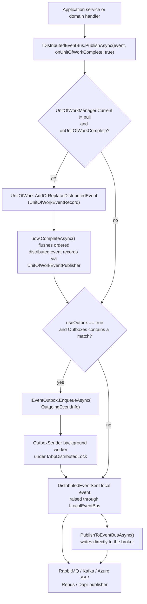

ABP exposes a single event bus abstraction in two flavours: an in-process [`ILocalEventBus`](/events/local-event-bus) that fires handlers inside the same process, and a broker-backed [`IDistributedEventBus`](/events/distributed-event-bus) that publishes through RabbitMQ, Kafka, Azure Service Bus, Rebus or Dapr. Both share the same `IEventBus` contract, the same `EventBusBase` invocation pipeline, the same `EventNameAttribute` naming convention, and the same `IEventHandlerInvoker` reflection cache — only the publish path and subscription mechanism differ.

This page introduces the shared building blocks declared under `framework/src/Volo.Abp.EventBus.Abstractions` and `framework/src/Volo.Abp.EventBus`, then describes how `AbpEventBusModule` wires handlers, registers the outbox/inbox background workers, and routes a `PublishAsync` call through the [unit of work](/uow/overview) before it reaches the local handlers or the broker.

## Module surface

The `Volo.Abp.EventBus.Abstractions` package contains the interfaces and DTOs every other module depends on; the `Volo.Abp.EventBus` package adds the in-process implementation, the outbox/inbox background workers, and the local event bus.

| Package | Path | Purpose |
| --- | --- | --- |
| Volo.Abp.EventBus.Abstractions | `framework/src/Volo.Abp.EventBus.Abstractions` | `IEventBus`, `ILocalEventBus`, `IDistributedEventBus`, handler interfaces, `OutboxConfig`, `InboxConfig`, `OutgoingEventInfo`, `IncomingEventInfo`. |
| Volo.Abp.EventBus | `framework/src/Volo.Abp.EventBus` | `AbpEventBusModule`, `EventBusBase`, `LocalEventBus`, `DistributedEventBusBase`, `OutboxSender`, `InboxProcessor`, `UnitOfWorkEventPublisher`. |
| Volo.Abp.EventBus.RabbitMQ | `framework/src/Volo.Abp.EventBus.RabbitMQ` | [RabbitMQ binding](/events/rabbitmq). |
| Volo.Abp.EventBus.Kafka | `framework/src/Volo.Abp.EventBus.Kafka` | [Kafka binding](/events/kafka). |
| Volo.Abp.EventBus.Azure | `framework/src/Volo.Abp.EventBus.Azure` | [Azure Service Bus binding](/events/azure-service-bus). |
| Volo.Abp.EventBus.Rebus | `framework/src/Volo.Abp.EventBus.Rebus` | [Rebus binding](/events/rebus-integration). |
| Volo.Abp.EventBus.Dapr | `framework/src/Volo.Abp.EventBus.Dapr` | [Dapr pub/sub binding](/events/dapr-pubsub). |

### `AbpEventBusModule`

`AbpEventBusModule` is the integration root. It depends on `AbpEventBusAbstractionsModule`, `AbpMultiTenancyModule`, `AbpJsonModule`, `AbpGuidsModule`, `AbpBackgroundWorkersModule` and `AbpDistributedLockingAbstractionsModule`, scans all registered DI services for `ILocalEventHandler<>` / `IDistributedEventHandler<>` implementations during `PreConfigureServices`, and registers them in the corresponding handler list:

```csharp framework/src/Volo.Abp.EventBus/Volo/Abp/EventBus/AbpEventBusModule.cs
services.OnRegistered(context =>
{
    if (ReflectionHelper.IsAssignableToGenericType(context.ImplementationType, typeof(ILocalEventHandler<>)))
    {
        localHandlers.Add(context.ImplementationType);
    }
    else if (ReflectionHelper.IsAssignableToGenericType(context.ImplementationType, typeof(IDistributedEventHandler<>)))
    {
        distributedHandlers.Add(context.ImplementationType);
    }
});

services.Configure<AbpLocalEventBusOptions>(options =>
{
    options.Handlers.AddIfNotContains(localHandlers);
});

services.Configure<AbpDistributedEventBusOptions>(options =>
{
    options.Handlers.AddIfNotContains(distributedHandlers);
});
```

During `OnApplicationInitializationAsync` the module starts the two background workers that drain the outbox and inbox tables:

```csharp framework/src/Volo.Abp.EventBus/Volo/Abp/EventBus/AbpEventBusModule.cs
await context.AddBackgroundWorkerAsync<OutboxSenderManager>();
await context.AddBackgroundWorkerAsync<InboxProcessManager>();
```

The two managers iterate `AbpDistributedEventBusOptions.Outboxes` / `Inboxes` and spawn one [`OutboxSender`](/events/distributed-event-bus#outboxsender) / [`InboxProcessor`](/events/distributed-event-bus#inboxprocessor) per configuration. See the [background workers guide](/background/background-workers) for the lifecycle they participate in.

## Core contracts

### `IEventBus`

`IEventBus` (`framework/src/Volo.Abp.EventBus.Abstractions/Volo/Abp/EventBus/IEventBus.cs`) is the single interface both local and distributed buses implement. The publishing surface accepts either a typed event or a `Type` + `object` pair, and an `onUnitOfWorkComplete` flag that defers the publish until the active UoW commits:

```csharp framework/src/Volo.Abp.EventBus.Abstractions/Volo/Abp/EventBus/IEventBus.cs
Task PublishAsync<TEvent>(TEvent eventData, bool onUnitOfWorkComplete = true)
    where TEvent : class;

Task PublishAsync(Type eventType, object eventData, bool onUnitOfWorkComplete = true);
```

Subscription is available in five overloads: by `Func<TEvent, Task>`, by `THandler : IEventHandler, new()`, by a single handler instance, by an `IEventHandlerFactory`, and by event `Type` + handler. Each call returns an `IDisposable` whose `Dispose()` unsubscribes — `LocalEventBus` returns an `EventHandlerFactoryUnregistrar`.

### `IEventHandler`, `ILocalEventHandler<>`, `IDistributedEventHandler<>`

`IEventHandler` is an empty marker. Real handlers implement one of the two generic interfaces:

```csharp framework/src/Volo.Abp.EventBus.Abstractions/Volo/Abp/EventBus/Local/ILocalEventHandler.cs
public interface ILocalEventHandler<in TEvent> : IEventHandler
{
    Task HandleEventAsync(TEvent eventData);
}
```

```csharp framework/src/Volo.Abp.EventBus.Abstractions/Volo/Abp/EventBus/Distributed/IDistributedEventHandler.cs
public interface IDistributedEventHandler<in TEvent> : IEventHandler
{
    Task HandleEventAsync(TEvent eventData);
}
```

A single class can implement both interfaces and be triggered twice when the same event is published locally and then arrives back through the broker — the `EventHandlerInvoker` caches both executors per `(handlerType, eventType)` pair:

```csharp framework/src/Volo.Abp.EventBus/Volo/Abp/EventBus/EventHandlerInvoker.cs
if (typeof(ILocalEventHandler<>).MakeGenericType(eventType).IsInstanceOfType(eventHandler))
{
    item.Local = (IEventHandlerMethodExecutor?)Activator.CreateInstance(
        typeof(LocalEventHandlerMethodExecutor<>).MakeGenericType(eventType));
}

if (typeof(IDistributedEventHandler<>).MakeGenericType(eventType).IsInstanceOfType(eventHandler))
{
    item.Distributed = (IEventHandlerMethodExecutor?)Activator.CreateInstance(
        typeof(DistributedEventHandlerMethodExecutor<>).MakeGenericType(eventType));
}
```

### `EventBusBase`

`EventBusBase` (`framework/src/Volo.Abp.EventBus/Volo/Abp/EventBus/EventBusBase.cs`) is the abstract parent of both `LocalEventBus` and `DistributedEventBusBase`. It owns the canonical `PublishAsync` flow, the multi-tenant context switch, and the handler invocation loop. The constructor takes four ambient services every bus needs:

```csharp framework/src/Volo.Abp.EventBus/Volo/Abp/EventBus/EventBusBase.cs
protected EventBusBase(
    IServiceScopeFactory serviceScopeFactory,
    ICurrentTenant currentTenant,
    IUnitOfWorkManager unitOfWorkManager,
    IEventHandlerInvoker eventHandlerInvoker)
```

`PublishAsync` defers to the active unit of work when `onUnitOfWorkComplete` is `true` and a UoW exists, otherwise it calls the bus-specific `PublishToEventBusAsync`:

```csharp framework/src/Volo.Abp.EventBus/Volo/Abp/EventBus/EventBusBase.cs
public virtual async Task PublishAsync(
    Type eventType,
    object eventData,
    bool onUnitOfWorkComplete = true)
{
    if (onUnitOfWorkComplete && UnitOfWorkManager.Current != null)
    {
        AddToUnitOfWork(
            UnitOfWorkManager.Current,
            new UnitOfWorkEventRecord(eventType, eventData, EventOrderGenerator.GetNext())
        );
        return;
    }

    await PublishToEventBusAsync(eventType, eventData);
}
```

`TriggerHandlersAsync` collects exceptions from every handler factory, switches `ICurrentTenant` to the event's tenant (`IMultiTenant` or `IEventDataMayHaveTenantId`), and rethrows the original exception when only one handler failed or an `AggregateException` otherwise.

### `IEventHandlerInvoker`

`IEventHandlerInvoker` is the small reflection cache that bridges the marker `IEventHandler` to a strongly typed `HandleEventAsync`:

```csharp framework/src/Volo.Abp.EventBus.Abstractions/Volo/Abp/EventBus/IEventHandlerInvoker.cs
public interface IEventHandlerInvoker
{
    Task InvokeAsync(IEventHandler eventHandler, object eventData, Type eventType);
}
```

The default `EventHandlerInvoker` is a `ISingletonDependency` keyed by `"{handlerFullName}-{eventFullName}"` and dispatches to the local executor, the distributed executor, or both.

## Event names

Distributed events are identified by string names, not by CLR types. `EventNameAttribute` lets you pin a name that survives renames and refactors:

```csharp framework/src/Volo.Abp.EventBus.Abstractions/Volo/Abp/EventBus/EventNameAttribute.cs
[AttributeUsage(AttributeTargets.Class)]
public class EventNameAttribute : Attribute, IEventNameProvider
{
    public virtual string Name { get; }

    public EventNameAttribute([NotNull] string name)
    {
        Name = Check.NotNullOrWhiteSpace(name, nameof(name));
    }

    public static string GetNameOrDefault([NotNull] Type eventType)
    {
        return (eventType
                    .GetCustomAttributes(true)
                    .OfType<IEventNameProvider>()
                    .FirstOrDefault()
                    ?.GetName(eventType)
                ?? eventType.FullName)!;
    }
}
```

When the attribute is absent, the event name defaults to the CLR `FullName`. `GenericEventNameAttribute` produces composite names for generic ETOs such as `EntityCreatedEto<UserEto>`. Every distributed bus uses `EventNameAttribute.GetNameOrDefault(eventType)` for the routing key, topic key, subject, or Dapr topic.

The shared constant `EventBusConsts.CorrelationIdHeaderName = "X-Correlation-Id"` propagates correlation through `OutgoingEventInfo.SetCorrelationId` and is read back on the consumer side.

## Outbox and inbox configuration

`OutboxConfig` and `InboxConfig` are the per-database descriptors stored in `AbpDistributedEventBusOptions`. They wire an `IEventOutbox` / `IEventInbox` implementation (typically backed by EF Core) to a logical database name and an optional event selector:

```csharp framework/src/Volo.Abp.EventBus.Abstractions/Volo/Abp/EventBus/Distributed/OutboxConfig.cs
public class OutboxConfig
{
    public string Name { get; }
    public string DatabaseName { get; set; }
    public Type ImplementationType { get; set; }
    public Func<Type, bool>? Selector { get; set; }
    public bool IsSendingEnabled { get; set; } = true;
}
```

```csharp framework/src/Volo.Abp.EventBus.Abstractions/Volo/Abp/EventBus/Distributed/InboxConfig.cs
public class InboxConfig
{
    public string Name { get; }
    public string DatabaseName { get; set; }
    public Type ImplementationType { get; set; }
    public Func<Type, bool>? EventSelector { get; set; }
    public Func<Type, bool>? HandlerSelector { get; set; }
    public bool IsProcessingEnabled { get; set; } = true;
}
```

Both are stored in `Dictionary<string, OutboxConfig>` / `Dictionary<string, InboxConfig>` subclasses with a `Configure(name, action)` helper that defaults to the key `"Default"`. The distributed event bus iterates them in order — selectors that are `null` sort last, so a "catch-all" outbox can sit behind selective ones.

The detailed contract of the outbox/inbox tables (`OutgoingEventInfo`, `IncomingEventInfo`, `IEventOutbox`, `IEventInbox`) is documented on the [distributed event bus page](/events/distributed-event-bus).

## Publish path

The flowchart below traces a `PublishAsync(MyEto)` from caller to broker. The same diagram applies to every distributed bus — only the final hop differs.



The same hop into the unit of work is shared with the local bus — the only difference is that `LocalEventBus.AddToUnitOfWork` calls `unitOfWork.AddOrReplaceLocalEvent` instead. The publisher implementation that walks both queues at commit time is `UnitOfWorkEventPublisher`:

```csharp framework/src/Volo.Abp.EventBus/Volo/Abp/EventBus/UnitOfWorkEventPublisher.cs
public async Task PublishDistributedEventsAsync(IEnumerable<UnitOfWorkEventRecord> distributedEvents)
{
    foreach (var distributedEvent in distributedEvents)
    {
        await _distributedEventBus.PublishAsync(
            distributedEvent.EventType,
            distributedEvent.EventData,
            onUnitOfWorkComplete: false,
            useOutbox: distributedEvent.UseOutbox
        );
    }
}
```

See the [unit-of-work event publisher integration](/uow/event-publisher-integration) page for the ordering rules between local events, distributed events and `OnCompleted` callbacks.

## Multi-tenancy

`EventBusBase.GetEventDataTenantId` picks the tenant id under which the handler will run:

```csharp framework/src/Volo.Abp.EventBus/Volo/Abp/EventBus/EventBusBase.cs
return eventData switch
{
    IMultiTenant multiTenantEventData => multiTenantEventData.TenantId,
    IEventDataMayHaveTenantId eventDataMayHaveTenantId
        when eventDataMayHaveTenantId.IsMultiTenant(out var tenantId) => tenantId,
    _ => CurrentTenant.Id
};
```

If the event implements `IMultiTenant` the handler executes inside `CurrentTenant.Change(tenantId)`. The same rule applies to inbox replay — the bus reads `TenantId` from the deserialized payload rather than the consumer's current scope.

## What ships out of the box

<CardGroup cols={2}>
  <Card title="LocalEventBus" icon="bolt" href="/events/local-event-bus">
    In-process singleton fanout with `LocalEventHandlerOrderAttribute` ordering, handler subscription via DI scan, and UoW integration.
  </Card>
  <Card title="DistributedEventBusBase" icon="network-wired" href="/events/distributed-event-bus">
    Shared outbox/inbox plumbing, `useOutbox` flag, `ISupportsEventBoxes` extension, batched publish.
  </Card>
  <Card title="RabbitMQ" icon="rabbit" href="/events/rabbitmq">
    `RabbitMqDistributedEventBus` over `ConnectionPool` / `ChannelPool` with topic exchange routing.
  </Card>
  <Card title="Kafka" icon="server" href="/events/kafka">
    `KafkaDistributedEventBus` with `ProducerPool` / `ConsumerPool` and `Confluent.Kafka` configuration.
  </Card>
  <Card title="Azure Service Bus" icon="cloud" href="/events/azure-service-bus">
    `AzureDistributedEventBus` over topics and subscriptions with batched outbox publishes.
  </Card>
  <Card title="Rebus" icon="boxes-stacked" href="/events/rebus-integration">
    `RebusDistributedEventBus` reusing Rebus transports (in-memory, MSMQ, Postgres, etc.).
  </Card>
  <Card title="Dapr pub/sub" icon="cube" href="/events/dapr-pubsub">
    `DaprDistributedEventBus` plus the MVC callback endpoint shipped in `Volo.Abp.AspNetCore.Mvc.Dapr.EventBus`.
  </Card>
  <Card title="Unit of work" icon="rotate" href="/uow/event-publisher-integration">
    `UnitOfWorkEventPublisher` flushes ordered local + distributed events when the UoW commits.
  </Card>
</CardGroup>

## Authoring an event

A distributed event is a plain POCO with an optional `[EventName]`. Adding `IMultiTenant` propagates tenant context across services:

```csharp Example event (consumer-side declaration mirrors producer)
[EventName("identity.user.created")]
public class UserCreatedEto : IMultiTenant
{
    public Guid Id { get; set; }
    public Guid? TenantId { get; set; }
    public string UserName { get; set; } = default!;
}
```

A handler picks its bus by interface — local, distributed, or both:

```csharp Handler examples
public class UserCreatedLocalHandler
    : ILocalEventHandler<UserCreatedEto>, ITransientDependency
{
    public Task HandleEventAsync(UserCreatedEto eventData) => Task.CompletedTask;
}

public class UserCreatedDistributedHandler
    : IDistributedEventHandler<UserCreatedEto>, ITransientDependency
{
    public Task HandleEventAsync(UserCreatedEto eventData) => Task.CompletedTask;
}
```

`AbpEventBusModule` discovers these during DI registration; no manual `Subscribe` call is required.

## Where the local and distributed paths diverge

<Steps>
  <Step title="Same `IEventBus` surface">
    Both buses share `IEventBus`, `EventBusBase`, the UoW deferral, and the `IEventHandlerInvoker` reflection cache.
  </Step>
  <Step title="Local bus is in-process and singleton">
    `LocalEventBus` is `ISingletonDependency`, dispatches synchronously to handlers ordered by `LocalEventHandlerOrderAttribute`, and never touches the network. See [Local event bus](/events/local-event-bus).
  </Step>
  <Step title="Distributed bus owns outbox/inbox">
    `DistributedEventBusBase` adds the `useOutbox` overload, the `ISupportsEventBoxes` extension, and the `OutgoingEventInfo` / `IncomingEventInfo` records consumed by `OutboxSender` / `InboxProcessor`. See [Distributed event bus](/events/distributed-event-bus).
  </Step>
  <Step title="Brokers replace `PublishToEventBusAsync`">
    Each broker package (`RabbitMqDistributedEventBus`, `KafkaDistributedEventBus`, `AzureDistributedEventBus`, `RebusDistributedEventBus`, `DaprDistributedEventBus`) replaces `IDistributedEventBus` via `[Dependency(ReplaceServices = true)]` and only overrides the transport-specific publish/consume methods.
  </Step>
</Steps>

## Related guides

<CardGroup cols={3}>
  <Card title="UoW overview" href="/uow/overview" icon="rotate" />
  <Card title="UoW event publisher" href="/uow/event-publisher-integration" icon="rotate" />
  <Card title="Background workers" href="/background/background-workers" icon="gear" />
</CardGroup>
