The RabbitMQ binding is delivered by two packages working together: `Volo.Abp.RabbitMQ` provides the connection pool, channel pool, and consumer factory; `Volo.Abp.EventBus.RabbitMQ` builds `RabbitMqDistributedEventBus` on top of them and registers it with `[Dependency(ReplaceServices = true)]` so it replaces the default [`LocalDistributedEventBus`](/events/distributed-event-bus#localdistributedeventbus). Together they implement the [outbox/inbox pattern](/events/distributed-event-bus) over a single durable AMQP exchange whose routing keys are the event names produced by `EventNameAttribute.GetNameOrDefault`.

This page walks the source under `framework/src/Volo.Abp.EventBus.RabbitMQ` and `framework/src/Volo.Abp.RabbitMQ`, explains the configuration sections the modules read at startup, and traces a publish through `IConnectionPool` and `IChannelPool` to the broker.

## File inventory

| Package | File | Path | Role |
| --- | --- | --- | --- |
| EventBus.RabbitMQ | `AbpEventBusRabbitMqModule.cs` | `framework/src/Volo.Abp.EventBus.RabbitMQ/Volo/Abp/EventBus/RabbitMq` | Wires options from `RabbitMQ:EventBus` config and calls `RabbitMqDistributedEventBus.Initialize()`. |
| EventBus.RabbitMQ | `AbpRabbitMqEventBusOptions.cs` | same | Per-bus options (exchange name, exchange type, client name, prefetch). |
| EventBus.RabbitMQ | `RabbitMqDistributedEventBus.cs` | same | `DistributedEventBusBase` subclass overriding `PublishToEventBusAsync`, `PublishFromOutboxAsync`, `ProcessFromInboxAsync`. |
| RabbitMQ | `AbpRabbitMqModule.cs` | `framework/src/Volo.Abp.RabbitMQ/Volo/Abp/RabbitMQ` | Binds `AbpRabbitMqOptions` from `RabbitMQ` configuration; disposes pools on shutdown. |
| RabbitMQ | `AbpRabbitMqOptions.cs` | same | Connection map (`RabbitMqConnections`). |
| RabbitMQ | `RabbitMqConnections.cs` | same | `Dictionary<string, ConnectionFactory>` keyed by connection name. |
| RabbitMQ | `ConnectionPool.cs` | same | Lazy `IConnection` cache per connection name. |
| RabbitMQ | `ChannelPool.cs` | same | Reusable `IModel` pool with `IChannelAccessor`. |
| RabbitMQ | `RabbitMqMessageConsumer.cs` / `…Factory.cs` | same | Subscribed channel + queue binding manager. |
| RabbitMQ | `ExchangeDeclareConfiguration.cs` / `QueueDeclareConfiguration.cs` | same | Strongly-typed AMQP declarations. |
| RabbitMQ | `Utf8JsonRabbitMqSerializer.cs` | same | Default JSON serializer used by `RabbitMqDistributedEventBus`. |
| RabbitMQ | `RabbitMqConsts.cs` | same | `ExchangeTypes` (`direct`, `topic`, `fanout`, `headers`) and `DeliveryModes`. |

## `AbpEventBusRabbitMqModule`

The module depends on `AbpEventBusModule` and `AbpRabbitMqModule`, binds its options from `RabbitMQ:EventBus`, and calls `Initialize()` on the bus during application init:

```csharp framework/src/Volo.Abp.EventBus.RabbitMQ/Volo/Abp/EventBus/RabbitMq/AbpEventBusRabbitMqModule.cs
[DependsOn(
    typeof(AbpEventBusModule),
    typeof(AbpRabbitMqModule))]
public class AbpEventBusRabbitMqModule : AbpModule
{
    public override void ConfigureServices(ServiceConfigurationContext context)
    {
        var configuration = context.Services.GetConfiguration();

        Configure<AbpRabbitMqEventBusOptions>(configuration.GetSection("RabbitMQ:EventBus"));
    }

    public override void OnApplicationInitialization(ApplicationInitializationContext context)
    {
        context
            .ServiceProvider
            .GetRequiredService<RabbitMqDistributedEventBus>()
            .Initialize();
    }
}
```

`Initialize()` creates the consumer, binds the configured queue to the exchange, hooks `ProcessEventAsync` as the message callback, and subscribes the discovered handlers — see [`SubscribeHandlers`](/events/overview#core-contracts).

## Options

### `AbpRabbitMqEventBusOptions`

This is the per-bus configuration block:

```csharp framework/src/Volo.Abp.EventBus.RabbitMQ/Volo/Abp/EventBus/RabbitMq/AbpRabbitMqEventBusOptions.cs
public class AbpRabbitMqEventBusOptions
{
    public const string DefaultExchangeType = RabbitMqConsts.ExchangeTypes.Direct;

    public string? ConnectionName { get; set; }
    public string ClientName { get; set; } = default!;
    public string ExchangeName { get; set; } = default!;
    public string? ExchangeType { get; set; }
    public ushort? PrefetchCount { get; set; }

    public string GetExchangeTypeOrDefault()
    {
        return string.IsNullOrEmpty(ExchangeType)
            ? DefaultExchangeType
            : ExchangeType!;
    }
}
```

- `ConnectionName` — picks one of the connections registered in `AbpRabbitMqOptions.Connections`. When `null`, the `"Default"` connection is used.
- `ClientName` — the **queue name** that this service consumes from. Each microservice usually has its own queue per shared exchange.
- `ExchangeName` — the AMQP exchange that all distributed events flow through.
- `ExchangeType` — `direct` (default), `topic`, `fanout`, or `headers`. The constants live in `RabbitMqConsts.ExchangeTypes`.
- `PrefetchCount` — QoS prefetch passed to the consumer.

A typical `appsettings.json` shape:

```json appsettings.json
{
  "RabbitMQ": {
    "Connections": {
      "Default": {
        "HostName": "rabbitmq.local",
        "UserName": "guest",
        "Password": "guest"
      }
    },
    "EventBus": {
      "ClientName": "orders-service",
      "ExchangeName": "abp-events",
      "ExchangeType": "direct",
      "PrefetchCount": 10
    }
  }
}
```

### `AbpRabbitMqOptions` and `RabbitMqConnections`

The infrastructure module binds the `RabbitMQ` section to a `ConnectionFactory` dictionary:

```csharp framework/src/Volo.Abp.RabbitMQ/Volo/Abp/RabbitMQ/AbpRabbitMqOptions.cs
public class AbpRabbitMqOptions
{
    public RabbitMqConnections Connections { get; }
}
```

```csharp framework/src/Volo.Abp.RabbitMQ/Volo/Abp/RabbitMQ/RabbitMqConnections.cs
public class RabbitMqConnections : Dictionary<string, ConnectionFactory>
{
    public const string DefaultConnectionName = "Default";

    public ConnectionFactory Default {
        get => this[DefaultConnectionName];
        set => this[DefaultConnectionName] = Check.NotNull(value, nameof(value));
    }

    public ConnectionFactory GetOrDefault(string connectionName)
    {
        if (TryGetValue(connectionName, out var connectionFactory))
        {
            return connectionFactory;
        }
        return Default;
    }
}
```

`AbpRabbitMqModule.ConfigureServices` also forces `DispatchConsumersAsync = true` on every registered `ConnectionFactory` so the consumer pipeline can use async callbacks:

```csharp framework/src/Volo.Abp.RabbitMQ/Volo/Abp/RabbitMQ/AbpRabbitMqModule.cs
Configure<AbpRabbitMqOptions>(options =>
{
    foreach (var connectionFactory in options.Connections.Values)
    {
        connectionFactory.DispatchConsumersAsync = true;
    }
});
```

## Connection and channel pools

### `ConnectionPool`

`ConnectionPool` is a `ISingletonDependency` that lazily creates an `IConnection` per connection name. Cluster hostnames separated by `;` go through the `CreateConnection(hostnames)` overload so failover works out of the box:

```csharp framework/src/Volo.Abp.RabbitMQ/Volo/Abp/RabbitMQ/ConnectionPool.cs
public virtual IConnection Get(string? connectionName = null)
{
    connectionName ??= RabbitMqConnections.DefaultConnectionName;

    var lazyConnection = Connections.GetOrAdd(
        connectionName, () => new Lazy<IConnection>(() =>
        {
            var connection = Options.Connections.GetOrDefault(connectionName);
            var hostnames = connection.HostName.TrimEnd(';').Split(';');
            return hostnames.Length == 1
                ? connection.CreateConnection()
                : connection.CreateConnection(hostnames);
        })
    );

    return lazyConnection.Value;
}
```

`AbpRabbitMqModule.OnApplicationShutdown` disposes the pool, closing all connections in order.

### `ChannelPool`

`ChannelPool` wraps `IModel` reuse. Each `Acquire` returns an `IChannelAccessor` whose `Dispose` releases the channel back to the pool — internally guarded by a `Monitor.Wait` loop so two callers can't share a channel simultaneously:

```csharp framework/src/Volo.Abp.RabbitMQ/Volo/Abp/RabbitMQ/ChannelPool.cs
public virtual IChannelAccessor Acquire(string? channelName = null, string? connectionName = null)
{
    CheckDisposed();
    channelName = channelName ?? "";

    var poolItem = Channels.GetOrAdd(
        channelName,
        _ => new ChannelPoolItem(CreateChannel(channelName, connectionName))
    );

    poolItem.Acquire();
    return new ChannelAccessor(poolItem.Channel, channelName, () => poolItem.Release());
}
```

`RabbitMqDistributedEventBus` itself does **not** call `ChannelPool.Acquire` — it opens an ad-hoc model with `ConnectionPool.Get(...).CreateModel()` per publish, and lets the event bus consumer manage its own long-lived channel. The channel pool is exposed for other modules (background jobs, distributed locks) that share the same RabbitMQ infrastructure.

## `RabbitMqDistributedEventBus`

The bus inherits `DistributedEventBusBase` and is registered with `[Dependency(ReplaceServices = true)]` so it replaces every other `IDistributedEventBus`:

```csharp framework/src/Volo.Abp.EventBus.RabbitMQ/Volo/Abp/EventBus/RabbitMq/RabbitMqDistributedEventBus.cs
[Dependency(ReplaceServices = true)]
[ExposeServices(typeof(IDistributedEventBus), typeof(RabbitMqDistributedEventBus))]
public class RabbitMqDistributedEventBus : DistributedEventBusBase, ISingletonDependency
```

It owns:

- `AbpRabbitMqEventBusOptions Options` — the configured exchange + client name.
- `IConnectionPool ConnectionPool` — used to open ad-hoc `IModel` channels.
- `IRabbitMqSerializer Serializer` — JSON serializer by default.
- `IRabbitMqMessageConsumerFactory MessageConsumerFactory` — creates the long-lived consumer in `Initialize()`.
- `ConcurrentDictionary<Type, List<IEventHandlerFactory>> HandlerFactories` — handler routing table.
- `ConcurrentDictionary<string, Type> EventTypes` — routing key → CLR type map.

### `Initialize`

`Initialize` builds the exchange + queue declaration, attaches `ProcessEventAsync`, and registers all discovered handlers:

```csharp framework/src/Volo.Abp.EventBus.RabbitMQ/Volo/Abp/EventBus/RabbitMq/RabbitMqDistributedEventBus.cs
public void Initialize()
{
    Consumer = MessageConsumerFactory.Create(
        new ExchangeDeclareConfiguration(
            AbpRabbitMqEventBusOptions.ExchangeName,
            type: AbpRabbitMqEventBusOptions.GetExchangeTypeOrDefault(),
            durable: true
        ),
        new QueueDeclareConfiguration(
            AbpRabbitMqEventBusOptions.ClientName,
            durable: true,
            exclusive: false,
            autoDelete: false,
            prefetchCount: AbpRabbitMqEventBusOptions.PrefetchCount
        ),
        AbpRabbitMqEventBusOptions.ConnectionName
    );

    Consumer.OnMessageReceived(ProcessEventAsync);

    SubscribeHandlers(AbpDistributedEventBusOptions.Handlers);
}
```

A `Subscribe(Type, IEventHandlerFactory)` for an event type with no factories yet additionally binds the queue with `EventNameAttribute.GetNameOrDefault(eventType)` as routing key — see the `if (handlerFactories.Count == 1)` block in the source.

### Publish path

`PublishToEventBusAsync` is the override called when there is no outbox match (or when `useOutbox: false`). It computes the event name, serialises the payload, and writes via `ConnectionPool.Get(...).CreateModel()`:

```csharp framework/src/Volo.Abp.EventBus.RabbitMQ/Volo/Abp/EventBus/RabbitMq/RabbitMqDistributedEventBus.cs
protected async override Task PublishToEventBusAsync(Type eventType, object eventData)
{
    await PublishAsync(eventType, eventData, correlationId: CorrelationIdProvider.Get());
}

protected virtual Task PublishAsync(
    IModel channel,
    string eventName,
    byte[] body,
    Dictionary<string, object>? headersArguments = null,
    Guid? eventId = null,
    string? correlationId = null)
{
    EnsureExchangeExists(channel);

    var properties = channel.CreateBasicProperties();
    properties.DeliveryMode = RabbitMqConsts.DeliveryModes.Persistent;

    if (properties.MessageId.IsNullOrEmpty())
    {
        properties.MessageId = (eventId ?? GuidGenerator.Create()).ToString("N");
    }

    if (correlationId != null)
    {
        properties.CorrelationId = correlationId;
    }

    SetEventMessageHeaders(properties, headersArguments);

    channel.BasicPublish(
        exchange: AbpRabbitMqEventBusOptions.ExchangeName,
        routingKey: eventName,
        mandatory: true,
        basicProperties: properties,
        body: body
    );

    return Task.CompletedTask;
}
```

`EnsureExchangeExists` first probes with `ExchangeDeclarePassive` and, if that throws, calls `ExchangeDeclare` with `durable: true`. The result is cached in a `_exchangeCreated` flag so the probe runs only once per process.

### Outbox batching

`PublishManyFromOutboxAsync` opens a single channel, calls `ConfirmSelect()` (publisher confirms), publishes each event in sequence, and waits for confirms at the end:

```csharp framework/src/Volo.Abp.EventBus.RabbitMQ/Volo/Abp/EventBus/RabbitMq/RabbitMqDistributedEventBus.cs
public async override Task PublishManyFromOutboxAsync(
    IEnumerable<OutgoingEventInfo> outgoingEvents,
    OutboxConfig outboxConfig)
{
    using (var channel = ConnectionPool.Get(AbpRabbitMqEventBusOptions.ConnectionName).CreateModel())
    {
        var outgoingEventArray = outgoingEvents.ToArray();
        channel.ConfirmSelect();

        foreach (var outgoingEvent in outgoingEventArray)
        {
            using (CorrelationIdProvider.Change(outgoingEvent.GetCorrelationId()))
            {
                await TriggerDistributedEventSentAsync(new DistributedEventSent()
                {
                    Source = DistributedEventSource.Outbox,
                    EventName = outgoingEvent.EventName,
                    EventData = outgoingEvent.EventData
                });
            }

            await PublishAsync(
                channel,
                outgoingEvent.EventName,
                outgoingEvent.EventData,
                eventId: outgoingEvent.Id,
                correlationId: outgoingEvent.GetCorrelationId());
        }

        channel.WaitForConfirmsOrDie();
    }
}
```

Publisher confirms (`ConfirmSelect` + `WaitForConfirmsOrDie`) are critical: they're how `OutboxSender` knows the row can be deleted safely. If the broker fails to acknowledge any message, `WaitForConfirmsOrDie` throws and the entire batch stays in the outbox for the next cycle.

### Consume path

`ProcessEventAsync` is the consumer callback. It looks up the CLR type from `EventTypes` by routing key, deserialises the body, and either persists into the inbox or invokes handlers directly:

```csharp framework/src/Volo.Abp.EventBus.RabbitMQ/Volo/Abp/EventBus/RabbitMq/RabbitMqDistributedEventBus.cs
private async Task ProcessEventAsync(IModel channel, BasicDeliverEventArgs ea)
{
    var eventName = ea.RoutingKey;
    var eventType = EventTypes.GetOrDefault(eventName);
    if (eventType == null) return;

    var eventData = Serializer.Deserialize(ea.Body.ToArray(), eventType);

    var correlationId = ea.BasicProperties.CorrelationId;
    if (await AddToInboxAsync(ea.BasicProperties.MessageId, eventName, eventType, eventData, correlationId))
    {
        return;
    }

    using (CorrelationIdProvider.Change(correlationId))
    {
        await TriggerHandlersDirectAsync(eventType, eventData);
    }
}
```

`AddToInboxAsync` (defined on `DistributedEventBusBase`) is what makes the consumer idempotent — if any configured inbox has a row with the same `MessageId`, the message is silently dropped.

## Publish/consume flow

```mermaid
flowchart LR
    subgraph Producer["Producer process"]
        Publish["IDistributedEventBus.PublishAsync"]
        Decide{"useOutbox &&<br/>Outbox matches?"}
        Outbox["IEventOutbox.EnqueueAsync"]
        Worker["OutboxSender (AbpOutbox_{db} lock)"]
        Batch["PublishManyFromOutboxAsync<br/>channel.ConfirmSelect()<br/>WaitForConfirmsOrDie"]
        Direct["PublishToEventBusAsync<br/>(channel.BasicPublish)"]
    end

    Exchange[("AMQP exchange<br/>(ExchangeName)")]
    Queue[("Queue ClientName,<br/>durable + bound by routing key")]

    subgraph Consumer["Consumer process"]
        Recv["RabbitMqMessageConsumer<br/>ProcessEventAsync(channel, ea)"]
        Inbox{"AddToInboxAsync?"}
        Persist["IEventInbox.EnqueueAsync<br/>(IncomingEventInfo)"]
        Processor["InboxProcessor (AbpInbox_{db} lock)"]
        Handlers["TriggerHandlersFromInboxAsync<br/>→ DistributedEventReceived (Inbox)"]
        Skip["TriggerHandlersDirectAsync<br/>→ DistributedEventReceived (Direct)"]
    end

    Publish --> Decide
    Decide -- yes --> Outbox --> Worker --> Batch --> Exchange
    Decide -- no --> Direct --> Exchange
    Exchange -- routingKey == eventName --> Queue --> Recv --> Inbox
    Inbox -- match --> Persist --> Processor --> Handlers
    Inbox -- no inbox --> Skip
```



The routing key on every outgoing message is `EventNameAttribute.GetNameOrDefault(eventType)`. A single durable exchange + per-service queue is the recommended topology: every service binds the queue named after `ClientName` to the events it actually subscribes to.

## Serialization

`Utf8JsonRabbitMqSerializer` is the default `IRabbitMqSerializer` and uses `System.Text.Json` with ABP's default policies. Replace it via DI to switch to another format:

```csharp Custom serializer
context.Services.Replace(
    ServiceDescriptor.Singleton<IRabbitMqSerializer, MyCustomSerializer>());
```

`DistributedEventBusBase.Serialize` simply delegates to the serializer.

## Cluster topology

`ConnectionFactory.HostName` accepts a semicolon-separated list (e.g. `"node1;node2;node3"`). `ConnectionPool.Get` splits on `;` and calls the cluster overload of `CreateConnection(IList<string>)`. Combine with `ConnectionFactory.AutomaticRecoveryEnabled = true` (the default in modern client builds) for resilient publishes.

For multiple connection strings — for example to isolate publishes from consumers — register named connections:

```csharp Multiple connections
Configure<AbpRabbitMqOptions>(options =>
{
    options.Connections.Default.HostName = "primary";
    options.Connections["events"] = new ConnectionFactory { HostName = "events-cluster" };
});

Configure<AbpRabbitMqEventBusOptions>(options =>
{
    options.ConnectionName = "events";
    options.ClientName = "orders-service";
    options.ExchangeName = "abp-events";
});
```

## Subscribe / unsubscribe

`Subscribe(Type, IEventHandlerFactory)` adds the factory to `HandlerFactories[eventType]` and calls `Consumer.BindAsync(eventName)` the first time a handler appears — that's the moment the queue is bound to the exchange with this routing key. `Unsubscribe(...)` removes the factory but the source notes that AMQP unbinding is **not** performed:

```csharp framework/src/Volo.Abp.EventBus.RabbitMQ/Volo/Abp/EventBus/RabbitMq/RabbitMqDistributedEventBus.cs
/* TODO: How to handle unsubscribe to unbind on RabbitMq (may not be possible for) */
```

If you must stop receiving a topic at runtime, delete the queue binding through the RabbitMQ management API.

## Tips

<Tip>Set a unique `ClientName` per microservice — that becomes the queue name. Sharing it across services means messages are load-balanced across them, which is rarely what an event-driven design wants.</Tip>

<Warning>The outbox is mandatory for "exactly-once" delivery: `WaitForConfirmsOrDie` confirms the broker accepted the message, but only the outbox guarantees you don't lose events between your DB transaction and the AMQP socket.</Warning>

<Note>`ExchangeType = "topic"` enables wildcard routing keys at the cost of higher broker CPU. Stick with `direct` unless you need pattern matching, because ABP uses the literal event name as the key.</Note>

<Tip>The shared `IConnectionPool` and `IChannelPool` are reused by other ABP packages such as `Volo.Abp.BackgroundJobs.RabbitMQ`. Tuning `AbpRabbitMqOptions.Connections.Default` benefits all of them.</Tip>

## Related guides

<CardGroup cols={3}>
  <Card title="Distributed bus" href="/events/distributed-event-bus" icon="network-wired" />
  <Card title="Event bus overview" href="/events/overview" icon="bolt" />
  <Card title="Background workers" href="/background/background-workers" icon="gear" />
  <Card title="UoW event publisher" href="/uow/event-publisher-integration" icon="rotate" />
  <Card title="Kafka binding" href="/events/kafka" icon="server" />
  <Card title="Azure Service Bus" href="/events/azure-service-bus" icon="cloud" />
</CardGroup>
