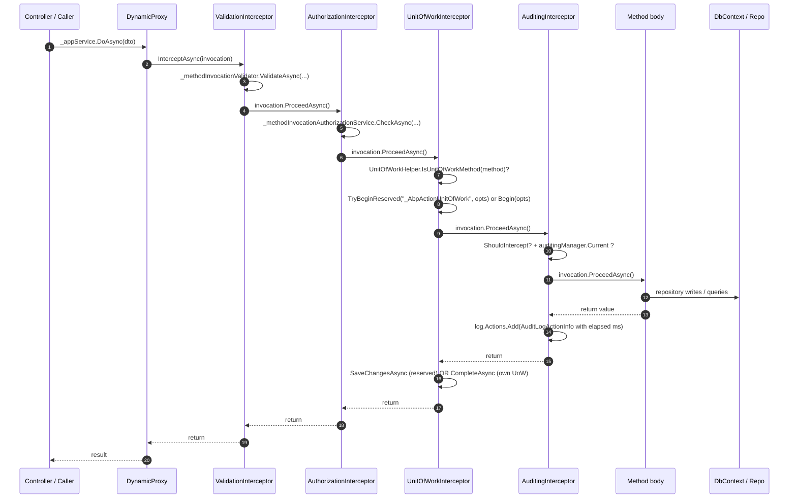

When a controller, a hosted job, or another service calls an `ApplicationService` method, the call does not jump directly into the method body. It first walks an interception chain of four async-aware Castle DynamicProxy interceptors — `ValidationInterceptor`, `AuthorizationInterceptor`, `UnitOfWorkInterceptor`, and `AuditingInterceptor` — each of which was attached by an `IOnServiceRegistredContext` callback registered by its owning module at startup. Every interceptor inspects the invocation, decides whether the cross-cutting concern applies, calls `invocation.ProceedAsync()` to delegate to the next interceptor (or the real method body), then post-processes the result.

This page traces a single invocation of an `IApplicationService` method from the caller's `_appService.DoSomethingAsync(...)` call site through the four interceptors into the method body and back. It pins down which interceptor wraps which, what each one checks before short-circuiting, and how the `IAvoidDuplicateCrossCuttingConcerns` and `AbpCrossCuttingConcerns.Applying` markers prevent double-running in the common case where the call originates from an [MVC action filter](/flows/request-lifecycle-mvc).

## Source map

| File | Role |
| ---- | ---- |
| `framework/src/Volo.Abp.Ddd.Application/Volo/Abp/Application/Services/ApplicationService.cs` | Base class that flags `IApplicationService`, `IValidationEnabled`, `IUnitOfWorkEnabled`, `IAuditingEnabled`, `IAvoidDuplicateCrossCuttingConcerns`. |
| `framework/src/Volo.Abp.Ddd.Application/Volo/Abp/Application/AbpDddApplicationModule.cs` | DependsOn graph for the four cross-cutting modules. |
| `framework/src/Volo.Abp.Validation/Volo/Abp/Validation/ValidationInterceptor.cs` | Calls `IMethodInvocationValidator` before `ProceedAsync`. |
| `framework/src/Volo.Abp.Validation/Volo/Abp/Validation/ValidationInterceptorRegistrar.cs` | Attaches the interceptor to any `IValidationEnabled` implementation. |
| `framework/src/Volo.Abp.Authorization/Volo/Abp/Authorization/AuthorizationInterceptor.cs` | Calls `IMethodInvocationAuthorizationService` before `ProceedAsync`. |
| `framework/src/Volo.Abp.Authorization/Volo/Abp/Authorization/AuthorizationInterceptorRegistrar.cs` | Attaches when the implementation type (or any method) has `[Authorize]`. |
| `framework/src/Volo.Abp.Uow/Volo/Abp/Uow/UnitOfWorkInterceptor.cs` | Begins or claims a UoW for the duration of the call. |
| `framework/src/Volo.Abp.Uow/Volo/Abp/Uow/UnitOfWorkInterceptorRegistrar.cs` | Attaches to any `IUnitOfWorkEnabled` type or any type with `[UnitOfWork]`. |
| `framework/src/Volo.Abp.Auditing/Volo/Abp/Auditing/AuditingInterceptor.cs` | Adds an `AuditLogActionInfo` to the audit scope and times the call. |
| `framework/src/Volo.Abp.Auditing/Volo/Abp/Auditing/AuditingInterceptorRegistrar.cs` | Attaches based on `[Audited]`, `IAuditingEnabled`, or the default rule. |
| `framework/src/Volo.Abp.Core/Volo/Abp/DependencyInjection/OnServiceRegistredContext.cs` | The shared registration callback that each registrar uses to add itself. |
| `framework/src/Volo.Abp.Core/Volo/Abp/DynamicProxy/AbpInterceptor.cs` | Async-first base interceptor type. |
| `framework/src/Volo.Abp.Castle.Core/Volo/Abp/Castle/DynamicProxy/AbpAsyncDeterminationInterceptor.cs` | The Castle adapter that drives `ProceedAsync`. |

## The flow at a glance



The outer interceptor (Validation) is the **first** to run on the way in and the **last** to return on the way out, mirroring the MVC action-filter chain in [Request lifecycle (MVC)](/flows/request-lifecycle-mvc).

## Stage 1 — How the proxy gets attached

`ApplicationService` is a transient DI service. When `AbpApplicationBase.ConfigureServices` calls `services.AddAssembly(...)` on each module's assemblies (see [Application startup, stage 4](/flows/application-startup#stage-4---configureservices-pre-configure-post)), every class that ABP's conventional registrar discovers triggers an `OnServiceRegistred` callback. Four modules subscribe to that callback:

```csharp title="framework/src/Volo.Abp.Validation/Volo/Abp/Validation/AbpValidationModule.cs"
public override void PreConfigureServices(ServiceConfigurationContext context)
{
    context.Services.OnRegistered(ValidationInterceptorRegistrar.RegisterIfNeeded);
}
```

The matching modules — `AbpAuthorizationModule`, `AbpUnitOfWorkModule`, `AbpAuditingModule` — register their own callbacks. Each registrar makes an isolated decision about whether to attach its interceptor:

```csharp title="framework/src/Volo.Abp.Validation/Volo/Abp/Validation/ValidationInterceptorRegistrar.cs"
public static void RegisterIfNeeded(IOnServiceRegistredContext context)
{
    if (ShouldIntercept(context.ImplementationType))
    {
        context.Interceptors.TryAdd<ValidationInterceptor>();
    }
}

private static bool ShouldIntercept(Type type)
{
    return !DynamicProxyIgnoreTypes.Contains(type)
        && typeof(IValidationEnabled).IsAssignableFrom(type);
}
```

The four registrars use four predicates:

| Interceptor | Predicate |
| ----------- | --------- |
| `ValidationInterceptor` | `IValidationEnabled` is assignable from the type. |
| `AuthorizationInterceptor` | Type has `[Authorize]` **or** any method does. |
| `UnitOfWorkInterceptor` | Type implements `IUnitOfWorkEnabled` **or** has `[UnitOfWork]` on type/any method. |
| `AuditingInterceptor` | Type has `[Audited]`, implements `IAuditingEnabled`, or has an `[Audited]` method (and is not `[DisableAuditing]`). |

`ApplicationService` implements *all four* marker interfaces by design:

```csharp title="framework/src/Volo.Abp.Ddd.Application/Volo/Abp/Application/Services/ApplicationService.cs"
public abstract class ApplicationService :
    IApplicationService,
    IAvoidDuplicateCrossCuttingConcerns,
    IValidationEnabled,
    IUnitOfWorkEnabled,
    IAuditingEnabled,
    IGlobalFeatureCheckingEnabled,
    ITransientDependency
{
    /* ... */
}
```

So a vanilla `MyAppService : ApplicationService` automatically gets `ValidationInterceptor`, `UnitOfWorkInterceptor`, and `AuditingInterceptor` attached. `AuthorizationInterceptor` only attaches if you add `[Authorize]` somewhere. Order of attachment matters — see the next section.

### Why interceptors run in this order

The interceptors are added to a `List<Type>` in `OnServiceRegistredContext.Interceptors` in the order the four registrars run, which is the order their modules sit in the dependency graph. Castle DynamicProxy iterates that list to build the chain. Because the framework wants validation to fail **before** authorization checks (which would otherwise leak a "you don't have permission" message about a request that is malformed anyway) and auditing to wrap the innermost successful call, the canonical order is:

1. **`ValidationInterceptor`** — fail fast on bad input.
2. **`AuthorizationInterceptor`** — fail fast on missing permission.
3. **`UnitOfWorkInterceptor`** — start the transactional scope.
4. **`AuditingInterceptor`** — time the call and capture arguments.
5. — actual method body —

If you add your own interceptor through `context.Services.OnRegistered(...)` from a module that depends on those four, it slots after them and wraps closer to the method body.

## Stage 2 — Validation

```csharp title="framework/src/Volo.Abp.Validation/Volo/Abp/Validation/ValidationInterceptor.cs"
public override async Task InterceptAsync(IAbpMethodInvocation invocation)
{
    await ValidateAsync(invocation);
    await invocation.ProceedAsync();
}

protected virtual async Task ValidateAsync(IAbpMethodInvocation invocation)
{
    await _methodInvocationValidator.ValidateAsync(
        new MethodInvocationValidationContext(
            invocation.TargetObject,
            invocation.Method,
            invocation.Arguments
        )
    );
}
```

There is no opt-out check in the interceptor itself — opt-out is handled inside `IMethodInvocationValidator` (or via `[DisableValidation]` on the method/type, which the validator respects). The validator walks the arguments and runs:

- DataAnnotations (`[Required]`, `[Range]`, …) via `ValidationAttributeHelper`.
- Any `IValidatableObject.Validate` implementation.
- Custom contributors registered against `AbpValidationOptions`.

If validation fails, the validator throws `AbpValidationException` and **`ProceedAsync` is never called**. The exception unwinds through the rest of the chain and (in an HTTP request) is caught by the [`AbpExceptionFilter` or `AbpExceptionHandlingMiddleware`](/flows/request-lifecycle-mvc#exception-handling).

The `AbpValidationActionFilter` already validated the controller arguments inside the MVC pipeline. The interceptor still validates here because the application service can be called from:

- A non-HTTP host (background job, console worker).
- Another application service that passes its own DTOs.
- A SignalR hub or gRPC service.

The two layers cooperate via `IAvoidDuplicateCrossCuttingConcerns`: when the validator detects it ran the same target before for the same concern, it skips. See [Validation](/validation/overview).

## Stage 3 — Authorization

```csharp title="framework/src/Volo.Abp.Authorization/Volo/Abp/Authorization/AuthorizationInterceptor.cs"
public override async Task InterceptAsync(IAbpMethodInvocation invocation)
{
    await AuthorizeAsync(invocation);
    await invocation.ProceedAsync();
}

protected virtual async Task AuthorizeAsync(IAbpMethodInvocation invocation)
{
    await _methodInvocationAuthorizationService.CheckAsync(
        new MethodInvocationAuthorizationContext(
            invocation.Method
        )
    );
}
```

`IMethodInvocationAuthorizationService` reflects over the method (and its declaring type) for `[Authorize]`, `[AllowAnonymous]`, and any `[RequirePermission]` attribute, then delegates to ASP.NET Core's `IAuthorizationService` (for policies) and ABP's `IPermissionChecker` (for permission names). On failure it throws `AbpAuthorizationException` — and just like validation, `ProceedAsync` never runs.

Two practical consequences:

- `[Authorize]` and `[AllowAnonymous]` work on **any** ABP class with the interceptor attached, not only MVC controllers. That includes application services called from background jobs, where there's no MVC layer to do authorization.
- The interceptor uses `ICurrentPrincipalAccessor`, so background workers that want to run *as a user* should use `ICurrentPrincipalAccessor.Change(claimsPrincipal)` to set the principal before invoking the service. See [Permission system](/authz/permission-system).

## Stage 4 — Unit of work

This is the most behaviourally rich interceptor. It first asks `UnitOfWorkHelper.IsUnitOfWorkMethod` whether the method should be wrapped:

```csharp title="framework/src/Volo.Abp.Uow/Volo/Abp/Uow/UnitOfWorkInterceptor.cs"
public override async Task InterceptAsync(IAbpMethodInvocation invocation)
{
    if (!UnitOfWorkHelper.IsUnitOfWorkMethod(invocation.Method, out var unitOfWorkAttribute))
    {
        await invocation.ProceedAsync();
        return;
    }

    using (var scope = _serviceScopeFactory.CreateScope())
    {
        var options = CreateOptions(scope.ServiceProvider, invocation, unitOfWorkAttribute);
        var unitOfWorkManager = scope.ServiceProvider.GetRequiredService<IUnitOfWorkManager>();

        //Trying to begin a reserved UOW by AbpUnitOfWorkMiddleware
        if (unitOfWorkManager.TryBeginReserved(UnitOfWork.UnitOfWorkReservationName, options))
        {
            await invocation.ProceedAsync();

            if (unitOfWorkManager.Current != null)
            {
                await unitOfWorkManager.Current.SaveChangesAsync();
            }
            return;
        }

        using (var uow = unitOfWorkManager.Begin(options))
        {
            await invocation.ProceedAsync();
            await uow.CompleteAsync();
        }
    }
}
```

There are three paths through this method:

<Steps>
<Step title="Not a UoW method">
If `IsUnitOfWorkMethod` returns false (no `[UnitOfWork]`, declaring type does not implement `IUnitOfWorkEnabled`) the interceptor just proceeds. This is rare for `ApplicationService` because `ApplicationService` itself implements `IUnitOfWorkEnabled` — see [`UnitOfWorkHelper.IsUnitOfWorkType`](/flows/unit-of-work-lifecycle).
</Step>

<Step title="Reserved UoW exists (in-request)">
When the call originates from an HTTP request, `AbpUnitOfWorkMiddleware` has already reserved a UoW with the well-known name `"_AbpActionUnitOfWork"`. `TryBeginReserved` finds it on the ambient chain and **initializes** it with the options computed for *this* method. The interceptor then just calls `SaveChangesAsync` on return — `CompleteAsync` (which commits transactions and publishes events) is deferred to the middleware so all action filters can still rollback. See [Request lifecycle (MVC), stage 2](/flows/request-lifecycle-mvc#stage-2---reserve-the-unit-of-work).
</Step>

<Step title="No reservation: start a fresh UoW">
When there is no ambient reservation (background job, console worker, second top-level service call), the interceptor calls `unitOfWorkManager.Begin(options)` and `await uow.CompleteAsync()` on success. If `Begin` finds an ambient UoW on `IAmbientUnitOfWork`, it returns a `ChildUnitOfWork` instead — so calling A→B→C from within one outer UoW does not create nested transactions. The full state machine is documented in [Unit of work lifecycle](/flows/unit-of-work-lifecycle).
</Step>
</Steps>

The options object is computed from the `[UnitOfWork]` attribute (if present) plus defaults from `AbpUnitOfWorkDefaultOptions` and an `IUnitOfWorkTransactionBehaviourProvider`:

```csharp title="framework/src/Volo.Abp.Uow/Volo/Abp/Uow/UnitOfWorkInterceptor.cs"
private AbpUnitOfWorkOptions CreateOptions(...)
{
    var options = new AbpUnitOfWorkOptions();
    unitOfWorkAttribute?.SetOptions(options);

    if (unitOfWorkAttribute?.IsTransactional == null)
    {
        var defaultOptions = serviceProvider.GetRequiredService<IOptions<AbpUnitOfWorkDefaultOptions>>().Value;
        options.IsTransactional = defaultOptions.CalculateIsTransactional(
            autoValue: serviceProvider.GetRequiredService<IUnitOfWorkTransactionBehaviourProvider>().IsTransactional
                       ?? !invocation.Method.Name.StartsWith("Get", StringComparison.InvariantCultureIgnoreCase)
        );
    }
    return options;
}
```

The `IsTransactional` heuristic: methods named `GetXxx` default to non-transactional, everything else defaults to transactional, both overridable via `[UnitOfWork(isTransactional: true)]`, `AbpUnitOfWorkDefaultOptions`, or an `IUnitOfWorkTransactionBehaviourProvider` (which in the ASP.NET Core integration returns `true` for non-GET HTTP verbs).

## Stage 5 — Auditing

```csharp title="framework/src/Volo.Abp.Auditing/Volo/Abp/Auditing/AuditingInterceptor.cs"
public override async Task InterceptAsync(IAbpMethodInvocation invocation)
{
    using (var serviceScope = _serviceScopeFactory.CreateScope())
    {
        var auditingHelper = serviceScope.ServiceProvider.GetRequiredService<IAuditingHelper>();
        var auditingOptions = serviceScope.ServiceProvider.GetRequiredService<IOptions<AbpAuditingOptions>>().Value;

        if (!ShouldIntercept(invocation, auditingOptions, auditingHelper))
        {
            await invocation.ProceedAsync();
            return;
        }

        var auditingManager = serviceScope.ServiceProvider.GetRequiredService<IAuditingManager>();
        if (auditingManager.Current != null)
        {
            await ProceedByLoggingAsync(invocation, auditingOptions, auditingHelper, auditingManager.Current);
        }
        else
        {
            var currentUser = serviceScope.ServiceProvider.GetRequiredService<ICurrentUser>();
            var unitOfWorkManager = serviceScope.ServiceProvider.GetRequiredService<IUnitOfWorkManager>();
            await ProcessWithNewAuditingScopeAsync(invocation, auditingOptions, currentUser, auditingManager, auditingHelper, unitOfWorkManager);
        }
    }
}
```

`ShouldIntercept` rejects when auditing is disabled globally, when `AbpCrossCuttingConcerns.IsApplied(invocation.TargetObject, AbpCrossCuttingConcerns.Auditing)` (the MVC `AbpAuditActionFilter` already audited this controller), or when `IAuditingHelper.ShouldSaveAudit(method)` says no.

The two paths:

- **In-request**: `auditingManager.Current` is not null because `AbpAuditingMiddleware` opened the scope. The interceptor calls `ProceedByLoggingAsync` which adds an `AuditLogActionInfo` to the existing log and times the call.
- **No ambient scope**: typically a background job. The interceptor opens a new scope with `auditingManager.BeginScope()`, runs `ProceedByLoggingAsync`, and on the way out persists the log via `saveHandle.SaveAsync()` — but only after `SaveChangesAsync` on the current UoW so the audit row commits in the same transaction.

```csharp title="framework/src/Volo.Abp.Auditing/Volo/Abp/Auditing/AuditingInterceptor.cs"
private static async Task ProceedByLoggingAsync(/* ... */)
{
    var auditLog = auditLogScope.Log;
    AuditLogActionInfo? auditLogAction = null;
    if (!options.DisableLogActionInfo)
    {
        auditLogAction = auditingHelper.CreateAuditLogAction(
            auditLog,
            invocation.TargetObject.GetType(),
            invocation.Method,
            invocation.Arguments
        );
    }

    var stopwatch = Stopwatch.StartNew();
    try { await invocation.ProceedAsync(); }
    catch (Exception ex) { auditLog.Exceptions.Add(ex); throw; }
    finally
    {
        stopwatch.Stop();
        if (auditLogAction != null)
        {
            auditLogAction.ExecutionDuration = Convert.ToInt32(stopwatch.Elapsed.TotalMilliseconds);
            auditLog.Actions.Add(auditLogAction);
        }
    }
}
```

The action's arguments are serialized by `IAuditingHelper` with `AbpAuditingOptions.IgnoredTypes` filtering out things like `CancellationToken`. See [Auditing pipeline](/auditing/overview).

## Stage 6 — The method body

By the time `ProceedAsync` lands on the real method body, the runtime context has:

- A validated argument list.
- A confirmed `ICurrentUser` with the required permissions.
- An ambient `IUnitOfWork` exposed via `UnitOfWorkManager.Current`.
- An ambient `IAuditLogScope` with an in-progress `AuditLogActionInfo`.

So when the body calls into a repository:

```csharp
public async Task<ProductDto> CreateAsync(CreateProductDto input)
{
    var product = new Product(GuidGenerator.Create(), input.Name, input.Price);
    await _productRepository.InsertAsync(product);
    return ObjectMapper.Map<Product, ProductDto>(product);
}
```

…the repository enlists in the ambient UoW automatically. Inserts and updates do not hit the database until `SaveChangesAsync`; domain events (raised through `IDomainEvents.AddDomainEvent` on the entity) are buffered into the UoW's local-event list until `CompleteAsync`. See [Unit of work lifecycle](/flows/unit-of-work-lifecycle) and [Repositories](/ddd/repositories).

## Stage 7 — Return trip

On the way back:

1. The method's return value is written to `invocation.ReturnValue` by the Castle adapter.
2. `AuditingInterceptor` finalizes `AuditLogActionInfo.ExecutionDuration` and, in the no-ambient-scope path, calls `saveHandle.SaveAsync` after `uow.SaveChangesAsync`.
3. `UnitOfWorkInterceptor` either calls `SaveChangesAsync` (reserved path) or `CompleteAsync` (own UoW path). `CompleteAsync` is the trigger for the event-publishing loop inside the UoW.
4. `AuthorizationInterceptor` and `ValidationInterceptor` just unwind — they have nothing to do on the way out.
5. The Castle proxy returns to the caller.

If any of the steps **threw** before `ProceedAsync` (validation/authorization failure), the exception propagates out of the interceptor chain. The outermost caller — usually the [MVC action invoker](/flows/request-lifecycle-mvc) — sees the exception. In a controller, `AbpExceptionFilter` will translate it into a `RemoteServiceErrorResponse`.

If the exception is thrown **during** `ProceedAsync` (i.e. from the method body or a deeper interceptor), each interceptor's `try/catch` runs its cleanup:

- `AuditingInterceptor` adds the exception to `auditLog.Exceptions` so the audit log row records the failure.
- `UnitOfWorkInterceptor` is the most consequential — because it does not catch, `CompleteAsync` is **not** called and the `using` block disposes the UoW. The `UnitOfWork.Dispose` path:

```csharp title="framework/src/Volo.Abp.Uow/Volo/Abp/Uow/UnitOfWork.cs"
public virtual void Dispose()
{
    if (IsDisposed) return;
    IsDisposed = true;

    DisposeTransactions();

    if (!IsCompleted || _exception != null)
    {
        OnFailed();    // raises UnitOfWork.Failed event
    }

    OnDisposed();      // raises UnitOfWork.Disposed event for the AmbientUnitOfWork to swap back
}
```

Transactions are disposed (auto-rollback) and the `Failed` / `Disposed` events fire — so subscribed contributors (cache invalidators, metrics) know the call failed.

## Markers and dedup contracts

ABP avoids double-running interceptors when an MVC filter already did the work via two cooperating mechanisms:

- **`IAvoidDuplicateCrossCuttingConcerns`** — implemented by `ApplicationService` and `AbpController`. Carries an `AppliedCrossCuttingConcerns` list of strings.
- **`AbpCrossCuttingConcerns`** static helpers — define the well-known names (`Auditing`, `UnitOfWork`, `Validating`) and the `Applying(target, concern)`/`IsApplied(target, concern)` API.

`AbpAuditActionFilter` brackets its work with `AbpCrossCuttingConcerns.Applying(context.Controller, AbpCrossCuttingConcerns.Auditing)`. When the controller action calls `_appService.DoSomethingAsync(...)`, the `AuditingInterceptor` checks `IsApplied(invocation.TargetObject, Auditing)` — `false` (the target is the application service, not the controller) — so it audits. But if controller code passes its own `this` reference (rare), the marker dedupes correctly.

The same pattern dedupes validation when an inner application service calls `Validate(...)` itself.

## What ships out of the box

A quick reference of the four cross-cutting modules that wire up the chain when you depend on `AbpDddApplicationModule`:

```csharp title="framework/src/Volo.Abp.Ddd.Application/Volo/Abp/Application/AbpDddApplicationModule.cs"
[DependsOn(
    typeof(AbpDddDomainModule),
    typeof(AbpDddApplicationContractsModule),
    typeof(AbpSecurityModule),
    typeof(AbpObjectMappingModule),
    typeof(AbpValidationModule),         // ValidationInterceptor
    typeof(AbpAuthorizationModule),      // AuthorizationInterceptor
    typeof(AbpHttpAbstractionsModule),
    typeof(AbpSettingsModule),
    typeof(AbpFeaturesModule),
    typeof(AbpGlobalFeaturesModule)
)]
public class AbpDddApplicationModule : AbpModule { /* ... */ }
```

`AbpUnitOfWorkModule` and `AbpAuditingModule` are pulled in transitively by `AbpDddDomainModule`.

## Where to go next

- **[Unit of work lifecycle](/flows/unit-of-work-lifecycle)** — the full state machine of `Begin → SaveChangesAsync → events → CompleteAsync → Dispose`.
- **[Permission system](/authz/permission-system)** — how `[Authorize("Permission")]` maps to `IPermissionChecker.IsGrantedAsync`.
- **[Validation](/validation/overview)** — what `IMethodInvocationValidator` walks for `DataAnnotations`, `IValidatableObject`, and contributors.
- **[Auditing pipeline](/auditing/overview)** — what `IAuditingStore` does with the assembled `AuditLogInfo`.
- **[Dynamic C# proxy call](/flows/dynamic-c-sharp-proxy-call)** — the *client*-side equivalent that translates the same interface call into an HTTP request.
- **[Request lifecycle (MVC)](/flows/request-lifecycle-mvc)** — the request-side trace that calls into the application service.
