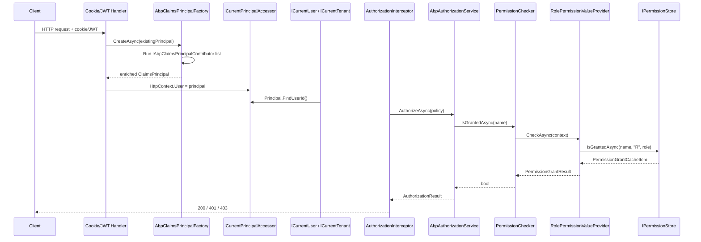

ABP layers on top of ASP.NET Core's authentication and authorization primitives instead of replacing them. The result is a deterministic pipeline: the configured authentication handler builds a `ClaimsPrincipal`, the [`AbpClaimsPrincipalFactory`](/auth/overview) enriches it through pluggable contributors, `ICurrentUser` and `ICurrentTenant` project that principal into ambient state, and any `[Authorize]` attribute or `IAuthorizationService.AuthorizeAsync` call funnels into `AbpAuthorizationService`, which finally consults `IPermissionChecker` and its `IPermissionValueProvider` chain to look up [`PermissionGrant`](/authz/permission-system) rows. This page walks the entire path from raw HTTP request to "is granted" boolean, with the exact source files involved at each hop.

## Flow at a glance

<Steps>
  <Step title="Authentication handler validates credentials">
    Cookie or JWT bearer middleware produces a `ClaimsPrincipal` from the request, using the schemes registered in `Program.cs`. See [JWT bearer](/auth/jwt-bearer) and [OpenID Connect](/auth/openid-connect).
  </Step>
  <Step title="AbpClaimsPrincipalFactory enriches the principal">
    Registered `IAbpClaimsPrincipalContributor` types add ABP claims (`UserId`, `TenantId`, `SessionId`, dynamic claims). The factory runs inside a fresh DI scope.
  </Step>
  <Step title="Ambient state is exposed">
    `ICurrentPrincipalAccessor.Principal` becomes the source for `ICurrentUser` and `ICurrentTenant`. Any code that reads `CurrentUser.Id` or `CurrentTenant.Id` reads from this principal.
  </Step>
  <Step title="Authorization service evaluates the policy">
    `AbpAuthorizationService` (a `DefaultAuthorizationService` subclass) is invoked through `[Authorize]` attributes, the [`AuthorizationInterceptor`](/authz/overview), or direct calls.
  </Step>
  <Step title="Permission checker consults value providers">
    For `PermissionRequirement` policies, `PermissionChecker` walks `PermissionValueProviderManager.ValueProviders` and aggregates a `PermissionGrantResult`.
  </Step>
</Steps>

## Sequence diagram



## Step 1 — Authentication handler builds the principal

The application picks one or more ASP.NET Core authentication schemes during startup. ABP's startup templates wire `Cookie` for MVC/Razor UIs and `JwtBearer` for HTTP APIs, then delegate identity issuance to the OpenIddict or IdentityServer module covered in [/auth/openiddict-server](/auth/openiddict-server) and [/auth/identityserver-module](/auth/identityserver-module).

After the handler validates the credential it assigns a `ClaimsPrincipal` to `HttpContext.User`. The JWT bearer module is itself an ABP module:

```csharp framework/src/Volo.Abp.AspNetCore.Authentication.JwtBearer/Volo/Abp/AspNetCore/Authentication/JwtBearer/AbpAspNetCoreAuthenticationJwtBearerModule.cs
[DependsOn(typeof(AbpSecurityModule), typeof(AbpCachingModule))]
public class AbpAspNetCoreAuthenticationJwtBearerModule : AbpModule
{
    public override void ConfigureServices(ServiceConfigurationContext context)
    {
        context.Services.AddHttpClient();
        context.Services.AddHttpContextAccessor();

        if (context.Services.ExecutePreConfiguredActions<WebRemoteDynamicClaimsPrincipalContributorOptions>().IsEnabled &&
            context.Services.ExecutePreConfiguredActions<AbpClaimsPrincipalFactoryOptions>().IsRemoteRefreshEnabled)
        {
            context.Services.AddTransient<WebRemoteDynamicClaimsPrincipalContributor>();
            context.Services.AddTransient<WebRemoteDynamicClaimsPrincipalContributorCache>();
        }
    }
}
```

The module's only contribution at this point is enabling dynamic claim refresh; the actual JWT validation is whatever `AddJwtBearer(...)` registers.

## Step 2 — Enriching the principal

Once the handler hands ABP a base `ClaimsPrincipal`, `AbpClaimsPrincipalFactory` produces the enriched principal used everywhere downstream:

```csharp framework/src/Volo.Abp.Security/Volo/Abp/Security/Claims/AbpClaimsPrincipalFactory.cs
public virtual async Task<ClaimsPrincipal> InternalCreateAsync(AbpClaimsPrincipalFactoryOptions options, ClaimsPrincipal? existsClaimsPrincipal = null, bool isDynamic = false)
{
    using (var scope = ServiceScopeFactory.CreateScope())
    {
        var claimsPrincipal = existsClaimsPrincipal ?? new ClaimsPrincipal(new ClaimsIdentity(
            AuthenticationType,
            AbpClaimTypes.UserName,
            AbpClaimTypes.Role));

        var context = new AbpClaimsPrincipalContributorContext(claimsPrincipal, scope.ServiceProvider);

        if (!isDynamic)
        {
            foreach (var contributorType in options.Contributors)
            {
                var contributor = (IAbpClaimsPrincipalContributor)scope.ServiceProvider.GetRequiredService(contributorType);
                await contributor.ContributeAsync(context);
            }
        }
        else
        {
            foreach (var contributorType in options.DynamicContributors)
            {
                var contributor = (IAbpDynamicClaimsPrincipalContributor)scope.ServiceProvider.GetRequiredService(contributorType);
                await contributor.ContributeAsync(context);
            }
        }

        return context.ClaimsPrincipal;
    }
}
```

`AuthenticationType` is the constant `"Abp.Application"`. The contributor pipeline is populated through `AbpClaimsPrincipalFactoryOptions.Contributors`:

```csharp framework/src/Volo.Abp.Security/Volo/Abp/Security/Claims/AbpClaimsPrincipalFactoryOptions.cs
public class AbpClaimsPrincipalFactoryOptions
{
    public ITypeList<IAbpClaimsPrincipalContributor> Contributors { get; }
    public ITypeList<IAbpDynamicClaimsPrincipalContributor> DynamicContributors { get; }
    public List<string> DynamicClaims { get; }
    public bool IsRemoteRefreshEnabled { get; set; }
    public string RemoteRefreshUrl { get; set; }
    public Dictionary<string, List<string>> ClaimsMap { get; set; }
    public bool IsDynamicClaimsEnabled { get; set; }
}
```

<Card title="ClaimsMap default" icon="map">
The constructor seeds `ClaimsMap` with the OAuth-style aliases ABP understands: `preferred_username` and `unique_name` both feed `AbpClaimTypes.UserName`, `given_name` feeds `Name`, `family_name` feeds `SurName`, and so on. That is why JWTs minted by OpenIddict, IdentityServer, Azure AD, or any other RFC-7519 provider produce a workable `CurrentUser` without per-module mapping code.
</Card>

`DynamicClaims` lists which claim types are refreshable through `RemoteRefreshUrl` (defaults to `/api/account/dynamic-claims/refresh`). Modules can call back to the auth server to repopulate a user's roles or features without forcing a sign-out.

### Built-in contributors

The contributor types live in [`Volo.Abp.Security/Volo/Abp/Security/Claims`](/auth/overview) and adjacent modules. The Identity module ships a `IdentityAbpClaimsPrincipalContributor` that injects `TenantId`, `UserName`, dynamic roles, and `SessionId`. The Account module adds a session-management contributor. JWT bearer adds `WebRemoteDynamicClaimsPrincipalContributor` to refresh dynamic claims through the configured URL.

The claim type constants are static and overridable:

```csharp framework/src/Volo.Abp.Security/Volo/Abp/Security/Claims/AbpClaimTypes.cs
public static class AbpClaimTypes
{
    public static string UserName { get; set; } = ClaimTypes.Name;
    public static string Name { get; set; } = ClaimTypes.GivenName;
    public static string SurName { get; set; } = ClaimTypes.Surname;
    public static string UserId { get; set; } = ClaimTypes.NameIdentifier;
    public static string Role { get; set; } = ClaimTypes.Role;
    public static string Email { get; set; } = ClaimTypes.Email;
    // ...
}
```

## Step 3 — `ICurrentUser` and `ICurrentTenant` projection

`ICurrentUser` is a thin façade over `ICurrentPrincipalAccessor`. Properties are evaluated lazily on every read so a `CurrentPrincipalAccessor.Change(...)` block immediately changes what the consumer sees.

```csharp framework/src/Volo.Abp.Security/Volo/Abp/Users/CurrentUser.cs
public class CurrentUser : ICurrentUser, ITransientDependency
{
    public virtual bool IsAuthenticated => Id.HasValue;
    public virtual Guid? Id => _principalAccessor.Principal?.FindUserId();
    public virtual string? UserName => this.FindClaimValue(AbpClaimTypes.UserName);
    public virtual Guid? TenantId => _principalAccessor.Principal?.FindTenantId();
    public virtual string[] Roles => FindClaims(AbpClaimTypes.Role).Select(c => c.Value).Distinct().ToArray();
    // ...
}
```

`ICurrentTenant` reads from a separate `ICurrentTenantAccessor` populated by the [multi-tenant resolution flow](/flows/multi-tenant-resolution). The two stay aligned because the `MultiTenancyMiddleware` runs after authentication has produced a principal, so the `CurrentUserTenantResolveContributor` can pull the tenant straight off the JWT:

```csharp framework/src/Volo.Abp.MultiTenancy/Volo/Abp/MultiTenancy/CurrentUserTenantResolveContributor.cs
public override Task ResolveAsync(ITenantResolveContext context)
{
    var currentUser = context.ServiceProvider.GetRequiredService<ICurrentUser>();
    if (currentUser.IsAuthenticated)
    {
        context.Handled = true;
        context.TenantIdOrName = currentUser.TenantId?.ToString();
    }

    return Task.CompletedTask;
}
```

## Step 4 — Authorization service entry points

ABP funnels every authorization call through `IAbpAuthorizationService`, which extends ASP.NET Core's `DefaultAuthorizationService`:

```csharp framework/src/Volo.Abp.Authorization/Volo/Abp/Authorization/AbpAuthorizationService.cs
[Dependency(ReplaceServices = true)]
public class AbpAuthorizationService : DefaultAuthorizationService, IAbpAuthorizationService, ITransientDependency
{
    public IServiceProvider ServiceProvider { get; }
    public ClaimsPrincipal CurrentPrincipal => _currentPrincipalAccessor.Principal;
    // ...
}
```

There are three common entry points:

1. **`[Authorize]` attributes on MVC controllers and Razor Pages** — the standard ASP.NET Core `AuthorizationMiddleware` resolves `IAuthorizationService` and gets the ABP replacement.
2. **`AuthorizationInterceptor` for application services** — see [/di/property-injection-and-interception](/di/property-injection-and-interception). The interceptor checks method-level and class-level `[Authorize]` attributes by delegating to `IMethodInvocationAuthorizationService`.
3. **Direct calls** — `IAuthorizationService.AuthorizeAsync(user, "MyPermission")` or `AbpAuthorizationServiceExtensions.CheckAsync(...)` for imperative checks.

The interceptor itself is trivial:

```csharp framework/src/Volo.Abp.Authorization/Volo/Abp/Authorization/AuthorizationInterceptor.cs
public class AuthorizationInterceptor : AbpInterceptor, ITransientDependency
{
    private readonly IMethodInvocationAuthorizationService _methodInvocationAuthorizationService;

    public override async Task InterceptAsync(IAbpMethodInvocation invocation)
    {
        await AuthorizeAsync(invocation);
        await invocation.ProceedAsync();
    }

    protected virtual async Task AuthorizeAsync(IAbpMethodInvocation invocation)
    {
        await _methodInvocationAuthorizationService.CheckAsync(
            new MethodInvocationAuthorizationContext(
                invocation.Method
            )
        );
    }
}
```

`MethodInvocationAuthorizationService` collects `[Authorize]` and `[AllowAnonymous]` attributes from both the method and its declaring type, combines them into an `AuthorizationPolicy`, and forwards to `IAbpAuthorizationService`:

```csharp framework/src/Volo.Abp.Authorization/Volo/Abp/Authorization/MethodInvocationAuthorizationService.cs
public async Task CheckAsync(MethodInvocationAuthorizationContext context)
{
    if (AllowAnonymous(context))
    {
        return;
    }

    var authorizationPolicy = await AuthorizationPolicy.CombineAsync(
        _abpAuthorizationPolicyProvider,
        GetAuthorizationDataAttributes(context.Method)
    );

    if (authorizationPolicy == null)
    {
        return;
    }

    await _abpAuthorizationService.CheckAsync(authorizationPolicy);
}
```

ABP handlers fail by throwing `AbpAuthorizationException`, which the ASP.NET Core integration translates into HTTP 401 / 403 through the standard exception filter — see [/authz/policies-and-attributes](/authz/policies-and-attributes).

## Step 5 — `IPermissionChecker` and the value-provider chain

For `[Authorize(Policy = "MyPermission")]`, `AbpAuthorizationPolicyProvider` constructs a policy backed by a `PermissionRequirement`. ABP's authorization handler delegates that requirement to `IPermissionChecker`, the implementation below:

```csharp framework/src/Volo.Abp.Authorization/Volo/Abp/Authorization/Permissions/PermissionChecker.cs
public virtual async Task<bool> IsGrantedAsync(
    ClaimsPrincipal? claimsPrincipal,
    string name)
{
    var permission = await PermissionDefinitionManager.GetOrNullAsync(name);
    if (permission == null || !permission.IsEnabled)
    {
        return false;
    }

    if (!await StateCheckerManager.IsEnabledAsync(permission))
    {
        return false;
    }

    var multiTenancySide = claimsPrincipal?.GetMultiTenancySide()
                           ?? CurrentTenant.GetMultiTenancySide();

    if (!permission.MultiTenancySide.HasFlag(multiTenancySide))
    {
        return false;
    }

    var isGranted = false;
    var context = new PermissionValueCheckContext(permission, claimsPrincipal);
    foreach (var provider in PermissionValueProviderManager.ValueProviders)
    {
        if (context.Permission.Providers.Any() &&
            !context.Permission.Providers.Contains(provider.Name))
        {
            continue;
        }

        var result = await provider.CheckAsync(context);

        if (result == PermissionGrantResult.Granted)
        {
            isGranted = true;
        }
        else if (result == PermissionGrantResult.Prohibited)
        {
            return false;
        }
    }

    return isGranted;
}
```

The behaviour is straightforward but worth spelling out:

- The permission definition is looked up by name. Missing or disabled definitions fail closed.
- [Simple state checking](/authz/simple-state-checking) (`ISimpleStateCheckerManager`) can short-circuit a permission based on the current feature flag or any other contextual switch.
- The tenant side (`Host`, `Tenant`, or `Both`) is matched against the definition's `MultiTenancySide` mask.
- Each `IPermissionValueProvider` returns `Granted`, `Prohibited`, or `Undefined`. A single `Prohibited` vetoes the request; any `Granted` flips the result on, unless overruled later.

### Built-in providers

`RolePermissionValueProvider` reads roles from the principal and asks `IPermissionStore` whether the role is granted:

```csharp framework/src/Volo.Abp.Authorization/Volo/Abp/Authorization/Permissions/RolePermissionValueProvider.cs
public override async Task<PermissionGrantResult> CheckAsync(PermissionValueCheckContext context)
{
    var roles = context.Principal?.FindAll(AbpClaimTypes.Role).Select(c => c.Value).ToArray();

    if (roles == null || !roles.Any())
    {
        return PermissionGrantResult.Undefined;
    }

    foreach (var role in roles.Distinct())
    {
        if (await PermissionStore.IsGrantedAsync(context.Permission.Name, Name, role))
        {
            return PermissionGrantResult.Granted;
        }
    }

    return PermissionGrantResult.Undefined;
}
```

`UserPermissionValueProvider` follows the same shape but uses `AbpClaimTypes.UserId` as the lookup key. `ClientPermissionValueProvider` covers OAuth client credentials. See [/authz/permission-system](/authz/permission-system) for the complete catalogue.

## Step 6 — `PermissionGrant` lookup

`IPermissionStore` is implemented by the [Permission Management module](/modules/permission-management) (`PermissionStore` in `Volo.Abp.PermissionManagement.Domain`). It composes a cache key from `(name, providerName, providerKey)` and uses an `IDistributedCache<PermissionGrantCacheItem>` to avoid hammering the database:

```csharp modules/permission-management/src/Volo.Abp.PermissionManagement.Domain/Volo/Abp/PermissionManagement/PermissionStore.cs
public virtual async Task<bool> IsGrantedAsync(string name, string providerName, string providerKey)
{
    return (await GetCacheItemAsync(name, providerName, providerKey)).IsGranted;
}
```

On a cache miss the store calls `IPermissionGrantRepository.GetListAsync(providerName, providerKey)` and writes a `PermissionGrantCacheItem` per defined permission. This is why granting or revoking a permission requires invalidating those cache entries — `PermissionGrantCacheItemInvalidator` listens to `EntityCreated/Updated/Deleted` events on `PermissionGrant` and clears the relevant keys. See [/authz/permission-management-module](/authz/permission-management-module) for the full data model.

<Tabs>
  <Tab title="Provider name codes">
    | Provider | `Name` | Key format |
    | --- | --- | --- |
    | Role | `R` | normalised role name |
    | User | `U` | `IdentityUser.Id` as string |
    | Client | `C` | OAuth client id |

    These short codes are stored in the `ProviderName` column of `AbpPermissionGrants`.
  </Tab>
  <Tab title="Aggregation rules">
    `PermissionChecker.IsGrantedAsync(name)` returns `true` if **any** provider says `Granted` and **none** says `Prohibited`. Built-in providers never return `Prohibited`; that result is reserved for custom providers that need to veto access regardless of role grants.
  </Tab>
</Tabs>

## Putting it together

The full hop count from request to grant is short:

1. ASP.NET Core authentication produces the raw principal.
2. `AbpClaimsPrincipalFactory` enriches it with ABP claims and dynamic claims.
3. `ICurrentPrincipalAccessor` exposes that principal as ambient state.
4. `ICurrentUser` and `ICurrentTenant` project the user and tenant for downstream code.
5. `AbpAuthorizationService` evaluates `[Authorize]` policies — directly from middleware, through the `AuthorizationInterceptor`, or from explicit code.
6. `PermissionChecker` walks `PermissionValueProviderManager.ValueProviders`, each of which hits `IPermissionStore`, backed by the `PermissionGrant` table in the [Permission Management module](/modules/permission-management).

<Card title="Related flows" icon="diagram-project">
- [/flows/multi-tenant-resolution](/flows/multi-tenant-resolution) — how `CurrentTenant` is populated.
- [/uow/event-publisher-integration](/uow/event-publisher-integration) — distributed events fired when a `PermissionGrant` row changes.
- [/modules/identity](/modules/identity) — where the `IdentityAbpClaimsPrincipalContributor` lives.
- [/auth/overview](/auth/overview) — the authentication entry points (cookie, JWT, OIDC).
- [/authz/overview](/authz/overview) — deep dive into policies, requirements, and handlers.
</Card>

## Customising the pipeline

<AccordionGroup>
  <Accordion title="Add a custom claims contributor">
    Implement `IAbpClaimsPrincipalContributor` and register it through `AbpClaimsPrincipalFactoryOptions.Contributors`. The contributor runs inside a DI scope each time the factory builds a principal, so it can resolve scoped services such as repositories.
  </Accordion>
  <Accordion title="Add a custom permission value provider">
    Subclass `PermissionValueProvider`, expose a unique `Name`, and add it to `AbpPermissionOptions.ValueProviders`. Returning `PermissionGrantResult.Prohibited` will block access even when other providers granted it.
  </Accordion>
  <Accordion title="Refresh dynamic claims on demand">
    Set `AbpClaimsPrincipalFactoryOptions.IsDynamicClaimsEnabled = true` and configure `RemoteRefreshUrl`. The JWT bearer module's `WebRemoteDynamicClaimsPrincipalContributor` calls that endpoint and replaces the dynamic claims listed in `AbpClaimsPrincipalFactoryOptions.DynamicClaims`.
  </Accordion>
  <Accordion title="Skip authorization for a method">
    Add `[AllowAnonymous]` directly to the method or class. `MethodInvocationAuthorizationService.AllowAnonymous` short-circuits before the policy is combined.
  </Accordion>
</AccordionGroup>
