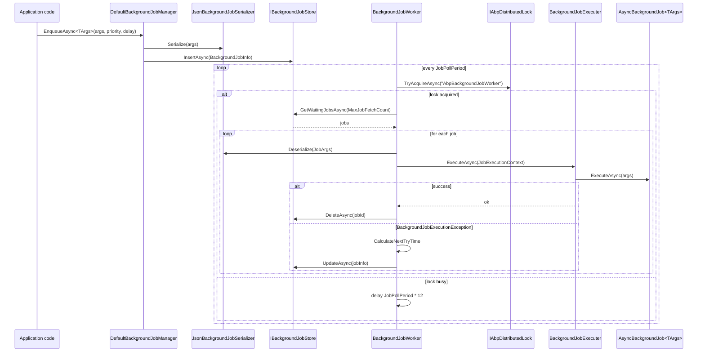

ABP's default background-job pipeline is intentionally simple: jobs are POCO classes implementing `IAsyncBackgroundJob<TArgs>`, the manager serialises arguments and writes a `BackgroundJobInfo` row to `IBackgroundJobStore`, and a periodic `BackgroundJobWorker` polls the store under a distributed lock to dequeue work. The same primitives plug into the [Hangfire](/background/hangfire-jobs), [Quartz](/background/quartz-jobs), and [RabbitMQ](/background/rabbitmq-jobs) integrations — the default implementation lives in `Volo.Abp.BackgroundJobs` and is the canonical reference. This page traces a job from `EnqueueAsync` to successful deletion or abandonment, citing the actual source for every hop.

## Components on the path

| Component | Source | Role |
| --- | --- | --- |
| `IBackgroundJobManager` | `Volo.Abp.BackgroundJobs.Abstractions` | Producer entry point. |
| `DefaultBackgroundJobManager` | `Volo.Abp.BackgroundJobs` | Default implementation, writes to the store. |
| `IBackgroundJobSerializer` | `Volo.Abp.BackgroundJobs` | Persists args as JSON. |
| `IBackgroundJobStore` | `Volo.Abp.BackgroundJobs` | Persists `BackgroundJobInfo` rows. |
| `BackgroundJobWorker` | `Volo.Abp.BackgroundJobs` | Periodic polling loop. |
| `IAbpDistributedLock` | `Volo.Abp.DistributedLocking` | Ensures single-active worker. |
| `IBackgroundJobExecuter` | `Volo.Abp.BackgroundJobs.Abstractions` | Resolves the job and invokes `Execute`/`ExecuteAsync`. |
| `IBackgroundJob<T>` / `IAsyncBackgroundJob<T>` | `Volo.Abp.BackgroundJobs.Abstractions` | User-defined handler. |

## Sequence diagram



## Step 1 — Module wiring

`AbpBackgroundJobsModule` registers the worker only when job execution is enabled. The check is also turned off automatically inside `IsDataMigrationEnvironment`, so EF Core migrations don't accidentally start polling:

```csharp framework/src/Volo.Abp.BackgroundJobs/Volo/Abp/BackgroundJobs/AbpBackgroundJobsModule.cs
public class AbpBackgroundJobsModule : AbpModule
{
    public override void ConfigureServices(ServiceConfigurationContext context)
    {
        if (context.Services.IsDataMigrationEnvironment())
        {
            Configure<AbpBackgroundJobOptions>(options =>
            {
                options.IsJobExecutionEnabled = false;
            });
        }
    }

    public override async Task OnApplicationInitializationAsync(ApplicationInitializationContext context)
    {
        if (context.ServiceProvider.GetRequiredService<IOptions<AbpBackgroundJobOptions>>().Value.IsJobExecutionEnabled)
        {
            await context.AddBackgroundWorkerAsync<IBackgroundJobWorker>();
        }
    }
}
```

`AddBackgroundWorkerAsync<IBackgroundJobWorker>` hooks the worker into the [background-workers](/background/background-workers) infrastructure, which starts/stops it together with the application lifetime.

## Step 2 — Enqueue

`IBackgroundJobManager` is the public producer surface. The default implementation creates a fresh `BackgroundJobInfo`, hands it to the store, and returns the new id as a string:

```csharp framework/src/Volo.Abp.BackgroundJobs/Volo/Abp/BackgroundJobs/DefaultBackgroundJobManager.cs
public virtual async Task<string> EnqueueAsync<TArgs>(TArgs args, BackgroundJobPriority priority = BackgroundJobPriority.Normal, TimeSpan? delay = null)
{
    var jobName = BackgroundJobNameAttribute.GetName<TArgs>();
    var jobId = await EnqueueAsync(jobName, args!, priority, delay);
    return jobId.ToString();
}

protected virtual async Task<Guid> EnqueueAsync(string jobName, object args, BackgroundJobPriority priority = BackgroundJobPriority.Normal, TimeSpan? delay = null)
{
    var jobInfo = new BackgroundJobInfo
    {
        Id = GuidGenerator.Create(),
        JobName = jobName,
        JobArgs = Serializer.Serialize(args),
        Priority = priority,
        CreationTime = Clock.Now,
        NextTryTime = Clock.Now
    };

    if (delay.HasValue)
    {
        jobInfo.NextTryTime = Clock.Now.Add(delay.Value);
    }

    await Store.InsertAsync(jobInfo);

    return jobInfo.Id;
}
```

The `JobName` lookup uses `BackgroundJobNameAttribute.GetName<TArgs>()`, which returns the value of `[BackgroundJobName("...")]` on the args type or falls back to the args type's full name. This is the key the worker later uses to find the right `IBackgroundJob<TArgs>` implementation through `AbpBackgroundJobOptions`.

The serializer is JSON-backed by default:

```csharp framework/src/Volo.Abp.BackgroundJobs/Volo/Abp/BackgroundJobs/JsonBackgroundJobSerializer.cs
public class JsonBackgroundJobSerializer : IBackgroundJobSerializer, ITransientDependency
{
    private readonly IJsonSerializer _jsonSerializer;

    public string Serialize(object obj) => _jsonSerializer.Serialize(obj);
    public object Deserialize(string value, Type type) => _jsonSerializer.Deserialize(type, value);
    public T Deserialize<T>(string value) => _jsonSerializer.Deserialize<T>(value);
}
```

## Step 3 — `BackgroundJobInfo` shape

The persistence row is small and language-neutral:

```csharp framework/src/Volo.Abp.BackgroundJobs/Volo/Abp/BackgroundJobs/BackgroundJobInfo.cs
public class BackgroundJobInfo
{
    public Guid Id { get; set; }
    public virtual string JobName { get; set; } = default!;
    public virtual string JobArgs { get; set; } = default!;
    public virtual short TryCount { get; set; }
    public virtual DateTime CreationTime { get; set; }
    public virtual DateTime NextTryTime { get; set; }
    public virtual DateTime? LastTryTime { get; set; }
    public virtual bool IsAbandoned { get; set; }
    public virtual BackgroundJobPriority Priority { get; set; }
}
```

`IBackgroundJobStore` defines exactly the operations the worker needs:

```csharp framework/src/Volo.Abp.BackgroundJobs/Volo/Abp/BackgroundJobs/IBackgroundJobStore.cs
public interface IBackgroundJobStore
{
    Task<BackgroundJobInfo> FindAsync(Guid jobId);
    Task InsertAsync(BackgroundJobInfo jobInfo);

    /// <summary>
    /// Gets waiting jobs. It should get jobs based on these:
    /// Conditions: !IsAbandoned And NextTryTime &lt;= Clock.Now.
    /// Order by: Priority DESC, TryCount ASC, NextTryTime ASC.
    /// Maximum result: <paramref name="maxResultCount"/>.
    /// </summary>
    Task<List<BackgroundJobInfo>> GetWaitingJobsAsync(int maxResultCount);

    Task DeleteAsync(Guid jobId);
    Task UpdateAsync(BackgroundJobInfo jobInfo);
}
```

The XML doc on `GetWaitingJobsAsync` is the contract every adapter must honour. `InMemoryBackgroundJobStore` implements it directly; the [Background Jobs module](/modules/background-jobs) replaces it with an EF Core or MongoDB version backed by the `AbpBackgroundJobs` table.

## Step 4 — Polling loop

`BackgroundJobWorker` extends `AsyncPeriodicBackgroundWorkerBase` (see [/background/background-workers](/background/background-workers)) and uses a distributed lock so multi-instance deployments don't double-process jobs:

```csharp framework/src/Volo.Abp.BackgroundJobs/Volo/Abp/BackgroundJobs/BackgroundJobWorker.cs
public class BackgroundJobWorker : AsyncPeriodicBackgroundWorkerBase, IBackgroundJobWorker
{
    protected const string DistributedLockName = "AbpBackgroundJobWorker";

    protected AbpBackgroundJobOptions JobOptions { get; }
    protected AbpBackgroundJobWorkerOptions WorkerOptions { get; }
    protected IAbpDistributedLock DistributedLock { get; }

    public BackgroundJobWorker(
        AbpAsyncTimer timer,
        IOptions<AbpBackgroundJobOptions> jobOptions,
        IOptions<AbpBackgroundJobWorkerOptions> workerOptions,
        IServiceScopeFactory serviceScopeFactory,
        IAbpDistributedLock distributedLock)
        : base(timer, serviceScopeFactory)
    {
        DistributedLock = distributedLock;
        WorkerOptions = workerOptions.Value;
        JobOptions = jobOptions.Value;
        Timer.Period = WorkerOptions.JobPollPeriod;
    }
}
```

The `Timer.Period` is read from `AbpBackgroundJobWorkerOptions` (default: 5 seconds, see the option block below). Each tick calls `DoWorkAsync`:

```csharp framework/src/Volo.Abp.BackgroundJobs/Volo/Abp/BackgroundJobs/BackgroundJobWorker.cs
protected override async Task DoWorkAsync(PeriodicBackgroundWorkerContext workerContext)
{
    await using (var handler = await DistributedLock.TryAcquireAsync(DistributedLockName, cancellationToken: StoppingToken))
    {
        if (handler != null)
        {
            var store = workerContext.ServiceProvider.GetRequiredService<IBackgroundJobStore>();
            var waitingJobs = await store.GetWaitingJobsAsync(WorkerOptions.MaxJobFetchCount);

            if (!waitingJobs.Any()) { return; }

            var jobExecuter = workerContext.ServiceProvider.GetRequiredService<IBackgroundJobExecuter>();
            var clock = workerContext.ServiceProvider.GetRequiredService<IClock>();
            var serializer = workerContext.ServiceProvider.GetRequiredService<IBackgroundJobSerializer>();

            foreach (var jobInfo in waitingJobs)
            {
                jobInfo.TryCount++;
                jobInfo.LastTryTime = clock.Now;

                try
                {
                    var jobConfiguration = JobOptions.GetJob(jobInfo.JobName);
                    var jobArgs = serializer.Deserialize(jobInfo.JobArgs, jobConfiguration.ArgsType);
                    var context = new JobExecutionContext(
                        workerContext.ServiceProvider,
                        jobConfiguration.JobType,
                        jobArgs,
                        workerContext.CancellationToken);

                    try
                    {
                        await jobExecuter.ExecuteAsync(context);
                        await store.DeleteAsync(jobInfo.Id);
                    }
                    catch (BackgroundJobExecutionException)
                    {
                        var nextTryTime = CalculateNextTryTime(jobInfo, clock);

                        if (nextTryTime.HasValue)
                        {
                            jobInfo.NextTryTime = nextTryTime.Value;
                        }
                        else
                        {
                            jobInfo.IsAbandoned = true;
                        }

                        await TryUpdateAsync(store, jobInfo);
                    }
                }
                catch (Exception ex)
                {
                    Logger.LogException(ex);
                    jobInfo.IsAbandoned = true;
                    await TryUpdateAsync(store, jobInfo);
                }
            }
        }
        else
        {
            try
            {
                await Task.Delay(WorkerOptions.JobPollPeriod * 12, StoppingToken);
            }
            catch (TaskCanceledException) { }
        }
    }
}
```

Key points:

- `DistributedLock.TryAcquireAsync` returns `null` when another instance already holds the lock. The losing worker sleeps for `JobPollPeriod * 12` (one minute by default) before retrying — this keeps lock contention low without delaying processing on the winning instance.
- `TryCount++` happens **before** the job runs, so a crash mid-execution still counts as an attempt.
- A `BackgroundJobExecutionException` from the executer means the job's own code threw; the worker schedules a retry. Any other exception (e.g. the args type is unknown) marks the job abandoned immediately.
- Successful execution leads to `store.DeleteAsync(jobInfo.Id)` — `AbpBackgroundJobs` is essentially a queue table, not a history table.

### Retry maths

`CalculateNextTryTime` applies exponential backoff with a global timeout:

```csharp framework/src/Volo.Abp.BackgroundJobs/Volo/Abp/BackgroundJobs/BackgroundJobWorker.cs
protected virtual DateTime? CalculateNextTryTime(BackgroundJobInfo jobInfo, IClock clock)
{
    var nextWaitDuration = WorkerOptions.DefaultFirstWaitDuration *
                           (Math.Pow(WorkerOptions.DefaultWaitFactor, jobInfo.TryCount - 1));
    var nextTryDate = jobInfo.LastTryTime?.AddSeconds(nextWaitDuration) ??
                      clock.Now.AddSeconds(nextWaitDuration);

    if (nextTryDate.Subtract(jobInfo.CreationTime).TotalSeconds > WorkerOptions.DefaultTimeout)
    {
        return null;
    }

    return nextTryDate;
}
```

With the defaults below, attempt 1 retries after 60 s, attempt 2 after 120 s, attempt 3 after 240 s, and so on until the cumulative time since `CreationTime` exceeds `DefaultTimeout` (2 days). At that point `nextTryTime` is `null` and the job is marked abandoned.

```csharp framework/src/Volo.Abp.BackgroundJobs/Volo/Abp/BackgroundJobs/AbpBackgroundJobWorkerOptions.cs
public class AbpBackgroundJobWorkerOptions
{
    /// <summary>Interval between polling jobs … Default: 5000 (5 seconds).</summary>
    public int JobPollPeriod { get; set; }

    /// <summary>Maximum count of jobs to fetch from data store in one loop. Default: 1000.</summary>
    public int MaxJobFetchCount { get; set; }

    /// <summary>Default duration (as seconds) for the first wait on a failure. Default: 60.</summary>
    public int DefaultFirstWaitDuration { get; set; }

    /// <summary>Default timeout value (as seconds) before a job is abandoned. Default: 172,800 (2 days).</summary>
    public int DefaultTimeout { get; set; }

    /// <summary>Default wait factor for execution failures. Default: 2.0.</summary>
    public double DefaultWaitFactor { get; set; }

    public AbpBackgroundJobWorkerOptions()
    {
        MaxJobFetchCount = 1000;
        JobPollPeriod = 5000;
        DefaultFirstWaitDuration = 60;
        DefaultTimeout = 172800;
        DefaultWaitFactor = 2.0;
    }
}
```

## Step 5 — `BackgroundJobExecuter`

The executer resolves the job, picks the right `Execute`/`ExecuteAsync` method, applies the tenant scope, and wraps any failure in `BackgroundJobExecutionException`:

```csharp framework/src/Volo.Abp.BackgroundJobs.Abstractions/Volo/Abp/BackgroundJobs/BackgroundJobExecuter.cs
public virtual async Task ExecuteAsync(JobExecutionContext context)
{
    var job = context.ServiceProvider.GetService(context.JobType);
    if (job == null)
    {
        throw new AbpException("The job type is not registered to DI: " + context.JobType);
    }

    var jobExecuteMethod = context.JobType.GetMethod(nameof(IBackgroundJob<object>.Execute)) ??
                           context.JobType.GetMethod(nameof(IAsyncBackgroundJob<object>.ExecuteAsync));
    if (jobExecuteMethod == null)
    {
        throw new AbpException($"Given job type does not implement {typeof(IBackgroundJob<>).Name} or {typeof(IAsyncBackgroundJob<>).Name}. " +
                               "The job type was: " + context.JobType);
    }

    try
    {
        using(CurrentTenant.Change(GetJobArgsTenantId(context.JobArgs)))
        {
            var cancellationTokenProvider =
                context.ServiceProvider.GetRequiredService<ICancellationTokenProvider>();

            using (cancellationTokenProvider.Use(context.CancellationToken))
            {
                if (jobExecuteMethod.Name == nameof(IAsyncBackgroundJob<object>.ExecuteAsync))
                {
                    await ((Task)jobExecuteMethod.Invoke(job, new[] { context.JobArgs })!);
                }
                else
                {
                    jobExecuteMethod.Invoke(job, new[] { context.JobArgs });
                }
            }
        }
    }
    catch (Exception ex)
    {
        Logger.LogException(ex);

        await context.ServiceProvider
            .GetRequiredService<IExceptionNotifier>()
            .NotifyAsync(new ExceptionNotificationContext(ex));

        throw new BackgroundJobExecutionException("A background job execution is failed. See inner exception for details.", ex)
        {
            JobType = context.JobType.AssemblyQualifiedName!,
            JobArgs = context.JobArgs
        };
    }
}

protected virtual Guid? GetJobArgsTenantId(object jobArgs)
{
    return jobArgs switch
    {
        IMultiTenant multiTenantJobArgs => multiTenantJobArgs.TenantId,
        _ => CurrentTenant.Id
    };
}
```

Two important behaviours:

1. **Tenant scoping** — if the args type implements `IMultiTenant`, the job runs inside `CurrentTenant.Change(args.TenantId)`. This mirrors how the [multi-tenant resolution flow](/flows/multi-tenant-resolution) sets the tenant for HTTP requests, ensuring data filters apply correctly inside jobs.
2. **Exception notification** — every failure is forwarded to `IExceptionNotifier`, which feeds [audit logging](/auditing/overview) and any custom exception subscribers, before being re-thrown as `BackgroundJobExecutionException`.

The job itself looks like this (developer-authored):

```csharp framework/src/Volo.Abp.BackgroundJobs.Abstractions/Volo/Abp/BackgroundJobs/AsyncBackgroundJob.cs
public abstract class AsyncBackgroundJob<TArgs> : IAsyncBackgroundJob<TArgs>
{
    public abstract Task ExecuteAsync(TArgs args);
}
```

See [/background/default-job-manager](/background/default-job-manager) for full usage patterns.

## Step 6 — Job registration

`AbpBackgroundJobOptions.GetJob(jobName)` returns the `BackgroundJobConfiguration` that maps a job name to its `ArgsType` and `JobType`. Jobs are auto-discovered through ABP's convention scanning of `IAsyncBackgroundJob<>`/`IBackgroundJob<>` implementations. You can also register manually:

```csharp
Configure<AbpBackgroundJobOptions>(options =>
{
    options.AddJob<EmailSendingJob>();
});
```

`EmailSendingJob` must inherit `AsyncBackgroundJob<EmailSendingArgs>` (or implement `IAsyncBackgroundJob<EmailSendingArgs>`). The args class can carry `[BackgroundJobName("Emails.Send")]` to make the persisted `JobName` stable across renames.

## Distributed-lock semantics

`IAbpDistributedLock` is fronted by `Volo.Abp.DistributedLocking`. In a single-process app the default in-memory implementation is enough; in a multi-instance deployment you replace it with the Redis-backed integration. See [/locking/overview](/locking/overview).

The lock name `"AbpBackgroundJobWorker"` is shared across all instances, which means only one worker is dequeuing at a time. Throughput therefore scales with `MaxJobFetchCount` and per-job execution time, not with replica count — adding instances buys availability rather than parallel processing for this implementation. The [Hangfire integration](/background/hangfire-jobs) and [RabbitMQ integration](/background/rabbitmq-jobs) take different approaches if you need horizontal scale.

<Card title="In-memory store" icon="memory">
The default `InMemoryBackgroundJobStore` keeps jobs in a `List<BackgroundJobInfo>` and is suitable for tests or single-instance apps. Production deployments use the [Background Jobs module](/modules/background-jobs) which replaces the store with an EF Core or MongoDB-backed implementation against the `AbpBackgroundJobs` collection.
</Card>

## End-to-end timeline

<Steps>
  <Step title="Producer enqueues">
    `IBackgroundJobManager.EnqueueAsync(args, delay, priority)` is called from application code. The manager serialises args and inserts a `BackgroundJobInfo` row with `NextTryTime` set to now (or `now + delay`).
  </Step>
  <Step title="Worker tick">
    Every `JobPollPeriod` ms, `BackgroundJobWorker.DoWorkAsync` runs.
  </Step>
  <Step title="Acquire distributed lock">
    The worker calls `IAbpDistributedLock.TryAcquireAsync("AbpBackgroundJobWorker")`. If another instance holds it, the worker sleeps `12 * JobPollPeriod`.
  </Step>
  <Step title="Fetch waiting jobs">
    `store.GetWaitingJobsAsync(MaxJobFetchCount)` returns up to 1000 rows ordered by `Priority DESC, TryCount ASC, NextTryTime ASC`.
  </Step>
  <Step title="Dispatch each job">
    For each row: deserialize args, build a `JobExecutionContext`, call `IBackgroundJobExecuter.ExecuteAsync`.
  </Step>
  <Step title="Success → delete">
    On a clean return, `store.DeleteAsync(jobInfo.Id)` removes the row.
  </Step>
  <Step title="Failure → retry or abandon">
    On `BackgroundJobExecutionException`, `CalculateNextTryTime` schedules the next attempt or sets `IsAbandoned = true` when the cumulative timeout is hit.
  </Step>
</Steps>

<Card title="Related flows" icon="diagram-project">
- [/flows/multi-tenant-resolution](/flows/multi-tenant-resolution) — why `IMultiTenant` job args automatically scope `CurrentTenant`.
- [/background/jobs-overview](/background/jobs-overview) — feature matrix for the available job providers.
- [/background/default-job-manager](/background/default-job-manager) — usage and configuration guide.
- [/locking/overview](/locking/overview) — distributed lock providers.
- [/modules/background-jobs](/modules/background-jobs) — EF Core / MongoDB store implementations.
</Card>

## Troubleshooting

<AccordionGroup>
  <Accordion title="`The job type is not registered to DI`">
    `BackgroundJobExecuter.ExecuteAsync` could not resolve the job type from `context.ServiceProvider`. Make sure the job class is in a module that's referenced by the worker process and that it is discovered as a conventional dependency.
  </Accordion>
  <Accordion title="Jobs never run">
    Either `IsJobExecutionEnabled` is `false` (auto-disabled in `IsDataMigrationEnvironment`), the worker process isn't running, or the distributed lock is permanently held by a crashed instance. Inspect the lock store and `AbpBackgroundJobOptions`.
  </Accordion>
  <Accordion title="Jobs run twice">
    Almost always a distributed-lock misconfiguration. The default in-memory `IAbpDistributedLock` does not coordinate across processes — switch to the Redis-backed implementation when you scale out.
  </Accordion>
  <Accordion title="Tenant filter still picks the host">
    `BackgroundJobExecuter` reads `IMultiTenant.TenantId` from the args. If your args class doesn't implement `IMultiTenant`, the executer falls back to `CurrentTenant.Id` at enqueue time — which is `null` when the producer called `EnqueueAsync` from host context.
  </Accordion>
</AccordionGroup>
