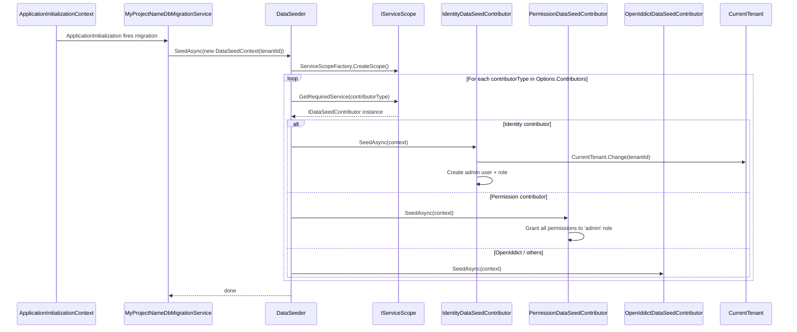

ABP treats seeding as a normal application concern rather than a database-migration side effect. A `DbMigrationService` (or any other entry point) resolves `IDataSeeder`, builds a `DataSeedContext` per tenant, and the seeder walks the ordered `AbpDataSeedOptions.Contributors` list. Each `IDataSeedContributor` runs inside the active unit of work (or its own, if requested), so the contributors that ship with the Identity, Permission Management, OpenIddict, and Tenant Management modules can collaborate — Identity creates the `admin` user, Permission Management grants the `admin` role its permissions, OpenIddict provisions applications and scopes, and module-specific contributors add their own state. This page walks the flow from `AbpApplicationInitializationContext`-time discovery of contributors to the per-tenant `SeedAsync` invocation, with the actual source for each step.

## Components on the path

| Component | Source | Role |
| --- | --- | --- |
| `AbpDataModule` | `Volo.Abp.Data` | Auto-discovers `IDataSeedContributor` types. |
| `AbpDataSeedOptions` | `Volo.Abp.Data` | Holds the ordered `Contributors` `TypeList`. |
| `IDataSeeder` / `DataSeeder` | `Volo.Abp.Data` | Drains contributors against a `DataSeedContext`. |
| `IDataSeedContributor` | `Volo.Abp.Data` | Per-module seeding logic. |
| `DataSeedContext` | `Volo.Abp.Data` | Carries `TenantId` plus arbitrary properties. |
| `IIdentityDataSeeder` | [Identity module](/modules/identity) | Creates the `admin` user and role. |
| `IPermissionDataSeeder` | [Permission Management module](/modules/permission-management) | Grants permissions to providers. |

## Sequence diagram



## Step 1 — Auto-discovery in `AbpDataModule`

ABP populates `AbpDataSeedOptions.Contributors` automatically by hooking ASP.NET Core's `OnRegistered` callback during `PreConfigureServices`. Any class registered for DI that implements `IDataSeedContributor` joins the list:

```csharp framework/src/Volo.Abp.Data/Volo/Abp/Data/AbpDataModule.cs
public class AbpDataModule : AbpModule
{
    public override void PreConfigureServices(ServiceConfigurationContext context)
    {
        AutoAddDataSeedContributors(context.Services);
    }

    private static void AutoAddDataSeedContributors(IServiceCollection services)
    {
        var contributors = new List<Type>();

        services.OnRegistered(context =>
        {
            if (typeof(IDataSeedContributor).IsAssignableFrom(context.ImplementationType))
            {
                contributors.Add(context.ImplementationType);
            }
        });

        services.Configure<AbpDataSeedOptions>(options =>
        {
            options.Contributors.AddIfNotContains(contributors);
        });
    }
}
```

Because `OnRegistered` fires in module dependency order, contributors line up in the same order their owning modules were loaded. The Identity contributor therefore runs before the Permission Management contributor (which depends on `admin` already existing), and a tenant-management or OpenIddict contributor runs after both of them. See [/modularity/module-lifecycle](/modularity/module-lifecycle) for the broader order rules.

The option object is intentionally minimal:

```csharp framework/src/Volo.Abp.Data/Volo/Abp/Data/AbpDataSeedOptions.cs
public class AbpDataSeedOptions
{
    public DataSeedContributorList Contributors { get; }

    public AbpDataSeedOptions()
    {
        Contributors = new DataSeedContributorList();
    }
}
```

```csharp framework/src/Volo.Abp.Data/Volo/Abp/Data/DataSeedContributorList.cs
public class DataSeedContributorList : TypeList<IDataSeedContributor>
{
}
```

`TypeList<T>` is an ordered list of types — modules can call `options.Contributors.Insert(0, typeof(MySeed))` to override ordering when the convention isn't sufficient.

## Step 2 — Triggering seeding

There is no implicit "seed on startup" hook in the framework. Templates ship a `DbMigrationService` that the host runs (typically as `DbMigrator` console app, or as a hosted service in `OnApplicationInitializationAsync`). The official no-layers template shows the canonical shape:

```csharp templates/app-nolayers/aspnet-core/MyCompanyName.MyProjectName.Blazor.Server/Data/MyProjectNameDbMigrationService.cs
public class MyProjectNameDbMigrationService : ITransientDependency
{
    public ILogger<MyProjectNameDbMigrationService> Logger { get; set; }

    private readonly IDataSeeder _dataSeeder;
    private readonly MyProjectNameEFCoreDbSchemaMigrator _dbSchemaMigrator;
    private readonly ITenantRepository _tenantRepository;
    private readonly ICurrentTenant _currentTenant;

    // ...

    private async Task SeedDataAsync(Tenant? tenant = null)
    {
        Logger.LogInformation($"Executing {(tenant == null ? "host" : tenant.Name + " tenant")} database seed...");

        await _dataSeeder.SeedAsync(new DataSeedContext(tenant?.Id)
            .WithProperty(IdentityDataSeedContributor.AdminEmailPropertyName, IdentityDataSeedContributor.AdminEmailDefaultValue)
            .WithProperty(IdentityDataSeedContributor.AdminPasswordPropertyName, IdentityDataSeedContributor.AdminPasswordDefaultValue)
        );
    }
}
```

A few things are happening here:

- `Tenant? tenant` flips between `null` (host) and a `Tenant` row read from `ITenantRepository`. The same migration service runs once per tenant.
- Each call constructs a fresh `DataSeedContext(tenant?.Id)`. Any contributor that reads `context.TenantId` automatically knows whether it is seeding the host or a tenant database.
- `WithProperty(...)` passes opaque parameters by name. The Identity contributor pulls `AdminEmailPropertyName` and `AdminPasswordPropertyName` (see below) — modules can publish their own constants the same way.

`DataSeedContext` is just a property bag:

```csharp framework/src/Volo.Abp.Data/Volo/Abp/Data/DataSeedContext.cs
public class DataSeedContext
{
    public Guid? TenantId { get; set; }

    public object? this[string name] {
        get => Properties.GetOrDefault(name);
        set => Properties[name] = value;
    }

    [NotNull]
    public Dictionary<string, object?> Properties { get; }

    public DataSeedContext(Guid? tenantId = null)
    {
        TenantId = tenantId;
        Properties = new Dictionary<string, object?>();
    }

    public virtual DataSeedContext WithProperty(string key, object? value)
    {
        Properties[key] = value;
        return this;
    }
}
```

## Step 3 — `DataSeeder` walks the list

`DataSeeder.SeedAsync` runs inside its own DI scope and is decorated with `[UnitOfWork]`. By default every contributor runs in the same unit of work so a failure roll backs the whole seed. The `SeedInSeparateUow` branch creates a fresh UoW per contributor when you call `SeedInSeparateUowAsync(...)` instead — useful for very large seeds or for letting later contributors see committed state from earlier ones:

```csharp framework/src/Volo.Abp.Data/Volo/Abp/Data/DataSeeder.cs
public class DataSeeder : IDataSeeder, ITransientDependency
{
    protected IServiceScopeFactory ServiceScopeFactory { get; }
    protected AbpDataSeedOptions Options { get; }

    [UnitOfWork]
    public virtual async Task SeedAsync(DataSeedContext context)
    {
        using (var scope = ServiceScopeFactory.CreateScope())
        {
            if (context.Properties.ContainsKey(DataSeederExtensions.SeedInSeparateUow))
            {
                var manager = scope.ServiceProvider.GetRequiredService<IUnitOfWorkManager>();
                foreach (var contributorType in Options.Contributors)
                {
                    var options = context.Properties.TryGetValue(DataSeederExtensions.SeedInSeparateUowOptions, out var uowOptions)
                        ? (AbpUnitOfWorkOptions) uowOptions!
                        : new AbpUnitOfWorkOptions();
                    var requiresNew = context.Properties.TryGetValue(DataSeederExtensions.SeedInSeparateUowRequiresNew, out var obj) && (bool) obj!;

                    using (var uow = manager.Begin(options, requiresNew))
                    {
                        var contributor = (IDataSeedContributor)scope.ServiceProvider.GetRequiredService(contributorType);
                        await contributor.SeedAsync(context);
                        await uow.CompleteAsync();
                    }
                }
            }
            else
            {
                foreach (var contributorType in Options.Contributors)
                {
                    var contributor = (IDataSeedContributor)scope.ServiceProvider.GetRequiredService(contributorType);
                    await contributor.SeedAsync(context);
                }
            }
        }
    }
}
```

The `[UnitOfWork]` attribute is honoured by the `UnitOfWorkInterceptor` (see [/uow/overview](/uow/overview)). When the seeder is invoked, it opens a unit of work, runs every contributor inside it, then commits at the end. Any unhandled exception aborts the transaction.

The shortcut extensions cover the two common calling shapes:

```csharp framework/src/Volo.Abp.Data/Volo/Abp/Data/DataSeederExtensions.cs
public static class DataSeederExtensions
{
    public const string SeedInSeparateUow = "__SeedInSeparateUow";
    public const string SeedInSeparateUowOptions = "__SeedInSeparateUowOptions";
    public const string SeedInSeparateUowRequiresNew = "__SeedInSeparateUowRequiresNew";

    public static Task SeedAsync(this IDataSeeder seeder, Guid? tenantId = null)
    {
        return seeder.SeedAsync(new DataSeedContext(tenantId));
    }

    public static Task SeedInSeparateUowAsync(this IDataSeeder seeder, Guid? tenantId = null, AbpUnitOfWorkOptions? options = null, bool requiresNew = false)
    {
        var context = new DataSeedContext(tenantId);
        context.WithProperty(SeedInSeparateUow, true);
        context.WithProperty(SeedInSeparateUowOptions, options);
        context.WithProperty(SeedInSeparateUowRequiresNew, requiresNew);
        return seeder.SeedAsync(context);
    }
}
```

## Step 4 — Identity seeds the `admin` user

The Identity module ships a contributor that creates the `admin` user and the `admin` role. It pulls credentials from the context's property bag, falling back to the published defaults:

```csharp modules/identity/src/Volo.Abp.Identity.Domain/Volo/Abp/Identity/IdentityDataSeedContributor.cs
public class IdentityDataSeedContributor : IDataSeedContributor, ITransientDependency
{
    public const string AdminEmailPropertyName = "AdminEmail";
    public const string AdminEmailDefaultValue = "admin@abp.io";
    public const string AdminPasswordPropertyName = "AdminPassword";
    public const string AdminPasswordDefaultValue = "1q2w3E*";

    protected IIdentityDataSeeder IdentityDataSeeder { get; }

    public IdentityDataSeedContributor(IIdentityDataSeeder identityDataSeeder)
    {
        IdentityDataSeeder = identityDataSeeder;
    }

    public virtual Task SeedAsync(DataSeedContext context)
    {
        return IdentityDataSeeder.SeedAsync(
            context?[AdminEmailPropertyName] as string ?? AdminEmailDefaultValue,
            context?[AdminPasswordPropertyName] as string ?? AdminPasswordDefaultValue,
            context?.TenantId
        );
    }
}
```

The heavy lifting is in `IdentityDataSeeder` itself:

```csharp modules/identity/src/Volo.Abp.Identity.Domain/Volo/Abp/Identity/IdentityDataSeeder.cs
[UnitOfWork]
public virtual async Task<IdentityDataSeedResult> SeedAsync(
    string adminEmail,
    string adminPassword,
    Guid? tenantId = null)
{
    Check.NotNullOrWhiteSpace(adminEmail, nameof(adminEmail));
    Check.NotNullOrWhiteSpace(adminPassword, nameof(adminPassword));

    using (CurrentTenant.Change(tenantId))
    {
        await IdentityOptions.SetAsync();

        var result = new IdentityDataSeedResult();
        const string adminUserName = "admin";
        var adminUser = await UserRepository.FindByNormalizedUserNameAsync(
            LookupNormalizer.NormalizeName(adminUserName)
        );

        if (adminUser != null)
        {
            return result;
        }

        adminUser = new IdentityUser(
            GuidGenerator.Create(),
            adminUserName,
            adminEmail,
            tenantId
        )
        {
            Name = adminUserName
        };

        (await UserManager.CreateAsync(adminUser, adminPassword, validatePassword: false)).CheckErrors();
        result.CreatedAdminUser = true;

        // ...
    }
}
```

`CurrentTenant.Change(tenantId)` flips the ambient tenant for the duration of the seed call — exactly the same primitive the [multi-tenant resolution flow](/flows/multi-tenant-resolution) uses for HTTP requests. The seeder is idempotent: it returns early when the admin user already exists, which is why running the migrator on an existing database is safe.

See [/modules/identity/data-seeding-and-installer](/modules/identity/data-seeding-and-installer) for the rest of the seed (role assignment, claims, lockout settings).

## Step 5 — Permission Management hooks onto the admin role

Once Identity has created the `admin` role, the Permission Management contributor grants every applicable permission to it. The contributor reads `CurrentTenant.GetMultiTenancySide()` so host-only permissions are skipped during a tenant seed:

```csharp modules/permission-management/src/Volo.Abp.PermissionManagement.Domain/Volo/Abp/PermissionManagement/PermissionDataSeedContributor.cs
public class PermissionDataSeedContributor : IDataSeedContributor, ITransientDependency
{
    protected ICurrentTenant CurrentTenant { get; }
    protected IPermissionDefinitionManager PermissionDefinitionManager { get; }
    protected IPermissionDataSeeder PermissionDataSeeder { get; }

    public virtual async Task SeedAsync(DataSeedContext context)
    {
        var multiTenancySide = CurrentTenant.GetMultiTenancySide();
        var permissionNames = (await PermissionDefinitionManager.GetPermissionsAsync())
            .Where(p => p.MultiTenancySide.HasFlag(multiTenancySide))
            .Where(p => !p.Providers.Any() || p.Providers.Contains(RolePermissionValueProvider.ProviderName))
            .Select(p => p.Name)
            .ToArray();

        await PermissionDataSeeder.SeedAsync(
            RolePermissionValueProvider.ProviderName,
            "admin",
            permissionNames,
            context?.TenantId
        );
    }
}
```

Because contributors share the seeder's unit of work by default, this contributor sees the `admin` role created earlier in the same transaction (EF Core change tracker keeps it in scope). The grants are written through `IPermissionDataSeeder`, whose default implementation inserts rows into `AbpPermissionGrants` — the exact table the [authorization flow](/flows/authentication-and-authorization) later reads through `PermissionStore`.

## Step 6 — OpenIddict and other module contributors

The OpenIddict test/host package ships a contributor that seeds applications and scopes — production deployments mirror this pattern:

```csharp modules/openiddict/test/Volo.Abp.OpenIddict.TestBase/Volo/Abp/OpenIddict/OpenIddictDataSeedContributor.cs
public class OpenIddictDataSeedContributor : IDataSeedContributor, ITransientDependency
{
    // creates clients (web app, swagger, blazor wasm) and API scopes
}
```

The CMS Kit module follows the same approach:

```csharp modules/cms-kit/src/Volo.CmsKit.Domain/Volo/CmsKit/Blogs/BlogFeatureDataSeedContributor.cs
public class BlogFeatureDataSeedContributor : IDataSeedContributor, ITransientDependency
{
    // seeds default blog features for host or tenant
}
```

There is no built-in tenant-management contributor — tenant rows are typically created interactively or via your own `IDataSeedContributor`. The pattern is always the same: implement the interface, depend on what you need, and the auto-registration in `AbpDataModule` puts you in the queue.

<Card title="Ordering across modules" icon="layer-group">
Contributor order follows module load order. If your module needs to run after Identity, declare `[DependsOn(typeof(AbpIdentityDomainModule))]`. If you absolutely must run before/after another contributor that you don't own, use `options.Contributors.Insert(index, typeof(MySeed))` from `ConfigureServices`.
</Card>

## End-to-end timeline

<Steps>
  <Step title="Module load">
    Each `AbpModule` registers its services. Any class implementing `IDataSeedContributor` is captured by `AbpDataModule.PreConfigureServices` and appended to `AbpDataSeedOptions.Contributors`.
  </Step>
  <Step title="Migration kick-off">
    `OnApplicationInitializationAsync` (or a console `DbMigrator`) resolves a custom migration service.
  </Step>
  <Step title="Per-tenant DataSeedContext">
    The migration service builds a `DataSeedContext(tenantId)` (with `null` for the host) and may attach properties through `WithProperty(...)`.
  </Step>
  <Step title="Seeder runs contributors in order">
    `DataSeeder.SeedAsync` opens a DI scope and walks `Options.Contributors`. Default behaviour uses a single `[UnitOfWork]`; `SeedInSeparateUowAsync` opens one per contributor.
  </Step>
  <Step title="Identity seed">
    `IdentityDataSeedContributor` ensures the `admin` user and role exist for the current tenant (or host).
  </Step>
  <Step title="Permission seed">
    `PermissionDataSeedContributor` grants every tenant-side permission to the `admin` role.
  </Step>
  <Step title="Module-specific seeds">
    OpenIddict, CMS Kit, your own contributors, etc., run in declared order.
  </Step>
  <Step title="Commit">
    The unit of work commits, or rolls back on exception. Subsequent runs are idempotent because each contributor checks for existing state before inserting.
  </Step>
</Steps>

## Authoring your own contributor

```csharp
public class CatalogDataSeedContributor : IDataSeedContributor, ITransientDependency
{
    private readonly IRepository<Product, Guid> _products;
    private readonly IGuidGenerator _guidGenerator;
    private readonly ICurrentTenant _currentTenant;

    public CatalogDataSeedContributor(
        IRepository<Product, Guid> products,
        IGuidGenerator guidGenerator,
        ICurrentTenant currentTenant)
    {
        _products = products;
        _guidGenerator = guidGenerator;
        _currentTenant = currentTenant;
    }

    public async Task SeedAsync(DataSeedContext context)
    {
        using (_currentTenant.Change(context.TenantId))
        {
            if (await _products.AnyAsync())
            {
                return; // idempotent
            }

            await _products.InsertAsync(new Product(_guidGenerator.Create(), "Sample"));
        }
    }
}
```

Three conventions to follow:

1. **Be idempotent.** Read first, write second. Migration services are routinely re-run after deployments.
2. **Switch tenants explicitly.** Even though `DataSeeder` runs inside a tenant scope from the caller, switching with `CurrentTenant.Change(context.TenantId)` makes the contract self-documenting and survives refactors that move the seeder elsewhere.
3. **Read parameters from `DataSeedContext.Properties`.** Don't bind to `IConfiguration` inside a seed; the contributor should be reusable for tests that pass different values.

<Card title="Related flows" icon="diagram-project">
- [/data/data-seeding](/data/data-seeding) — programming guide and registration patterns.
- [/data/database-migration](/data/database-migration) — the schema migration pipeline that usually precedes seeding.
- [/flows/multi-tenant-resolution](/flows/multi-tenant-resolution) — how `CurrentTenant.Change` propagates to repositories.
- [/modules/identity/data-seeding-and-installer](/modules/identity/data-seeding-and-installer) — the admin user lifecycle.
- [/authz/permission-management-module](/authz/permission-management-module) — how `PermissionDataSeeder` populates `AbpPermissionGrants`.
- [/uow/overview](/uow/overview) — `[UnitOfWork]` semantics that wrap `DataSeeder.SeedAsync`.
</Card>

## Troubleshooting

<AccordionGroup>
  <Accordion title="`admin` user is created but cannot log in to a tenant">
    Identity seeds an `admin` per tenant when `DataSeedContext.TenantId` is set. Check whether the migration service is looping over tenants and calling `_dataSeeder.SeedAsync(new DataSeedContext(tenant.Id))` for each one.
  </Accordion>
  <Accordion title="Permissions aren't granted to the new role">
    `PermissionDataSeedContributor` only grants to the role literally named `admin`. If you renamed it, override the contributor or insert a custom one that targets your role name.
  </Accordion>
  <Accordion title="Contributor doesn't run">
    Confirm it implements `IDataSeedContributor` (not the data-seeder shape from a module). The auto-add relies on `OnRegistered`, which only fires when the class is registered with DI — typically via `ITransientDependency` or an `[ExposeServices]` attribute.
  </Accordion>
  <Accordion title="Need contributor B to commit before contributor C runs">
    Call `_dataSeeder.SeedInSeparateUowAsync(tenantId)` instead of `SeedAsync(tenantId)`. The seeder will open a fresh `IUnitOfWork` per contributor, and each `uow.CompleteAsync()` flushes before the next contributor runs.
  </Accordion>
  <Accordion title="Need to skip a contributor in a specific environment">
    Add a property to `DataSeedContext` (e.g. `context.WithProperty("SkipDemoData", true)`) and have the contributor short-circuit when the flag is set. The framework does not expose a "disable contributor X" API on purpose — it's an explicit policy choice in your contributor.
  </Accordion>
</AccordionGroup>
